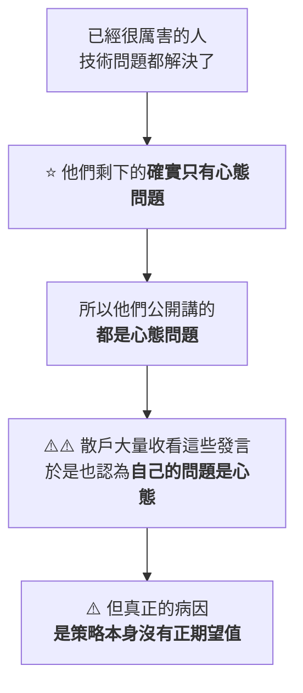
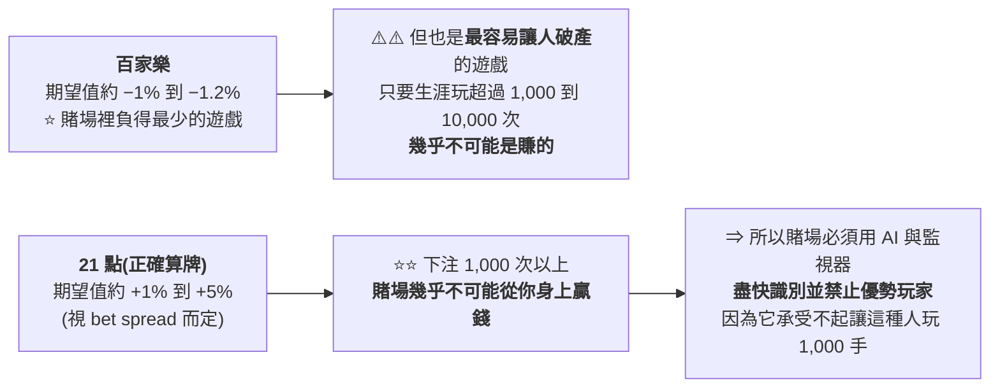
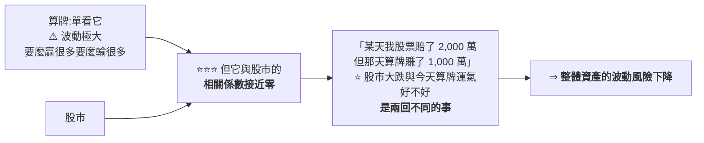

# 先找規則,再判斷哪個選擇更有利:正期望值、手割分析,與「技術問題被講成心態問題」

> ⚠️⚠️ **非投資建議。** 本文是對一支公開訪談的整理與查證,不含任何買賣建議。
> 整理自 YouTube 頻道 **【CMoney理財寶】官方頻道**〈[從考試高手到股市操盤,他靠同一套邏輯:先找規則,再判斷哪個選擇更有利｜ft.馬克羊【理財資優生】EP91](https://www.youtube.com/watch?v=SQMbCZH_5YY)〉(2026-09-07 發布,錄影時間 2026-08-27,約 51.6 分鐘,官方 zh-TW 字幕)。
> ⚠️ **立場揭露:節目為財經媒體製作,片中含「樊登說書 APP」與《Money錢》雜誌的推廣**;受訪者的收入、戰績等均為**自述**,無第三方佐證。
> ⭐ **可查證的數學與市場規則已比對公開資料,兩處需補正列於文末。**

---

## 一句話總結

> ⭐⭐⭐ **「大部分人在股市賠錢的原因,是他們本來就不是在執行一個正期望值的策略,
> 所以最後得出了負的結果 —— 而不是他有一個正期望值策略、因為心態不好而沒執行出來。」**
>
> **這句話推翻了「散戶賠錢是因為恐懼與貪婪」這個最流行的解釋。**

---

## 一、⭐⭐⭐ 全片最有價值的一段:技術問題,被講成心態問題

**主持人問的是「一般散戶在停利停損上的心理弱點」。受訪者直接否定了問題的前提:**

> **「其實什麼心態不好啊、恐懼貪婪啊,這些應該不是散戶最主要的問題。
> ⭐⭐ **是已經很厲害的交易者,比較會遇到心理的問題**。
> 大部分人的問題其實是技術的問題 ——
> ⚠️ **只是呢,技術不好說自己是心理問題,自己內心會感受比較好。**」**

### ⭐⭐⭐ 他的論證方式很漂亮:這是一個「倖存者發言」造成的錯覺

**他用兩個類比把這件事講透:**

| 類比 | 內容 |
|---|---|
| **籃球** | ⭐ **大部分人打輸的問題是運球不好、投籃不準、基本動作沒做好,不是心態不好。** ⚠️ 但你看到的是 NBA 球星說「季後賽罰球時我心態有點不穩」—— **那是因為他們的技術問題早就不存在了** |
| ⭐⭐ **微積分考試** | **你考很低分,主因不會是「一直粗心」,是你不會微積分。** 股市也是一個數學競技遊戲 |

> ⭐⭐ **另一個很銳利的觀察:「大部分人在玩這些金錢遊戲,其實是沒有一個完整的策略 ——
> 幾乎是憑感覺。那當然這也可以是一個策略,但它不是一個正期望值的策略。」**

📎 **本庫 [[retail-investor-losing-system-not-luck]] 的標題就是「不是運氣,是沒系統」——
⭐ 兩者結論一致,但這篇多提供了一個「為什麼大家會誤診」的機制解釋。**

---

## 二、⭐⭐⭐ 正期望值:小差距為什麼會被放大

**期望值(EV, Expected Value)= 你重複做一件事,平均會得到什麼結果。**

> ⭐ **他特別強調:「當然我們還是需要考慮它的標準差、波動、方差 —— 不過那是另外一回事。」**

### ⭐⭐⭐ 用兩個賭場遊戲說明「偏離零一點點就夠了」

> ⭐⭐⭐ **「這個期望值不需要偏離零很多,就足以讓這件事被放大。」**

📌 **這一段的價值在於:它把「期望值」從抽象概念變成一個有具體量級感的東西 ——
⚠️ **1% 的差距,在足夠多次的重複下,是「幾乎必然破產」與「賭場一定輸你錢」的差別。****

📎 **本庫 [[trading-math-expectancy-variance-risk]] 有完整的期望值數學(勝率 × 賺 − 敗率 × 賠、破產風險、部位大小);
⭐ 這篇補的是「量級直覺」與「為什麼賭場必須趕人」這個現實佐證。**

### ⚠️ 當沖的期望值怎麼問才對

**主持人問「當沖交易的期望值是多少」,他直接指出這個問題問錯了:**

> ⚠️ **「『當沖交易』是一個很空泛的問題,沒有辦法直接知道它的期望值。
> ⭐ **你必須說的是:某一個特定的策略、在什麼樣的期間** ——
> 那你才比較容易描述它的期望值、標準差、Sharpe ratio。」**

**而要知道一個策略有沒有正期望值,只有兩條路:**

| 路徑 | 說明 |
|---|---|
| ⭐ **它本身就是一個漏洞或套利** | **巧妙使用了某個規則** ⇒ 不需要回測也知道 |
| **否則** | ⭐⭐ **必須用統計方法回測**,得出期望值與風險報酬比 |

---

## 三、⭐⭐ 手割分析:一個可以直接用的決策工具

**「手割分析」是圍棋術語,意思是:**

> ⭐⭐⭐ **比較兩個選項時,**把完全一樣的部分去掉,只比較不一樣的部分**。**

### 甜心卡的例子(簡單到能看清結構)

| 選項 | 你付的錢 | 你拿到的東西 |
|---|---|---|
| **A** | **38 元** | 一杯咖啡 + 一杯雪碧 |
| **B** | **45 元** | 一杯咖啡 + 一杯雪碧 |

> ⭐ **兩邊拿到的東西完全一樣 ⇒ 消掉。只剩價格不同 ⇒ 付 38 元比較好。**

⚠️ **在甜心卡這個例子裡答案很明顯,但重點是方法:**

> **「如果在更複雜的事情 —— 你投入的東西有好幾個、最後得到的東西也有好幾個 ——
> **把一樣的部分刪掉、只比較不一樣的部分**,整個比較會方便很多。」**

📌 **他說這套方法他用在考試、下棋、選學校科系、人生各式各樣的選擇上。**
⭐ **適用條件很明確:當兩個選項有很多相似之處時。**

---

## 四、⭐⭐ 快速學習:為什麼「知道要克服弱點」還是學不快

**他給的方法是標準的刻意練習,但有兩個補充值得記:**

| 原則 | 內容 |
|---|---|
| **基本盤** | 知道自己的弱點是什麼 → 針對弱點練習 → **做有用的練習,而不是花很多時間練習** |
| ⭐⭐ **關鍵區分** | **為了進步而練習,而不是為了贏而練習** |
| ⭐ **用 AI** | 「AI 已經可以幫你找到這個世界上 98% 以上的知識;**這個世界上的祕訣、祕密真的非常非常少**」 —— 他的 21 點就是跟 AI 學的 |

### ⚠️⚠️ 但他誠實地指出一個前提,這是全段最重要的

**主持人追問:「我也知道要克服弱點、也知道要積極學習,但就是沒辦法快速學一個新領域。」**

> ⭐⭐⭐ **「快速學習一個新領域,很重要的重點是:**你原本就已經會很多領域**。
> 因為這個世界上大部分知識的概念都是互通的。」**
>
> ⚠️ **「如果沒有具備這樣的基礎,在學習上、或讓自己成為頂尖的可能性就會變小。」**

**而他認為最有用的那個基礎是:**

> ⭐⭐ **「數學邏輯 —— 如果會數學邏輯的話,學一個新領域會是最容易的。
> 因為你很容易就可以知道,**在更上位的抽象層次,它們相似的地方在哪裡**。」**

📌 **這一段的誠實之處在於:它沒有假裝「方法人人可用」,而是明說了門檻。**

---

## 五、⭐⭐ 翻轉階級的三條路:難度排序與一條判準

| 難度 | 路徑 |
|---|---|
| ⭐ **最簡單** | **投資** |
| 中等 | **嫁給或娶到一個有錢人** |
| ⚠️⚠️ **最困難** | **創業** —— 「創業要成功到可以翻轉階級,非常困難;**大部分人創業應該都是往下翻轉階級**」 |

### ⭐⭐⭐ 一條很狠但很實用的判準

> **「通常如果一個人**還需要去考慮**他要不要創業的話,通常就是不要。
> 因為他沒有確定自己做得很好,又沒有確定這件事有解決市場上的問題。
> 而且大概超過 99% 的創業最後都會倒閉。」**

### 換工作 vs 創業:兩個分開的問題

**要不要換工作,依序看三件事:**

| 順序 | 問題 |
|---|---|
| **1** | ⭐ **你實際上擅長的事是什麼** —— 有沒有達到這個領域的**前 10%**(有些說法是前 1%) |
| **2** | ⭐⭐ **這個專長能不能解決別人的痛點** —— 市場上其他人是不是真的需要 |
| **3** | 這件事是不是可以賺很多錢 |
| ⚠️ **排在最後** | **「自己是不是很喜歡這件事」** —— **如果目標是成功且賺錢,這件事的重要程度不高** |

⭐ **要不要創業,則主要看一件事:你創業這件事是不是真的有解決市場上的痛點。「大部分其實都沒有。」**

### ⚠️ 一個更根本的觀察

> ⭐⭐⭐ **「大部分人其實沒有很想要翻轉人生階級 —— 他們只是嘴巴上說說,
> 就像嘴巴上說『我希望學英文、我希望減肥、我希望讀很多書』,其實也沒到那麼想。」**
>
> ⭐ **「人不一定要每個人都賺很多錢、每天睡前讀 30 分鐘英文、吃得很健康、早睡早起 ——
> 大家不需要這樣。這只是醫生在診間給你的建議。」**

📌 **而他對小資族的建議也反直覺:「如果是存款低於 10 萬的小資族,那是完全不需要學投資。」**
**理由:**「投資畢竟還是一個用來拉大貧富差距、讓有錢人變更有錢的遊戲。」

---

## 六、⭐⭐⭐ 找規則漏洞:兩個真實案例

### 他的判斷法則

> ⭐⭐ **「如果這個遊戲規則**特別去定義一個判例**的時候,很容易發生遊戲規則漏洞。」**

### 案例一:處置股的五分盤 vs 期貨的連續交易

| 元素 | 狀態 |
|---|---|
| **兩檔高度連動的股票**(長榮、陽明) | **同時進入處置(當時為五分盤)** |
| **處置期間的股票** | ⚠️ **每 5 分鐘才集合競價成交一次** |
| ⭐ **它們的股票期貨** | **隨時都可以交易** |
| **理論關係** | 期貨與現貨的價格連動關係接近 100%(本質是同一個東西) |

> ⭐⭐⭐ **漏洞就在這個時間差:一個數字 5 分鐘才動一次,另一個一直在動。
> 你可以從「一直在動的那個」去觀察它與「5 分鐘才動一次的那個」之間的連動 ——
> 當這四個商品之間出現特定差異時,就去交易某一個商品。**

⚠️ **補正:台股處置制度已於 2026-08-10 改制**(見文末核實狀態),此案例描述的是**舊制情境**。

### ⭐⭐ 案例二:漲停鎖單與隔日沖 —— 他對規則公平性的批評

> ⭐⭐⭐ **「這個遊戲規則的主要漏洞是:**如果你鎖漲停,是接近不需要花任何錢的**。
> 你只需要花的是**額度**而已。然後你就可以讓市場上所有其他人都買不到這個股票。」**

**他的定性很重:**

> ⚠️⚠️ **「這是一個非常圖利有錢人的規則 —— 他只要證明他有非常多的資產、有很高的額度,
> 而且**還不需要特別花錢**,只需要用他的信用來委託額度。」**

**而隔天他有完全的選擇權:再鎖一根漲停、或者全部賣掉。**

#### ⭐ 那個比喻很精準

> **「有點像是一個下棋的遊戲,但是有錢人可以下幾步棋、而且完全禁止別人下某些棋。」**
>
> ⭐⭐⭐ **「就像是只要 LeBron James 摸一下他的球鞋,其他人就不能投三分球 ——
> 他可以用這件事做到什麼戰術是另一回事,但這個遊戲就非常不公平。」**

⚠️ **這是受訪者對市場規則的個人批評,本文原樣記錄,不做制度評價。**

---

## 七、⭐⭐⭐ 策略會過期:每年更新三到四次

> ⭐⭐⭐ **「無論是什麼策略,在股市的遊戲環境裡大概**兩年到三四年就一定會失效**,
> 因為遊戲的大環境一定會不停地改變。」**

⭐ **他用了一個遊戲圈的詞:meta(大環境);金融裡對應的詞是 regime。**

**環境改變的來源不只一種:**

| 類型 | 例子 |
|---|---|
| **時代背景** | AI 時代、高利率時代、崩盤時代、低利率時代、戰爭時代 |
| ⭐ **市場規則本身** | 「以前不是逐筆撮合交易」—— **交易機制會改** |
| **總經環境** | 「現在每月公布的美國經濟數據都會劇烈影響股市;⭐ **但如果回到低利率低通膨時代,公布 PPI、PCE 對股市的影響也會變得非常小**」 |

📌 **他的做法:每年大概更新三到四次策略組合。**

> ⚠️ **他也提醒這不是單純的參數縮放:「不一定是因為股市從一萬多點變成四萬多點,
> 所以你需要把參數放大 —— 不一定只是這麼單純的事情。」**

📎 **這與本庫 [[trading-math-expectancy-variance-risk]] 第二部記的「⚠️ 市場不是定態的,
這正是策略衰退的主因」完全一致 —— ⭐ 而這篇給了一個具體的維護頻率。**

---

## 八、⭐⭐ 指數投資「最簡單的策略」,難在哪裡

**他並不否定「存標普 500 三十年」這個策略 —— 但指出真正的難點不在策略本身:**

| 看似不用決定的事 | 實際上都要決定 |
|---|---|
| — | **要存多少總資產進去?留多少現金?** |
| — | **要不要貸款?** |
| ⚠️ **遇到緊急情況時,你賣得掉嗎?** | — |
| ⚠️⚠️ **過了 5 年還虧 20%、又剛好遇到戰爭爆發股市大崩,你會不會想賣掉?** | — |
| ⚠️ **股市大漲 50% 時,你會不會想先賣、希望低點接回來?** | — |

> ⭐⭐⭐ **「不管是大漲或大跌,大部分人只要**下注金額超過了他心裡能正常執行這個策略的尺度**,
> 他們就會很想要把自己的創意加進去。」**
>
> ⭐⭐ **「但數學遊戲通常是**創意越少越好**。」**

📎 **這與本庫 [[just-keep-buying-nick-maggiulli]] 的「把買不買變成不需要意志力的自動規則」
是同一個問題的兩種解法 —— ⭐ 那本書靠制度化,這裡靠「把部位縮到你能執行的尺度」。**

---

## 九、⭐⭐ 資產分散的判準是「相關性」,不是「波動大小」

**這是全片最反直覺、也最有價值的一段之一。**

> **「如果你的資金總共有十份,其中一份用來去拉斯維加斯算牌、有的在股市、
> 有的在房地產、有的在私人公司…… ⭐⭐ **那反而去算牌這件事,可以讓你資產的總體風險降低**。」**

### ⭐⭐⭐ 為什麼一個「波動極大」的項目反而降低整體風險

> ⭐⭐ **判準一句話:把資產分散在**相關係數比較低**的項目裡,而不是分散在「看起來比較穩」的項目裡。**

📎 **對照本庫 [[trading-math-expectancy-variance-risk]] 第二部的那個警告:
⭐⭐ **「三個動能策略跑在相關資產上 = 三倍部位而非三倍分散(相關 0.9 等於只有一個策略)」** ——
兩者是同一條原則的正反兩面。**

---

## 十、他的持倉方向(⚠️ 個人觀點,非建議)

| 項目 | 說法 |
|---|---|
| ⭐ **AI 產業鏈** | **大部分投資在此**;做法很簡單:**問 AI「整個 AI 產業鏈有哪些部分」,它會列出測試、封裝、散熱等每個環節的龍頭** → 再看產業報告(可跟營業員要券商報告)⇒ **懶得做分析就買各領域龍頭** |
| **HBM / 記憶體** | 提到 SK 海力士:認為股價相對其 2028–2029 預期獲利的 forward PE 仍在便宜位置;⭐ 論點是 **HBM 已是戰略物資,若不再是景氣循環股,估值會重評** |
| ⚠️ **比特幣** | **比較不看好** —— 「幾乎沒有內生性的價值……**有點像選舉的那種感覺**:持有的人全部都會非常看好,而且希望其他人也都非常看好」 |
| **美國國債** | 有配置。理由是金融理論以其為**無風險報酬基準**,且**持有到期不可能輸** |
| ⚠️ **股債平衡** | **「在高利率時代已經不是一個好方法 —— 因為股票跟債券可以一起下跌。」** |

⚠️⚠️ **以上全部是受訪者的個人看法與持倉,本文原樣記錄,不構成任何建議。
📌 特別提醒:「持有到期不可能輸」僅指名目本金與票息,**未計入通膨與匯率風險**。**

---

## 應用案例

### 案例 1|⭐⭐⭐ 自我診斷:我的問題是技術還是心態?

**照這三個問題問自己,答案通常很清楚:**

| # | 問題 | 如果答案是「沒有」 |
|---|---|---|
| **1** | **我有沒有一個寫得出來的策略?**(不是「憑感覺」) | ⇒ **技術問題** |
| **2** | ⭐⭐ **我知不知道這個策略的期望值是正是負?** | ⇒ **技術問題** |
| **3** | **我是用回測、還是用「它是個明確的漏洞或套利」來確認的?** | ⇒ **技術問題** |

> ⭐⭐⭐ **三題都答得出來、而且是正期望值,卻還是虧錢 —— 那才輪到談心態。**

### 案例 2|⭐⭐ 手割分析:下次做重大決定時實際跑一遍

**步驟:**
1. **把兩個選項的「投入」與「產出」各列成一張清單**
2. ⭐ **刪掉兩邊完全相同的項目**(這一步最省力)
3. **只比較剩下的差異**

📌 **例:比較兩個工作機會時,通勤時間一樣、產業一樣、都要加班 ⇒ 全部消掉;
⭐ 剩下的可能只有「薪水差 5 千」與「一個有明確的技術主管、一個沒有」——
決策瞬間變成只有兩個變數的問題。**

### 案例 3|⭐ 拿「策略會過期」去檢查自己的做法

| 檢查項 | 問自己 |
|---|---|
| **我現在這套做法是哪一年開始用的?** | ⚠️ **超過三年就該重新驗證** |
| **當時的市場環境(利率/通膨/交易機制)跟現在一樣嗎?** | — |
| ⭐ **我有沒有把「規則改了」也算進去?** | 例:台股處置制度 **2026-08-10 才剛改過**(見下) |

### 案例 4|⭐⭐ 用相關係數檢查你的「分散」是不是真分散

> ⚠️ **常見的假分散:台積電 + 聯發科 + 台股 ETF + 半導體 ETF ——
> 看起來四個標的,實際上高度相關,等於一個部位。**

⭐ **可操作的做法:把你的持倉兩兩算一下相關係數(或至少問自己「它們會不會同時跌」)。
如果答案是會,那就不是分散。**

---

## 重點回顧(TL;DR)

1. ⭐⭐⭐ **「散戶賠錢是因為恐懼貪婪」是誤診** —— 大部分是**技術問題**(策略本身沒有正期望值),只是說成心態問題比較好受。
2. ⭐⭐ **誤診的機制**:高手的技術問題早就解決了,所以他們公開講的只剩心態;散戶跟著學,就對錯了症。
3. ⭐⭐⭐ **期望值不需要偏離零很多,就足以被重複次數放大** —— 百家樂 −1% 是「賭場裡負最少」卻最容易讓人破產;21 點算牌只正一點點,卻讓賭場必須趕人。
4. ⚠️ **「當沖的期望值是多少」問錯了** —— 必須指定**特定策略 + 特定期間**;而確認方式只有兩條:它本身是漏洞/套利,或用統計回測。
5. ⭐⭐ **手割分析**:比較兩個選項時,**把完全相同的部分消掉,只比不同的**。
6. ⚠️ **快速學習有前提**:「原本就已經會很多領域」,而最有用的底層是**數學邏輯**(能看出上位抽象的相似處)。
7. **翻轉階級三條路的難度**:投資 < 嫁娶有錢人 < 創業;⭐ **「還需要考慮要不要創業的話,通常就是不要。」**
8. **換工作依序看**:是否達該領域前 10% → 能否解決別人痛點 → 能否賺錢;⚠️ **「自己喜不喜歡」排在最後**。
9. ⭐⭐ **找漏洞的法則:規則特別去定義一個判例時,容易有漏洞**(處置股五分盤 vs 期貨連續交易的時間差)。
10. ⚠️⚠️ **他對漲停鎖單的批評**:鎖漲停「接近不用花錢、只花額度」,卻能讓所有人買不到 ⇒ **圖利有錢人**(LeBron 摸球鞋別人就不能投三分的比喻)。
11. ⭐⭐⭐ **任何策略兩到三四年一定失效**(regime 會變),他每年更新三到四次策略組合。
12. ⭐⭐ **指數投資難的不是策略,是尺度** —— 部位一旦超過你能正常執行的尺度,你就會想加自己的創意;**而數學遊戲創意越少越好**。
13. ⭐⭐⭐ **資產分散看的是相關係數,不是波動大小** —— 一個波動極大但與股市無相關的項目,反而降低整體風險。

⚠️ **再次聲明:本文為訪談內容整理,非投資建議。**

---

## 核實狀態

### ✅ 已核實

| 說法 | 核實結果 |
|---|---|
| **百家樂期望值約 −1% 到 −1.2%** | ⭐ **屬實**:八副牌下,**押莊約 −1.06%、押閒約 −1.24%**(和局 −14.36%)—— 與他說的區間吻合 |
| **21 點算牌能把期望值轉正** | **屬實**(方向) |
| **算牌所需知識是公開的、數學家數十年前已解算** | **屬實**,基本策略與計數法早已是公開文獻 |
| **台股漲跌幅 ±10%** | **屬實**,且**股票類期貨與選擇權的漲跌幅亦同步為 10%** |
| **處置股採分盤集合競價** | **屬實**(舊制第一次處置為五分盤) |

### ⚠️ 需要補正

| 項目 | 補正 |
|---|---|
| ⚠️⚠️ **「21 點期望值正 1% 到 5%」偏高** | **公開資料的算牌長期優勢約為 +0.5% 到 +1.5%**;⭐ 基本策略(不算牌)可把賭場優勢壓到 0.5–1%。**5% 這個上緣遠高於一般文獻所載,可能指極端條件或特定規則下的短期情境,本文未能佐證。** |
| ⚠️⚠️ **「五分盤」已非現行制度** | ⭐ **台股處置制度於 2026-08-10 改制**:一般處置期間由 10 個營業日**縮短為 5 個**,撮合頻率由 5 分鐘/20 分鐘**統一加速為約每 2 分鐘**。📌 **受訪者描述的是舊制情境(且該案例發生於更早的航運股行情),現行制度下時間差已大幅縮小。** |

### ⚠️ 未能獨立查證(以受訪者自述看待)

- **學經歷與戰績**(建中數理資優班、國際科學奧林匹亞金牌、陽明醫學系、當沖年收入千萬、被拉斯維加斯所有賭場封殺)—— **全為自述,無第三方佐證。**
- **賭場「吃住部門與賭博部門分開」的運作細節**、凱撒與 MGM 集團的差異、被 MGM 追收費用 —— **屬個人經歷。**
- **長榮/陽明同時進處置時的套利操作細節與獲利** —— **未提供可驗證的交易紀錄。**
- ⚠️ **「鎖漲停接近不需要花任何錢,只需要額度」** —— ⭐ **本文未逐項核對券商的委託額度與保證金規則;實務上不同券商、不同商品(現股/當沖/融資)的條件差異很大,請勿直接套用。**
- **SK 海力士的 forward PE 與 2028–2029 獲利預期** —— **未核對任何財務預估。**
- **「超過 99% 的創業最後都會倒閉」** —— ⚠️ **屬概略說法;各國統計的創業失敗率因定義與年限而異,本文未核實此一數字。**
- **「AI 可以找到世界上 98% 以上的知識」** —— **屬修辭性說法,非可量測的主張。**

> ⚠️ **本文為對一支公開訪談節目的整理。節目本身含商業推廣,受訪者的績效與經歷均為自述。
> ⭐ 文中可查證的數學與市場規則已比對公開資料並標出兩處補正;其餘請以受訪者個人觀點看待。
> ⚠️⚠️ 非投資建議。**

---

## 來源

- [從考試高手到股市操盤,他靠同一套邏輯:先找規則,再判斷哪個選擇更有利｜ft.馬克羊【理財資優生】EP91 — CMoney理財寶](https://www.youtube.com/watch?v=SQMbCZH_5YY)(2026-09-07 發布,錄影 2026-08-27,約 51.6 分鐘,官方 zh-TW 字幕。⚠️ 節目含商業推廣)
- 核實用公開資料:
  - [百家樂 — Wizard of Odds(繁體中文)](https://zh.wizardofodds.com/games/baccarat/basics/)(莊 1.06% / 閒 1.24% / 和 14.36%)
  - [股民注意!證交所:處置股關禁閉縮短為 5 天、撮合改 2 分鐘 8/10 上路 — 鉅亨網](https://news.cnyes.com/news/id/6557274)
  - [處置新制是什麼?2026/8/10 新規定一次看懂 — 處置王](https://www.stockwarden.com/disposition-new-rules)
  - [臺灣期貨市場新制專區 — 放寬期貨市場漲跌幅度(臺灣期貨交易所)](https://www.taifex.com.tw/chinese/event/train1040414/event.asp)
  - [處置股票是什麼意思?跟全額交割股有什麼不同? — StockFeel 股感](https://www.stockfeel.com.tw/處置股票是什麼意思?跟全額交割股有什麼不同?/)
- 延伸:本庫 [[trading-math-expectancy-variance-risk]](期望值的完整數學與破產風險)、[[retail-investor-losing-system-not-luck]](散戶虧錢是沒系統不是運氣)、[[just-keep-buying-nick-maggiulli]](把決定自動化)、[[minervini-think-trade-like-champion]](控風險為核心)、[[social-arbitrage-chris-camillo]](另類資料與倉位紀律)、[[gooaye-stock-picking-philosophy]]。
