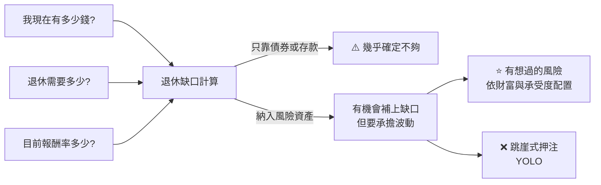

# 「不冒險才是最大的風險」?華爾街老將的退休數學、穩定幣收益,與「散戶打不贏機構」的事實

> ⚠️⚠️ **非投資建議。本文為知識整理,不構成任何買賣建議。文中所有數字請自行向官方來源查證。**
>
> 整理自 YouTube 頻道 **邦妮區塊鏈 Bonnie Blockchain**〈[寧願冒險,也不要100%窮困!華爾街老將算給你看:正在榨乾你未來的「退休大謊言」|John D'Agostino](https://www.youtube.com/watch?v=Xtc4JFO8jPA)〉(2026-09-23,約 43 分鐘,英語訪談;**依 YouTube 英文原音自動字幕整理**,可能有少量聽寫誤差)。主持:David、Bonnie Chang。
>
> ⚠️⚠️ **立場揭露(很重要):**
> 1. **受訪者 John D'Agostino 是 Coinbase 機構部門(Coinbase Institutional)策略長**——他談穩定幣收益、代幣化、加密資產配置時,**是在替自家公司的商業立場發言**(他自己也說「從貪婪的角度,短期我寧可自己留著收益」)。
> 2. **頻道說明欄附 Coinbase 推薦連結(註冊送 275 美元)**,片中另有 **ELSA 英語 App 業配段落**(約 12:00–13:30)。
> 3. 本文把**觀念**與**可查證的事實**分開整理,事實逐項對照一手來源(見 §8 核實總表)。
>
> **整理日期:** 2026-09-29

---

## 受訪者是誰

| 項目 | 內容 |
|---|---|
| **現職** | ✅ **Coinbase Institutional 策略長** |
| **經歷** | ✅ 前紐約商品交易所(NYMEX)策略主管,**參與把原油交易從喊價大廳(open outcry)轉成電子交易**;✅ 參與創建**杜拜商品交易所**(中東第一家石油交易所) |
| **其他** | ✅ Ben Mezrich 的書《**Rigged**》即以他的經歷為主角;兩個女兒 9 歲、12 歲,12 歲的女兒在紐約證交所經營兒童理財節目 **Children's Financial Network** |

---

## TL;DR

1. ⭐⭐⭐ **退休數學:** 「如果有 100% 的把握,光靠債券報酬你一定存不夠退休金,那**唯一比冒險更危險的,就是不冒險**。」——但要「**有想過的風險**」,不是跳崖。
2. ⭐⭐⭐ **「個人 AI 打不贏機構 AI」**:主持人問「15 歲小孩用 Claude 寫的交易機器人,能跟 Citadel 競爭嗎?」他的回答是**不能**——「你家裡有的,他們都有加強版,而且比你早好幾年。**你是羊群裡的綿羊,對上的是獅子**。」建議:**買入持有、投資 ETF**。✅ 學術研究支持這個結論(台灣、巴西的當沖研究與 SPIVA,見 §2.3、§8)。
3. ⭐⭐ **穩定幣收益:** 政府付給發行方約 4.5% 利息,銀行活存只給你 0.1%,**這個差距乘上一個孩子的成長期,就是一台車或一年學費**。Coinbase 主張把大部分收益還給用戶。⚠️ 這正是 Coinbase 的商業立場,且相關法案仍在角力中(見 §3)。
4. ⭐⭐ **泡沫不是代幣化造成的,是槓桿與人性造成的**;而且泡沫期往往伴隨技術突破。
5. ⭐⭐ **預測市場是「資訊市場」**:被篩選過、有利害關係的群眾很聰明;✅ 聯準會研究也發現 Kalshi 對 CPI、利率決策的預測不輸甚至優於傳統共識。
6. ⭐ **給孩子的一條規則:** 衝動購物前,把金額用 **6% 年化、20 年**算終值——「你要這個玩具,還是 20 年後的 120 美元?」

---

## 1. ⭐⭐⭐ 退休數學:為什麼「不冒險」反而最危險

### 1.1 債券撐不起 60/40 了嗎?

主持人的提問:美國債市從高利率時代開始走了幾十年的結構性多頭,10 年期殖利率一度跌到接近零;最近幾年債市表現很差,大家開始找東西**替代 60/40 組合裡的債券**。

> ⭐ D'Agostino:「**越來越多年輕美國人明白,不能靠儲蓄帳戶的利息撐起退休。**這自然會把你推向一件事:你必須承擔風險資產。問題只在於**哪一種**風險資產。」

### 1.2 疾病比喻

> 「假設有 100% 的把握,某個疾病 6 個月內會要你的命;有人拿來一個實驗療法,**有 50% 機率 6 個月內害死你**。每個人都會接受,因為這是很好的交易。
> 我說的是:**有 100% 的把握,你靠債券報酬存不夠退休金**——算一下就知道。」

> ⭐ 他給的具體做法:「**用白話問 Claude 三個問題:我有多少?退休需要多少?我現在的報酬率多少?它 30 秒就能幫你建好試算表。**」
> ⚠️ 同時強調:「**不要跳崖。**我從不 YOLO 任何東西,也不認為其他人應該。」「依你的風險胃口,投入**成比例**的錢。」

### 1.3 2027 年去哪找收益?(他的預測)

| 管道 | 他的看法 |
|---|---|
| **DeFi 收益** | 「我不認為我媽會去賺 DeFi 收益」,但會出現**中介機構包裝、審核協議品質**後的常態化產品 |
| **包裝型資產** | 比特幣等資產的 ETF 型產品內含收益 |
| **非美國人** | 透過**代幣化股票、包裝 ETF** 參與美國經濟;「希望全世界湊得出 5 美元的人,都能透過代幣化 S&P 500 押注美國」 |

---

## 2. ⭐⭐⭐ 事實焦點:散戶(與個人 AI)打不贏機構

### 2.1 訪談原話

> **主持人:**「世界最強的演算法交易公司、像 Citadel 這樣的基金,要怎麼跟一個拿 OpenClaw 或 Claude 寫出差不多機器人的 15 歲小孩競爭?」
>
> **D'Agostino:**「**我賣出這個說法。**祝你好運,長期跟 Citadel 競爭。我不管你有沒有 Claw、Claude 多強——**直到一切都由 agent 運作**。**就算那時候,agent 也不是生而平等的,我保證 Citadel 會有最好的 agent,Jane Street 會有最好的 agent。**」
>
> 「所以我總是說,**小心當沖**。**你是獅群中的綿羊**,這非常非常困難。**買入持有,投資 ETF。**我不認為你能競爭。**你家裡有的,他們都有加強版,而且比你早很多年就有了。**」

### 2.2 為什麼機構 AI 贏面大(本文整理)

| 面向 | 個人 | 機構(Citadel、Jane Street 等) |
|---|---|---|
| **資料** | 公開行情、新聞 | 付費另類資料、完整委託簿、更低延遲的行情 |
| **執行** | 零售券商路由 | 自建撮合連線、共置機房、規模化的交易成本優勢 |
| **模型** | 通用 LLM(大家都能用) | 通用 LLM **加上**多年累積的專有資料、回測基礎設施、風控 |
| **時間** | 業餘 | 全職團隊,他估計散戶「**每天至少盯 5 小時**」才談得上 |
| **時間差** | 剛開始用 | 「**比你早好幾年**就有了」 |

⭐ 關鍵邏輯:**通用 AI 工具是「大家都有」的東西,本身不會成為優勢**;優勢來自工具之外的資料、執行與資本——而那些正是機構領先的地方。

### 2.3 連專業基金都很難贏大盤

> 主持人:「有指數顯示散戶跑不贏那斯達克。」
> D'Agostino:「**我們也知道,75% 的避險基金跑不贏 S&P。**」

✅ **可查證的佐證(SPIVA,S&P 道瓊指數公司):**
- **2025 年單年:79%** 的美國主動型大型股基金**落後 S&P 500**(25 年紀錄中第四差的一年)。
- **15 年期:約 89.5%** 的大型股基金落後 S&P 500(截至 2024 年底)。
- 📌 他說的「75% 避險基金」是另一個族群(避險基金不在 SPIVA 範圍),本文未找到對應出處;但**方向**與 SPIVA 對共同基金的長期數據一致。

### 2.4 那大家為什麼還要試?

> 「我不評判。我覺得是**希望**、是**自尊**——人們想相信自己能打敗市場。就像為什麼有人買樂透?因為有人中過。」
> 「我相信每個人都該有自由去試。**用合理比例的財富去試**,也許是聰明的,因為我們都該有希望。**但一般來說,每天沒辦法盯盤至少 5 小時的一般投資人,投資集合型工具(比特幣 ETF 之類)會更好。**」
> 「但我不希望有法律規定人們怎麼用自己的錢。」

---

## 3. ⭐⭐ 穩定幣:給誰用?收益該給誰?

### 3.1 「37% 美國人連 500 美元存款都沒有,誰需要跨境匯款?」

> D'Agostino 的回答:穩定幣是給「**想在幾秒或幾小時內、而不是幾天內,確定錢在哪裡**」的人。
> 「我剛從一家美國大銀行匯款到另一家美國大銀行,**被收了 30 美元**——我還是那家銀行的好客戶。不管匯 500 還是 50 萬,同一套系統都收 30 美元。」
> ⭐ 「**一旦體驗過隨時、即時轉帳,要人退回去等銀行上班時間,就像要大家回到只能在戲院規定的時間看電影。**」

📌 ✅ **本文核實這個「37%」:** 出自聯準會家戶經濟福祉調查(SHED),但**原題是「能否用現金或等同現金支付一筆 400 美元的意外支出」**——**63% 可以、37% 不行,另有 12% 完全無法支付**。這不等於「37% 的人連 500 美元存款都沒有」,主持人的說法把題目簡化了。

### 3.2 收益爭議:Coinbase 的立場

> 主持人:「收益留給自己不是對 Circle 和 Coinbase 更好嗎?」
> D'Agostino:「**從短期、貪婪的角度?是。**但長期,我寧可在**大得多的餅裡拿小一點的一塊**。」
> 「政府付約 **4.5%** 利息,你只給客戶 **10 個基點(0.1%)**,這本質上就有問題。**0.1% 和 2.5–3% 的差距,乘上一個孩子的成長期,就是一台車、一年的學費。**」
> 「我們的目標是讓**十億人上鏈**——你要解決問題才做得到。」

**✅ 本文補充政策與數字背景:**

| 項目 | 現況 |
|---|---|
| **短天期美債殖利率** | 3 個月期美國國庫券 2026-09-28 約 **4.19%**(他說「約 4.5%」略高,可能是錄影時點不同) |
| **Coinbase 的 USDC 獎勵** | 報導指出約 **3.75%–4.5%**(依用戶等級),資金來自 Circle 以短期美債利息進行的營收分成 |
| **GENIUS Act** | 禁止**穩定幣發行方**支付利息,報導指 **2027 年 1 月生效**;但交易所等**第三方**發放的「獎勵」是否受限仍有爭議 |
| **CLARITY Act** | 原本要限制穩定幣獎勵;✅ **2026-09-15 參議院程序表決 49 比 50,未達 60 票門檻** ⇒ 獎勵暫時得以保留 |
| **Coinbase 立場** | Brian Armstrong 主張 Coinbase 不是發行方(USDC 由 Circle 發行),不應套用銀行式規則 |

> ⚠️ **讀這段要記得:** 銀行業反對的理由是「穩定幣獎勵會把存款從銀行吸走、影響放貸」;Coinbase 的論點是「把收益還給消費者」。**兩邊都有商業利益**,本文不判斷誰對。

### 3.3 USDT vs USDC:寡占而非壟斷

> 「我給 Tether 滿分——他們某天坐在房間裡說『**我們來把美國國債貨幣化吧**』,這是很聰明的點子。**穩定幣本質上就是代幣化的真實世界資產。**」
> 「這不是壟斷,是**寡占**:兩三個、最多四個由美債支撐的全球主流穩定幣。一個在東方主導、一個在西方主導,是健康的世界。」
> 「市場參與者**不喜歡壟斷,喜歡寡占**——要分散,但不要太分散,**流動性太碎就沒用**。」

### 3.4 他在 NYMEX 的經驗:為什麼他相信「餅會變大」

> 「我的第一份工作是把紐約商品交易所的喊價大廳電子化。當時反對的理由都很好:運作得很順、沒有交易出錯、我們在給全世界最有價值的商品定價……**他們很難想像一個比自己所處世界大那麼多的世界。**」
> 「那個市場現在是 **2002 年的 10 倍**大。」(⚠️ 本文未獨立核實此倍數)
> ⭐ 「從 **T+24 小時到 T+24 秒**,能釋放數千億美元資本。」

---

## 4. ⭐⭐ 代幣化會不會造成史上最大泡沫?

**Bonnie 的問題:** 台北一間公寓要花**平均家戶月收入的 185 個月**;像股票分割一樣把房子代幣化、碎片化,會不會吹出史上最大泡沫?

✅ **本文核實:** 台北市 2025 年**房價所得比約 15.41 倍**(= 約 185 個月),主持人的數字正確。

### D'Agostino 的回答:「造成泡沫的是槓桿,不是分銷方式」

| 論點 | 內容 |
|---|---|
| **泡沫的成因** | 「**過度亢奮 + 系統裡存在便宜的槓桿**」;改變買房與記錄產權的方式不會造成泡沫 |
| **一比一支撐的代幣化沒有槓桿** | 「在 NYMEX 買期貨,你本來就是 5 倍槓桿,還能再借錢。**別怪技術機制**;擔心泡沫就去看信用市場。」 |
| **2008 年** | 「區塊鏈那時連夢想都不是;那些 100 比 1 槓桿的受監管公司,是**違法與失職**。」 |
| **泡沫像颶風** | 引述與經濟學家 **Nouriel Roubini** 的合作(並特別說明不代表對方對加密的看法):泡沫是市場的固有部分,**是清洗市場結構的方式** |
| ⭐ **泡沫與創新** | 「我們做過一個小研究:**資產泡沫期間,相關技術的專利申請量會變成 4 倍**。」「我祈禱醫療科技出現泡沫——投資人會受傷,但我們會得到**階梯式的創新**。」(⚠️ 4 倍這個數字本文未找到出處) |
| **產權登記本身很落後** | 「我剛在紐約買了公寓,還得買**產權保險**,防止五年後有人說房子其實是他的——這就是紀錄保存太爛。」 |

> ⭐ 「**造成泡沫的是人性。**直到 agent 接手、移除所有情緒之前,我們都會有泡沫。」——但他也說:「**就算 agent 最終也會帶有人性特徵,容易追逐動能與非理性亢奮。**」

📌 **「區塊鏈是升級,不是競爭」**:他不認為區塊鏈與傳統金融是零和;「舊系統的某些部分會和區塊鏈**並存一輩子,甚至我們孩子的一輩子**」,就像你不會把家裡所有東西同時換新。代幣化股票一開始可能只給**價格曝險**,不含公司行動(股利、投票),「是演化,不是革命」。

---

## 5. ⭐⭐ 預測市場:賭博,還是資訊市場?

### 5.1 「有些是賭博」

> 「有些是,絕對是。但公平地說,**在紐約證交所買一檔虧損、沒有資產的雞蛋水餃股,算不算賭博?**」
> 「我們需要全國性地討論成年人該怎麼參與這些機會。以前要去拉斯維加斯才能下注,現在手機就行——這值得討論。**但底線是:成年人應該能自由運用可支配所得。**」

### 5.2 他真正在乎的是資訊價值

| 功能 | 例子 |
|---|---|
| **預測利率** | 「預測市場預測升降息**比頂尖民調機構更準**」 |
| **即時避險** | 「美國週六凌晨 2 點對伊朗發射飛彈,**你不必等到週一早上 9 點**才能在 Hyperliquid 上對沖原油曝險。」 |

✅ **本文核實:** 聯準會 FEDS 工作論文〈**Kalshi and the Rise of Macro Markets**〉(Diercks、Katz、Wright,2026 年 2 月)發現:
- Kalshi 對**整體 CPI 年增率**的預期,**統計上顯著優於 Bloomberg 共識**;核心 CPI 與失業率則與其他預測**相當**。
- 自 2022 年以來,Kalshi 分布的眾數在每次 FOMC **會議當天都完全命中**實際的聯邦基金利率。
⇒ 他的說法**方向正確**,但比較對象是「共識預測」與「利率期貨」,不是「民調機構」。

### 5.3 為什麼準:被篩選過的群眾

> 「**群眾沒那麼聰明,被篩選過的群眾才非常聰明。**」
> 「隨機 100 人解物理難題 → 很難;隨機 100 萬人 → 機率高一點但還是難;**100 位頂尖數學家與物理學家** → 機會大得多。」

| 機制 | 說明 |
|---|---|
| **廣度 + 深度 + 篩選** | 特定市場場所會吸引特定參與者,形成自然篩選 |
| **利害關係(skin in the game)** | 民調受訪者沒有利害關係,預測市場參與者有;他引 **Nassim Taleb**(「很討厭加密,但我們應該聽不同意見的人」)與**漢摩拉比法典**:橋樑倒塌就懲罰建造者(字幕誤作「Haminoptra's law」) |
| **會隨時間變準** | 「預測市場像期貨市場:1 月 1 日預測 12 月 31 日的油價**跟擲硬幣差不多**,但越接近事件越準。」**過程中的共識本身就有價值** |

> ⭐ 「我們應該叫它們**資訊市場**,而不是預測市場。」
> 「交易本來就是在不完美資訊下做決定——**有完美資訊就是內線交易**。知道一千萬人真實的看法,勝過晚餐時間打擾一千個人問問題。」

### 5.4 錢是不是從加密流向預測市場?

他的「投資人分層」理論:健康的市場需要**無聊的避險者、長期價值持有者、短期持有者、機構、散戶(懂的與不懂的)**,以及**一小群狂野的追險交易者**。
> 「那一群追求一夜 1 萬倍的迷因幣玩家,**本來就會追下一個熱點**;他們在早期很有用,但資產成熟後就不那麼重要。我們把他們輸給了預測市場,**但那不是 Coinbase 的核心用戶**。」

---

## 6. AI 相關的幾個觀點

| 主題 | 他的看法 |
|---|---|
| **AI 淘金潮誰賣鏟子?** | ⭐「**電力公司**。」「你以為比特幣很耗電?試試訓練 LLM。」還有電網、**電池技術**(物理學家朋友:「把能量塞進越來越小的空間,物理學上叫**炸彈**」) |
| **他自己的 AI 投資** | 「我比較投資**資料中心與電力**,因為我喜歡賣鏟子的模式。」 |
| **Anthropic 上市前股份** | 「最近銀行推銷給我 Anthropic 上市前的股份,估值約 8,000 億到 1 兆美元。平常我會笑,但看看市場規模,很難不認真考慮。」 |
| **AI agent 幫你交易?** | ⚠️ **他持懷疑態度**:「短期內不認為 AI agent 會替美國消費者做投資決策」——**不是技術問題,是法律責任與基礎設施**,就像自駕車 |
| **AI agent 幫你付款?** | ✅ 會:例如每月自動重下上個月在 Amazon 的雜貨訂單並付款,「**而且會用穩定幣**」 |
| **怎麼分辨 AI 詐騙?** | 開玩笑:「全身單一名牌、反戴棒球帽的成年男性。」正經答案:「**依風險胃口投入成比例的錢,別 YOLO。**」 |
| **孩子的 AI 教育** | 兩個女兒每週有「AI 配額」:**用 Claude 做兩個遊戲**(一個複習學過的、一個預習要學的),分享給同學;「學校只教他們 AI 很可怕」 |

**✅ 本文補充 Anthropic 背景:** 報導指 Anthropic 在 **Series H-1 以約 9,650 億美元估值**募資 650 億美元並已遞交 S-1,傳 2026 年 10–11 月上市。⚠️ 另外,Anthropic 曾在 2026 年 5 月**警告 8 個二級市場平台(含 Forge、Hiive)未經授權**,相關交易將被視為無效——**上市前股份的取得管道要特別小心**。

---

## 7. ⭐ 給孩子(與自己)的理財規則:6% 終值

> 「每次走進店裡想衝動購物,我讓她們把金額輸入手機裡的小試算表,**用 6% 年化報酬算 20 年後的價值**。然後問:『寶貝,你要這個,還是 20 年後的 120 美元?』」
> 「**大概 80% 的時候**她們選 120 美元。有時候選玩具——**那也沒關係,她們做的是有資訊的決定**。」
> 「12 歲的女兒現在心算就會了,還會記帳——**我以後得把那些錢給她**。」

**公式:** 未來值 = 現值 × (1.06)^20 ≈ 現值 × **3.21**
⇒ 「20 年後 120 美元」≈ 現在約 **37 美元**的東西。

> ⭐ 「**未來值與現值不是困難的概念,我們用術語把它弄得很複雜。**」
> 「學校在財商教育上做得很糟。」
> 他也提到孩子間流行的迷因——**未來的自己拍打窗戶、對著沒念書的青少年自己尖叫**:「孩子覺得好笑,我覺得難過。那代表一大群人希望能回到過去做聰明的決定,**但當年沒有人給他們彈藥**。」

**關於身分攀比:**
> 「我在史泰登島長大,媽媽打三份工、清廁所,爸爸打兩份工。我記得等路燈亮起時很難過——**路燈一亮,爸爸就得開車去做第二份工作**。」
> 「我不評判想努力工作、擁有玩具的人。我的『地位遊戲』是希望女兒拿全 A。**找出對你重要的東西,盡量回饋一點。**」

---

## 8. 事實核實總表

### ✅ 已核實

| 說法 | 核實結果 |
|---|---|
| 受訪者為 Coinbase Institutional 策略長、參與建立中東第一家石油交易所、《Rigged》主角 | ✅ 屬實 |
| 台北房價約為 185 個月家戶收入 | ✅ 2025 年房價所得比 15.41 倍 ≈ 185 個月 |
| 預測市場預測利率比傳統方法準 | ✅ 方向屬實(聯準會 FEDS 論文);比較對象是共識預測與利率期貨 |
| 絕大多數主動基金跑不贏大盤 | ✅ SPIVA:2025 年 79%、15 年期約 89.5% 落後 S&P 500 |
| 散戶當沖難以獲利 | ✅ 台灣全市場 15 年資料:**不到 1%** 的當沖客能穩定獲利;巴西:持續當沖 300 天以上者 **97% 虧損** |
| 原油曾經負價格 | ✅ 發生過(2020 年 4 月 WTI 期貨) |
| CLARITY Act 與穩定幣獎勵爭議 | ✅ 2026-09-15 參議院程序表決 49 比 50 未過 |
| Anthropic 上市前估值近兆美元 | ✅ 報導指 Series H-1 估值約 9,650 億美元 |

### ⚠️ 需修正或補充

| 說法 | 修正 |
|---|---|
| 「37% 美國人連 500 美元存款都沒有」(主持人) | 聯準會 SHED 原題是「**能否用現金或等同現金支付 400 美元意外支出**」:37% 不行,**12% 完全付不出來** |
| 政府付「約 4.5%」 | 3 個月期國庫券 2026-09-28 約 **4.19%** |
| 原油「不到 3 年前」是負的 | 實際是 **2020 年 4 月**,距今約 6 年半 |
| 「大家在擔心原油 130 美元」 | 2026-09-28 **Brent 約 105 美元、WTI 約 92.6 美元**;可能指錄影時或更早的高點,本文未確認 |
| 債市「從 70 年代中期」的結構性多頭(主持人) | 10 年期美債殖利率高點在 **1981 年**(約 15.8%),多頭一般從 1981 年起算 |

### ❓ 未能獨立核實

「75% 避險基金跑不贏 S&P」的出處、「泡沫期專利申請量 4 倍」的研究、NYMEX 原油市場「比 2002 年大 10 倍」、「銀行跨行匯款收 30 美元」(個人經驗,屬常見費率區間)。

---

## 9. 應用案例

### 案例一:用他的三個問題做退休缺口試算

假設 35 歲、目前存款 200 萬台幣、每月可存 2 萬、65 歲退休、退休後每月需要 5 萬(今日幣值)、預期活到 90 歲:

**所需金額粗估:** 每月 5 萬 × 12 × 25 年 ≈ **1,500 萬(今日幣值)**;若通膨 2%,30 年後每月 5 萬相當於約 9 萬,名目上約需 **2,700 萬**(未計退休後的投資報酬)。

| 情境 | 年化報酬 | 65 歲時約累積(名目) | 結論 |
|---|---|---|---|
| 全放定存 | 1.5% | 約 1,210 萬 | ⚠️ 連今日幣值的 1,500 萬都不到 |
| 60/40 股債 | 5% | 約 2,460 萬 | 接近但仍低於考慮通膨後的約 2,700 萬 |
| 全球股票 ETF | 7% | 約 3,790 萬 | 有機會達標,但**要承受 30–50% 的回撤** |

> 做法:把上面三個問題丟給 AI 建試算表,並調整通膨與退休後報酬的假設重算。重點不是算出精確數字,而是看清楚「**不冒險的確定結果**」與「**冒險的可能結果**」差多少。⚠️ 以上數字為示意,非投資建議。

### 案例二:在考慮「自己寫 AI 交易機器人」之前

| 檢查項目 | 問自己 |
|---|---|
| **優勢從哪來?** | 我的資料、執行速度、模型,哪一項是 Citadel / Jane Street 沒有的? |
| **成本算進去了嗎?** | 手續費、滑價、API 與資料費、我的時間 |
| **基準是什麼?** | 同期間買入持有大盤 ETF 的報酬是多少?我的回測有打敗它嗎? |
| **能投入多少?** | 他的建議:**只用「合理比例」的錢**當作學習與嘗試 |

> ⭐ 如果答不出第一題,研究顯示結果大概率會落在「不到 1% 能穩定獲利」之外。

### 案例三:在家實作「6% 終值」遊戲

- 手機建一個試算表:A 欄輸入金額、B 欄 `=A1*1.06^20`。
- 孩子(或自己)想衝動購物時先輸入,再決定。
- 一年後回頭看:**選「未來的錢」的比例有沒有變高?**

### 案例四:看到「穩定幣收益 4%」時先問三件事

1. **誰付的?**(發行方?交易所?)——法規對兩者待遇不同,可能改變。
2. **錢放在哪?**(交易所帳戶 ≠ 銀行存款,**沒有存款保險**)
3. **收益來源是否穩定?**(來自短期美債利息,**降息時會跟著降**)

---

## 來源

- YouTube:[寧願冒險,也不要100%窮困!華爾街老將算給你看:正在榨乾你未來的「退休大謊言」|John D'Agostino](https://www.youtube.com/watch?v=Xtc4JFO8jPA)(邦妮區塊鏈 Bonnie Blockchain,2026-09-23)——依英文原音自動字幕整理
- 聯準會 SHED:[Report on the Economic Well-Being of U.S. Households in 2025 — Savings and Investments](https://www.federalreserve.gov/publications/2026-economic-well-being-of-us-households-in-2025-savings-investments.htm)
- 聯準會 FEDS 工作論文:[Kalshi and the Rise of Macro Markets](https://www.federalreserve.gov/econres/feds/files/2026010pap.pdf)([NBER 版本](https://www.nber.org/system/files/working_papers/w34702/w34702.pdf))
- SPIVA:[U.S. Persistence Scorecard Year-End 2025](https://www.spglobal.com/spdji/en/spiva/article/us-persistence-scorecard/)、[InvestmentNews 報導](https://www.investmentnews.com/equities/active-managers-stumble-again-in-2025-as-large-caps-dominate/265541)
- 當沖研究:[Chague, De-Losso & Giovannetti — Day Trading for a Living?](https://www.scribd.com/document/486266428/Chague-Losso-Giovannetti-47WP)、[Day trading(Wikipedia,含 Barber, Lee, Liu & Odean 台灣研究)](https://en.wikipedia.org/wiki/Day_trading)
- 穩定幣政策:[CNBC — Circle jumps on Clarity Act compromise](https://www.cnbc.com/2026/05/04/circle-jumps-16percent-on-clarity-act-compromise-that-preserves-stablecoin-rewards.html)、[24/7 Wall St. — Why did the CLARITY Act's failure keep stablecoin rewards alive](https://247wallst.com/investing/cryptocurrency/2026/09/18/what-is-a-stablecoin-reward-and-why-did-the-clarity-acts-failure-keep-it-alive/)、[CoinDesk — Coinbase rewards loophole](https://www.coindesk.com/policy/2026/03/19/coinbase-faces-a-multibillion-dollar-threat-from-d-c-but-a-rewards-loophole-could-protect-its-stablecoin-revenue)
- 國庫券殖利率:[Trading Economics — US 3 Month Bill Yield](https://tradingeconomics.com/united-states/3-month-bill-yield)
- 油價:[CNBC — Oil price today(2026-09-28)](https://www.cnbc.com/2026/09/28/oil-price-today-wti-brent-trump-iran.html)
- 台北房價所得比:[Global Property Guide — Taiwan](https://www.globalpropertyguide.com/asia/taiwan/price-history)
- Anthropic 上市:[CNBC — Anthropic moves closer to mega-IPO](https://www.cnbc.com/2026/07/15/anthropic-ipo-banks-investor-meetings.html)、[Forge — Anthropic IPO](https://forgeglobal.com/insights/anthropic-upcoming-ipo-news/)
- 受訪者:[John D'Agostino(Wikipedia)](https://en.wikipedia.org/wiki/John_D%27Agostino_(financial_services))、[CoinDesk 2026-04 訪談](https://www.coindesk.com/business/2026/04/21/coinbase-s-john-d-agostino-says-exchange-stands-alone-as-crypto-s-full-service-prime-broker)

📎 相關筆記:[[retail-investor-losing-system-not-luck]]、[[just-keep-buying-nick-maggiulli]]、[[trading-math-expectancy-variance-risk]]

> ⚠️⚠️ **再次提醒:非投資建議。** 受訪者任職於 Coinbase,談加密資產與穩定幣時有利益關係;任何決策請以自己的財務狀況與風險承受度為準。
