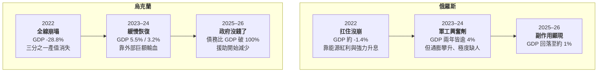
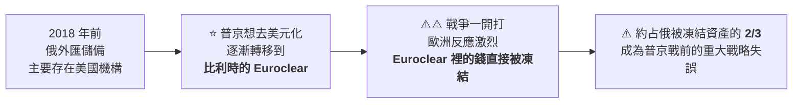
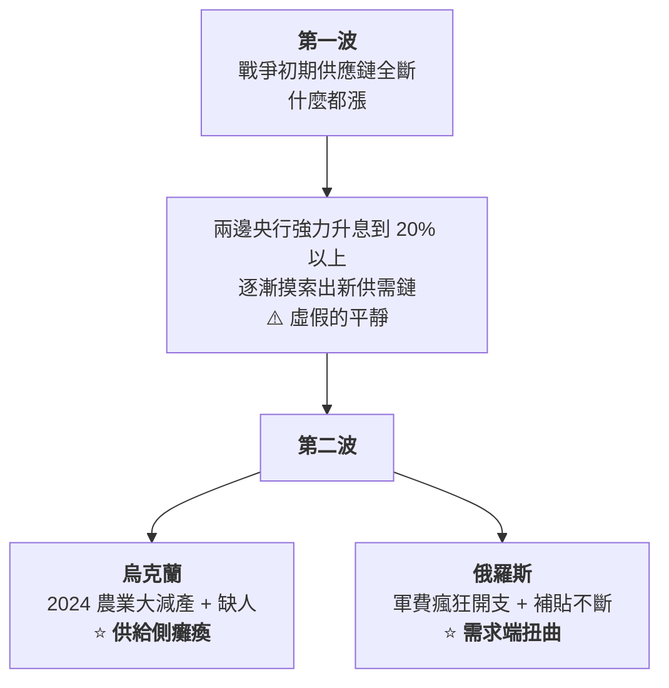
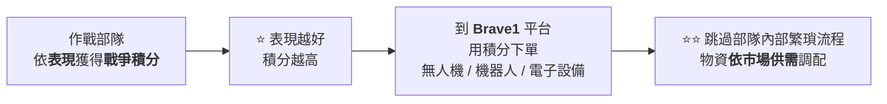

# 俄烏戰爭打了四年,到底誰在買單:兩國經濟的「內傷」與「外懸」

> ⚠️⚠️ **非投資建議。本文為知識整理,不構成任何投資或政治立場。**
>
> 整理自 YouTube 頻道 **小Lin说**〈[【硬核】俄乌打了四年多,到底谁在买单?](https://www.youtube.com/watch?v=R1-j8TFlqCo)〉(2026-09-22,約 30 分鐘,官方中文字幕)。
>
> ⚠️ **立場揭露:該片中段有 Saily eSIM 業配段落**(附專屬優惠碼與導購連結),與主題無關,本文不轉述。
>
> ⭐ **本文已對 Rosstat 修訂數據、[IMF 官方新聞稿](https://www.imf.org/en/news/articles/2026/02/26/pr-26066-ukraine-imf-executive-board-approves-usd-8point1-billion-under-an-eff-arrangement)、[Kiel Institute 援助追蹤](https://www.kielinstitut.de/topics/war-against-ukraine/ukraine-support-tracker) 核實關鍵數字**(見文末核實狀態)。
>
> ⚠️⚠️ **關於傷亡數字:本文照錄影片給的估算區間,但必須強調 —— 雙方都會少報己方、多報對方,第三方只能從外圍估算,**不確定性極大**。**

---

## 一句話總結

> ⭐⭐⭐ **「這場戰爭兩邊都是在用**借來的資本**在打 ——
> 俄羅斯借的是自己日益見底的儲備,烏克蘭借的是西方隨時可能斷流的援助。
> **一邊是軍工膨脹、民生萎縮的內傷;一邊是援助一停就立馬停擺的外懸。**」**

---

## 一、⭐⭐ 四年的大輪廓

> ⭐⭐ **影片的總結:**
> **「俄羅斯的故事:被制裁衝擊 → 靠能源扛住 → 轉型戰時經濟 → 增長開始透支。**
> **烏克蘭的故事:先是經濟崩潰 → 靠輸血續命 → 繼續靠輸血續命 → 逐漸喪失自我造血能力。」**

### ⭐ 一個容易被忽略的背景:烏克蘭開戰前就已經「亞健康」

> **「你可別覺得烏克蘭離德國不遠,經濟就該跟意大利差不多 —— 完全不是。」**

| 人均 GDP 相對位置(影片轉述) |
|---|
| **俄羅斯 ≈ 不到義大利的一半** |
| **烏克蘭 ≈ 不到俄羅斯的一半** |

⭐ **從 2014 年頓巴斯衝突起,烏克蘭經濟就已開始破碎 —— 所以有人說這場戰爭從那時就開始了。**

---

## 二、⭐⭐⭐ 最底層的衝擊:人

### 2.1 ⚠️ 傷亡(⚠️⚠️ 極度不確定的估算區間)

| | **烏克蘭** | **俄羅斯** |
|---|---|---|
| **軍隊陣亡** | **10–15 萬** | **20–30 萬**(含各種相關武裝力量) |
| **平民已確認死亡** | **約 1.5 萬** | **約 1 千** |
| **傷亡總計(含受傷)** | **50–70 萬** | **100–150 萬** |

> ⚠️⚠️⚠️ **影片自己也強調:「這些數字是我參考了各種信源之後大致估的範圍,具體肯定不保準。」**
> **例:烏克蘭軍隊陣亡,澤連斯基說 5.5 萬、BBC 估約 20 萬,差好幾倍。**

### 2.2 ⭐⭐⭐ 比傷亡打擊更大的:人口流離

| 數字 | 意義 |
|---|---|
| ⚠️⚠️ **約 1,600 萬人流離失所** | **戰前烏克蘭總共才 4,100 萬人 —— 全國約 40% 人口被迫在短時間內搬家** |
| **其中約 600–800 萬人離開烏克蘭** | **大多到德國、波蘭註冊成難民** |
| ⭐ **約 100 萬人去了波蘭** | **影片稱為 2025 年波蘭經濟貢獻約 2.7% GDP** |
| ⚠️⚠️⚠️ **戰後非作戰勞動力減少 40%** | ⭐⭐⭐ **「這個才是烏克蘭經濟面臨崩潰的底層原因」** |

> ⭐⭐⭐ **關鍵不對稱:**
> **「兩邊打仗需要消耗差不多同等級別的資源、金錢、人力。但俄羅斯人口是烏克蘭的 3.6 倍、GDP 是 10 多倍。**
> **資源、金錢、武器,歐美還能支援 —— ⚠️ **但人員,歐美可捨不得給**。」**

### 2.3 ⭐⭐ 俄羅斯的問題相反:失業率**太低**

> ⭐⭐ **影片解釋了一個很多人沒想到的概念:**
> **「失業率不是越低越好。健康經濟體的**自然失業率**大約在 4–6%。
> **持續低於自然失業率,說明整個經濟體因為過度缺人,動作有點變形了 —— 這也是經濟過熱的表現。**」**

**⭐ 俄羅斯缺人的後果:**

| 現象 | 數字(影片轉述) |
|---|---|
| **勞動報酬占 GDP 比重** | **戰前 41% → 2025 上半年 50.2%** |
| **全國多個職業平均薪資** | **紡織女工、機床工人、外送員、卡車司機這幾年平均翻倍** |
| **合約兵薪資** | **漲到一般人工資的 3–5 倍** |
| ⚠️ **向朝鮮要人** | **2024 年俄朝簽全面戰略夥伴關係條約後,朝鮮作戰部隊至少去了 1 萬人、勞工 5–10 萬人**(⚠️ 未核實) |

> ⭐ **俄央行行長納比烏林娜多次公開說過:**勞動力短缺是俄羅斯目前經濟過熱的主要原因**。**

---

## 三、⭐⭐⭐ 錢:俄羅斯的財政與那 3,000 億美元

### 3.1 軍費占 GDP

| | 戰前 | 目前 |
|---|---|---|
| **俄羅斯** | **約 3.7–4%(2021)** | **約 7–7.5%(2025)**,有機構預測超過 10% |
| ⚠️⚠️ **烏克蘭** | — | ⚠️⚠️ **約 35%,有的統計達 40%** |

> ⚠️⚠️ **影片說得很直白:「也就是說,**全國所有的產出,有 1/3 是純用在戰爭的消耗上**。」**

### 3.2 ⭐⭐⭐ 被凍結的 3,000 億美元怎麼了

**⭐ 一個戰略失誤的故事:**

### ⭐⭐ 怎麼處理:一個「非常精巧的妥協」

| 立場 | 誰 | 主張 |
|---|---|---|
| **最激進** | **美國、波蘭、加拿大** | **全部沒收,全都給烏克蘭** |
| ⚠️ **反對直接沒收** | **比利時、法國、德國、歐洲央行** | **「主權資產在歐盟體系裡是神聖不可侵犯的 —— 真沒收了,砸的是歐洲自己的名聲與招牌」** |

**⭐⭐ 結果:**

| 做法 | 內容 |
|---|---|
| **本金** | ⭐ **凍結著,不動** |
| **利息** | ⭐⭐ **「本金神聖不可侵犯,但利息就沒那麼神聖了 —— 屬於非常規利潤,強制上繳轉給烏克蘭」**;影片稱截至 2025 年底已轉約 **150 億歐元** |
| ⭐ **2024 年 G7 方案** | **用未來利息流做擔保,貸款 500 億美元給烏克蘭** |
| ⚠️ **更激進的方案** | **直接拿本金做抵押發貸款 —— **比利時堅決不同意,沒通過**** |

> **影片估計:透過各種方式拿走、給到烏克蘭的規模總計約 750 億歐元。**(⚠️ 未核實)

### 3.3 ⭐⭐ 錢從哪來:主權基金與黃金

| 項目 | 開戰前(2021) |
|---|---|
| **外匯儲備** | **約 6,000 億美元** |
| **主權基金** | **約 1,900 億美元** |

> ⚠️ **一開打,約一半的外匯儲備直接被凍結 —— 俄羅斯不得不動用主權基金填補窟窿。**
> **主權基金本來是「留著養老的錢」,所以這是非常無奈的。**

**⭐⭐⭐ 但一個有趣的轉折:**

> **主權基金 2022–23 年花得非常厲害,**2025 年卻一年內上漲將近 50%** ——
> ⭐ 不是找到新的賺錢路子,**是因為它持有約 500 噸黃金,而黃金一年內翻了一倍多**。**

> ⭐⭐⭐ **影片的觀察:「靠能源吃了一波紅利、靠黃金暴漲又吃了一波紅利 ——
> **這就是對沖風險的重要性**。這其實也是它能扛住西方大規模制裁的一個重要原因。」**
>
> ⚠️⚠️ **但反過來:帳面價值再好看,也掩蓋不了持續惡化的財政 ——
> **流動資產逐漸見底,甚至在 2024 年底賣了 48% 的黃金**。
> ⭐ **「政府公布的財政數據不一定真實,但黃金都賣了,這從側面反映出財政的緊張程度。」****

---

## 四、⭐⭐⭐ 錢:烏克蘭拿了多少援助、誰給的

| 項目 | 數字(影片轉述) |
|---|---|
| **截至 2026 年初直接援助總額** | **約 3,500 億歐元,相當於其 GDP 的兩倍** |
| **美國占比** | **33%** |
| **歐洲占比** | **59%** |

> ⭐ **Kiel Institute 核實補充:美國在拜登政府期間(2022–2024)承諾了近 1,350 億美元(約 1,150 億歐元)的政府援助;
> ⚠️ 川普 2025 年初重返白宮後,**美國支援實質停滯,沒有新的重大撥款**。**

> ⭐⭐⭐ **影片最重要的一個觀察:**
> **「現在打到消耗戰,表面上是俄羅斯跟烏克蘭在打 ——
> 但烏克蘭經濟已經完全被掏空了,**背後其實已經在消耗整個歐洲的經濟**。」**

📌 **影片提到的其他援助:歐盟通過了一個 **900 億歐元**的援助借款方案;美烏簽了**礦產協議**(用資源換援助)。**

### 4.1 ⭐⭐⭐ IMF 那筆貸款:錢不多,但它是「鑰匙」

**⭐ 已核實(IMF 官方新聞稿):2026-02-26,IMF 執董會批准烏克蘭新的四年期擴展基金安排(EFF),**81 億美元**,立即撥付 15 億美元。**

> ⚠️ **看起來 81 億跟歐美的上千億比是毛毛雨 —— 而且利率還不低,附帶非常嚴苛的條件**
> **(政府赤字上限、擔保上限、稅收下限、外匯儲備使用限制)。**
>
> **那烏克蘭為什麼要答應?**

> ⭐⭐⭐ **影片的解釋:IMF 這筆借款最大的價值不是錢,是**背後的象徵意義**。**
> **其他援助國擔心烏克蘭拿到錢亂花,又沒辦法天天盯著 —— 但 IMF 可以,它會給嚴格限制並監督執行。**
> **⭐ 「所以 IMF 這個貸款,相當於**其它援助的一個開門的鑰匙**。」**

**⭐⭐ 本文核實補強:IMF 官方新聞稿明寫這筆 EFF 是一個 **總額 1,365 億美元國際支援方案**的一部分** ——
⭐ **81 億撬動 1,365 億,正好是「鑰匙」這個說法的最佳佐證。**

> 📌 **影片還提到:有些援助合約(如以凍結資產利息擔保的 ERA 貸款)白紙黑字寫著「IMF 項目正常進行是援助的先決條件」。**
> **這也解釋了一個看似矛盾的現象:**烏克蘭明明極度缺錢,外匯儲備卻還在持續上升** —— 因為 IMF 不讓它隨便用。**

---

## 五、⭐⭐⭐ 通膨:兩邊都有,但原因完全相反

| | **烏克蘭** | **俄羅斯** |
|---|---|---|
| **通膨成因** | ⭐ **供給衝擊**(產不出來) | ⭐ **需求扭曲**(軍工拉動) |
| **對 GDP** | **供給不足 ⇒ GDP 上不來** | **過熱 ⇒ GDP 更高** |
| ⭐⭐⭐ **性質** | **短期的急症** —— 對民眾生活打擊更大 | ⚠️⚠️ **長期的慢性病** —— 扭曲整個經濟結構、過度軍工化,**更底層、更難恢復** |

> ⭐⭐ **所以大趨勢上兩邊都經歷了通膨的**雙峰走勢**,但底層原因**完全是反的**。**

### ⭐ 兩邊的央行表現都「可圈可點」

| 央行 | 做了什麼 |
|---|---|
| **俄羅斯(納比烏林娜)** | ⭐ **2022 年把利率從 9.5% 暴力拉到 20%,加上強制結匯、資本管制,穩住盧布;2024 年通膨近 10% 時又拉到 21%** |
| ⭐⭐ **烏克蘭** | **戰爭初期 IMF 多次建議「應該讓貨幣貶值、不應外匯管制」 —— **烏克蘭央行沒聽,還成功控制住了通膨**;IMF 後來 180 度大反轉稱讚它做得很好** |

> ⭐ **共性:**非常強硬、非常果斷** —— 加息果斷,同時都採取非常強硬的外匯管制。**

📌 **影片提到的一個人物細節:俄央行行長納比烏林娜被稱為「普京的救火隊員」,據彭博社報導她在 2022 與 2024 年兩次遞辭呈都被拒絕。**(⚠️ 本文未核實)

---

## 六、⭐⭐ 唯一「憑空長出來」的明星產業:無人機

> ⭐ **據估算,無人機造成的傷亡約占俄烏戰爭總數的 2/3。**(⚠️ 未核實)

### ⭐⭐⭐ 為什麼便宜這件事這麼重要

| | 成本 |
|---|---|
| **愛國者防空飛彈攔截一次** | **約 400 萬美元** |
| ⚠️⚠️ **伊朗設計的「沙赫德」自殺式無人機** | **約 5 萬美元** |

> ⭐⭐ **「400 萬打 5 萬,你說你是攔是不攔?」** —— 這就是「大砲打蚊子」。
> ⭐ **目前的對策是**攔截式無人機**,讓無人機去對付無人機。**

### 6.1 俄羅斯:阿拉布加無人機廠

| 項目 | 內容(⚠️ 影片轉述,未核實) |
|---|---|
| **2023 年與伊朗秘密合約** | **約 17.5 億美元、6,000 架,並要求技術轉移、培訓與製造設備** —— **「不光從你那買,還得教我怎麼造」** |
| **廠址** | **離俄烏邊境約 1,300 公里的經濟特區阿拉布加** —— 原本西方跨國公司設廠,戰爭開打外資撤離後廠房全空 |
| **規模** | **原計畫 810 人三班倒 → 擴張到約 1.5 萬人,宿舍可容納 4.1 萬人** |
| **產量** | **2025 年接近 6 萬架** |
| ⭐ **單架成本** | **從約 20 萬美元降到約 5 萬美元,甚至開始反向出口到伊朗** |
| ⚠️ **人力來源** | **朝鮮勞工至少一兩萬被分到這裡;還大量招收學生甚至未成年人,專門針對非洲女性招人** |

### 6.2 ⭐⭐ 烏克蘭:三年做成全世界最成功的無人機帝國

| 項目 | 數字(影片轉述,⚠️ 未核實) |
|---|---|
| **戰前年產量** | **約 3,000 架** |
| **2026 年預計** | **約 1,000 萬架** |

**⭐⭐⭐ 最有意思的一個制度設計:Brave1**

> **烏克蘭政府做了一個**線上購物平台**,官方定義是「連接烏克蘭軍方與開發商的線上平台」。**

> ⭐ **「好傢伙,這仗打的都搞成互聯網創新了。」**

---

## 七、⭐⭐ 影片的立場聲明,本文照錄

> ⭐⭐ **「我挑這些俄烏兩邊圍繞軍工、圍繞無人機有意思的玩法,也是想**盡量不帶主觀評價** ——
> 就是想讓你形象地感受一下,軍工和經濟的結合,可能比你想像的要緊密得多。」**
>
> ⭐⭐⭐ **「我做這段影片的目的,**不是去比較誰輸誰贏**,而是能讓大家更清楚地看到戰爭的成本。
> 這帳不管怎麼算,最後的結論永遠都一樣:**經濟的傷口或許可以慢慢恢復,但是有些代價可能永遠都補不回來**。」**

---

## 應用案例:三個可以帶走的分析框架

### 案例 1|⭐⭐⭐ 看通膨時,先分「供給側」還是「需求側」

> ⭐⭐⭐ **同樣是通膨,原因相反,後果也相反。**

| 判斷 | 看什麼 | 意涵 |
|---|---|---|
| **供給衝擊型** | **產量下降、進口中斷、勞動力流失** | ⭐ **短期急症:升息治不了產能,但供給恢復後會自然回落** |
| **需求扭曲型** | **政府支出暴增、補貼、特定部門過熱** | ⚠️⚠️ **長期慢性病:結構被扭曲,即使數字回落,經濟底子已經變形** |

⭐ **可以類推:任何國家/地區的通膨新聞,都可以先問一句「這是供給面還是需求面?」—— 答案決定了你該預期它怎麼收場。**

### 案例 2|⭐⭐ 「失業率太低」也是警訊

> ⭐⭐ **自然失業率約 4–6%。持續低於它,不是「經濟太好」,是「經濟過度緊繃」。**

| 訊號 | 可能意義 |
|---|---|
| **失業率持續遠低於自然失業率** | **勞動力短缺、薪資螺旋上升** |
| **勞動報酬占 GDP 比重快速上升**(俄:41% → 50.2%) | ⚠️ **企業被迫高價搶人,利潤被擠壓** |
| **央行一再強調「勞動力短缺」** | ⭐ **這是過熱的主要成因,不是繁榮的證據** |

### 案例 3|⭐⭐⭐ 別只看援助金額,看「誰是鑰匙」

> ⭐⭐⭐ **IMF 81 億美元 vs 歐美上千億 —— 規模差一個數量級,但它撬動了 1,365 億的國際總包。**

**⭐ 這個邏輯可以類推到很多地方:**

| 場景 | 「鑰匙」是什麼 |
|---|---|
| **新創融資** | **知名領投方** —— 它投多少不重要,它投了其他人才敢跟 |
| **主權債發行** | **信評機構評級、IMF 項目** |
| **聯貸案** | **主辦行的承諾與盡調** |

> ⭐⭐ **關鍵問題不是「誰出最多錢」,是「誰的背書讓其他人願意出錢」。**

---

## 重點回顧(TL;DR)

1. ⭐⭐⭐ **兩邊都在用借來的資本打仗**:俄羅斯借自己日益見底的儲備,烏克蘭借西方隨時可能斷流的援助 —— **一邊是內傷,一邊是外懸**。
2. **俄羅斯四年軌跡**:2022 **扛住沒崩**(GDP 約 -1.4%)→ 2023–24 **軍工興奮劑**(GDP 兩年皆逾 4%)→ 2025–26 **副作用顯現**(回落至約 1%)。
3. **烏克蘭四年軌跡**:2022 **全線崩塌**(GDP -28.8%)→ 2023–24 **靠輸血緩慢恢復** → 2025–26 **政府沒錢了**(債務比 GDP 破 100%)。
4. ⭐⭐⭐ **烏克蘭經濟崩潰的底層原因是人**:約 1,600 萬人流離失所(戰前總人口 4,100 萬),**非作戰勞動力減少 40%** —— **「武器歐美能給,人員歐美捨不得給」**。
5. ⭐⭐ **俄羅斯的問題相反:失業率太低** —— 持續低於 4–6% 的自然失業率是過熱表現;勞動報酬占 GDP 從 41% 升到 50.2%。
6. ⭐⭐⭐ **被凍結的 3,000 億美元**:2018 年起為去美元化轉到比利時 Euroclear,**反而被凍結約 2/3** —— 一個戰略失誤。處理方式是**本金凍結不動、利息拿走給烏克蘭**,再用未來利息流擔保 500 億美元貸款。
7. ⭐⭐ **俄主權基金 2025 年帳面大漲近 50%,是因為持有約 500 噸黃金而金價翻倍** —— **「這就是對沖風險的重要性」**;⚠️ 但 2024 年底賣了 48% 黃金,財政緊張可見一斑。
8. ⚠️⚠️ **烏克蘭軍費約占 GDP 35–40%** —— **全國產出有三分之一純用在戰爭消耗上**。
9. **援助**:截至 2026 年初約 3,500 億歐元(GDP 兩倍),**美 33% / 歐 59%**;⭐ **Kiel 核實:川普 2025 年重返白宮後美國支援實質停滯** —— **背後其實在消耗整個歐洲的經濟**。
10. ⭐⭐⭐ **IMF 81 億美元是「鑰匙」**:✅ 已核實 2026-02-26 批准;⭐ **官方新聞稿寫明它是 1,365 億美元國際總包的一部分** —— 小錢撬動大錢,靠的是監督與背書。
11. ⭐⭐⭐ **通膨原因相反**:烏克蘭是**供給衝擊**(短期急症),俄羅斯是**需求扭曲**(長期慢性病,更底層、更難恢復)。
12. ⭐ **兩國央行都表現可圈可點**:烏克蘭央行**沒聽 IMF 的貶值建議**卻成功控住通膨,IMF 事後 180 度大反轉稱讚。
13. ⭐⭐ **唯一憑空長出來的明星產業是無人機**:400 萬美元的愛國者飛彈 vs 5 萬美元的沙赫德;俄羅斯阿拉布加廠 2025 年產近 6 萬架;烏克蘭從年產 3,000 架到預計 1,000 萬架,**還用「戰爭積分 + 線上購物平台 Brave1」分配無人機**。
14. ⭐⭐⭐ **影片立場:不比較誰輸誰贏,只想讓人看清戰爭的成本** —— **「經濟的傷口或許可以慢慢恢復,但有些代價可能永遠都補不回來。」**

---

## 核實狀態

### ✅ 已核實

| 項目 | 結果 |
|---|---|
| **俄羅斯 GDP:2022 約 -1.4%、2023 約 4.1%、2024 約 4.3%** | ✅ **屬實**(Rosstat 多輪修訂,2022 原報 -2.1%、後修為 -1.2% 再修為 -1.4%) |
| ⭐⭐ **IMF 2026-02-26 批准 81 億美元四年期 EFF,立即撥付 15 億** | ✅ **屬實**(⭐ **官方另載:屬 1,365 億美元國際支援總包的一部分**) |
| **美國 2022–2024 承諾約 1,350 億美元;川普上任後美援停滯** | ✅ **屬實**(Kiel Institute) |
| **歐洲 2026 年透過 Ukraine Support Loan 加大撥款** | ✅ **屬實**(Kiel:僅 5–6 月兩個月就近 110 億歐元) |

### ⚠️ 未能核實

- ⚠️⚠️ **所有傷亡數字** —— **本質上無法精確核實,影片自己也強調只是估算區間。**
- **烏克蘭 2022 年 GDP -28.8%、2023 年 5.5%、2024 年 3.2%、2025 年 1.8%** —— **本文未逐年對照官方統計。**
- **援助總額 3,500 億歐元、美 33% / 歐 59%** —— ⚠️ **Kiel 的公開摘要未給出這組精確占比。**
- **凍結資產處理細節**(150 億歐元利息已轉、G7 500 億美元、總計 750 億歐元)。
- **俄主權基金 500 噸黃金、2024 年底賣出 48%**。
- **勞動報酬占 GDP 41% → 50.2%、朝鮮派兵派工人數**。
- **阿拉布加無人機廠的全部細節、烏克蘭無人機年產量、無人機占傷亡 2/3、Brave1 的戰爭積分機制。**
- **IMF 貸款的利率結構**(影片說的 SDR 利率 + 0.5% 服務費 + 2% 附加費)—— ⚠️ **IMF 附加費制度在 2024 年已經改革過,本文未查證影片的數字是否反映改革後的費率。**
- **納比烏林娜兩次遞辭呈被拒**(影片引彭博社)。
- **波蘭:100 萬烏克蘭人貢獻 2025 年 2.7% GDP。**

> ⚠️⚠️ **非投資建議。本文涉及地緣政治與戰爭,所列數字多為估算或單方統計,
> 請勿據此形成任何投資決策或政治判斷。**

---

## 來源

- [【硬核】俄乌打了四年多,到底谁在买单? — 小Lin说](https://www.youtube.com/watch?v=R1-j8TFlqCo)(2026-09-22,約 30 分鐘,官方中文字幕)
- ⚠️ **立場**:該片中段含 Saily eSIM 業配段落(附專屬優惠碼),本文不轉述。
- ⭐⭐ **核實依據**:
  - [IMF Executive Board Approves US$8.1 Billion under an EFF Arrangement for Ukraine — IMF 官方新聞稿](https://www.imf.org/en/news/articles/2026/02/26/pr-26066-ukraine-imf-executive-board-approves-usd-8point1-billion-under-an-eff-arrangement)
  - [Ukraine Support Tracker — Kiel Institute](https://www.kielinstitut.de/topics/war-against-ukraine/ukraine-support-tracker)
  - [Russian GDP grows 4.1% in 2024, as in 2023 — Interfax(引 Rosstat)](https://interfax.com/newsroom/top-stories/109666/)
- 延伸:本庫 [[us-stocks-five-risks-2026q4-hike-treasury-midterm]](⭐ 同樣區分「真風險 vs 導火線」)、[[yen-40-year-low-takaichi-trade-and-us-japan-intervention]](⭐ 央行干預匯率的另一個案例)、[[us-tariff-ieepa-struck-down-refunds-and-section-301]]。

> ⚠️⚠️ **再次聲明:非投資建議。**
