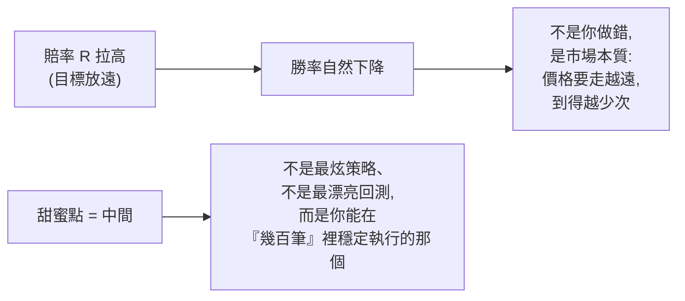
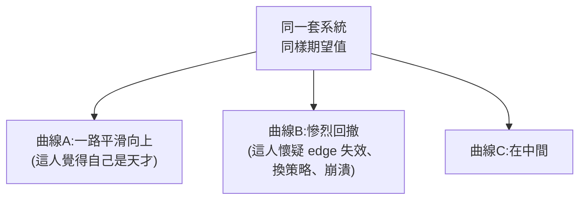
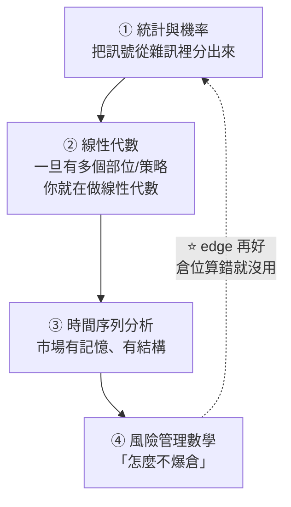

# 交易的「贏家數學」:四個核心概念,以及一份完整的數學學習路線圖

> **第一部(§概念一~四)**整理自 YouTube「Mulham Trading」〈The Math of Winning in Trading〉(約 14 分鐘,英文)。主旨:**交易輸贏不是靠完美進場點,而是靠數學**。影片拆出四個每個交易者都必懂的數學概念(**期望值 Expectancy、系統設計 System Design、變異數 Variance、風險 Risk**),最後丟出一個能改變你交易的問題。
>
> **第二部**整理自 YouTube「Unbiased Trading」〈[The Complete Trading Math Roadmap](https://www.youtube.com/watch?v=4FJs4nd2uDA)〉(2026-04-11,約 12.7 分鐘,英文自動字幕)。**第一部回答「為什麼要懂數學」,第二部回答「要懂哪些、什麼順序學」** ——含統計/線性代數/時間序列/風險管理四大領域、一份最小可用入門清單,以及書單。⚠️ 該片作者推廣三個自家付費產品,已於第二部開頭標明立場。
>
> **⚠️ 非投資建議**(影片本身也聲明僅供教育用途)。這篇講的是**風險管理與機率思維的框架**,不是任何具體買賣訊號;交易高風險,回測漂亮 ≠ 實盤會賺。

---

## 一句話總結

**單筆交易約等於擲硬幣(50/50),你賺不賺錢由「系統的數學」決定,而非任何一筆的輸贏。** 多數人把注意力全砸在策略、指標、心理上,卻幾乎不看那個唯一能告訴你「這套系統到底會不會賺」的數字——**期望值**。問題不是不夠努力,是**努力的方向錯了**。

> 影片開場五句話重設你的視角:① 多數人追完美進場,但真正的 edge 來自機率與數學;② 單筆輸贏基本上是擲硬幣;③ 長期成敗由系統數學決定;④ 一筆交易什麼都不能說明;⑤ 你的注意力該放在「系統的數學」上。

---

## 概念一|期望值(Expectancy):唯一真正重要的數字

期望值 = **每筆交易平均能期望賺到多少**,公式:

```
期望值 = 勝率 × 平均獲利 − 敗率 × 平均虧損
```

它不管你上一筆贏多漂亮、最近五次 setup 多乾淨、下單當下多有信心。重點是把**整套策略濃縮成一個數字**:不是「我覺得這招有用」,而是「這套系統在大量樣本下每筆賺 X」。**期望值為正 = 你有一套會賺錢的系統。**

**三個反直覺的例子**(說明「勝率高低本身不重要」):

| 系統 | 勝率 | 賠率(R) | 每筆期望值 | 直覺 vs 真相 |
|---|---|---|---|---|
| 高賠率低勝率 | **15%** | 8R | **+$350** | 輸掉近 9 成交易,卻照樣賺錢 |
| 中庸 | 55% | 3R | **+$1,200** | 最舒服的甜蜜點區 |
| 高勝率低賠率 | **70%** | 1R | **+$400** | 贏很多次,但每次賺很小 |

> **關鍵洞察**:70% 勝率和 15% 勝率的期望值竟然差不多。所以 edge **不在勝率本身、也不在 R 倍數本身,而在兩者的組合**。

**兩個多數人忽略的陷阱:**
1. **每筆交易都有隱藏成本**:點差(spread)、手續費(commission)、滑價(slippage)。**紙上期望值 ≠ 真實期望值**——一套策略可能紙上獲利、實盤卻虧錢,因為你沒把這些算進去。
2. **小樣本騙人,所以人太早放棄**:前 10–20 筆幾乎看不出系統好壞(全是雜訊);要到**約 100 筆**真相才浮現。很多人在「edge 還沒來得及顯現」之前就退場了——這條直接連到「變異數」。

---

## 概念二|系統設計(System Design):接受沒有完美策略

每套系統都有 trade-off:**賠率越高,勝率通常越低;勝率越高,賠率通常越小。** 很多人卡住,就是因為一直想找「兩者兼得」的系統——它不存在。



**甜蜜點(sweet spot)在中間**,不要極端:別追「1R@70%」那種,也別硬上「目標放超遠」。可行的區間像 **40% 勝率 @ 4R**、**50% 勝率 @ 3–4R**。真正的進步是同時推高勝率與賠率(往右上走),但要務實。

**損益兩平公式(breakeven):你不需要贏那麼多次。**

| 目標賠率 | 需要的最低勝率才不虧 |
|---|---|
| 1R | 需要 > 50% |
| 4R | **只需要 > 20%** |

> 想清楚這件事:**在 4R 系統裡,你可以 80% 的時間都做錯,還是不虧錢。**

---

## 概念三|變異數(Variance):為什麼交易者在情緒上崩潰

拿**同一套系統、同樣規則、同樣期望值**,跑出來的權益曲線可以天差地遠:一條平滑往上、一條經歷慘烈回撤、一條在中間。



這是交易最難接受的真相之一:**你可以每件事都做對,還是會輸**——對的進場、對的停損、對的目標、照計畫執行,照樣連虧 7 筆;也可以**違反每條規則卻連贏 5 筆**(這更危險)。**短期結果證明不了任何事,只有大樣本說真話。**

**賭徒謬誤(Gambler's Fallacy)**:連虧 4 筆後,你會以為「下一筆中的機率變高了」,於是**加碼、加大風險、更激進**——然後又是一筆虧損。真相:**每筆交易彼此獨立**。就算前面連輸 5 筆,下一筆**還是 50/50**,不會因為連輸而變成 82% 或 91%。

---

## 概念四|風險(Risk):活得夠久,edge 才有機會兌現

> 前面所有數學,**只要你活不夠久就全部沒意義**。風險是「紀律變得可見」的地方。

**(A) 部位大小(Position Sizing):固定「每筆冒的錢」,不是固定手數。**
每筆交易停損距離不同,但**每筆冒的金額(或帳戶 %)要一樣**:停損越寬 → 部位越小;停損越窄 → 部位越大,動態調整。建議**每筆風險 0.25%–2%(這是上限)**,讓一個壞週、壞月不會一次毀掉一切。

實作:用**部位大小計算機**——輸入帳戶幣別、餘額、風險 %、商品、停損點數(pips),按計算就得到該下多少手。例:$1,000 帳戶、風險 0.5%、EUR/USD、停損 25 pips → 冒 $5 → 下 0.02 手。TradingView 也有 `lot size calculator` 指標可直接算。

**(B) 破產風險(Risk of Ruin):隨風險 % 暴增。**

| 每筆風險 | 出現 50% 回撤的機率 |
|---|---|
| 0.5% | 低 |
| 1% | 約 18% |
| 2% | 約 65% |
| 5% | 爆炸性飆高 |

> 這不是觀點、不是心理,是**基本數學**。看懂它就看懂「生存」——而生存是交易一切的地基。「連虧不是問題,你的部位大小才是問題。」風險控制得當,連虧只是「痛」、還能活著復原;風險過大,連虧就是「歸零」。

**(C) 虧損與獲利不對稱(復原數學對你不利):**

| 虧損 | 要回本需要的報酬 |
|---|---|
| 10% | 11% |
| 30% | 43% |
| **50%** | **100%** |

> 一旦你虧掉帳戶的一半,**市場等於要求你翻倍才能回到原點**。這就是「保住本金」為什麼這麼重要。

---

## 那一個問題:What changes now?

四個概念都懂了之後,真正的問題是:**「有哪一件你心知肚明做錯、但只要修正就能徹底改變你交易的事?」** 你大概已經知道答案,坐下來想一定找得到。常見候選:

- 只憑幾筆交易就判斷一套系統(忘了大樣本)。
- 冒太大風險只為了「感覺到什麼」——你在追情緒,不是在交易市場。
- 把「好結果」誤當成「好執行」(運氣好 ≠ 決策對)。
- 一遇到變異數(回撤)就拋棄自己的 edge。
- 在一場機率遊戲裡追求「確定性」。

**不管你的答案是什麼,該做的事都一樣**(影片的收尾五原則):
1. **想機率,不想結果**(think in probabilities, not outcomes)。
2. **用大樣本評斷你的 edge**,別用三五筆。
3. **冒夠小的險以熬過變異數**(risk small enough to survive the variance)。
4. **一致性勝過完美**(consistency beats perfection)。
5. **你的工作是執行,不是預測**(execution, not prediction)。

---

## 應用案例 / 怎麼用這套框架

- **先算期望值再談策略**:把你過去 ≥100 筆交易的勝率、平均賺、平均賠代進公式;為正才值得繼續優化,為負再多努力都是把錢倒進破洞。記得**扣掉點差/手續費/滑價**再算一次。
- **設計系統時挑「能執行幾百次」的甜蜜點**,而非回測最漂亮的那個——40%@4R、50%@3–4R 這類比「1R@70% 要一直盯著小利」更撐得久。
- **用 breakeven 表替自己鬆綁**:做 4R 系統時,連錯 8 成也不虧,心理壓力小很多,反而更能照計畫執行。
- **連虧時的自保 SOP**:① 提醒自己每筆獨立、下一筆還是 50/50(別加碼);② 用部位計算機把每筆風險壓在 0.25–2%;③ 記住「50% 虧損要 100% 才回本」,寧可慢慢來也別重壓翻本。
- **把「那一個問題」寫下來**,每月檢視一次——多數人的最大漏洞不是策略,是上面五個心理陷阱之一。

> 延伸:這套「過程重於單筆結果、大樣本才算數、控風險求生存」的思路,與本庫 [[social-arbitrage-chris-camillo]](頂尖交易員談決策品質 vs 運氣)、[[minervini-think-trade-like-champion]](停損 3–8%、控風險為核心)、[[selling-earnings-volatility]](Kelly 部位大小與尾端風險)、[[rl-trading-bot-forex]](回測漂亮、樣本外打回原形)高度互通。

---

## 第二部|完整的交易數學路線圖(2026-09-09 增補,來源:Unbiased Trading)

前四節回答的是「**為什麼**要懂數學」。這一部回答的是「**要懂哪些、什麼順序學**」。

> ⚠️⚠️ **立場揭露:** 該影片作者在說明欄推廣**三個自家付費產品**
> (backtestbootcamp.com、cryptomomentumgroup.com、backtestingcheatsheet.com),
> 片中也有一次口頭導流。**本文只整理其公開的知識架構與書單,不涉及其付費內容。**
> 他自述「六年交易經驗、十個演算法管理六位數美元」——**純屬自述,無法查證。**

> ⭐ **先講最重要的一句(如果只看一段就看這段):**
> **影片作者自己說,真正開始回測只需要「平均數、中位數、標準差、相關性、基本機率、
> 夏普比率、最大回撤」—— 其餘全是之後的事。**
> 下面的完整地圖是給你看「路能通到哪裡」,**不是入門清單。**

---

### A. 四個領域的全貌



| 領域 | 它解決什麼 |
|---|---|
| **① 統計與機率** | **每一次價格變動都是「訊號 + 隨機」的混合**,統計是把兩者分開的工具 |
| **② 線性代數** | ⭐ **「投資組合的數學」** —— 只要你同時持有多個部位、或跑多個策略,你就已經在做線性代數了 |
| **③ 時間序列分析** | 今天的價格依賴昨天、波動會群聚、趨勢會延續 —— 這些依賴關係要建模 |
| **④ 風險管理數學** | ⭐ **「怎麼不爆倉」**。**edge 再好,倉位算錯照樣歸零** |

---

### B. ① 統計與機率(基礎中的基礎)

| 概念 | 交易上實際怎麼用 |
|---|---|
| **樣本數與大數法則** | ⚠️ **10 筆交易全勝一點也不厲害,那只是資料不夠。** 要**數年資料、數百甚至上千筆交易**才談得上真實期望值 —— 而且理想上要**樣本外**(不是你拿來最佳化的那批資料) |
| ⭐ **中位數 > 平均數** | **交易資料充滿離群值。** 例如九次小虧加一次黑天鵝 —— **平均數會被離群值拉走,中位數才反映「典型情況」**。算「開盤到最高點的百分比」這類統計時差別特別大 |
| **眾數** | 交易中很少用,**偶爾用在價格在整數關卡的群聚** |
| **變異數與標準差** | ⭐ **報酬的標準差 ≈ 波動度**,而**幾乎每一條倉位計算公式都是它的某種變形** |
| ⭐⭐ **共變異數與相關性** | 見下方獨立說明 —— 這是最容易被低估的一個 |
| **機率分布** | ⚠️ **大多數模型假設常態,但真實報酬是厚尾的** ⇒ **高斯近似會低估兩邊的崩盤**。另有二項(漲/跌的二元)、均勻(無資訊時的基準線) |
| **中央極限定理** | **一百筆交易的平均,比單一筆交易可預測得多**;投組報酬也會比個股更接近常態 |
| **條件機率** | ⭐ **市場有「狀態」(regime)。** 策略整體勝率 55%,但**「VIX > 30 時」與「VIX < 15 時」可能完全不同** —— 條件機率讓你篩出有利條件 |
| **貝氏定理** | 先驗信念 + 新證據 → 更新後的信念。**對適應性策略與狀態切換型策略是關鍵** |
| **最大概似估計(MLE)** | ⭐ 它解釋了**為什麼迴歸要最小化平方誤差** —— 那正是高斯雜訊假設下的 MLE 解。**懂 MLE 才懂損失函數為什麼長那樣** |
| **迴歸模型** | 線性迴歸(均值回歸、找關係)、邏輯迴歸(預測漲跌這類二元結果)。**是更複雜模型的積木** |

#### ⭐⭐ 相關性:這一段值得單獨記

> **三個動能策略跑在高度相關的資產上 —— 你以為有三倍分散,實際上只有三倍部位。**

| 相關係數 | 實際意義 |
|---|---|
| **0.9** | ⚠️ **你其實只有一個策略,只是下了三倍的量** |
| **0.2** | ⭐ **這才叫真的分散** —— 有一點同向,但大致無關 |

> ⭐ **這是散戶最常見的假分散:名字不同 ≠ 獨立。要量過相關性才算數。**

---

### C. ② 線性代數(多部位就會用到)

| 概念 | 對應到什麼 |
|---|---|
| **純量 / 向量 / 矩陣** | 純量 = 一檔股票一天的報酬;向量 = 十檔股票同一天的報酬,或一組投組權重;矩陣 = 風險計算 |
| ⭐ **一句話心法** | **你的投組報酬 = 向量的加權和;你的風險計算 = 矩陣乘法** |
| **矩陣運算** | 加法(合併訊號或報酬)、乘法(把權重套到部位上)、轉置(很多計算需要) |
| **特徵值與特徵向量** | ⭐ **揭露資料的「方向」** —— 到底是哪些因子在驅動你的投組?你有幾個**獨立的**報酬來源?**你真正的分散度是多少?** |
| **PCA 與矩陣分解** | ⭐ **五十個吵雜的指標 → 跑 PCA → 得到五個獨立因子**,而且常常能解釋約九成的變異。**於是你交易的是五個獨立訊號,而不是五十個彼此重複的雜訊** |

---

### D. ③ 時間序列分析

| 概念 | 重點 |
|---|---|
| ⚠️⚠️ **定態(Stationarity)** | **大多數統計檢定都假設定態,但市場根本不是定態的** —— 波動會變、相關性會漂移、市場結構會演化。<br>⭐ **這正是策略衰退的主因:狀態換了,你的模型卻假設它沒換。** |
| **自相關** | 正自相關 = **動能**;負自相關 = **均值回歸**;零 = **隨機漫步** |
| **ARIMA** | AR(今天依賴前幾天)+ I(處理趨勢)+ MA(今天依賴前幾期的誤差)。用於預測報酬或波動 |
| ⭐ **GARCH** | 說白了就是**波動會群聚**:**大波動之後預期更多波動,平靜之後預期繼續平靜**。<br>**如果你用近期波動決定倉位大小(你通常應該這麼做),GARCH 就是把這件事形式化** |
| ⭐⭐ **共整合(Cointegration)** | **兩個資產可以各自都不定態(都在趨勢),但兩者的價差是定態的。**<br>例:A 股從 50 漲到 150、B 股從 45 漲到 135,**但兩者價差一直維持在 5 美元左右**。<br>⭐ **這是配對交易的理論基礎 —— 你賭的不是方向,是價差會回到常態。** |

---

### E. ④ 風險管理數學

| 指標 | 說明 |
|---|---|
| **VaR(風險值)** | 給定信心水準下的最大預期損失。⚠️ **「95% VaR = 5,000 美元」的意思是:95% 的時候不會虧超過 5,000,但那 5% 可能虧「多很多」** |
| **夏普比率** | (報酬 − 無風險利率) ÷ 波動度 = **每承擔一單位風險換到多少報酬**。同樣報酬、波動更低 ⇒ 夏普更高 |
| ⭐ **最大回撤** | 峰到谷的最大跌幅。**對多數人比波動度更直觀。**<br>⚠️ **最關鍵的問題是:你心理上撐得住那個回撤嗎?** 而且**實盤的最大回撤常常超過回測值** |
| ⭐⭐ **蒙地卡羅模擬** | **你的回測只是「其中一種交易順序」。**<br>把那串交易**重新排序、隨機化幾千次**,你就能看到可能結果的**分布範圍**。<br>⚠️ **重點:也許你的回測只是交易順序運氣好 —— 而最糟的那段回撤根本還沒發生。** |

📎 §概念四已經談過「活得夠久 edge 才有機會兌現」;**蒙地卡羅是把那句話量化的具體工具。**

---

### F. ⭐⭐⭐ 應用案例:入門到底該學哪些(最實用的一節)

影片最後自己收束成一份**最小可用清單**。如果你只是要開始回測策略:

```text
平均數 · 中位數 · 標準差 · 相關性 · 基本機率
· 夏普比率 · 最大回撤
```

> ⭐ **「光是這些,就足以把你跟大多數新手區分開來。」**
> 作者的評語很直接:**他在社群上看到很多人連交易的基本統計都不懂,「相當令人震驚」。**

⭐⭐ 而他給了一個**即使你不寫演算法也成立**的理由:

> **「很多時候人們不懂數學,結果是他們沒辦法正確地計算自己承擔的風險。」**

#### 一份可以照著跑的三階段路徑

| 階段 | 學什麼 | 你能做到什麼 |
|---|---|---|
| **① 先能誠實地量一個策略** | 上面那七項 | 看得懂自己的回測在說什麼、算得出風險 |
| **② 再處理「多個策略」** | **相關性 → 共變異數矩陣 → PCA** | ⭐ **發現自己的「分散」其實是假的** |
| **③ 最後處理「時間」** | **定態 → 自相關 → GARCH → 共整合** | 理解策略為什麼會衰退、做得了配對交易 |

⚠️ **不要倒過來學。** 影片明確說這份地圖是給你看「路能通到哪裡」,**不是入門要求**。

#### 三個可以立刻自查的問題

1. **我的回測有幾筆交易?** —— 如果只有幾十筆,**那個漂亮的績效沒有統計意義**。
2. **我用的是平均數還是中位數?** —— 有離群值時,**平均數會系統性地騙你**。
3. **我的「三個策略」相關係數是多少?** —— 沒量過就等於**不知道自己實際下了幾倍的注**。

---

### G. 書單(影片推薦,依難度排序)

| 難度 | 書 |
|---|---|
| **入門** | Ernest Chan《Quantitative Trading》—— 怎麼建立自己的演算法交易事業 |
| **入門+** | Ernest Chan《Algorithmic Trading: Winning Strategies and Their Rationale》—— 策略背後的數學稍深一些 |
| **入門** | Robert Carver《Systematic Trading》—— 也含不少基礎數學 |
| **進階** | Hamilton《Time Series Analysis》—— ⚠️ **公認的權威參考書,但很硬** |
| **進階** | 《Analysis of Financial Time Series》—— 交易大量圍繞時間序列,作者特別推薦 |
| **專題** | 《The Mathematics of Money Management》—— **倉位大小的經典**;作者自評「其實沒那麼複雜,多數內容問 AI 也能問到八九成」 |
| **進階** | Timothy Masters《Testing and Tuning Market Trading Systems》—— ⭐ **作者最推薦的一本**,數學很重,且直接扣著回測 |

---

### H. 核實狀態

#### ✅ 已核實

| 說法 | 核實結果 |
|---|---|
| **Jim Simons 的旗艦基金 30 年間扣費前年均約 66%** | **屬實** —— Medallion Fund 1988–2018 毛報酬年均約 **66.1%**,**扣掉 5-and-44 的費用後約 39%**,且該區間**沒有任何一年為負** |
| Renaissance Technologies 為 Jim Simons 創辦 | **屬實** |
| 推薦書單中的書籍與作者 | **屬實**,皆為量化交易領域的常見標準參考書 |
| 統計/線代/時間序列/風險管理的概念定義 | **屬實**,為標準教科書內容 |

#### ⚠️ 未能核實 / 需注意

- ⚠️ **作者自述「六年交易經驗、十個演算法管理六位數美元」** —— **純自述,無任何可查證依據。**
- ⚠️ **「這是 Renaissance 這類公司建立在其上的基礎」** —— 方向上沒錯(他們確實是數學/統計出身),
  ⭐ **但影片自己也補了一句「他和他的團隊顯然走得遠得多」**。
  ⚠️ **不要把「懂這些數學」和「能複製 Medallion」畫上任何等號** ——
  Medallion 的績效與其**極低的資產規模上限、極高的交易頻率、以及不對外開放**高度相關。
- ⚠️ PCA「解釋約九成變異」為**示意數字**,實際依資料而定。

---

> ⚠️⚠️ **再次強調:非投資建議。** 本節整理的是**數學工具的學習地圖**,不是任何策略或訊號。
> **回測漂亮 ≠ 實盤會賺** —— 而這一節的 §E 蒙地卡羅與 §D 定態,講的正是這件事為什麼會發生。

---

## 來源

- Mulham Trading,〈The Math of Winning in Trading〉,YouTube:<https://www.youtube.com/watch?v=BAfRVpKIxZ4>(2026-05-31)
- Unbiased Trading,〈The Complete Trading Math Roadmap〉,YouTube:<https://www.youtube.com/watch?v=4FJs4nd2uDA>(2026-04-11;**第二部來源**)
- 第二部的核實來源:
  - [The Growth of $100 Invested in Jim Simons' Medallion Fund — Visual Capitalist](https://www.visualcapitalist.com/growth-of-100-invested-in-jim-simons-medallion-fund/)(Medallion 1988–2018 毛報酬年均約 66.1%、扣費後約 39%)
  - Gregory Zuckerman《The Man Who Solved the Market》(Renaissance 與 Simons 的權威記述)
- 內容整理自兩片的**英文自動字幕**(逐字稿經去重整理,非官方人工字幕,可能有少量辨識誤差;數字例子為影片中舉例,實際數值依你自己的系統而定)。**非投資建議**;影片亦附免責聲明,僅供教育用途。
