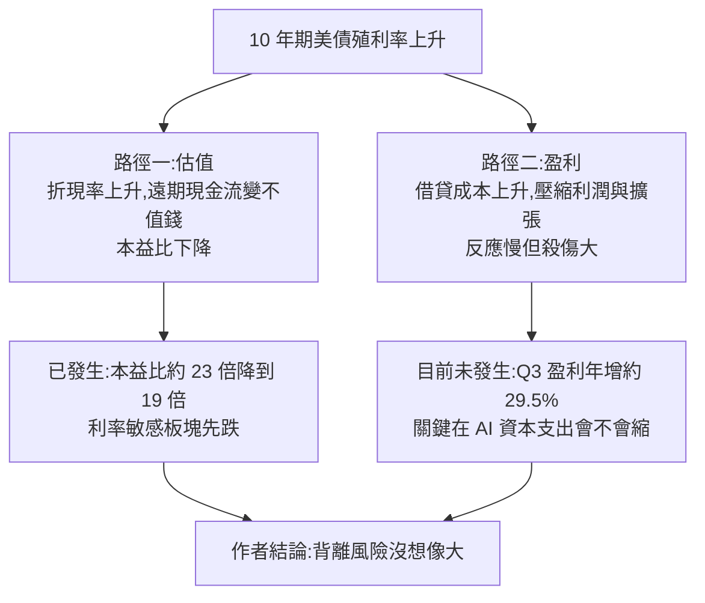

# 債市比股市聰明?美債殖利率創高、美股創高的「背離」:估值已先跌,真正要看盈利(美投君)

**主題分類:** 投資 / 策略 — 宏觀市場研判(利率與股市)
**來源:** YouTube〈债市比股市聪明?美债vs美股史诗级背离!市场正酝酿大跌?〉(美投讲美股,2026-10-04,約 17.5 分;無字幕,逐字稿以 CPU faster-whisper 轉錄、非官方字幕),數字已對照 FactSet、CNBC、JPMorgan、Epoch AI 等公開資料
**整理日期:** 2026-10-05

> ⚠️ **非投資建議。** 立場:影片結尾推廣「美投 Pro」付費訂閱(說會在那裡介紹一家「估值大跌但盈利強勁」的半導體公司),本筆記不轉述付費內容。作者整體立場**偏多**(認為回調是「可以堅定買入的好時機」),與下方核實出的幾個反面數據要一起看。

---

## TL;DR

1. ⭐ **現象**:10 年期與 30 年期美債殖利率創多年新高,過去三個月持續走高(代表債券遭拋售);美股卻還在創新高 ⇒ 「背離」。
2. ⭐⭐ **作者論點一:估值其實已經跌了**。殖利率是折現率的關鍵變數,上升會壓估值;✅ FactSet 顯示標普 500 **預期本益比已從一年前約 23 倍降到 19.0 倍**。利率敏感板塊(公用事業、房地產)已明顯下跌,只是大家只盯著科技股。
3. ⭐⭐ **作者論點二:真正可怕的是盈利受損,但這次盈利很強**。✅ FactSet:Q3 2026 盈利年增約 **29.5%**,全年預估 **32.4%**,季內預估**上修**(過去 5 年平均是下修 2.2%)。
4. ⭐⭐⭐ **作者論點三:AI 資本支出不會因利率退縮**——回報率高、大科技資產負債表健康。📌 **但核實發現作者低估了融資依賴**:大科技 2026 年營業現金流約 **5,770 億美元**,不是影片說的「約 8,000 億、與資本支出大致相當」;美銀估計資本支出將吃掉約 **90%** 營業現金流,Epoch AI 估計 **Q3 2026 現金資本支出將超過營業現金流**。
5. ⭐ **1994 年類比**:殖利率一年大漲近 300 個基點,標普全年幾乎持平——估值被壓、盈利撐住;1995 年殖利率回落後迎來大牛市。作者認為今天條件更好(只漲約 100 基點、盈利增速更高)。

---

## 1. 殖利率上升如何影響股市:兩條路

### 1.1 估值:殖利率是折現率的核心

- 公司價值 = 未來所有現金流折算到今天的總和;折算時最重要的變數是**折現率**,而 10 年期美債殖利率是其中最重要的組成之一。
- 殖利率上升 ⇒ 折現率上升 ⇒ 公司什麼都沒做,估值就下降。
- 越遠期的現金流受利率影響越大。影片引高盛研究:「標普 500 約 80% 的價值來自 10 年後的現金流」(⚠️ 未能核實原始報告)。
- 影片引投行測算:10 年期殖利率每升 100 基點,標普前瞻本益比約降 7%。一年前 10 年期約 4.2%,現在約升了 100 基點;而本益比從 23 倍壓到 19 倍、壓縮約 18%,**比測算還多** ⇒ 作者認為估值已反映美債壓力。

### 1.2 板塊早已「殺估值」

影片:過去三個月(殖利率暴漲期),除能源與科技外大部分板塊都跌,**公用事業約 −13%、房地產約 −8.7%**,工業、原物料、消費跌 5–8%;同期企業盈利整體沒出大問題 ⇒ 估值壓縮已大規模發生(⚠️ 板塊漲跌幅未能逐項核實)。

### 1.3 盈利:反應慢、殺傷大

- 殖利率決定借貸成本 ⇒ 壓縮利潤、讓企業擴張變保守。
- 效果**滯後**,但一旦出現,跌幅大、持續久;作者說歷史上每次殖利率上升帶來的大跌,都和盈利撐不住有關。
- 市場會**提前反應**:最依賴借貸的公司股價先撐不住。

---

## 2. 這次的盈利與 AI 資本支出

### 2.1 盈利:短期極強(✅ FactSet)

| 指標 | 影片 | 核實 |
|---|---|---|
| Q3 2026 盈利年增 | 29.1% | ✅ 約 **29.5%**(9 月底 FactSet;29.1% 是較早的數字) |
| 2026 全年盈利年增 | 32% | ✅ **32.4%** |
| Q3 季內預估變化 | 上修 1.9% | 📌 FactSet:6/30–9/30 **上修 1.4%**;過去 5 年平均**下修 2.2%**、10 年平均下修 2.5% |
| 預期本益比 | 一年前 23 倍 ⇒ 19 倍 | ✅ 目前 **19.0**(5 年平均 19.8、10 年平均 19.1;6/30 為 20.4) |

### 2.2 AI 資本支出:作者偏樂觀,數字要修正

| 項目 | 影片說法 | 核實 |
|---|---|---|
| 大科技今年發債 | 約 2,200 億美元,去年兩倍、正常年份 10 倍 | ✅ 約 2,200 億是**截至 8 月 10 日**的累計;2025 全年約 1,650 億;摩根士丹利預估 2026 全年超過 4,000 億 |
| 大科技今年資本支出 | 約 8,000 億 | ✅ 約 7,500–8,000 億(含融資租賃等) |
| 大科技今年營業現金流 | 「也是約 8,000 億,賺的錢和資本支出大致相當」 | 📌 **需修正**:預估約 **5,770 億**;美銀估計資本支出約吃掉營業現金流的 **90%**(2025 為 65%);Epoch AI 估計 **Q3 2026 現金資本支出將超過營業現金流** |
| 明年資本支出 | 1.2–1.3 兆 | ⚠️ 未能核實 |
| 資產負債表 | 槓桿與利息覆蓋倍數仍健康(JPMorgan 資料) | ✅ JPMorgan 確有「Hyperscalers: now also a credit story」分析,結論為信用體質仍強但正轉為信用故事 |
| 回報率 | Amazon 說資料中心約三年回本(年回報約 30%);美投估 Google 資本回報約 32%(付費內容) | ⚠️ 未能核實;作者自家估算放在付費平台,不轉述 |
| AI 原生公司 | OpenAI ARR 接近 700 億、季增 70%;Anthropic 7 月年化營收 650 億 | ✅ Anthropic 7 月底年化約 **650 億**(5 月 470 億、2025 底約 90 億);⚠️ OpenAI 700 億未能核實,部分報導寫 OpenAI 年化約 400 億 |

**作者的推理:** AI 資料中心折舊年限約 5 年,本來就必須 5 年內回本 ⇒ 天然高回報 ⇒ 對融資成本不敏感;企業砍預算會先砍行銷、營運,AI 是最後才砍的 ⇒ 殖利率的影響「最多停留在估值層面」。

> 📌 **整理者註:**作者的結論依賴「大科技主要靠自有現金」這個前提;核實後,這個前提比影片講的弱——今年資本支出已逼近甚至超過營業現金流,**融資依賴正在快速上升**。這不推翻作者的判斷,但代表「利率對 AI 投資沒影響」的信心應該打折扣。相關的債市與聯準會背景見 [[us-treasury-selloff-warsh-communication-shift]]、[[us-stocks-five-risks-2026q4-hike-treasury-midterm]]。

---

## 3. 1994 年類比

| 項目 | 影片說法 | 核實 |
|---|---|---|
| 10 年期殖利率 | 從年初 5.19% 漲到 11 月 8.05%,一年漲近 300 基點 | 📌 **8.05% 高點正確**;但 5.19% 是 **1993 年 10 月的低點**,1994 年初約 5.7–5.8% |
| 原因 | 聯準會為溫和通膨提前升息;老布希財政政策加劇赤字 | ✅ 1994 年 2 月起聯準會升息;⚠️ 「老布希財政政策加劇赤字」有疑問——1993 年預算法案後赤字其實在縮小,1994 年債災主因多被歸於升息與槓桿部位平倉 |
| 標普 1994 全年 | 沒漲沒跌 | ✅ 價格約 −1.5%,含息約 +1.3% |
| 估值 | 本益比 17.3 ⇒ 14.5 倍,降 18% | ⚠️ 未能核實 |
| 盈利 | 全年成長約 18%,抵消估值壓縮 | ⚠️ 未能核實精確數字(方向正確,1994 年企業盈利強勁) |
| 1995 | 下半年聯準會降息,殖利率從約 8% 回到約 6%;美股全年 +37.6% | ✅ 1995 年 7 月降息;+37.6% 是**含息總報酬**(價格報酬約 +34%) |

作者認為今天比 1994 更好:殖利率只漲約 100 基點(當年 300),盈利增速約 32%(當年約 18%);且通膨「注定回落」,殖利率也會跟著回落,屆時可能是**估值與盈利雙升**的牛市。

> ⚠️ 「通膨注定回落、殖利率注定回落」是作者的判斷,不是事實;報導顯示這波殖利率上升除了升息預期,還有財政赤字、大量發債與期限溢價等結構因素。

---

## 4. 作者的布局建議(觀點,非事實)

- 回調是「可以堅定買入的好時機」;最該布局的是**估值被壓縮、但盈利預期強**的公司。
- 特別看好**半導體**:這季估值壓縮明顯、盈利增長堅定;市場擔心利率導致資本支出放緩,作者認為大概率不會發生。
- 具體個股放在付費平台,不轉述。

---

## 5. 應用案例

### 案例一:用「估值 vs 盈利」拆解指數漲跌

指數漲跌 ≈ 盈利變化 × 本益比變化。假設一年內盈利成長 30%、本益比從 23 倍降到 19 倍(−17.4%):
1.30 × (19 ÷ 23) ≈ 1.074 ⇒ 指數仍約 **+7%**。
⇒ 「股市沒跌」不代表「利率沒影響」——估值已被壓,只是被盈利抵消。反過來,**若盈利增速轉弱,同樣的估值壓縮就會直接反映在股價上**。追蹤時兩個數字要分開看(FactSet 每週的 Earnings Insight 都有)。

### 案例二:自己檢查「AI 資本支出靠不靠借錢」

每季財報後記下五大雲端業者的**營業現金流**與**資本支出**:
- 資本支出 ÷ 營業現金流 < 70%:主要靠自有資金,利率影響小。
- 接近或超過 100%:要靠發債或減少回購,利率上升開始真的有成本。
2026 年已從 2025 年約 65% 升到約 90%,Q3 可能超過 100%——這是作者「利率影響有限」論點最需要盯的指標。

### 案例三:殖利率上升時的板塊檢查表

| 板塊 | 對殖利率上升的敏感度 | 原因 |
|---|---|---|
| 公用事業、房地產 | 高 | 高負債、類債券的穩定配息 |
| 小型股 | 高 | 浮動利率負債比重高 |
| 大型科技 | 估值敏感、盈利較不敏感 | 遠期現金流多,但現金厚 |
| 能源、金融 | 較低或受惠 | 通膨與利差 |

---

## 6. 核實總表

| 類別 | 項目 |
|---|---|
| ✅ 已核實 | 10 年期與 30 年期殖利率創多年新高(報導:10 年期 9 月約 5.22% 創 2007 年以來新高、30 年期升破 5.6% 創 2002 年以來新高);預期本益比降至 19.0;Q3 盈利約 29.5%、全年 32.4%;5 年平均季內下修 2.2%;大科技發債約 2,200 億(截至 8/10);資本支出約 7,500–8,000 億;Anthropic 7 月年化 650 億;1994 年 8.05% 高點、1994 標普近乎持平、1995 年降息與 +37.6%(含息) |
| 📌 需修正 | 大科技營業現金流約 **5,770 億**而非 8,000 億,資本支出已逼近或超過營業現金流;Q3 季內預估上修 **1.4%**(非 1.9%);1994 年初殖利率約 5.7–5.8%(5.19% 是 1993 年 10 月低點);發債「去年兩倍」比的是截至 8 月與 2025 全年;1995 年 +37.6% 是含息報酬 |
| ⚠️ 未能核實 | 高盛「80% 價值來自 10 年後」;「每 100 基點本益比降 7%」;三個月板塊跌幅;明年資本支出 1.2–1.3 兆;Amazon 三年回本;OpenAI ARR 700 億(有報導寫約 400 億);1994 年本益比與盈利精確數字;「老布希財政政策」歸因 |

> ⚠️ **再次提醒:非投資建議。** 影片的結論(回調是買點、看好半導體)是作者觀點,且作者有付費訂閱的商業利益。

---

## 來源

- [YouTube:债市比股市聪明?美债vs美股史诗级背离!市场正酝酿大跌?(美投讲美股,2026-10-04)](https://www.youtube.com/watch?v=hC-rt4_F3mQ)(該片無字幕,逐字稿以 CPU faster-whisper 轉錄、非官方字幕)
- [FactSet:S&P 500 Earnings Season Preview: Q3 2026](https://insight.factset.com/sp-500-earnings-season-preview-q3-2026)
- [CNBC:10-year Treasury yield hits highest level since 2007(2026-09-15)](https://www.cnbc.com/2026/09/15/10-year-treasury-yield-rises-to-highest-since-2007.html)
- [CNBC:30-year Treasury yield hits highest level since 2004(2026-09-24)](https://www.cnbc.com/2026/09/24/us-treasury-yields-bonds-fed-inflation.html)
- [JPMorgan Asset Management:Hyperscalers: Now also a credit story](https://am.jpmorgan.com/lu/en/asset-management/adv/insights/market-insights/market-updates/on-the-minds-of-investors/hyperscaler-debt-issuance-ai-buildout/)
- [Epoch AI:Hyperscaler Capex to Exceed Cash Flow by Q3 2026](https://epoch.ai/data-insights/hyperscaler-capex-vs-cash-flow)
- [FactSet:Hyperscalers Tap External Financing as AI Capex Outruns Cash Flow](https://insight.factset.com/hyperscalers-tap-external-financing-as-ai-capex-outruns-cash-flow)
- [MLQ:Hyperscaler bond issuance reaches about $220 billion](https://mlq.ai/news/hyperscaler-bond-issuance-reaches-about-220-billion-as-ai-financing-costs-rise/)
- [CNBC:Anthropic tells investors annualized revenue run rate climbed to $65 billion in July](https://www.cnbc.com/2026/08/17/anthropic-says-annualized-revenue-climbed-to-65-billion-in-july.html)

**Whisper 專有名詞還原對照:** 债势/股时 → 債市/股市;美倡/美倔/美借/美占/美卦/美値/美华/美卓/美质/美财/美战 → 美債;收盔率/收盟率/收盅率/稍微率/烧鱼 → 殖利率(收益率);美肤/美肯/每股 → 美股;标普败/标浦/标谱 → 標普 500;前占适应率/适应率 → 前瞻本益比(市盈率);级电/基电 → 基點;风陿/风陷/风陨 → 風險;FactSat → FactSet;3G度/基督 → 三季度/季度;大科计/大科继/打科技 → 大科技;半寿体/半寻体 → 半導體;R&THROPIC → Anthropic;假期/假细 → 加息;炮兽 → 拋售;王景 → 網景(Netscape);Mate Pro/METAPRO/美头Pro → 美投 Pro。
