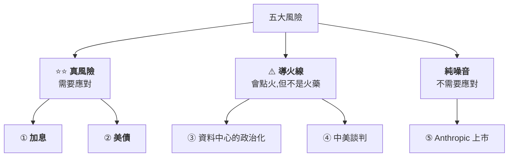
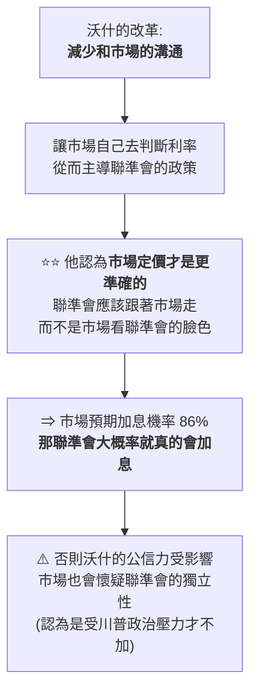
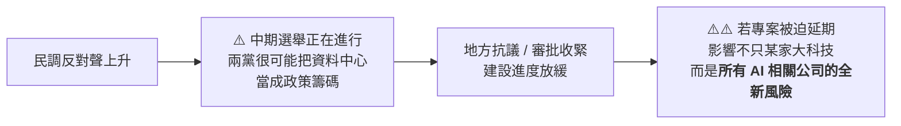
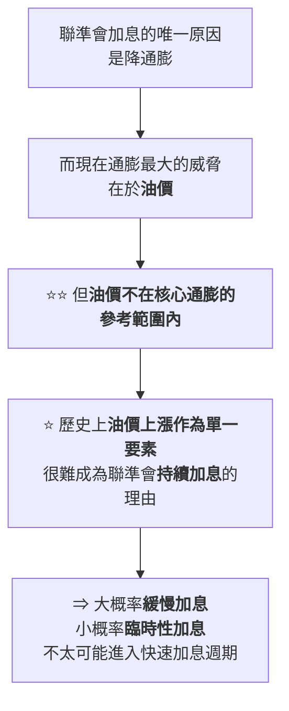

# 五大風險集中爆發?把「真風險」和「導火線」分開:加息、美債、資料中心、中美談判、Anthropic 上市

> ⚠️⚠️ **非投資建議。** 本文是對一支公開影片的整理與數據查證,不含任何買賣建議。
> 整理自 YouTube 頻道 **美投君 / 美投讲美股**〈[5大风险集中爆发!大跌将至?但1大机会你必须把握住!](https://www.youtube.com/watch?v=KG9M-8mvq7Q)〉(2026-09-13,約 20.7 分鐘)。
> ⚠️ **立場揭露:作者在片頭片尾推廣自家付費產品「美投 Pro」與 App**;本文只整理其公開的市場研判,不轉述付費內容。
> ⭐ **關鍵數字已逐項比對 CNBC / Bloomberg / FactSet / TradingEconomics 等公開資料**,並在 §核實狀態分成「已核實 / 需注意 / 未能核實」三類。

---

## 一句話總結

> **五個風險同時擺在桌上,但它們的性質完全不同 ——
> 只有「加息」和「美債」是真正需要應對的,其餘三個是導火線或純噪音。**
>
> ⭐⭐⭐ **而這兩個真風險其實是同一個問題:新任美聯準會主席的不確定性。**

---

## 一、⭐ 先看框架:五個風險不能「鬍子眉毛一把抓」

**影片最有價值的地方不是列出五個風險,是把它們分級。**

> ⭐⭐⭐ **作者的話:「你要把它們全揣兜裡,每天看著市場投資,那指定連覺都睡不好了。」**
> **判斷風險的第一步,是先問「這是火藥,還是只是火柴」。**

---

## 二、真風險 ①:加息 —— 而且背後是同一個人

### 環境變化有多大

| 時點 | 利率 | 方向 |
|---|---|---|
| **一年前** | **3%** | 還在持續降息通道中 |
| **現在** | **3.75%** | ⚠️ **很可能馬上要開始加息** |

**8 月 CPI 數據出來後,市場對 9 月會議的加息機率已來到 86%。**

### ⭐⭐⭐ 為什麼「市場預期」這次特別重要:沃什的改革

**新任美聯準會主席沃什(Kevin Warsh)在通膨問題上是明確的鷹派。在 Jackson Hole 會議上他表態:若通膨不理想,會透過加息來應對。**

⭐ **但影片點出一個更關鍵的機制,這是全片最好的一段推理:**

> ⭐⭐ **這個邏輯的份量:在舊框架下「市場預期」只是參考;在沃什的框架下,
> 市場預期變成了一種**自我實現的約束** —— 他若違背市場定價,代價是公信力。**

📎 **這與本庫 [[us-treasury-selloff-warsh-communication-shift]] 記的「沃什少跟市場溝通的改革是唯一重要變量」是同一條線的延伸 ——
那篇講它如何推高美債殖利率,這篇講它如何讓加息變得幾乎無法迴避。**

### ⚠️ 歷史上首次加息之後會怎樣

> **聯準會首次加息之後,大概一個多月的時間裡,市場通常都會經歷一段回調。**
> ⚠️ **而這次還多了兩層不確定性:全新的主席、全新的政策框架。**

---

## 三、真風險 ②:美債

| 指標 | 數字 |
|---|---|
| **10 年期美債殖利率** | **4.97%** |
| ⚠️ **30 年期美債殖利率** | **5.35%**,**創 20 年來最高** |

> **上一次美債遭遇如此重創,要追溯到 2000 年網路泡沫與 911 時代。**

**傳導路徑:殖利率高 = 美債被拋售 ⇒ 風險增加 ⇒ 投資者要求更高殖利率來彌補風險。**

⚠️ **對股市的三重壓力:**
- 對估值造成壓力
- **抽走股市中的資金**
- 嚴重的話,**可能帶來美元的信任危機**

### ⭐⭐ 但作者明確反對兩種常見說法

| ⚠️ 常見說法 | ⭐ 作者的反駁 |
|---|---|
| 「美債規模突破 40 兆、利息都要還不起了」 | **這是不是問題?絕對是。但這不是本輪美債拋售的原因。** |
| 「美債要崩了」 | **不會失控**,理由有兩個(見下) |

**為什麼不會失控:**

| # | 理由 |
|---|---|
| **1** | **聯準會和財政部都有非常充足的應對手段** |
| ⭐⭐ **2** | **即便改革落地,那也不過是個「一次性的債券重新定價」,不會導致問題持續惡化** |

> ⭐⭐⭐ **本輪美債問題的真正原因只有一個:全新的聯準會班底。**
> **新主席不僅政策上要大幅改革,態度上也明顯更強硬 —— 既然是強硬的改革派,
> 自然帶來更高的風險與更大的不確定性。**

📌 **所以作者的結論是:美債問題本質上還是新任主席的問題 —— 跟第一個風險同源。**

---

## 四、⭐ 導火線 ③:資料中心的政治化

**這是本片最值得記的一個「新風險」,因為它不在多數人的雷達上。**

| 事實 | 內容 |
|---|---|
| **經濟權重** | 美國經濟增長裡**約有一半**和 AI 資料中心建設有直接或間接關係 |
| **市場權重** | 現在美股的表現**也基本由 AI 資料中心建設所主導** |
| ⚠️ **新變化** | **超過一半的美國人反對在自己社區附近建資料中心**(擔心能源消耗、環境影響) |

### ⭐⭐ 但作者認為這只是導火線,理由很具體

> **「政策很難阻擋 AI 的發展。更何況兩黨無論怎麼掐,他們任意一方都很清楚,
> 無論如何是不可能讓美國的 AI 發展落入下風的。
> 我不認為他們會真的因為選舉拉票,而耽誤到 AI 產業的發展。」**

---

## 五、⭐⭐ 導火線 ④:中美談判 —— 一個很好的歷史對照

**兩國已基本確定月底進行元首會晤,市場目前偏樂觀。⚠️ 但作者特意提前提示風險。**

### 去年的劇本

| 時間 | 事件 |
|---|---|
| 去年 9 月底 | 正是上一輪回調的拐點 |
| **元首會晤前** | 美國突然發難,威脅增加關稅,甚至一度要取消會晤 |
| **10 月 10 日** | **貿易談判突然破裂,美股當天大跌 3.6%**,開啟新一輪回調 |

> ⭐⭐⭐ **這一段的洞見最好:**
> **「現在回看,當時美股回調的核心原因**並非貿易摩擦,而是對 AI 投資的擔憂**。
> 但這卻並不影響貿易摩擦成為回調的主要導火線。」**
>
> 📌 **可複用的判斷:市場要下跌時,它會找一個理由 —— 而那個理由通常不是真正的原因。**
> **所以「盯導火線」沒有用,要盯的是火藥本身。**

⚠️ **作者對這項的定位:中美摩擦問題既不可能短期解決、也很難進一步加深,
而市場已經 price in 了大部分風險。「對於這種導火線風險,要想應對就單純是屬於賭博,我認為完全沒有必要。」**

---

## 六、純噪音 ⑤:Anthropic 上市

**市場傳言 Anthropic 將在 10 月上市。**

**為什麼一家公司上市會成為整個市場的風險 —— 資金面的「虹吸效應」:**

> **Anthropic 作為當今 AI 產業最具影響力的公司之一,它的上市會帶來巨大的資金虹吸 ——
> 不少機構很可能**提前賣出其他持倉,為認購 Anthropic 騰出資本**。**

### ⭐ 為什麼跟 SpaceX 上市不一樣

| | **SpaceX** | **Anthropic** |
|---|---|---|
| 機構青睞度 | ⚠️ 因公司性質與商業模式特殊,**並不受機構青睞** | ⭐ **符合當下最重要的投資邏輯,且具備傳統優質投資的一切基礎** |
| ⇒ 虹吸效應 | 當時沒帶來什麼變化 | ⭐⭐ **更值得警惕** |

⚠️ **但作者的定位很清楚:「它就是單純的資金面擾動,即便發生了也是相對短期的風險,屬於純市場噪音。」**

---

## 七、⭐⭐⭐ 加息會是哪一種?三種情境的歷史對照

**這是全片最實用的一張圖,值得單獨記住。**

| 情境 | 定義 | 歷史例子 | 對股市的長期影響 |
|---|---|---|---|
| ⚠️⚠️ **快速加息** | **每開一次例會就加一次息** | **2022 疫情通膨、1999 網路泡沫** | ⚠️⚠️ **唯一真正讓股市進入熊市的情境** |
| ⭐ **緩慢加息** | 完整週期但速度緩和,**加一次、停幾次觀察、再加一次** | **2015 年從零利率的恢復期** | **橫盤整理後快速恢復上行** |
| ⭐ **非週期性加息** | **加一兩次就徹底停止** | **1997 年**(葛林斯潘只加一次,因亞洲金融危機與俄羅斯債券危機而停) | **橫盤整理後快速恢復上行** |

> ⚠️ **共同點:三種情境在首次加息後表現都比較糟糕,而且普遍都是「結束上一輪牛市」的關鍵拐點。**
> ⭐⭐⭐ **差別在於:只有「快速加息」會真的變成熊市。**

### ⭐⭐ 作者的判斷:大概率是緩慢加息

**最重要的依據是通膨,而推理鏈條很清楚:**

**兩組支持證據:**

| 證據 | 內容 |
|---|---|
| ⭐ **投行高盛的綜合指標** | 把**勞動力市場、製造業、服務業的產能壓力**綜合成一個指標,監控所有可能推動通膨的外力(工資上漲、勞動力緊缺、加班時長、產能利用率等,都是敏感的通膨前瞻指標)。**當前壓力仍處於低位,甚至不如 2018–19 年時的壓力大。** |
| ⭐⭐ **核心 CPI 交叉驗證** | 排除食品和能源後,**核心 CPI 過去幾個月一路下跌,從 2.9% 一直跌到 2.4%**,距離 2.2% 的目標越來越近 |

> ⭐⭐⭐ **所以結論是:「即便再鷹派的聯準會,也沒有理由要持續快速加息。
> 因為即便不加息,通膨也會再回落 —— 加息的目的只不過是為了加速回落的速度,而不是為了扭轉通膨的趨勢。」**

### ⚠️⚠️ 但作者特意警告一種「樂觀」

> **「我看到很多投行都在引用一個詞叫做『鴿派加息』——
> 就是說在行動上雖然是加息,但在態度上保持著寬鬆。
> ⚠️⚠️ **這種樂觀本身在我看來也是一種危險的信號。**
> 在不清楚新任主席是什麼路子的前提下,**盲目樂觀很可能會放大接下來的風險**。」**

📌 **短期結論:「風險要遠高於上行機會,需要保持一定的謹慎。」**

---

## 八、⭐⭐ 那個「必須把握的機會」:三組數據

**作者認為所有風險基本都是短期的,而大機會很快就會到來。依據是三組數據:**

### ① 企業盈利

| 期間 | 盈利增長 |
|---|---|
| **本季(Q2)整體** | ⭐ **47.4%** |
| **剔除部分大科技的投資收益後** | **28.8%** |
| **下季預估** | **29.2%** |
| **Q4 預估** | **24.3%** |

⚠️ **作者自己有做歷史對照的誠實處理:**
> **「上一次有如此高的盈利增長還要追溯到 2009 年 —— 不過當時是因為 2008 年嚴重衰退、基期極低所導致的。
> 所以如果公平地看,說本季度是美股盈利增長最強的一季,我想都毫不為過。」**

⭐ **原因沒別的,就是 AI。**

### ② 估值

> **過去這一年美股的估值是在持續回落的,現在來到一個非常合理的位置 ——
> Forward PE 僅有 19 倍左右。配合上如此高速的盈利增長,可以說估值非常合適。**

### ③ ⭐⭐⭐ 中期選舉年的歷史規律(最硬的一組)

| 觀察 | 數字 |
|---|---|
| **9 月與 10 月** | ⚠️ 確實是中期選舉年表現最糟的時間段 |
| **選舉結果落地後(11 月起)** | ⭐ 往往有不俗的上漲潛力 |
| ⭐⭐ **1974 年以來,中期選舉結束後的 6 個月** | **股市全都是上漲的,沒有一次下跌** |
| **平均漲幅** | **12.4%,是歷史平均水平的兩倍** |
| ⭐ **與哪個黨獲勝的關係** | **沒有任何明顯關係 —— 選舉只要結束,就是上漲的開始** |

> ⭐⭐ **把三組數據串起來的底層邏輯:美股最底層有很強的基本面支撐、有足夠的上行催化,
> 這是「需要持續留在市場中的理由」。有了這個基礎,短期風險反而成為機會。**

⭐ **作者的操作結論:「我們要做的就是控制住短期的風險,不至於被市場淘汰,
最好還能趁著下跌撿一些好的機會。這或許是我們今年最後一次低位買入的機會了。」**

⚠️ **非投資建議 —— 這是作者的個人判斷,不是本文的建議。**

---

## 九、應用案例

### 案例 1|⭐⭐⭐ 風險分級三問(本文最可複用的方法)

**看到一串「風險清單」時,逐項問三個問題:**

| 問題 | 若答案是… | 分級 |
|---|---|---|
| **① 它會改變基本面,還是只改變資金流向?** | 只改變資金流向 | ⇒ **純噪音**(如 Anthropic 上市) |
| **② 它是新資訊,還是市場已經 price in 的老問題?** | 已 price in | ⇒ **導火線**(如中美摩擦) |
| **③ 它會持續惡化,還是一次性重定價?** | 一次性重定價 | ⇒ **可控的真風險**(如美債) |

> ⭐⭐ **只有「會改變基本面 + 是新資訊 + 可能持續惡化」三者都成立,才值得真的調整部位。**

### 案例 2|⭐⭐ 「導火線 ≠ 原因」的閱讀訓練

📌 **拿去年 10 月那次回調當練習:**
- **報導寫的原因**:貿易談判破裂
- ⭐ **事後回看的真正原因**:對 AI 投資的擔憂
- **教訓**:**盯著導火線做決策,會在錯誤的變數上花時間**

⭐ **具體做法:每次市場大跌後,把「當天的新聞標題」記下來,三個月後回看還成不成立。
做過三五次之後,你會對「新聞歸因」有免疫力。**

### 案例 3|⭐ 加息時先判斷「哪一種加息」,而不是「加不加息」

| 要盯的訊號 | 為什麼 |
|---|---|
| ⭐⭐ **連續例會是否每次都加** | **這是快速加息(唯一會變熊市的情境)的判準** |
| **推動通膨的是核心項目還是能源** | **能源不在核心通膨內,單一要素很難支撐持續加息** |
| **勞動力/產能壓力指標** | **這些是通膨的前瞻指標,壓力低則加息難以持續** |

### 案例 4|⚠️ 對「鴿派加息」這類安撫詞保持警覺

> ⭐ **一個通用的判準:當市場對一件不確定的事發明了一個「聽起來兩全其美」的詞彙時,
> 那通常是共識在自我安撫,而不是風險真的降低了。**
> **「鴿派加息」、「軟著陸」、「良性通膨」都屬於這一類。**

📎 這與本庫 [[us-stocks-three-risks-detox-trigger]] 的「市場需要一個理由冷靜」是同一組思路的兩面。

---

## 重點回顧(TL;DR)

1. ⭐⭐⭐ **五個風險的性質完全不同**:加息與美債是**真風險**;資料中心政治化與中美談判是**導火線**;Anthropic 上市是**純噪音**。
2. ⭐⭐⭐ **而兩個真風險同源:都是新任聯準會主席沃什帶來的不確定性。**
3. **加息**:一年前利率 3% 且在降息通道,現在 3.75% 且 8 月 CPI 後市場給 9 月加息 **86%** 機率。
4. ⭐⭐ **沃什的改革(減少與市場溝通、讓市場定價主導政策)讓市場預期變成自我實現的約束** —— 他若違背 86% 的定價,代價是公信力與獨立性質疑。
5. **美債**:10 年期 **4.97%**、30 年期 **5.35%(20 年最高)**。⚠️ **但作者明確否定「40 兆債務」這個歸因**,認為真正原因是新聯準會班底。
6. ⭐ **美債不會失控的兩個理由**:聯準會與財政部有充足手段;改革落地也只是**一次性債券重定價**,不會持續惡化。
7. **資料中心**:佔美國經濟增長約一半、主導美股表現,但**超過一半美國人反對社區附近建** ⇒ 中期選舉中可能被政治化。⭐ 但兩黨都不會真的讓美國 AI 落後,所以只是導火線。
8. ⭐⭐⭐ **去年 10 月的教訓:回調的真正原因是 AI 投資擔憂,貿易破裂只是導火線(當天跌 3.6%)** —— **市場要跌時會找一個理由,而那通常不是原因。**
9. **Anthropic 上市**:機構可能賣出其他持倉騰資金;⭐ 與 SpaceX 不同(SpaceX 不受機構青睞),所以虹吸更值得警惕,但仍屬短期噪音。
10. ⭐⭐⭐ **三種加息情境**:只有**快速加息**(每次例會都加,如 2022、1999)會真的變熊市;**緩慢加息**(2015)與**非週期性加息**(1997)都是橫盤後恢復上行。
11. ⭐⭐ **作者判斷大概率是緩慢加息**,依據是:油價不在核心通膨內、油價單一要素難支撐持續加息、高盛的產能壓力指標仍低於 2018–19、**核心 CPI 從 2.9% 跌到 2.4%**。
12. ⚠️⚠️ **但「鴿派加息」這種樂觀本身是危險信號** —— 在不清楚新主席路子前盲目樂觀會放大風險。短期**風險高於上行機會**。
13. ⭐ **三組支撐數據**:Q2 盈利增長 **47.4%**(剔除部分大科技投資收益後 28.8%)、Forward PE **約 19 倍**、**1974 年以來中期選舉後 6 個月股市無一次下跌、平均漲 12.4%(歷史均值兩倍)且與哪黨勝選無關**。

⚠️ **再次聲明:本文為影片內容整理與數據查證,非投資建議。**

---

## 核實狀態

### ✅ 已核實

| 影片說法 | 核實結果 |
|---|---|
| **新任聯準會主席為沃什(Kevin Warsh),在 Jackson Hole 表態承諾對抗通膨** | **屬實**;⭐ 其原話大意為「今夏的通膨數據優於預期,但不足以說明**潛在趨勢有實質改善**」 |
| **當前利率 3.75%** | **屬實**,官方目標區間為 **3.50–3.75%**(3.75% 為區間上緣) |
| **9 月加息機率高** | ⭐ **方向屬實**,但**數字隨時點大幅變動**:8 月底 CME 一度 80–90%、另有報導稱 66%、9 月初約 60%;⚠️ **影片的 86% 為 8 月 CPI 公布後的即時值,本文未能定位到該時點的原始快照** |
| ⭐⭐ **核心 CPI 降到 2.4%** | ⭐⭐⭐ **屬實**,**2026 年 8 月核心通膨率由前月 2.5% 降至 2.4%,為 2021 年 3 月以來最低** |
| ⭐⭐ **「油價不在核心通膨內」這個論點** | ⭐⭐⭐ **得到數據強力支持**:8 月**整體** CPI 年增 **3.4%**、被形容為「熱於預期」,主因**汽油價格飆漲**;而**核心**卻降到 2.4%。**兩者的分歧正是作者論點的最佳證據** |
| **9 月會議日期** | **屬實**,FOMC 於 **9 月 15–16 日**開會 |
| **Anthropic 傳 10 月上市** | **屬實**;⭐ **已向 SEC 遞交機密文件、選定 Nasdaq,高盛/摩根大通/摩根士丹利主辦**;傳言估值約 **2 兆美元**(⚠️ 屬上限情境非確定定價),規模將**超過 SpaceX、成為史上最大 IPO** |
| **Forward PE 約 19 倍** | **屬實**,S&P 500 forward 12 個月 P/E 為 **19.1** |
| **中期選舉年 9–10 月表現最差、選後轉強** | **方向屬實**,與多家機構的季節性研究一致 |

### ⚠️ 需要注意(數字有出入或口徑不同)

| 項目 | 說明 |
|---|---|
| ⚠️ **Q2 盈利增長 47.4%、剔除後 28.8%** | **量級吻合但與 FactSet 的數字有差距**:FactSet 的 blended 增長率為 **約 50.4%–51%**,**剔除 Alphabet 與 Amazon 後降至 32.0%**。⭐ **財報季進行中 blended 值會持續變動,研判為不同時點或不同資料源所致,但請以 FactSet 最終值為準。** |
| ⚠️⚠️ **「估值持續回落到合理位置」** | ⚠️ **這個定性需要保留**:FactSet 指出 19.1 **低於 5 年均值 19.8,但高於 10 年均值 19.0**;另有報導以「**Forward P/E 首次觸及 19.0,為 2002 年以來首見**」為題 —— **暗示方向可能是「升上來」而非「降下來」。本文未能確認影片所用的比較基期,該定性以作者觀點看待。** |
| ⚠️ **核心通膨「目標 2.2%」** | ⚠️ **聯準會的官方通膨目標是 2%(以核心 PCE 衡量)**;**2.2% 不是官方目標數字**,研判為作者自訂的參考線或轉錄誤差。 |
| ⚠️ **核心 CPI 2.4% vs 核心 PCE** | 📌 **兩個指標不可混用**:核心 **CPI** 8 月為 **2.4%**;核心 **PCE**(聯準會偏好指標)7 月為 **3.3%**、8 月約 **2.9%**。⭐ **影片引用的是核心 CPI,方向正確,但若以聯準會真正看的 PCE 衡量,離目標仍有距離 —— 這會讓「沒理由持續加息」的論證變弱。** |

### ⚠️ 未能獨立查證(以影片轉述看待)

- **10 年期 4.97%、30 年期 5.35%(20 年最高)** —— ⚠️ **本文未查得該時點的原始報價**;方向與 [[us-treasury-selloff-warsh-communication-shift]] 記錄的「30 年破 5.3%、20 年新高」一致。
- **一年前利率為 3%** —— 未核對歷史區間。
- **「美國經濟增長約有一半和 AI 資料中心建設有關」** —— ⚠️ **作者自述「我之前看過這麼一組數據」,未指名出處,本文未能定位。**
- **「超過一半美國人反對在社區附近建資料中心」** —— **未查得該民調原始出處。**
- **去年 10 月 10 日貿易談判破裂、美股當天大跌 3.6%** —— **未核對當日收盤數據。**
- **高盛的產能壓力綜合指標、「當前壓力不如 2018–19」** —— **未查得該研究原文。**
- **油價「100 美元居高不下」** —— 與整體 CPI 因汽油飆漲而走高的報導方向一致,**但確切價位未核實。**
- **三種加息情境的歷史股市表現圖(2022/1999、2015、1997)** —— **屬影片自製圖表,本文未逐項驗算。**
- **Q3 預估 29.2%、Q4 預估 24.3%** —— **未核對 FactSet 預估值。**
- **「1974 年以來中期選舉後 6 個月股市全部上漲、平均 12.4%、為歷史均值兩倍」** —— ⭐ **方向與多份季節性研究一致,但「無一次下跌」這個絕對表述與 12.4% 的精確數字本文未能核對原始資料。**
- **月底中美元首會晤已基本確定** —— **未核實。**
- **SpaceX 上市時「不受機構青睞」** —— **屬作者判斷。**

---

## 來源

- [5大风险集中爆发!大跌将至?但1大机会你必须把握住! — 美投君 / 美投讲美股](https://www.youtube.com/watch?v=KG9M-8mvq7Q)(2026-09-13,約 20.7 分鐘)
- 核實用公開資料:
  - [Warsh Confronts Calls for Fed Rate Hike as Inflation Tops Forecasts — Bloomberg](https://www.bloomberg.com/news/articles/2026-09-11/fed-chairman-warsh-faces-pressure-to-put-up-or-shut-up-after-hot-cpi-report)
  - [CPI inflation report August 2026 — CNBC](https://www.cnbc.com/2026/09/11/cpi-inflation-report-august-2026.html)
  - [US CPI August 2026: Inflation Picks Up as Gas Prices Surge — US Inflation Calculator](https://www.usinflationcalculator.com/inflation/us-cpi-august-2026/100073342/)
  - [United States Core Inflation Rate — TradingEconomics](https://tradingeconomics.com/united-states/core-inflation-rate)(核心 CPI 8 月 2.4%)
  - [Markets see Warsh endorsing a rate hike in September. Not everyone is convinced — CNBC](https://www.cnbc.com/2026/08/31/markets-see-warsh-endorsing-a-rate-hike-in-september-not-everyone-is-convinced.html)
  - [Warsh Sounds Hawkish, but Will There Be a September Rate Hike? — Morningstar](https://www.morningstar.com/economy/warsh-sounds-hawkish-will-there-be-september-rate-hike)
  - [Fed's preferred inflation gauge shows core prices rose 3.3% annually in July — CNBC](https://www.cnbc.com/2026/08/26/feds-preferred-inflation-gauge-shows-core-prices-rose-3point3percent-annually-in-july.html)
  - [S&P 500 Earnings Season Update: August 7, 2026 — FactSet](https://insight.factset.com/sp-500-earnings-season-update-august-7-2026)
  - [S&P 500 Forward P/E Ratio Hits 19.0 For the First Time Since 2002 — FactSet](https://insight.factset.com/sp-500-forward-p/e-ratio-hits-19.0-for-the-first-time-since-2002)
  - [Anthropic reportedly plans a $2 trillion IPO in October — Fortune](https://fortune.com/2026/08/13/anthropic-ipo-2-trillion-october-largest-ever-spacex/)
  - [Anthropic selects Nasdaq for planned October IPO — Data Studios](https://www.datastudios.org/post/anthropic-selects-nasdaq-for-planned-october-ipo-as-2-trillion-valuation-takes-shape)
- 延伸:本庫 [[us-treasury-selloff-warsh-communication-shift]](沃什的溝通轉向與美債拋售,影片明確引用為前作)、[[us-stocks-three-risks-detox-trigger]]、[[us-stocks-rate-hike-three-stages-ai-vs-2000]]、[[us-stocks-rate-hike-risk-2026]]、[[ai-investing-four-principles-stock-logic]]。

> 該片無字幕,逐字稿以 CPU 版 faster-whisper(small / int8 / zh)轉錄取得,**非官方字幕**,可能有少量聽寫誤差。
> 專有名詞已依上下文還原:轉錄中的「卧石 / 卧實 / 卧室 / 信任美職儲主席」為 **沃什(Kevin Warsh)/ 新任聯準會主席**、
> 「安斯拉帕克 / 安斯莱帕特 / 安斯尔帕帕 / Sdropic / Sdropik / 按Sharpik / Anthropik」為 **Anthropic**、
> 「美肤 / 美肱 / 美肯 / 美育 / 美每股」為 **美股**、「美戛 / 美倔 / 美借 / 美倉 / 美債」為 **美債**、
> 「美職儲 / 美聀儲 / 美聢儲 / 美甸儲 / 美業」為 **聯準會(美聯儲)**、「風陷 / 風陰 / 風険 / 風浅 / 風陨」為 **風險**、
> 「導火鎖 / 導活鎖」為 **導火線**、「匯調 / 汇条 / 回彻」為 **回調**、「雄式 / 雄勢」為 **熊市**、
> 「盈利 / 盐利 / 盂利 / 盎利」為 **盈利**、「估值 / 伺服值 / 估計」為 **估值**、「鴿派 / 銀派 / 鹰派」依上下文為 **鷹派 / 鴿派**、
> 「郑乔」為 **正巧**、「格林斯潘」為 **葛林斯潘**、「美投經濟 / 美特爾軍 / 米特軍 / 美頭」為 **美投君**、「看觀 / 看官」為 **看官**。
> ⚠️ **由於本片數字密集且轉錄品質受限,所有關鍵數字均已在上節標示核實狀態;請以原始資料為準。**
