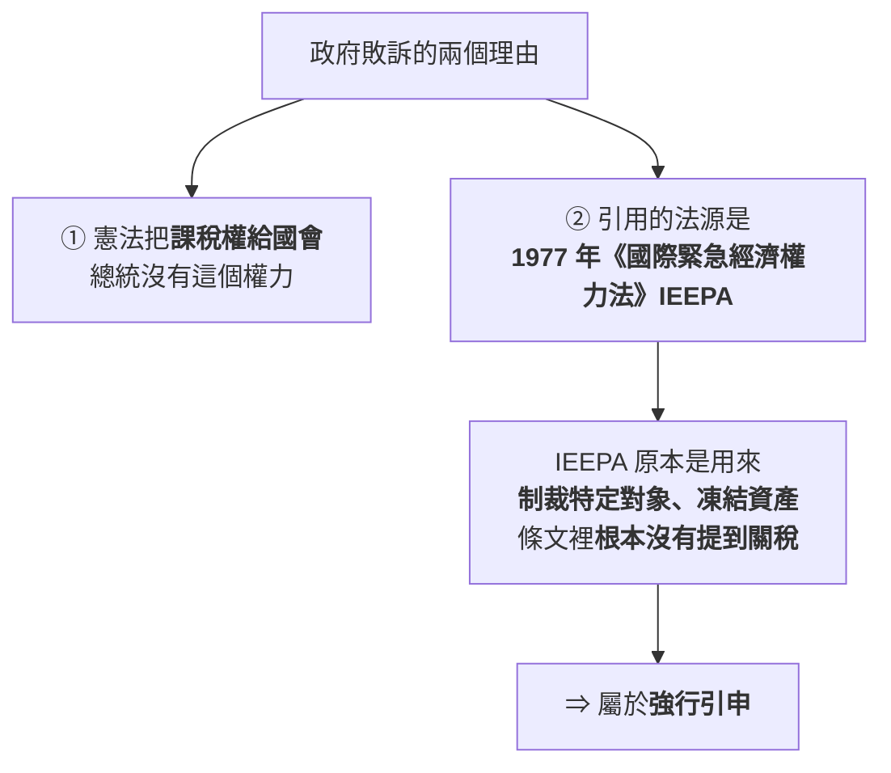
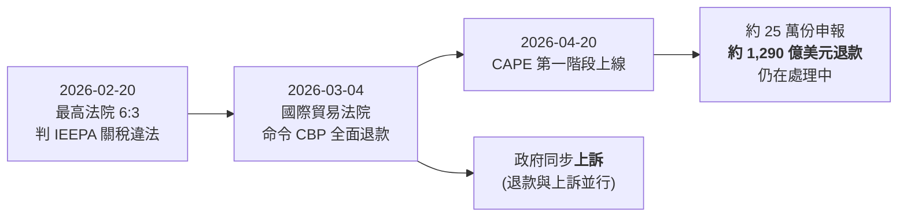
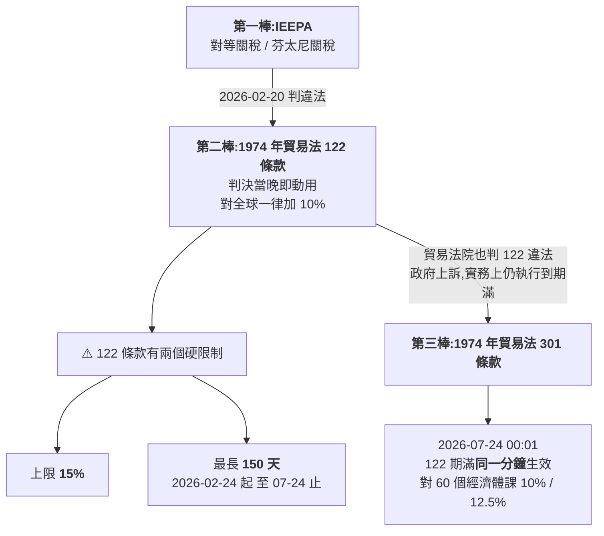
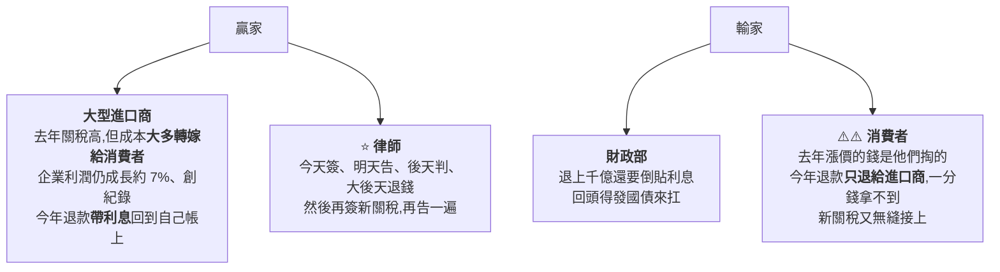

# 川普關稅被判違法之後:1,660 億美元退稅、150 天的過渡條款,與無縫接上的 301 條款

> ⚠️⚠️ **非投資建議。** 本文是對公開政策事件的整理與查證,不含任何買賣建議。
> 整理自 YouTube 頻道 **小Lin说**〈[特朗普关税被判违法,这一整年白忙了? 现在关税什么情况?](https://www.youtube.com/watch?v=T7z71yENz94)〉(2026-09-09,約 10.5 分鐘,官方中文字幕)。
> ⭐ **本文的關鍵數字已逐項比對美國海關(CBP)、法院文件與律所/智庫公開分析**,核實狀態列在文末。

---

## 一句話總結

> **最高法院把「總統用緊急狀態法課關稅」判違法,政府得退 1,660 億美元;
> 但白宮當晚就換了一部法條把稅接上,150 天後又換第三部接上。
> 關稅稅率幾乎沒變,變的是「錢在誰口袋裡繞了一圈」—— 而且下一輪官司已經在路上。**

有效關稅率從 2025 年底的約 14% 到現在約 11%,**折騰一年,終點離起點不遠**;
但中間那趟繞路,讓進口商拿到一筆帶利息的退款、讓財政部單月變成「發錢的部門」、
還憑空長出一個**上百億美元規模的「退稅債權」二級市場**。

---

## 一、事情怎麼開始的:一個賣酒的和一個賣玩具的

2025 年 4 月的「解放日」關稅對全球普遍加徵,美國進口企業直接吃下成本:

| 企業 | 前後繳納的關稅 |
|---|---|
| Apple | 超過 **32 億美元** |
| Nike | 約 **10 億美元** |

⭐ **但真正值得記的是「為什麼是小公司去告」。**

影片講了一個很具體的場景:亞馬遜只是**考慮**在商品頁面標示關稅成本,
白宮發言人當天就定性為「敵意的政治行為」,川普直接打電話給貝佐斯,
幾小時後亞馬遜就澄清不做了。

> 📌 **這件事的意義不在八卦,在於它解釋了訴訟結構:**
> **大企業有能力打官司但沒有動機**(得罪成本太高),
> **小企業沒有能力但別無選擇** —— 最後由**一家賣酒的、一家賣玩具的**在 2025 年 4 月提告,
> 被告第一名就是川普本人,加上國土安全部、海關、商務部、財政部一長串。

案子一路打到最高法院,**2026-02-20,9 位大法官 6:3 判政府敗訴**(*Learning Resources, Inc. v. Trump*)。

### 為什麼會輸:兩個理由

⚠️ **判違法的只有第一類。** 川普的關稅有兩套法源:

| 法源 | 適用範圍 | 這次結果 |
|---|---|---|
| **IEEPA**(緊急狀態法) | **對等關稅、芬太尼關稅**(針對「國家」) | ⚠️ **被判違法** |
| **國家安全**(232 條款一類) | **鋼鋁、汽車、晶片**(針對「行業」) | ✅ **法院沒碰,維持不變** |

📌 **但被判掉的那一類,正是收入大頭 —— 佔 2025 年關稅收入約 60%。**

---

## 二、退錢:當一個收稅的部門變成發錢的部門

2025 年美國關稅總收入約 **2,640 億美元**(比前幾年翻了三倍多),其中 IEEPA 部分約 **1,660 億美元**。

⭐ **法院的態度是本段最值得記的一句:**

> 貿易法院要求 CBP 退款,而且**不只退給提告的公司,是退給所有繳過 IEEPA 關稅的人**。
> 海關抗辯:去年有 **33 萬家進口商、5,300 萬筆報關**,要挨個算、挨個退,做不到。
> 大法官的回應大意是:**怎麼退是你的問題,總之立刻退。**

於是 CBP 臨時建了一套電子退稅機制 **CAPE**(在既有的 ACE 系統內),2026-04-20 上線第一階段。

### 退到誰手上:一整季的「意外之財」

| 公司 | 該季收到的退稅 |
|---|---|
| **Walmart** | **24 億美元** |
| **Apple** | **22 億美元**(該季毛利率因此推高約 2 個百分點,EPS +0.11 美元) |
| **Costco** | **20 億美元** |
| **Nike** | 約 **10 億美元** |
| **Amazon** | **6 億美元** |
| GM / Sony | 各約 **5 億美元** |

Apple 把那一季稱作「史上最強 6 月季」,並宣布**把退稅投入美國製造,不用於降價**。

⚠️ **財政部這邊的畫面剛好相反:2026 年 6 月,海關收到的稅約 236 億美元,退出去的約 492 億美元 ——
史上第一次,一個收稅的部門單月淨發錢。**

---

## 三、⭐⭐ 白宮的接力賽:三部法條,無縫銜接

這是全片最值得帶走的結構。**關稅沒有消失,只是換了三次法源。**

### 為什麼不一開始就用 301?

| 條款 | 上限 | 期限 | 啟動速度 |
|---|---|---|---|
| **122 條款**(國際收支「根本性問題」) | **15%** | ⚠️ **最長 150 天** | ⭐ **可先斬後奏,繞過國會,當天生效** |
| **301 條款**(認定「不公平貿易行為」) | ⭐ **無上限** | ⭐ **無期限** | ⚠️ **要立案、聽證、走完調查,正常一兩年** |

⭐⭐ **所以 122 的 150 天,實際功能是「替 301 買時間」。**

而白宮把那一兩年壓成三個多月:

- **2026-03-12,一天之內對 60 個經濟體同時立案調查。**
- **6 月初得出結論:60 個經濟體全部有問題** —— 認定依據是一個相當邊緣的切入點:
  **未有效禁止/執行「強迫勞動製品」的相關規範。**
- **7 月 24 日 00:01,122 條款期滿的同一分鐘,新的 301 關稅生效。**

### 現在的實際稅率

| 對象 | 額外關稅 |
|---|---|
| 歐盟、英國、加拿大、墨西哥、印度 | **10%** |
| 中國、日本、韓國、瑞士 | **12.5%** |
| 鋼、鋁、汽車、晶片等 | 依**行業**課徵,**維持不變**(不受本案影響) |

📌 **涵蓋美國約 99.4% 的進口。有效關稅率:2025 年底約 14% → 現在約 11%。**

> ⚠️ **重點:60 個經濟體「無一例外全都有不公平貿易行為」這個認定本身,就是下一輪訴訟的靶心。**
> 這次的原告陣容明顯壯大:**除了進口商,還有 25 個州的總檢察長與州長組團起訴。**
> 若再被推翻,「課稅 → 判違法 → 退稅」這整套流程還要再跑一遍。

---

## 四、⭐ 一個新市場:關稅退款債權

企業與市場的反應不是抗議,是**把它證券化**:

> 等不及的小型進口商,把「**未來可能收到的退款**」打折賣給對沖基金換現金 ——
> 形同一種**未來退款的期貨**。已有對沖基金專做這門生意,
> 據影片引述的估算,**這個二級市場規模可能已達 1,000 億美元量級**。

⚠️ **此項本文未能在公開資料中獨立查證**(見文末核實狀態),以影片轉述看待。

---

## 五、⭐⭐ 誰贏誰輸:一個違反直覺的答案

⭐ **這一段是整支影片最有洞見的地方,值得單獨記住:**

> **關稅的「繳納者」與「負擔者」不是同一群人。**
> 法律上繳稅的是**進口商**,經濟上負擔的是**消費者**。
> 所以當法院判「退還給繳稅的人」時,**退款在法律上完全正確,在分配上完全錯位** ——
> 錢從消費者口袋出去,一年後帶著利息回到進口商口袋。

⚠️ 消費者的反應是提告:美國已出現 **100 多起集體訴訟**,告 Costco、告 Nike ——
理由是「當初漲價時說是因為關稅,現在關稅退了呢?」

### 往根上刨:為什麼會變成這樣

> **憲法把課稅權給了國會,但舊法案裡的應急條款一條不行再換一條、越用越順手,
> 最後踩剎車的只剩法院。於是就變成:今天簽、明天告、後天判、大後天退錢,然後再簽新的。**

---

## 六、應用案例:這件事怎麼影響「看新聞的方式」

### 案例 1|⭐ 看到「關稅被判違法」時,先問三個問題

| 問題 | 這次的答案 |
|---|---|
| **① 被判掉的是哪一類法源?** | 只有 **IEEPA(針對國家)**;**232 行業關稅完全沒動** |
| **② 有沒有替代法源?** | **有,而且當晚就啟用**(122 條款) |
| **③ 有效稅率實際變了多少?** | **14% → 11%**,遠小於「全部取消」的直覺 |

📌 **教訓:一則「違法」標題,實際稅率只降了 3 個百分點。**
**判決撤掉的是「授權基礎」,不是「政策意圖」** —— 只要替代條款還在,政策就會找到路。

### 案例 2|讀財報時分辨「一次性」與「經常性」

⚠️ Apple 那個「史上最強 6 月季」,**毛利率有約 2 個百分點來自退稅**,
剔除退稅後,那一季大致符合分析師原本的預期。

> ⭐ **實務做法:當某季獲利突然跳升,先去附註找「有沒有一次性項目」。**
> 這一輪(2026 年年中)的美股財報,**退稅是最常見的那個一次性項目**,
> 而且它**明年不會再有**。⚠️ 非投資建議,只是閱讀財報的方法。

### 案例 3|供應鏈與採購端的具體動作

- **保存完整報關紀錄**:CAPE 的退款以報關資料為準,退給**進口紀錄人(importer of record)**。
  ⭐ 若你是透過代理報關,**「誰是 importer of record」直接決定退款進誰的帳**,這一欄要事先講清楚。
- **合約要寫「稅負變動條款」**:這一年證明了關稅可以**在一天之內生效、在一天之內失效、再在同一分鐘接上**。
  把稅負變動的分攤方式寫進合約,比事後打官司便宜。
- **注意 301 的**「無上限、無期限」:與 122 不同,**301 沒有自動落日** ——
  它不會自己到期,只會被推翻或被政策改掉。

---

## 重點回顧(TL;DR)

1. **2026-02-20 最高法院 6:3 判 IEEPA 不授權總統課關稅**(*Learning Resources v. Trump*);**232 行業關稅不受影響**。
2. **要退約 1,660 億美元**,涉及 **33 萬家進口商、5,300 萬筆報關**;CBP 建 **CAPE** 系統,2026-04-20 上線第一階段。
3. **第一階段涵蓋約 63% 的報關筆數、近 1,270 億美元**;總退款規模估可達約 **1,300 億美元**(未計利息)。
4. **企業一次性入袋**:Walmart 24 億、Apple 22 億、Costco 20 億、Nike 10 億、Amazon 6 億(美元)。
5. **2026 年 6 月海關淨發錢**:收 236 億、退 492 億。
6. ⭐⭐ **三部法條接力**:IEEPA(判違法)→ **122 條款**(當晚啟用,上限 15%、限 150 天,02-24 至 07-24)→ **301 條款**(07-24 同一分鐘生效)。
7. **301 的認定理由是「未有效禁止強迫勞動製品」,一次涵蓋 60 個經濟體、約 99.4% 的美國進口**;稅率 **10%(歐盟英加墨印)/ 12.5%(中日韓瑞)**。
8. **有效關稅率 14% → 11%** —— **折騰一年,終點離起點不遠。**
9. ⭐⭐ **繳納者 ≠ 負擔者**:成本主要轉嫁給消費者,退款卻只回到進口商帳上(還帶利息);消費者的出口是 **100 多起集體訴訟**。
10. **下一輪已經在路上**:原告加入 **25 個州的總檢察長與州長**,整套流程可能再跑一遍。

⚠️ **再次聲明:本文為政策事件整理,非投資建議。**

---

## 核實狀態

### ✅ 已核實(比對法院文件、CBP 與律所/智庫公開分析)

| 影片說法 | 核實結果 |
|---|---|
| 2026-02-20 最高法院 **6:3** 判 IEEPA 關稅違法 | **屬實**,案名 *Learning Resources, Inc. v. Trump* |
| 退款規模 **約 1,660 億美元**、**33 萬家**進口商 | **屬實**(官方數字:約 $166B、逾 330,000 家進口商) |
| **5,000 多萬筆**報關 | **屬實**(逾 **5,300 萬筆** entries) |
| 貿易法院命令**全面退款**(不限提告者) | **屬實**,2026-03-04 國際貿易法院命令;政府同步上訴 |
| CBP 另建 **CAPE** 退稅系統 | **屬實**,建於 ACE 之內,**2026-04-20 啟動第一階段** |
| **122 條款:上限 15%、最長 150 天** | **屬實**;實際課 **10%**,**2026-02-24 至 07-24** |
| **301 條款於 07-24 同一分鐘接上,對 60 個經濟體課 10–12.5%** | **屬實**;認定依據為**強迫勞動製品**相關規範未有效執行,涵蓋逾 **99%** 的美國進口 |
| **Apple 22 億、Walmart 24 億、Amazon 6 億** 美元退稅 | **屬實**(Costco 約 20 億亦獲證實) |
| Apple 該季毛利率受惠約 **2 個百分點** | **屬實**,並貢獻約 **$0.11** EPS;Apple 宣布投入美國製造、不降價 |

### ⭐ 影片未提、值得補上的一點

- **CAPE 第一階段只涵蓋約 63% 的報關筆數(近 1,270 億美元)**,
  且限於**尚未清算(unliquidated)或清算後 80 天內**的報關;**其餘要等後續階段**。
  ⚠️ 這代表「兩三個月全發完」的印象並不完全準確 —— **是「第一階段跑得快」,不是「全部退完」。**

### ⚠️ 未能獨立查證(以影片轉述看待)

- **2025 年關稅總收入 2,640 億美元、IEEPA 佔約 60%** —— 方向與官方 $166B 相符,但總額未逐項核對。
- **CAPE 已收 25 萬份申報、約 1,290 億美元** —— 與公開估算的量級一致,惟確切時點數字未查得原始出處。
- **2026 年 6 月海關收 236 億 / 退 492 億美元** —— 未查得月報原始數字。
- **「關稅退款債權」二級市場規模約 1,000 億美元** —— **公開資料中未能定位到佐證,以影片轉述看待。**
- **有效關稅率 14% → 11%**、**企業利潤成長 7%** —— 屬估算與統計口徑問題,未獨立驗算。
- **亞馬遜標示關稅成本一事的通話細節**、**「一個賣酒的、一個賣玩具的」原告身分** —— 未逐項查證。

---

## 來源

- [特朗普关税被判违法,这一整年白忙了? 现在关税什么情况? — 小Lin说](https://www.youtube.com/watch?v=T7z71yENz94)(2026-09-09,約 10.5 分鐘,官方中文字幕)
- 核實用公開資料:
  - [Supreme Court Tariff Ruling: IEEPA Revenue and Potential Refunds — Penn Wharton Budget Model](https://budgetmodel.wharton.upenn.edu/p/2026-02-20-supreme-court-tariff-ruling/)
  - [Tariff Refund Mechanism Takes Shape After Supreme Court's IEEPA Ruling — Skadden](https://www.skadden.com/insights/publications/2026/03/tariff-refund-mechanism-takes-shape)
  - [Court of International Trade Orders Nationwide Tariff Refunds, But Expect Government to Appeal — Holland & Knight](https://www.hklaw.com/en/insights/publications/2026/03/court-of-international-trade-orders-nationwide-tariff-refunds)
  - [IEEPA Tariff Refund Update: Government Appeals CIT Refund Order — Holland & Knight](https://www.hklaw.com/en/insights/publications/2026/06/ieepa-tariff-refund-update-government-appeals)
  - [IEEPA Tariff Refunds: CBP Launches CAPE Process — White and Williams](https://www.whiteandwilliams.com/resources-alerts-IEEPA-Tariff-Refunds-CBP-Launches-CAPE-Process)
  - [IEEPA Tariff Refunds Update: Good Progress, but Still a Ways to Go — Cato Institute](https://www.cato.org/blog/ieepa-refunds-update-good-progress-still-ways-go)
  - [CBP issues tariff refund instructions — Norton Rose Fulbright](https://www.nortonrosefulbright.com/en-us/knowledge/publications/44450c73/cbp-issues-tariff-refund-instructions)
  - [US Trade Court Strikes Down Section 122 Tariffs — Skadden](https://www.skadden.com/insights/publications/2026/05/us-trade-court-strikes-down-section-122-tariffs)
  - [Tax Insights: US Court of International Trade strikes down section 122 tariffs — PwC Canada](https://www.pwc.com/ca/en/services/tax/publications/tax-insights/us-court-strike-down-section-122-tariffs-2026.html)
  - [Section 122 Tariffs Expire July 24: What Businesses Need to Know — Statt](https://statt.com/blog/section-122-tariff-expiration-what-businesses-need-to-know/)
  - [New Section 301 tariffs demonstrate rededication to U.S. trade policy — Winston Taylor](https://www.winstontaylor.com/insights/new-section-301-tariffs-demonstrate-rededication-to-u-s-trade-policy)
  - [Apple got a $2.2 billion tariff refund this quarter — Yahoo Finance](https://finance.yahoo.com/economy/policy/articles/apple-got-2-2-billion-231210663.html)
  - [Apple will invest tariff refund into U.S. manufacturing — NPR](https://www.npr.org/2026/08/04/nx-s1-5918538/apple-will-invest-tariff-refund-into-u-s-manufacturing)

> ⚠️ **非投資建議。** 本文為對一支公開影片的整理與交叉查證,關鍵數字的核實狀態已列於上一節。
> 訴訟仍在進行中(政府已就退款命令與 122 條款判決上訴,301 條款另有新訴訟),
> **具體稅率與退款進度請以 CBP 與法院最新公告為準。**
