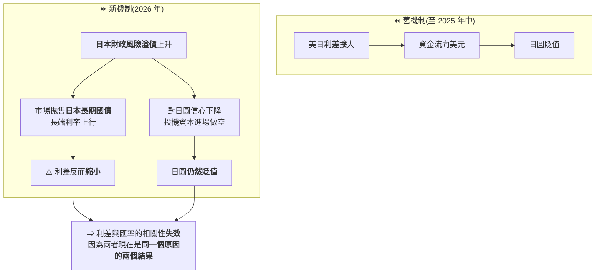
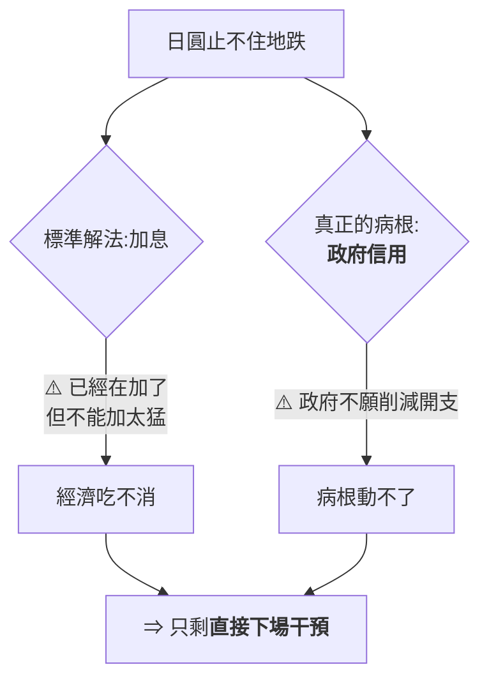
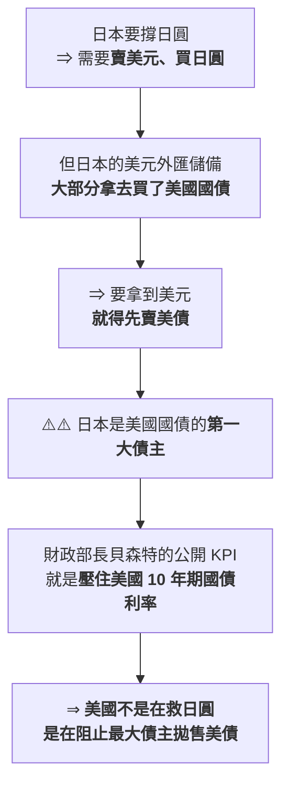
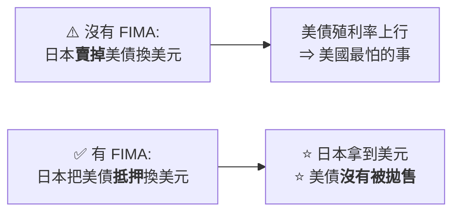
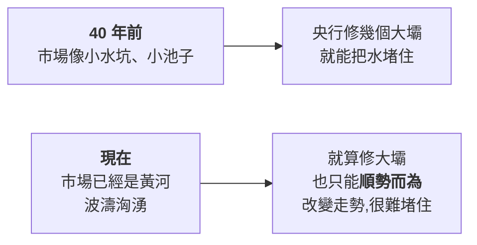

# 日圓創 40 年新低:主導因素從「利差」換成「財政風險」,以及美日 15 年來首次聯手干預

> ⚠️⚠️ **非投資建議。** 本文是對公開總體事件的整理與查證,不含任何買賣建議。
> 整理自 YouTube 頻道 **小Lin说**〈[日元创40年新低,美国突然出手,怎么回事儿?](https://www.youtube.com/watch?v=8BN8p5xDkzw)〉(2026-08-28,約 15.7 分鐘,官方中文字幕)。
> ⭐ **關鍵事件與數字已比對路透 / CNBC / Bloomberg / 日經 / OMFIF 等公開報導**,核實狀態列在文末。

---

## 一句話總結

> **過去二十年,日圓匯率看「美日利差」就夠了。2026 年這條規律失效了 ——
> 新的主導變數是**日本自己的財政風險溢價**。
> 而美國之所以破例下場,不是為了幫日本,是為了**阻止最大債主拋售美債**。**

---

## 一、⭐⭐⭐ 全片最核心的一張圖:相關性「分手」了

多數報導的第一個解釋都是**利差**:美債 10 年期收益率減日債 10 年期收益率,
與美元兌日圓的相關性**長年高到像手拉手**。

⚠️ **但這支影片做了一件很誠實的事 —— 它先給你一張「刻意誤導」的圖:**

> 那張圖的時間軸**只截到 2025 年 6 月**。把時間拉到最近,**兩條線的相關性直接崩塌。**

> ⭐⭐⭐ **這是全片最值得帶走的推理:**
> **舊模型裡「利差 → 日圓貶值」是因果關係;
> 新模型裡兩者都是「日本財政風險」的下游結果 —— 因果變成了共因。**
>
> 📌 **所以影片改用「日本國債 2 年 / 10 年利差」當代理指標** ——
> 它一定程度上在追蹤**日本的財政風險溢價**。

---

## 二、觸發者:高市早苗與「Takaichi Trade」

**高市早苗上台後推的是激進版安倍經濟學:**

| 政策 | 內容 |
|---|---|
| 財政刺激 | **21 兆日圓**規模的刺激計畫 |
| 減稅 | **砍食品消費稅** |
| 她自己的說法 | 「**負責任的積極財政**」 |

⚠️ **問題在於環境變了:**

> **安倍時代利率幾乎是 0,政府借再多錢都還好。
> 現在利率起來了、通脹起來了,而日本政府債務本就冠絕全球 ——
> 正常該做的是開源節流,她卻是「開流節源」:一邊玩命花錢,一邊使勁減稅。**

市場的反應被華爾街命名為 **「高市交易」(Takaichi Trade)**:

| 部位 | 對應的市場表現 |
|---|---|
| **賣日債** | 長期債暴跌 |
| **賣日圓** | 日圓暴跌,一度摸到 **164** |
| **買日股** | 日股創新高 |

> ⭐ **影片點出的一個歷史對照很值得記:2022 年英國特拉斯(Truss)** ——
> 頂著巨大通脹壓力推大減稅方案,**國債與英鎊一起暴跌,49 天下台。**
> **同一個劇本,不同的國家。**

---

## 三、日本的兩難:為什麼只剩「下場干預」這一招

⚠️ **而干預本身是有政治成本的:**

> **G7 之間有個「君子協定」:不到迫不得已不能下場干預,真要干預得先跟兄弟們打招呼。**
> 美國與 IMF 一向特別不喜歡這種操作。

📌 所以日本每次動手前都有同一套台詞:
「**我們對日圓的過度波動深感憂慮,不排除任何選項。**」——
翻譯過來就是「G7 的兄弟們,我快撐不住了」。

### 花掉多少錢

| 期間 | 干預金額 |
|---|---|
| **2022–2025 合計** | **約 25 兆日圓(約 1,600 億美元)** |
| **2026 年(估算)** | ⚠️ **可能已超過 25 兆日圓,一年就趕上前幾年總和** |

> 📌 **25 兆日圓的量級感:約是日本政府一年總收入的三分之一。**

---

## 四、⭐⭐⭐ 美國為什麼插手:破案的關鍵是「誰是最大債主」

官方說法是「日本是我們的好朋友好夥伴」。⚠️ **但美國一向反對市場干預**,
上一次(15 年前)出手是因為**福島核電廠事故**那種特殊情況。

⭐ **影片的推理鏈非常乾淨:**

> ⭐⭐ **一句話:「你救不救日圓是你的事,但你別賣我的國債。」**

📌 影片也並陳了其他分析常提的附加動機(保關稅效果、不希望美元太強擴大貿易逆差、
政治上保高市早苗),**但認為最直接的還是美債。**

---

## 五、兩招:一招是象徵,一招才是真的

### 第一招:直接下場買日圓(象徵意義為主)

| 時間 | 事件 |
|---|---|
| **2026-07-30 晚間**(日本時間) | 日本政府開始買入日圓,日圓急升 |
| **2026-07-31** | ⭐ **媒體拍到貝森特的筆記本**:「To Do」下面寫著 **Buy Japanese Yen (JPY) $5–10 bil**,還畫了底線 |
| **同日** | **紐約聯準銀行代表財政部,透過高盛與摩根士丹利 —— 賣出歐元、買入日圓** |

⭐ **影片對那張照片的吐槽很到位:**
「圖片那麼清晰、字那麼大、還有底線,**你都不知道是不是他故意給媒體看的。**」

😅 **而「為什麼賣歐元不賣美元」這一節是全片最有畫面感的地方:**

> **美國不想給市場一個「我干預美元了」的訊號,也不想真的賣美元 ——
> 於是把手上剩的那點歐元全賣了。歐洲就這樣躺著中槍。**
> (實際量級對歐元影響有限,但這個操作本身很說明問題。)

⭐ **另一個蹭車的:韓國。** 韓元 6 月才創下 17 年新低,
看美日聯手干預,韓國也**順勢加入支撐韓元** —— 市場普遍推測是想搭順風車。

> ⭐ 影片的感嘆值得記:**「經濟旺盛的時候大家都說要自由市場、別干預;
> 一遇到問題,全都自己上手了。」**

### 第二招:⭐⭐ FIMA 回購便利(才是真正的大招)

**全名「外國官方客戶回購便利」(FIMA Repo Facility)。**

> 📌 **本質上就是「央行版的抵押貸款」:**
> 外國央行可以把**託管在紐約聯準銀行的美債抵押給聯準會**,隔夜借出美元,並且可以一直往後滾。

**歷史用例:**
- **疫情期間**由聯準會緊急推出(當時全球恐慌、現金短缺,各國排隊拋售美債)。
- **2023 年瑞士信貸爆雷**,瑞士國家銀行用它抵押美債換到約 **600 億美元**替瑞信輸血。

> ⭐⭐⭐ **最妙的是:日本到影片錄製時其實還沒真的用這一招。**
> **貝森特喊話「我鼓勵日本使用」,日本喊話「我以後一定用」——
> 光是兩邊互相喊,就已經嚇走一批做空日圓的投機資金。**
>
> 📌 **這是一個很好的教材:政策工具的威懾力,常常不需要真的動用。**

---

## 六、⚠️ 結果:效果拔群,然後又跌回去

| 時點 | 表現 |
|---|---|
| 干預後一週 | ⭐ **日圓一週漲近 4%,兩年來最大單週漲幅** |
| 之後 | ⚠️ **又跌回去,漲幅折損大半** |

⭐ **影片的解釋回到第一節的推理:**

> **「利差還在、日本的財政風險也還在,日圓下跌的底層因素都還在。」**

📌 **一個量級對照非常有力:**

> **日圓每天的市場交易量是「兆美元」級別。美日這回干預聽起來好幾百億,
> 在外匯市場裡微不足道 —— 胳膊拧不過大腿,這可能都不算胳膊,就是手指頭。**

### 那為什麼還要干預?

⭐ **影片給的答案很誠實,也很實用:**

> **「一個人身體不好、很難治癒,難道你就說那甭吃藥了?」**
> **干預的目的不是扭轉趨勢,是減緩趨勢 + 讓投機資本知道「我還在這守著」——
> 讓他們不敢把槓桿開太大。**

---

## 七、⭐⭐ 這是廣場協議 2.0 嗎?—— 一個關於「時代變了」的判斷

**相似之處:美日聯手、抬高日圓匯率。⚠️ 大概也就這麼多了。**

| | **1985 廣場協議** | **2026 這次** |
|---|---|---|
| **出問題的是誰** | ⚠️ **美元 / 美國**(通脹、美聯儲瘋狂加息、美元指數 5 年幾乎翻倍) | **日本** |
| **對美國的優先級** | ⭐ **頭等大事** | ⚠️ **不高**(伊朗、關稅、通脹、AI 都比它急) |
| **規模陣仗** | — | **差好幾個量級** |

⭐⭐⭐ **但影片真正的洞見在更宏觀的那一層:**

> **「80 年代的金融市場還不健全,央行政府對市場影響力很強 ——
> 政府咳嗽一聲,市場都得顫三顫。
> 現在外匯市場的成交量是 40 年前的 40 倍。」**

**它用治水做比喻:**

> ⭐⭐ **結論:類似廣場協議那種「各國央行拉起手來大規模影響市場」的情況,以後很難再有了。
> 這其實是市場更健全、更成熟的表現 —— 大腿從央行變成了市場本身。**

⚠️ **但影片立刻補了一個重要的但書,避免被誤讀:**

> **「我不是說央行政府的掌控力變弱了,它一點沒弱。」**
> **央行的影響力體現在**政策**上 —— 利率政策、財政政策,這些是可以改變大趨勢的。**
>
> ⭐ **想讓日圓升值其實不難:高市早苗收緊財政別減稅,或央行大幅加息,日圓馬上升值。
> 他們只是不願意。**
>
> ⚠️⚠️ **「如果政府央行不願意改變大趨勢,只想靠砸錢跟市場硬拧,
> 那作用只可能越來越小 —— 可能耗盡所有彈藥,也只是在外匯市場濺起一點水花。」**

---

## 八、應用案例:怎麼把這套推理用在別的地方

### 案例 1|⭐⭐ 當一個「長年有效的相關性」突然失靈,先問「是不是共因變了」

📌 **這是本文最可複用的思考模板:**

| 步驟 | 這次的例子 |
|---|---|
| ① 發現舊指標突然不準 | 利差 vs 美元兌日圓的相關性崩掉 |
| ② **不要急著找新指標,先問「原本的因果是真因果,還是共因?」** | ⭐ 利差與匯率**現在都是「財政風險」的下游** |
| ③ 找一個能代理**新共因**的可觀測指標 | **日債 2 年 / 10 年利差**(追蹤財政風險溢價) |

⚠️ **反例警告:如果只是換一個「歷史上相關性更高」的指標,那是曲線擬合,不是理解。**

### 案例 2|⭐ 分辨「症狀治療」與「病根治療」

| 動作 | 治的是 | 效果 |
|---|---|---|
| **外匯干預** | ⚠️ **症狀** | 短期、有限,錢燒完就回去 |
| **FIMA 抵押換美元** | ⚠️ **症狀(但巧妙繞開了副作用)** | 避免美債被拋售 |
| **收緊財政 / 大幅加息** | ⭐ **病根** | 有效,但政治上不願做 |

📌 **判斷一則政策新聞的份量,就看它動的是哪一層。**
**這次美日聯手動的全是前兩層 —— 所以「效果拔群一週,然後跌回去」是完全可預期的。**

### 案例 3|⭐ 威懾力常常不需要真的動用

**FIMA 是最好的例子:兩邊互相喊話就嚇走了一批空頭,而日本一次都還沒用。**

> ⭐ 同一個道理在很多地方成立 —— 一個**可信、可隨時啟用**的工具,
> 它的價值有很大一部分在「存在本身」。
> ⚠️ **但前提是可信:如果市場認定你不敢用,威懾就歸零。**

### 案例 4|閱讀外匯新聞時先看「量級對照」

> **日圓日均成交量是兆美元級別;干預金額是百億級別。**
> ⭐ **看到「大規模干預」四個字,先去查市場的日均量 —— 比例往往小到出乎意料。**

---

## 重點回顧(TL;DR)

1. **2026 年日圓一度摸到 164,40 年新低。**
2. ⭐⭐⭐ **主導因素換人了**:從「美日利差」變成「**日本財政風險溢價**」;
   兩者現在都是同一個原因的下游結果,**所以利差與匯率的相關性失效。**
3. **觸發者是高市早苗的「負責任的積極財政」**(21 兆日圓刺激 + 砍食品消費稅);
   華爾街命名為 **Takaichi Trade:賣日債、賣日圓、買日股**。
4. **歷史對照:2022 年英國特拉斯 —— 同一個劇本,49 天下台。**
5. **日本 2022–2025 已花約 25 兆日圓(約 1,600 億美元)干預,2026 一年就可能追平前幾年總和**(約政府年收入的 1/3)。
6. ⭐⭐⭐ **美國插手的真實理由是美債**:日本要救日圓就得先賣美債,而它是美債第一大債主;
   貝森特的公開 KPI 就是壓住 10 年期殖利率。
7. **2026-07-31 美日聯手** —— 貝森特筆記本上的「Buy Japanese Yen $5–10 bil」被拍到;
   ⭐ **紐約聯準銀行透過高盛與摩根士丹利「賣歐元、買日圓」**(避免給出「干預美元」的訊號)。
8. ⭐⭐ **真正的大招是 FIMA 回購便利**:抵押美債換美元,**日本拿到錢、美債不被拋售**;
   ⭐ **而日本當時一次都還沒用,光喊話就嚇走了一批空頭。**
9. ⚠️ **效果:一週漲近 4%(兩年最大單週),然後跌回去** —— 底層因素沒動。
10. ⭐⭐ **不是廣場協議 2.0**:當年出問題的是美元且是美國的頭等大事;
    這次問題在日本、對美國優先級不高、規模差好幾個量級。
11. ⭐⭐⭐ **更大的判斷:外匯市場成交量是 40 年前的 40 倍,央行「拉起手來堵水」的時代過去了。**
    **但央行的力量沒有變弱 —— 它體現在利率與財政政策上,不在砸錢對做上。**

⚠️ **再次聲明:本文為總體事件整理,非投資建議。**

---

## 核實狀態

### ✅ 已核實(比對路透 / CNBC / Bloomberg / 日經 / Al Jazeera / OMFIF 等公開報導)

| 影片說法 | 核實結果 |
|---|---|
| 日圓逼近 **164**、**40 年新低** | **屬實**(2026 年 7 月底接近 164) |
| **美日聯手干預** | **屬實**,**2026-07-31**;⭐ **是美日 15 年來(自 2011)首次聯合干預外匯市場**,**也是自 1998 年以來首次協同買入日圓** |
| **貝森特筆記本被拍到「買日圓 50–100 億美元」** | **屬實**,路透在 Camp David 內閣會議上拍到「To Do → **Buy Japanese Yen (JPY) $5–10 bil**」 |
| **紐約聯準銀行透過高盛與摩根士丹利「賣歐元、買日圓」** | **屬實** |
| 美國財政部事前通知數家銀行「準備好後續行動」 | **屬實** |
| **FIMA 回購便利:抵押美債換隔夜美元** | **屬實**;⭐ 貝森特公開表示這是對日本的重要支持,並「**鼓勵未來幾個月擴大規模**」;日本財務大臣片山皋月表示**未來會使用該機制** |
| **高市早苗的擴張財政是日圓走弱的主因之一** | **屬實**,多家外電將日圓弱勢直接連結到高市政府的擴張財政與寬鬆貨幣 |
| **干預後日圓回吐大半漲幅** | **屬實**,干預後升至 157 一線,**8 月 11 日已回落到 159**,約折損一半漲幅 |

### ⚠️ 口徑有出入(不算錯,但數字要小心)

- ⚠️ **「一週漲近 4%,兩年來最大單週漲幅」** ——
  外電報導的是**宣布當下一度上衝 155.256、漲幅逾 5.2%**,隨後穩定在 157 之下。
  **兩者計算的區間與基準不同**(單日瞬間 vs 整週收盤),**本文未能對齊口徑,以影片說法標示並附外電數字。**

### ⚠️ 未能獨立查證(以影片轉述看待)

- **21 兆日圓刺激計畫、砍食品消費稅的確切規模** —— 未逐項核對官方預算文件。
- **2022–2025 累計干預約 25 兆日圓(約 1,600 億美元)、2026 單年可能追平** —— 未核對財務省的月度干預公告。
- **「約日本政府一年總收入的 1/3」** —— 屬量級比喻,未驗算。
- **2023 年瑞士國家銀行透過 FIMA 抵押美債換約 600 億美元** —— 方向合理,但本文未定位到原始揭露。
- **韓國順勢干預韓元、韓元 6 月創 17 年新低** —— **公開報導中未能定位到與美日同日干預的直接佐證**,以影片轉述看待。
- **「外匯市場成交量是 40 年前的 40 倍」** —— 量級比喻,未核對 BIS 統計。
- **對「為什麼賣歐元不賣美元」的動機解讀** —— **屬合理推測,非官方說明。**

---

## 來源

- [日元创40年新低,美国突然出手,怎么回事儿? — 小Lin说](https://www.youtube.com/watch?v=8BN8p5xDkzw)(2026-08-28,約 15.7 分鐘,官方中文字幕)
- 核實用公開報導:
  - [Japan and US confirm rare joint intervention to prop up yen — Al Jazeera](https://www.aljazeera.com/economy/2026/8/3/japan-and-us-confirm-rare-joint-intervention-to-prop-up-yen)
  - [Yen intervention: U.S. Scott Bessent, Japan confirm intervention — CNBC](https://www.cnbc.com/2026/08/03/yen-intervention-us-japan-trump-bessent-katayama.html)
  - [U.S. Treasury intervenes to support yen after Japan steps in, FT reports — CNBC](https://www.cnbc.com/2026/08/01/us-treasury-intervenes-to-support-yen-after-japan-steps-in-ft.html)
  - [US Treasury intervenes to support the yen after Japan steps in — Nikkei Asia](https://asia.nikkei.com/business/markets/currencies/us-treasury-intervenes-to-support-the-yen-after-japan-steps-in-ft-reports)
  - [How Bessent is pushing Warsh's Fed to expand backstop for Japan's yen defense — CNBC](https://www.cnbc.com/2026/08/03/bessent-fed-japan-yen-fima-repo-facility.html)
  - [Japanese Yen Intervention: Why Bessent Wants Fed to Expand FIMA Backstop — Bloomberg](https://www.bloomberg.com/news/articles/2026-08-05/japanese-yen-intervention-why-bessent-wants-fed-to-expand-fima-backstop)
  - [Japan's yen intervention and the US's unusual support — OMFIF](https://www.omfif.org/2026/08/japans-yen-intervention-and-the-us-unusual-support/)
  - [Japan and the U.S. just spent billions to try to save the yen. Why is it already losing ground? — Fortune](https://fortune.com/2026/08/12/us-japan-yen-intervention-unraveling-weak-yen-causes/)
  - [The FIMA Cap and the Fed's Balance Sheet — Money, Banking and Financial Markets](https://www.moneyandbanking.com/commentary/2026/8/22/the-fima-cap-and-the-feds-balance-sheet)

> ⚠️ **非投資建議。** 本文為對一支公開影片的整理與交叉查證,核實狀態已列於上一節。
> 匯率與政策變動快速,**具體數字請以日本財務省、美國財政部與聯準會的官方公告為準。**
