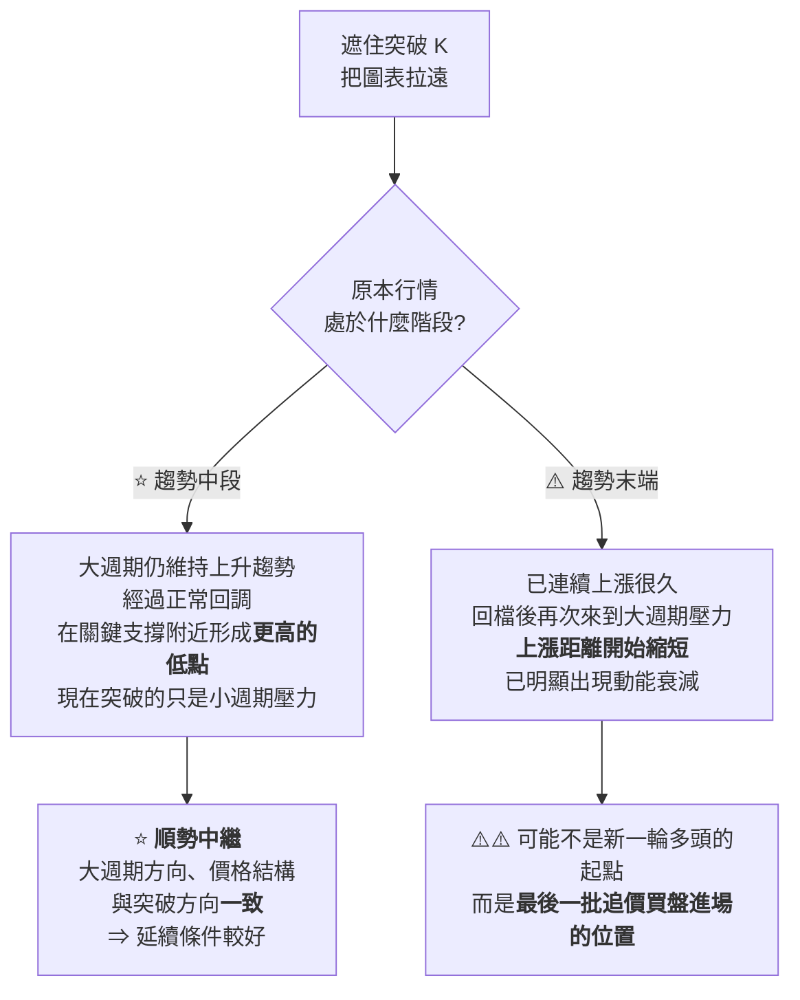
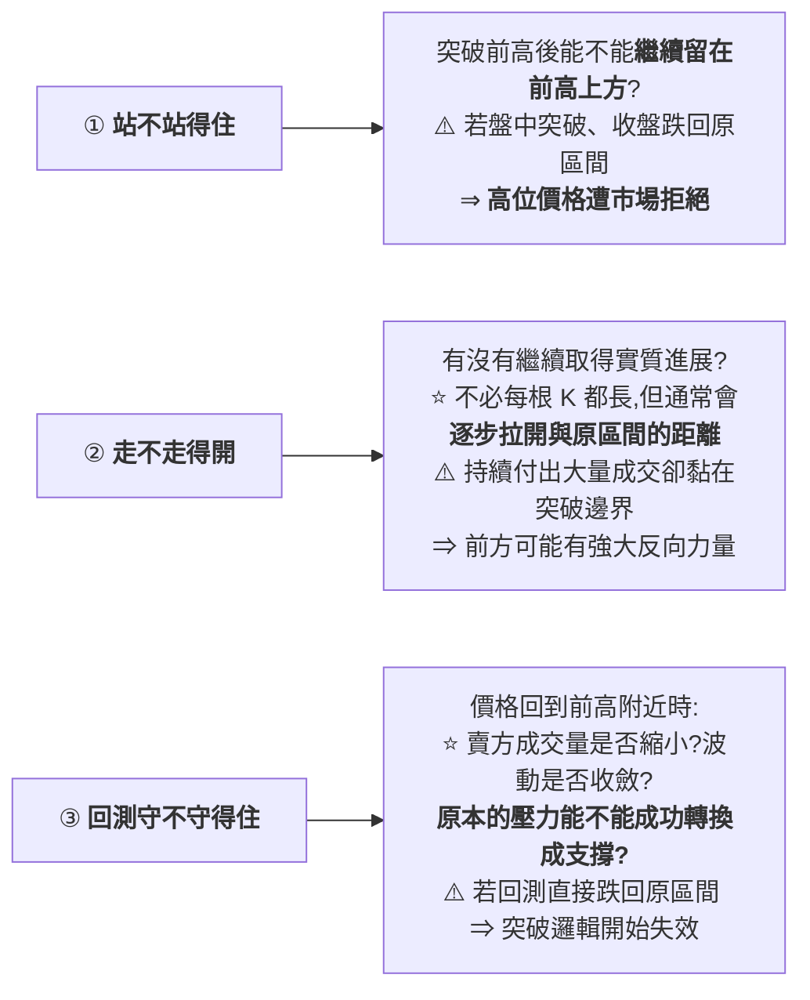
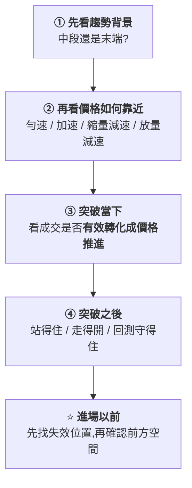

# 放量突破前高為什麼一追就被套:四層證據判斷真假突破與破底翻

> ⚠️⚠️ **非投資建議。** 本文是對一支公開交易教學影片的整理,內容屬技術分析方法論,不含任何買賣建議。
> 整理自 YouTube 頻道 **簡一聊交易**〈[放量突破前高,為什麼你一追就被套?4層證據看懂真假突破與破底翻](https://www.youtube.com/watch?v=7_UKPsakszU)〉(2026-08-21,約 16.2 分鐘,無字幕、以 CPU faster-whisper 轉錄)。
> ⚠️ **立場揭露:影片說明欄含 TOPONE Markets 的推廣連結(含追蹤碼)與 TradingView 連結**,片中亦口頭提及這兩個工具。本文不轉述其功能宣稱。
> ⭐ **值得肯定的一點:影片自己在說明欄明確標示「本內容僅用於市場研究與交易教育,不構成任何投資建議」** —— 這在此類內容中並不常見。

---

## 一句話總結

> ⭐⭐⭐ **「成交量代表投入,價格位移才代表結果。」**
>
> **判斷突破真假,不是看那根 K 棒夠不夠強,而是問四件事:
> 它發生在哪裡、它怎麼靠近關鍵位、大量成交換來了多少推進、突破後市場接不接受新價格。**

---

## 一、問題:條件明明全對,為什麼還是被套

**典型場景 —— 教科書上的突破條件一個都沒少:**

| 條件 | 狀態 |
|---|---|
| 成交量放大 | ✅ |
| K 棒實體飽滿(長紅) | ✅ |
| 收盤站穩前高之上 | ✅ |

⚠️ **結果:才剛進場,下一根 K 棒立刻跌回突破區,越跌越快,最後停損出場。**

> ⭐⭐⭐ **作者點破的關鍵前提:**
> **「多數人判斷突破,只看價格有沒有穿越前高。
> 但真正影響突破能不能延續的,是價格突破以後,**市場願不願意接受新的價格**。」**
>
> ⭐⭐ **「所以突破從來不是單一 K 棒的事件,而是一個**市場重新定價的過程**。」**

📌 **方法論上的定位也講得清楚:「不需要猜主力想做什麼,只觀察市場留下來的客觀證據。」**

---

## 二、⭐⭐ 證據一:大趨勢與結構背景(它發生在哪裡)

### ⭐ 一個很實用的操作:先把突破 K 遮住

> **「判斷任何一次突破,我都不會先盯著那根長紅 K。
> 我會**暫時把突破 K 遮住、把圖表拉遠**,先問自己:
> 如果拿掉最後這根 K 棒,原本的行情處於什麼階段?」**

> ⭐⭐⭐ **一句話對照:「趨勢中段的突破,可能是行情的延續;
> 趨勢末端的突破,卻可能是**情緒的最後高潮**。」**

⚠️ **但作者立刻補上限制:「大背景只能提供方向傾向,不能替市場完成確認。」**

---

## 三、⭐⭐⭐ 證據二:突破前的靠近方式(全片最有價值的一層)

> ⭐⭐ **核心觀念:「靠近支撐壓力時,**不是越快越好**。」**
> **比喻:汽車在平坦馬路上勻速行駛,通常比一路加速更省力。**

### 四種靠近方式,由好到差

| 排序 | 方式 | 特徵 | 判讀 |
|---|---|---|---|
| ⭐⭐⭐ **最理想** | **勻速貼近** | 價格一段一段往上推、**沒有突然衝刺**;到前高下方再配合**縮量整理**,回檔波動收斂 | **賣方出手只能把價格推回很短的距離,買方願意在越來越高的位置承接** ⇒ **前高附近的賣壓正在被逐步消化** |
| ⭐ **次之** | **加速推進** | 底部完成籌碼收集後快速上漲,接近壓力時又進一步加速 | **看起來更強,但中間沒有充分整理** ⇒ 到壓力時買方可能已消耗不少動能;⚠️ **作者的做法是等回測確認後再進場** |
| ⚠️ **較差** | **縮量減速靠近** | **還沒真正貼近壓力**,每段上漲距離就開始縮短、紅 K 實體變小、成交量也下降 | **動能衰減的特徵** ⇒ 假突破機率提高 |
| ⚠️⚠️ **最差** | **放量減速靠近** | **越接近壓力成交量越大,但每次上漲距離卻越來越短** | ⭐⭐⭐ **明顯的量價背離** —— 多方投入更多成交卻換不到對應的價格進展 ⇒ **反向力量正在增加**;後面即使放量突破,長紅 K 也可能只是**最後一批追價買盤被集中吸收的位置** |

### ⚠️ 一個很容易混淆、作者特別點出的區分

> ⭐⭐ **「縮量減速靠近」與「貼近壓力後的縮量整理」不是一回事:**
>
> | | 位置 | 意義 |
> |---|---|---|
> | ⭐ **縮量整理** | **已經貼近壓力** | **在壓力下方消化賣壓**(好事) |
> | ⚠️ **縮量減速** | **還沒到壓力** | **動能就已經衰減**(壞事) |

> ⭐⭐⭐ **本層的結論:「突破前不要只看價格有沒有靠近支撐壓力,
> 還要看它是**怎麼**靠近的 —— 靠近方式往往比突破 K 棒本身更重要。」**

---

## 四、⭐⭐⭐ 證據三:突破當下的量價效率

### ⚠️ 「突破一定要放量」只說對了一半

> ⭐⭐ **「真突破會放量,**假突破同樣可能出現大量**。」**
>
> **因為價格越過前高時,**空方停損、追價買單,與原本掛在壓力區的賣單**
> 會在很短時間內集中成交 —— 成交量很大只代表**這個位置有很多人參與**,
> 不能直接告訴你最後是哪一邊佔優勢。**

### ⭐⭐⭐ 該問的是:這麼大的成交量,換來了多少價格推進

**同樣是「放量一倍」的兩種突破:**

| | 表現 | 判讀 |
|---|---|---|
| ⭐ **A** | 突破後**迅速拉開距離**,收盤明顯遠離前高 | **放量而且走得開** ⇒ **主動買方暫時佔優** |
| ⚠️⚠️ **B** | 同樣放巨量,但價格**始終黏在前高附近**;盤中不斷向上衝,**收盤卻只比突破位高一點,甚至留下明顯長上影** | **放量卻走不動** ⇒ **大量買單可能正在被對手盤吸收**,或原本的上漲力量已接近衰竭 |

> ⭐⭐⭐ **全片最核心的一句:「成交量代表投入,價格位移才代表結果。」**

⚠️ **而即使一根 K 棒同時滿足「放量 + 實體突破 + 收盤站上前高」,仍然不能確認是真突破 ——
因為真正讓人被套的,往往不是突破發生的瞬間,而是突破以後市場做了什麼。**

---

## 五、⭐⭐⭐ 證據四:市場是否接受新價格(權重最高)

**突破之後觀察三個動作:**

> ⭐⭐⭐ **「前面三層再漂亮,市場不接受新價格,仍然要尊重市場最後給出的答案。」**

---

## 六、⭐⭐ 真突破的兩種參與方式(判斷對 ≠ 賺得到)

> ⚠️⚠️ **「就算是真突破,也不代表可以在**任何價格**進場。」**

### 方式一:突破收盤進場

| 項目 | 內容 |
|---|---|
| ⭐ **適用條件** | **突破前已出現緊湊的縮量整理**,而且**結構失效位置非常清楚** —— 價格貼近壓力區間、回檔較淺、波動收斂,最後出現帶量實體突破 |
| **時機** | **等 K 棒收盤確認後**再評估 |
| ⭐⭐ **停損** | **不是設一個隨意的百分比,而是放在前面壓縮結構的失效位置** —— 只要價格重新跌破整理結構低點,「壓力後延續」這個交易理由就不存在了 |
| ⭐⭐⭐ **下單前先算風險報酬比** | 進場到結構失效點的距離 = **1R**;若下一個關鍵壓力**還有 1R 以上的空間**,潛在風險報酬比 > 1,**這筆交易才具備評估價值** |

⚠️ **例外處理:同樣是突破前先完成縮量整理,但如果突破 K 一口氣拉得太遠 ⇒ 合理停損變大、前方又很快遇壓力
⇒ ⭐ **要參與就等比降低部位做風險控管,或保險起見等回測確認後再進場**。**

### 方式二:回測確認進場

| 項目 | 內容 |
|---|---|
| **適用條件** | **突破前沒有經過緊湊壓縮**,而是底部完成籌碼收集後**加速突破** |
| **做法** | **等價格回到突破區域**,觀察回測時:賣方量能是否縮小、K 棒波動是否收斂、價格能不能繼續守在前高上方 |
| **進場點** | **當買方再次取得進展,或小週期重新向上突破**,才考慮參與 |
| **停損** | 放在**回測低點下方** |

### ⭐⭐⭐ 最危險的位置:突破已走遠、回測卻還沒發生

> ⚠️⚠️ **「突破進場太晚、停損已經變遠、回測又還沒出現、新的結構也尚未形成。」**
>
> ⭐⭐⭐ **「很多人虧損並不完全是方向看錯,而是**買在風險報酬極差的位置**。」**
>
> ⭐ **「錯過一筆行情不會傷害帳戶,**失控的風險才會**。」**

---

## 七、⭐⭐ 破底翻:先看空頭怎麼靠近,再等多頭真正接手

> ⚠️ **「價格跌破關鍵支撐又快速收回,只能證明**破底出現異常**,
> 不能直接證明新的上漲趨勢已經開始。」**

### 前提條件(兩個)

| # | 條件 |
|---|---|
| **1** | ⭐ **要順應大的趨勢背景** |
| **2** | ⭐⭐ **要發生在籌碼密集區或水平流動性聚集區這種關鍵支撐位** —— 因為這些位置聚集了停損、追價與被動成交,**價格短暫破底才能觸發足夠多的流動性** |

### 三種情境與對應做法

| 類型 | 靠近方式 | ⭐ 參與條件 | 停損 |
|---|---|---|---|
| **衰竭型 A:縮量減速** | 越接近支撐,每段下跌距離越短、黑 K 實體縮小、**成交量也下降** | ⚠️ **只說明空頭力量減弱,還不能證明多頭發力** ⇒ **不立刻進場**;等**小週期方向結構向上突破**(常見畫面:收回區間後先幾根小黑 K,隨後**放量突破小黑 K 的高點**) | 掃過流動性的最低點之外 |
| ⭐⭐ **衰竭型 B:放量減速(量價背離)** | 越接近支撐**成交量越大**,但每段下跌距離**越來越短** | ⭐⭐⭐ **不只代表空頭動能衰減,也說明多頭已經開始承接發力** ⇒ **只要反向力量明確表態就可評估參與**(例:垂直下跌後出現一根**放量紅 K**、形成**看漲吞噬**,或小週期結構向上突破) | 同上 |
| ⚠️ **加速型** | 破底前**逐漸加速**,黑 K 實體不斷放大、成交量快速放大,**市場情緒進入恐慌**,最後快速跌破前低又被強力拉回 | ⚠️⚠️ **第一波上漲可能只是空單回補 ⇒ 不急著追多**;⭐ **等價格再次回測低點** —— 若二次回測**無法創出有效新低**、**成交量明顯低於第一次破底**、K 棒波動開始收斂,隨後小週期重新向上突破,才考慮參與 | **二次回測低點下方** |

> ⭐⭐⭐ **一句話:「破底翻不是猜底,而是**先看空頭怎麼靠近關鍵支撐,再等多頭真正接手**。」**

---

## 八、⭐⭐ 開場案例復盤:危險在哪一步就出現了

**回到那根讓人追多被套的長紅 K,四層證據逐層檢查:**

| 層 | 當時的狀態 |
|---|---|
| **① 背景** | ⚠️ **不是趨勢中段** —— 價格連續上漲後,來到**大週期壓力附近** |
| **② 靠近方式** | ⚠️⚠️ **最差的那一種** —— 越接近前高**成交量越來越大**,但每段上漲距離**越來越短**(量價背離) |
| **③ 量價效率** | ⚠️ **效率低** —— 雖然放量突破、盤中衝得很快看似很強,**但收盤仍停留在突破邊界附近** |
| **④ 突破後** | ⚠️⚠️ **最後的答案** —— 沒有持續創新高,下一根 K 棒迅速跌回原區間,隨後小週期向下跌破 ⇒ **市場用後續行為證明它不接受前高上方的新價格** |

> ⭐⭐⭐ **「真正該問的,從來不是這根長紅 K 夠不夠強,而是:
> 它發生在哪裡?它如何靠近關鍵支撐壓力?大量成交換來了多少推進?突破以後,新價格有沒有被市場接受?」**

---

## 九、⭐⭐⭐ 濃縮成四句話

⭐ **作者自述整個「行情分析的底層邏輯」系列的主線只有四個詞:
**趨勢背景、市場結構、動能、量價**。**

---

## 應用案例

### 案例 1|⭐⭐⭐ 把四層證據做成一張進場前的檢查表

**下次看到放量突破前高時,不要只憑一根 K 棒決定 —— 逐層打勾:**

| 層 | 檢查項 | 過 / 不過 |
|---|---|---|
| ① | **遮住突破 K,這是趨勢中段還是末端?** | |
| ② | **靠近方式是四種裡的哪一種?**(放量減速 ⇒ 風險最高) | |
| ③ | **收盤有沒有明顯遠離前高?**(還是黏在邊界、留長上影) | |
| ④ | **站得住?走得開?回測守得住?** | |
| ⭐ **進場前** | **停損放在結構失效位置,且前方空間 ≥ 1R?** | |

> ⚠️ **注意第②層的那個易混點:「縮量減速靠近」(還沒到壓力就衰減)
> 與「貼近壓力後的縮量整理」(在壓力下方消化賣壓)意義相反,別搞混。**

### 案例 2|⭐⭐ 用「量價效率」這個概念檢視自己的舊單

**翻出你最近三筆追突破的交易,只問一個問題:**

> ⭐ **「那天的成交量放大了多少倍?價格實際推進了多少?」**

📌 **如果你發現自己進場的那幾天,量都很大但收盤都黏在突破位附近 ——
那不是運氣不好,是**你一直在買「投入很大但結果很小」的位置**。**

### 案例 3|⭐ 風險報酬比的最低門檻

**這是影片裡唯一一個可以量化的過濾條件,也最容易執行:**

| 步驟 | 做法 |
|---|---|
| **①** | 找出**結構失效位置**(不是隨意的百分比) |
| **②** | **進場價到失效位置的距離 = 1R** |
| **③** | ⭐⭐ **量出到下一個關鍵壓力還有幾 R** |
| **④** | ⚠️ **不到 1R ⇒ 這筆交易不具備評估價值,直接跳過** |

> ⭐⭐⭐ **「錯過一筆行情不會傷害帳戶,失控的風險才會。」**

### 案例 4|⚠️ 這套方法的適用邊界(本文補充)

⚠️ **影片沒有討論適用邊界,以下是閱讀時應自行留意的:**

| 項目 | 提醒 |
|---|---|
| **市場與商品** | 影片未指明適用於哪些市場/週期。**成交量的意義在不同商品差異很大**(例:外匯現貨沒有集中式成交量) |
| ⚠️ **未提供回測數據** | **全片沒有任何勝率、期望值或樣本統計** —— 這是一套**判讀框架**,不是被驗證過的策略 |
| ⭐ **對照本庫其他筆記** | [[trading-math-expectancy-variance-risk]] 指出:**任何策略都要先確認期望值為正**;[[positive-expectancy-rule-hunting-mark-yang]] 更直白 —— **確認方式只有「它是明確的漏洞/套利」或「統計回測」兩條**。⚠️ **本片屬於前者都不是、後者也未提供的那一類,務必自行驗證** |

---

## 重點回顧(TL;DR)

1. ⭐⭐⭐ **突破不是單一 K 棒事件,是「市場重新定價的過程」** —— 關鍵在突破後市場願不願意接受新價格。
2. **證據一(它發生在哪裡)**:⭐ **遮住突破 K、把圖表拉遠**,先問原本行情是趨勢中段還是末端。**中段的突破可能是延續,末端的突破可能是情緒的最後高潮。**
3. ⭐⭐⭐ **證據二(怎麼靠近)—— 最有價值的一層**。四種由好到差:**勻速貼近 > 加速推進 > 縮量減速 > 放量減速**。
4. ⚠️ **「縮量減速靠近」≠「貼近壓力後的縮量整理」** —— 前者是還沒到壓力就衰減(壞),後者是在壓力下方消化賣壓(好)。
5. ⚠️⚠️ **放量減速 = 量價背離**:投入更多成交卻換不到價格進展,**假突破風險最高**;此時的長紅 K 可能只是最後一批追價買盤被集中吸收的位置。
6. ⭐⭐⭐ **證據三:「突破一定要放量」只說對一半** —— 假突破同樣可能放大量(空方停損 + 追價買單 + 壓力區賣單集中成交)。**該問的是這麼大的量換來多少推進。**
7. ⭐⭐⭐ **「成交量代表投入,價格位移才代表結果。」**
8. **證據四(權重最高):站不站得住、走不走得開、回測守不守得住。** 前三層再漂亮,市場不接受就是不接受。
9. ⭐⭐ **真突破的兩種參與方式**:突破收盤進場(需突破前有緊湊縮量整理 + 失效位置清楚)、回測確認進場(適用加速突破)。
10. ⭐⭐⭐ **最危險的是「突破已走遠、回測卻還沒發生」的中間價位** —— **很多人虧損不是方向看錯,是買在風險報酬極差的位置。**
11. **停損放結構失效位置,不是隨意的百分比**;⭐ **進場前先算:到失效點 = 1R,前方空間要 ≥ 1R。**
12. ⭐⭐ **破底翻三種**:縮量減速(等小週期結構向上突破)、**放量減速(量價背離,多頭已開始承接 ⇒ 反向力量表態即可評估)**、加速型(**第一波可能只是空單回補,要等二次回測不破新低**)。
13. ⭐ **「破底翻不是猜底,是先看空頭怎麼靠近,再等多頭真正接手。」**

⚠️ **再次聲明:本文為技術分析方法論整理,非投資建議。影片未提供任何回測或統計驗證。**

---

## 核實狀態

### ⚠️ 本篇的性質

> ⚠️⚠️ **這支影片是**交易判讀框架的教學**,全片沒有引用任何論文、統計或回測數據,
> 也沒有給出勝率、期望值或樣本數。因此本文**無法進行數字核實**,
> 只能區分「技術分析領域的通用概念」與「作者的個人框架與命名」。**

### ✅ 屬於技術分析的通用概念(非本影片獨創)

| 概念 | 說明 |
|---|---|
| **量價背離** | 成交量放大但價格推進縮短,屬標準的技術分析概念 |
| **支撐壓力轉換**(壓力突破後轉為支撐) | 標準概念 |
| **回測確認進場** | 標準做法 |
| **看漲吞噬型態** | 標準 K 線型態 |
| **以結構失效點設停損、以 R 計算風險報酬比** | ⭐ 標準的風險管理做法,與本庫 [[minervini-think-trade-like-champion]]、[[trading-math-expectancy-variance-risk]] 一致 |
| **籌碼密集區 / 流動性聚集區會聚集停損** | 屬市場微結構的普遍認知 |

### ⚠️ 屬於作者的個人框架與命名

- ⭐ **「四層證據」這個組織方式**與**四種靠近方式的分類命名**(勻速 / 加速 / 縮量減速 / 放量減速)——
  **合理且好用,但非標準術語。**
- **「站得住 / 走得開 / 回測守得住」三動作** —— 作者的歸納。
- **破底翻分為衰竭型(縮量減速 / 放量減速)與加速型** —— 作者的分類。
- ⚠️ **各情境對應的具體進場條件**(如「等小週期結構向上突破」「二次回測不破新低」)——
  **屬作者的操作偏好,未提供驗證。**

### ⚠️ 未能查證

- **開場那個案例的實際標的與時間** —— **影片未指明,無法回溯驗證。**
- **作者的職業交易員身分與績效** —— **無第三方佐證。**
- **影片提及的兩項工具** —— ⚠️ **其中一項為含追蹤碼的推廣連結,本文不評價其功能宣稱。**

> ⚠️⚠️ **本文整理一套技術分析的判讀框架。框架本身自洽且概念清楚,
> 但**未經任何公開的統計驗證** —— 使用前請自行回測,並參照
> [[trading-math-expectancy-variance-risk]] 確認期望值。非投資建議。**

---

## 來源

- [放量突破前高,為什麼你一追就被套?4層證據看懂真假突破與破底翻 — 簡一聊交易](https://www.youtube.com/watch?v=7_UKPsakszU)(2026-08-21,約 16.2 分鐘。⚠️ 說明欄含 TOPONE Markets 推廣連結與 TradingView 連結;⭐ 但影片亦自行標示「不構成任何投資建議」)
- 延伸:本庫 [[double-top-bottom-momentum]](**同一頻道**,雙底雙頂:看的不是形態像不像,而是動能有沒有衰減 —— ⭐ 與本篇「靠近方式決定一切」是同一套思路)、[[trading-math-expectancy-variance-risk]](期望值與破產風險)、[[positive-expectancy-rule-hunting-mark-yang]](確認策略有效只有回測與找漏洞兩條路)、[[minervini-think-trade-like-champion]](VCP 與停損紀律)、[[short-term-trading-7-rules]]、[[high-yin-then-yang-low-yang-then-yin]]。

> 該片無字幕,逐字稿以 CPU 版 faster-whisper(small / int8 / zh)轉錄取得,**非官方字幕**,可能有少量聽寫誤差。
> 專有名詞已依上下文還原:轉錄中的「錢高 / 錢膏 / 前糕」為 **前高**、「載服整理 / 載夫整理」為 **縮量整理**、
> 「趨勢中斷 / 趨事末斷 / 趨式末端」為 **趨勢中段 / 趨勢末端**、「雲速 / 雲數 / 雲束」為 **勻速**、
> 「量價效率」「破底翻 / 破底番」維持原詞、「回渠 / 回側 / 回渡」為 **回測**、
> 「資損 / 掃損」為 **止損 / 掃停損**、「私校位置 / 失效位置」為 **失效位置**、
> 「垂直線之後」為 **垂直下跌之後**、「KBUN / K-Bong」為 **K 棒**、「簡醫療交易」為 **簡一聊交易**。
