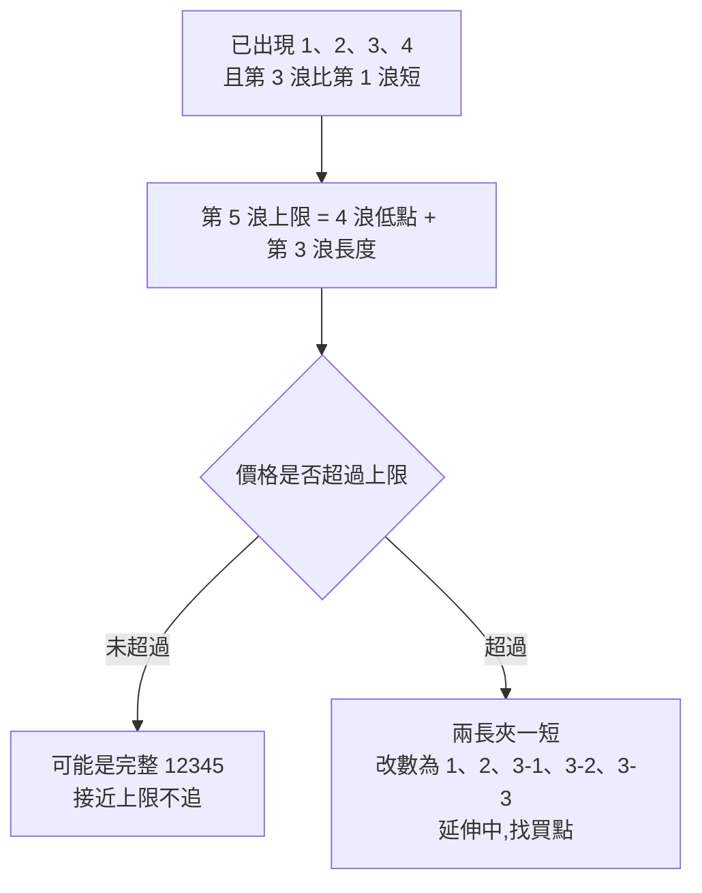
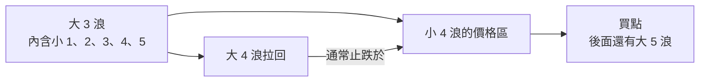

# 進化波浪理論:一套可照做的波浪分析方式(黃培碩「進化波浪實戰教學」整理)

**主題分類:** 投資 / 技術分析 — 艾略特波浪理論的實戰改良
**來源:** YouTube 播放清單〈進化波浪棒棒堂〉(運通財經台,黃培碩分析師,運達證券投顧,2024-03~04 錄製,共 6 集:第 1–5、7 集;**第 6 集不在清單內**)。**各集皆無字幕,逐字稿以 CPU faster-whisper 轉錄、非官方字幕。** 標準艾略特波浪規則已對照 Frost & Prechter《Elliott Wave Principle》體系的公開教材核實。
**整理日期:** 2026-10-06

> ⚠️ **非投資建議。** 立場:講者為投顧分析師,每集推廣 LINE 粉絲團「@v168」與投顧專線,並提到配套的書與 DVD(《進化波浪戰法》)。本筆記只整理影片公開教學的方法,不涉及其付費服務或個股推薦。影片中的個股多為**事後回顧**的範例,不代表方法的勝率。

---

## TL;DR

1. ⭐⭐⭐ **「進化」的核心 = 波浪的非連續性**:原始艾略特理論把分鐘線一路疊到日、週、月、年線,無限延伸;講者認為這對操作沒用(台股從 1990 年高點後在月線上整理了 30 年,套上去永遠在「整理中」)。**做法:只看到週線為止,一組推動 + ABC 修正走完就「斷開」,下一段重新數。**週線五大波通常約 **2 年**(快的 1 年、慢的 3 年)走完。
2. ⭐⭐ **基本結構**:五波推動(1、2、3、4、5)+ 三波修正(A、B、C)。**ABC 是相對於前面的 12345 才存在的名稱**——沒有 12345,就不會有 ABC。做多只需專注 12345,推完就換股。
3. ⭐⭐ **兩大鐵律(不可違背)**:① **一、四浪不重疊**(同一級數);② **第三浪不能是最短**(通常最長,但「最長」不是必要條件)。
4. ⭐⭐⭐ **兩個實戰招式**:
   - **一四不重疊 ⇒ 臨界買點**:第四浪拉回接近(但不跌破)第一浪高點時買,跌破就停損並承認數錯。
   - **兩長夾一短 ⇒ 送分題**:第三浪比第一浪短、第五浪又比第三浪長 ⇒ 不可能是 12345,一定是**第三浪在延伸**(3-1、3-2、3-3…),後面還有很大一段。
5. ⭐⭐⭐ **回測次級四浪(波浪理論的靈魂)**:修正的低點,通常落在前一段波浪中**較低一級的第四浪範圍內**——這是找買點最常用的位置;從越細的級數去找,買點就越接近起漲點。

---

## 1. 基本結構:五升三降與級數

| 概念 | 說明 |
|---|---|
| **五升三降** | 一個完整循環 = 推動浪 12345 + 調整浪 ABC,共 8 個轉折(4 漲 4 跌) |
| **ABC 是相對名稱** | 「突然看到大盤跌一段就說這是 A 波」是錯的;大級數的 12345 對應大級數的 ABC,小級數的對應小寫 abc |
| **浪中有浪、波中有波** | 大一級的第 3 浪裡面又有一組小的 12345abc;從月線、週線、日線、小時線到逐筆成交圖(tick)都看得到同樣的波形 |
| **做多重點** | ABC 不重要,重要的是 12345:做第 1 浪、2 浪拉回再做第 3 浪、避開第 4 浪、再做第 5 浪;5 浪結束就換股 |
| **適用市場** | 參與者越多越準(股票、期貨、外匯、黃金),因為它反映的是**人類群體行為** |

**定位(數浪)的重要性:**一旦位階定對,接下來約兩年的走勢大致都會沿著位階走,每一步都可驗證;定錯就「亂成一團」。定位靠三樣東西:**鐵律**(不可違背)、**指引**(交替原則、回測次級四浪)、**各浪特性**。

---

## 2. 「進化」在哪裡:波浪的非連續性

| | 傳統艾略特 | 進化波浪(講者) |
|---|---|---|
| 級數 | 無限向上疊:分鐘 ⇒ 日 ⇒ 週 ⇒ 月 ⇒ 年 ⇒ 世紀 | **看到週線就好,月線不理它** |
| 連續性 | 每一段都屬於更大一級的某個位置 | **一組推動 + ABC 走完就斷開**,下一段重新數 |
| 時間尺度 | 不限 | 週線五大波約 **2 年**(1–3 年),個股尤其標準 |
| 理由 | 理論完整 | 長線疊起來「研究可以,操作沒幫助」——月線 12 根就一年,兩三天不動你就受不了 |

**講者的例證(台股月線):**從約 636 點起漲的一組五大波,約 4–5 年推到 **12,682**,之後大跌到 **2,485**;接下來來回整理超過 30 年。如果硬把這 30 年套進大級數的 ABC 或三角收斂,「永遠都在這個地方,對操作沒有意義」。

**群體行為的解釋:**一組 12345 推完、ABC 整理後,參與那一段行情的是一批人;隔幾年再出現另一組 12345,參與者已經換了一批 ⇒ 兩段沒必要硬接起來。個股也一樣:一段漂亮的推升走完,可能整理 **10 年**才又出現下一組推動,中間不要碰。

> 📌 歷史補充:台股 1990 年 2 月高點 12,682、同年 10 月低點約 2,485 屬實;影片口述把「郭婉容事件(課徵證所稅)」與這段下跌連在一起,但郭婉容宣布復徵證所稅是 **1988 年 9 月**,引發的是 1988 年的連續無量下跌,並非 1990 年那一段崩跌的主因。

---

## 3. 兩大鐵律與實戰應用

### 3.1 鐵律一:一、四浪不重疊

- 多頭:**第 4 浪的低點不可低於第 1 浪的高點**;空頭反之(第 4 浪反彈高點不可高於第 1 浪低點)。
- 只比較**同一級數**:第 3 浪還在延伸時,它內部的小 2 浪拉回跌破第 1 浪高點**不算**違規(那是 3-2,不是 4)。等第 3 浪整組走完,拉回的第 4 浪才不可重疊。「看到疊破就說不是推動,言之過早。」

**應用:臨界買點**
1. 判斷目前是 1、2、3 之後拉回的第 4 浪。
2. 在**接近但未跌破第 1 浪高點**處買進,停損就設在跌破第 1 浪高點。
3. 沒跌破 ⇒ 有第 5 浪可做;跌破 ⇒ 承認原本的「123」數錯了,它只是 ABC 反彈,**站賣方或換股**。

> 影片例(事後回顧):第 4 浪低點貼著第 1 浪高點只差幾檔就止跌,隨後走出第 5 浪;反例則是拉回疊破,之後一路往下,證明只是整理型態。

### 3.2 鐵律二:第三浪不能是最短

- 第 3 浪**通常最長**,但只要求「不是最短」——當第二長也可以。
- 推論:若第 1 浪長、第 3 浪短,則**第 5 浪不可長於第 3 浪**。

**應用一:算出第五浪上限,高處不追**
> 例:90 漲到 150(第 1 浪 60 元),拉回 130;130 漲到 165(第 3 浪 35 元),拉回 155。
> ⇒ 若這是 12345,第 5 浪不能超過 35 元,即**不能高於 190**。接近 190(甚至 180 幾)不要追,隨時可能見高點。

**應用二:兩長夾一短 = 送分題**
> 同上例,若價格**突破 190**,第 5 浪就比第 3 浪長 ⇒ 變成「長、短、長」,違反鐵律二 ⇒ 不可能是 12345。
> ⇒ 正確數法:**1、2,然後 3-1、3-2、3-3、3-4、3-5**——第 3 浪正在延伸,後面還有第 4、第 5 浪。**越過 190 反而要找買點**——這違反直覺,所以叫送分題。

> ⚠️ 補正:影片只講「兩大鐵律」。標準艾略特理論其實有**三條**規則,另一條是**第 2 浪不可跌破第 1 浪起點**(回檔不可超過 100%);另外,「一四不重疊」在**楔形(引導/終結斜三角)**中允許例外。用這套方法時這兩點要自行補上。

---

## 4. 各浪特性(輔助定位)

| 浪 | 特性(多頭為例) | 怎麼用 |
|---|---|---|
| **第 1 浪** | 兩種:① **築底型**——長期整理後「緩步攻堅」,時間拉很長,漲幅較小;② **大修正後的第 1 浪**——前面大級數 ABC 修正完立刻推出,漲幅較大(常是大一級的第 3 或第 5 浪的開端) | ⭐ 講者最重視:「**把第 1 浪抓出來,其他往上推算就好**」;看到緩步攻堅的形狀就先定為 1 |
| **第 2 浪** | 回檔常較深,約 **0.618**;量縮;多數人不相信跌勢已止;常形成頭肩底或 **右腳較高、頸線傾斜的 W 底** | 回檔深不代表沒戲 |
| **第 3 浪** | 最具爆炸性:量大增、常有**不回補的跳空缺口**、突破所有壓力線、軌道明顯比第 1 浪陡;**延伸最常發生在第 3 浪** | 看到第 3 浪特徵,拉回要站買方 |
| **第 4 浪** | 若第 3 浪是爆炸性延伸,第 4 浪拉回通常較淺,約 **0.382** | 配合鐵律一找臨界買點 |
| **推動未完成前** | 一路推、拉回都不深;整組結構完成後,拉回才會變深 | 拉回淺 ⇒ 結構可能還沒走完 |

> 影片第 5 集只講到第 1–3 浪,第 4、5 浪、ABC 與成交量的細節說「留待下一集」(第 6 集不在此播放清單)。

---

## 5. 回測次級四浪:波浪理論的靈魂(第 7 集)

**原理(對照標準理論 ✅):**調整浪——特別是第 4 浪——的低點,**通常會落在前一段推動浪中「較低一級」的第 4 浪範圍內**。這是 Frost & Prechter 書中列為重要指引的「前一個第四浪」原則。

**兩種情境,意義不同:**

| 情境 | 回測次級四浪的意義 |
|---|---|
| 大級數 12345 **尚未走完**(例如大 3 浪結束後的大 4 浪) | 真正的買點,後面還有一段推動 |
| 大級數 12345 **已經走完**(五大波結束後的 A 浪) | 只能搶 **B 浪反彈**,不是新行情 |

**常見迷思:「回測次級四浪買得那麼高?」**——講者說錯了:同一個原則**放到更細的級數**(小時線裡的細微波五小波 + abc 拉回),買點就幾乎落在整個波段的起漲點。做法:發現某檔股票在小時線走出一組完整的五小波推動,就等它的 abc 回測次級四浪;以日線看,往往就是剛啟動的位置。

**講者的範例(事後回顧,數字為影片口述):**
- 高力(8996):週線 52.7 起漲五大波走完,A 浪跌到約 208 止跌,是回測次級四浪;其後 B 浪反彈到約 402,但仍只是反彈。
- 同一檔較早期:52.7 → 143(小 12345)回到 101、101 → 250 回到 188,兩次都是回測次級四浪的買點。
- 亞力(1514):24.5 → 74.8 的初升段走完小 12345,abc 回到約 47 是買點,之後主升段一路到約 184。

---

## 6. 分析方式(SOP):照著做一次

1. **選週期**:個股以**週線**為主框架,找最近一組可能的推動;**月線以上不理**。日線、小時線用來找進場點。
2. **斷開**:往前找到上一組「12345 + ABC」結束的位置,從那之後重新數。整理中、沒有推動的股票不碰。
3. **定第 1 浪**:找「緩步攻堅、時間拉很長」的築底上漲,或大修正後的第一段推升。
4. **確認 2、3 浪**:2 浪不可跌破 1 浪起點(⚠️ 影片未提,標準規則);3 浪出現量增、跳空、軌道變陡。
5. **套兩大鐵律檢查**:一四不重疊(同級數)、第三浪不是最短;違反就改數法。
6. **找買點(三選一)**:
   - 第 4 浪接近第 1 浪高點的**臨界買點**;
   - **兩長夾一短**確認延伸後的拉回;
   - **回測次級四浪**的價格區。
7. **設停損**:臨界買點跌破第 1 浪高點 ⇒ 認錯;回測次級四浪跌破該區間 ⇒ 認錯。
8. **設出場**:用鐵律二算出第 5 浪上限,接近上限不追;五浪走完就**換股**,不等 ABC。
9. **時間檢查**:一組週線五大波約 2 年;明顯超過時,檢查是不是數錯級數。
10. **記錄與複盤**:每次定位都寫下來,事後比對對錯(講者強調「每一個轉折都要給它相對應的名分」)。

---

## 7. 應用案例(情境示意,非真實個股)

**情境:**某股票整理三年後,週線從 50 緩步漲到 80(花了 6 個月),拉回到 62,接著 10 週內帶量跳空漲到 140,再拉回到 118。

| 步驟 | 判斷 |
|---|---|
| 斷開 | 前三年整理不理它,從 50 開始數 |
| 第 1 浪 | 50 → 80(緩步攻堅,+30),定為 1 |
| 第 2 浪 | 80 → 62,回檔 18/30 = 0.6,接近 0.618 ✓;沒跌破 50 ✓ |
| 第 3 浪 | 62 → 140(+78,帶量、跳空、軌道變陡)✓,比第 1 浪長 ✓ |
| 第 4 浪 | 140 → 118:**118 高於第 1 浪高點 80** ⇒ 一四不重疊 ✓;回檔 22/78 ≈ 0.28,接近 0.382 的淺回檔 ✓ |
| 回測次級四浪 | 檢查 62 → 140 內部的小 4 浪,假設在 112–120 ⇒ 118 落在區間內 ⇒ **買點** |
| 停損 | 跌破小 4 浪區間下緣(或保守用跌破 80) |
| 第 5 浪目標與出場 | 第 3 浪已最長,鐵律二不限制第 5 浪;可用常見比例估(如第 5 浪 ≈ 第 1 浪長度 ⇒ 約 148),五浪走完即換股 |

---

## 8. 方法的限制與批判

- **數浪主觀**:同一張圖不同人可以數出不同位階;講者自己也承認「當下定錯可能性很高」,要靠停損與換股修正。影片的成功案例幾乎都是**事後畫線**。
- **「只有波浪理論能預測未來」**:講者稱其他指標都是落後指標、只有波浪理論能預估方向與價位;這是講者觀點,學術上對波浪理論的預測力缺乏一致的實證支持。
- **規則不完整**:如 §3 補正,少講了「第 2 浪不可跌破第 1 浪起點」與斜三角例外。
- **非連續性是實務取捨,不是理論修正**:把週線以上斷開,換來可操作性,但也放棄了用大級數判斷長期趨勢的能力。
- **本筆記數字**:個股價位來自 Whisper 轉錄的口述,可能有聽寫誤差,未逐一比對歷史股價。

> ⚠️ **再次提醒:非投資建議。** 技術分析工具應搭配資金控管與停損,不應單獨作為買賣依據。

---

## 來源

- 播放清單:[進化波浪棒棒堂(運通財經台)](https://www.youtube.com/playlist?list=PL1wcXGa1umS-M2j82CsWUB8i9SJDO2z9A)(**各集無字幕,逐字稿以 CPU faster-whisper 轉錄、非官方字幕**)
  - [第 1 集:前言 概論 波浪有訣竅 進化才有效!(2024-03-26)](https://www.youtube.com/watch?v=sdY6GEg6e2o)
  - [第 2 集:波浪的劃分與級數 浪中有浪 波中有波(2024-03-29)](https://www.youtube.com/watch?v=I4Y9HyHRdQc)
  - [第 3 集:波浪理論二大鐵律(一)1、4 浪不重疊(2024-03-29)](https://www.youtube.com/watch?v=SzBjkooGt78)
  - [第 4 集:波浪理論鐵律之二 第 3 浪不能最短 2 長夾 1 短 送分題(2024-03-29)](https://www.youtube.com/watch?v=uIyz20KNW20)
  - [第 5 集:各波浪特性解析輔助精準定位階(2024-04-09)](https://www.youtube.com/watch?v=-5xsDJCAzmE)
  - [第 7 集:波浪理論的靈魂 回測次級 4 浪買點(2024-04-16)](https://www.youtube.com/watch?v=tLWn9XpRNPA)
- 標準艾略特波浪規則對照(三條規則、斜三角例外、「較低一級的前一個第四浪」指引):[StockCharts ChartSchool — Identifying Elliott Wave Patterns](https://chartschool.stockcharts.com/table-of-contents/market-analysis/elliott-wave-analysis-articles/identifying-elliott-wave-patterns)、[LuxAlgo — Elliott Wave Theory](https://www.luxalgo.com/library/concept/elliott-wave-theory/)

📎 相關筆記:[[breakout-four-layers-of-evidence]]、[[double-top-bottom-momentum]]、[[short-term-trading-7-rules]]

**Whisper 專有名詞還原對照:** 波浆/波浩/剝浪/波浠 → 波浪;艾瑞特 → 艾略特(Elliott);運大同僱/孕達頭顧/韻達投顧 → 運達投顧;黃培說 → 黃培碩;進化剝浪 → 進化波浪;一是不重疊/依視不重疖/醫師不重疊 → 一四不重疊;鐵率/鐵綠/鐵濾 → 鐵律;兩長加一矿/送分體 → 兩長夾一短/送分題;擴研/擴炎/擴圓 → 延伸;回測刺激式/次儀式/吃醫生 → 回測次級四浪;極速/楽速 → 級數;周黑線 → 週 K 線;Tigertool → Ticker 圖(逐筆成交);獨孤九劍、令狐沖為講者比喻。
