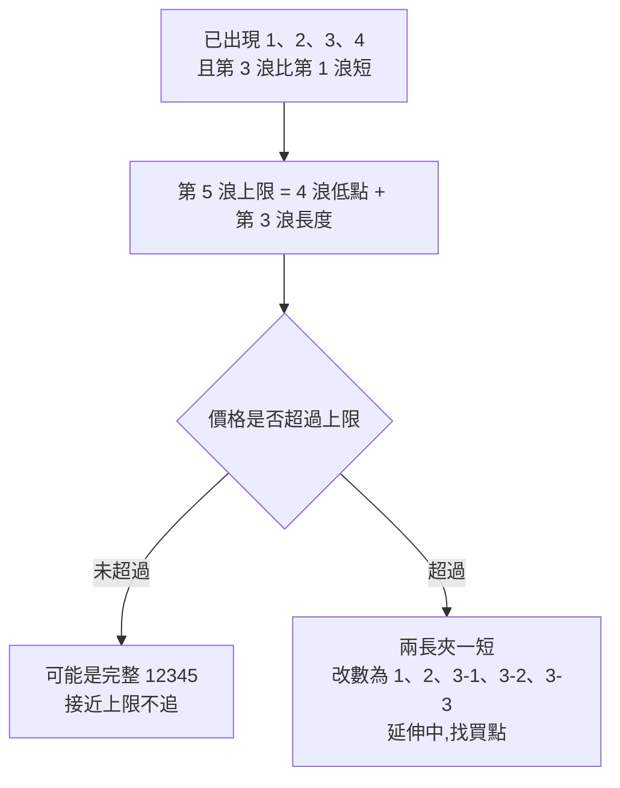

# 進化波浪理論:一套可照做的波浪分析方式(黃培碩「進化波浪實戰教學」全 8 集整理)

**主題分類:** 投資 / 技術分析 — 艾略特波浪理論的實戰改良
**來源:** YouTube 播放清單〈進化波浪棒棒堂〉(頻道:黃培碩分析師-運達證券投顧,2024-03-26 ~ 2024-04-19,**完整 8 集**;講者在第 8 集表示第一階段教學到此告一段落)。**各集皆無字幕,逐字稿以 CPU faster-whisper 轉錄、非官方字幕。** 標準艾略特波浪規則已對照公開教材核實。
**整理日期:** 2026-10-06

> ⚠️ **非投資建議。** 立場:講者為投顧分析師,每集推廣 LINE 粉絲團「@v168」與投顧專線,並提到配套的書與 DVD。本筆記只整理影片公開教學的方法,不涉及其付費服務或個股推薦。影片中的個股多為**事後回顧**的範例,講者強調部分是「當天節目就預告」,但本筆記未能逐一核對,也不代表方法的勝率。

---

## TL;DR

1. ⭐⭐⭐ **「進化」的核心 = 波浪的非連續性**:原始艾略特理論把分鐘線一路疊到年線;講者認為這對操作沒用。**只看到週線為止,一組推動 + ABC 修正走完就「斷開」,下一段重新數。**週線五大波通常約 **2 年**(1–3 年)走完。
2. ⭐⭐ **基本結構**:五波推動(12345)+ 三波修正(ABC);**ABC 是相對於前面的 12345 才存在的名稱**。浪中有浪、波中有波,從月線到逐筆成交圖都有相同波形。
3. ⭐⭐ **兩大鐵律(不可違背)**:① **一、四浪不重疊**(同一級數);② **第三浪不能是最短**。
4. ⭐⭐ **兩條指引**:① **交替原則**——第 2、4 浪整理一簡一繁;1、3、5 浪通常只有一浪延伸。② **回測次級四浪**——修正低點常落在前一段較低一級的第 4 浪範圍內,講者稱之為「波浪理論的靈魂」。
5. ⭐⭐⭐ **四個找點招式**:**臨界買點**(第 4 浪貼著第 1 浪高點不破)、**兩長夾一短送分題**(看到就知道第 3 浪在延伸)、**第五浪上限**(第 3 浪短時第 5 浪不可更長,接近上限不追)、**回測次級四浪買點**(越細的級數越接近起漲點)。
6. ⭐⭐ **量是因、價是果**:第 3 浪(尤其 3-3)量最大;第 5 浪量縮且與價背離 ⇒ 快結束;第 5 浪帶大量突破通道 ⇒ 延伸;**量的顯著低點常伴隨波浪轉折**。
7. ⭐ **風控**:週線五大波已走完的個股「盡量一定要避開」——B 浪是最容易賠錢的陷阱,C 浪破壞力堪比第 3 浪。

---

## 1. 基本結構:五升三降與級數(第 1、2 集)

| 概念 | 說明 |
|---|---|
| **五升三降** | 一個完整循環 = 推動浪 12345 + 調整浪 ABC,共 8 個轉折(多頭時 1、3、5、B 往上,2、4、A、C 往下) |
| **ABC 是相對名稱** | 「突然看到大盤跌一段就說這是 A 波」是錯的;大級數的 12345 對應大級數的 ABC,小級數的對應小寫 abc |
| **浪中有浪、波中有波** | 大一級的第 3 浪裡面又有一組小的 12345abc;月線、週線、日線、小時線到逐筆成交圖(tick)都看得到 |
| **做多重點** | ABC 不重要,重要的是 12345:做第 1 浪、2 浪拉回再做第 3 浪、避開第 4 浪、再做第 5 浪;5 浪結束就換股 |
| **適用市場** | 參與者越多越準(股票、期貨、外匯、黃金),因為它反映的是**人類群體行為** |
| **講者的定位** | 其他技術指標都要等收盤價,是落後的;波浪理論能預估方向與價位(⚠️ 講者觀點,見 §11) |

**定位(數浪)的重要性:**位階定對,接下來約兩年的走勢大致會沿著位階走,每一步都可驗證;定錯就「亂成一團」。定位靠三樣東西:**鐵律**(不可違背)、**指引**(交替原則、回測次級四浪)、**各浪特性與成交量**(輔助)。

---

## 2. 「進化」在哪裡:波浪的非連續性(第 1 集)

| | 傳統艾略特 | 進化波浪(講者) |
|---|---|---|
| 級數 | 無限向上疊:分鐘 ⇒ 日 ⇒ 週 ⇒ 月 ⇒ 年 ⇒ 世紀 | **看到週線就好,月線不理它** |
| 連續性 | 每一段都屬於更大一級的某個位置 | **一組推動 + ABC 走完就斷開**,下一段重新數 |
| 時間尺度 | 不限 | 週線五大波約 **2 年**(1–3 年),個股尤其標準 |
| 理由 | 理論完整 | 長線疊起來「研究可以,操作沒幫助」——月線 12 根就一年,兩三天不動你就受不了 |

**講者的例證(台股月線):**從約 636 點起漲的一組五大波,約 4–5 年推到 **12,682**,之後大跌到 **2,485**;接下來來回整理超過 30 年。硬把這 30 年套進大級數的 ABC 或三角收斂,「永遠都在這個地方,對操作沒有意義」。

**群體行為的解釋:**一組 12345 推完、ABC 整理後,參與那段行情的是一批人;隔幾年再出現另一組 12345,參與者已經換了一批 ⇒ 兩段沒必要硬接起來。個股一段漂亮的推升走完,可能整理 **10 年**才又出現下一組推動,中間不要碰。

> 📌 歷史補充:台股 1990 年 2 月高點 12,682、同年 10 月低點約 2,485 屬實;影片口述把「郭婉容事件(課徵證所稅)」與這段下跌連在一起,但郭婉容宣布復徵證所稅是 **1988 年 9 月**,並非 1990 年那段崩跌的主因。

---

## 3. 兩大鐵律與實戰應用(第 3、4 集)

### 3.1 鐵律一:一、四浪不重疊 ⇒ 臨界價區就是波段起漲

- 多頭:**第 4 浪的低點不可低於第 1 浪的高點**;空頭反之。
- 只比較**同一級數**:第 3 浪還在延伸時,它內部的小 2 浪拉回跌破第 1 浪高點**不算**違規(那是 3-2,不是 4)。等第 3 浪整組走完,拉回的第 4 浪才不可重疊。「看到疊破就說不是推動,言之過早。」

**應用:臨界買點**
1. 判斷目前是 1、2、3 之後拉回的第 4 浪。
2. 在**接近但未跌破第 1 浪高點**處買進,停損設在跌破第 1 浪高點。講者稱這種位置「幾乎就是一個波段的起漲點」。
3. 沒跌破 ⇒ 有第 5 浪可做;跌破 ⇒ 承認原本的「123」數錯了,它只是**調整型態**,反彈要**站賣方或換股**。

> 影片例(講者口述,事後回顧):某股第 1 浪高點 94.3、第 4 浪拉回低點 97.1,沒有跌破,之後一路漲到 170 以上;另一檔第 1 浪高點 99.9、第 4 浪低點 101,隨後走出大段第 5 浪。反例則是拉回疊破,之後一路往下。

### 3.2 鐵律二:第三浪不能是最短 ⇒ 兩長夾一短送分題

- 第 3 浪**通常最長**,但只要求「不是最短」——當第二長也可以。
- 推論:若第 1 浪長、第 3 浪短,則**第 5 浪不可長於第 3 浪**。

**應用一:算出第五浪上限,高處不追**
> 例:90 漲到 150(第 1 浪 60 元),拉回 130;130 漲到 165(第 3 浪 35 元),拉回 155。
> ⇒ 若這是 12345,第 5 浪不能超過 35 元,即**不能高於 190**。接近 190(甚至 180 幾)不要追,隨時可能見高點。

**應用二:兩長夾一短 = 送分題**
> 同上例,若價格**突破 190**,第 5 浪就比第 3 浪長 ⇒ 變成「長、短、長」,違反鐵律二 ⇒ 不可能是 12345。
> ⇒ 正確數法:**1、2,然後 3-1、3-2、3-3、3-4、3-5**——第 3 浪正在延伸,後面還有第 4、第 5 浪。**越過 190 反而要找買點**——違反直覺,所以叫送分題。這能避免太早賣掉、或太早放空被咬。

> ⚠️ 補正:影片只講「兩大鐵律」。標準艾略特理論其實有**三條**規則,另一條是**第 2 浪不可跌破第 1 浪起點**(回檔不可超過 100%);另外,「一四不重疊」在**楔形(引導/終結斜三角)**中允許例外。用這套方法時這兩點要自行補上(見〈附錄〉A.1)。

---

## 4. 各浪特性(第 5、6 集)

| 浪 | 特性(多頭為例) | 怎麼用 |
|---|---|---|
| **第 1 浪** | 兩種:① **築底型**——長期整理後「緩步攻堅」,時間拉很長,漲幅較小;② **大修正後的第 1 浪**——大級數 ABC 修正完立刻推出,漲幅較大(常是大一級第 3 或第 5 浪的開端) | ⭐ 講者最重視:「**把第 1 浪抓出來,其他往上推算就好**」 |
| **第 2 浪** | 回檔常較深,約 **0.618**;量縮;多數人不相信跌勢已止;常形成頭肩底或**右腳較高、頸線傾斜的 W 底** | 回檔深不代表沒戲 |
| **第 3 浪** | 最具爆炸性:量大增、常有**不回補的跳空缺口**、突破所有壓力線、軌道明顯比第 1 浪陡;**延伸最常發生在第 3 浪** | 拉回站買方 |
| **第 4 浪** | **形態常較複雜,常見三角形**(擴張或收斂);低點常落在**前一段次級第 4 浪範圍**(§6);若第 3 浪爆炸性延伸,第 4 浪拉回常較淺,約 **0.382**;不可跌破第 1 浪頂 | 後知後覺的人在這裡搶上車;配合鐵律一找臨界買點 |
| **第 5 浪** | 股市中**漲幅常小於第 3 浪**,期貨則常相反(第 5 浪延伸機會大);市場樂觀情緒最高、小型股漲幅可觀;主力**邊拉邊出**;常見「創高拉回、又創高又拉回」;價創新高但力道減弱,**MACD、成交量與價格背離** | 留意背離與量縮,準備下車 |
| **A 浪** | 第 5 浪結束後的短暫調整;若 **A 浪是五段式下跌**,B 浪反彈通常不高、不易過高;若 A 浪是三段式,B 浪可能測高甚至過高(**假突破**) | 不要被 B 浪過高騙 |
| **B 浪** | **最容易賠錢的一段**:傳統圖形與**多頭陷阱**一大堆,市場誤以為上一浪還沒結束;未脫身的主力趁機出貨——「熊市中的天堂」 | 不及時抽身,難免被斷頭 |
| **C 浪** | 特性跟第 3 浪很像:**爆炸性、破壞力特別強、全面性下殺**,越到後面越猛烈;上一波的獲利全部吐光還倒賠(因為拉回一路加碼) | ⭐ **週線五大波走完的個股盡量一定要避開**;小級數做頭的則還可能有下一個推動 |
| **推動未完成前** | 一路推、拉回都不深;整組結構完成後,拉回才會變深 | 拉回淺 ⇒ 結構可能還沒走完 |

---

## 5. 量是因、價是果:成交量對波段的訊息(第 6 集)

講者引艾略特「用成交量界定波浪段落、預期未來趨勢」,把量當成**輔助精準定位**的工具:

| 量的現象 | 解讀 |
|---|---|
| **最大量出現在第 3 浪**(尤其 3-3,第 3 浪裡的第 3 浪) | 結構正常;第 5 浪量沒那麼大 ⇒ 第 5 浪大概不會延伸 |
| **第 5 浪的量與第 3 浪差不多或更大** | 第 5 浪**延伸**機會較高 |
| **第 5 浪在頂部運行時量一再縮小** | 暗示快結束,準備從頂部回落進入調整 |
| **第 5 浪帶大量突破原本的上升通道** | 一個脈動通常沿同一軌道;突破通道陡直上去 ⇒ **延伸再延伸**,避免過早賣出少賺 |
| **調整期中成交量下跌** | 拋售壓力漸減 |
| ⭐ **量的顯著低點** | **往往伴隨波浪的轉折點**——長期沒量、突然冒量推出,常就是新一段推動的起點 |

> 影片例(講者口述):某股 12345 中最大量出現在第 3 浪的 3-3,第 5 浪量縮、沒延伸,其後急轉直下;另一股長期無量,量一出來就展開主升段。

---

## 6. 指引一:回測次級四浪——波浪理論的靈魂(第 7、8 集)

**原理(對照標準理論 ✅):**調整浪——特別是第 4 浪——的低點,**通常會落在前一段推動浪中「較低一級」的第 4 浪範圍內**。

**兩種情境,意義不同:**

| 情境 | 回測次級四浪的意義 |
|---|---|
| 大級數 12345 **尚未走完**(例如大 3 浪結束後的大 4 浪) | 真正的買點,後面還有一段推動 |
| 大級數 12345 **已經走完**(五大波結束後的 A 浪) | 只能搶 **B 浪反彈**,不是新行情 |

**常見迷思:「回測次級四浪買得那麼高?」**——錯。同一個原則**放到更細的級數**(小時線裡的五小波 + abc 拉回),買點就幾乎落在整個波段的起漲點。做法:發現某檔股票在小時線或初升段走出一組完整的五小波推動,就等它的 abc 回測次級四浪;以日線看,往往就是剛啟動的位置。**大、中、小級數都能用,要靈活運用。**

**講者的範例(事後回顧,數字為影片口述):**
- 五大波走完後的 A 浪:從 52.7 起漲的週線五大波走完,A 浪跌到約 208 止跌——回測次級四浪,其後 B 浪反彈約一倍,但仍只是反彈;另一檔五大波頂約 1,260 多元跌到約 721 止跌,反彈近 400 元。
- 初升段內:24.5 → 74.8 走完小 12345,abc 回到約 47 是買點,之後主升段一路到約 184。
- 同一時間比較兩檔:各自走完一組小 12345 後,拉回都剛好停在各自的次級四浪區,隨後反彈——**短線也適用**。
- 第 1 浪內延伸:194.5 起漲的小五波推到 322,abc 拉回約 262 是回測次級四浪買點,之後一路走到第 5 浪延伸的高點。

---

## 7. 指引二:交替原則(第 8 集)

**所有波形態幾乎都是交替輪流出現:**

| 交替的對象 | 規律 |
|---|---|
| **第 2 浪 vs 第 4 浪的整理形態** | 一個**簡單(單式)**整理,另一個就可能是**複雜(複式)**整理;第 2 浪簡單 ⇒ 第 4 浪可能複雜,反之亦然 |
| **延伸** | 1、3、5 浪中**通常只有一浪會延伸**;第 3 浪延伸了,第 1、5 浪就比較不會;第 5 浪延伸,第 1、3 浪就比較不會 |

**複式整理長什麼樣:**小 abc 組成大 A、再一組三段的 abc 組成大 B、再一組 abc 組成大 C——比單純的 abc 複雜得多,在週線上不一定看得出來,要切到日線看。

**怎麼用:**
- 看到第 2 浪是一根直線式的簡單回檔 ⇒ 預期第 4 浪會**磨比較久、形態比較亂**,別在第 4 浪急著追,也別因為整理久就放棄。
- 已確認第 3 浪延伸 ⇒ 第 5 浪大概不會延伸,第 5 浪的目標要保守(接近第 1 浪長度即可)。
- 前面都沒延伸 ⇒ 第 5 浪延伸機率提高,配合 §5 的量與通道判斷。

> 影片例(講者口述):某股第 2 浪簡單、第 4 浪複雜,第 5 浪延伸;五大波走完後從約 449 跌到約 228,「腰斬」——講者藉此再次強調**週線五大波走完的個股要避開**。

---

## 8. 數值化參數總表(講者在 8 集中給出的數字與判斷條件)

> 本節只收錄講者在影片中**明確說出**的數值與條件,並標註硬度:**鐵律**(不可違背,違反就換數法)、**傾向**(講者說「非絕對,只是慣性」)、**定性**(講者只描述現象、未給數字)。講者未提到的經典艾略特比例另列於〈附錄〉。

### 8.1 第 2、4 浪的回檔幅度

| 項目 | 講者給的數值或條件 | 硬度 | 集數 |
|---|---|---|---|
| 第 2 浪回檔 | 回檔通常較深,**約 0.618** | 傾向 | 第 5 集 |
| 第 4 浪回檔 | 第 3 浪若爆炸性延伸,第 4 浪拉回不深,**約 0.382** | 傾向 | 第 5 集 |
| 第 4 浪下限 | 第 4 浪低點**不可低於第 1 浪高點**(同一級數比較) | 鐵律 | 第 3 集 |
| 第 4 浪落點 | 通常落在前一段推動中**較低一級的第 4 浪價格區** | 指引 | 第 6–8 集 |
| 第 2、4 浪形態 | 一個簡單、一個複雜(交替原則);第 4 浪常見擴張或收斂三角形 | 指引 | 第 6、8 集 |
| 推動進行中的拉回 | 結構完成前「一路推,拉回幅度都不深」;整組完成後拉回才變深 | 定性 | 第 2 集 |

### 8.2 ABC 調整浪的樣子

| 情況 | 講者的描述 | 硬度 | 集數 |
|---|---|---|---|
| ABC 的存在前提 | 必須先有同級數的 12345,才有對應的 ABC | 定義 | 第 2 集 |
| **A 浪為五段式下跌** | B 浪反彈通常不高、不易過前高,常只反彈到次級四浪附近 | 傾向 | 第 6 集 |
| **A 浪為三段式下跌** | B 浪可能測試甚至突破第 5 浪高點,屬**假突破** | 傾向 | 第 6 集 |
| B 浪 | 多頭陷阱最多、最容易賠錢;未脫身的主力趁機出貨 | 定性 | 第 6 集 |
| C 浪 | 特性與第 3 浪相似:爆炸性、破壞力強、全面下殺,越到後面越猛烈 | 定性 | 第 6 集 |
| 五大波走完後的 A 浪 | 常在**回測次級四浪**區止跌,之後只有 B 浪反彈 | 指引 | 第 7、8 集 |
| 單式整理 | 一組 abc | 定義 | 第 8 集 |
| 複式整理 | 一組 abc 構成大 A、一組 abc 構成大 B、一組 abc 構成大 C | 定義 | 第 8 集 |

> 講者未給 A、B、C 三浪之間的幅度比例。

### 8.3 1、3、5 浪的比例與延伸

| 項目 | 講者給的數值或條件 | 硬度 | 集數 |
|---|---|---|---|
| 第 5 浪與第 3 浪 | 股市中第 5 浪漲幅**常小於**第 3 浪;期貨常相反,第 5 浪延伸機會大 | 傾向 | 第 6 集 |
| 延伸只有一浪 | 1、3、5 浪通常只有一浪延伸,其餘兩浪不延伸 | 指引 | 第 8 集 |
| 延伸最常發生處 | 第 3 浪;但第 1、5 浪延伸的案例也存在 | 傾向 | 第 5、6 集 |
| 第 5 浪延伸的量能訊號 | 第 5 浪成交量**與第 3 浪相當或更大**,或**帶大量突破上升通道** | 傾向 | 第 6 集 |
| 第 5 浪結束的訊號 | 頂部量一再縮小;價創新高但與成交量、MACD 背離;出現「創高拉回、再創高再拉回」 | 傾向 | 第 6 集 |
| 最大量位置 | 正常結構中最大量在第 3 浪,尤其第 3 浪內的第 3 小浪(3-3) | 傾向 | 第 6 集 |
| **時間** | **週線五大波約 2 年**(快的約 1 年、慢的約 3 年) | 傾向 | 第 1 集 |
| 斷開後的間隔 | 個股一組推動走完後,可能整理約 10 年才出現下一組推動 | 定性 | 第 1 集 |

> 講者未給第 3 浪對第 1 浪、第 5 浪對第 1 浪的倍數。第 1 集提到可「透過數字運算評估每一階段的目標價」,但 8 集內未說明算法。

### 8.4 1、3、5 浪的長短組合

規則只有一條:**第 3 浪不能是最短**(鐵律);「第 3 浪通常最長」是傾向,不是必要條件(第 3、4 集)。

| 長度排序(由長到短) | 是否成立 | 講者的說法 |
|---|---|---|
| 3 > 1 > 5 | 成立 | 第 3 浪最長,最常見 |
| 3 > 5 > 1 | 成立 | 第 3 浪最長 |
| 1 > 3 > 5 | 成立 | 「大中小」,可以接受 |
| 5 > 3 > 1 | 成立 | 第 3 浪第二長,允許 |
| 1 > 5 > 3 | **不成立** | 「兩長夾一短」,一定數錯 |
| 5 > 1 > 3 | **不成立** | 「兩長夾一短」,一定數錯 |

由此推出兩個可直接計算的條件:

- **第 5 浪上限**:若第 3 浪 < 第 1 浪,則第 5 浪長度 ≤ 第 3 浪長度,即第 5 浪終點 ≤ 第 4 浪低點 + 第 3 浪長度。例:第 1 浪 60 元、第 3 浪 35 元、第 4 浪低點 155 ⇒ 第 5 浪終點不得高於 190。
- **改數條件**:價格一旦超過上述上限,原數法變成「兩長夾一短」⇒ 改數為 1、2、3-1、3-2、3-3……(第 3 浪延伸中),後續仍有第 3 浪的剩餘子浪、第 4 浪、第 5 浪。

### 8.5 其他可量化的判斷條件

| 項目 | 講者給的條件 | 硬度 |
|---|---|---|
| 分析週期上限 | 只看到週線,月線以上不用 | 方法設定 |
| 斷開條件 | 一組 12345 + ABC 走完即斷開,下一段重新數 | 方法設定 |
| 臨界買點 | 第 4 浪低點接近但未跌破第 1 浪高點;跌破即判定數錯 | 鐵律應用 |
| 第 1 浪辨識 | 長期整理後「緩步攻堅」、時間拉長;常伴隨長期量縮後的首次放量 | 定性 |
| 第 2 浪形態 | 常形成頭肩底,或右腳較高、頸線傾斜的 W 底 | 定性 |
| 第 3 浪辨識 | 量大增、不回補的跳空缺口、軌道斜率明顯比第 1 浪陡 | 定性 |

---

## 9. 分析方式(SOP):照著做一次

1. **選週期**:個股以**週線**為主框架,找最近一組可能的推動;**月線以上不理**。日線、小時線用來找進場點與看細部延伸。
2. **斷開**:往前找到上一組「12345 + ABC」結束的位置,從那之後重新數。整理中、沒有推動的股票不碰。
3. **定第 1 浪**:找「緩步攻堅、時間拉很長」的築底上漲,或大修正後的第一段推升;配合**量的低點**與首次放量。
4. **確認 2、3 浪**:2 浪不可跌破 1 浪起點(⚠️ 影片未提,標準規則);3 浪出現量增、跳空、軌道變陡。
5. **套兩大鐵律檢查**:一四不重疊(同級數)、第三浪不是最短;違反就改數法。
6. **套兩條指引**:2、4 浪的整理是否一簡一繁(交替原則);哪一浪在延伸;第 4 浪是否落在次級四浪範圍。
7. **看量**:最大量是否在第 3 浪;第 5 浪是否量縮背離或帶量突破通道。
8. **找買點(擇一)**:第 4 浪貼近第 1 浪高點的**臨界買點**;**兩長夾一短**確認延伸後的拉回;**回測次級四浪**的價格區(越細的級數越好)。
9. **設停損**:臨界買點跌破第 1 浪高點 ⇒ 認錯;回測次級四浪跌破該區間 ⇒ 認錯。
10. **設出場**:第 3 浪短時用鐵律二算第 5 浪上限,接近上限不追;第 5 浪出現量價背離、創高拉回再創高拉回 ⇒ 準備下車;五浪走完就**換股**,不等 ABC。
11. **避險清單**:週線五大波已走完的個股不碰(除非是回測次級四浪處搶 B 浪反彈,並清楚那只是反彈);B 浪過高要懷疑是假突破。
12. **時間檢查與複盤**:一組週線五大波約 2 年,明顯超過就檢查是否數錯級數;每次定位寫下來,事後比對對錯(「每一個轉折都要給它相對應的名分」)。

---

## 10. 應用案例(情境示意,非真實個股)

**情境:**某股票整理三年、成交量長期低迷,週線開始放量從 50 緩步漲到 80(花了 6 個月),一路直線回檔到 62,接著 10 週內帶量跳空漲到 140,再拉回、在 112–125 之間磨了 8 週,低點 118。

| 步驟 | 判斷 |
|---|---|
| 斷開 | 前三年整理不理它,從 50 開始數;**長期無量後首次放量**,符合轉折訊號 |
| 第 1 浪 | 50 → 80(緩步攻堅,+30),定為 1 |
| 第 2 浪 | 80 → 62,回檔 18/30 = 0.6,接近 0.618 ✓;沒跌破 50 ✓;**直線式簡單回檔** |
| 第 3 浪 | 62 → 140(+78,帶量、跳空、軌道變陡)✓,比第 1 浪長 ✓;成交量為目前最大 ✓ |
| 第 4 浪 | 低點 118,**高於第 1 浪高點 80** ⇒ 一四不重疊 ✓;回檔 22/78 ≈ 0.28,接近 0.382 的淺回檔;**磨了 8 週、形態較複雜** ⇒ 與第 2 浪的簡單回檔符合交替原則 ✓ |
| 回測次級四浪 | 檢查 62 → 140 內部的小 4 浪,假設在 112–120 ⇒ 118 落在區間內 ⇒ **買點** |
| 停損 | 跌破小 4 浪區間下緣(或保守用跌破 80) |
| 第 5 浪目標 | 第 3 浪已延伸 ⇒ 依交替原則第 5 浪較不會延伸 ⇒ 保守估第 5 浪 ≈ 第 1 浪長度 ⇒ 約 148 |
| 出場 | 接近 148 時若出現量縮、與 MACD 背離 ⇒ 分批下車;若反而帶大量突破通道 ⇒ 改判第 5 浪延伸,續抱 |

---

## 11. 方法的限制與批判

- **數浪主觀**:同一張圖不同人可以數出不同位階;講者自己也承認「當下定錯可能性很高」,要靠停損與換股修正。影片的成功案例幾乎都是**事後畫線**展示(講者表示部分是當天節目就預告,本筆記未能核對)。
- **「只有波浪理論能預測未來」**:這是講者觀點,學術上對波浪理論的預測力缺乏一致的實證支持;成交量、MACD 背離等輔助判斷本身也是落後資訊。
- **規則不完整**:少講了「第 2 浪不可跌破第 1 浪起點」與斜三角例外(見 §3 補正)。
- **量化參數很少**:8 集中講者只給出第 2 浪約 0.618、第 4 浪約 0.382、週線五大波約 2 年等少數數字(見 §8);第 1 集提到可「透過數字運算評估各階段目標價」,但 8 集內未說明算法。
- **非連續性是實務取捨,不是理論修正**:把週線以上斷開換來可操作性,但放棄了用大級數判斷長期趨勢的能力。
- **本筆記數字**:個股價位來自 Whisper 轉錄的口述,可能有聽寫誤差,未逐一比對歷史股價,因此不列個股名稱。

> ⚠️ **再次提醒:非投資建議。** 技術分析工具應搭配資金控管與停損,不應單獨作為買賣依據。

---

## 附錄:經典艾略特型態的參考參數

> 本附錄**不是講者的教學內容**,而是經典艾略特波浪理論(R. N. Elliott 提出、Frost 與 Prechter《Elliott Wave Principle》整理)中常用的型態與斐波那契比例,供講者未量化之處參考。這些比例是統計上常見的傾向,不是規則。

### A.1 三條規則(經典理論)

| 規則 | 內容 | 講者是否提及 |
|---|---|---|
| 規則一 | 第 2 浪不可跌破第 1 浪起點(回檔 < 100%) | 未提及 |
| 規則二 | 第 3 浪不可是 1、3、5 浪中最短的 | 提及(鐵律二) |
| 規則三 | 第 4 浪不可進入第 1 浪的價格區;**楔形(引導/終結斜三角)例外** | 提及(鐵律一),未提例外 |

### A.2 回檔比例

| 浪 | 常見回檔範圍(相對前一浪) | 典型值 |
|---|---|---|
| 第 2 浪 | 0.5–0.786 | 0.618 |
| 第 4 浪 | 0.236–0.5 | 0.382 |

### A.3 推動浪的長度比例

| 項目 | 常見比例 |
|---|---|
| 第 3 浪 | 第 1 浪的 1.618 倍(常見範圍 1.618–2.618) |
| 第 5 浪(第 3 浪延伸時) | 約等於第 1 浪,或為第 1 浪的 0.618 倍 |
| 第 5 浪(另一算法) | 第 1 浪起點至第 3 浪終點距離的 0.618 倍 |
| 延伸浪 | 通常只有一浪延伸;若第 3 浪延伸,第 1 浪與第 5 浪傾向等長 |

### A.4 調整浪的三種基本型態

| 型態 | 內部結構 | B 浪相對 A 浪 | C 浪相對 A 浪 | 常見位置 |
|---|---|---|---|---|
| 鋸齒形(Zigzag) | 5-3-5 | 回檔 0.382–0.786 | 約等長,或 1.618 倍 | 第 2 浪、A 浪 |
| 平台形(Flat) | 3-3-5 | 回檔 0.9–1.05;不規則平台可達 1.236–1.382(B 浪過前高) | 約等長至 1.618 倍 | 第 4 浪、B 浪 |
| 三角形(Triangle) | 3-3-3-3-3 | — | — | 第 4 浪、B 浪(最後一段調整之前) |

> 與講者說法的對照:講者「A 浪五段式時 B 浪弱」對應鋸齒形(A 為 5 段);「A 浪三段式時 B 浪可能過高」對應平台形(A 為 3 段、不規則平台的 B 浪可超過起點);「第 4 浪常見三角形」與經典理論一致。

### A.5 時間

經典理論中時間比例(如各浪耗時的斐波那契關係)可靠度較低,一般只作輔助。講者的「週線五大波約 2 年」是其實務經驗值,不屬於經典理論。

---

## 來源

- 播放清單:[進化波浪棒棒堂(黃培碩分析師-運達證券投顧)](https://www.youtube.com/playlist?list=PLAzvXJ3tXB_pAytFL3-OgRV8rzHP0EIWS)(**各集無字幕,逐字稿以 CPU faster-whisper 轉錄、非官方字幕**)
  - [第 1 集:前言 概論 波浪有訣竅 進化才有效!(2024-03-26)](https://www.youtube.com/watch?v=q15jcI0T5wQ)
  - [第 2 集:波浪的劃分與級數 浪中有浪 波中有波(2024-03-29)](https://www.youtube.com/watch?v=UQtgJ2RWx64)
  - [第 3 集:波浪理論鐵律之一 第 1、4 浪不能重疊 臨界價區就是波段起漲(2024-03-29)](https://www.youtube.com/watch?v=25s5sR_rUu0)
  - [第 4 集:波浪理論鐵律之二 第 3 浪不能最短 2 長夾 1 短 送分題(2024-04-05)](https://www.youtube.com/watch?v=jNOQ4yQRn3M)
  - [第 5 集:各波浪特性解析輔助精準定位階(2024-04-09)](https://www.youtube.com/watch?v=zPlrFloJZy4)
  - [第 6 集:量是因,價是果 成交量對波段的訊息(2024-04-12)](https://www.youtube.com/watch?v=q-f2sD4FhJE)
  - [第 7 集:波浪理論的靈魂 回測次級 4 浪買點(2024-04-16)](https://www.youtube.com/watch?v=Hng-GqRfO1I)
  - [第 8 集:回測次級 4 浪買點續 指引 交替原則(2024-04-19)](https://www.youtube.com/watch?v=D8199KH0vhs)
- 經典艾略特波浪規則與附錄參數對照(三條規則、斜三角例外、「較低一級的前一個第四浪」指引、斐波那契比例):[StockCharts ChartSchool — Identifying Elliott Wave Patterns](https://chartschool.stockcharts.com/table-of-contents/market-analysis/elliott-wave-analysis-articles/identifying-elliott-wave-patterns)、[LuxAlgo — Elliott Wave Theory](https://www.luxalgo.com/library/concept/elliott-wave-theory/)

📎 相關筆記:[[breakout-four-layers-of-evidence]]、[[double-top-bottom-momentum]]、[[short-term-trading-7-rules]]

**Whisper 專有名詞還原對照:** 波浆/波浩/剝浪/波浠 → 波浪;艾瑞特 → 艾略特(Elliott);運大同僱/孕達頭顧/韻達投顧 → 運達投顧;黃培說 → 黃培碩;金光波浪/經貿波浆 → 進化波浪;一是不重疊/依視不重疖/醫師不重疊/意識不重疣 → 一四不重疊;鐵率/鐵綠/鐵濾 → 鐵律;兩長加一矿/送分體 → 兩長夾一短/送分題;擴研/擴炎/擴圓 → 延伸;回測刺激式/次儀式/吃醫生/赤銀商 → 回測次級四浪;交曆/交曹原則 → 交替原則;褏式/副市/富士整理 → 複式整理;極速/楽速 → 級數;量是因駕駛果 → 量是因、價是果;咪坡/西坡 → B 波/C 波;Tigertool → Ticker 圖(逐筆成交)。
