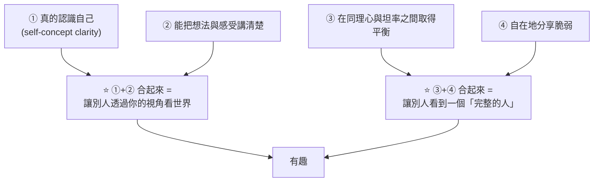
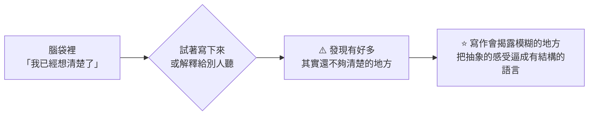
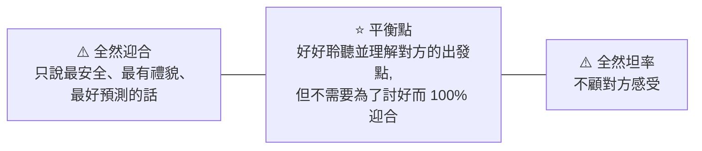
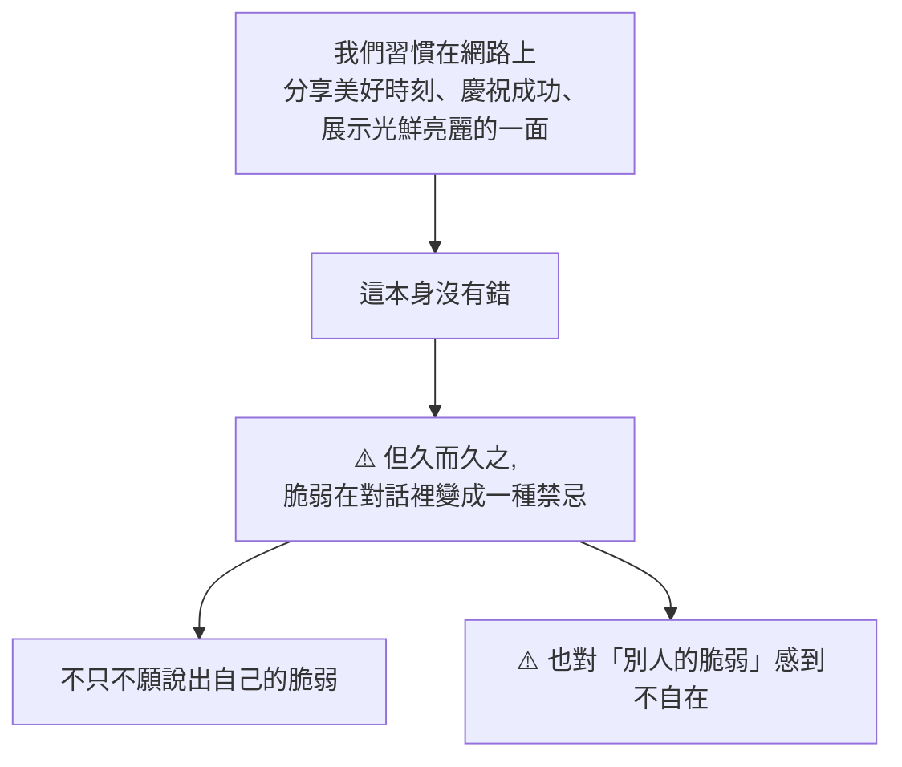

# 為什麼跟有些人聊天特別有趣:四個特質,而且都不是話術

> 整理自 YouTube 頻道 **Ellen 李**〈為什麼跟他們聊天特別有趣?〉(2026-03-08,約 13 分鐘)。
> ⚠️ **該片無字幕,逐字稿以 CPU 版 faster-whisper 轉錄取得、非官方字幕**,可能有少量聽寫誤差。

> 相關筆記:[[ai-skills-no-raise-nash-bargaining]]、[[lisa-su-mit-commencement]]

---

## 一句話總結

**有趣的對話不是話術小技巧,而是一個人內在世界的流露。** 影片用《愛在》三部曲當例子 —— **一部幾乎只有兩個人邊散步邊聊天的電影,全球票房超過 6,000 萬美金** —— 拆出四個讓人在對話中變得有魅力的心理特質。

⭐ **而且講者刻意把「幽默感」排除在四個特質之外** —— 理由在第四點,是全片最尖銳的觀察。

---

## 四個特質總覽



---

## 特質一:真的認識自己

聊天有趣的人,**對很多事情都有自己的角度**,很會反思,清楚知道自己是怎麼想、怎麼感受的。

⭐ **關鍵區分**:

| | |
|---|---|
| ❌ **只是在重複聽來的資訊** | 或搬用某種課本式、意識形態式的說法 |
| ✅ **講的是自己反思過、消化過的東西** | ⭐ 說出來的內容是**外在世界跟自己性格融合之後的產物** |

**影片舉的例子**是女主角 Céline 談一段內在矛盾:她一方面被期待成為「強大獨立的女性」的代表、不能讓人覺得人生繞著某個男人轉,但另一方面,愛人與被愛對她來說又真的很重要。

⭐ **講者的分析很到位**:她不是在談女性主義或愛情的**理論**,而是在展示**意識形態如何跟她現實生活中的感受發生衝突** —— 那是對自己內在世界的覺察。

### ⭐ 心理學上的名字:自我概念清晰度(self-concept clarity)

指的是**一個人對「自己是誰、自己相信什麼」有多清楚、多穩固**。

> ⭐ **研究發現:自我概念清晰度較高的人,社交焦慮通常較低。**
> 原因很直觀 —— **如果一個人對自己有穩定一致的理解,外界的評價就比較不容易動搖他的自我認同。**

> 講者的態度:**練習自我覺察跟鍛鍊身體一樣重要,它是一種心理健康的管理。**

---

## 特質二:能把想法與感受講清楚

**知道自己是誰是一回事,能不能清楚表達出來是另一回事。**

⭐⭐ **全片最實用的一句話:**

> **我們其實常常高估自己對自己的感受與想法有多清楚 —— 直到我們真的試著把它寫下來,或解釋給別人聽。**



**講者自己的兩個例子:**
- 做 YouTube 影片:腦中覺得想法已經很清楚,一開始要寫下來或解釋給別人聽,就發現一堆不夠清楚的地方
- 跟先生聊比較複雜的感受:**寫下來之前是一團雲**,寫下來之後會變成一段很清楚的話 —— 不只說得出感受,還說得出**這個感受從哪裡來**

⭐ **精準的句子,通常比一段模糊的發洩更好懂。**

### 寫日記是這兩個特質的共同工具

| 用途 | 說明 |
|---|---|
| **練習準確表達** | 把抽象感受翻譯成語言的練習場 |
| **整理思緒** | 把一團亂的抽象想法整理清楚 |
| ⭐ **自我覺察** | **很多自我覺察的講義,本質上就是一組日記式的提問**,讓你覺察內心並誠實回答 |

### ⭐ 為什麼 ①+② 合起來就會「有趣」

**因為人在最好的狀態下本來就是好奇寶寶** —— 我們想知道別人是怎麼理解這個世界的:他怎麼看愛、怎麼看變老、怎麼面對矛盾與心碎。

> ⭐ **當一個人願意讓我們透過他的鏡頭看世界時,我們的注意力會被點亮。**

---

## 特質三:在同理心與坦率之間取得平衡

**社交同理心** = 讓對話感覺很安全、很舒服的能力。

⚠️ **但社交同理心並不代表要把自己的個性磨掉。** 有魅力的聊天者是在這條光譜上找到了平衡:



- **夠坦率**:會說出自己的想法,即使不一定符合所有人的觀點
- **同時有同理心**:仍然好好聆聽、理解你的出發點與感受
- ⭐ **但沒有必要為了禮貌,假裝自己的想法隨時都跟你一模一樣**

> ⭐ **反面驗證**:如果 Jesse 每次都只說最安全、最有禮貌、最好預測的話,**觀眾就不會覺得他有趣了。**

⚠️ **我們常常沒給別人真正認識我們的機會** —— 因為擔心不夠禮貌、讓人不舒服、或讓人不喜歡我們。

⭐ **講者的結論很乾脆:坦率不需要跟同理心對立,真實也不需要跟同理心對立。這不是二選一,兩件事絕對可以同時存在。**

**具體怎麼做**:專心聽朋友談他自己對某件事的看法 → 試著理解他的觀點 → **如果我們有不同的角度,就提出來。**

---

## 特質四:自在地分享脆弱

### 先定義「脆弱」

⚠️ **講者特別澄清**:這裡的脆弱**不是**帶負面批判性的那種「你怎麼那麼脆弱」。

> ⭐ **她的定義:脆弱指的是「內心感受的真相」。**

生活中不可能只遇到正面的感觸 —— 有時會有困擾、會難過、會受傷。**這些比較不舒服、我們不太想跟別人分享的感受,就是這裡說的脆弱。**

⭐ **而關鍵在於:他們夠自信,知道分享這些脆弱不會減少自己的價值。**

### ⚠️ 這個世界其實很怕脆弱



**影片舉了小說《Good Material》的一段**:主角剛經歷痛苦的分手,朋友帶他出去散心,但**整個晚上完全沒有談到分手**。主角其實很想聊,卻感覺到只要一提自己的痛苦,朋友就會變得不自在 —— 於是他**在腦中發明了一套計分系統,計算自己還剩多少「額度」可以談這件事**,並且心想:可惜沒辦法把這件事講得很好笑,那還是不要說好了,因為他知道一說出口,整個房間就會安靜又尷尬。

### ⭐⭐ 為什麼講者刻意不把「幽默感」列進四個特質

這是全片最尖銳的一問。她說幽默是**最明顯、最常見**的讓對話有趣的方式,大家都知道,所以她故意不放進來。**但看到上面那一段時,她問自己的是:**

> ⭐⭐ **有多少時候,我們的幽默其實不只是在享受當下,而是一種「逃避脆弱」的防衛機制 —— 讓我們可以避開分享真誠的感受?**

⭐ **這個提問之所以有力,是因為它把一個公認的優點翻過來看**:同樣一句玩笑,可能是連結,也可能正是**用來阻止連結發生**的工具。差別不在話本身,在動機。

> **當一個人願意說出自己真正的感受,我們才有機會真正理解彼此、產生更深的連結。**
> 而這種連結**非常稀有** —— 這也是為什麼觀眾會那麼希望 Jesse 跟 Céline 最後能在一起。

---

## 應用案例

### 案例 1|⭐ 把「寫下來」當成檢驗而不是紀錄

特質二的洞見可以直接變成一個自我檢查工具:

```
你以為你想清楚了 → 寫下來 → 卡住的地方就是你其實沒想清楚的地方
```

| 場景 | 怎麼用 |
|---|---|
| **要跟人談一件複雜的事** | 先寫成一段話再去談 —— **從「一團雲」變成「說得出感受、也說得出感受從哪來」** |
| **要做一個決定** | 寫下「我為什麼傾向 A」,寫不出第三個理由就代表你其實在憑直覺 |
| **要提出反對意見** | 先寫下來,可以把情緒性的發洩轉成精準的句子 |

⚠️ **不要把寫日記當成「記錄發生了什麼」** —— 那是流水帳。**要寫的是「我怎麼想、為什麼這樣感受」**,這才是自我覺察的部分。

> ⭐ 這一點跟本倉庫技術類筆記的心得完全相通:[[context-engineering-processing-vs-thinking]] 講的「要交出處理過的結論而非思考過程」、以及 [[token-saving-three-moves-context-control]] 講的「把結論整理成 Markdown 再開新對話」—— **都是「寫下來才會發現自己沒想清楚」的同一件事。**

### 案例 2|⚠️ 檢查自己的幽默是不是在擋事

特質四的提問可以變成一個具體的自我檢查:

```
當有人講到自己的難處時,我的第一反應是什麼?
  ① 開個玩笑把氣氛帶開      ⚠️ 可能是我自己不自在
  ② 轉去講建議 / 解法        ⚠️ 也可能是在迴避情緒本身
  ③ 先接住:「這聽起來很難受」 ✅
```

⭐ **同樣地,當「我」是那個有難處的人時**:如果我發現自己正在心裡盤算「這件事我還能講幾次」「我得把它講得好笑一點才敢說」,**那通常不是我的問題,是這段關係裡沒有給脆弱留位置。**

### 案例 3|坦率與同理心不是二選一 —— 在工作場合尤其實用

特質三最容易誤解成「要嘛做好人、要嘛做真人」。實務上的第三條路:

| 反模式 | 較好的做法 |
|---|---|
| ❌ 為了不得罪人,附和一個你不同意的方案 | ✅ **先完整複述對方的出發點**(證明你真的聽懂了),**再提出你的不同角度** |
| ❌ 直接說「這樣不行」 | ✅ 「我理解你想解決的是 X —— 我擔心的是 Y,你怎麼看?」 |

⭐ **關鍵順序是「先同理、再坦率」,不是「二選一」** —— 因為同理心建立了對方願意聽的安全感,坦率才有落點。

### 案例 4|⚠️ 這四個特質沒有一個是「技巧」

這是整支影片最該記住的框架:

```
❌ 常見的求助方式:「教我一些聊天技巧 / 話題清單 / 破冰句」
✅ 影片的答案:有趣是「內在世界的流露」,不是話術
```

⭐ **這代表能練的東西完全不同:**

| 想變得有趣,實際要做的 | 對應哪個特質 |
|---|---|
| 對各種議題**真的想過**自己的立場,而不是轉述別人的 | ① |
| **練習把想法寫下來**(日記、筆記、解釋給別人聽) | ② |
| 練習**在聽懂之後,說出自己不同的看法** | ③ |
| 練習**說出不舒服的真實感受**,而不是包成笑話 | ④ |

⚠️ **這些都是慢的**,沒有一個能在一次對話前臨時抱佛腳 —— 但也因此,**它們是會累積的**。

---

## 重點回顧(TL;DR)

1. **《愛在》三部曲幾乎只有兩個人邊散步邊聊天,全球票房超過 6,000 萬美金** —— 影片用它來問:什麼樣的對話有這種魔力?
2. **特質①:真的認識自己。** 有趣的人對很多事有自己的角度、很會反思。⭐ **關鍵區分是「重複聽來的資訊 / 課本式說法」vs「自己反思過、消化過的東西」** —— 後者是**外在世界跟自己性格融合之後的產物**。
3. **例子**:Céline 談的不是女性主義的理論,而是**「被期待當強大獨立女性」的意識形態,如何跟她「渴望愛與被愛」的真實感受衝突** —— 展示的是內在覺察,不是立場。
4. ⭐ **心理學名稱:自我概念清晰度(self-concept clarity)** —— 對「自己是誰、相信什麼」有多清楚、多穩固。**研究發現清晰度高的人社交焦慮較低**,因為自我理解穩定,外界評價就不容易動搖自我認同。
5. **講者的態度:練習自我覺察跟鍛鍊身體一樣重要,是一種心理健康管理。**
6. **特質②:能把想法與感受講清楚。** 知道自己是誰是一回事,講得出來是另一回事。
7. ⭐⭐ **全片最實用的一句:我們常常高估自己有多清楚,直到真的試著寫下來或解釋給別人聽。寫作會揭露模糊的地方,把抽象感受逼成有結構的語言。**
8. **「寫下來之前是一團雲,寫下來之後變成一段清楚的話」** —— 不只說得出感受,還說得出感受**從哪裡來**。⭐ **精準的句子比模糊的發洩更好懂。**
9. **寫日記一石三鳥**:練習準確表達、整理思緒、自我覺察。⭐ **很多自我覺察講義本質上就是一組日記式提問。**
10. ⭐ **①+② 合起來就是「讓別人透過你的鏡頭看世界」** —— 而人本來就好奇別人怎麼理解世界(怎麼看愛、看變老、看矛盾與心碎)。**當一個人願意這樣做,我們的注意力會被點亮。**
11. **特質③:同理心與坦率的平衡。** 社交同理心讓對話安全舒服,**但不代表要把個性磨掉**。夠坦率說出想法,同時仍好好聆聽 —— ⭐ **沒必要為了禮貌假裝自己的想法隨時跟你一樣。**
12. ⭐ **反面驗證:如果 Jesse 只說最安全、最有禮貌、最好預測的話,觀眾就不會覺得他有趣。**
13. ⚠️ **我們常沒給別人真正認識我們的機會**,因為怕不禮貌、怕讓人不舒服、怕不被喜歡。⭐ **但坦率不需要跟同理心對立,這不是二選一。**
14. **特質④:自在分享脆弱。** ⚠️ **脆弱在此不是貶義的「軟弱」,而是「內心感受的真相」** —— 那些不舒服、不太想分享的感受。⭐ **關鍵是夠自信,知道分享它不會減少自己的價值。**
15. ⚠️ **這個世界其實很怕脆弱**:習慣在網路上只分享美好時刻與成功 —— 本身沒錯,**但久而久之脆弱在對話裡變成禁忌,我們不只不願說,也對別人的脆弱感到不自在。**
16. **《Good Material》的例子**:失戀的主角在腦中發明計分系統,計算自己還剩多少「額度」可以談分手,並想著「沒辦法講得好笑,那還是不要說好了」—— 因為他知道說出口房間會安靜又尷尬。
17. ⭐⭐ **講者刻意不把幽默感列入四個特質,因為她問的是:有多少時候我們的幽默不是在享受當下,而是一種逃避脆弱的防衛機制?** 同一句玩笑可以是連結,也可以正是阻止連結發生的工具 —— **差別不在話,在動機。**
18. ⭐ **總結:有趣的對話不是話術小技巧,是一個人內在世界的流露。** 當一個人真的了解自己、能清楚表達、能同理又保留自己的觀點、又不怕展現脆弱,**那個人本身就會變得有趣 —— 因為他讓我們看到一個完整的人。**
19. ⚠️ **實務推論:這四項沒有一個能臨時抱佛腳** —— 但也因此,它們是會累積的。

---

## 來源

- [為什麼跟他們聊天特別有趣? — Ellen 李](https://www.youtube.com/watch?v=gAUvadRNFNE)(2026-03-08,約 13 分鐘)
  - ⚠️ **該片無字幕,逐字稿以 CPU 版 faster-whisper 轉錄取得、非官方字幕**,可能有少量聽寫誤差(人名、英文術語尤其容易出錯,已依上下文還原)
- 影片中引用:電影《愛在黎明破曉時》(Before Sunrise)三部曲、小說《Good Material》
- 心理學概念:**self-concept clarity(自我概念清晰度)** —— 為既有的心理學構念,文中的「與社交焦慮負相關」為影片轉述之研究結論,未逐一查證原始文獻
- 本倉庫相關筆記:[[context-engineering-processing-vs-thinking]]、[[token-saving-three-moves-context-control]]、[[lisa-su-mit-commencement]]
