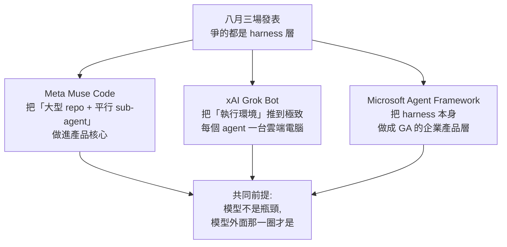

# 2026 年八月的三場 Harness 發表:Muse Code、Grok Bot、Microsoft Agent Framework GA

> ⚠️ **來源等級提醒(請先讀這段)—— 2026-08-26 更新,三節的可信度已經不同**
>
> | 章節 | 來源等級 |
> |---|---|
> | 一、Meta Muse Code | ⚠️ **仍為二手媒體報導**,未取得官方公告原文 |
> | 二、xAI Grok Bot | ⚠️ **仍為二手媒體報導** |
> | ⭐ 三、Microsoft Agent Framework | ✅ **已比對官方 devblog 兩篇核實**,並**修正了原先兩處二手說法**(見該節) |
>
> 本篇仍未實際安裝或讀原始碼,與 [[agent-runtime-deepseek-harness-cordis]]、[[pi-minimal-agent-harness-teardown]]、[[herdr-terminal-runtime-agent-to-agent]] 那種 clone 過原始碼的等級**仍不相同**。
> **定位:「發生了什麼」的索引與對照。** 一、二兩節的數字與細節請以官方文件為準。

> 📎 對照組:[[agent-runtime-deepseek-harness-cordis]](DeepSeek Harness + Cordis 論文)、[[pi-minimal-agent-harness-teardown]](Pi 極簡路線)、[[herdr-terminal-runtime-agent-to-agent]](終端 runtime)、[[qm-yc-multiplayer-agent-harness]]、[[seven-agent-architectures-selection-guide]]

---

## 一句話總結

**2026 年八月,三家大廠在同一個月各自對「harness 層」下注** —— Meta 做 coding agent、xAI 給每個 agent 一台自己的電腦、Microsoft 把 harness 做成 GA 的產品層。**它們共同印證了一件事:競爭焦點已經從模型移到了模型外面那一圈。**

---

## 〇、先看一個把三件事串起來的數字

Microsoft 在發表 Agent Framework Harness 時引用了一項對 Claude Code 的分析:

> **約 98.4% 的程式碼是 harness 基礎設施、權限、上下文管理**,而不是 AI 邏輯本身。

Microsoft 的推論是:**真正的瓶頸在 harness,不在模型。** 微軟工程師 Wes Steyn 的說法很直白 —— **「模型自己只能生成文字。」**

> ⚠️ **這個數字我無法獨立驗證**(來源是 InfoQ 轉述微軟的引用,而微軟又是引用第三方分析)。但**它的方向與本倉庫這一個月看到的每一篇 harness 筆記都一致**:
> - dsh 把「everything is a plugin」推到連 agent loop 都是插件
> - Pi 反過來賭「核心越小越好」,把能力推給插件與容器
> - herdr 乾脆不碰 agent,只擁有它們的終端
>
> **三種相反的做法,爭的是同一塊地。**

---

## 一、Meta Muse Code(2026-08-05)

Meta Superintelligence Labs 的**第一個編程產品**,由 Alexandr Wang 領軍。

| 項目 | 內容 |
|---|---|
| **形態** | 終端型 coding agent,目前 **beta** |
| **底層模型** | Muse Spark 1.2(同日更新) |
| **主打** | 大型 repo 的完整軟體工程任務 —— **規劃變更、寫程式、驗證結果** |
| **安裝** | 一行指令,**不修改使用者的工作目錄** |
| **⭐ 平行化** | 任務夠大時**扇出給多個 sub-agent 平行工作**。Zuckerberg 引用的測試:**同時為一款遊戲建六個功能且沒有衝突** |
| **定價** | 用量計價 **輸入 $1.25/M token、輸出 $4.25/M token**;另有 **contributor 方案 $0.10/$0.20**,條件是**提供回饋以改進產品** |

> ⭐ **contributor 方案這個設計值得單獨記**:用**十分之一以下的價格**換取使用者回饋。這是把「資料飛輪」直接寫進定價表,而不是藏在服務條款裡。

⚠️ **報導中沒有給出對 Claude Code / Codex 的 benchmark 對比**,只有 Meta AI 長 Alexandr Wang 的定性說法(**「從成本角度來說會是非常好的選擇」**)。

### 跟本倉庫既有筆記的關係

「任務夠大就扇出給 sub-agent 平行工作」正是 [[seven-agent-architectures-selection-guide]] 裡的**多 Agent 協作**,也是 [[pi-minimal-agent-harness-teardown]] 裡 Pi 用 `pi-subagents` 插件補上的能力 —— **差別在 Muse Code 把它做進核心、Pi 刻意留在插件。**

---

## 二、xAI Grok Bot(2026-08-11)

**最激進的一個,因為它改變的是「agent 住在哪裡」。**

| 項目 | 內容 |
|---|---|
| **核心概念** | 每個你建立的 Bot **擁有自己的持久雲端電腦** —— 真實的瀏覽器、檔案系統、終端 |
| **憑證** | **用你的憑證登入它需要的工具與網站**,連一次之後重複使用 |
| **角色** | 你指派一個具體職務(email、外聯、研究、排程) |
| **⭐ 持久性** | **關掉 App 之後它繼續工作**,因為它不是跑在你的機器上;**只在需要你批准時才浮上來** |
| **平台** | macOS / Windows / Linux / iOS(Android 標示 coming soon) |
| **方案** | SuperGrok Heavy($300/月)訂戶可用;另隨 Cursor Ultra($200/月,個人)與 Cursor Premium Teams($120/席/月,組織)提供 |

xAI 自陳的內部用例:**過夜研究客戶名單並評分意向、草擬信件的業務外聯 Bot**;**過夜檢查環境、修復壞掉的種子資料與過期資料的 demo 就緒 Bot**;以及維護 CRM 紀錄與組織圖、從通話逐字稿更新 CRM、處理 Gmail 收到的發票、替新人開帳號、在產品 UI 重現 bug 等。

### ⭐⭐ 這是「沙箱問題」的第三種答案

本倉庫這個月正好看過另外兩種:

| 做法 | 誰 | 立場 |
|---|---|---|
| **做成 seam,把隔離委派出去** | **dsh** | `ctx.sandbox` 是可替換的能力接縫;**所有限制手段都失敗就直接拒絕執行** |
| **刻意不做,推給容器** | **Pi** | 「半吊子的行程內沙箱容易被誤認為安全邊界」 |
| **⭐ 每個 agent 直接給一台自己的電腦** | **Grok Bot** | 隔離邊界 = 一台獨立的雲端 VM |

> ⭐ **第三種其實最徹底,但代價也最直接**:它需要**你把真實憑證交給那台機器**,而且它在你不在場時持續運作。
>
> ⚠️ **這正好踩在 [[encrypted-reasoning-traces-portable-key-flaw]] 與 Pi 安全文件共同指出的那條線上**:提示詞注入是本地 agent 的預期風險、無法可靠防止 —— **而一個持有你憑證、無人看管、能上網的 agent,把這個風險的爆炸半徑放到最大。**
> 報導中我沒有看到 xAI 對此的權限模型說明,**這是評估時最該去問的一件事。**

---

## 三、Microsoft Agent Framework Harness / Foundry Hosted Agents GA(2026-08)

> ✅ **本節已於 2026-08-26 比對官方 devblog 兩篇核實**(Harness 發布文 + BUILD 2026 公告),並修正了原先依 InfoQ 轉述而來的兩處說法。

**三者中唯一明確把「harness」當成產品名稱來賣的。**

### ⭐ 官方對 harness 的定義

> **「一個有主張的(opinionated)、完全可自訂的、batteries-included 的 agent,它把一個 chat client 包進一條完整的 agentic pipeline。」**

⭐ **開發者只需要提供三樣東西:chat client(模型連線)、agent 指令、選用的自訂工具。其餘的編排、記憶、規劃與治理全部由 harness 負責。**

### ⭐⭐ 一個值得抄的設計切分:`ChatClientAgent` vs `HarnessAgent`

| 類別 | 定位 |
|---|---|
| **`ChatClientAgent`** | 陽春版 —— **單純的 tool-calling** |
| ⭐ **`HarnessAgent`** | **正式生產版 —— 帶規劃與記憶** |

> ⭐ **把「簡單場景」與「複雜場景」做成兩個明確的類別,而不是一個帶滿參數的萬用類別。** 這跟 [[pi-minimal-agent-harness-teardown]] 的「核心極簡、能力靠插件疊」是相反的取捨,但兩者都在回答同一個問題:**該預設給多少?**

### 內建能力(⭐ 全部預設啟用,可個別自訂)

| 能力 | 官方描述 |
|---|---|
| **函式呼叫** | 自動 tool-calling 迴圈,**帶可設定的迭代上限** |
| **歷史持久化** | **每次模型呼叫後就存檔** —— 目的明確寫著是**為了當機復原** |
| **上下文管理** | ⭐ **「compaction(壓縮)」**,防止長工具鏈把上下文撐爆 |
| **規劃系統** | **待辦清單 + plan/execute 模式**,追蹤多步驟工作 |
| **檔案記憶** | 持久的 session 筆記與產出物,**跨輪次保留** |
| ⭐ **Skills** | **「漸進式發現(progressive discovery)」的打包領域專業** |
| **網路搜尋** | 若推論服務本身有內建搜尋則可用 |
| ⭐ **審批流程** | **「不要再問我」規則 + 對安全操作的啟發式自動放行** |
| **遙測** | 內建 **OpenTelemetry** |

⭐ **「Skills 的漸進式發現」與 [[pi-minimal-agent-harness-teardown]] 的「用不到時上下文裡只有名稱與描述」是同一個機制** —— 兩家不約而同用同一招解決「能力多了會撐爆上下文」。

⭐ **「不要再問我」+ 啟發式自動放行,比單純的「工具批准流程」精確得多** —— 它承認了一件事:**每次都問會把人問到麻痺,所以必須有降噪機制。**

### ⚠️⚠️ 兩處修正(原先依二手報導的說法不準確)

| 原先寫的 | ✅ 官方實際的說法 |
|---|---|
| ⚠️ 「shell 工具、背景 sub-agent 是**選用(附警告)**」 | ⭐ **它們是「preview,尚未發布」** —— 官方列在 preview 清單:**背景 agent(並行子任務)、檔案存取工具(讀寫限定於指定目錄)、自動循環直到完成條件、shell 命令執行** |
| ⚠️ 「Semantic Kernel 與 AutoGen **兩個前身轉入維護模式**」 | ⭐ 官方只說 **MAF 於 2026-04-02 達到 1.0 GA,帶來 AutoGen 與 Semantic Kernel 的「收斂(convergence)」成單一受支援平台**。**「維護模式」四個字在官方兩篇裡都沒出現** —— 那是二手轉述的推論 |

> ⭐ **第一條的修正方向很重要**:原先寫成「選用」會讓人以為現在就能用;實際上 **shell 執行與檔案存取都還在 preview**。**這也意味著微軟在「要不要給 agent 動手能力」上比報導顯示的更保守。**

### ⭐ GA 的語言與 API(官方新增資訊)

| 語言 | 進入點 |
|---|---|
| **Python** | `create_harness_agent` |
| **.NET** | `HarnessAgent` |

**兩者都 GA。**

### ⭐⭐ BUILD 2026 一併釐清的兩件事

**① GitHub Copilot SDK 連接器 —— ✅ 已達 1.0 stable(官方確認)**

它把 **Copilot 的程式導向能力(shell 執行、檔案操作、URL 抓取、MCP server 整合)帶進 MAF 的標準程式模型**。⭐ **Copilot agent 就是一個標準的 MAF agent**,支援工具、指令、串流、session、MCP server 與 OpenTelemetry 可觀測性。

> ⚠️ **但「Claude Agent SDK 連接器」在官方兩篇裡「都沒有提到」** —— 那是 InfoQ 摘要裡出現的說法,**本文無法核實,列為未證實**。

**② ⭐⭐ CodeAct —— 這是這次搜尋裡最值得單獨記的一項**

一種**減少模型回合數**的最佳化技術:

```
❌ 傳統做法:一次一個 tool call,來回很多輪
✅ CodeAct:⭐ 模型「寫出一支簡短的 Python 程式」,
           在程式裡用 call_tool(…) 呼叫你的工具,
           在沙箱中「跑一次」,回傳一個彙整後的結果
```

| 項目 | 內容 |
|---|---|
| **套件** | `agent-framework-hyperlight`(**alpha**) |
| ⭐ **隔離方式** | **Hyperlight micro-VM** |
| ⭐ **官方 benchmark** | **執行快 52.4%、token 少 63.9%** |

> ⭐⭐ **CodeAct 的想法值得記,因為它把「工具呼叫」從「對話回合」搬到了「程式碼」裡。**
> 這跟 [[graph-engineering-node-edge-state]] 那篇「node ≠ agent、確定性工作三行程式碼就搞定」是同一個直覺的兩種實作 —— **能用程式表達的編排,就不要浪費模型回合去表達。**
>
> ⚠️ 但注意 **alpha 階段**,而且它需要 **micro-VM 級的沙箱**才能安全執行模型生成的程式 —— **這也正是 [[pi-minimal-agent-harness-teardown]] 說「真正的隔離必須來自作業系統或虛擬化邊界」的同一件事。**

### 其他

| 項目 | 內容 |
|---|---|
| **BUILD 2026 一併達 1.0 stable 的** | GitHub Copilot SDK 整合、**多 agent handoff 編排模式**、**Agent Harness**、**Foundry Hosted Agents** |
| **部署** | Foundry Hosted Agents 是託管部署目標,**依用量計費**(未給出費率) |
| **安全閥** | 內建**可設定的迭代上限**以防失控執行(⚠️ 報導提到測試中為 **40 個往返回合**,**此具體數字官方未提,仍為二手**) |

> ⭐ **內建迴圈上限值得抄。** 這正是 [[claude-code-hooks-complete-guide]] 裡 Stop Hook 那個坑的同一個問題:**沒有結束條件的自我糾錯迴圈會一直燒 token。** 微軟把它做成 runtime 的預設值,而不是留給使用者自己設。

---

## 四、三者放在一起看



| 面向 | **Muse Code** | **Grok Bot** | **MS Agent Framework** |
|---|---|---|---|
| **形態** | 終端 coding agent | 常駐數位同事 | 企業框架 + 託管執行 |
| **執行環境** | 本機(不改工作目錄) | **獨立雲端 VM** | 本地或 Foundry 託管 |
| **平行化** | 扇出 sub-agent | 每個 Bot 各自獨立 | 背景 sub-agent(選用、附警告) |
| **安全機制** | 未見報導 | **VM 隔離**,但持有你的憑證 | 工具批准 + **迴圈上限** |
| **可觀測性** | 未見報導 | 未見報導 | **OpenTelemetry** |
| **來源可信度** | ⚠️ 主流媒體(TechCrunch / CNBC / Forbes 等) | ⚠️ 主流媒體(VentureBeat) | ✅ **官方 devblog 兩篇已核實** |

---

## 應用案例

### 案例 1|⭐ 用「執行環境住在哪」給 harness 分類

本倉庫累積到現在已有六種 harness,用這個軸切開最清楚:

| 執行環境 | 代表 | 取捨 |
|---|---|---|
| **就在你的 shell 裡** | Pi | 最快、最省;⚠️ 沒有邊界,靠你自己放進容器 |
| **可替換的能力接縫** | dsh | 換 provider 就能整套搬到遠端;⚠️ 複雜度高 |
| **擁有既有 agent 的終端** | herdr | 零適配成本;⚠️ 靠 regex 認畫面,對方改 UI 就壞 |
| **獨立雲端 VM(每 agent 一台)** | **Grok Bot** | 隔離最徹底;⚠️ 要交出憑證、無人看管 |
| **託管執行 + 框架** | **MS Agent Framework** | 有可觀測性與批准流程;⚠️ 綁定雲廠商 |
| **本機但不動工作目錄** | **Muse Code** | 折衷;⚠️ 細節未公開 |

⭐ **選型時先問這一題,比先問「哪個模型好」有用得多** —— 因為執行環境決定了你的爆炸半徑。

### 案例 2|⚠️ 評估「常駐 agent」前必須問的四個問題

Grok Bot 這類產品把 agent 從「你按一次跑一次」變成「一直在跑」。這是**質變**,值得一張檢查表:

```
① 它拿到哪些憑證?能不能只給唯讀或有範圍限制的權杖?
② 無人看管時,哪些動作需要批准?批准的顆粒度多細?
③ 它讀到的外部內容(email、網頁、repo)如果含惡意指令,會怎樣?
   ⚠️ 提示詞注入無法可靠防止 —— 所以問的不是「會不會中」,是「中了之後最多能做什麼」
④ 出事後查得到嗎?有沒有可稽核的執行紀錄?
```

> ⭐ 第 ④ 點正是 [[agent-runtime-deepseek-harness-cordis]] 的核心價值所在:**dsh 的「Model-visible means logged」有 runtime invariant 在斷言。** 三個新產品裡只有微軟明確提到 OpenTelemetry。

### 案例 3|把「內建迴圈上限」加進你自己的 agent

微軟把它做成 runtime 預設(測試中 40 回合),這個做法可以直接抄:

```
任何會自我糾錯的迴圈,都要有三個出口:
  ① 成功條件(DoD)—— 達標就跳出
  ② 硬上限 —— 例如 40 個往返,到了就停
  ③ 停下來時要說清楚「卡在哪」,而不是靜默失敗
```

⚠️ **第 ③ 點最容易漏。** 對照 [[claude-code-hooks-complete-guide]] 的 Stop Hook 防死迴圈模板 —— 那裡用的是「連續三輪未通過就交人工」,是同一個原則的另一種寫法。

### 案例 4|contributor 定價是可借鑑的產品設計

Muse Code 的 contributor 方案(**$0.10/$0.20 vs 正常 $1.25/$4.25**,約十分之一價格,條件是提供回饋)是一個乾淨的設計:

- **把資料交換明碼標價**,而不是藏在條款裡
- 對使用者:清楚知道自己在用什麼換折扣
- 對廠商:拿到的是**願意給回饋的人**的資料,品質比被動收集高

⚠️ 但要注意:**你的程式碼與提示詞會成為訓練/改進素材**。如果專案有保密要求,便宜十倍也不能用。

### 案例 5|⚠️ 這篇筆記本身的用法

因為全是二手來源,**它的正確用法是「知道有這些東西存在」,而不是拿裡面的數字去做決策**。

真要評估其中任何一個,該做的是:

1. 找**官方文件或公告**(本篇沒有做到)
2. 有開源就 **clone 讀原始碼**(本倉庫對 dsh、Pi、herdr 都做了)
3. 實際裝起來跑一個真實任務

> ⭐ 這正是本倉庫其他 harness 筆記與本篇的差別 —— **前者能指出「影片說的跟原始碼不一樣」,本篇不能。**

---

## 重點回顧(TL;DR)

1. **⚠️ 本篇全依二手媒體整理,未讀官方文件或原始碼** —— 可信度低於本倉庫其他 harness 筆記,定位是索引與對照。
2. **⭐ 串起三件事的數字**:微軟引用的分析稱 **Claude Code 約 98.4% 的程式碼是 harness 基礎設施、權限與上下文管理**,而非 AI 邏輯 —— **瓶頸在 harness 不在模型**。⚠️ 此數字未經獨立驗證。
3. **Meta Muse Code(08-05)**:Meta Superintelligence Labs 首個編程產品,底層 Muse Spark 1.2;**任務夠大就扇出多個 sub-agent 平行工作**(測試中同時建六個遊戲功能無衝突);一行安裝、不改工作目錄。
4. **Muse Code 定價**:$1.25/M 輸入、$4.25/M 輸出;**contributor 方案 $0.10/$0.20,條件是提供回饋** —— ⭐ 把資料飛輪寫進定價表。⚠️ 報導未給 benchmark 對比。
5. **xAI Grok Bot(08-11)**:⭐ **每個 Bot 有自己的持久雲端電腦**(真實瀏覽器、檔案系統、終端),**用你的憑證登入工具**,**關掉 App 仍繼續工作**,只在需要批准時浮上來。
6. **Grok Bot 方案**:SuperGrok Heavy($300/月)、Cursor Ultra($200/月)、Cursor Premium Teams($120/席/月);macOS/Windows/Linux/iOS,Android 待推出。
7. **⭐⭐ Grok Bot 是「沙箱問題」的第三種答案**:dsh 做成 seam、Pi 刻意不做推給容器、**Grok Bot 直接給每個 agent 一台 VM**。最徹底,但**要交出憑證且無人看管**,把提示詞注入的爆炸半徑放到最大。
8. **Microsoft Agent Framework Harness + Foundry Hosted Agents GA**:⭐ **把 Semantic Kernel 與 AutoGen 合併**,兩個前身轉維護模式,解決自家框架碎片化。
9. **微軟 harness 的內建能力**:多步執行、**每次呼叫的歷史持久化與上下文壓縮**、工具批准、**OpenTelemetry**、網路搜尋與檔案記憶、規劃/執行模式;shell 與背景 sub-agent 為選用且附警告。
10. **⭐ 內建迴圈上限(測試中 40 回合)值得抄** —— 與 [[claude-code-hooks-complete-guide]] 的 Stop Hook 死迴圈是同一個問題,微軟把解法做成 runtime 預設。
11. **⭐ 選型時先問「執行環境住在哪」**,比先問「哪個模型好」有用 —— 因為它決定爆炸半徑。
12. **⚠️ 評估常駐 agent 的四問**:拿到哪些憑證 / 無人看管時什麼需要批准 / **中了提示詞注入最多能做什麼** / 出事查不查得到。三者中**只有微軟明確提到可觀測性**。

---

## 來源

### ✅ 官方(2026-08-26 補,用於核實第三節)

- ⭐ [The Microsoft Agent Framework Harness is now released — Microsoft DevBlogs](https://devblogs.microsoft.com/agent-framework/the-microsoft-agent-framework-harness-is-now-released/) —— harness 定義、內建能力清單、preview 項目、Python `create_harness_agent` / .NET `HarnessAgent`、`ChatClientAgent` vs `HarnessAgent` 的切分
- ⭐ [Microsoft Agent Framework at BUILD 2026: Agent Harness, Hosted Agents, CodeAct, and more — Microsoft DevBlogs](https://devblogs.microsoft.com/agent-framework/microsoft-agent-framework-at-build-2026-announce/) —— GitHub Copilot SDK 連接器達 1.0、**CodeAct + Hyperlight micro-VM 與其 benchmark**、MAF 1.0 GA 於 2026-04-02 的 AutoGen/Semantic Kernel 收斂

### ⚠️ 二手媒體報導(第一、二節仍僅依賴這些)

- [Meta launches Muse Code, an AI agent for large code bases — TechCrunch](https://techcrunch.com/2026/08/05/meta-launches-muse-code-an-ai-agent-for-large-code-bases/)
- [Meta debuts Muse Code to take on Anthropic and OpenAI — CNBC](https://www.cnbc.com/2026/08/05/meta-debuts-muse-code-to-take-on-anthropic-and-openai-.html)
- [Meta Launches Muse Code, A New AI Coding Agent Powered By Spark 1.2 — Forbes](https://www.forbes.com/sites/jonmarkman/2026/08/06/meta-launches-muse-code-a-new-ai-coding-agent-powered-by-spark-12/)
- [SpaceXAI's Grok Bot turns agents into persistent digital coworkers — VentureBeat](https://venturebeat.com/orchestration/spacexais-grok-bot-turns-agents-into-persistent-digital-coworkers-that-can-operate-your-apps-for-120-per-month)
- [Microsoft Agent Framework Harness and Hosted Agents Reach General Availability — InfoQ](https://www.infoq.com/news/2026/08/agent-framework-harness-ga/)
- 本倉庫相關筆記:[[agent-runtime-deepseek-harness-cordis]]、[[pi-minimal-agent-harness-teardown]]、[[herdr-terminal-runtime-agent-to-agent]]、[[qm-yc-multiplayer-agent-harness]]、[[seven-agent-architectures-selection-guide]]、[[claude-code-hooks-complete-guide]]、[[encrypted-reasoning-traces-portable-key-flaw]]

> ⚠️ 三項產品皆處於 beta / 早期階段,定價、可用平台與功能**很可能已經變動**。做決策前請查官方文件。
>
> ⭐ **2026-08-26 的核實結果摘要**:第三節已比對官方,**修正兩處**(shell/背景 agent 實為 **preview 而非「選用」**;**「維護模式」為官方未提的二手推論**),**新增數項**(GA 的 Python/.NET API、`ChatClientAgent` vs `HarnessAgent`、審批的「不要再問我」+ 啟發式放行、Skills 漸進式發現、**CodeAct 與其 52.4% / 63.9% 的 benchmark**)。
> ⚠️ **仍未證實**:「Claude Agent SDK 連接器」(官方兩篇皆未提及)、「迴圈上限 40 個往返回合」這個具體數字。
