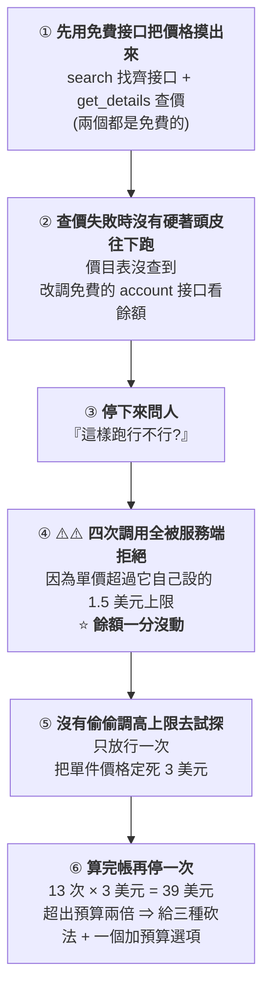

# 讓 Agent 自己花錢:硬上限、先查價、停下來問 —— 一次付費 API 調用的成本護欄實錄

> 整理自 YouTube 頻道 **YAHA學堂**〈[别买$5000企业版!我用Claude Code调Similarweb官方接口:4分钟扒光竞品流量](https://www.youtube.com/watch?v=Q4hTr67ECLg)〉(2026-09-13,約 6.5 分鐘,無字幕、以 CPU faster-whisper 轉錄)。
> ⚠️⚠️ **立場揭露:該片主要推廣第三方服務 AIsa 的 Go-to-Market 方案(說明欄含 utm 追蹤連結與方案頁),整支影片本質是產品演示。**
> ⭐ **本文刻意略過產品推銷部分,只萃取「讓 Agent 自己花錢時該有哪些護欄」這個可跨工具複用的工程主題。**

---

## 一句話總結

> **當你把一個「會真的扣錢」的工具接給 Agent,真正的工程問題不是「它會不會用」,
> 而是「它會不會把你的錢燒光」。**
>
> ⭐⭐⭐ **這支影片最值得看的不是省了多少錢,是那四次「被擋下來、餘額一分沒動」的調用 ——
> 因為那證明護欄是在扣費**之前**生效,而不是事後對帳。**

---

## 一、⭐ 先看對照組:沒接資料源的 Agent 會怎麼回你

**同一個問題(台灣四大電商的流量從哪來),問一個乾淨的 Claude Code:**

> ⭐ **它很誠實:直接說沒有 Similarweb 的授權,數字不能編。**
> 然後給四個選項 —— 你自己去匯出 CSV、或它幫你開瀏覽器抓免費版……
> **繞一圈,資料還是得你自己弄。**

📌 **這個對照很有價值:它說明「Agent 能力不足」很多時候其實是「Agent 沒有資料存取權」。**

---

## 二、⭐⭐⭐ 接上付費工具後,它做的六件事(這才是重點)

### ⭐⭐⭐ 第 ④ 點是全片最重要的一句

> **「重點是餘額一分沒動 —— 這就是那個硬上限的意義:**超價的調用在扣費前就被擋掉**。」**

📌 **這裡有一個很容易被忽略的設計差異:**

| 做法 | 結果 |
|---|---|
| ⚠️ **事後對帳型**(跑完才知道花多少) | 錢已經花掉了,護欄只是報表 |
| ⭐⭐ **扣費前攔截型**(超過單價上限直接拒絕) | **失敗是免費的**,可以安全地讓 Agent 自己試 |

> ⭐⭐⭐ **「失敗是免費的」這個性質,才是讓 Agent 自主使用付費工具變得可行的前提。**

---

## 三、⭐⭐ 人還是要在:它算錯了價

> **它算了一筆帳:按 3 塊一次、13 次要 39 美元,超預算兩倍,做不了。**
> ⚠️ **但它算錯了 —— 只有「地理分布」那個接口是 3 塊。**

**作者的處理方式很標準:把官方價目表貼給它 → 它對照後發現與自己看到的吻合 → 直接開跑。**

📎 **這正好呼應本庫 [[claude-cowork-overtime-pay-audit-prompt]] 的分工原則:
Agent 負責執行與計算,**人負責核實事實與邊界**。
⭐ 差別在於這次「事實」是價目表,而錯誤的代價是直接的金錢。**

---

## 四、⭐ 兩個誠實的細節(比成功更值得記)

### ① 它知道自己拿不到什麼

> **報告寫完時它主動說:某篇報導它讀不到 —— 因為這個 MCP 只有資料接口,沒有網頁檢索功能。**
> ⭐ **解法是改用 Claude Code 自帶的 WebFetch 去讀。**

📌 **這是一個很好的工具邊界示範:MCP 給的是特定資料源,不是萬能上網能力。
把兩者搭配使用,比期待單一工具全包更實際。**

### ② ⭐⭐ 它沒有用自己的數字去湊

> **補完報導對照時,它只填了報導裡明確寫出來的四個數字。
> 另外兩家報導沒給絕對值,⭐ **它就留空標註,沒拿自己的數字去湊**。**

> ⭐⭐⭐ **這個行為比「算得快」有價值得多 —— 因為混入來源不同的數字,
> 是分析報告最常見也最難察覺的錯誤。**

### ③ 第二個案例裡它抓到一個人沒注意的坑

> **做競品分析時,某個站的訪問量驟降一個數量級。
> ⭐ **它判斷這是「口徑調整」而不是真的掉了用戶**,並在報告裡標明不能這樣解讀。**

📌 **這類「資料斷點 vs 真實變化」的判斷,正是分析工作裡最需要經驗的部分。**

---

## 五、⚠️ 為什麼要繞第三方:官方 API 的門檻

**影片的商業前提是這個 —— 而這部分經查證屬實:**

| 項目 | 實情 |
|---|---|
| **網頁版訂閱** | 幾百美元/月,⚠️ **那是「給人看」的介面** |
| ⚠️⚠️ **官方 API** | **自助方案一律不含 API 存取**;要開 API 得**聯繫客戶經理**,**沒有註冊按鈕、沒有公開價目表** |
| **年約規模** | ⭐ **企業部署的年約常見落在 9–20 萬美元以上**;API 存取本身約從 500 美元/月起跳,高用量可超過 2 萬美元/月 |
| **合約條件** | Team / Business / Enterprise 全部**要求年約**,無月付選項,全部客製報價 |

> ⭐ **所以影片的核心論點成立:個人或小團隊要直接接官方 API,實務上不可行。**
> ⚠️ **但「該不該用這個特定第三方」是商業選擇,本文不評價;值得學的是下一節那個判斷框架。**

---

## 六、⭐⭐⭐ 應用案例:把付費工具接給 Agent 之前的檢查清單

### 案例 1|五個必問的問題

| # | 問題 | 為什麼重要 |
|---|---|---|
| **1** | ⭐⭐⭐ **失敗是免費的嗎?** | **超價/超額的調用是在扣費前被擋,還是跑完才算帳?** 這決定了你敢不敢讓它自己試 |
| **2** | **有沒有免費的「查價」與「查餘額」接口?** | ⭐ 沒有的話,Agent 只能盲目地花錢試 |
| **3** | **單次上限與總預算是分開的嗎?** | 只有總預算 ⇒ 一次失控調用就能吃掉全部 |
| **4** | ⚠️ **Agent 能不能自己調高上限?** | **能的話護欄等於不存在** —— 影片中它「沒有靠調高上限去試探」是正確行為,但更好的是**它根本改不動** |
| **5** | **帳單是否逐筆可查?** | 事後要能一條條對:哪個接口、幾次調用、各扣多少 |

### 案例 2|⭐⭐ 提示詞裡該寫死的三件事

**從影片的流程反推,這三句話值得寫進你的 `CLAUDE.md` 或任務提示詞:**

> **① 「調用任何付費接口前,先用免費接口查詢單價與餘額。」**
> **② 「單次調用超過 $X 一律不執行,回報給我。」**
> **③ 「預估總花費超過 $Y 時停下來,給我幾種降低成本的方案,不要自行決定。」**

📎 **第三點正是 [[voice-input-ai-context-transformation]] §4.5 那個 AUTONOMY 模組的具體化 ——
**可逆的決定讓它自己做,不可逆的(花錢)停下來問**。**

### 案例 3|⭐ 這套模式可以搬到哪裡

| 場景 | 對應的「硬上限」 |
|---|---|
| **Agent 呼叫 LLM API** | 單次請求的 token 上限、每日總預算 |
| **Agent 跑雲端運算** | 執行個體規格白名單、單次作業時長上限 |
| **Agent 下廣告/發簡訊** | 單次投放金額、單日發送則數 |
| ⚠️ **任何會扣錢或不可逆的操作** | ⭐ **原則相同:上限由外部系統強制,不由 Agent 自律** |

> ⭐⭐⭐ **核心原則一句話:**
> **護欄要放在「Agent 改不動的那一層」。靠提示詞請它自律,是最後一道防線,不是第一道。**

📎 這與 [[claude-code-hooks-complete-guide]] 的立場一致 ——
**CLAUDE.md 是上下文不是強制配置;真正的邊界要靠 hook 或服務端強制執行。**

---

## 重點回顧(TL;DR)

1. **對照組很有說明力**:沒接資料源的 Agent 會誠實說「數字不能編」—— **能力不足往往其實是存取權不足。**
2. ⭐⭐⭐ **全片最重要的一句:「超價的調用在扣費前就被擋掉,餘額一分沒動。」** 這讓「失敗是免費的」,是 Agent 自主使用付費工具的前提。
3. ⭐⭐ **它做對的六件事**:先用免費接口查價 → 查不到就改查餘額 → 停下來問 → 超價調用被擋 → **沒有調高上限去試探** → 算完帳超預算再停一次並給選項。
4. ⚠️ **但它算錯了價**(只有一個接口是 3 美元)—— **人貼上官方價目表後才對上。事實核實仍然歸人。**
5. ⭐ **兩個誠實細節**:主動說「這篇報導我讀不到」(MCP 只有資料接口沒有網頁檢索,改用 WebFetch 補);**只填報導明確給出的數字,沒有的留空標註,不拿自己的數字去湊。**
6. ⭐⭐ **第二個案例裡它抓到「訪問量驟降是口徑調整而非真的掉用戶」** —— 這種資料斷點判斷是分析工作最需要經驗的部分。
7. **官方 API 門檻經查證屬實**:自助方案不含 API、需聯繫業務、無公開價目表、**年約常見 9–20 萬美元**。
8. ⭐⭐⭐ **可複用的原則:護欄要放在 Agent 改不動的那一層。靠提示詞請它自律是最後一道防線,不是第一道。**

---

## 核實狀態

### ✅ 已核實

| 影片說法 | 核實結果 |
|---|---|
| **Similarweb 官方 API 不開放自助購買,需聯繫客戶經理** | **屬實**;**所有自助方案(至約 $542/月)皆不含 API 存取** |
| **官方 API 年約十萬美金打底** | ⭐ **量級屬實**:企業部署(多使用者/多模組/含 API)的**年約常見落在 9–20 萬美元以上**;API 存取本身約自 $500/月起、高用量可逾 $20,000/月 |
| **網頁版與 API 是兩回事** | **屬實**,網頁訂閱方案不包含 API |
| **Team / Business / Enterprise 皆需年約** | **屬實**,無月付選項、全部客製報價 |

### ⚠️ 未能獨立查證(以影片實測畫面看待)

- **四家電商的具體流量組成**(蝦皮約一半直接輸網址、某家近一半來自付費搜尋、四家台灣占比皆約 96%)——
  ⚠️ **屬影片單次查詢結果,本文未取得原始資料驗證。**
- **該第三方服務的計價細節**(單一指標約 $0.1/月、方案 $39/月含 $50 調用額度、分開買各資料源約 $5,000/月)——
  ⚠️⚠️ **屬推廣內容,本文不轉述細節亦未核實。**
- **「四次調用全被擋、餘額一分沒動」的實際扣費紀錄** —— **屬影片畫面呈現,無法外部驗證。**
- **第二個案例(Heptabase vs Notion / Obsidian)的分析結論** —— **屬單次生成結果。**
- **「實習生做一天 vs 4 分 25 秒」的對照** —— **屬作者主張,無對照實驗。**

> ⚠️ **本文為對一支產品演示影片的整理。影片主體為第三方服務推廣,
> 本文只萃取其中可跨工具複用的工程原則,不構成對該服務的推薦。**

---

## 來源

- [别买$5000企业版!我用Claude Code调Similarweb官方接口:4分钟扒光竞品流量 — YAHA學堂](https://www.youtube.com/watch?v=Q4hTr67ECLg)(2026-09-13,約 6.5 分鐘。⚠️ **含第三方服務 AIsa 的推廣與追蹤連結**)
- 影片說明欄附完整 prompt、接入命令、`CLAUDE.md` 規則與三份報告:[GitHub - buildinpublichub/YAHAClass-Document, aisa-gtm-similarweb](https://github.com/buildinpublichub/YAHAClass-Document/tree/main/aisa-gtm-similarweb)
- 核實用資料:
  - [SimilarWeb Software Pricing & Plans 2026 — Vendr](https://www.vendr.com/marketplace/similarweb)
  - [Similarweb Pricing in 2026: Plans, Hidden Costs, and What You'll Actually Pay — Spike AI](https://getspike.ai/blog/similarweb-pricing-plans-costs/)
  - [How Much Does Similarweb Cost in 2026? Full Pricing Breakdown — NetHustler](https://nethustler.com/how-much-does-similarweb-cost/)
- 延伸:本庫 [[claude-cowork-overtime-pay-audit-prompt]](同作者,人負責核實事實與邊界)、[[claude-code-hooks-complete-guide]](護欄要靠 hook 而非請求自律)、[[voice-input-ai-context-transformation]](AUTONOMY:不可逆操作要停下來問)、[[mcp-stateless-migration-guide]]。

> 該片無字幕,逐字稿以 CPU 版 faster-whisper(small / int8 / zh)轉錄取得,**非官方字幕**,可能有少量聽寫誤差。
> 專有名詞已依上下文還原:轉錄中的「Cloud Code / Club Code」為 **Claude Code**、「similar web / Semmilar Web」為 **Similarweb**、
> 「iESA / ISA / AIsa」為 **AIsa**、「鋪盆」為 **PChome**、「數位時代 / 數為時代」為 **數位時代**、
> 「魚額 / 鱼儿 / 餘額」為 **餘額**、「免賠」為 **免費**、「譽明 / 域名」為 **網域**、「進品分析」為 **競品分析**、
> 「Nelson」依上下文為 **Notion**、「逐漁掉」為 **驟降**、「針掉了用戳」為 **真的掉了用戶**、「李彪」為 **裡標**。
