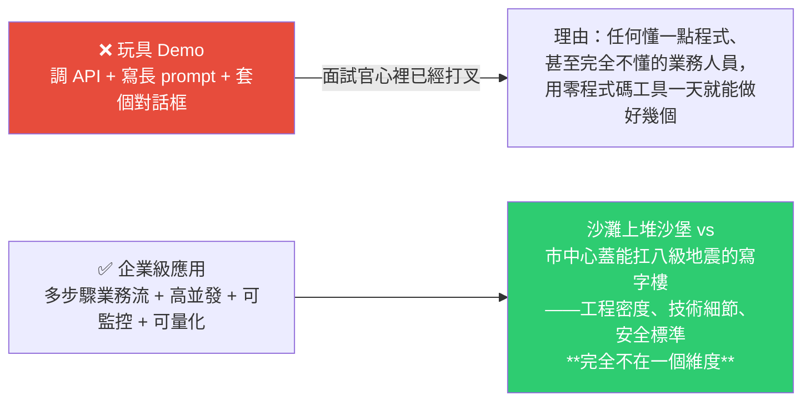
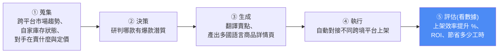
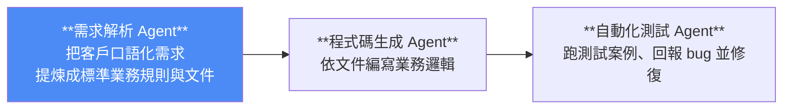
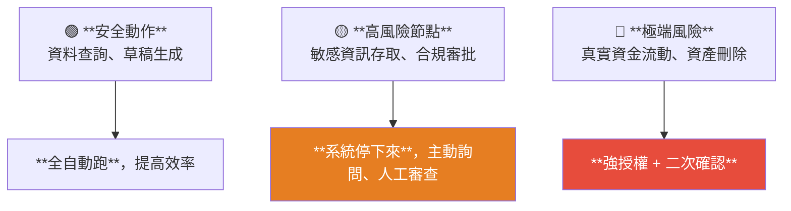

# 什麼樣的 Agent 專案才能給履歷加分:玩具 Demo 與企業級應用的分水嶺

> 整理自 YouTube 頻道 **白白說大模型**〈什麼樣的 Agent 專案才能給簡歷加分?〉(2026-08-07,約 15.5 分鐘)。
>
> 開場的對比很直接:**同樣在履歷寫 Agent 專案,有人只拿到幾千塊的實習底薪,有人拿下幾十萬甚至上百萬年薪 —— 差距不在你調用的模型多高級,而在你的專案是「一個人自嗨的玩具」,還是「能跑通一整套業務流程的企業級應用」。**

---

## 一句話總結



---

## 一、四個維度分辨「玩具」與「企業級」

| 維度 | 玩具 Demo | 企業級應用 |
|---|---|---|
| **業務邏輯** | 使用者問一句、它答一句 —— 本質是**單輪問答** | 處理**一整套業務流**:多步驟流轉、判斷、資料處理、工具調用,是**端到端的完整過程** |
| **系統架構** | 前後端混在一起、孤立、**沒法擴展** | 完整工程體系,考慮**高並發**,**隨時有看得見的監控** |
| **初衷** | **為了用 agent 而做 agent** —— 覺得技術很酷就湊一個場景 | 衝著**解決真實產業痛點**去的,有明確業務目標 |
| **怎麼評判好壞** | 「我自己測了幾次,感覺效果還挺好」 | ⭐ **能用數字表達的硬性量化指標** —— 主觀評價在企業裡絕對無法落地 |

### 什麼叫「解決真實產業需求的複雜業務」:跨境電商案例

很多人以為做電商 agent 就是自動寫商品文案。真實的企業級應用是**自動選貨上架**的完整流程:



> **一個有含金量的 agent,不是單輪對話的聊天機器人,而是能幫你默默幹完一整套複雜工作的「隱形員工」。**

---

## 二、架構設計(一):任務的動態規劃

影片用「點外送」比喻三個階段,很好記:

| 階段 | 點外送 | Agent |
|---|---|---|
| **探索** | 肚子餓,只有模糊目標「想吃頓健康午餐」→ 確認我在哪、卡裡多少錢、周圍哪些商家開著 | **解析任務、讀取當前環境狀態與上下文** |
| **規劃** | 挑商家、看配送費、算送達時間 → 做最優組合 | **匹配工具、拆解複雜任務、生成有先後順序的執行圖** |
| **執行** | 騎手接單送餐;路上塞車或下大雨**不能直接放棄,要想辦法繞路** | 調用 API 執行、**驗證結果**;失敗要有**自我修復與重試**能力,直到完成 |

---

## 三、⚠️ 多智能體:別為了炫技過度設計

> **現在很多人有個壞習慣:動不動就在專案裡搞十幾個甚至幾十個智能體,覺得這樣顯得技術高超。**

**如果業務本身很簡單,硬要用一堆 agent 協同,代價是:**

- 系統響應**慢得像蝸牛**;
- **API 調用費用飛漲**;
- **出錯率成倍增加**。

### ⭐ 判準:多智能體協同必須跟業務複雜度嚴格匹配

**合理拆分的範例(全自動軟體開發流水線)**:



**各司其職,每個 agent 有自己獨立負責的上下文。**

> ⭐ **關鍵:這樣的拆分是「順著業務流程自然長出來的」,而不是為了好看強行拼湊的。**

📌 這跟本庫 [[loop-vs-graph-debate-engineering-view]] 的判準完全一致:**任務短、探索性強就用 Loop;有可並行分支、需隔離上下文才值得升級**;也呼應 [[graph-engineering-explained-euler-to-agents]] 的「瓶頸在節點還是邊?」

---

## 四、架構設計(二):上下文不等於聊天記錄

**新手最大的誤區**:上下文不就是聊天記錄嗎?每次把之前對話全帶上不就好了?

> **如果大模型是個人,你每次跟他說話都要把過去幾天聊過的所有廢話、過期的無效資訊、甚至各種系統雜訊像垃圾一樣一股腦塞給他 —— 他不僅看不過來、調用成本飛漲,自己也會看糊塗,回答品質急劇下降。**

**真正的上下文工程 = 一個智能的資訊過濾漏斗**:把沒用的雜訊與冗餘資料過濾掉,在最精準的時刻**只把當前任務最需要的資訊送過去**(當前運行狀態、最相關的企業私有知識、剛才工具返回的最新結果)。

> **這是一場精簡的資訊分發 —— 讓模型用最少的時間做最正確的決定。**

### ⭐ 工程實現:分層記憶架構(借鑑人腦)

| 層 | 類比 | 特性 | 存哪 |
|---|---|---|---|
| **工作記憶** | 跟人聊天時腦子裡時刻記著的關鍵詞 | **始終加載**,速度要極快 | 當前任務狀態、多輪對話中的關鍵變數 |
| **知識庫** | 考試遇到不會的題,才去腦海深處檢索背過的公式 | **按需檢索** | 海量企業文件、使用者歷史偏好 → **向量資料庫 + RAG** |
| **外部狀態** | 做數學題時在草稿紙上算出的中間結果 | **隨時動態寫入** | 工具執行回傳的資料、外部 API 即時回傳 |

> **透過分層,agent 才能在極大節省 token 成本的同時,把每一步都辦得清清楚楚。**

📌 對照本庫 [[memharness-memory-reconstructed-not-replayed]]:那篇更進一步 —— **取回的記憶還要依當前狀態「重建」而非逐字重播**,否則會造成負遷移。

---

## 五、工程落地:真實生產環境需要什麼

> **千萬別以為寫個 Python 腳本、掛個單執行緒在本機跑通了,就算上線了。**

| 要素 | 內容 |
|---|---|
| **規整的 API 介面 + 精心設計的資料庫結構** | 用來存狀態 |
| ⭐ **多使用者並發隔離** | 成百上千使用者同時湧入時,**不能讓別人的聊天資料或敏感狀態跑到另一個使用者那裡**,造成嚴重資料洩漏 |
| **權限控制與安全防禦** | 哪個角色能調用哪些敏感工具;大模型生成的內容**有沒有注入攻擊風險** → 要有安全網關把控 |
| **異常處理 + 全域日誌追蹤** | 系統崩潰或 API 報錯時怎麼辦 |

---

## 六、⭐ 人機協同:盲目全自動化非常危險

> 科技宣傳片裡的全自動 agent 看起來很酷,**但在真實商業世界裡,盲目的全自動化其實非常危險。**
>
> **大模型偶爾會胡言亂語 —— 如果它執行任務時突然產生幻覺,決定把公司資料庫刪了,或給客戶打錯了幾十萬的款,這個責任誰來承擔?**

### 三個風險等級



### 實例:貨款審批流程

```
① Agent 解析複雜帳單，算出撥付金額與稅率
② 自動調用支付系統 API，生成一張預撥付單
   ⚠️ 此時若直接把錢打出去，一旦出錯就是真金白銀的損失
③ **人工審核網關**：流程掛起、後台發通知
④ 等主管在管理後台點「確認」或「拒絕」
⑤ 只有主管親自確認後，指令才發送給外部系統、觸發真實資金流動
⑥ 最終交易狀態寫入資料庫
```

> **既發揮了 agent 自動處理繁瑣資料的效率,又用關鍵的人工關卡守住財務安全的底線。**

📌 這跟本庫 [[google-agentic-engineering-day4-5]] 的 zero-trust「高風險動作要人簽核」與 [[opus5-system-prompt-engineering-patterns]] 的「破壞性操作二次確認」是同一條原則的三種表述。

---

## 七、全鏈路可觀測性:讓黑盒變透明

> **大模型應用就像個黑盒,你不知道它中間到底哪一步想歪了。**

**做法**:請求進入時在入口分配一個**唯一的 Trace ID**,貫穿整個生命週期;藉由這個 ID 埋三個探針:

| 探針 | 監控什麼 |
|---|---|
| ① | 請求在**各節點間的流轉軌跡**(走的對不對)、**調用的是哪個版本的模型** |
| ② | **工具調用的輸入與輸出**(執行成功還是報錯、參數傳得準不準) |
| ③ | **每一步驟耗時多久** → 揪出拖慢系統的瓶頸 |

> **有了這套透明的運行軌跡,agent 才真正具備走向生產環境的資格。**

📌 與本庫 [[google-agentic-engineering-day4-5]] 的「observability 三層記錄」幾乎完全對應。

---

## 八、⭐ 四個維度的量化指標體系

> **一個合格的 agent 研發人員在匯報時,絕對不會說「我覺得效果還行」或「我自己測了測感覺挺好」。**

| 維度 | 指標 |
|---|---|
| **品質** | **任務準確率**、**端到端任務成功率**(這是及格線) |
| **性能** | 平均等待時間(**響應耗時**)、高並發下每秒處理多少請求(**QPS**) |
| **財務** | 單次調用消耗多少 token / 折合多少錢、整個系統的**商業投資回報率(ROI)** |
| **穩定性** | 遇到外部 API 偶爾報錯時,系統能自行重試並恢復的機率 —— **異常自癒率** |

> **當你能把這些客觀、冰冷但極具說服力的數字擺在桌面上時,你的專案成效瞬間變得無比有力量。**

---

## 九、履歷怎麼寫:用工程語言重構

### ❌ 業餘寫法

> 「使用大模型接口開發了智能體應用,寫了複雜的 prompt 解決使用者問題。」

> 影片評語:**這種話在面試官眼裡太業餘了,像個「調包俠」。**

### ✅ 工程語言重構

> 「構建了**分布式調用追蹤與異常自癒系統**;設計了**高安全人機協同網關機制**;實現了**精細化的分層上下文管理調度**。」

### ⭐ 而且一定要帶量化指標

- 「透過引入**自適應重試機制**,將核心任務成功率提升 ○○%」
- 「透過這套自動化流水線,幫業務節省 ○○% 的人力成本」
- 「系統並發響應能力達到 ○○ QPS」

> **當你把這些實打實的工程實力與客觀數據擺在面試官面前,距離拿到 offer 就已經非常近了。**

---

## 十、應用案例

### 案例 1|拿四個維度自我檢查你手上的專案

最快的診斷:

```
□ 業務邏輯：是單輪問答，還是多步驟端到端業務流？
□ 系統架構：有沒有考慮高並發？有沒有監控？
□ 初衷：是「為了用 agent 而做」，還是解決真實痛點？
□ 評判：你能不能給出數字？
```

**第四項答不出來,前三項再漂亮也沒用** —— 因為那正是面試官用來區分玩具與生產系統的那條線。

### 案例 2|把「我測了幾次感覺不錯」翻譯成四個數字

即使是個人專案,也可以補上:**任務成功率**(跑 50 個案例算比例)、**P95/平均響應時間**、**單次任務 token 成本**、**失敗後自動恢復的比例**。

**這四個數字的取得成本很低,但它們是把玩具講成工程的最短路徑。**

📌 這跟本庫 [[production-agent-engineer-skills-2026]] 給的三個黃金指標(任務完成率 >95%、工具異常率 <0.1%、P99 <500ms)可互相補齊 —— 那篇更偏線上維運,這篇多了**財務 ROI** 這個面向。

### 案例 3|多 agent 前先問「這個拆分是不是自然長出來的」

拆分的正當性判準只有一句:**它是順著業務流程長出來的,還是為了好看拼湊的?**

軟體開發流水線(需求解析 → 程式碼生成 → 自動化測試)是自然的;而「把一個查詢任務硬拆成搜尋 agent + 摘要 agent + 潤稿 agent」通常不是。

### 案例 4|高風險節點清單化

拿出你的 agent 能執行的所有動作,按三級標記:

| 級別 | 你的系統裡是什麼? |
|---|---|
| 🟢 全自動 | 查詢、草稿生成、格式轉換 |
| 🟡 人工審查 | 敏感資料存取、對外發送、合規相關 |
| 🔴 強授權 + 二次確認 | 金流、刪除、權限變更 |

**沒有標成紅色的動作,遲早會有人幫你標。**

### 案例 5|本倉庫的對照

用本片的標準檢視我們的 cron 流程:

| 面向 | 現況 |
|---|---|
| 業務邏輯 | ✅ 多步驟端到端(列片 → 去重 → 取稿 → 寫筆記 → 更新 README → commit) |
| 分層記憶 | ✅ 有(`CLAUDE.md` 規則 / `SCHEDULES.md` 踩坑 / git 歷史) |
| 人機協同 | ⚠️ 全自動,**沒有高風險節點的人工關卡**(不過動作範圍限於本 repo 且 git 可回溯) |
| **可觀測性** | ❌ **無 Trace ID、無耗時記錄、無 token 記錄** |
| **量化指標** | ❌ **完全沒有** —— 不知道成功率、耗時、成本 |

**又是同一個缺口。** 這已經是連續多篇筆記(`production-agent-engineer-skills-2026`、`google-agentic-engineering-day4-5`、`opus5-system-prompt-engineering-patterns`)指向「我們缺驗收與可觀測性」了。

---

## 重點回顧(TL;DR)

- **差距不在模型多高級,在於「一個人自嗨的玩具」還是「跑通整套業務流程的企業級應用」** —— 沙灘堆沙堡 vs 蓋能扛八級地震的寫字樓。
- **玩具的定義很殘酷**:調 API + 寫長 prompt + 套對話框 → **零程式碼工具一天能做好幾個**,體現不出專業開發者的工程能力。
- **四個分辨維度**:業務邏輯(單輪 vs 端到端業務流)、系統架構(孤立 vs 高並發+監控)、初衷(炫技 vs 真實痛點)、**評判方式(主觀感覺 vs 量化指標)**。
- **規劃三階段**(點外送比喻):探索(讀環境與上下文)→ 規劃(匹配工具、拆任務、生成執行圖)→ 執行(**驗證結果 + 自我修復重試**)。
- **⚠️ 多智能體要匹配業務複雜度**:硬上一堆 agent = 響應慢、費用飛漲、出錯率倍增。**合理的拆分是順著業務流程自然長出來的。**
- **上下文 ≠ 聊天記錄**:真正的上下文工程是**智能過濾漏斗**;工程實現是**分層記憶** —— 工作記憶(始終加載)/ 知識庫(按需 RAG 檢索)/ 外部狀態(動態寫入)。
- **生產環境要素**:規整 API + 資料庫結構、**多使用者並發隔離**(防資料洩漏)、權限控制與安全網關(防注入)、異常處理與全域日誌。
- **⭐ 人機協同三級**:安全動作全自動 / 高風險停下來人工審查 / **極端風險(金流、刪除)強授權 + 二次確認**;貨款審批案例示範了「掛起 → 通知 → 主管確認 → 才觸發真實資金流動」。
- **全鏈路可觀測性**:入口分配 **Trace ID**,三個探針記錄「節點流轉與模型版本 / 工具輸入輸出 / 每步耗時」。
- **⭐ 四維量化指標**:品質(任務準確率、端到端成功率)、性能(響應耗時、QPS)、**財務(token 成本、ROI)**、穩定性(**異常自癒率**)。
- **履歷寫法**:別寫「用大模型接口開發智能體、寫了複雜 prompt」(像調包俠);改成「分布式調用追蹤與異常自癒系統 / 高安全人機協同網關 / 精細化分層上下文管理調度」**並附上量化數字**。

---

## 來源

- 白白說大模型(YouTube),〈什麼樣的 Agent 專案才能給簡歷加分?〉(2026-08-07,約 15.5 分鐘):<https://youtu.be/us_rw9gZRYI>
  - ⚠️ 該片無官方字幕也無自動字幕,**逐字稿以 CPU 版 faster-whisper(small/int8,`vad_filter=True`)轉錄取得,非官方字幕**,可能有少量聽寫誤差(技術名詞如 QPS、Trace ID、RAG、ROI、向量資料庫等已依上下文校正)。
  - 影片為系列教學的一集,作者另提供配套資料(公眾號領取),本文僅整理影片中公開說明的方法論。
- 延伸(本庫):[2026 Agent 工程師能力與面試題](../foundations/production-agent-engineer-skills-2026.md)(**同作者、可互補的姊妹篇**) · [Google 課程 Day 4+5:講清楚/設邊界/做驗收](../foundations/google-agentic-engineering-day4-5.md) · [Loop 與 Graph 之爭](../foundations/loop-vs-graph-debate-engineering-view.md)(何時該升級編排) · [MemHarness:記憶是重建不是重播](../memory-retrieval/memharness-memory-reconstructed-not-replayed.md) · [Opus 5 系統提示詞的工程模式](../foundations/opus5-system-prompt-engineering-patterns.md)
