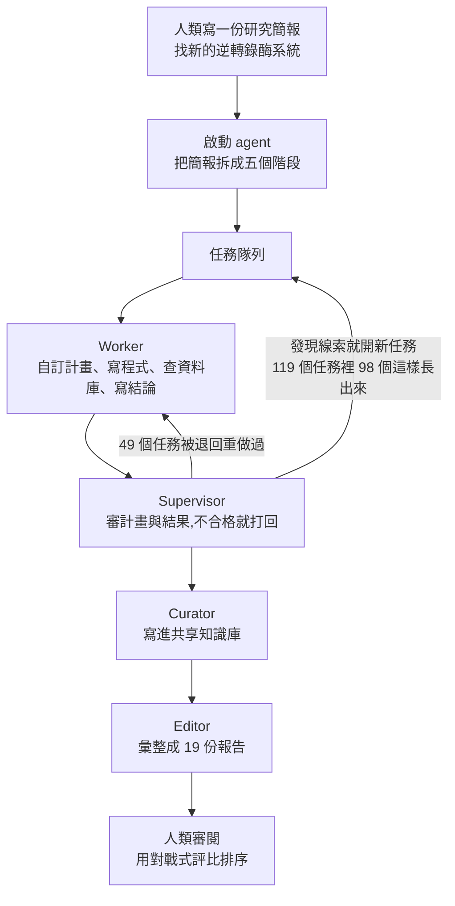

# Anthropic 用 949 個 agent session 找到新酶系統 ART:科研 harness 怎麼分工,以及「模型會 ≠ Agent 會」

**主題分類:** 科技 / AI Agent 應用 — 多 agent 科研 harness、上下文工程
**來源:** YouTube〈50 Agent 21 小时 2.1 亿 Token | Anthropic如何做科研 Harness?〉(Why QQ,2026-09-26,約 9.6 分;**依官方簡中字幕整理**,標題的「50」應為「950」)
**一手素材核實:** 已讀 [Anthropic 官方公告](https://www.anthropic.com/news/claude-discovers-novel-enzyme-system)(2026-09-23)與**技術報告預印本全文**〈Autonomous AI agents discover reverse transcriptases with tandem repeat arrays〉(Yoon et al.,Anthropic,40 頁),以及 Anthropic 的 [Paving the way for AI agents in biology](https://www.anthropic.com/research/agents-in-biology)(VirBench)
**整理日期:** 2026-09-27

> ⚠️ **性質說明:** 論文是**預印本,尚未同行評審**;所有濕實驗由人類科學家完成;**ART 的生物功能目前未知**。影片面向程式設計師,重點是 harness 設計,不是生物學。

---

## TL;DR

1. ⭐ **發生了什麼:** Anthropic 的 Claude agent 在 **19.4 億個蛋白質簇**裡翻找逆轉錄酶(RT),注意到一種 RT 上游有一串**規則重複的 DNA**,排列有點像 CRISPR。這個系統被命名為 **ART**(array-associated RT)。
2. ⭐⭐ **「950 個 agent」的真相:** 是 **119 個任務、949 次 agent session**(1 次啟動 + 414 worker + 375 supervisor + 107 curator + 52 editor),**最多 58 個同時跑**,總計 76.9 agent 小時、21.5 小時掛鐘時間。**不是 950 個 AI 科學家同時在線。**
3. ⭐⭐⭐ **比酶更值錢的兩組數字:** ① **同一套 harness、同一份簡報重跑 10 次,全部錯過**;② **把 DNA 直接放進上下文,最強的四個模型九成以上看得出重複陣列;改成給檔案 + 工具讓它自己找,最低只剩 32%。**
4. ⭐⭐⭐ **原因不是模型變笨,是它沒看到:** 給檔案時,**39% 的嘗試從頭到尾沒連續讀過 200 個鹼基**,連一個完整的重複單元都沒看全。
5. ⭐ **給寫 agent 的人的結論:** **模型決定潛在能力,harness 決定能兌現多少**;很多「推理失敗」其實發生在推理開始之前。
6. ✅ 本文補上影片沒講的三件事:**跑這場的是 Claude Mythos 5**、**2.156 億 token 裡有 1.895 億是寫入快取**、論文還用**可解釋性工具**找到 Mythos 5 內部「對重複 DNA 有反應」的訊號(見 §7)。

---

## 1. 這套科研 harness 怎麼分工

> ⭐ 影片:「950 個 Agent 別想像成 950 個模型坐在一起開群聊,它更像一個**分布式任務系統**。」
> 「任務隊列、Worker、審核、共享儲存 —— 做過後端的同學應該眼熟這套配方。」

| 角色 | Session 數 | 職責(✅ 技術報告) |
|---|---|---|
| **啟動 agent** | 1 | 把研究簡報的五個階段(輸入組裝 → 資料庫掃描 → RT 分類 → 鄰近基因普查 → 深挖)串成鏈,**每一階段用腳本做完成檢查** |
| **Worker** | 414 | 規劃並執行任務,交出摘要、程式碼與資料檔 |
| **Supervisor** | 375 | 審查計畫、摘要與修改的檔案,**接受或打回**;可以提出後續任務 |
| **Curator** | 107 | 每個任務完成後,把發現記進**共享知識庫** |
| **Editor** | 52 | 審閱並合併報告 |

**執行環境:** 每個 agent 都是**設定成 Claude Mythos 5 的 Claude Code**;沙箱 60 核 CPU、192 GiB 記憶體、**沒有 GPU**;全程**沒有人為介入**。

> ⭐ 影片還引用 Anthropic 的多 agent 研究系統文章:在 BrowseComp 評測裡,**token 用量一項就能解釋 80% 的效能差異**。所以 950 個 agent 的一個核心價值,是**把 token 預算換成並行的搜尋寬度**——不同上下文、不同路徑,同時踩更多搜尋空間。

---

## 2. 搜尋漏斗:計算交給傳統工具,agent 負責調度與判斷

| 步驟 | 數量(✅ 技術報告) |
|---|---|
| 用 52 個 RT profile HMM 搜尋 | **19.4 億個蛋白質簇**(精確 1,939,242,578) |
| 過濾、分群後的 RT 簇 | **198,290** |
| 分成 RT 類別 | **9 類** |
| 抽樣 RT 基因座 | **10,983** |
| 在鄰近區域反覆出現的候選搭檔家族 | **3,564** |
| 深挖 | **16 + 1 個家族**(第 17 個由後續任務提名) |
| 確認為新關聯 | ⚠️ **只有 3 個**;其餘 14 個被判定為註解誤差、已知系統的一部分,或只是剛好住在附近 |
| 最終報告 | **19 份** = 16 份給 17 個候選家族(兩個合寫一份)+ **3 份給新的 RT 譜系** |

> ⭐⭐ 影片的重點:「**整條漏斗沒有一步靠模型硬背**。HMM 搜尋、聚類、資料庫比對,全是傳統生物資訊工具跑出來的。**Agent 幹的是調度和判斷,計算交給代碼。**這個分工思路,你寫自己的 Agent 時可以直接抄。」
>
> 📌 **本文補充:** ART 並不在那 3 個新搭檔關聯裡,而是來自「**3 個新 RT 譜系**」那組報告;它在對戰式評比中排名靠前,研究者才回頭追查 session 紀錄。

---

## 3. ⭐⭐⭐ 發現 ART 的那條路是「旁支」

**人類的任務書只要求找搭檔基因(蛋白質編碼基因),一個字沒提重複序列。**

| 步驟 | 發生了什麼 |
|---|---|
| **① 普查** | 一個候選 RT 因為旁邊有個未知基因被提名 |
| **② Worker 否決** | 深挖後發現那個基因是噬菌體聚合酶的次單元 → 關聯不成立。⭐ **但順手記了一筆:這個 RT 本身也是噬菌體基因,值得再看** |
| **③ Supervisor 開後續任務** | 讓下一個 Worker 檢查這類 RT 的上游區域 |
| **④ 新 Worker 讀了 DNA** | 發現這些 RT 的近親上游拖著一段很長的非編碼區(**中位數 940 bp**,而帶聚合酶的那些只有 27 bp);⭐ **它把這段 DNA 直接讀進自己的上下文 —— 這一步沒有人要求過** |

**✅ 技術報告收錄的 Worker 原話:**
> 「The L0050 […] flank is spectacular: I can see **by eye** a tandem repeat array … repeating many times with ~100-180 bp spacers — that's a CRISPR-like or msDNA-like repeat array?!」

接著它做了科學家會做的全套動作:**寫腳本數重複**(一個基因座有 **14 個 16-nt 重複**,間隔 100–200 nt)、對比所有已知 RT 系統、查文獻;中間還**自我懷疑**:「這會不會就是最近描述過的 DRT9?」逐個排除後才提交報告。

> ⭐ 影片:「破案的沒有 AlphaFold,也沒有任何專門訓練的 DNA 模型。**一個通用語言模型盯著 ATCG 看,看出了異常。**」

---

## 4. ⭐⭐⭐ 一次發現,十次錯過

✅ 技術報告:**同一套 harness、同一份簡報,又完整跑了 10 次。**

| 結果 | 內容 |
|---|---|
| 幾乎每次 | 完成普查的那幾次**都抽樣到了 ART 基因座** |
| 兩次 | Worker **把這個譜系當成後續任務追了下去** |
| ⚠️ **十次** | **沒有任何一次有 agent 去讀 RT 上游那段 DNA —— 全部錯過** |

> ⚠️ 影片強調:「**這十次都正常跑完,各有產出,唯獨沒再走通那條支線。**」
> ✅ 官方歸因:**RT 的蛋白搜尋空間太大,加上 harness 的行為不確定**。
> 影片:「少開一個 follow-up、少讀一個文件,整條路徑就不存在。」

📌 **本文補充:** 他們之所以能確認「十次都錯過」,是因為把重跑產生的 **3,084 筆任務紀錄與 5,632 份 session 紀錄**全部拿去搜尋原始發現的識別碼。⭐ 影片最後一段點出這件事的價值:「**只存最終答案的團隊,出了問題沒法查。**」

---

## 5. ⭐⭐⭐ 對照實驗:模型明明會,Agent 就是做不到

**✅ 設計:7 個 Claude 模型 × 5 種資訊條件 × 每格 100 次 = 3,500 次獨立嘗試**(每次上限 100 萬輸出 token,由語言模型評審對 10 項主張打分)。

| 條件 | 給法 |
|---|---|
| **Level 1** | 兩條 RT 蛋白序列放在 prompt,不給工具 |
| **Level 2** | 兩個基因座 DNA 以文字放在 prompt,不給工具 |
| **Level 3–5** | ⚠️ prompt 裡沒有序列;96 個基因座以**檔案**提供,配 HMMER、BLAST、Python 等工具(Level 4、5 再加預測結構、文獻與網路) |

| 發現 | 數字(✅ 技術報告) |
|---|---|
| 最強四個模型 | **Opus 5.5、Mythos 5.1、Mythos 5、Opus 5**;另三個是 Opus 4.6、Opus 4.8、Sonnet 5,**兩組差距明顯** |
| 序列在上下文裡 | 最強的模型**至少 90%** 的嘗試能正確描述重複陣列 |
| 給檔案 + 工具 | ⚠️ **最低 32%**(Opus 5,Level 4) |
| 為什麼 | ⚠️⚠️ **給檔案時,39% 的嘗試從沒連續讀過 200 nt 以上**,所以最多只看到一個重複單元 |
| 讀夠了會怎樣 | 讀過 200 nt 以上的嘗試,辨識率**高出 16–32 個百分點**;讀進上下文的 DNA 越多,四個強模型合計從 **29% 升到 76%**,**Mythos 5 最高到 96%** |

> ⭐⭐⭐ 影片:「**模型沒變笨,它只是沒看到。**」

### ⭐⭐ 同一件事的第二個證據:VirBench(✅ 已核實)

Anthropic 2026 年 6 月的 [VirBench 研究](https://www.anthropic.com/research/agents-in-biology):讓 agent 從 NCBI 拉病毒序列,**同一個問題問三遍,Claude Sonnet 4 回傳 106、15、5 條,正確答案是 266 條**。加上和 NCBI 合作做的確定性檢索層 `gget virus` 後,**每個受測模型都超過 92%(影片說 90%),最高 99.7%**,而且消除了每次結果不同的問題。

> ⭐⭐ **兩個實驗指向同一個結論:瓶頸出現在推理開始之前。能不能穩定拿到正確的上下文,才是分水嶺。**

---

## 6. ⭐⭐⭐ 對照到 coding agent:ART 的每個錯,你都見過

| ART 實驗裡的失敗 | Coding agent 的對應版本 |
|---|---|
| 沒讀 RT 上游那段 DNA | **沒打開真正相關的原始碼** |
| 搜尋方向跑偏 | grep、語意搜尋**找錯檔案** |
| 沒產生 follow-up | **沒繼續追呼叫鏈** |
| 資料庫存取不穩 | MCP、API **回傳不完整** |
| 重跑結果不同 | 同一個 issue **多跑幾次答案就變** |
| 確定性檢索層把成功率拉到九成 | ⭐ **用 AST、LSP、test runner 取代模型的純猜測** |

> ⭐ 影片引 Anthropic 的話:「**Agent 系統進了生產環境,最後一公里往往變成旅程的大頭。**」

📎 這與本庫 [[codebase-memory-vs-codegraph-two-routes]](用程式碼圖譜讓 agent 找對檔案)、[[system-one-models-jev-calibrated-decisions]] §16.1(coding agent 的 token 有 30–40% 花在讀檔)是同一個方向:**省下來、用對地方的,都是「讀」這一步**。

---

## 7. ⚠️ 補正與影片沒講的部分

### 7.1 已核實 / 需修正 / 影片未提

| 項目 | 影片說法 | 核實結果 |
|---|---|---|
| 規模 | 949 session、119 任務、2.156 億 token、21.5 小時、76.9 agent 小時、最多 58 並發 | ✅ **全部與技術報告一致**(官方新聞稿用約 950、2.1 億、21 小時的約數) |
| 49 個任務返工、98 個任務由後續線索長出 | 同左 | ✅ 一致 |
| 漏斗 19.4 億 → 19.8 萬 → 3,564 → 17 → 19 份報告 | 同左 | ✅ 一致;⚠️ 影片提到的「339 萬候選序列」本文在報告中**未找到對應數字** |
| 10 次重跑全部錯過 | 同左 | ✅ 一致 |
| 3,500 次對照、最低 32%、39% 沒讀滿 200 bp、高 16–32 點 | 同左 | ✅ 一致 |
| VirBench 加檢索層後「都站上 90%」 | 同左 | 📌 官方是「**超過 92%**」,最高 99.7% |
| 感染 15 分鐘時陣列 RNA 最高占噬菌體 RNA 的 8% | 同左 | ✅ 一致(噬菌體 SA1 感染 *S. lentus*) |
| ⭐ **用的是哪個模型** | ⚠️ 影片沒說 | ✅ **Claude Mythos 5**(設定在 Claude Code 裡) |
| ⭐ **token 組成** | ⚠️ 影片沒說 | ✅ 未快取輸入 1,130 萬 + **輸出 1,490 萬** + **寫入快取 1.895 億** = 2.156 億;**從快取讀取的 token 沒算進去**。⇒ **「2.1 億 token」有 88% 是寫入快取**,真正生成的只有約 7% |

### 7.2 ⭐⭐ 影片沒講、但寫在摘要裡的:模型內部的「DNA 重複訊號」

技術報告的摘要明寫:Claude 能認出重複陣列,「**可歸因於 Mythos 5 內部對重複 DNA 有反應的特定訊號**」。
研究者用原始發現那次的 session 紀錄,把模型讀 DNA 時的內部活動**拆解成可解釋的訊號**,並和兩個專門的基因組語言模型 **Evo 2、gLM2** 在同一段 DNA 上做對照(那兩個模型也能高信心辨認出重複)。論文把這種能力稱為「**genomic vision**」。

> 📌 這讓「一個通用語言模型盯著 ATCG 看出異常」不只是軼事:**模型內部確實有對應的表徵,前提是 DNA 真的被讀進上下文**。

### 7.3 ⚠️ 「Claude 發現了新酶」要打折看

影片的嚴謹段落,✅ 技術報告討論節證實:
- **噬菌體 MarsHill 的原始基因組報告,早就辨識出這個 RT,也推測上游有 5′ 非編碼 RNA**,**但沒描述重複序列,也沒描述搭檔基因**。(影片說該報告是 2021 年、上游 1,241 bp 也有記錄;⚠️ 1,241 bp 這個數字本文是在 **agent 的工作紀錄**裡看到的,年份未獨立查證。)
- ⇒ 比較準確的說法:**Claude 發現了一個「此前沒有被系統描述的分子系統」**——新的是「**重複陣列 + RT + 搭檔蛋白**」這個組合。
- ✅ 目前確認的只有:**陣列會被表達成短 RNA**,而且在相關噬菌體之間保守。
- ⚠️ 論文自己寫明:「**我們沒有證明這個 RT 有活性,也沒有證明這些 RNA 是它的受質。RT 與搭檔會不會交互作用、這個系統為噬菌體做什麼,目前未知。**」
- ⚠️ 影片:「**說它是下一個 CRISPR,純屬標題黨。**」

---

## 8. 應用案例

### 案例一:把「Worker + Supervisor + 後續任務隊列」搬到程式碼稽核

要找一個大型 monorepo 裡所有可能的 SQL injection:
1. **啟動 agent** 把工作拆成階段:列出所有 DB 呼叫點 → 分類 → 逐類深挖,**每階段用腳本檢查是否完成**(例如「呼叫點清單的行數 = grep 結果數」)。
2. **Worker** 深挖一類;**Supervisor** 審查結論,**不合格就退回**。
3. ⭐ **允許 Supervisor 根據 Worker 的旁註開後續任務**——ART 就是從「關聯被否決,但順手記了一筆」長出來的。
4. **Curator** 把每個結論寫進共享知識庫,避免下一個 Worker 重查。
5. **計算交給工具**:用 AST 找呼叫點、用 semgrep 做規則比對,agent 只負責判斷與調度。

### 案例二:用「讀了多少原文」診斷你的 agent

ART 的關鍵指標是「**有沒有連續讀過 200 nt**」。換到你的系統:
- Coding agent:統計每次任務**實際讀進上下文的相關檔案行數**;失敗的案例是不是都只 grep 了片段、沒打開完整函式?
- RAG 客服:統計答錯的案例,**檢索到的段落是否真的包含答案**。
- ⭐ 若失敗集中在「沒看到」,**該修的是 harness(檢索、工具、讀檔策略),不是換更大的模型。**

### 案例三:評估前先做「上下文直給」對照組

照論文的五級設計,評估一個 agent 能力前先做兩組:
| 組別 | 做法 | 用途 |
|---|---|---|
| **直給組** | 把正確的資料直接放進 prompt | 量**模型的能力上限** |
| **自找組** | 只給檔案與工具 | 量 **harness 能兌現多少** |

兩組差距越大,越該投資在檢索與工具上。VirBench 就是這樣發現:**加一層確定性檢索,比換模型有效得多**。

### 案例四:全程留紀錄,才能回答「為什麼這次沒找到」

Anthropic 能確認 10 次重跑都錯過,是因為**每個任務的工具呼叫、上下文、決策點全有紀錄**。自己的 agent 系統至少保留:任務樹、每個 session 的完整 transcript、被否決的線索與理由。

---

## 來源

- YouTube:[50 Agent 21 小时 2.1 亿 Token | Anthropic如何做科研 Harness?](https://www.youtube.com/watch?v=bLWJmz_uAco)(Why QQ,2026-09-26;官方簡中字幕)
- Anthropic 官方公告:[Claude discovers a novel enzyme system with CRISPR-like repeats](https://www.anthropic.com/news/claude-discovers-novel-enzyme-system)(2026-09-23)
- 技術報告預印本:[Autonomous AI agents discover reverse transcriptases with tandem repeat arrays](https://www-cdn.anthropic.com/22573675ada52a8ca8a97a1a4b4326b2f208a071.pdf)(Yoon, Athukoralage, Ameisen, Kauderer-Abrams, Perry, Durrant;Anthropic;未經同行評審)
- Anthropic 研究:[Paving the way for AI agents in biology](https://www.anthropic.com/research/agents-in-biology)(VirBench、`gget virus`)
- 相關論文:[Deterministic access to global viral sequence data enables robust agentic scientific discovery](https://arxiv.org/html/2606.06749v1)
- Anthropic 工程文章:[How we built our multi-agent research system](https://www.anthropic.com/engineering/multi-agent-research-system)(BrowseComp token 用量解釋 80% 效能差異)
- 媒體報導:[Gizmodo](https://gizmodo.com/claude-found-a-mysterious-crispr-like-system-but-anthropic-cant-say-what-its-capable-of-2000816906)、[Interesting Engineering](https://interestingengineering.com/ai-robotics/claude-discovers-crispr-like-enzyme-system)
