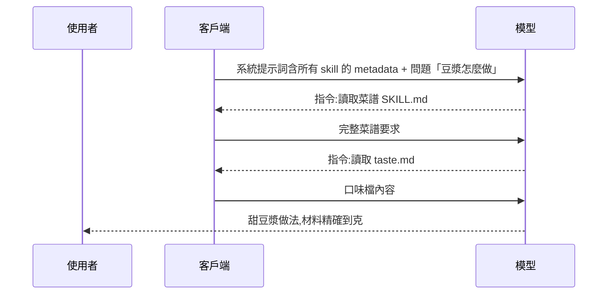
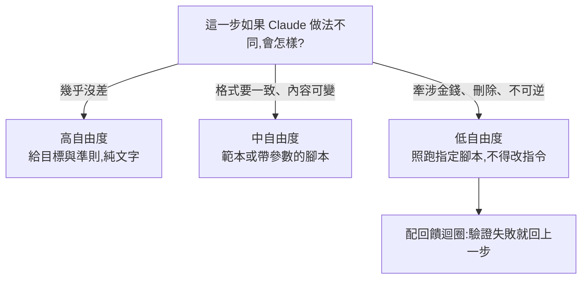

# Skill 實戰:從製作到維護一份「agent 會自動觸發、產出穩定、人類維護得了」的 skill

**主題分類:** AI / 代理工程 — 應用與實作
**來源:** YouTube〈Skill 實戰教學,從製作到維護的完整指南〉(Gary Chen,2026-04-25,約 20 分;講者自述替各公司做過上百個 skill,依繁中逐字稿整理)
**增補來源:** §7 程序员老王〈10分钟弄懂 什么是大模型Skill〉;§8 Simon Scrapes〈Everything You Know About Skills IS OUTDATED〉(2026-10-01)對照 Anthropic 官方〈Skill authoring best practices〉
**整理日期:** 2026-05-30

> 📌 本筆記的方法已用在使用者自己的 [claude_marketplace](https://github.com/shooter2062424/claude_marketplace) 上(`knowledge-tools` plugin 的 `rapid-learning` skill 即按此寫法)。

---

## 1. Skill 結構與漸進式披露

一個 skill 就是一個資料夾,通常三種東西:
- **`SKILL.md`** — 最上面 frontmatter(`name` + `description`),下面是傳授給 agent 的 **方法論**。
- **`references/`** — 參考資料(不是每次都要載入的內容)。
- **`scripts/`** — 讓 agent 直接執行的腳本(固定流程交給確定性腳本)。

**漸進式披露(progressive disclosure)三層**——這是能掛很多 skill 卻不爆 context 的關鍵:
1. 啟動時每個 skill 只載入 name+description(約 100 token)。
2. 對話觸發到才載入完整 `SKILL.md`。
3. `references`/`scripts` 真的需要時才載入。

---

## 2. 什麼時候該做 skill?三個信號

1. **重複性高、步驟固定**(一直在不同對話重複同樣指令)。
2. **你的 domain knowledge 是 AI 不知道的**(專案路徑規範、公司文件格式)。
3. **出錯成本高、需要標準化品質**(要對外交付)。

> 不用精算「只符合一個要不要做」——製作成本極低,**與其想不如直接做,用不到再刪**。

---

## 3. 兩種製作方法

- **① 逆向工程(新手友善):** 先實際跟 agent 協作完成一次任務(例:連 Google Drive 撈工作日誌 + 翻 GitHub commit → 彙整週報),滿意後 **千萬別關 session**(這是你最值錢的 context)→ 用 Claude 官方 **skill-creator** skill(marketplace 安裝)說「把剛剛的對話轉成可重複使用的 skill」。(非 Claude 也行:先叫它上網查 skill best practice。)
- **② 主動發起(brain dump):** 還沒實作過時,把「想達成什麼目的 + 想像中的流程 + 可能難點」丟給 AI,請它做成 skill,並要求「開始前有不清楚的先跟我釐清」。

> **心態:你是在當 AI 的 PM。** 別一直問「AI 能為我做什麼」,反過來想「我有沒有把 context、約束、方法、目標準備到足夠讓 AI 成功交付」。
>
> **進階:Evaluation-Driven Development**——做 skill 前先讓 AI 裸做一次(什麼方法論都不給),看它卡在哪,**那些卡點才是你該人為填補的空白**(而非腦補的規則)。優化也一樣:不是「再試一次」,而是問「缺工具?缺規則?缺文件?缺驗收標準?」——補系統缺口,不是抽籤式重跑。

---

## 4. 三個最常見的坑

### 坑一:agent 根本不觸發這份 skill
`description` 是 agent 判斷是否觸發的 **唯一根據**(因為漸進式披露)。三規則:
1. **同時包含「做什麼 + 何時用」**(只有其一 agent 不知道何時觸發/能做什麼)。
2. **用第三人稱**(別寫「I can help you...」會跟系統視角衝突)。
3. **包含使用者自然會說的觸發詞**(不是技術名詞——你都說「做週報」,description 卻寫「整理文件」,AI 要多一層推理)。

命名:**小寫 + 連字號 + 動名詞/名詞**(`weekly-report-drafting`、`pdf-processing`)。範例 description:
> `Drafts weekly status updates for managers, aggregating data from Google Drive and GitHub. Use when user mentions weekly reports, team updates, status summaries, or weekly reviews.`

也要避免 **過度觸發**(描述太廣,看 CSV 前三行也觸發處理 CSV 的 skill)。

### 坑二:產出品質不穩
**模型越強,人類要學會放手。** 窄 SOP 假設模型不會判斷,但推理模型基本吊打多數人類。Anthropic best practice:**給原則,不過度限縮做法**。好 SKILL 的核心是 **執行心法** 三要素:**為什麼這樣做 / agent 該抱什麼心態 / 執行時的 guiding principle**。

> 週報範例心法:「週報是寫給主管看的,整理資訊的標準不是『我做了什麼』,而是『主管需要知道嗎』;以卡點與下一步為優先。」——這不是步驟,是哲學/優先順序,agent 就能處理各種變體。
>
> **判準:這件事對錯有沒有客觀標準?有(表單欄位驗證)→ 寫窄一點/寫步驟;沒有(週報好壞)→ 寫原則。**

### 坑三:skill 太長(context rot)
載入 token 越多,召回精度越差。官方建議 **超過 500 行就該拆**(講者自己傾向 **200 行內**,因為太長自己都不想維護、出問題難回溯是哪份 skill 帶歪)。怎麼拆:
- **references** = 把細節/變體外掛(>100 行的 output format、公司術語表、只在特定情境用的範例如「進度落後的寫法」)。
- **scripts** = 把 **確定性操作**(排序、格式驗證、API 呼叫、計算)外包。例:固定撈過去 5 天 commit 寫成腳本,agent 從「自己去抓(可能 freestyle 抓 7 天)」變成「跑腳本讀結果」。**腳本程式碼永遠不進 context,只有執行結果餵給 AI** → 更穩又省 context。
- **subagent** = 容錯率低時當最後一層品管(separation of concerns:給它乾淨 context + checklist 驗收,避免主 agent 球員兼裁判)。

---

## 5. 應用案例:維護一份週報 skill(複利效應)

Skill 最有價值的是 **複利**:做一版、用一次修一次,一個月後已不是原本那份。但多數人做完就放著 → references 一堆沒用資料、200 行膨脹到 1000 行。**不維護的 skill 會越來越差**(錯誤觸發、燒多餘 token、產出不穩)。兩種維護時機:

1. **新模型出來時:** 拿既有 skill 跑一次,檢查「哪些是為補舊模型弱點加的」→ 新模型能自己處理就拿掉(呼應 [[bitter-lesson-cut-old-patterns]])。
2. **每次 workflow 跑完復盤:** 請 agent「盤點剛剛犯了哪些錯、背後原因、能否融入既有 skill 避免再犯」。

維護三動作:**刪冗餘 / 重整結構(整份重讀能不能快速抓骨架,不能就重構)/ references 萃取**。⚠️ agent 自己改 skill 會把結構搞亂、寫出人類難維護的東西——**寫入前一定 double check,別完全放手**。

**測試小技巧:** 開兩個 session。A 先查 skill best practice;B 觸發要優化的 skill 執行,把失敗處記錄丟給 A 提優化方向,你審核,持續跑。

---

## 6. Skill 的真正意義

> Skill 是 **個人知識轉移給 agent 的載體**——你要花很久教會新人的事,打包成 skill 後 agent 立刻學會。模型會自己越來越聰明,**你真正要做的是把你的「判斷/思考方式」交給它**。
>
> 回扣 **harness engineering**(見 [[ai-harness-explained]]):人類掌舵、agent 執行;skill 把你腦中的執行 logic 告訴 agent——這也是為什麼「執行心法」才是真正有獨特價值的東西。它是你、團隊、與 agent 之間 **協作的新介面**(對照 [[claude-skills-governance-man-group]] 的企業級 skill 治理)。

---

## 7. 補充:Skill 運作的三個階段——用「豆漿」例子拆給一般人聽(程序员老王,2026-01-22)

> 來源:〈10分钟弄懂 什么是大模型Skill〉(程序员老王,無字幕,逐字稿以 CPU faster-whisper 轉錄)。作者在說明欄推廣其付費「知識星球」。

**起點:** 問 AI「豆漿怎麼做」,得到「黃豆少許、水適量、最後放鹽」——少許是多少?豆漿怎麼能放鹽?於是你學會把要求寫具體(材料精確到克、每步寫時間、只喝甜豆漿),慢慢攢了一堆「規定輸出」的提示詞:問菜譜貼菜譜那份、讀論文貼論文那份……多到自己都忘了寫過哪份。全部一起送?**浪費 token,而且無關資訊多了 AI 會迷茫。** ⇒ 需要「依問題自動挑提示詞」的機制,這就是 skill。

| 階段 | 發生什麼 | 豆漿例子 |
|---|---|---|
| **Discovery(發現)** | 客戶端(本機程式或網站伺服器)收集所有 skill 的 **metadata**(SKILL.md 開頭的簡短介紹),放進**系統提示詞**和使用者問題一起送出;因為都很短,skill 再多也不太佔 token | 「菜譜 skill」「讀論文 skill」的一句話介紹都在系統提示詞裡 |
| **Activation(啟用)** | AI 用語意判斷問題和某個 skill 有關,先不回答,而是回一則特殊指令要客戶端**讀出完整 SKILL.md** | AI 判斷「做豆漿」和菜譜 skill 有關 ⇒ 讀出完整菜譜要求 |
| **Execution(執行)** | SKILL.md 可再引用其他檔案(可一路巢狀),由 AI 決定要讀哪些;**讀檔本身就是讓客戶端執行命令**,所以也能跑 skill 裡的腳本,甚至依 SKILL.md 說明的已安裝函式庫**當場寫程式來執行** | 把「七舅老爺的口味」「我有哪些廚具」「超好吃菜譜 100 篇」拆成獨立檔,需要時才讀 |

**兩個值得注意的點:**
- 使用者**只看到最初的問題和最後的回覆**;中間一大段 skill 相關的往返是看不到的。
- 這也是為什麼 skill 要做成**資料夾**而不是單一檔案:為了把 SKILL.md 本身瘦身,把大內容拆到旁邊的檔案按需讀取(即 §1 的漸進式披露第三層)。

**執行環境差異:** 用 Claude 應用程式或 Claude Code 這類本機程式時,命令在**你自己的電腦**上執行,可直接讀本機 skill;用網頁版時,命令跑在 **Claude 提供的虛擬機**上,碰不到本機檔案,所以要先把 skill **打包上傳**。

**官方 PDF skill 的例子:** 裡面附了一批處理 PDF 的小程式,SKILL.md 說明怎麼用;使用者要「PDF 轉圖片」時,AI 從 metadata 發現 PDF skill → 讀 SKILL.md 找到轉圖腳本 → 叫客戶端執行。更進一步,SKILL.md 也列出已安裝的 **pypdf、pdfplumber** 等函式庫並附程式片段,所以**就算沒有現成腳本,AI 也能當場寫程式完成**——這是 skill 配合執行能力最強大的地方。

> 老王總結:「skill 本身只是一個管理提示詞的工具,平平無奇;但配合執行命令的能力,就大大擴展了 AI 的靈活性。**執行能力給了 AI 行動力,skill 為 AI 指明了方向。**」

---

## 8. 補充:Anthropic 官方 skill 撰寫最佳實踐七條——以及影片講過頭的地方(Simon Scrapes,2026-10-01)

> 來源:〈Everything You Know About Skills IS OUTDATED〉(Simon Scrapes,約 13 分;英文自動字幕)。⚠️ 立場:作者推廣自家 Skool 付費社群(影片中的「skill 稽核提示詞」放在社群裡)與 RankSpot 連結;本節不轉述付費內容,**七條規則全部對照官方〈[Skill authoring best practices](https://platform.claude.com/docs/en/agents-and-tools/agent-skills/best-practices)〉逐條核實**。

### 8.1 七條規則對照表

| # | 影片說法 | 官方原文 | 核實 |
|---|---|---|---|
| 1 | 超過 100 行的 reference 檔,開頭放**目錄** | 「For reference files longer than 100 lines, include a table of contents at the top」,讓 Claude 即使只部分讀取也看得到全貌 | ✅ |
| 2 | **自由度分三級**:高=純文字指示(code review)、中=範本加參數(報告)、低=照跑指定腳本(資料庫遷移) | 同一組例子;官方比喻:**兩側是懸崖的窄橋**給低自由度,**沒有危險的開闊草地**給高自由度 | ✅ |
| 3 | **每個要用的模型都要測**:Haiku 夠不夠引導?Sonnet 清楚有效嗎?Opus 有沒有過度解釋? | 三個問題逐字相符 | ✅ |
| 4 | SKILL.md 本體 **< 500 行**、當目錄用;**reference 只能從 SKILL.md 一層連出** | 「Keep SKILL.md body under 500 lines」「Keep references one level deep from SKILL.md」 | ✅ |
| 5 | 複雜流程給 **checklist**,讓 Claude 複製到回覆裡逐項打勾 | 研究綜整範例逐字相符,含「引用不完整就回到第 3 步」 | ✅ |
| 6 | **回饋迴圈**:檢查 → 修 → 再檢查,直到通過 | 「Run validator → fix errors → repeat」「greatly improves output quality」;validator 可以只是一份 STYLE_GUIDE.md | ✅ |
| 7 | **不要假設套件已安裝**,把安裝指令寫在腳本旁 | 「Avoid assuming tools are installed」,好範例是先寫 `pip install pypdf` | ✅(📌 但有限制,見 8.2) |

### 8.2 影片講過頭或漏掉的地方

| 影片說法 | 實際 |
|---|---|
| 「規則完全變了」「官方又新增了六條規則」 | 📌 這些都是官方指南**既有內容**,不是近期改版新增;影片標題的「OUTDATED」屬吸睛說法 |
| 「Claude 開啟長 reference 檔時**會跑 `head -100`**,只讀前 100 行」 | 📌 官方的說法是**巢狀引用時「可能」**用 `head -100` 之類的指令預覽(「may partially read files when they're referenced from other referenced files」)。不是每次都只讀前 100 行;**目錄 + 一層引用**兩條規則是針對這個風險 |
| 「把目標模型寫進 YAML frontmatter」 | 📌 這是**作者自己的建議**,官方 frontmatter 只要求 `name`(≤64 字元、小寫/數字/連字號、不可含「anthropic」「claude」)與 `description`(≤1,024 字元、第三人稱) |
| 「以前大家都把總行數壓在 200 行以下」 | 📌 官方建議一直是 **500 行** |
| 「Fable 5 指南說為舊模型寫的 skill 太死板,會讓輸出變差」 | ⚠️ 未在本頁找到,未能核實;但方向與「Opus 有沒有過度解釋?」一致 |
| 依賴:「寫安裝指令,已裝過 Claude 會自己跳過」 | ⭐ 官方補充了影片沒講的限制:**claude.ai** 可從 npm/PyPI/GitHub 安裝;**Claude API 的執行環境沒有網路、不能在執行時安裝套件**——在 API 上跑的 skill 寫安裝指令也沒用,只能用環境內建的套件 |

**影片沒提、但官方同樣強調的幾條:**
- **先寫評測再寫文件**:先讓 Claude 不帶 skill 做代表性任務、記錄失敗 → 建 3 個評測情境 → 量基線 → 只寫剛好補洞的指示。
- **Claude A / Claude B 迭代法**:一個實例幫你寫 skill,另一個全新實例載入 skill 實際做事,觀察它哪裡卡住再回頭改。
- **腳本「執行」不「讀入」**:腳本只有輸出佔 token(影片有提);指示裡要寫清楚是「執行 X」還是「參考 X 的演算法」。
- **MCP 工具用完整名稱** `ServerName:tool_name`;路徑一律用正斜線;不要放有時效性的資訊(舊做法收進「Old patterns」)。

### 8.3 自由度怎麼判斷:問「如果 Claude 做得不一樣會怎樣」

作者的三個心得:**同一個 skill 可以混用不同自由度**(開發票 skill 的「寫說明」高自由度、「建立發票」低自由度);**低自由度通常代表寫成腳本**,而不是寫更多文字;腳本在每個模型上表現一致,所以**Haiku 漏步驟的地方,要嘛寫清楚、要嘛改成腳本**。

### 8.4 應用案例:用七條規則稽核一個既有 skill

以本筆記 §5 的週報 skill 為例,逐項檢查:
1. `references/` 裡超過 100 行的檔案 ⇒ 開頭補目錄(標題與章節對應)。
2. 每一步標自由度:「彙整本週重點」高、「套用週報模板」中、「寄送給客戶名單」低(改成腳本,只接受固定參數)。
3. 用 Haiku、Sonnet、Opus 各跑一次同一任務:Haiku 漏步 ⇒ 補清楚或改腳本;Opus 帶 skill 反而比不帶差 ⇒ 刪指示直到變好。
4. 列出 SKILL.md 引用的所有檔案,找出「只能從別的 reference 間接連到」的檔案,全部改成從 SKILL.md 直接連。
5. 「資料檢查 → 產出報告」這種**順序重要**的流程才加 checklist;順序不重要就不加。
6. 加回饋迴圈:草稿對照品牌語氣文件檢查,不合格就修;遇到語氣文件沒涵蓋的新問題,讓 Claude 在結尾**建議一條新規則**,人工核准後寫回文件。
7. 每個腳本旁寫明 `pip install ...`;若 skill 會在 Claude API 上跑,改為只用執行環境內建的套件。

---

## 來源

- [YouTube:Skill 實戰教學,從製作到維護的完整指南(Gary Chen)](https://youtu.be/PuqX3Kv2ino)
- [YouTube:10分钟弄懂 什么是大模型Skill(程序员老王,2026-01-22)](https://www.youtube.com/watch?v=lnneAfJqd9M)(無字幕,逐字稿以 CPU faster-whisper 轉錄、非官方字幕)
- [YouTube:Everything You Know About Skills IS OUTDATED(Simon Scrapes,2026-10-01)](https://www.youtube.com/watch?v=e7TY56-yIvM)(英文自動字幕)
- [Anthropic:Skill authoring best practices(官方文件)](https://platform.claude.com/docs/en/agents-and-tools/agent-skills/best-practices)
