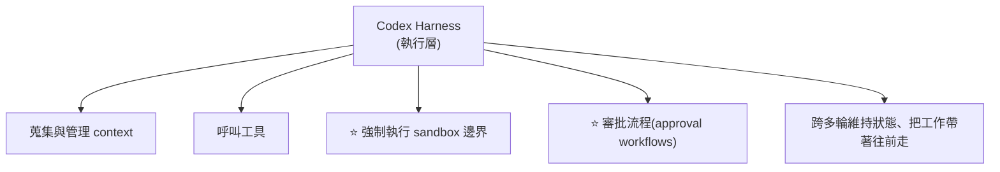

# Codex 平台化:OpenAI 把 harness 開源、模型留著 —— 以及一個「同模型換 harness 就 13.3% → 38.3%」的數字

> 整理自 **OpenAI Developers 官方部落格**〈Codex as a platform: build on the open agent harness〉。
> ⚠️ **來源說明**:OpenAI 另有〈Harness engineering: leveraging Codex in an agent-first world〉與〈Unrolling the Codex agent loop〉兩篇更深入的文章,**本文嘗試抓取時均回 HTTP 403(站方 bot 防護),未能取得內容**,故本文僅依 developers 站的平台文章整理。

> ⭐ **強烈建議與 [[arc-agi-3-agentic-benchmark]] 對照看** —— 這篇引用的 ARC-AGI-3 數字,正好給那篇的「前沿 AI 低於 1%」補上了後續發展。
> 其他相關:[[agentic-harness-engineering-observability-evolution]]、[[recursive-agent-harness-harness-recursion]]、[[pi-minimal-agent-harness-teardown]]、[[agent-harness-launches-august-2026]]、[[codex-multi-agent-v2-graph-engineering]]、[[cross-model-review-claude-codex-harness]]

---

## 一句話總結

**OpenAI 把 Codex 的 harness 開源,但模型留在自己手上** —— 明確地把「agent 產品的競爭」切成兩層:**執行層開放給大家蓋東西,模型層維持專有。**

⭐⭐ 而它自己提供的一個數字,把「harness 有多重要」講得比任何論述都清楚:**同一個模型,只是加上「保留推理」與「上下文壓縮」,ARC-AGI-3 分數從 13.3% 拉到 38.3%,而且輸出 token 少了六倍。**

---

## 一、什麼是「open Codex harness」

**它就是 Codex 各種對外介面(App、CLI、IDE 擴充)底下的那一層執行層。**

**它負責管理 agent 的推理循環:**



### ⭐⭐ 開源的邊界劃在哪裡(這是這則消息最重要的一點)

| 開源 | 專有 |
|---|---|
| **Codex CLI** —— 命令列介面,用於有界的 agent 執行 | ⚠️ **模型存取(model access)** |
| **Codex app-server** —— 本機服務,透過文件化的客戶端協定暴露 agent 能力 | ⚠️ **託管服務(managed services)** |
| **官方 Codex SDK** —— 給應用程式碼的直接程式介面 | |

> ⭐⭐ **官方的說法是:「harness 與整合面維持開放,模型存取與託管服務維持專有。」**
>
> **這句話等於畫出了一條產業分界線** —— OpenAI 願意把「模型外面那一圈」交出去讓大家蓋,但守住模型本身。

---

## 二、app-server 的客戶端協定:四個原語

**文件化的協定讓應用程式可以做四件事:**

| 原語 | 說明 |
|---|---|
| **Threads(執行緒)** | **對話的容器** —— 建立與管理 |
| **Turns(回合)** | **agent 的執行循環** —— 發起一次 |
| **Events(事件)** | **接收串流出來的即時活動** |
| ⭐ **Approval requests(審批請求)** | **人在迴圈裡的決策點** |

⭐ **「審批請求」被列為協定的一等原語,而不是實作細節** —— 這跟 [[pi-minimal-agent-harness-teardown]] 那種「刻意不做權限系統」是完全相反的取捨,也跟微軟 Agent Framework 把審批流程做進內建能力是同一個方向。

### 三種整合方式

| 方式 | 適合 |
|---|---|
| **`codex exec`** | **非互動式**執行 |
| **SDK** | **程式化**呼叫 |
| ⭐ **app-server** | **持續性的對話式產品** |

---

## 三、⭐ 論證:為什麼要「把 agent 帶進工作現場」而不是「把工作搬進通用助理」

**官方的主張很直白:**

> **與其要求每個團隊把工作搬進一個通用的程式助理,不如「把 agent 帶進一個圍繞著實際工作設計的軟體裡」** —— 一個工程工作流、一個維運儀表板、一次資安調查、一個客服主控台,或一個為單一專門團隊打造的內部應用。

⭐ **論證的核心是「保留現場」**:這樣做能保住既有的儀表板、審批流程與領域專屬工具,而不是要求人離開它們。

⭐ **而「開源」在這裡的功能性理由也講得很清楚:**
> **因為 harness 是開源的,開發者可以「檢視應用程式與模型之間的那一層」,理解它的行為,並調整整合方式以符合自己的產品。**

⚠️ **注意這是一個關於「可稽核性」的論點,不只是關於「可修改性」** —— 你能看見那層在做什麼,才敢把它放進資安調查或客服這種場景。

---

## 四、⭐⭐ 那個 ARC-AGI-3 的數字(全文最有訊息量的一句)

> **在 ARC-AGI-3 基準上,「保留推理(retained reasoning)」與「上下文壓縮(context compaction)」把 GPT-5.6 Sol 的分數從 13.3% 拉到 38.3%,同時把輸出 token 減少為六分之一。**

⭐⭐ **這句話為什麼重要,有三層:**

**① 這是一個「模型固定、只動 harness」的對照**
📎 跟 [[agentic-harness-engineering-observability-evolution]] 與 [[recursive-agent-harness-harness-recursion]] 用的是同一種可歸因的實驗設計 —— **模型不動,差異就只能歸給 harness。**

**② ⭐ 分數提升的同時 token 還變少了**
⚠️ 這一點很反直覺 —— **多數人會預期「想得更好」要付出「算得更多」的代價**。這裡是兩者同時改善。
📎 這跟 AHE 那篇「把行為編碼進工具與中介層,反而比只調提示詞省 32% token」是同一個機制:**結構化的東西不用每次呼叫都重新推導。**

**③ ⭐⭐ 它給 [[arc-agi-3-agentic-benchmark]] 的畫面補了後續**

| 時點 | ARC-AGI-3 上的表現 |
|---|---|
| **2026-03(ARC 論文所述)** | ⚠️ **前沿 AI 系統「低於 1%」** |
| **本文(harness 改進後)** | ⭐ **38.3%** |
| **人類** | **100%** |

⭐ **所以「低於 1%」那個駭人數字,有相當一部分是「harness 沒跟上」而不是「模型不行」。** 但同時 —— **38.3% 距離人類的 100% 仍然很遠**,而 ARC-AGI-3 的通關定義是「達到或超越人類的行動效率」,不是「解得開」。

> ⚠️ **這兩個數字來自不同來源、不同時點,且 OpenAI 是利益相關方,本文未能獨立驗證。** 但方向與本倉庫這一系列 harness 筆記的證據一致。

---

## 五、實際落地案例(官方列出的)

| 對象 | 用途 |
|---|---|
| **Relay(官方範例應用)** | ⭐ **貨運維運儀表板** —— agent 調查延誤、透過 **MCP 工具**取得脈絡資料,**在重新配送路線前必須取得審批** |
| **GitHub / JetBrains** | IDE 工作流整合 |
| **Cisco** | Cloud Control 平台整合 |
| ⭐ **Thrive Holdings / Crete** | **報稅** —— **處理了 7,000 份報稅表,時間減少約 33%** |

⭐ **Relay 這個範例挑得很好**:它同時展示了三件事 —— **領域專屬的介面(儀表板)、MCP 取得外部資料、以及「不可逆動作前必須審批」**。而「重新配送路線」正是那種**做錯了會有真實成本**的操作。

⭐ **Thrive / Crete 的報稅案例則是少見有具體數字的**:7,000 份、約 33% 時間縮減 —— ⚠️ 但沒有說明基準是什麼、也沒說錯誤率。

---

## 應用案例

### 案例 1|⭐⭐ 用「開源邊界劃在哪」判斷一家公司的策略

Codex 的切法值得當成一個分析框架:

```
開放:harness、整合面、協定
專有:模型存取、託管服務
```

⭐ **這條線的含意是:OpenAI 判斷「執行層會被商品化,而模型不會」。**

**拿同一把尺量本倉庫其他幾家:**

| | 開放什麼 | 守住什麼 |
|---|---|---|
| **OpenAI Codex** | harness + 協定 | **模型 + 託管** |
| **Pi**([[pi-minimal-agent-harness-teardown]]) | ⭐ **幾乎全部**(核心極簡 + 插件生態) | — |
| **DeepSeek Harness**([[agent-runtime-deepseek-harness-cordis]]) | ⭐ **everything is a plugin** | — |
| **Microsoft Agent Framework**([[agent-harness-launches-august-2026]]) | 框架 | **Foundry 託管執行** |

⭐ **共同點:沒有人試圖守住 harness 本身。** 大家爭的是「誰的 harness 成為預設」,而不是「誰能把 harness 藏起來賣錢」。

### 案例 2|⭐ 把「審批」當成協定原語而不是實作細節

app-server 把 approval request 列為四個原語之一,這個決定可以借鑑:

```
❌ 常見做法:審批寫在應用層,harness 只管執行
   ⚠️ 問題:換一個 harness、或多一個入口,審批就漏掉了

✅ Codex 的做法:審批是「協定的一部分」
   ⇒ 任何接這個協定的客戶端,都必須處理審批事件
   ⇒ 漏不掉
```

⭐ **判準:一件「絕對不能漏」的事,應該放在協定裡,而不是放在每個實作者的自覺裡。**

### 案例 3|⚠️ 「分數上升 + token 下降」是判斷 harness 改動是否真實的好訊號

從那個 13.3% → 38.3% 且 token 減為 1/6 的組合,可以歸納出一條檢查:

| 觀察到的組合 | 意義 |
|---|---|
| ⭐ **分數↑ + token↓** | **很可能是真的結構性改善** —— 減少了重複推導 |
| 分數↑ + token↑ | ⚠️ 可能只是「多算一點就多對一點」,要看性價比 |
| 分數↑ + token↑↑↑ | ⚠️⚠️ 接近暴力嘗試,而 [[arc-agi-3-agentic-benchmark]] 的計分法會直接懲罰這個 |

### 案例 4|⭐ 「把 agent 帶進工作現場」的判斷順序

官方的主張可以變成一個實際的決策流程:

```
① 這件工作有沒有既存的、大家已經在用的介面?
   (儀表板、工單系統、內部工具)
   —— 有 ⇒ ⭐ 把 agent 帶進去,不要把人叫出來

② 這件工作有沒有既存的審批流程?
   —— 有 ⇒ ⭐ agent 必須走同一套,不能另開一條

③ 這件工作需不需要領域專屬的資料源?
   —— 需要 ⇒ 用 MCP 之類的方式接進來
```

⚠️ **反過來說,如果一件工作「本來就沒有現場」(純探索、一次性分析),那通用助理反而更合適** —— 不是每件事都要做成嵌入式 agent。

---

## 重點回顧(TL;DR)

1. **Open Codex harness = Codex 各種對外介面(App、CLI、IDE 擴充)底下的執行層**,負責蒐集 context、呼叫工具、**強制 sandbox 邊界**、**審批流程**、跨多輪維持狀態。
2. ⭐⭐ **開源邊界劃得很明確**:**開放** Codex CLI、app-server、官方 SDK 與整合面;⚠️ **專有** 模型存取與託管服務。**等於宣告:執行層會被商品化,模型不會。**
3. **app-server 協定的四個原語**:**Threads**(對話容器)、**Turns**(agent 執行循環)、**Events**(串流即時活動)、⭐ **Approval requests**(人在迴圈的決策點)。
4. ⭐ **審批被列為協定的一等原語而非實作細節** —— 與 Pi 的「刻意不做權限系統」是相反取捨,與微軟把審批做進內建能力同方向。
5. **三種整合方式**:`codex exec`(非互動)、SDK(程式化)、**app-server**(持續性對話式產品)。
6. ⭐ **核心論證:與其要求團隊把工作搬進通用程式助理,不如把 agent 帶進「圍繞實際工作設計的軟體」** —— 工程工作流、維運儀表板、資安調查、客服主控台、內部應用。**目的是保住既有的儀表板、審批流程與領域工具。**
7. ⭐ **開源的功能性理由是「可稽核」不只是「可改」**:開發者能檢視「應用程式與模型之間的那一層」在做什麼 —— 這才敢把它放進資安或客服場景。
8. ⭐⭐⭐ **最有訊息量的一句**:在 ARC-AGI-3 上,**「保留推理」與「上下文壓縮」把 GPT-5.6 Sol 從 13.3% 拉到 38.3%,同時輸出 token 減為六分之一。**
9. ⭐ **這句話的三層意義**:①**模型固定、只動 harness** 的可歸因對照(與 AHE、RAH 兩篇論文同一種實驗設計);②⭐ **分數上升的同時 token 還下降** —— 反直覺,但與 AHE「結構化的東西不必每次重新推導」是同一機制;③⭐⭐ **給 [[arc-agi-3-agentic-benchmark]] 的「2026-03 前沿 AI 低於 1%」補上後續** —— 那個駭人數字有相當部分是「harness 沒跟上」而非「模型不行」。
10. ⚠️ **但別過度樂觀**:38.3% 距離人類的 100% 仍遠,**而且 ARC-AGI-3 的通關定義是「達到或超越人類的行動效率」,不是「解得開」**。
11. **落地案例**:**Relay**(官方範例的貨運維運儀表板 —— agent 調查延誤、用 **MCP 工具**取脈絡、**重新配送前必須審批**)、**GitHub / JetBrains**(IDE)、**Cisco**(Cloud Control)、⭐ **Thrive Holdings / Crete**(報稅,**7,000 份報稅表、時間減少約 33%**)。
12. ⭐ **Relay 這個範例同時示範了三件事**:領域專屬介面、MCP 接外部資料、**不可逆動作前必須審批**。

---

## 來源

- ⭐ [Codex as a platform: build on the open agent harness — OpenAI Developers](https://developers.openai.com/blog/codex-as-a-platform) —— **本文主要依據**
- ⚠️ **以下兩篇 OpenAI 官方文章本文嘗試抓取時均回 HTTP 403(站方 bot 防護),未能取得內容,列此供日後補讀**:
  - [Harness engineering: leveraging Codex in an agent-first world](https://openai.com/index/harness-engineering/)
  - [Unrolling the Codex agent loop](https://openai.com/index/unrolling-the-codex-agent-loop/)
  - [Unlocking the Codex harness: how we built the App Server](https://openai.com/index/unlocking-the-codex-harness/)
  - [An open-source spec for Codex orchestration: Symphony](https://openai.com/index/open-source-codex-orchestration-symphony/)
- 本倉庫相關筆記:[[arc-agi-3-agentic-benchmark]]、[[agentic-harness-engineering-observability-evolution]]、[[recursive-agent-harness-harness-recursion]]、[[pi-minimal-agent-harness-teardown]]、[[agent-runtime-deepseek-harness-cordis]]、[[agent-harness-launches-august-2026]]、[[codex-multi-agent-v2-graph-engineering]]、[[cross-model-review-claude-codex-harness]]

> ⚠️ **本文所有數字均為 OpenAI 官方自述,且 OpenAI 是利益相關方,未經獨立驗證。** 特別是 ARC-AGI-3 的 13.3% → 38.3% 與「token 減為六分之一」,以及報稅案例的 33% 時間縮減(未說明基準與錯誤率)。
