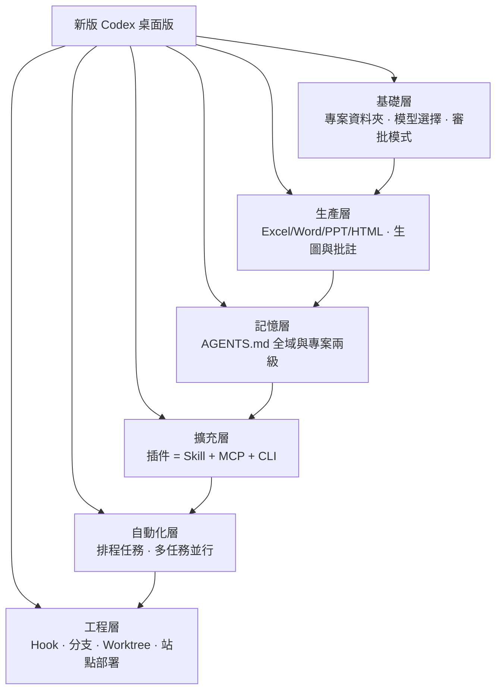
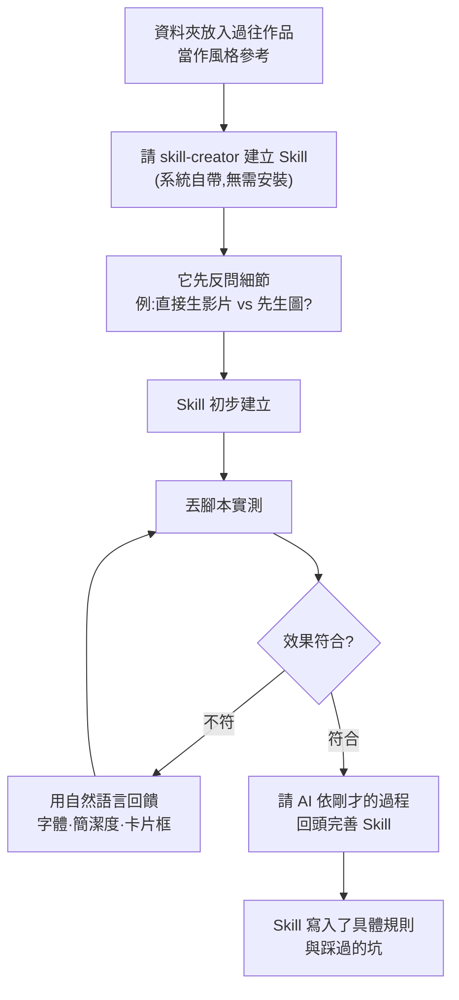

# 新版 Codex 全流程實戰:從資料夾、辦公文件、生圖,到 Skill / Hook / Worktree / 一鍵部署

**主題分類:** AI Agent / 應用 —— Codex 桌面版完整工作流
**來源影片:** YouTube〈全网最全,50分钟全面掌握新版Codex〜【附完整文档】〉(三颗门牙X,2026-08-28,約 53.5 分鐘)
**整理日期:** 2026-08-29

> ⚠️ 本影片無官方字幕也無自動字幕,逐字稿以 CPU 版 faster-whisper 轉錄取得,**非官方字幕**(專有名詞還原對照見文末)。影片中可查證的規格(模型名稱、審批模式、Hook 事件、AGENTS.md 合併規則)**已逐項比對 OpenAI 官方文件**,補正處集中在 **§9**。

> **與本倉庫既有 Codex 筆記的分工:** [[codex-as-a-platform-open-agent-harness]] 講 OpenAI 把 harness 開源的平台策略、[[codex-multi-agent-v2-graph-engineering]] 講多 agent 圖工程、[[cross-model-review-claude-codex-harness]] 講跨模型審查。**本篇補的是「新版桌面客戶端到底怎麼用」這一層**——介面、資料夾、辦公文件、生圖、持久記憶、CLI 串接、插件/Skill/MCP、自動化、Hook、分支與 Worktree、站點部署。

---

## 0. 一句話總結

> **新版 Codex 已經不是「能寫程式的聊天框」,而是一個「有檔案系統、有插件市場、有排程、有生命週期攔截器、還能一鍵把成果丟上線」的桌面 Agent 平台。** 影片的價值在於把這十幾個零件用一條真實工作流串起來,而不是分開介紹。



---

## 1. 基礎:專案資料夾才是桌面版 Agent 的核心

影片一開始就點出一件容易被忽略的事:**桌面端 AI Agent 的核心不是對話框,是資料夾。**

新版把 **ChatGPT 與 Codex 整合成同一個應用**,頂部可在兩者間切換:

| | 定位 |
|---|---|
| **ChatGPT** | 聊天與辦公 |
| **Codex** | 程式開發與**專案執行**,功能更豐富(影片全程用這邊示範) |

### 主資料夾 vs 補充資料夾

建立專案時可以掛**多個**來源資料夾,而它們的角色不同:

| 類型 | 放什麼 | 作用 |
|---|---|---|
| **主資料夾**(預設工作空間) | 任務規則 + 最終產出 | Codex 讀寫的預設落點 |
| **補充資料夾** | 品牌規範、歷史方案、參考資料、**個人本地知識庫** | Codex 可從中**搜尋、調用、也可直接操作** |

> **作者的實際用法很值得抄:** 他把大模型論文、技術報告、研究筆記整理成一個長期的補充資料夾,當作**個人知識庫**;每研究一個新主題(影片裡是 DeepSeek Harness)就新開一個研究資料夾並**設為主資料夾**,研究完再讓 Codex 把成果「歸檔」回知識庫。
>
> 歸檔提示詞大意:「我寫好了深度調研報告與測評文章兩篇,請提取核心資訊,整理歸檔到 AI model 補充資料夾。」因為他的知識庫用 **Obsidian** 管理,Codex 還會同步補上對應的筆記屬性(frontmatter)。
>
> **他歸檔的理由很誠實:** 用 AI 操作資料夾久了,「東問一句西問一句、這邊開個對話那邊又開一個、然後又要生圖」,資料夾**很容易被搞亂**。歸檔是治理手段,不是儀式。

### 模型怎麼選

影片給的建議是:開發或難度較大的任務用 **GPT-5.6 Sol**,小型任務用 **Terra**,**Luna** 用得很少。(官方定位略有出入,見 §9.1)

### 三種審批模式

| 影片的說法 | 行為 |
|---|---|
| 請求批准 | 每次遇到有風險的操作都問你 |
| **幫我批准**(影片推薦) | AI 自行判斷:低風險自己處理,高風險才讓你確認 |
| 完全訪問權限 | 全程放行,**一般不推薦** |

對應官方的 Read Only / Auto / Full Access 三檔,細節與底層設定見 §9.2。

### 幾個小而有用的介面能力

- **計畫模式(Plan)**:先產出計畫方案,你確認後才執行。第一次跑任務時作者會把推理強度調到高、提示詞寫得特別清楚。
- **選取即追問**:在產出的報告裡選一段文字丟進對話框直接提問,或選取後**點編輯讓 AI 擴寫**,再決定接受或拒絕。
- **內建瀏覽器**:報告裡的連結按住 Command 點擊,網頁直接開在右側,**不用切來切去**。
- **側邊臨時聊天**:開一個**不影響當前任務**的對話,用來想方案、討論提示詞怎麼寫。
- **快照(同時按兩下 Command)**:把畫面快照送給 AI,**快照會帶上 UI 元素的連結**,所以「比普通截圖強很多」——AI 能看懂時間軸、按鈕作用、底部效能指標各代表什麼。
- **調整方向**:AI 正在跑時再送一句話,可以選擇**中斷並注入當前上下文**,而不是排隊等下一輪。
- **`/status`** 看上下文用量與額度;**`/compact`(壓縮)** 壓上下文——作者的經驗法則是**用到約 60% 就壓一次**。
- 右上角圖示可開**終端機**,於是「在 Codex 裡再輸入 `claude`,兩個 AI 就能一起用」。

---

## 2. 辦公文件一條龍:Excel → Word → PPT → HTML

影片用「手機配件近四個月銷售資料要做經營匯報」這個真實需求,把四種產出串成一條線:


**關鍵是插件疊用而不是單發提示詞:**

- **Excel**:同時掛 `@Spreadsheet`(提供版型模板)與 `@Data Analytics`(資料分析技能)。後者會強制走一套流程——**資料品質檢驗 → 報告建構 → 圖表生成 → 結果驗證**,並明確**避免直接套用空白 Excel 表格**。
- **Word**:`@Documents` 內建模板;**想用自己的模板**就右滑點「建立模板」,它會給你對應的提示詞,另開一個對話,讓 `Documents` 先讀懂你的參考檔、再用 `template creator` 產生模板,回到原對話就能選用。
- **PPT**:`@Presentations`。影片坦承**直接生成的效果不是特別好**,加上 Skill 或模板才會好一些。但 **PPT 的修改方式最進階——可以直接在投影片上加評論(批註)來指定要改哪裡**。
- **HTML**:產出後同樣能用右上角批註鈕選取區塊留言,左側小圖示還能直接改顏色、字體、大小。

> 產出的表格可以**選取某一段丟回對話框要求修改**,也可以點右上角圖示**用 WPS 開啟編輯**——影片對「介面切換」這一塊評價很高。

---

## 3. 多任務並行:一句話拆成兩個獨立對話

這是影片裡最實用的一招。早上手上一堆事——要看電商資料、又要研究 DeepSeek Harness——可以讓 Codex **自己開任務、自己分工**:

> 提示詞大意:「幫我安排兩個任務。**任務一**:找到 DeepSeek Harness 研究資料夾,在該資料夾裡新建任務,研究它是什麼、怎麼用、優缺點,整理成研究筆記。**任務二**:找到電商資料資料夾,在該資料夾裡新建任務,分析資料找出最近的銷售情況與問題,產出分析報告並給幾條實質建議。兩個任務都存在各自的資料夾裡,完成後回來告訴我各自的結論與檔案位置。」

Codex 會**定位對應資料夾、分別新建兩個任務對話**(對話上方顯示「由 ChatGPT 另一項任務發送」)、**同時往下執行**,做完再回來統一匯報。

> **通用心法:** AI 跑任務要時間,不用一直等——**直接新建對話繼續派活,讓多個對話並行推進。**

---

## 4. 生圖與圖片批註

範例是亞馬遜北美站賣戶外電子手錶,要依**平台圖片規範與機器視覺辨識邏輯**產出 5 張 2000×2000 商品圖與 7 張 A+ 圖。提示詞裡寫明「必要時可聯網搜尋」,Codex 果然先讀了資料夾裡的 6 張原圖、**聯網查了平台當前公開的圖片要求**,再生成。

**改圖有三個層次:**

1. **內建評論**:在圖上點「新增評論」寫需求(例:增加下雨天場景),它會把**評論點的座標**一起送給 Codex 生圖;旁邊還有擦除與調整尺寸。
2. **開源插件 Covered**(GitHub 上免費):把圖拖進畫布**直接圈選標註**——圈出錶面數字寫「改成 9.14」、圈出左邊陽光寫「去掉太陽」,再把這張帶批註的截圖連同原圖一起交給 Codex。**用來解決「精細修改很難用文字描述清楚」的問題。**
3. **先跟 AI 聊需求再生圖**。影片給的例子很好:兒童短袖的賣點是「吸濕排汗」,直覺就寫「吸濕排汗」;跟 AI 討論後它建議詳情頁改寫成「**運動後快速乾爽,不易著涼感冒**」——讓媽媽買衣服時有具體畫面感。

> **可遷移的原則:** 生圖失敗常常不是模型不行,是**你的描述沒有座標、也沒有場景**。批註給座標,對話給場景。

---

## 5. 持久記憶:AGENTS.md 的兩級配置

Claude Code 有 `CLAUDE.md`,**Codex 對應的是 `AGENTS.md`**,分兩級:

| 級別 | 位置 | 通常寫什麼 |
|---|---|---|
| **全域** | 系統層級(設定 → 個人化) | 個人偏好、程式風格、常用工具 |
| **專案** | 當前工作區根目錄 | 該專案的技術棧要求、架構說明 |

**優先級:專案級 > 全域級;越靠近當前工作目錄,優先級越高。** Codex 會自動把各層合併,遵循「**後者覆蓋前者**」。

影片舉的多層例子很清楚:

```
專案根/
├── AGENTS.md          ← 前後端通用規範、程式碼風格
├── frontend/
│   └── AGENTS.md      ← 前端專屬規範
└── backend/
    └── AGENTS.md      ← 後端規範(API 設計等)
```

在 `frontend/` 底下工作時,**先讀最頂層的通用規範,再用前端專屬規範覆蓋**,層層遞進。

> 作者的全域檔範例:「中國大陸境內優先」「**執行破壞性操作前必須先展示具體方案,標注哪些操作不可逆,明確說明之後再執行**」。第二條其實就是把 §8 的 Hook 精神先寫成文字約束。

**官方文件補上了影片沒講的兩個關鍵細節(容量上限與 override 檔),見 §9.3——這兩點會直接影響你的 AGENTS.md 到底有沒有被讀進去。**

---

## 6. 串接 CLI:讓 Codex 用終端機去操作別的系統

因為 Codex 能直接操作終端機,**任何提供 CLI 的軟體都變成它的手腳**:飛書 CLI、釘釘 CLI、GitHub CLI(操作倉庫、issue、pull request)……安裝只要送一段提示詞。

**案例一:用評論驅動文章修訂。** 把一篇教學文章連結交給 Codex,「先讀一遍原文,再過一遍評論,依評論的意思修改內容,**並把改過的部分標成紅色**」。它會呼叫修改文件的技能讀出評論——一條要求生成一張圖、一條要求改寫一段——照做,紅字讓你一眼看出改了哪裡,確認沒問題再改回黑色。作者說他的教學就是這樣寫出來的。

**案例二:跨部門資料聯通(電腦裝機工作室)。** 客戶從各平台下單,訂單含編號、價格、聯絡方式,還有裝機資訊(用途是剪輯還是打遊戲、CPU/顯卡/記憶體要求);業務橫跨**銷售部**(接單、確認需求)與**技術裝機部**(審核配置、裝機、交付)。

> 提示詞:「幫我把這份 Excel 表格填到飛書多維表格裡」+ 附上多維表格連結。
>
> Codex 讀取 Excel 欄位與訂單資料 → **自動跳過重複項** → 呼叫飛書技能執行終端機命令 → 回報「成功匯入 12 條,重複 0 條」。CPU、主機板、顯卡等欄位都自動填好,訂單狀態欄可標記代購中／裝機中／已交付／已取消／已完成。

接著還能讓 AI 分析這張表,統計**哪些 CPU、顯卡、記憶體型號需求量最大**,供採購備貨參考。同樣手法可套用到電商選品調研、客戶跟進表、銷售線索管理——**讓原本分散的資料真正流動起來**。

---

## 7. 插件、Skill、MCP、自動化

### 7.1 插件 = Skill + MCP + CLI 的打包集合

> **官方把「幹一類活需要的東西」打包在一起。** 左上角插件市場可瀏覽,右上角可**建立自己的插件**。

影片挑了幾類代表性的:

| 類別 | 插件 | 說明 |
|---|---|---|
| **影片** | `Remotion`(React)、`HyperFrames`(HTML/CSS) | 用程式碼做動畫;影片裡的畫面就是這兩個做的 |
| **影片剪輯** | `ThreadCard` | 對話式 AI 剪輯,剪口播、刪口誤、壓停頓、加字幕、加關鍵幀動畫。**市場裡搜不到,要跑一段提示詞安裝** |
| **辦公** | `Spreadsheet` / `Documents` / `Presentations` | 見 §2 |
| **設計** | `Product Design` | OpenAI 版的設計插件(對應 Claude 的 Claude Design) |
| **開發流程** | `SuperPower` | 先對齊需求 → 拆計畫 → 寫測試 → 動手 → **做完自動審查一遍** |
| **瀏覽器** | `Chrome 自動化` / 內建瀏覽器 | 見 §7.2 |
| **系統級** | `Computer Use` | 見 §7.3 |
| **錄製技能** | 錄製學習模式 | 見 §7.4 |

**`Product Design` 的實測值得一提:** 要它做個人主頁、風格照 OpenAI 官網的簡潔感。它先給三個可視化方向,**甚至去操作電腦打開 OpenAI 官網看了一眼**,視覺上借鑑了黑白配色與大字排版;接著用生圖功能先產出三個前端頁面草案讓你挑。作者說「不要這個人頭」它就照改,最後檢查桌機與行動端互動是否一致。

> ⭐ **開發過程中它會自動載入多個 agent 並行幹活。** 影片給的操作要點:**你也可以在提示詞裡直接指派「安排什麼智能體幹什麼、再安排一個智能體幹什麼」**,AI 就會照你的分工去派工。

### 7.2 Chrome 自動化 vs 內建瀏覽器

官方展示的三個案例:

1. 自動瀏覽 OpenAI 開發者論壇,抓最近一週 Codex 相關貼文,總結主題、關鍵問題、使用者情緒,**產出結構化 Excel 並驗證資料**。
2. 從信箱找出報銷相關郵件與本地 PDF 收據,**自動比對日期、金額、商戶**,填入報銷系統、上傳附件、選分類、送出表單。
3. 讓 **4 個 agent 分別在 4 個獨立 Chrome 分頁**玩同一個線上繪畫小遊戲:先建立遊戲空間,再協同所有代理同時加入,依同一個題目作畫,最終產出各自不同的燈塔畫作——**展示多 agent 並行與代理協同**。

**兩者的差別(影片給的一句話總結):**

| | Chrome 自動化 | Codex 內建瀏覽器 |
|---|---|---|
| 控制對象 | **你平時在用的那個 Chrome**——帳號已登入、網頁已打開,可以直接接著操作 | 直接在右側開一個新網頁 |
| 適合 | 整理後台資料、填企業報銷系統、處理電商商家後台、**開多分頁讓多 agent 並行** | 臨時查資料、填問卷、測試網頁、跑一遍註冊流程 |
| 特點 | 帶著你的登入狀態 | 打開就能用、過程看得更清楚 |

### 7.3 Computer Use:接管滑鼠鍵盤

官方案例:① 在 Mac 上接管開發環境,**自行編譯並執行西洋棋應用、像真人一樣下棋測試,發現 AI 對手違規連下兩步的 bug 後,直接改原始碼修好並重新測試**;② 在 Windows 上打開系統內建小畫家,**直接控制滑鼠游標一筆一畫畫出一個哥布林**。

> **定位很明確:專門用來做那些「只能靠滑鼠鍵盤完成」的桌面任務。** 但影片也直說缺點:**額度消耗很快、執行時間長、還會佔用你的電腦**,所以他用得比較少。

### 7.4 錄製技能:示範一次,變成可重複調用的技能包

使用者先開啟**錄製學習模式**,然後**自己手動演示一遍**在某平台後台上傳影片的完整流程(從表格提取標題與簡介、上傳、加字幕檔、設定為首發)。Codex 全程觀摩後**看懂了操作,並把這套流程自動總結成一個可隨時調用的專屬技能包**。下次只要丟一個檔案包加一句指令,它就照你之前展示的偏好把上傳與填表跑完。

### 7.5 Skill:真正好用的是自己做的那個

Skill 就是給 AI 的一項技能(AI 日報 Skill、前端 UI 設計 Skill、美化 PPT Skill……)。影片推薦幾個:`finest skill`(用自然語言找 Skill 的 Skill)、讓回答有人味的 Skill、`deep research`。

**重點是他完整演示了「怎麼養一個 Skill」——這一段是全片最有方法論價值的部分:**



- 輸入 **`$`(影片操作為輸入符號後選技能)** 可選擇技能;**`skill creator` 是系統自帶、不用手動安裝**。
- 建立時它**不會直接開做,而是先反問**:例如「希望採用哪種生成方式?選 A 可能消耗更多額度、後期修改空間也不大」——作者因此選 B(先生成圖片),並追加「第一階段要出兩個版本供參考」。
- 測試 → 回饋 → 再測試:第一版「畫面太雜亂、文字太多」→ 要求用**得意黑**字體、簡潔大氣、去掉頂部與底部文字 → 又變得「過於簡潔」→ 改用**卡片框**形式 → 通過。
- 通過後才呼叫 `HyperFrames` 把圖渲染成影片(卡片出現順序嚴格按腳本)。
- **最後一步最關鍵:** 「根據我剛才那些完善 Skill」——AI 呼叫 `skill creator` 回頭更新 Skill 內容,**把「必須使用得意黑字體」這類規則、以及使用時遇到的問題一起寫進去**。

> **作者的結論值得整段記下來:**
> **「每次使用的時候都可以把自己的經驗、或是遇到的坑寫到這個 Skill 當中,讓它越用越貼合你的需求。」**
> **「網路上雖然有很多現成的 Skill 可以下載,但真正好用的 Skill,往往是根據自己的工作流做出來的。」**
>
> 對應職業:老師做備課 Skill、電商做商品上新 Skill、自媒體做腳本與分鏡 Skill、辦公室做週報／會議紀要／資料分析 Skill。

### 7.6 MCP 與自動化

**MCP** 現在用得已經不多(影片原話),位置在:插件 → 右上角設定 → MCP → 新增伺服器。也可以直接讓 AI 幫你連(例:連 `notebooklm` 的 MCP)。

**自動化之所以放最後講,是因為它會綜合用到前面所有東西(Skill、插件、MCP)。** 概念很簡單:**把原本要手動發送的工作,設成按固定時間自動執行。**

- 左上角「**已安排**」有建議的定時任務:每日簡報、每週回顧、跟進監控;點建立系統會幫你寫好提示詞,你只要說明要載入哪些內容。
- 也可以手動設定完全自訂的任務。
- **完整範例:** 每天早上 9 點自動調用「每日 AI 新聞 + GitHub 熱點」的 Skill,**最後把彙總內容以飛書文件的形式發到我的飛書**。

---

## 8. 工程層:Hook、分支、Worktree、站點部署

影片用「開發一個 AI 工作台並部署上線」把這四個功能一次跑完。位置在**設定 → 編碼**,底下有鉤子、連接、Git、環境、Worktree。

### 8.1 目標模式(Goal)

需求文件寫得很詳細時(影片的文件寫明了技術棧 Next.js、設計要有 OpenAI 與蘋果官網那種高級氣質、主色深藍液態玻璃風、還畫了架構示意圖與功能點),可以用**目標模式讓 AI 一次性照著跑完**。

> ⚠️ **但影片給了明確的前提:「要是你的任務沒有表述得很清楚,AI 就很容易跑偏。用目標模式的時候,前期的任務一定要寫清楚。」** 而且**會消耗較多額度與時間**。

成果:日曆、待辦、習慣打卡、資料庫等功能,完成度高、UI 也符合要求。

> 大型專案的通則:**先用目標模式生一個 demo,再在 demo 上不斷優化、改 bug。**

### 8.2 分支到新聊天 vs Worktree

這是影片解釋得最清楚的一組概念:

| | 分支到新聊天 | **Worktree** |
|---|---|---|
| 分開的是 | **只有對話** | **對話 + 專案目錄都分開** |
| 檔案 | 兩個對話操作**同一個專案資料夾** | 基於 git **單獨剪出一份專案目錄**,各自在自己的工作區改檔案,**互不覆蓋** |
| 上下文 | **保留前面的聊天上下文**,從當前位置開一條新路線 | 獨立 |
| 適合 | 換個思路繼續聊、**試方案做 plan**、不想污染前面上下文的深入討論 | **同時開發兩個功能** |
| 風險 | 兩個對話同時改同一份檔案會互相影響 | — |

> **一句話總結(影片原話):分支到新聊天是「對話分開了、檔案沒分開」;Worktree 是「對話和專案目錄都分開了」。**

⚠️ **Worktree 有前置條件:它依賴 git。** 專案必須**先是一個 git 倉庫,而且至少完成過一次提交**,Codex 才有起點建立新工作區——**普通資料夾裡不會顯示 Worktree**。(這與 `git worktree add` 的行為一致:HEAD 尚未產生時無法建立工作樹。)

### 8.3 Hook:掛在生命週期上的自動觸發器

引出 Hook 的情境很真實:要加 DeepSeek 對話功能,`.env` 裡的 API key **絕對不能外洩**(「不然別人用的就是你的額度」),所以當 AI 要動這類核心檔案時,應該先攔一道。

> **定義:Hook 就是掛在 Codex 工作流程裡的自動觸發器,執行到指定節點就自動跑我們事先寫好的腳本。**
>
> **它特別適合那些「每次都要做、但很容易忘記」的事:**
> - 專案啟動時,自動載入上下文
> - 提交需求時,檢查有沒有敏感資訊外洩
> - 執行命令前,攔截高風險操作
> - 任務結束前,再檢查有沒有測試與總結

**實際做法簡單到有點反高潮——直接叫 AI 幫你寫:**

> 「幫我寫一個 Hook,在修改檔案或執行命令之前卡一下。只要接下來的動作涉及修改 `.env` 環境變數、資料庫檔案或核心程式碼,都給我彈一個警告,讓我允許之後再執行。」

寫好後在**設定 → 編碼 → 鉤子**能看到設定。新開對話測試「幫我修改 .env 檔案,把這個 API key 改成⋯⋯」,AI 定位到 `.env` 時**觸發 Hook,介面彈出高風險操作批准警告**。後面部署時,每次它要查看 `.env` 都會再問一次——Hook 持續生效。

**官方的 Hook 系統遠比影片演示的這一個場景大(11 個生命週期事件、四個設定位置),完整清單見 §9.4。**

### 8.4 站點:一鍵部署上線

`@` 站點插件 + 「幫我把這個專案部署到站點上面」。它會先檢查,提示「目前使用的是傳統 Next.js 服務端運行,而部署到 site 需要**雲端相容的架構與持久化設定**」,然後**自動做遷移**,照流程走即可。

部署後(左上角功能區 → 站點):

- **權限**:僅個人可見 / 網路上任何人可見;發布後可分享連結
- **編輯**:回到對話框做二次修改
- **分析**:查看頁面瀏覽量
- **資料庫**:因為用的是它自己的雲端資料庫,可以直接看資料表內容
- **設定**:改專案名稱、URL、**自訂網域**;**API key 這類環境變數也是填在這裡**

> ⚠️ **影片誠實提到的體驗缺陷:** 開發過程中要填 `.env` 的 API key 時「好像不能直接填入」,他改用 VS Code 開專案填進去,並說「**這個體驗不是特別好,如果能直接在這填寫就完美了**」。填完還報了一次錯,把錯誤截圖丟給 AI 修好才跑通。

---

## 9. 與 OpenAI 官方文件的核實與補正

### 9.1 模型名稱正確,但定位要修一下

影片的 Whisper 逐字稿把模型名念成「GPT-5.6 So」「Terra」「Luna」——**還原後與官方一致:Codex 提供 GPT-5.6 的三個型號 Sol / Terra / Luna。**

官方定位與影片的建議有一處出入:

| 型號 | 官方定位 | 影片說法 |
|---|---|---|
| **Sol** | 旗艦,在程式、知識工作、資安、科學上達到 SOTA;**「如果不確定,就從 Sol 開始」** | 開發或難度大的任務用它 ✅ |
| **Terra** | **日常主力(everyday workhorse)**,約等於 GPT-5.5 的表現、約一半價格 | 「比較小型的任務可以用 Terra」——**偏保守**,官方是把它當日常預設 |
| **Luna** | 清晰、可重複的工作;2026-07-30 起降價 80% | 「用得很少」(個人偏好,不算錯) |

> ⭐ **一個影片沒提、但很緊急的官方公告:GPT-5.4 與 GPT-5.4 mini 於 2026-08-31 從 Codex 退役**(此影片發布後第 3 天)。若你用 ChatGPT 帳號登入,**需把儲存設定、自訂 agent、排程任務裡的 `gpt-5.4` 換成 `gpt-5.6-terra`、`gpt-5.4-mini` 換成 `gpt-5.6-luna`。** 排程任務尤其容易漏——它不在你眼前跑。

### 9.2 三種審批模式:影片描述正確,補上底層開關

官方名稱為 **Read Only / Auto(即 Default、Agent)/ Full Access**,可用 **`/approvals` 或 `/permissions`** 切換。對照影片:

| 官方 | 行為 | 底層設定 |
|---|---|---|
| **Read Only** | 可讀工作區檔案;要編輯或連網都需批准。**它「literally cannot write」——就算想寫也寫不了** | — |
| **Auto**(影片的「幫我批准」,官方也說是多數人日常在跑的預設) | 可在工作區內讀檔、改檔、跑命令不必每次問;**一旦要寫到工作區外或碰網路就停下來問** | `sandbox_mode = "workspace-write"` + `approval_policy = "on-request"` |
| **Full Access** | 可改工作區外的檔案、可連網,都不再詢問 | `sandbox_mode = "danger-full-access"` + `approval_policy = "never"` |

> ⭐ **影片沒講、但這是 Codex 權限模型最重要的一點:沙箱(能做什麼)與審批(何時要問)是兩個獨立的旋鈕。** 「Full Access」不是「多一點權限」,它是**同時把沙箱關掉並把審批關掉**——名稱裡的 `danger-` 前綴是官方自己加的。理解這一點,才知道為什麼影片說「一般不推薦」。

### 9.3 AGENTS.md:合併規則正確,但漏了兩個會讓你踩坑的細節

影片說的「越靠近當前工作目錄,優先級越高」「後者覆蓋前者」**與官方一致**:檔案由根往下**串接(concatenate)**,離當前目錄越近的排越後面,因此**在衝突時勝出**。

**⚠️ 補正一:有 32 KiB 的總量上限。** 官方設定項 `project_doc_max_bytes` **預設 32 KiB**,達到上限就停止加入後續內容。這代表:

> **你的全域 `~/.codex/AGENTS.md` 每多一個位元組,專案級檔案能用的就少一個位元組。** 如果全域檔寫到 20KB,深層巢狀的專案檔**可能被截斷**——而且社群回報過**截斷是靜默發生的、TUI 不會警告**(openai/codex issue #7138)。

**⚠️ 補正二:每一層都會先找 `AGENTS.override.md`。** 全域、倉庫、子目錄每一層,Codex 都**先檢查 `AGENTS.override.md` 再檢查 `AGENTS.md`**;同層兩者都存在時**override 勝出,該層的 `AGENTS.md` 被忽略**。需要臨時全域覆寫又不想刪掉基準檔時,用 `~/.codex/AGENTS.override.md`。

> 本倉庫的 [[pi-minimal-agent-harness-teardown]] 也記過 `AGENTS.override.md` 這個機制,可對照。

### 9.4 Hook:影片只演了一個場景,官方有 11 個事件

影片對 Hook 的**定義與適用場景描述都正確**,但只演示了「改 `.env` 前彈警告」。官方文件的完整規格:

**11 個生命週期事件:** `SessionStart`、`SessionEnd`、`SubagentStart`、`SubagentStop`、`PreToolUse`、`PermissionRequest`、`PostToolUse`、`PreCompact`、`PostCompact`、`UserPromptSubmit`、`Stop`。

**四個設定位置(使用者層與專案層各兩種格式):**

```
~/.codex/hooks.json        (user)
~/.codex/config.toml       (user,inline [hooks] 表)
<repo>/.codex/hooks.json   (project)
<repo>/.codex/config.toml  (project)
```

⭐ **官方特別註明:高優先級的設定層「不會取代」低優先級的 hooks**——也就是說**多個來源的 hook 會疊加,而不是覆蓋**。這跟 AGENTS.md 的覆蓋語意相反,很容易搞混。

**各事件能做的事不同:**

- **`PreToolUse`** 可攔截 Bash、經由 `apply_patch` 的檔案編輯、MCP 工具呼叫與其他本地函式工具,並支援**拒絕呼叫、改寫輸入、或補充上下文**。→ **影片那個「改 .env 前卡一下」對應的就是這一類。**
- **`PermissionRequest`** 可以**允許、拒絕、或選擇不做決定**(交還給人)。
- **`PostToolUse`** 在工具執行後跑,**無法撤銷已發生的副作用**,但能回饋以阻斷後續正常處理。
- **`Stop` / `SubagentStop`** 可以要求 Codex **繼續**跑。

另外兩則官方 8 月更新值得記:**新增 Interrupt hooks**(在頂層回合被中斷時執行命令或 MCP handler);**Guardian 審查期間 hooks 會被停用**,以免 pre/post-tool hook 干擾 Guardian 子代理的判斷。

### 9.5 其他:影片提到的功能都能在 8 月官方更新中找到對應

影片講的能力與 Codex 2026 年 8 月的釋出節奏吻合,例如:瀏覽器支援從 Chrome 擴展到 Edge / Brave / Opera / Vivaldi(8/25)、互動式 agent 儀表板可搜尋與啟停任務(8/20)、Linux 桌面版預覽並支援從 Claude Code 與 Cursor 匯入設定(8/11)、Hook 新增非同步命令執行與 MCP 工具呼叫(8/17)。

> ⚠️ **本節之外,影片中屬於「作者個人實測與偏好」的部分**(例如 PPT 直出效果不佳、Computer Use 額度消耗快、`.env` 填寫體驗不好、上下文用到 60% 就壓縮)**未經獨立驗證**,請當作經驗參考而非規格。

---

## 10. 應用案例:把這篇壓成四條可直接執行的工作流

### 案例 A|研究型工作流(知識工作者)

```
1. 建專案,主資料夾 = 本次研究;補充資料夾 = 你的長期知識庫(Obsidian / 筆記庫)
2. 計畫模式 + 高推理:「調研 X,收集官方文件、倉庫、發布說明,搜代表性文章與實測,
   橫向比較不同作者的做法,最後標明出處」
3. 讀報告時用內建瀏覽器開連結;看不懂的畫面用「雙擊 Command 快照」問它
4. 上下文到 60% 就 /compact
5. 收尾:「把這兩篇文章提取核心資訊,歸檔到知識庫資料夾」——順手補上筆記屬性
```

**這條工作流真正的價值不在第 2 步,在第 5 步。** 沒有歸檔,三個月後你的資料夾就是一團亂麻。

### 案例 B|把「你的手藝」變成 Skill(所有需要重複產出的人)

第一次做的時候別想著一步到位:

```
放參考作品 → 請 skill-creator 建 Skill(它會反問,認真回答)
→ 實測 → 用自然語言批評(字體、密度、版式)→ 再測
→ 滿意後說「根據剛才那些完善 Skill」← 這一步才是把經驗固化下來
```

**判準:** 如果你這個月對 AI 講過三次同樣的風格要求,那就該把它寫進 Skill 了。

### 案例 C|安全護欄:先寫 AGENTS.md,再補 Hook

**兩層防護,語意不同,別只做一層:**

| 層 | 機制 | 性質 |
|---|---|---|
| **AGENTS.md** | 「執行破壞性操作前必須先展示方案、標注不可逆之處」 | **軟約束**——靠模型遵守 |
| **Hook(`PreToolUse` / `PermissionRequest`)** | 動到 `.env`、資料庫、核心程式碼就彈窗要人確認 | **硬攔截**——腳本層強制,可直接拒絕呼叫 |

**⚠️ 只寫 AGENTS.md 是不夠的**,它是提示詞層的請求;Hook 才是執行層的閘門。而且記得 §9.3 的 32 KiB 上限——**你的護欄有可能因為全域檔太肥而被靜默截斷掉**。

### 案例 D|兩個功能要同時開發時,選 Worktree 不選分支

| 你的情況 | 選 |
|---|---|
| 「我想試試看要不要加登入功能,還沒決定要不要留」 | **分支到新聊天**(只做 plan、不污染上下文) |
| 「A 同事在改支付、我在改後台,都要改到同一個 repo」 | **Worktree**(目錄分開,互不覆蓋) |

**先決條件別忘了:`git init` + 至少一次 commit,否則 Worktree 選項根本不會出現。**

---

## 11. 一句話帶走

> **這一版 Codex 真正的變化,不是多了幾個功能,而是「AI 從對話框裡走出來,拿到了你的資料夾、你的終端機、你的瀏覽器、以及你的部署權限」。**
>
> 而權限一旦交出去,**護欄就不再是可選項**——AGENTS.md 管軟約束、Hook 管硬攔截、審批模式管沙箱邊界、Worktree 管彼此不踩腳。影片最後那個「改 `.env` 前彈警告」的小 Hook,其實才是整支影片最該先做的一件事。

---

## 延伸閱讀(本倉庫相關筆記)

- [[codex-as-a-platform-open-agent-harness]] —— OpenAI 把 harness 開源、模型留著的平台策略
- [[codex-multi-agent-v2-graph-engineering]] —— Codex 多 agent 與圖工程
- [[cross-model-review-claude-codex-harness]] —— 用 Claude 與 Codex 互審的跨模型工作流
- [[pi-minimal-agent-harness-teardown]] —— 極簡 harness 拆解,同樣記錄了 `AGENTS.override.md`
- [[agent-harness-launches-august-2026]] —— 2026 年 8 月各家 harness 發布總覽
- [[output-style-communication-not-intelligence]] —— 對照 Claude Code 這一側的「講話方式」治理

---

## 來源

- YouTube 影片:[全网最全,50分钟全面掌握新版Codex〜【附完整文档】](https://www.youtube.com/watch?v=m6U_TGf9Z_M)(三颗门牙X,2026-08-28,約 53.5 分鐘)
- 核實用的官方 / 權威資料:
  - [Hooks — Codex 官方文件](https://learn.chatgpt.com/docs/hooks)(11 個生命週期事件、四個設定位置、各事件能力)
  - [Custom instructions with AGENTS.md — Codex 官方指南](https://developers.openai.com/codex/guides/agents-md)(串接順序與優先級)
  - [Agent approvals & security — Codex 官方文件](https://learn.chatgpt.com/docs/agent-approvals-security)(Read Only / Auto / Full Access 與底層 sandbox、approval policy)
  - [Models — ChatGPT Learn](https://learn.chatgpt.com/docs/models)(GPT-5.6 Sol / Terra / Luna 定位)
  - [GPT-5.6 — OpenAI](https://openai.com/index/gpt-5-6/)
  - [Codex Updates by OpenAI — 2026 年 8 月釋出時間軸](https://releasebot.io/updates/openai/codex)
  - [openai/codex issue #7138:AGENTS.md 在 TUI 中被靜默截斷](https://github.com/openai/codex/issues/7138)(32 KiB `project_doc_max_bytes` 的實際後果)

### 逐字稿取得方式與專有名詞還原對照

**該片無官方字幕也無自動字幕,逐字稿以 CPU 版 faster-whisper(small、int8、`vad_filter=True`)轉錄取得,非官方字幕**,產品名與英文詞容易出錯。以下為本篇已還原的對照(左為 Whisper 輸出,右為正確寫法):

| Whisper 輸出 | 正確 |
|---|---|
| Code x / CodeX / Colex | **Codex** |
| True GPT / TrashGPT / Trade GPT | **ChatGPT** |
| GbT 5.6 So / GPT-5.6 So | **GPT-5.6 Sol** |
| DeepSync / DeepSec / DeepSake / Deepsake / DepsyCarnes | **DeepSeek / DeepSeek Harness** |
| Agent.mds / Agent-mds | **AGENTS.md** |
| walktree / Walktree / work trade / worktrace | **worktree** |
| 互可鉤子 / 想互扣鉤子 / 鈁子 | **hook(鉤子)** |
| SQL(在 Skill 段落中) | **Skill** |
| 插鍵 / 揣件 / 揦件 / 握件 / 揉件 | **插件** |
| 非數 CUI / 飛書 CUI / 起位 CUI / 釘釘 CUI | **飛書 CLI / 企業微信 CLI / 釘釘 CLI** |
| 多尾表格 / 多尼表格 / 多尤表格 / 多爾表格 | **多維表格** |
| Date Analytics / Spirit Suite / Add Spray Sheet | **Data Analytics / Spreadsheet** |
| Covered(改圖插件) | **Coverd**(GitHub 開源批註插件,影片未拼出完整名稱,以讀音記錄) |
| treadcard / chatcard / tread card | **ThreadCard** |
| hyperframe / Heper Frames | **HyperFrames** |
| 深圖 / 生徒 / 生囔 | **生圖** |
| 得意黑 | **得意黑**(開源中文字體) |
| 分顯 / 高分昕 / 高分件 | **風險 / 高風險** |
| 全線 / 權纖 | **權限** |
| 額度 / 恶度 | **額度** |
| 中端 / 中竿 | **終端機** |

> ⚠️ 影片中屬作者個人實測與偏好的判斷(PPT 直出效果、Computer Use 消耗、`.env` 填寫體驗、60% 壓縮上下文)**未經獨立驗證**;所有規格性敘述已於 §9 標明核實狀態。
