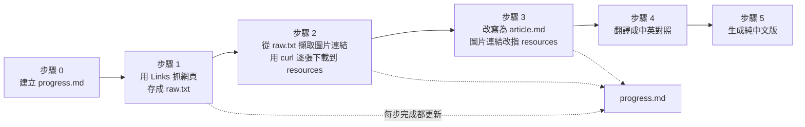
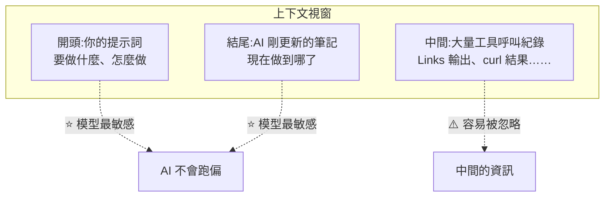

# 一段提示詞把 Gemini CLI 變成自動化 Agent:拆成輸入/輸出/過程,再讓 AI 記「工作筆記」

**主題分類:** 科技 / AI Agent 應用 — 提示詞工程、上下文工程實戰
**來源:** YouTube〈一段提示词 让Gemini CLI变成自动化Agent! 提示词工程〉(程序员老王,2025-09-04,約 12 分;**該片無字幕,逐字稿以 CPU faster-whisper 轉錄、非官方字幕**)
**一手素材核實:** [Gemini CLI 官方文件 — Custom commands](https://geminicli.com/docs/cli/custom-commands/)、Liu et al.〈[Lost in the Middle](https://arxiv.org/abs/2307.03172)〉(2023)
**整理日期:** 2026-10-02

> ⚠️ 作者在片中推廣自己的「知識星球」付費社群;本文只整理影片公開內容。
> ⏳ 這是 2025 年 9 月的影片;Gemini CLI 的功能已有更新,但**「拆解任務 + 工作筆記」這套方法不依賴特定工具**。

---

## TL;DR

1. ⭐ **成果:** 不寫一行程式碼,只用一段提示詞替 Gemini CLI 加一個 `/translate` 指令——給它一篇文章網址,它會**下載網頁與所有圖片 → 排版成 Markdown → 翻成中英對照與純中文兩版**,圖片連結都指向本地,**可完全離線閱讀**。
2. ⭐⭐ **核心心法:「把一件事情想清楚」**——拆成三要素:**輸入是什麼、輸出是什麼、過程是什麼**。「雖然我們不寫程式,但完全可以像程式設計師一樣思考。」
3. ⭐⭐ **消除不確定性:** 不同 agent 內建的網頁瀏覽差異很大(有的回傳完整 HTML、有的只給純文字,會漏掉圖片連結)⇒ **指定統一的工具**:用文字瀏覽器 **Links** 抓網頁、用 **curl** 下載圖片。
4. ⭐⭐⭐ **長任務的關鍵:讓 AI 記工作筆記(`progress.md`)**——任務清單、圖片下載進度、目前在做什麼;**每完成一步都更新**。
5. ⭐⭐ **為什麼有效:** Transformer 對上下文**開頭與結尾**最敏感。開頭是你的提示詞(要做什麼、怎麼做),結尾是 AI 自己剛更新的筆記(做到哪了)——**同時用上 AI 最敏銳的兩個位置**。

---

## 1. 從一句話到能用的提示詞:三次迭代

| 版本 | 提示詞 | 結果 |
|---|---|---|
| **v1:一句話** | 「把這篇文章翻成中文,存成 Markdown,下載裡面的圖片」 | 有翻譯,但**圖片下載失敗**,而且**時好時壞** |
| **v2:輸入 + 輸出** | 輸入:文章 URL;輸出:格式化原文、中英對照、純中文、所有圖片資源(**故意不寫過程**) | 三個版本都生成了,**圖片仍沒下載** |
| ⭐ **v3:輸入 + 輸出 + 過程** | 拆成明確的五個步驟,並指定工具 | ✅ 全部正確,圖片連結指向本地 |

> ⭐ 老王:「『我要五彩斑斕的黑』這種話,我們自己都理解不了,AI 同樣也理解不了。**只有邏輯才是最高效、最清晰的表達方式。**」

---

## 2. 過程的五個步驟(以及兩條「指定工具」的規則)



| 步驟 | 重點 |
|---|---|
| **1. 訪問網站** | ⚠️ 不同 agent 內建瀏覽功能差異很大 ⇒ **規定必須用 Links 命令列文字瀏覽器**抓網頁(輸出核心文字與連結,非常適合給 AI);**原始內容存成 `raw.txt` 方便除錯** |
| **2. 下載圖片** | 從 `raw.txt` 擷取所有圖片連結,**規定用 curl** 逐張下載到 `resources/` |
| **3. 改寫為 Markdown** | ⭐ 最後一條指令:**把 `article.md` 裡的圖片連結指向 `resources/`**——離線可用的關鍵 |
| **4–5. 翻譯** | 中英對照版、純中文版 |

> 老王對 Links 的評語:「純文字瀏覽器這種上古產物,本該進網路博物館;誰能想到它**只提取核心文字與連結**的簡陋,反而讓它在 AI 領域大有作為——**這大概就是老子說的無為而治吧**。」

---

## 3. ⭐⭐⭐ 讓 AI 有「長期記憶」:工作筆記

**問題:** 文章有 100 多張圖、或任務本身有二三十個步驟時,AI 還能從頭走到尾嗎?——「大概率不能。**執行的步驟越多,上下文裡的雜訊越多,AI 越容易忘記自己是誰、該幹什麼。**」

**解法(老王:「近乎標準答案」):讓 AI 學會記筆記。**

### 3.1 筆記長什麼樣

```markdown
# progress.md

## 目前任務
正在下載第 37 / 112 張圖片

## 任務清單
- [x] 步驟 1:抓取網頁
- [ ] 步驟 2:下載圖片
- [ ] 步驟 3:改寫為 Markdown
- [ ] 步驟 4:中英對照翻譯
- [ ] 步驟 5:純中文版

## 圖片下載進度
- [x] https://example.com/img/01.png
- [x] https://example.com/img/02.png
- [ ] https://example.com/img/03.png
```

### 3.2 三處修改

| 修改 | 內容 |
|---|---|
| **加一條總規則(放最上面)** | **每完成一步,都必須更新 `progress.md`** |
| **加步驟 0** | 依照範例格式**建立 `progress.md`**(把格式範例放在提示詞最後——這就是 **few-shot**:在提示詞裡舉例子) |
| **改造步驟 2** | 擷取連結後**先寫進筆記的「圖片下載進度」**;**每下載一張就更新一次狀態** |

### 3.3 ⭐⭐ 為什麼這招有效(不只是「看起來很酷」)



- agent 會維護與模型的對話歷史(上下文):**最開頭是提示詞**,之後每次工具呼叫的資訊都**追加到末尾**。
- 上下文太長,AI 就容易「犯暈」。
- ⭐ 因為規定「每步都更新筆記」,**筆記的最新狀態就穿插在每次工具呼叫之間**,永遠出現在上下文的**末尾**。
- ✅ 這與研究結果一致:Liu et al.〈Lost in the Middle〉(2023)發現,模型對**長上下文開頭與結尾**的資訊利用最好,**中間的資訊最容易被忽略**。

📎 同一思路的延伸:本庫 [[markdown-agent-memory]](用 Markdown 當 agent 記憶)、[[agit-version-control-for-agent-sessions]]。

---

## 4. 包成 Gemini CLI 指令(✅ 官方文件核實)

| 項目 | 說明 |
|---|---|
| **位置** | `~/.gemini/commands/`(全域)或專案內 `.gemini/commands/` |
| **格式** | **TOML** 檔,檔名就是指令名稱(例如 `translate.toml` → `/translate`);子資料夾會變成 `:` 命名空間 |
| **欄位** | 必填 `prompt`(送給模型的提示詞);可加 `description` |
| **參數** | 提示詞裡的 **`{{args}}`** 會被替換成使用者在指令後面輸入的文字(例如網址) |
| 其他 | 官方文件還支援 `!{...}` 執行 shell 並把輸出注入、`@{...}` 注入檔案 |

```toml
# ~/.gemini/commands/translate.toml
description = "下載文章與圖片,轉成 Markdown 並翻譯成中英對照與純中文"
prompt = """
總規則:每完成一步,都必須更新 progress.md。

輸入:{{args}}
輸出:article.md、article.zh-en.md、article.zh.md、resources/(所有圖片)

步驟 0:依下方範例格式建立 progress.md
步驟 1:用 `links -dump` 取得網頁內容,存成 raw.txt
步驟 2:從 raw.txt 擷取所有圖片連結,寫進 progress.md 的「圖片下載進度」;
        用 curl 逐張下載到 resources/,每下載一張就更新一次進度
步驟 3:改寫成 article.md,所有圖片連結改指向 resources/
步驟 4:翻譯成中英對照 article.zh-en.md
步驟 5:生成純中文 article.zh.md

progress.md 範例格式:
(略,見本文 §3.1)
"""
```

> ⭐ 老王強調:這套提示詞**不只適用 Gemini CLI**——只要工具能**讀寫本地檔案、執行命令**(例如 Claude Desktop、Cherry Studio),都能直接用。

---

## 5. 應用案例

### 案例一:把任何重複性的多步驟工作寫成指令

| 工作 | 輸入 | 輸出 | 過程要點 |
|---|---|---|---|
| 每週整理會議紀錄 | 錄音逐字稿路徑 | 摘要、待辦清單、決策紀錄 | 規定待辦格式「負責人|事項|期限」 |
| 下載論文並做摘要 | arXiv 網址 | PDF、摘要 Markdown、圖表 | 規定用 curl 下載 PDF,圖表另存 |
| 整理競品網頁 | 3–5 個網址 | 比較表 | 規定每個網址都先存 raw 檔,再比較 |

### 案例二:長任務必加的三件事

1. **總規則放最上面**:「每完成一步都更新 progress.md」。
2. **步驟 0 建筆記**,並用 few-shot 給格式範例。
3. **大量重複子任務**(下載 100 張圖、處理 50 個檔案)**逐項記錄**——中斷後可以從筆記接著做。

### 案例三:除錯時先看「原始輸入」

老王讓 agent 把抓到的原始網頁存成 `raw.txt`。**任務失敗時先打開 raw 檔**:圖片連結根本不在裡面?那是抓取工具的問題,不是提示詞的問題。

---

## 來源

- YouTube:[一段提示词 让Gemini CLI变成自动化Agent! 提示词工程](https://www.youtube.com/watch?v=YCswP_xmxu0)(程序员老王,2025-09-04)——**該片無字幕,逐字稿以 CPU faster-whisper 轉錄、非官方字幕**
- 官方文件:[Gemini CLI — Custom commands](https://geminicli.com/docs/cli/custom-commands/)
- 論文:[Lost in the Middle: How Language Models Use Long Contexts](https://arxiv.org/abs/2307.03172)(Liu et al.,2023)
- 工具:[Links 文字瀏覽器](http://links.twibright.com/)、[curl](https://curl.se/)

**Whisper 專有名詞還原對照:** JimmyNet / Jiminet / gmail.sli / GIMNES-Li → Gemini CLI;Cloud Desktop → Claude Desktop;Linx / Linux(指瀏覽器時) → Links;Crow / Curl → curl;肉.txt / Row.txt → raw.txt;Fuseout → few-shot;Argus 站位符 → `{{args}}` 佔位符。
