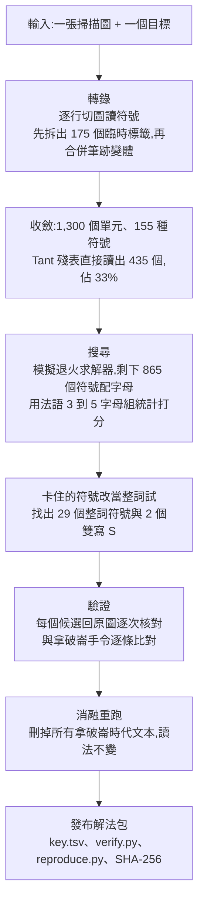

# GPT-6 Astra 解開 217 年的拿破崙密信:從一張模糊掃描圖到可重現的解法包(Why QQ)

**主題分類:** 科技 / AI Agent 應用 — 多模態長任務、跨學科研究自動化
**來源:** YouTube〈GPT-6解开217年未解拿破仑密信如何做到的?〉(Why QQ,2026-10-03,約 9.8 分;官方簡中字幕),細節已對照當事人 Carter Church 的復盤原文
**整理日期:** 2026-10-06

> 📌 立場:本片未見業配。核心事實來自當事人自述與 Cryptiana 維護者的認可;影片引用的社群瀏覽數未獨立核實。

---

## TL;DR

1. ⭐ **事件**:SentinelOne 的 AI 工程師 **Carter Church** 把一張 1969 年的模糊黑白掃描圖交給 **GPT-6 Astra**,模型約 **6 小時**完成轉錄、破譯與史料校驗,解開 1809 年拿破崙下令寫給**馬爾蒙將軍**的密碼信;✅ Cryptiana 未解密碼清單的維護者 **Tomokiyo** 已標記為已解。Church 本人只花了「幾個晚上」。
2. ⭐⭐ **難的不是數學**:同音替換密碼,數學難度有限(馬爾蒙 1811 年用的 150 條目密碼,英國軍官 Scovell 兩天就破了);卡住 217 年的是**跨學科的人力成本**——讀手寫體、編符號目錄、寫程式、懂 19 世紀法語與史料,樣樣都要、還得花幾週。
3. ⭐⭐⭐ **流程很像軟體工程**:原圖始終在回路裡,每個候選值都回原圖逐次核對;**刪掉所有拿破崙時代文本後從零重跑,得到同一個讀法**(排除背史料作弊);公開含 `verify.py`、`reproduce.py` 與 SHA-256 的**解法包**,任何人都能驗證。
4. ⭐ **內容**:開戰前兩週的兵力部署簡報,七路大軍與拿破崙 3 月 16 日手令逐條吻合;夾著一條「俄軍正在進軍」的**宣傳通稿**;還補上 1865 年官方《拿破崙一世書信集》被省略號吞掉的一句話;✅ 並把被標錯的年份從 1807 **更正為 1809**。

---

## 1. 這封信為什麼 217 年沒人讀懂

| 項目 | 內容(✅ 對照 Church 原文) |
|---|---|
| 來歷 | 1809 年 3 月,拿破崙要繼子歐仁(義大利副總督)給孤懸達爾馬提亞的馬爾蒙寄一封密碼信,講清各路法軍與盟軍位置 |
| 唯一完整圖像 | 1969 年法國《Revue historique des Armées》中 J. Vilcoq 文章的黑白掃描(由 Persée 數位化),**1,202 × 1,836 像素,每個符號約 19 像素**,還是手寫 |
| 已知線索 | 法國密碼史學者 Daniel Tant 整理的殘表:**33 個字母**對應的符號,整詞符號一欄全空 |
| 前一位嘗試者的結論 | 沒有可下手的東西,密文從未發表過 |
| 前提 | **沒有現成轉錄文本**——一般破譯的輸入是文字,這次輸入是一張圖 |

---

## 2. 破解流程

| 步驟 | 細節 |
|---|---|
| **轉錄** | 轉錄與密碼分析傳統上是兩門手藝、甚至兩種職業,這次跑在同一條流水線;**原圖始終在回路中**——任何符號的候選值都要回原圖跟它的每一次出現逐一核對 |
| **為什麼不能數頻率** | 同音替換:高頻字母有好幾個可互換的寫法;155 種符號裡約 70 個是憑空發明的記號,沒有對應的印刷字元 |
| **搜尋** | Astra 自己寫**模擬退火**求解器,以雨果、大仲馬與馬爾蒙回憶錄的法語統計打分;第 14 行的明文單字 `CONSEQUENT` 加上 Tant 的 33 個值作為初始錨點 |
| **整詞符號** | 有些符號放哪裡都會把法語弄壞 ⇒ 改當整詞試,結果通了:**29 個整詞符號**、另 2 個表示雙寫 S |
| **消融測試** | ✅ 把馬爾蒙回憶錄與所有拿破崙時代文本移除後從零重跑,**得到相同讀法**——堵死「模型靠背史料作弊」的質疑 |
| **發布** | ✅ 公開 `key.tsv`(155 個符號的密碼表)、`revised_tokens.txt`、`verify.py`(密碼表與密文逐一對照)、`reproduce.py`(離線重新生成讀法),附 SHA-256 |

> 影片:「拿數據回測假設,假設只在全部樣本上成立才保留——這是軟體發布的標準,被用在一道歷史題上。」

✅ **Church 自己標出的不確定處**:有五處用字不確定(如「陛下」或「皇帝」、地點措辭、*canailles* 單複數),但「沒有一處會改變這封信在說什麼」。

---

## 3. 解出來的內容

- **兵力簡報**:但澤公爵四萬巴伐利亞軍在慕尼黑與帕紹、波尼亞托夫斯基三萬波蘭人在維斯瓦河、達武八萬在拜羅伊特、馬塞納六萬在烏爾姆、烏迪諾四萬精銳在奧格斯堡;告訴馬爾蒙奧地利將在每個方向同時挨打。與拿破崙 3 月 16 日手令對照:**七路兵力,順序一致、數字一致**——這封密信就是那道命令的執行件。
- **一條宣傳**:信裡說「俄軍正在向奧地利進軍」。影片引史料:3 月 21 日拿破崙親自指示歐仁用盡辦法散布這個消息;三天後他寫信給駐彼得堡大使抱怨不知道俄軍在哪;俄軍實際 6 月 3 日才進場。⇒ **密碼鎖得住內容,鎖不住寫信人的動機**。
- **補上文獻缺口**:✅ 1865 年出版的《拿破崙一世書信集》中,3 月 16 日手令印成「une poignée de . . . .」;密信裡同一句完整寫著「quelques troupes ou **un rassemblement de canailles**」(幾股部隊或一群烏合之眾)——一份密碼文件反過來成了公開出版物的校勘本。
- **事後對照**:敵方部分幾乎全中(4 月 10 日奧軍越過因河,各路出發地與信中城鎮一一對應);友軍部分有水分(信中波蘭軍三萬,實際約一萬七,華沙很快失守)。1814 年正是馬爾蒙帶兵投敵促成拿破崙退位,法語因此多了動詞 *raguser*(背叛)。

---

## 4. 真正的結論:門檻是成本,不是難度

✅ Church 的原話:「**一個有耐心的專家在 1970 年就能解開這封信**」,但「**讀得懂它的人,都負擔不起那段時間**」。所有材料早已公開:殘表在網上,書信集 1865 年就印了,馬爾蒙回憶錄在古騰堡計畫免費下載。

影片給程式設計師的三個參照:
1. **單項技能的護城河在變淺**:轉錄、密碼分析、法語、19 世紀史,每一項比模型強的人都很多;能把四樣串成一條流水線的人極少——現在模型接管了流水線。
2. **值錢的能力在上移**:Church 全程做的是**定義目標、判斷輸出對不對、設計防作弊的重跑**,沒碰密碼學理論(呼應 [[vibe-coding-stack-model-agent-workflow]] 與 [[anthropic-html-work-pages]] 的「瓶頸從產出換成理解與驗證」)。
3. **每個領域都有一張「未解清單」**:大部分題目談不上難,缺的是願意投入三週的人;Tomokiyo 說他現在收到解法的速度快過來得及登記。

---

## 5. 應用案例

### 案例一:把「卡在人力成本」的老題目交給 agent

挑題標準:**材料已公開、方法已知、只是費工**。例如:
- 公司裡一份 10 年前的掃描版合約,需要整理成結構化條款表;
- 一批手寫實驗紀錄,需要轉錄並與資料庫數值逐筆比對;
- 舊系統沒有文件的二進位檔格式,需要從樣本反推欄位。

### 案例二:照 Church 的方式設計驗證,而不是只看結果

| Church 的做法 | 套到你的任務 |
|---|---|
| 每個候選值回原圖逐次核對 | 每個抽取欄位都附上原文位置,抽樣人工核對 |
| 消融重跑:拿掉可能「作弊」的資料再跑一次 | 拿掉模型可能背過的參考答案、換一份語料重跑,看結論是否不變 |
| 發布 `verify.py` + `reproduce.py` + 雜湊 | 交付時附驗證腳本與可重現步驟,讓審核者不必相信模型 |
| 標出不確定處並說明是否影響結論 | 報告裡列出低信心項目與其影響範圍 |

### 案例三:評估「AI 做到了 X」這類新聞

先問三個問題:材料是不是本來就公開?有沒有可獨立重跑的驗證?領域專家(這裡是 Tomokiyo)是否認可?三者都有,才是本案這種等級的證據。

---

## 6. 核實總表

| 類別 | 項目 |
|---|---|
| ✅ 已核實(Church 原文) | 掃描來源與解析度、1,300 單元 / 155 符號、Tant 33 字母覆蓋 435 單元(33%)、剩餘 865 單元、模擬退火與法語語料、29 個整詞符號 + 2 個雙寫 S、刪除拿破崙時代文本後讀法不變、解法包檔案與 SHA-256、約 6 小時模型時間與「幾個晚上」人力、1865 書信集的省略號與 *canailles* 完整句、年份由 1807 更正為 1809、「1970 年的專家就能解」、五處用字不確定 |
| ✅ 已核實(報導) | Church 為 SentinelOne AI 工程師;Cryptiana 維護者 Tomokiyo 已將其標為已解 |
| ⚠️ 未能核實 | 推文 500 多萬瀏覽與高讚回覆數據;拿破崙 3 月 21 日指示散布俄軍消息、致駐彼得堡大使信的細節(影片引史料,本次未查原件);馬爾蒙 1811 年密碼 150 條目與 Scovell 兩天破解 |

---

## 來源

- [YouTube:GPT-6解开217年未解拿破仑密信如何做到的?(Why QQ,2026-10-03)](https://www.youtube.com/watch?v=ejThzPk85K0)
- [Carter Church:Breaking the Marmont Cipher, 1809(當事人復盤原文)](https://carter.church/writeups/the-letter-to-marmont/)
- [Calcalist:SentinelOne AI researcher uses GPT-6 Astra to crack Napoleon cipher after 217 years](https://www.calcalistech.com/ctechnews/article/h1dthf69mg)
- [Cryptonomist:GPT-6 codebreaking AI cracks 217-year-old Napoleon cipher in six hours](https://en.cryptonomist.ch/2026/10/04/gpt-6-codebreaking-ai-decipher/)

📎 相關筆記:[[gpt-6-astra-token-efficiency-and-harness]]、[[anthropic-html-work-pages]]、[[vibe-coding-stack-model-agent-workflow]]、[[astra-vs-fable-find-bugs-vs-fix-bugs]]
