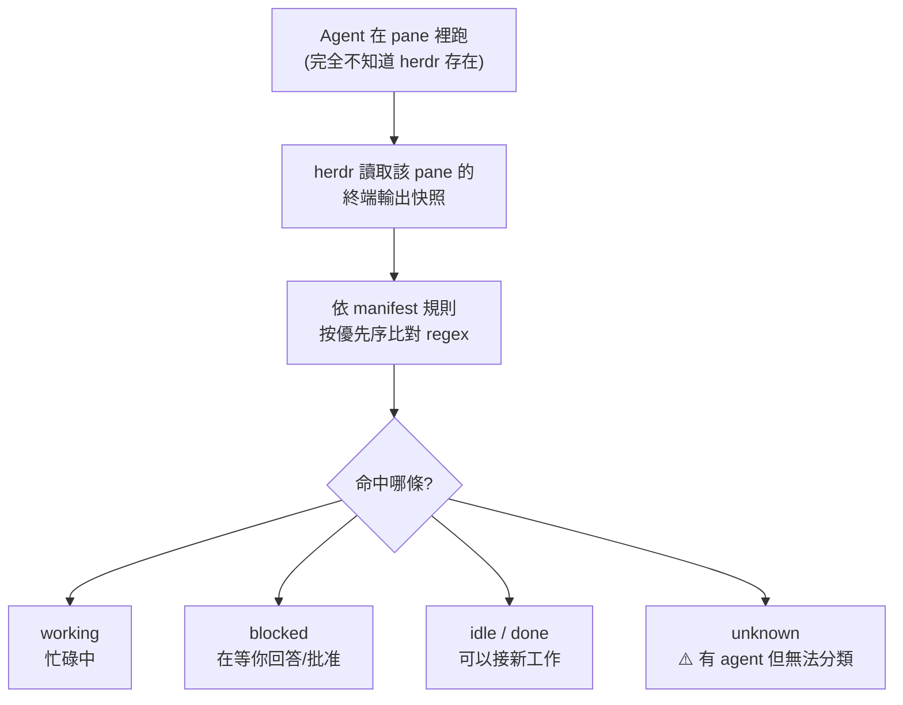
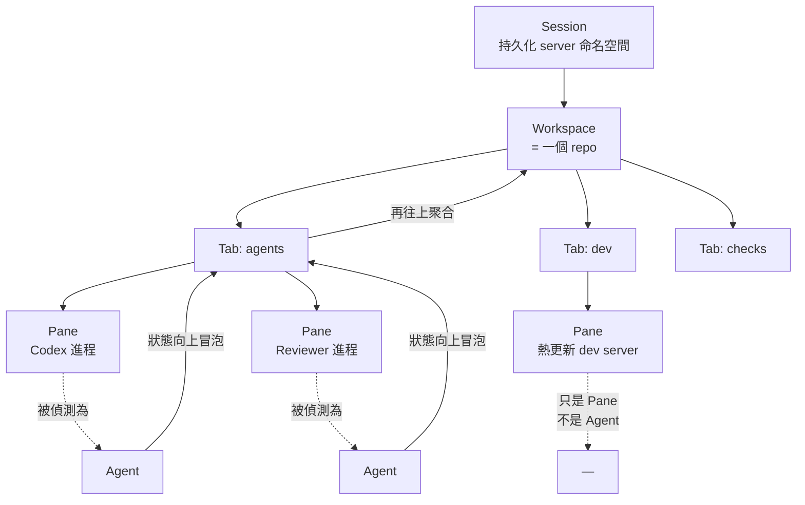

# herdr:讓 Agent 互相指揮的終端 runtime —— 用 Claude Code 做計畫、Codex 審核、便宜模型執行

> 整理自兩支影片:
> 1. YouTube 頻道 **AI隨風**〈AI超强终端herdr,让Agent互相通信,新手入门教程〉(2026-08-11,約 11.4 分鐘)
> 2. YouTube 頻道 **Why QQ**〈多Agent瓶颈是人类注意力,是时候使用 Herdr了〉(2026-08-26,約 9.4 分鐘,官方 zh-Hans 字幕)—— 見 **§八**,補上完整物件模型、持久化的三種語意與選型判準
>
> 依 CLAUDE.md 慣例,本文另**實地 clone 了 `herdrdev/herdr` 讀原始碼與官方文件核實**,並標出**三處與影片說法不同或影片沒講到的關鍵設計**。

> 📎 相關筆記:[[qm-yc-multiplayer-agent-harness]](YC 開源的多人 Agent harness)、[[model-routing-compute-allocation]](模型分工與算力配置)、[[agent-skill-three-layer-run-do-verify]](Skill 三層工程棧)

---

## 一句話總結

**herdr 不是「多 Agent 框架」,而是「你的 coding agent 跑在上面的終端 runtime」。它不包裝也不取代任何 agent——它擁有那些 agent 的終端,靠 regex 讀懂終端畫面來判斷每個 agent 是忙碌、卡住還是閒置,再把這個能力開放給 agent 自己調用。**

---

## 一、影片提出的問題:為什麼需要多 Agent 協作

開發一個功能的完整流程是**計畫 → 執行 → 驗收**。多數人從頭到尾用同一家的同一個模型跑完,影片指出三個問題:

| 問題 | 說明 |
|---|---|
| **成本** | 全程都用最強的模型做計畫、執行、驗收,成本非常高 |
| **能力** | 每家供應商的模型各有長短,全部交給同一個模型不夠嚴謹 |
| **工具綁定** | **每個模型供應商都在開發自己的 agent 工具、適配自己的模型**。想讓模型發揮最大能力,就得用它自己的官方工具 |

理想的分工是:


影片的說法很傳神:**把髒活、累活、苦活全部交給便宜的模型瘋狂去跑,再用高智力的強模型做最後關卡的驗收。** 這樣既嚴謹又省成本。

**但要落地就得開好幾個終端**——這邊 Codex、那邊 OpenCode、另一邊 Claude Code,然後**人肉輪流盯每一個 agent 跑到哪了**。

> 有沒有工具能自動協調?A 做完計畫通知 B 執行,B 執行完通知 C 驗收,C 驗收完再回報給主 agent 繼續下一步。
> **這就是 herdr 想解決的事。**

### ⚠️ 一個值得記錄的反問:為什麼不在一個工具裡路由模型就好?

影片自己提了這個問題,並給出他認為 herdr 有意思的地方:

> **因為每一款 agent 工具都是針對自己家的模型做過適配的。** Codex 配 GPT 系列最好,Claude Code 配 Claude 最好。**讓 agent 跟 agent 協調,才能同時發揮「工具 + 模型」的最大能力**,而不是只換模型卻用同一套不匹配的工具。

⚠️ 這個論點成立與否見仁見智——反方會說模型路由(見 [[model-routing-compute-allocation]])成本更低、複雜度更小,而「工具適配」的優勢難以量化。但**這確實是「多 agent」相對「單 agent 多模型」少數說得通的技術理由**,值得記下來。

---

## 二、herdr 到底是什麼(以下依原始碼核實)

專案自我定位就一句話:

> **the runtime your coding agents live on.**(你的 coding agent 跑在上面的 runtime)

| 項目 | 事實 |
|---|---|
| Repo | `herdrdev/herdr` |
| Star 數 | **27,488**(本文核實時) |
| 語言 / 授權 | **Rust 單一二進位,無 Electron** / Apache-2.0 |
| 安裝 | `curl -fsSL https://herdr.dev/install.sh \| sh`,或 `brew install herdr` |
| 啟動 | 在專案目錄下打 `herdr` |

### 架構:背景 server + 終端 client

**herdr 是一個常駐的背景 session server,終端跑在它裡面。**

- 關上筆電、斷網、重開機,**agent 繼續工作,session 會回來**
- 從任何終端重新 attach,或透過 SSH
- `ctrl+b q` 分離,再打 `herdr` 重新接上

**它不包裝也不取代 Claude Code / Codex / Cursor / OpenCode / Grok——它擁有它們的終端。**

---

## 三、⭐ 核心設計:agent 狀態是「看」出來的,不需要 agent 配合

這是全篇最值得記住的一點,**影片完全沒提到,但它是整個 agent-to-agent 能力的地基**。

herdr 怎麼知道某個 agent 現在是在忙、卡住等你回答、還是已經做完了?

**答案:靠 regex 掃終端畫面。**

`src/detect/manifests/` 底下有 **19 個 `.toml` 偵測清單**,每個 agent 一份:

```
amp / antigravity / claude / cline / codex / cursor / devin / droid /
gemini / github-copilot / grok / hermes / kilo / kimi / kiro / maki /
opencode / pi / qodercli
```

每份清單是一組**帶優先序的規則**,針對終端輸出的特定「區域」比對。以 `claude.toml` 為例,規則會去看:

| 區域 | 意思 |
|---|---|
| `osc_title` | 終端標題列(Claude Code 跑動時會在標題放 Braille 動畫字元) |
| `bottom_non_empty_lines(5)` | 畫面底部最後 5 行非空白行 |
| `after_last_horizontal_rule` | 最後一條水平分隔線之後的內容 |

每條規則標 `state = "working" / "blocked" / "unknown"` 與 `priority`,高優先序先命中。



> **這解釋了 herdr 為什麼能「讓不同 agent 互相通信」:它根本不需要任何協定。** 它不要求 agent 支援什麼 API、不要求廠商配合,**只要求「終端畫面長得認得出來」**。
> 這也是為什麼它能一口氣支援 19 種 agent——**適配成本是寫一份 regex 清單,不是談一份協議。**

### ⚠️ 但這也是它的脆弱點

`claude.toml` 開頭標著 `version = "2026.08.04.1"` 與 `updated_at`。**agent 只要改 UI,manifest 就得跟著改。** 這是典型的「靠外觀識別」的代價:適配快,但會壞在別人改版的那一天。

### ⚠️ 官方文件對狀態語意的三個誠實標註

讀 `skills/herdr/SKILL.md` 時最值得學的是它對**自己判斷能力的邊界**講得很清楚:

1. **`unknown` 明說「不代表完成」** —— 「有 agent 存在但 herdr 無法有信心地分類;**這不能證明它做完了**」。
2. **`idle` 與 `done` 是同一個底層狀態**,差別只在「這個 tab 有沒有在 UI 裡被看過」。`done` 是「沒被看見的背景工作完成後」的 idle。而 **CLI 讀取不算「看見」**,只有聚焦 tab 或用 focus 指令才算。
3. **`blocked` 的定義是「herdr 認出了一個批准或提問的 UI」** —— 它是視覺辨識的結果,不是 agent 主動回報的。

---

## 四、三個原語:Layout / Pane / Agent

官方文件把控制面切得很乾淨:

| 原語 | 職責 |
|---|---|
| **Layout**(workspace / tab / pane 拓撲) | 建立與組織「終端位置」 |
| **Pane** | 控制一個原始終端:跑指令、送輸入、讀輸出、等輸出 |
| **Agent** | 控制被辨識出的 coding agent,依名稱或 pane + 生命週期狀態 |

**關鍵規則:pane 不管裡面有沒有 agent 都存在。所以 `agent start` 需要一個「已經存在的可用 shell pane」,它永遠不會自己建立、分割或搬動 layout。**

- 一般的 shell、測試、伺服器、CI watcher → 用 **pane** 指令
- 需要 herdr 判斷「哪個 agent 在跑」或「它是 working / blocked / done」→ 用 **agent** 指令

ID 是不透明的穩定 handle:workspace `w1`、tab `w1:t1`、pane `w1:p1`。而 agent 名稱(如 `reviewer`)只是**當前佔用該 pane 的 agent 的別名**,agent 一離開就清空——**它不是永久重新命名 pane**。

---

## 五、實際怎麼跑起來(影片操作 + 官方 skill 對照)

### UI 佈局

- **左上角 space** = 你的專案(一個 repo / 任務 / 調查用一個 workspace)
- **中間的 `+`** = 新增 tab,像瀏覽器分頁一樣。可以一個 tab 開 Claude Code、另一個開 OMP
- **左下角** = 列出所有正在跑的 agent,**跑動中的會有狀態圖示**

影片講到這裡說:「你是不是覺得不過如此?」——**接下來才是重點。**

### ⭐ 重點:安裝它自帶的 Skill

> **一句話:用 Agent 來操作你的 herdr。**

裝了這個 skill 之後,agent 可以自己建立 workspace、開 tab、啟動別的 agent、以及 **agent 與 agent 之間的通信**。

⚠️ 這份 `SKILL.md` 的 description 寫得非常克制,值得單獨拿出來看:

> 「**只在使用者明確提到 Herdr 時使用。不要僅僅因為某個任務可能受益於背景終端、委派或平行工作就使用它。** 需要 `HERDR_ENV=1`。」

而且 skill 內文第一步就是**驗證自己確實跑在 herdr 管理的 pane 裡**:

```bash
test "${HERDR_ENV:-}" = 1
```

檢查失敗就直說「我不在 herdr 裡」並停止——**不准從 herdr 外面去操作使用者聚焦中的 session。**

> 對照 [[agent-skill-three-layer-run-do-verify]] 的三層模型:**這是「跑」這一層的自我檢查寫進 skill 的範例。** 大多數 skill 假設環境就緒,這一份先驗證再動手。

### 典型指令流(取自官方 skill)

```bash
# 1. 在當前 pane 旁邊分出一個 pane,保留 cwd,不搶走使用者焦點
herdr pane split --current --direction right --cwd "$PWD" --no-focus
#    → 從 .result.pane.pane_id 讀出新 pane 的 ID

# 2. 在那個 pane 啟動一個具名 agent
herdr agent start reviewer --kind codex --pane <pane-id>

# 3. 送出提示詞並等它跑到一個穩定狀態
herdr agent prompt reviewer "Review the current diff and report only actionable findings." \
  --wait --timeout 120000

# 4. 讀結果
herdr agent read reviewer --source recent-unwrapped --lines 120
```

幾個設計細節:

- **`agent prompt` 是原子操作**:同時送出文字與編碼過的 Enter,並尊重該 pane 當下的 bracketed-paste 模式。
- **`agent start` 直到 herdr 偵測到預期的 agent 已就緒才回傳**,預設 30 秒逾時。
- **`--wait` 等的是「第一個穩定的 idle / done / blocked」**,而不是某一輪對話的結束。
- **防呆:** 從非工作狀態送出的提示詞,若 5 秒內沒有觀察到生命週期變化,herdr 回 `agent_prompt_stalled` 而不是無限等下去。

### 影片實測的完整流程

影片示範的是:**Claude Code 做計畫 → Codex 審核 → OMP(DeepSeek)執行。**

實際觀察到的行為:

1. Claude Code 切到 plan 模式,對「手機號驗證登入功能」做出計畫
2. **它自己呼叫 herdr skill**,先列出當前 workspace 有哪些 agent、檢查有沒有 Codex,沒有就開一個新 pane
3. 右邊開出 Codex 面板,**還自己取了名字叫「計畫審核」**
4. Claude Code 把計畫內容當提示詞發過去,Codex 依預設的五個維度審核,提出 **8 個問題**
5. Claude Code 收到後修訂,再發回 Codex ——**兩者來回優化了 7 輪**,計畫才被驗收通過
6. 通過後,把計畫檔發給新啟動的 OMP(DeepSeek)去執行

**等待期間的行為值得注意**:因為審核時間長,Claude Code 那邊「暫停了,但有一個背景任務在跑,一直等它的結果」。影片的形容是:**任務分好、編排好,每個 agent 該做什麼講清楚,剩下的調度就不用管了。**

⚠️ 但注意第 5 點:**7 輪來回**。這是真實成本——多 agent 協作省下的模型費用,有一部分會被「協商回合數」吃掉。影片自己也說,實際專案裡**審核規則要寫得詳細一點**,不要像 demo 那樣直接丟過去讓模型用預設維度審。

---

## 六、⚠️ 三處需要標注的地方

### ① 「獲得 YC 資金支持」未能核實

影片開頭說「作者這款軟體還獲得了 YC 的資金支持」。**但 repo 的 README(英文與簡中版)、官網 docs、SPONSORS.md 中都沒有任何 Y Combinator 字樣。** 本文無法核實這個說法,列出供參考。

(順帶一提,本倉庫另一篇 [[qm-yc-multiplayer-agent-harness]] 的 `qm` 才是明確的 YC 專案,兩者容易混淆。)

### ② Star 數

影片說「將近 30K」,核實當時是 **27,488**。方向正確,取整偏樂觀。

### ③ 「Agent 互相通信」的精確說法

影片的表述容易讓人以為 agent 之間有某種訊息協定。**實際上沒有。**

真正發生的是:

```
Agent A(裝了 herdr skill)
   → 呼叫 herdr CLI / socket API
   → herdr 開 pane、啟動 Agent B、把文字打進 B 的終端
   → herdr 用 regex 盯著 B 的畫面判斷它做完沒
   → 把 B 畫面上的輸出讀回來給 A
```

**Agent B 從頭到尾不知道 herdr 存在,也不知道 A 存在。** 它以為是人在跟它打字。

> 這個區別很重要:**它意味著任何 CLI agent 都能被納入,不需要對方支援什麼;但也意味著整條鏈路的可靠度,取決於「畫面辨識」的準確度。**

---

## 七、原始碼裡另外三個誠實標註

### ① alternate screen 的資料會永久遺失

官方文件明說:如果加大 `--lines` 也讀不到更多完整回應,**那個 pane 大概是在終端的 alternate screen 上跑 agent**。離開 alternate screen 的行**不會進入 herdr 的 scrollback,再大的行數也救不回來**。

給出的 fallback 是:**請 agent 把完整回應寫成 Markdown 到暫存目錄,只回覆檔案路徑,然後直接讀檔。** 並強調這只能當退路,**不要在一開始的提示詞裡就要求輸出檔案**。

> 這是「驗收要考慮讀取通道本身的限制」的好例子——你以為在讀 agent 的輸出,其實在讀終端的殘影。

### ② plugin 不被審查也不被沙箱

herdr 有一個 plugin 市集,而官方文件對安全講得毫不含糊:

> plugin 就是在你機器上跑的普通程式碼。它的建置與執行指令**以你的身分執行、繼承你的環境、可以呼叫完整的 herdr CLI**。
> **herdr 驗證 manifest、也替每個 plugin 保留獨立的設定與狀態目錄,但它不審查、也不沙箱 plugin 程式碼。**

而且設計上就是刻意的:**「沒有獨立的 plugin SDK 或受限指令集。整個 herdr CLI 就是 plugin API。」**

> 這與 [[agent-skill-three-layer-run-do-verify]] 的結論完全一致:**這類擴充就是供應鏈輸入。** 官方自己建議:只從信任的作者安裝、安裝前先看過 `herdr-plugin.toml` 與它會跑的腳本、用 `--ref` 釘住版本。

### ③ Skill 裡的協作安全守則

`SKILL.md` 最後一節直接列出幾條硬規則,很適合抄進任何多 agent 系統:

- 背景工作一律用 `--no-focus`,除非使用者要求切換上下文
- 用 `--current`、明確的 pane ID、或唯一的 agent 名稱。**不要依賴別的 client 聚焦中的 pane**
- **從 JSON 回應解析 ID,不要從側邊欄順序或範例推導**
- **不要關閉不是你建立的** workspace / tab / pane / session
- **永遠不要 kill 主 herdr 行程**;需要隔離實驗就開具名的測試 session

---

## 八、⭐ 完整物件模型、持久化的三種語意與選型判準(2026-09-04 增補,來源:Why QQ)

前七節從**原始碼**切入,講的是 herdr「怎麼做到」。
這一節補的是**使用者視角的心智模型與選型判準** —— 什麼時候該用、什麼時候別折騰。

### 8.1 問題的重新表述:被爆掉的不是機器,是人的注意力

> 「寫程式最廉價的擴容資源就是 Agent。開一個 Codex 改頁面、再起一個做 Code Review,
> 旁邊還掛著開發和測試服務。**帳面吞吐量確實拉滿,但人的注意力先『爆了顯存』。**」

具體的痛點很好認:你得切著終端輪流查崗 —— 誰還在跑?誰卡了授權?誰早就跑完了?
**視窗一過十個,看名字全成了擺設。**

> ⭐ 真正被摧毀的不是時間,是**思路的連續性**。
> 單次切過去掃一眼只要幾秒,但**累加起來極度消耗心智**。
> **herdr 要砍掉的就是這筆隱形的調度開銷。**

### 8.2 ⭐⭐ 五層物件模型(§四只講了三個原語,這裡補齊)

| 層 | 對應什麼 | 實務建議 |
|---|---|---|
| **Session** | 持久化的 server 命名空間,管整套 runtime | 日常一個預設 Session 就夠;**要做硬隔離才建具名的** |
| **Workspace** | 一個程式碼倉庫 / 一個任務 | 一個活躍倉庫配一個獨立 Workspace |
| **Tab** | 專案裡的特定視圖(像瀏覽器分頁) | 按職責切:`agents` / `dev` / `checks` / `deploy` |
| **Pane** | 真實的偽終端(PTY),可跑任意命令 | 測試腳本、開發伺服器都只是 Pane |
| **Agent** | Pane 中**被辨識出來**的編碼進程 | Codex **既是 Pane 也是 Agent** —— 前者管字元流,後者管生命週期 |



> ⭐⭐ **狀態會一路向上冒泡到 Tab 與 Workspace。**
> 就算你把某個 Workspace 藏在後台,只要裡面有 Agent 阻塞,**Workspace 層級也會亮紅燈**。
> 這才是設計重點:**讓人的注意力跟著事件走,而不是每隔幾分鐘去當一次賽博保安。**

### 8.3 ⚠️⚠️ 「持續運行」這四個字最容易誤導人

C/S 架構下,**server 才是狀態的唯一真神**。必須分清三種完全不同的持久化:

| 你以為會留下的 | 客戶端 Detach(正常關閉) | **Server 停止** |
|---|---|---|
| **進程**(Agent / 測試 / dev server) | ✅ 照跑不誤 | ❌ **全部陪葬,回不來** |
| **佈局**(目錄、Pane 配置、焦點) | ✅ | ✅ 下次啟動會恢復 |
| **對話**(Agent 的 session) | ✅ | ⭐ 官方整合能存**原生 Session ID** 幫你接回對話 |

> ⚠️ **關鍵的不對稱:原生 Session ID 能「接回對話」,但它沒辦法把你的建置進程「穢土轉生」。**
> 實驗性的 Pane History 也只是**存螢幕文字的緩衝**,不是進程快照。
>
> 工程上要清醒:**進程、佈局、對話 —— 這三種持久化是三件不同的事。**

另外,Detach 時關掉的只是客戶端;**多個客戶端可以同時連進同一個 Session**。

### 8.4 ⚠️ Workspace 只管邏輯組織,不管檔案隔離

這是最容易踩的一條(§六的安全債之外,再補一條**正確性**的坑):

> **兩個 Pane 只要指著同一個目錄,照樣會讀寫衝突。**
> Workspace 給你的是側邊欄上的分組,**不是檔案系統的隔離**。

**做法:** 遇到大需求就切分支或上 **Git Worktree**;
Agent 之間的交接**老老實實走 commit 與 patch**。

> ⭐ 一句話定位:**herdr 提供的是容器,Git 管的是紀錄,而最終驗收的是你。**

### 8.5 ⭐⭐ CLI 才是真正的控制面(三條硬性紀律)

影片這段的工程價值最高。自動化**必須**走 Unix socket 的 JSON API:

| ❌ 錯誤做法 | ✅ 正確做法 |
|---|---|
| 猜新開的 Pane 是編號幾 | **從 JSON 回應讀出 `pane_id` / `workspace_id` 等公開 ID 再操作** |
| 拿「當前焦點」盲發命令 | 明確指定目標 ID |
| 腳本裡硬寫 `sleep 30` | **等語義狀態**:Agent 用 `agent wait`;普通腳本用 `pane wait-output` 抓關鍵字 |

> ⚠️ 為什麼不能用 `sleep`:**機器負載稍微一抖,靠時間猜狀態的流水線分分鐘崩盤。**
> 這也是 herdr 相對 tmux 的核心增益 —— tmux 只有「有沒有輸出」,herdr 有**生命週期語義**。

有了這個,你就能寫外部協調器:動態拉一個 reviewer、分發限定任務,
然後**等 `idle` / `done` / `blocked` 這種明確信號**。

📌 補充(核實自官方 CLI 文件,影片提到但沒展開):
- `herdr agent explain <target> [--json|--verbose]` —— **查它是靠哪條偵測規則命中的**,遇到誤判時很有用。
- `pane wait-output`、`agent wait`、`agent prompt --wait` —— **省略 `--timeout` 會無限等待**,腳本裡務必自己設上限。

### 8.6 邊界感:它刻意不做的事

> 「整個程式就一個 **Rust 二進位檔**,不搞強制帳號、沒有雲端面板、更沒有遙測。
> 這種邊界感克制得恰到好處 —— **它沒妄想一口吞下你的整套開發工作流。**」

生態位很清楚:

| 工具 | 管什麼 |
|---|---|
| tmux / Zellij | 會話與佈局 |
| 圖形化平台 | 審批流與環境隔離 |
| **herdr** | **中間這層:給終端補上 Agent 狀態感知、CLI 控制與本地 API** |

**它給不了你的**(影片誠實列出):
- ❌ 全域共享記憶 —— 多 Agent 之間還是得靠檔案與 Git 傳上下文
- ❌ 產品級的任務依賴圖、組織級審批流、完整事件追蹤
- ❌ 併發一上去,你的 CI 與發布佇列照樣塞車
- ⚠️ **狀態偵測該誤判還是會誤判** —— 面板能降噪,替不了你劃定任務邊界

### 8.7 遠端與窄螢幕

- **遠端開發直接走原生 SSH**:程式碼與 herdr server 待在遠端。**SSH 斷了後台照跑**,連回去 Pane 還在原位。
- **窄螢幕有適配**:手機終端連上去應急沒問題。
  > 講者自己也說「沒人會瞎到在手機上 review 大段 diff」,但**點個確認、看眼部署結果是真香**。
- 本地跑一個 herdr 當瘦客戶端連過去也行,**本地剪貼簿的圖片能直接傳進遠端會話**。

### 8.8 ⭐⭐⭐ 選型判準:什麼時候「別折騰」

這段值得單獨記,因為它敢說「不要用」:

| 你的情況 | 建議 |
|---|---|
| 日常就開**一個 Shell** 單打獨鬥 | ❌ **別折騰,現有終端絕對夠用** |
| 活在伺服器上、早就掛好 tmux,只為斷線重連 | ❌ **用不上換工具** |
| 開始跑**兩隻 Agent + 一個長耗時任務** | ⚠️ **狀態管理的陣痛已經開始** |
| 要同時拉多隻 Agent、還得留 Pane 看測試盯服務保遠端,並且想寫腳本把它們全盤控死 | ✅ **值得試** |

> ⭐ 影片的收尾判斷,與本筆記 §一的問題意識完全一致:
> **「多 Agent 時代,程式設計的瓶頸必然從『生成能力』轉移到『調度品質』。」**

### 8.9 應用案例:一個會場陣型(可直接照抄)

```text
Workspace: my-repo
├── Tab: agents
│   ├── Pane: Builder   (Codex,可寫)
│   └── Pane: Reviewer  (Claude Code,鎖成唯讀)
├── Tab: dev      → Pane: 熱更新開發伺服器
├── Tab: checks   → Pane: 編譯 + 單元測試
└── Tab: deploy   → Pane: 盯發布流
```

運作方式:Builder 改完 → Reviewer 直接接手看 diff →
**Reviewer 拋出 `blocked` 就代表碰到系統邊界,這時人再介入拍板**。乾等純屬浪費算力。

⚠️ **兩條紀律:**
1. **審核任務必須嚴格限制檔案範圍、測試腳本與寫入權限** —— 否則出事鍋算誰的?
2. **別強迫症發作把什麼進程都塞給 Agent 管。**
   基礎服務、測試、日誌最好獨立運行 ——
   **Agent 跑完關掉了,開發環境還得留著除錯。**

> ⭐ 一句實務心得:**一套穩固的基礎目錄結構,比你背幾十個花俏的快捷鍵管用得多。**

---

## 應用案例

### 案例 1|最小可用的三段式流水線

不必一開始就搞複雜編排。從「規劃 / 執行」兩段開始:

```bash
# 在你的主 agent(裝了 herdr skill)裡直接說:
「用 herdr 在右邊開一個 codex,名字叫 reviewer,
 把我剛才的計畫發給它審核,審核維度是:
 ① 有沒有漏掉錯誤處理 ② 有沒有破壞既有 API
 ③ 測試涵蓋是否足夠 ④ 有沒有安全風險 ⑤ 是否過度設計。
 只回報可行動的問題,不要客套話。
 拿到結果後貼回來給我。」
```

⚠️ **關鍵在「審核維度」要自己寫。** 影片示範時直接丟過去讓模型用預設維度,他自己也說了:實際專案應該把公司或個人的審核要求寫清楚。**否則你只是讓另一個模型用它的直覺重講一遍。**

### 案例 2|把「協商回合數」當成成本項來管

影片實測是 **7 輪來回**才通過審核。多 agent 的省錢邏輯是「便宜模型幹苦活」,但如果強模型之間來回協商 7 輪,那部分成本是實打實的。

實務上建議在提示詞裡加上界限:

```
最多來回 3 輪。第 3 輪仍有分歧時,列出「已達成共識的部分」與
「仍有分歧的部分」,標記後者為待人工裁決,不要繼續協商。
```

> 這其實是 [[model-routing-compute-allocation]] 那條原則的延伸:**能驗收才能交給便宜模型;而「驗收本身」也要有預算上限。**

### 案例 3|拿 herdr 的偵測機制反推「你的 agent 好不好被監控」

herdr 的 manifest 揭示了一件事:**一個 CLI agent 是否容易被自動化編排,取決於它的終端 UI 是否有穩定、可辨識的狀態訊號。**

如果你在寫自己的 CLI agent 工具,想被這類 runtime 支援,實務上該做的是:

- 在**終端標題(OSC title)**放狀態(這是最穩定的區域,不會被畫面捲動影響)
- 忙碌 / 等待輸入 / 完成三種狀態,**在畫面上要有固定位置的固定字樣**
- 不要頻繁改動這些字樣

反過來,如果你在選型:**看看 `src/detect/manifests/` 有沒有你要用的 agent,以及那份 manifest 的 `updated_at` 有多新。** 太舊代表偵測可能已經對不上該 agent 的新版 UI。

### 案例 4|什麼時候**不該**用它

herdr 自己的 skill description 就寫得很保守:「**不要僅僅因為某個任務可能受益於背景終端、委派或平行工作就使用它。**」值得照做:

| 情境 | 建議 |
|---|---|
| 單一任務、一個模型就能完成 | **不要用**。多開一個 agent 就多一份協調成本與失敗面 |
| 只是想跑背景指令 | 用一般的 pane 指令或 `&` 就好,不需要 agent 層 |
| 需要跨模型的**獨立意見**(審核、對抗式檢查) | ✅ 這才是它的甜蜜點 |
| 需要長時間背景跑、關筆電也要繼續 | ✅ 這是 herdr 的 server 架構在解的問題 |
| 生產環境自動化、需要可審計 | ⚠️ 謹慎——狀態判定是視覺辨識,`unknown` 明說不代表完成 |

### 案例 5|對照本倉庫的 cron 流程

本倉庫的每日 cron(GitHub Weekly / Gary Chen / gooaye / 美投君)本質上就是一組**串行的單 agent 任務**,而且已經跑得穩定。要不要改成多 agent?

**答案是不要**,理由正好對應上表:

- 每個 cron 任務**只有一條路徑**(抓取 → 去重 → 轉錄 → 寫筆記 → commit),沒有需要獨立意見的環節
- 真正的瓶頸是 **Whisper 的 CPU 時間**,不是模型的判斷力——多開 agent 不會變快,只會搶 CPU(cron prompt 裡本來就寫了「多支影片用單一背景進程串跑,避免多進程 CPU 競爭」)

**但有一個環節值得借用它的想法**:筆記寫完後的「驗收」——檢查 wiki 連結是否存在、README badge 數字是否正確、有沒有「來源」區塊。這正是可以交給一個獨立、便宜的檢查者做的事,**而且它不需要 herdr,一支確定性的 lint 腳本就夠了**(見 [[agent-skill-three-layer-run-do-verify]] 的「驗」層)。

---

## 重點回顧(TL;DR)

1. **herdr 不是多 agent 框架,是終端 runtime。** 它不包裝也不取代 Claude Code / Codex / Cursor——**它擁有它們的終端**。Rust 單一二進位,Apache-2.0,27.5K stars。
2. **背景 server + 終端 client 架構**:關筆電、斷網、重開機,agent 繼續跑;從任何終端或 SSH 重新 attach。
3. **⭐ agent 狀態是用 regex「看」出來的。** `src/detect/manifests/` 有 19 份 `.toml`,針對終端標題、畫面底部若干行、最後一條分隔線之後等區域比對,判定 `working` / `blocked` / `idle` / `done` / `unknown`。
4. **這就是它能支援 19 種 agent 的原因**:適配成本是寫一份 regex 清單,**不需要任何一方支援協定**。代價是——對方改 UI 就會壞。
5. **三個原語切得很乾淨**:Layout 管位置、Pane 管原始終端、Agent 管被辨識出的 agent 與其生命週期。`agent start` 需要既有的 shell pane,**永遠不會自己動 layout**。
6. **「Agent 互相通信」的精確說法**:A 呼叫 herdr CLI → herdr 開 pane、啟動 B、把文字打進 B 的終端、用 regex 盯 B 的畫面、把輸出讀回給 A。**B 全程不知道 herdr 與 A 的存在。**
7. **官方對自己判斷力的邊界很誠實**:`unknown` **明說不代表完成**;`idle`/`done` 只差在「有沒有被看見」而**CLI 讀取不算看見**;alternate screen 捲走的行**永久讀不回來**(有寫檔的 fallback)。
8. **它自帶的 skill 第一步是驗證 `HERDR_ENV=1`**,不在 herdr 裡就直說並停止——「跑」這一層的自我檢查寫進 skill 的好範例。而其 description 明白寫著**不要因為「可能受益於平行工作」就啟用**。
9. **plugin 明說不被審查也不被沙箱**,「整個 herdr CLI 就是 plugin API」。官方建議:只裝信任的來源、先看 manifest 與腳本、用 `--ref` 釘版本。
10. **影片實測 Claude Code ↔ Codex 來回 7 輪**才通過計畫審核。⚠️ **協商回合數是真實成本**,而且審核維度必須自己寫,否則只是換個模型憑直覺重講一遍。
11. **⚠️ 影片說「獲 YC 資金支持」,但 README、官網 docs、SPONSORS.md 均無 YC 字樣,本文無法核實。** Star 數影片說「近 30K」,核實時為 27,488。
12. **多 agent 相對「單 agent 多模型路由」少數說得通的理由**:每款 agent 工具都對自家模型做過適配,agent 間協作能同時吃到「工具 + 模型」的匹配紅利。⚠️ 但這個優勢難以量化,而路由的複雜度明顯更低。

---

## 來源

- [AI超强终端herdr,让Agent互相通信,新手入门教程 — AI隨風](https://www.youtube.com/watch?v=3ZVWhFI5bpw)(2026-08-11,約 11.4 分鐘)
- [多Agent瓶颈是人类注意力,是时候使用 Herdr了 — Why QQ](https://www.youtube.com/watch?v=LRJV5lcsnfA)(2026-08-26,約 9.4 分鐘,官方 zh-Hans 字幕;§八 來源)
- [CLI reference — herdr 官方文件](https://herdr.dev/docs/cli-reference/)(§8.5 的 `agent explain` / `pane wait-output` 核實來源)
- [Concepts — herdr 官方文件](https://herdr.dev/docs/concepts/)(§8.2 五層物件模型與狀態聚合的核實來源)
- [Agent automation — herdr 官方文件](https://herdr.dev/docs/agent-automation/)、[Socket API — herdr 官方文件](https://herdr.dev/docs/socket-api/)
- [herdrdev/herdr](https://github.com/herdrdev/herdr) —— 已 clone 核實:`README.md` / `README.zh-CN.md`、`skills/herdr/SKILL.md`、`src/detect/manifests/`(19 份偵測清單)、`docs/next/website/src/content/docs/` 下的 `agent-automation.mdx` / `concepts.mdx` / `plugins.mdx` / `how-to-work.mdx`
- [herdr 官方文件](https://herdr.dev/docs/)
- 本倉庫相關筆記:[[qm-yc-multiplayer-agent-harness]]、[[model-routing-compute-allocation]]、[[agent-skill-three-layer-run-do-verify]]

> 該片無字幕,逐字稿以 CPU 版 faster-whisper(small / int8 / zh)轉錄取得,**非官方字幕**,可能有少量聽寫誤差。文中專有名詞已對照原始碼校正(轉錄中的「Header / 黑的 / Hider」皆為 **herdr**、「克拉克斯 / Colors / Koloss」為 **Codex**、「Cloud Code / 克拉克羅」為 **Claude Code**、「1P / YMP / Omp」為 **OMP**、「Feeble 5」為 **Opus 5**)。
> Star 數與原始碼內容以本文整理時的 main 分支為準,可能隨版本變動。
