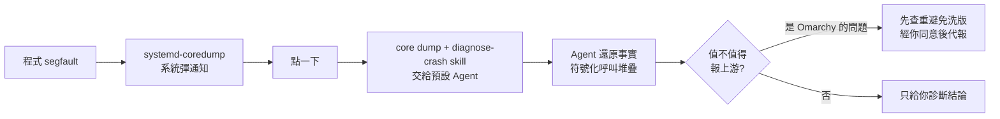

# Omarchy 4「Quattro」:當 Agent 從外掛升格成作業系統的一等公民

**主題分類:** AI Agent / 應用 —— Agent 入口、可觀測性與權限邊界的系統層設計
**來源影片:** YouTube〈Omarchy 4:下一个IDE,可能是一个操作系统〉(Why QQ / 為什麼叫 QQ,2026-09-03,約 8.9 分鐘,**官方 zh-Hans 字幕**)
**整理日期:** 2026-09-04

> 📎 相關筆記:[[herdr-terminal-runtime-agent-to-agent]](Omarchy 用來追蹤 Agent 狀態的 Rust 多工器)、
> [[ai-operating-system-aios]](把 Agent 當 OS 抽象層的另一條路線)、
> [[token-saving-three-moves-context-control]](本文 §3 的用量面板要解的就是這個問題)

---

## 0. 一句話總結

> **Agent 不缺能力,缺的是「預設入口」。**
> Omarchy 4 把九個 AI 編程 Agent 接進系統層,給它們**快捷鍵、頂欄用量面板、崩潰診斷權限**——
> 這些待遇以前只有瀏覽器和輸入法有。

值得注意的不是「發行版預裝了幾個 CLI 工具」(Linux 幹了幾十年),
而是**Agent 在這個系統裡拿到了預設位、專屬快捷鍵、常駐監控與可回滾的系統改寫權**。

---

## 1. 先講清楚這是什麼

| 項目 | 內容 |
|---|---|
| **專案** | Omarchy —— DHH(Ruby on Rails 作者、37signals 創辦人)基於 **Arch Linux + Hyprland** 的桌面系統 |
| **版本** | **v4.0.0「Quattro」,2026-08-14 發布**(名字致敬 Audi 四驅拉力車);v4.0.1(08-25)、v4.0.2(08-31)為安全性快速跟進 |
| **最大改動** | 整個桌面外殼用 **Quickshell 重寫**:狀態列、啟動器、選單、通知、鎖屏收進**單一常駐進程**(< 300 MB),Waybar / Walker / Mako 全數退場 |
| **對工程師最relevant的** | **九個 AI 編程 Agent 被預接進系統層** |

> ⚠️ **時間點的小修正:** 影片(09-03)用「刚发布」描述,但 **v4.0.0 實際是 08-14 發布**,
> 距影片已近三週。比較可能的觸發點是 08-31 的 v4.0.2。引用發布時間時請以 GitHub releases 為準。

### 順帶提一個容易被跳過、但很重要的地基改動

Omarchy 的內部檔案**從 git repo 改成標準 Arch 系統套件**:更新走 `pacman`,
系統檔從 `/etc` 與 `/usr/share/omarchy` 下發。

> ⭐ 好處很實際:**你自己的修改與官方更新可以安全分離,升級不再是一場賭博。**
> 這件事看起來瑣碎,但**它是上層 Agent 設計能站得住的前提**——
> 你敢讓 Agent 改系統設定,前提是「改砸了能一鍵回原廠」。

其他:ISO 瘦身超過 1 GB(壓到 6 GB 以內)、Hyprland 設定全面轉 Lua(可用迴圈與條件)、
雙系統安裝(可與 Windows 共存 + LUKS)、出廠重置(還原 root 但**保留 `/home` 與 `~/.config`**)。

---

## 2. 九個 Agent:懶載入 + 一個預設位

```text
Claude Code · OpenAI Codex · OpenCode · Gemini CLI · GitHub Copilot CLI
Crush · Grok CLI · Pi · Oh My Pi
```

實作其實很樸素:這些命令都是 `~/.local/bin` 底下的小腳本,由 **mise** 統一管理。

- **懶載入:** 你第一次敲 `claude`,它才現場下載安裝。不裝就不佔空間,裝了會跟著 `omarchy update` 一起升級。
- **可擴充:** 想加新的,一條 `omarchy-mise-install` 用同樣方式接進來。
- **喚起:** `Super + Shift + Ctrl + A` 一鍵叫出**預設 Agent**;嫌長的話終端敲一個字母 `a`。
- **直接派活:** `omarchy agent prompt "<一句話>"` —— **全程自動批准,不停下來問你**。
  官方手冊自己提醒:「做好它真的會動手的準備。」
- **工作目錄:** 從家目錄啟動時,Agent 會自動進 `~/Work`,這樣**信任設定才留得住**。

> ⭐⭐ 這裡真正新的東西是**「預設 Agent」這個概念本身**。
> 作業系統以前只有預設瀏覽器、預設終端、預設輸入法;現在多了一格。
> **懶載入這個選擇也很聰明:系統不替你預設立場,只把路修到每家 Agent 的門口。**

---

## 3. 頂欄用量面板:把 Agent 消耗當成系統資源

系統偵測到你在用 AI 編程時,頂欄會長出一個 `agents` 圖示(不用就自己藏起來)。點開是一張面板:

| 面板顯示 | 說明 |
|---|---|
| 訂閱檔位 | 你買的是哪一階 |
| **5 小時會話額度**用了多少 | Claude Code 的滾動視窗 |
| **每週限額**剩多少 | 含重置時間 |
| Token 按天、按模型列表 | 分 input / output / cache |

- 開箱支援 **Claude Code、Codex、Fireworks**。
- 每 **15 分鐘**刷新一次(`omarchy agent usage-update`)。
- 多台機器可透過同步 `~/.local/state/omarchy/agents/usage/` 的 JSON 紀錄**合併統計**。

> ⭐⭐⭐ **這一節是整個設計裡最值得抄的部分。**
> 多 Agent 時代的第一個工程問題就是**可觀測性**,而 DHH 直接把它做進了系統頂欄,
> 與電量、網速並排 —— **Agent 的消耗開始被當成一種系統資源來管理。**

**為什麼這件事會改變行為(而不只是方便):**

> 額度以前藏得很深,你得翻後台,或者**等被限流了才發現**。
> 現在它常駐頂欄,低頭就看得見。
> 當成本變成**即時可見的儀表板**,你對 Agent 的使用方式會下意識地變:
> 什麼任務值得燒 token、什麼任務手寫就好,判斷會自己發生。
> **監控本身就是一種約束。**

---

## 4. 崩潰診斷:把 Agent 接到 coredump 上

Omarchy 會盯著 `systemd-coredump`:



- 也可以手動對任意進程跑一遍,一條命令的事。
- 嫌吵可以**按程式單獨屏蔽**:崩潰照崩,提醒閉嘴。

> ⭐ 以前崩潰診斷是體力活:翻日誌、查符號表、搜重複 issue。
> 現在系統把整條流水線搭好,**Agent 只需要進場幹活**。

---

## 5. ⚠️ Agent 能動刀:能力、監控、回滾三件事一起給

Omarchy 自帶一份 **skill**,symlink 進各家 Agent 的技能目錄,教它們調 Hyprland 設定、改狀態列、從零做主題。

官方態度很誠實:**這份 skill 還是實驗性的**,建議先開 plan mode 看清楚它想幹什麼,隨時準備回滾。

**權限邊界是硬性的(這點影片沒提,但很關鍵):**

> Agent 可以**自由讀取 `/usr/share/omarchy/`,但只能寫 `~/.config/`**。
> 改砸了跑一條 `omarchy reinstall configs` 就回來。

> ⭐⭐ **這才是完整的系統設計:把 Agent 請進門、給鑰匙,同時提前寫好驅逐條款。**
> 只給能力不給約束的是玩具;三件事一起給的才叫產品。

---

## 6. ⭐⭐⭐ 應用案例:判斷「AI 原生」產品的三問框架

這是本篇最耐用的部分。以後看到任何號稱 AI 原生的產品,看三個地方:

| 提問 | 決定什麼 | 差的長什麼樣 | 好的長什麼樣 |
|---|---|---|---|
| **① 啟動** | 你**用不用** | Agent 藏在三層選單後面 | 一個快捷鍵直達 |
| **② 上下文** | 它**好不好用** | 只看得到你複製貼上的那一段 | 看得到專案目錄、崩潰日誌、系統狀態 |
| **③ 約束** | 你**敢不敢用** | 沒人盯帳單、停不下來 | 常駐用量面板 + 一鍵回滾 + 寫入白名單 |

**拿這個框架回頭評分:**

| 對象 | 啟動 | 上下文 | 約束 | 判讀 |
|---|---|---|---|---|
| **編輯器 AI 外掛** | 還行 | 只有你打開的檔案 | 基本沒有 | 分數不高 |
| **Omarchy 4** | 快捷鍵直達 | 專案目錄 + coredump + 系統設定 | 頂欄面板 + `reinstall configs` + 寫入限定 `~/.config` | 三項都有 |

> **三件事都做到,才算把 Agent 接進工作流的骨架,而不只是黏在旁邊。**

### 自己怎麼用這個框架(不裝 Omarchy 也適用)

即使你在 macOS / Windows,也可以照樣補這三塊:

1. **啟動** —— 給你最常用的 Agent 綁一個全域快捷鍵(Raycast / AutoHotkey / Alfred),讓它在固定工作目錄開起來。
2. **上下文** —— 把專案根目錄與日誌路徑寫進 `CLAUDE.md` / `AGENTS.md`,別每次都靠貼。
3. **約束** —— 至少做到「知道自己燒了多少」與「改壞了回得去」:
   前者靠 `ccusage` 之類的工具,後者靠**每次讓 Agent 動手前先 commit**。

---

## 7. DHH 在賭什麼:入口這盤棋

過去一年,AI 編程工具都在搶**編輯器裡**的位置:外掛、側邊欄、行內補全。

> **外掛的入口是租來的 —— 宿主隨時可以收回去。**

Omarchy 反過來:**宿主直接給 Agent 留了座位**,九個候選競爭上崗,
誰拿到那個快捷鍵,誰就是使用者每天第一個打交道的 Agent。

⚠️ **合理的反駁:** 這只是 Linux 玩家的小眾玩具。
⚠️ **合理的回應:** Chrome 當年也是從小眾選擇變成所有人的預設。

**接下來的走向(影片的推論,尚未發生,標為推測):**

- 編輯器廠商會跟進「預設 Agent 位」—— VS Code 與 JetBrains 不會坐視系統層搶走入口。
- **用量監控會變成標配** —— 訂閱燒錢的速度總得有人盯著。
- 工程師的工作會多出一項新內容:**給 Agent 劃邊界** ——
  哪些目錄能碰、哪些操作要審批、哪些任務可以放手。
  > 「這門手藝現在幾乎沒人教,但遲早是基本功。說不定過兩年面試都會多問一句:
  > **你怎麼管理 Agent 的權限?**」
- **本地模型**:Omarchy 一鍵可裝 Ollama 與 LM Studio —— 不想燒訂閱的場景總會有人跑回本地。

---

## 8. 與官方文件的核實

### ✅ 影片說法準確

| 影片說法 | 核實 |
|---|---|
| 九個 Agent、`Super+Shift+Ctrl+A` 喚起 | ✅ 名單與快捷鍵一致 |
| Quickshell 重寫外殼,Waybar/Walker/Mako 退場 | ✅ |
| 頂欄面板追訂閱檔位、5 小時額度、週限額、按天按模型 token | ✅,另補:分 input/output/cache,**每 15 分鐘**刷新 |
| 多機同步合併用量 | ✅ 同步 `~/.local/state/omarchy/agents/usage/` |
| coredump 交給 Agent + `diagnose-crash` skill + 查重後代報上游 | ✅ |
| 改 git repo 為 Arch 套件、`pacman` 更新、ISO 瘦身逾 1 GB | ✅ |
| Hyprland 設定轉 Lua、雙系統、出廠重置 | ✅,補:出廠重置**保留 `/home` 與 `~/.config`** |

### ⭐ 影片未提、值得補上的三點

1. **權限邊界是明文的:** skill 可自由讀 `/usr/share/omarchy/`,**只能寫 `~/.config/`**。
   影片只說「先開 plan mode、準備回滾」,但**硬性寫入白名單比軟性建議強得多**,是這個設計最紮實的一塊。
2. **Quickshell 外殼常駐記憶體 < 300 MB** —— 把七八個獨立程式收成一個進程,還變輕了。
3. **Herdr 也在這一版**:一個 Rust 寫的多工器,知道每個 Agent 目前是
   **idle / working / blocked / done**。影片沒提,但這正是 §3 可觀測性的另一半 ——
   面板管**花了多少錢**,Herdr 管**現在在幹嘛**。詳見 [[herdr-terminal-runtime-agent-to-agent]]。

### ⚠️ 一處時間點修正

影片(2026-09-03)以「刚发布」描述 Quattro,實際 **v4.0.0 於 2026-08-14 發布**。

---

## 來源

- [Omarchy 4:下一个IDE,可能是一个操作系统 — Why QQ](https://www.youtube.com/watch?v=jgy1A0Mrx7g)(2026-09-03,約 8.9 分鐘,官方 zh-Hans 字幕)
- 核實用官方與外電:
  - [Omarchy 官網](https://omarchy.org/)
  - [omacom/omarchy — GitHub Releases](https://github.com/omacom/omarchy/releases)(v4.0.0 Quattro 發布日期)
  - [Omarchy Quattro by dhh · Pull Request #6231](https://github.com/omacom/omarchy/pull/6231)
  - [Omarchy 4 Quattro: What's New in DHH's Agentic Linux Desktop — Code To Cloud](https://codetocloud.io/blog/omarchy-4-quattro-whats-new/)(用量面板欄位、15 分鐘刷新、skill 寫入邊界的核實來源)
  - [Omarchy 4 Makes the Linux Desktop Feel Like a Product, Finally — DEV Community](https://dev.to/devopsdaily/omarchy-4-makes-the-linux-desktop-feel-like-a-product-finally-3hm3)
  - [Omarchy Bets Its Future on AI Agents While the Linux World Stays Cautious — It's FOSS News](https://itsfoss.com/news/omarchy-ai-agent-focus/)

> ⚠️ 本文為對一支公開影片的整理與查證。§8 已標示核實狀態與一處時間點修正;
> §7 的產業走向為影片作者推論,尚未發生。Omarchy 迭代快速,以官方 releases 為準。
