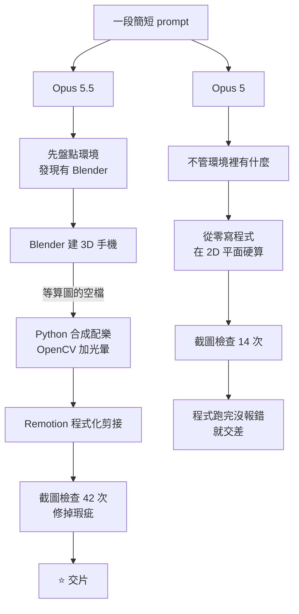

# 一句 prompt 做出 iPhone 宣傳片:Opus 5.5 vs Opus 5,差在「會挑工具」與「會回頭檢查」

**主題分類:** 科技 / AI Agent 應用 — 模型世代差異、agent 的工具選擇與自我驗證
**來源:** YouTube〈Opus 5.5 殺瘋了,你一定得用看看這個模型〉(Gary Chen @garychenai,2026-09-29,約 9.9 分;**依官方繁中字幕整理**)
**整理日期:** 2026-09-30

> ⚠️ **立場揭露:** 作者在說明欄推廣自己的 Skool 付費社群(完整文章與提示詞模板放在社群內)。**本文不轉述付費內容**,只整理影片公開的實測與觀察。
> ⚠️ **性質說明:** 這是**作者個人的實測示範**(兩個題目、各跑一次),不是系統性評測;作者自述「不是專業剪輯背景」。以下的「差異」請當成**值得自己驗證的觀察**,不是定論。
> 📎 Opus 5.5 的發布背景、價格與跑分,見本庫 [[rsi-recursive-self-improvement-anthropic]] §11。

---

## TL;DR

1. ⭐ **實驗:** 只給一段簡短英文 prompt——「做一支一分鐘的 iPhone 18 官方廣告,要有電影感、音效有力,工具與下載由你決定」——**中途不補任何一句話**。
2. ⭐⭐ **Opus 5.5 的做法:** 發現電腦裡裝了 **Blender** 就拿來建 3D 手機;**等算圖的空檔**用 Python 合成配樂、用 **OpenCV** 加鏡頭光暈,最後用 **Remotion** 寫程式剪接——**沒用任何外部素材**。
3. ⭐⭐⭐ **兩代差在兩件事:**
   - **會不會挑工具**:Opus 5.5 會利用環境裡現成的專業軟體;Opus 5 **無視環境,從零寫程式硬算**。
   - **會不會回頭檢查**:Opus 5.5 主動截圖檢查成品 **42 次**,Opus 5 只有 **14 次**;前者在交片前自己修掉字卡壓到手機、畫面太暗、亮屏太刺眼等瑕疵。
4. ⭐ 作者的一句話總結:「**一個只是把東西做出來,另一個是真的想把東西做好。**」
5. ✅ **與官方說法一致:** Anthropic 公告寫 Opus 5.5 是「**視覺與電腦操作最強的 Opus**」,並且「**會用有創意的方式檢查自己的工作,自我驗證迴圈更容易建立**」。

---

## 1. 實驗設計

| 項目 | 內容 |
|---|---|
| **題目一** | 一分鐘 iPhone 18 官方廣告(電影感、音效有力、high-energy) |
| **題目二** | 急診室恐怖短片(復刻 Reddit r/ClaudeAI 一篇熱門貼文的題目) |
| **變因控制** | 兩代模型用**一字不差的 prompt**、同一台電腦 |
| **介入** | 作者全程**不補充、不調整**,直接看第一版 |

---

## 2. 成品差在哪(作者的觀察)

### 2.1 iPhone 18 宣傳片

| 面向 | Opus 5.5 | Opus 5 |
|---|---|---|
| **剪輯節奏** | ⭐ 第 14 秒手機轉身、快速切特寫——作者查了才知道叫 **Montage(蒙太奇)**:**先抽掉聲音,再一口氣把情緒推上去**。prompt 只寫了 high-energy,**沒教它怎麼剪** | 畫面推進較平,少了情緒的層次與堆疊 |
| **建模** | 機身比例、鏡頭模組、**連底部充電孔**都做出來 | 「**根本不像真的手機**」 |
| **光影** | Apple Intelligence 那一幕,**螢幕邊緣的光自然照在機背**,有物理反射 | Logo 外的光暈渲染不到位 |
| **字體排版** | 精緻 | 有明顯瑕疵 |
| **可用程度** | 作者「非常滿意」,未調整就展示 | 「堪用」,但要發布還得花不少力氣調整 |

> ⚠️ 作者也說:**Opus 5 的表現「比我想像中好一點」**——所以「不是這一代才突然大躍進」,而是**同一個能力的品質差距**。

### 2.2 急診室恐怖短片

| | Opus 5.5 | Opus 5 |
|---|---|---|
| **畫面** | ⭐ **算出一條真正立體的醫院走廊**,有縱深與光影反射,壓迫感足 | 像早期的**平面電腦動畫**,只在 2D 平面上算畫面 |
| **過程** | 仍維持**邊做邊反覆自我審視** | 程式跑完就算完成 |

---

## 3. ⭐⭐⭐ 核心:兩個工作習慣的差異

| 習慣 | Opus 5.5 | Opus 5 |
|---|---|---|
| **① 挑工具** | ⭐ **調動環境裡的專業工具**(Blender、OpenCV、Remotion),而且**會利用等待時間平行做別的事** | 只會自己寫程式從零算出來 |
| **② 回頭檢查** | ⭐ 主動截圖檢查 **42 次**,交片前修掉「字卡壓到手機、畫面太暗、亮屏太刺眼」 | **14 次**;「畫面上的粗糙跟破綻,它連看都沒看」 |
| **完成的定義** | **觀眾看到的成品好不好看** | **程式碼能跑、沒報錯** |

> ⭐⭐ 作者:「**Opus 5 停留在『程式碼生成工具』;Opus 5.5 已經是有『導演思維』的自主 agent**——一個 agent 把整個製作組的工作全包了。」

### ✅ 與 Anthropic 官方公告對照

| 影片觀察 | 官方公告([Introducing Claude Opus 5.5](https://www.anthropic.com/claude-opus-5-5),2026-09-22) |
|---|---|
| 光影、建模細節更好,能看出畫面瑕疵 | 「**最適合視覺與電腦操作的 Opus 模型**」,能高保真閱讀密集文件、圖表、截圖 |
| 反覆截圖檢查成品 | 「**會用有創意的方式檢查自己的工作**;自我驗證迴圈更容易建立」 |
| 懂得分工、平行處理 | 「**把工作委派給子代理的效果好得多**」 |
| 溝通變順,不再回一堆「天書」 | 見本庫 RSI 筆記 §11.4:把最重要的資訊放開頭、少堆行話 |

⚠️ **本文無法獨立驗證:** 42 次 vs 14 次的截圖次數是作者自己數的;兩個題目各只跑一次,**模型輸出有隨機性**,換一次可能不同。

---

## 4. 作者的延伸觀點

- 「我每天高頻率用 AI,**這次還是低估了它的能力**——沒想到它在做影片這件事上的跨度這麼大。」
- ⭐ 「**AI 時代最該有的思維是永遠保持探索的心態。**很多時候你不去試,根本不知道邊界在哪裡。」
- 除了視覺能力,作者覺得 Opus 5.5 「**溝通變順了**,比較不會回一堆天書」。

---

## 5. 應用案例

### 案例一:讓 agent「知道環境裡有什麼」

Opus 5.5 會自己盤點環境,但你可以**主動降低它找錯路的機率**:
- 在 `CLAUDE.md` / `AGENTS.md` 列出**本機可用的專業工具**:「本機已安裝 Blender 4.x、ffmpeg、Remotion 專案範本在 `~/templates/remotion`」。
- 或在 prompt 開頭加一句:「**先檢查環境裡有哪些可用工具,再決定做法**。」
- 效果:避免模型從零寫一個「會跑但很粗糙」的替代品。

### 案例二:把「回頭檢查」寫成明確的完成條件

不要只說「做一支影片」,改成:
> 「做完後**擷取第 0、15、30、45 秒的畫面**,逐張檢查:文字是否被遮擋、亮度是否適中、主體比例是否正確;有問題就修,**全部通過才算完成**。」

📎 這就是本庫 [[shopify-helix-checkpoints-and-gates]] 的「關卡」概念:**把「好」定義成可以檢查的條件**,而不是讓模型自己決定「程式跑完就好」。

### 案例三:自己做一次「兩代對照」

想知道新模型值不值得換:
1. 挑一個你**真實會做**的任務(不是跑分題)。
2. **一字不差的 prompt**、同一個環境,新舊模型各跑 2–3 次。
3. 除了看成品,**看過程**:它有沒有用對工具?有沒有回頭檢查?花了多少 token 和時間?
4. 記下差異,再決定哪些工作流要換模型。

### 案例四:產品展示影片的低成本做法

小團隊要做產品宣傳短片:
- 準備:本機裝 Blender(建模)與 Remotion(程式化剪接),**產品規格與品牌色寫進 prompt**。
- ⚠️ 注意:片中是虛構的「iPhone 18」示範;**正式商業用途要避開他人商標與外觀設計**,用自己的產品。

---

## 來源

- YouTube:[Opus 5.5殺瘋了,你一定得用看看這個模型](https://www.youtube.com/watch?v=3iXsVw9wsjw)(Gary Chen @garychenai,2026-09-29;官方繁中字幕)
- Anthropic 官方公告:[Introducing Claude Opus 5.5](https://www.anthropic.com/claude-opus-5-5)(2026-09-22)
- 報導:[Help Net Security — Claude Opus 5.5 cuts costs and adds safeguards](https://www.helpnetsecurity.com/2026/09/23/anthropic-claude-opus-5-5/)、[9to5Mac — Anthropic upgrades Claude with new Opus 5.5 model](https://9to5mac.com/2026/09/22/anthropic-upgrades-claude-with-new-opus-5-5-model-details-here/)
- 題目參考:[Reddit r/ClaudeAI 貼文](https://www.reddit.com/r/ClaudeAI/s/QtwLYXfZ8e)(作者引用)
- 工具:[Blender](https://www.blender.org/)、[OpenCV](https://opencv.org/)、[Remotion](https://www.remotion.dev/)

📎 相關筆記:[[rsi-recursive-self-improvement-anthropic]](§11 Opus 5.5 發布)、[[blender-previz-mcp-ai-video]](用 agent 操作 Blender)、[[shopify-helix-checkpoints-and-gates]](把「好」寫成關卡)
