# Pi:只有 4 個工具的極簡 Agent —— 雙層循環、對話樹,以及「刻意不做沙箱」

> 整理自四支影片交叉比對:
> - **技術爬爬蝦 TechShrimp**〈[Pi 大道至簡,超越 Codex 和 Claude Code 的極簡 Agent,保姆級全攻略](https://www.youtube.com/watch?v=HhZcnM9tR7s)〉(2026-08-16,約 44.6 分鐘)
> - ⭐ **畅的科技工坊**〈[Pi Agent 完整上手指南:輕量 AI Coding Agent、Extension、Package、Session Tree 實戰](https://www.youtube.com/watch?v=Wah1vdFE92k)〉(2026-08-20,約 32.5 分鐘,官方 zh-CN 字幕)—— **第六、六之二、七之二節的操作細節與第八節的沙箱更新來自此片**
> - ⭐ **暮闲**〈[pi agent 最佳实践 | Harness Agent 定制全流程实战](https://www.youtube.com/watch?v=EmwW59QMadY)〉(2026-06-06,約 32 分鐘,無字幕)—— **第六之三節的擴充開發全流程來自此片**
> - Kelly Tsai(https://www.youtube.com/watch?v=7DyjFEzgVZ4)〈把AI Agent的功能全砍掉,反而表現更強?其實你只需要留這4個工具就夠!〉(2026-09-05,約 11.9 分鐘,無字幕) —— **第十二節的 Databricks 基準拆解、Terminal-Bench 反例與 OMP 對照來自此片**
>
> 依 CLAUDE.md 慣例,另**實地 clone `earendil-works/pi`(91.3K stars)讀原始碼與官方文件核實**,文中標出核實結果。

> 📎 強烈建議與 [[agent-runtime-deepseek-harness-cordis]] 對照看 —— **兩者是同一個問題的兩種相反解法**。
> 其他相關:[[seven-agent-architectures-selection-guide]]、[[herdr-terminal-runtime-agent-to-agent]]、[[agent-skill-three-layer-run-do-verify]]

---

## 一句話總結

**Pi 的賭注是:核心越小越乾淨,模型反而發揮得更好。** 它只有 4 個內建工具、約 1000 token 的系統提示詞,**沒有 MCP、沒有 Subagent、沒有 Plan Mode、沒有 Todo、沒有沙箱** —— 這些全部交給插件與容器。

---

## 一、極簡到什麼程度

| 項目 | Pi |
|---|---|
| 內建工具 | **4 個**:讀檔、寫檔、改檔、執行命令 |
| 系統提示詞 | **約 1,000 token** |
| 打一句「你好」 | 上傳約 **1,100 token**,佔用約 **4,000** 上下文 |
| 對照:Codex 打招呼 | **約 18,000 token** —— 什麼都還沒做就吃掉 **7%** 的上下文窗口 |

**✅ 原始碼核實「4 個工具」屬實**:`createCodingTools()` 確實只回傳 `read` / `bash` / `edit` / `write` 四個。

⚠️ **但補一個精確度**:程式碼裡實際定義了 **7 個**工具(`read`/`bash`/`edit`/`write`/`grep`/`find`/`ls`),另有一組**唯讀集**(`read`/`grep`/`find`/`ls`)供其他情境使用。**「4 個」是預設編碼工具組,不是全部存在的工具數。**

### 為什麼 4 個就夠

> 這四個工具已經足夠強大,**特別是執行命令的 bash 工具,本身就是一個萬能工具** —— 可以用它呼叫 `find` 搜檔案、`grep` 檢索程式碼、`ls` 查目錄。

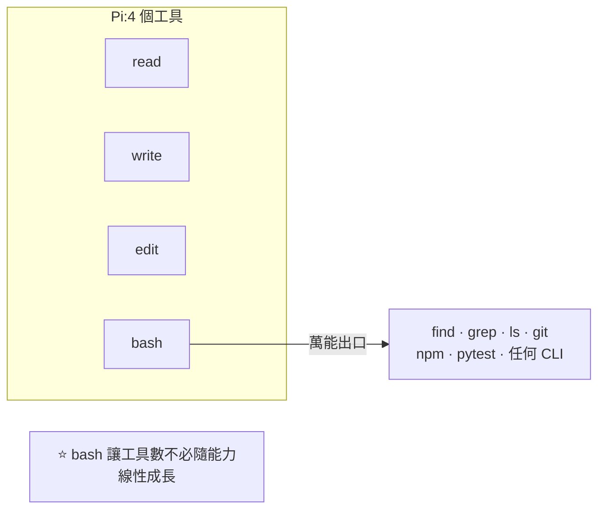

### 效能宣稱

⚠️ **以下是影片引用的第三方測試,本文無法獨立驗證,列出供參考:**

- **Composio** 上個月的一組基準測試:Pi 完成編程任務的**速度比其他 coding agent 快 1.5–2 倍**,任務成本也較低
- **Databricks** 在自家**百萬行程式碼倉庫**上的基準測試:橫軸任務成本、縱軸通過率;**Pi 在大部分場景下優於 Claude Code 與 Codex**,而**整張圖程式碼品質的最高點是 Pi + Claude Opus 4.8 的組合**

---

## 二、⭐⭐ 雙層循環:Steering 與 Follow-up 的實作原理

這是全片最技術性、也最值得記的一段,而**原始碼完全證實了**。

### 兩種指令追加方式

| 方式 | 中文 | 行為 | 快捷鍵 |
|---|---|---|---|
| **Steering** | 引導(打方向盤) | **不打斷**當前工作,但**立刻注入**,讓 AI 馬上改變執行方向 | 直接 Enter(**預設**) |
| **Follow-up** | 排隊 | **不影響當前這一輪**,等 AI 把整輪工作全做完才會看到並執行 | `Alt`+Enter(Mac:`Option`+Enter) |

影片示範得很清楚:AI 打算用 Express 做後端,但使用者想要 Next.js —— **不需要打斷它**,直接補一句「我需要 Next.js 框架、資料庫用 SQLite」,AI 立刻轉向去裝 Next.js 相關依賴。

### ✅ 原始碼證實的實作

`packages/agent/src/agent-loop.ts`(**整個 loop 只有 796 行**)的結構與影片描述完全一致:

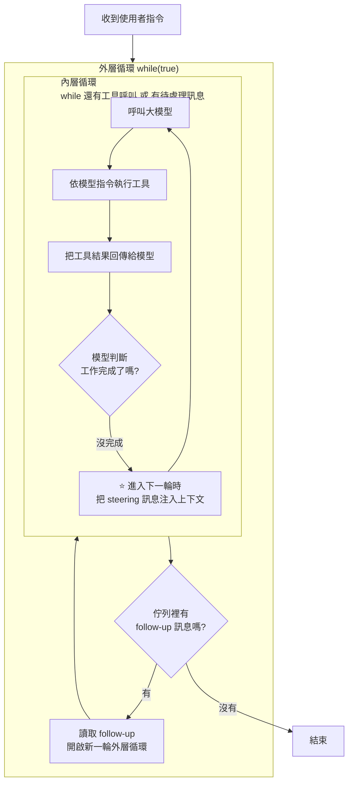

原始碼註解直接寫明:

- **外層**:「當 agent 本來要停止時,若有排隊的 follow-up 訊息到達則繼續」
- **內層**:「處理工具呼叫與 steering 訊息」
- 另有一行:「在開始時檢查 steering 訊息(使用者可能在等待時就打了字)」

> ⭐ **這個設計的巧妙處**:steering 之所以能「即時反應」,不是因為它中斷了什麼,而是因為**內層循環每一輪都會重新讀取待處理訊息**。而 follow-up 因為**住在外層**,天然就得等內層跑完。
>
> **兩種語意用同一個循環結構表達,不需要中斷機制。**

⚠️ **Windows 使用者注意**:`Alt`+Enter 預設是 PowerShell 的全螢幕快捷鍵,**會與 Pi 的 follow-up 衝突**,要先去 PowerShell 設定裡刪掉那組快捷鍵。

⭐ 排隊中的指令還能用 `Alt`+↑ **拿回來重新編輯**,改完再送回佇列。

---

## 三、日常操作的幾個關鍵

### 狀態列怎麼讀

Pi 底部那行資訊密度很高:

| 符號 | 意思 |
|---|---|
| ↑ | 整個 session 的輸入 token |
| ↓ | 輸出 token |
| **R** | Cache Read —— 整個 session 有多少 token 命中快取 |
| **CH** | Cache Hit Rate ⚠️ **只統計最近一次請求,不是整個 session** |
| $ | 本次對話的預估成本(⚠️ 用訂閱時顯示 `SUB`,成本僅供參考) |
| % | 目前佔用模型上下文窗口的比例 |
| **Auto** | 上下文壓縮機制 —— 到達閾值時**自動觸發壓縮** |
| 尾端 | 供應商 / 模型名 / 思考強度 |

### `!` 與 `!!`:臨時執行命令

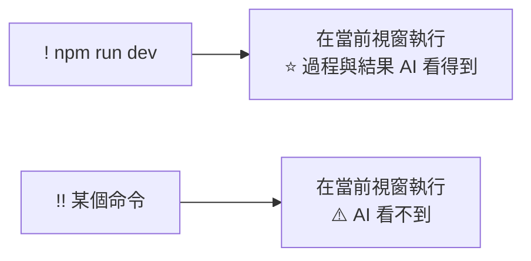

> `!!` 的用途是:你想跑點東西但**不想污染 AI 的上下文**。

### 多行輸入與圖片

- **多行**:`Shift`+Enter 換行,或 `Ctrl`+G 開記事本編輯完存檔關閉,提示詞自動同步進視窗
- **貼截圖**:Windows `Alt`+V、Mac `Ctrl`+V —— 可以直接截圖跟 AI 溝通版面問題
- **引用檔案**:輸入 `@` 選檔案或目錄

### 非互動模式

`pi -p "指令"` —— 背景靜默執行、中間過程看不到,做完直接輸出結果。**適合把 Pi 當一次性 CLI 命令用。**

---

## 四、⭐ Session 管理與對話樹

### 基本

| 命令 | 作用 |
|---|---|
| `/new` | 開新 session(**清空上下文**) |
| `pi -c` | 從**最近一次** session 繼續 |
| `pi -r` | **挑一個** session 繼續 |
| `/compact` | 手動觸發上下文壓縮 |
| `/clone` | **完整複製**當前 session 成一個新的 |
| `/fork` | **選一個對話節點**,基於它複製出新 session(只帶該節點之前的歷史) |

### 對話樹是 Pi 的特色

**每個 session 不是純線性結構,而是樹狀。** `/tree` 可以回退到任一歷史節點,並基於它**創建分支做不同嘗試**。

⭐ **2026-08-23 補:`/tree` 與 `/fork` 的關鍵差別在「分支歸屬」**

| 命令 | 新分支放在哪 | 什麼時候用 |
|---|---|---|
| **`/tree`** | ⭐ **仍在「原本那棵 session 樹」裡面** | 想在同一條探索脈絡裡試不同方案,之後還想跳回去比較 |
| **`/fork`** | ⭐ **建立一個「完全獨立」的新 session** | **不想影響原 session** —— 原 session 完整保留在記錄裡,之後可用 `pi -r` 挑回去 |

> ⭐ **回退時會先問你要不要摘要**:可以讓它把該分支之前的指令做總結,也可以選 **no summary** 直接在原始訊息上修改。
> **實務上「no summary + 直接改指令」很好用** —— 等於「同一個起點,換一個問法重跑」。

**⭐ 每次對話、工具調用與結果都存成 JSONL,帶 ID 或命名標識**,所以每個分支都記錄在案、隨時可回溯,不會丟失任何一條探索路徑。

**啟動時就能指定 session:**

| 命令 | 作用 |
|---|---|
| `pi -c` | 繼續最新的 session |
| `pi -r` | 挑一個歷史 session 繼續 |
| ⭐ `pi --name <名稱>` | **開新 session 並命名**,方便後續引用 |

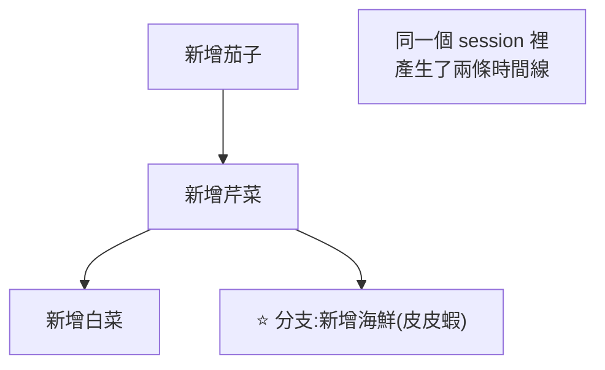

### ⚠️⚠️ 最重要的限制:樹只回退對話,不回退程式碼

> **使用樹回退對話歷史時,已經寫完的程式碼並不會跟著回退。**

所以要真正回滾,得**搭配 git**:

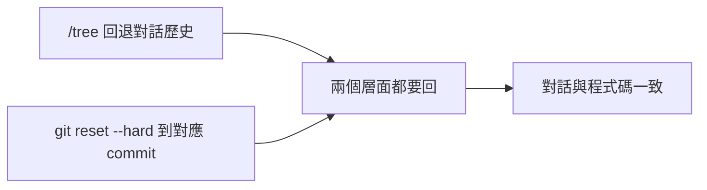

⭐ 實務做法:找到對應那次 commit 的 ID,在 Pi 裡用 `!` 執行 `git reset --hard <commit>`。

### 回退時的三個選項

| 選項 | 行為 |
|---|---|
| **不總結** | 徹底回退,後面的對話歷史完全拋棄 |
| **總結** | 讓 AI 把丟棄的那段對話做個總結,**回退後對過去處理過的工作仍有印象** |
| **指定怎麼總結** | 告訴 AI 該怎麼總結 |

⚠️ **關鍵細節:AI 只總結「當前分支」上的那段對話,不會去總結別的分支。**

### 影片給的一條實務建議

> **在 Agent 領域有個通用經驗:清空優於壓縮。**
> 因為過多的歷史會干擾 AI 的注意力 —— **執行完一輪任務後,最好的方式是直接 `/new` 開新 session。**

---

## 五、設計哲學:Pi 沒有什麼

這一段是理解 Pi 的關鍵:

> **Pi 沒有 MCP、沒有 Subagent、沒有 Plan Mode、沒有 Todo、也沒有 BTW。**
> 除了四個核心工具,Pi 只額外支援 **Agent Skills**,然後就沒有了。

**設計哲學:核心越小越乾淨,模型反而能更好地發揮;同時讓使用者有最大的自由度去組裝其他能力。**

官網首頁那句話很到位:

> **讓工具來適應你的工作流,而不是讓你去適應工具。**

---

## 六、插件:缺的功能全部靠它補

### ⭐⭐ 先分清楚 Extension 與 Package(2026-08-23 補,本文原先統稱「插件」)

**兩者不是同一層的概念。**

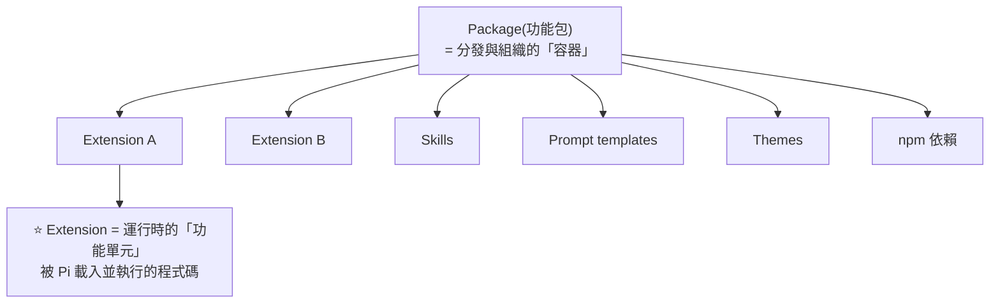

| | **Extension(擴充)** | **Package(功能包)** |
|---|---|---|
| **本質** | ⭐ **運行時的功能單元** —— 被 Pi 載入並執行的程式碼,通常是 TypeScript / JavaScript | ⭐ **分發與組織的容器** |
| **怎麼組織** | 拿到 **Extension API** 之後運作 | 透過 `package.json` 裡的 Pi 設定或約定目錄,把 extension、skills、prompt template、themes 組織在一起 |
| **能做什麼** | **註冊工具給模型使用**、**監聽事件**、⭐ **攔截危險操作**、**註冊 slash command**、甚至**改變終端裡的互動與顯示** | 版本管理、安裝、分享 |
| **適合** | **本地開發的單點增強**(例如寫一個安全檢測插件,在 bash 執行高危命令前先攔截確認) | **團隊複用與社群發布**(例如一個 devops toolkit 同時帶多個 extension + 一個 CI review prompt + 需要的 npm 依賴) |

⭐ **兩者的關係:extension 是 package「可以包含」的一種資源。一個 package 可以完全沒有 extension,也可以包含一個或多個。**

> ⭐ **一句話記住**:
> **Extension 負責「讓 Pi 多一種運行時的能力」;Package 負責「把能力、規則、依賴打包」,方便安裝、版本管理與分享。**

---


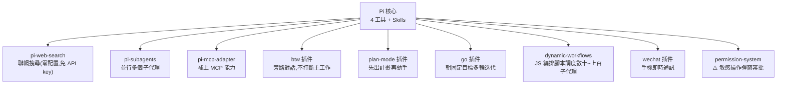

### ⭐ 全域安裝 vs 專案安裝(這點很重要)

> **每安裝一個插件,其實都是增加了一部分系統提示詞。**
> 如果某些專案用不到這個插件,**其實是給模型增添負擔。**

所以:

| 方式 | 命令 | 生效範圍 |
|---|---|---|
| 全域(預設) | 官網給的安裝命令 | 所有專案 |
| **專案級** | 安裝命令後加 **`-L`**(local) | 只對當前目錄生效,裝進 `.pi/` |

**卸載**:把安裝命令裡的 `install` 改成 `uninstall`。

### 幾個示範效果

- **subagents**:一句「設計五個不同風格的個人網頁」→ **啟動 5 個 worker 並行開發**,並完成並行的審查與修復
- **dynamic workflows**:一句「調研 22 到 26 年 AI 領域最具影響力的論文」→ **啟動 10 個 agent**,可用 `/workflows` 查看每個子代理的工作狀態。影片評價:**體驗跟 Claude Code 幾乎一模一樣**
- **go 模式**:給一個大目標(做 HTML 坦克大戰、自己試玩、輸出測試結論、再重做),**Pi 迭代了三次**完成,可在 iterations 裡看歷史迭代過程

---

## 六之二、⭐ 配置檔、工作模式與模型接入(2026-08-23 新增)

### 📁 配置目錄:`~/.pi/agent/`

| 檔案 / 目錄 | 作用 |
|---|---|
| **`models.json`** | ⭐ **你自己的模型配置** —— base URL、模型 ID、API key(**key 支援環境變數或 bash 命令**)、是否多模態、上下文窗口大小、最大輸出 token、thinking level |
| ⚠️⚠️ **`modelstore.json`** | **一字之差,作用完全相反** —— 這是 **Pi 自動生成的模型目錄快取**,用來離線讀取已配置服務商的模型列表。⭐ **千萬不要手動改它;刪掉會自動重建** |
| **`auth.json`** | **密鑰保險箱** —— 存各模型的 API key 或 OAuth 登入令牌。用 `/login` 登入訂閱服務時會自動寫入,不用手動改 |
| **`settings.json`** | **全域配置** —— 預設模型提供商、預設模型、主題、推理等級、專案信任等。也可在互動模式下用 `/settings` 直接改 |
| **`sessions/`** | 所有對話記錄,⭐ **樹狀目錄格式**,依專案目錄自動歸檔 |
| **`skills/`** | 技能包目錄 |

> ⭐⭐ **`skills/` 的載入方式正是「極簡但不簡陋」的秘密**:
> **每個技能是「一組指令 + 工具」打包的模組,按需載入 —— 用不到的時候,上下文裡只有名稱與簡短描述。**
> 核心只有 4 個工具,能力全靠這些模組按需拼裝。

⭐ **熱載入**:改完 `models.json` 後,在互動模式下 `/reload` 或 `/model` 即可生效,不用重啟。

### 🔧 四種工作模式

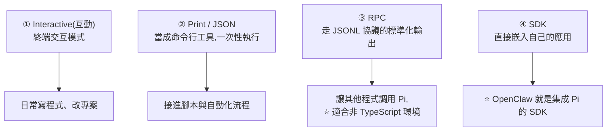

### 🔑 三種接模型的方式(`/login`)

| 方式 | 說明 |
|---|---|
| **① Sign in with account** | ⭐ **用既有的 Codex / Claude Code 訂閱方案登入**,直接吃訂閱計畫裡的 quota |
| **② Sign in with API key** | Pi 已集成許多提供商。⭐ **會自動偵測環境變數** —— 偵測到就顯示為 Stored,直接可用;沒有的話當場輸入密鑰即可 |
| **③ 自訂 `models.json`** | 針對自訂/第三方模型平台。關鍵欄位:**base URL、API 介面類型**(多數是 OpenAI completion 或 OpenAI chat)、**API key**(環境變數 / 直接填 / bash 命令)、**models 列表** |

⭐ **`/model` 的體驗**:列出所有可用模型(官方標配的 + 你自己接的第三方),**全部熱更新**——外面改過只要解析成功就即時出現。**可以直接打字過濾搜尋。**

### 💰 狀態列會即時顯示的成本資訊

執行時下方會列出:**已提交 token 數、輸出 token 數、快取命中率、目前累計花費金額、佔用上下文窗口比例、模型 ID 與推理等級。**

⭐ **來自實際 demo 的一組真實數字**(用 DeepSeek V4 Pro 做一個網頁賽車遊戲,約 20 分鐘):

| 指標 | 數值 |
|---|---|
| 輸入 token | ~59,000 |
| 輸出 token | ~100,000 |
| 快取 token | 9.2M |
| ⭐ **快取命中率** | ⭐ **99.9%** |
| ⭐ **總花費** | ⭐ **約 15 美分** |
| 上下文窗口佔用 | 12.8% |

> ⭐ **99.9% 的快取命中率是這組數字裡最值得注意的** —— 它解釋了為什麼一個產出 10 萬 output token 的任務只要 15 美分。
> 📎 這與 [[token-saving-three-moves-context-control]] 講的 prompt caching 是同一件事:**穩定的前綴 + 連續對話 = 極高命中率**。

### ⭐ 一個實用的模型分工策略(demo 中的做法)

```
① 用「快模型」(如 Flash)生成計劃
        ↓
② 切到「強模型」(如 Pro)review 這份計劃,有疑問就反問你
        ↓
③ 回答完問題後,請它更新計劃並確認
        ↓
④ 用「強模型」執行實作
```

⭐ **重點在第 ②③ 步**:讓強模型**先審計劃、先把不確定的地方問清楚**,再進入實作 —— 比直接讓強模型從頭做省錢,也比讓快模型一路做到底可靠。

---

## 六之三、⭐⭐ 擴充開發全流程實戰(2026-08-30 新增)

> 本節整理自 **暮闲**〈pi agent 最佳实践 | Harness Agent 定制全流程实战〉(2026-06-06),
> 並**逐項比對 clone 下來的官方文件**(`packages/coding-agent/docs/` 底下的
> `extensions.md`、`packages.md`、`prompt-templates.md`、`themes.md`)。補正處已標出。

### 先做定位判斷:你到底該不該用 Pi

影片開頭給了一句很實用的分流,值得放在最前面:

> **Pi 是「你要客製」時才選的東西。如果你要的是一個裝好就能用的 harness,直接用 OpenClaw 或 Hermes 會更好。**

理由很直接:agent 記憶、接入通道、多 agent 這些能力,OpenClaw / Hermes 裝好就全都有;
**Pi 只提供最基礎的「與模型互動」能力,其餘一律靠自定義擴充補**。
影片也點出 **OpenClaw 底層就是基於 Pi 做擴充開發的** —— 這正好說明 Pi 的定位是「別人拿來蓋東西的地基」。

實測畫面很能說明這件事:首次啟動 Pi,**連內建 Skill 都沒有**,只顯示專案底下自己的 Skill,
「就像一張白紙」。

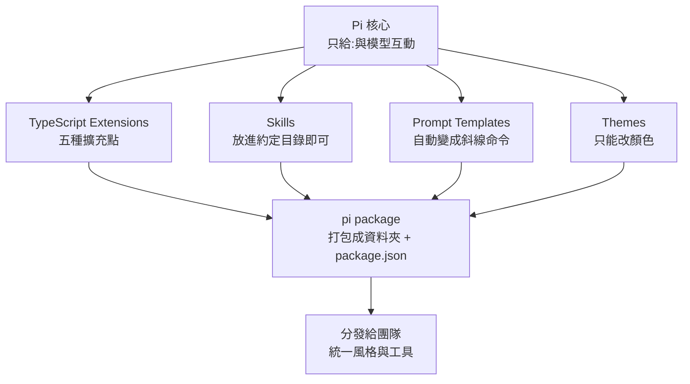

### 一、TypeScript Extensions:五個擴充點

影片實際示範了五種,全部**不需要改 Pi 原始碼**,只需照它暴露的介面寫:

| # | 擴充點 | 官方 API | 影片示範 |
|---|---|---|---|
| 1 | **註冊自定義工具** | `pi.registerTool()` | 讀取當前專案的程式碼變更並回傳 |
| 2 | **監聽會話開始** | `pi.on("session_start", …)` | 印訊息;可拿來做指標採集(一天對話幾次) |
| 3 | **攔截工具呼叫** | `pi.on("tool_call", …)`,回傳 `{ block: true, reason }` | 刪檔前彈窗確認,選「否」就真的攔下來 |
| 4 | **註冊斜線命令** | `pi.registerCommand()` | `/hello`;可自行補上官方沒有的命令 |
| 5 | **註冊自定義模型供應商** | `registerProvider`(見 `custom-provider.md`) | 接自架的 LiteLLM |

> 影片對第 1 點的類比很到位:**自定義工具的本質跟 MCP 一樣** —— 都是把工具描述交給模型,由模型決定怎麼傳參。

官方文件列出的能力比影片示範的更多,值得知道還有:
**`ctx.ui`**(select / confirm / input / notify)、**`ctx.ui.custom()`** 做完整 TUI 元件、
**`pi.appendEntry()`** 存跨重啟的狀態、以及自定義 compaction 與自定義渲染。

### 二、⚠️ 補正:不必退出重進,有 `/reload`

影片全程的做法是「改完 `.ts` 就退出終端機再重進」,並說這是判斷擴充有沒有載入的關鍵。

**官方文件明確寫著:放在自動探索目錄裡的擴充,可以用 `/reload` 熱重載。**

> Extensions in auto-discovered locations can be hot-reloaded with `/reload`.

也就是說,只要擴充是放在下列兩個位置之一,改完打 `/reload` 就好,不用重啟:

| 範圍 | 路徑 |
|---|---|
| 全域 | `~/.pi/agent/extensions/` |
| 專案 | `.pi/extensions/` |

⚠️ 官方另註明 **`pi -e ./path.ts` 只適合臨時測試**,那樣放的擴充**不能**熱重載。
影片沒有區分這兩者。

### 三、Skills:放對目錄就好,但沒有安裝命令

Skills 的位置(官方文件為準):

- 全域:`~/.pi/agent/skills/`
- 也讀跨 harness 的共用目錄 `~/.agent/skills/` —— **Codex、Claude Code、OpenClaw 等都會讀這個**
- 專案:`.pi/skills/`

影片點出一個實務落差:**Hermes 之類的工具有 `/skills` 搜尋與一鍵安裝,Pi 沒有,你得自己把檔案放進去。**
但這正好是擴充點 4 的用途 —— 自己註冊一個安裝 Skill 的命令補上。

### 四、Prompt Templates:為什麼有了 Skill 還要它

影片回答了一個很多人會有的疑問:Skill 已經是一套高度定制的提示詞了,為何還要單獨的提示模板?

> **提示模板是 Skill 的上一層封裝。** 它可以把「要怎麼調用這個 Skill」的講法固定下來,
> 也可以在**一個模板裡觸發多個 Skill**。

官方規格(影片沒講到這麼細):

- 位置:全域 `~/.pi/agent/prompts/*.md`、專案 `.pi/prompts/*.md`(**專案的要先 trust**)
- **檔名即命令名**:`review.md` → `/review`
- frontmatter 的 `description` 選填,沒寫就取第一行非空白內容
- ⭐ 還有 `argument-hint`,會顯示在自動完成的描述之前;慣例是
  **`<角括號>` 表必填、`[方括號]` 表選填**
- 可用 `--no-prompt-templates` 關閉探索

影片有提到選單上的 **`U` / `P` 標記** —— 分別代表該項來自全域(user)或專案(project),
這在同名衝突時很有用。

### 五、Themes:只能改顏色,而且必須整份給

影片說「主題只能改顏色,其他互動結構改不了」,而且強調**不能只保留想改的欄位,必須整份複製再改**。

**官方文件證實這點,並給出精確數字:每個主題必須定義全部 51 個必填色彩 token。**
另有 4 個選填 token 帶 fallback(`thinkingMax` → `thinkingXhigh`、
`scrollbarThumb` 與 `searchMatchBg` → `selectedBg`、`searchMatchText` → `text`)。

位置同樣是 `~/.pi/agent/themes/*.json` 與 `.pi/themes/*.json`;
內建只有 `dark` 與 `light`,首次啟動會依終端機背景自動選一個。

### 六、⚠️ 設定檔決定實際用哪個模型(影片踩到的坑)

影片註冊完自架的 LiteLLM 供應商、也在 `/login` 選了它,結果**請求根本沒走到 LiteLLM**
—— 他是靠 LiteLLM 那邊的日誌時間戳沒更新才發現的。

原因是 **`settings.json` 已經把第一次登入時選的供應商記了下來**,得去改設定檔才會生效。

> 影片給的延伸提醒很值得記:**如果你要拿 Pi 去做一個圖形介面,就必須把 `settings.json` 暴露出來讓使用者改。**

### 七、pi package:把上面全部打包分發

做法是建一個資料夾,底下放**約定名稱的目錄**(`extensions/`、`skills/`、`prompts/`、`themes/`),
再用 `package.json` 的 `pi` key 把內容組織起來。**不必四種都有,有幾種填幾種。**

官方支援的安裝來源比影片示範的多:

```bash
pi install npm:@foo/bar@1.0.0
pi install git:github.com/user/repo@v1
pi install https://github.com/user/repo
pi install /absolute/path/to/package
pi install ./relative/path/to/package

pi remove npm:@foo/bar
pi list                    # 列出已安裝套件
pi update --all            # 更新 pi 本體 + 套件 + 對齊釘選的 git ref
pi -e npm:@foo/bar         # ⭐ 只試不裝:裝到暫存目錄,僅本次執行有效
```

⭐ **影片說「裝完就是全域」,只講對了預設值。** 官方規格是:

| 寫到哪 | 指令 | 用途 |
|---|---|---|
| 使用者設定 `~/.pi/agent/settings.json` | `pi install …`(預設) | 自己用 |
| 專案設定 `.pi/settings.json` | `pi install -l …` | **可進版控分享給團隊;專案被 trust 後,Pi 啟動時會自動補裝缺少的套件** |

後者才是影片結尾那個「讓團隊成員風格一致」訴求的正解 —— 不必每個人手動 `pi install`。

### 八、⚠️⚠️ 補正:官方對套件有明確的安全警告,影片完全沒提

`packages.md` 開頭就寫著:

> **Pi packages run with full system access.** Extensions execute arbitrary code, and skills can
> instruct the model to perform any action including running executables.
> **Review source code before installing third-party packages.**

擴充執行任意程式碼、Skill 能指示模型跑任何東西 —— 這與本文第八節「Pi 幾乎沒有安全機制,而且是刻意的」
完全一致。**裝第三方 pi package 等於在本機執行陌生程式碼,務必先讀原始碼。**

### 九、影片的貫穿範例:三層串起來

影片用「程式碼變更影響評估」把所有擴充串成一條線,這個組合方式比單看任一項都有價值:

```
自定義工具(讀出當前變更)
   ↓ 把變更內容當上下文交給
Skill(依變更內容做評估,按約定格式輸出)
   ↓ 由上一層封裝、並固定調用方式
Prompt Template(變成 /assess-change 斜線命令)
   ↓ 連同 theme 一起
pi package(打包分發給團隊)
```

> 作者特別澄清:**別以為 Pi 只能做這種小功能。** 這個例子只是為了演示;
> OpenClaw 與 Hermes 具備的 agent 記憶、接入通道、多 agent,用同一套擴充介面都做得出來。

---

## 七、Skills 與記憶

### Skills 走標準協議

Pi 遵循標準的 **Agent Skills 協議**,把 skill 放到指定路徑即可:

| 範圍 | 路徑 |
|---|---|
| 專案級 | `<專案>/.agents/skills/<技能名>/SKILL.md` |
| 全域 | `~/.agents/skills/<技能名>/SKILL.md` |

從專案級變全域,**直接把資料夾拖過去就行**。

⭐ 影片提到 **Skill Hub** 是找技能的好渠道,而且很多技能可以**直接把安裝說明的提示詞丟給 Pi,讓它自己裝**(示範中 Pi 還自己補裝了缺少的 `uv`)。

### 跨 session 記憶:三層

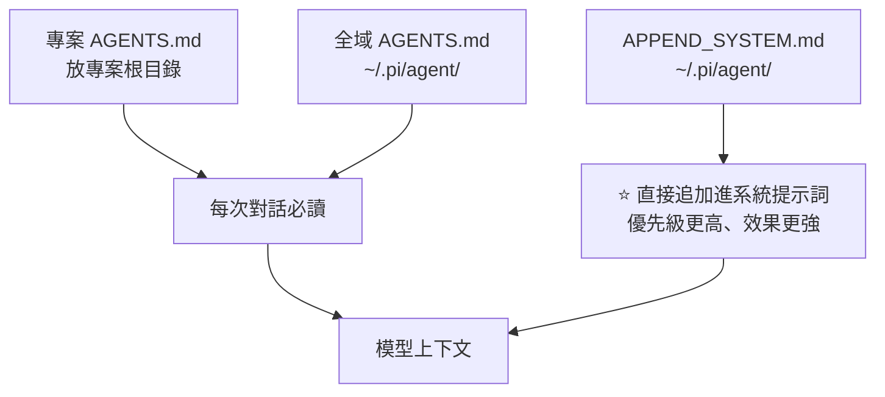

- **`AGENTS.md` 是通用格式** —— Codex、OpenCode 等其他工具也吃這個檔
- **可以讓 Pi 自己寫**:叫它通讀整個資料夾,把學到的專案知識存進 `AGENTS.md`
- 影片作者在全域 `AGENTS.md` 裡加了一條防呆:**禁止批次刪除檔案或目錄,只能以明確路徑單個刪除;需要批次刪除時應停止並請使用者手動處理**

> ⚠️ 一般場景用 `AGENTS.md` 就夠;`APPEND_SYSTEM.md` 因為直接進系統提示詞,**要謹慎使用**。

### ⭐⭐ AGENTS.md 的層級與覆寫規則(2026-08-23 新增)

**Pi 會順著專案目錄「向上每一級」尋找 `AGENTS.md`,而且越接近專案目錄、優先級越高。**

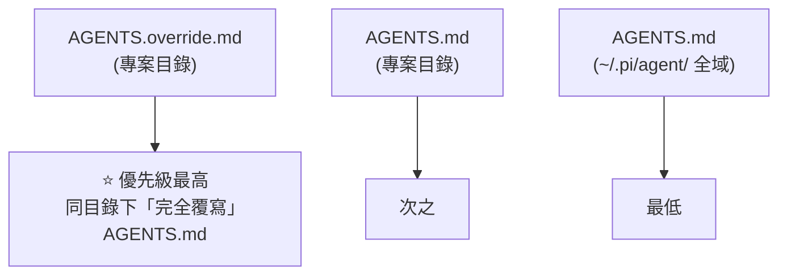

⭐ **`AGENTS.override.md` 是本文原先漏掉的一個檔案** —— 影片作者用「robot1 / robot2」兩個身份做了實測:同目錄下同時放 `AGENTS.md`(robot1)與 `AGENTS.override.md`(robot2),**問 Pi 身份時回答 robot2**,證實 override **完全覆寫**而非合併。

**三層的建議用法:**

| 檔案 | 放什麼 |
|---|---|
| **全域 `AGENTS.md`** | 你的**編程經驗與習慣**(跨專案通用) |
| **專案 `AGENTS.md`** | 這個專案的**程式風格與要求** |
| ⭐ **`AGENTS.override.md`** | **臨時性的不同要求** —— 要處理特殊任務時暫時換一套規則 |

### ⚠️⚠️ 重要澄清:Project Trust 與 AGENTS.md 無關

首次進入一個專案時,Pi 會問是否 trust 這個資料夾。**很多人會誤以為不信任就什麼都不載入。**

| | 選 **do not trust** 時 |
|---|---|
| ⭐ **專案目錄下的 `AGENTS.md`** | ✅ **依然會被載入** |
| **`.pi/` 資料夾裡的 settings、skills、package、extension** | ❌ **不會被載入** |

> ⭐ **所以 trust 管的是「`.pi/` 裡的可執行資源與設定」,不是「上下文文件」。**
> 這與第八節原始碼文件說的「Project Trust 只是輸入載入的守衛」完全一致 —— **它防的是 repo 偷改你的 Pi 設定與擴充,不是防提示詞注入。**

---

## 八、⚠️⚠️ 安全:Pi 幾乎沒有安全機制,而且是刻意的

**影片講得很直白,而原始碼文件證實了每一句。**

> **Pi 只有一個非常非常基礎的安全機制**:在包含插件或 skill 的陌生目錄啟動時,會詢問是否信任並載入這些插件/skills。
> **一旦 Pi 開始運行,就沒有任何安全限制了 —— 永遠處於最高權限**,編輯檔案、執行命令都自動執行,不會停下來詢問。
> **Pi 也沒有任何沙箱機制。**

### ✅ 原始碼文件的說法(比影片更完整)

`packages/coding-agent/docs/security.md` 與 README 明確寫著:

- **「Pi 不包含用於限制檔案系統、行程、網路或憑證存取的內建權限系統。預設以啟動它的使用者與行程的權限運行。」**
- **「Pi 不包含內建沙箱。這是刻意的。」** 理由是:
  > **一個半吊子的行程內沙箱很容易被誤認為安全邊界,而它其實仍然依賴宿主的 shell、檔案系統、套件管理器、憑證與擴充程式碼。真正的隔離必須來自作業系統或虛擬化/容器邊界。**
- **Project Trust 只是「輸入載入的守衛」** —— 它防止一個 repo 在你批准前偷改 Pi 的設定與擴充,**但它不是沙箱,也不會讓不可信的程式碼、提示詞或模型輸出變安全**
- ⭐ 甚至直說:**來自 repo 檔案、註解、文件或建置輸出的提示詞注入,是本地 agent 的預期風險,Pi 無法可靠防止**

### ⭐⭐ 2026-08-23 更新:社群已有 sandbox extension

本文原先寫「Pi 沒有沙箱」——**核心確實沒有,而且是刻意的(上述原始碼文件的說法完全不變)。但社群已經做出了一個 sandbox extension。**

**安裝方式:**
```
pi.dev → Packages → 搜尋 sandbox,Types 選 extension
→ 找到 pi-sandbox → 依頁面上的安裝命令安裝
```

**裝完之後**,在 Pi 的配置目錄手動建立 **`sandbox.json`** 作為全域配置,可設定:
- **檔案的讀寫**
- **命令執行**
- **對外部網路的訪問**

(該 package 的說明頁面附有範例配置,可依自己的使用場景微調)

⭐ **實際效果**:demo 中 Pi 生成程式碼時,確實會跳出**「是否允許進行檔案操作 / 命令行操作」的審批**,並可選 **allow for this project** 一次性放行整個專案。

> ⚠️⚠️ **但影片作者給了一個很重要的安全提醒,值得完整記住:**
> **開發者社群提供的這些 package 可能都沒有經過驗證與測試。安裝前一定要詳細查閱文檔,確認它是否適合你的使用場景、是否會對你的本地機器造成危害。**
>
> ⭐ **這其實是個雙重諷刺**:你為了補上安全機制而去裝一個第三方擴充,**而這個擴充本身就是一段會被 Pi 載入執行的程式碼**。
> **它能提升「agent 誤操作」的防護,但同時擴大了「供應鏈」的攻擊面。** 用之前先讀原始碼。

### 三條補救路線

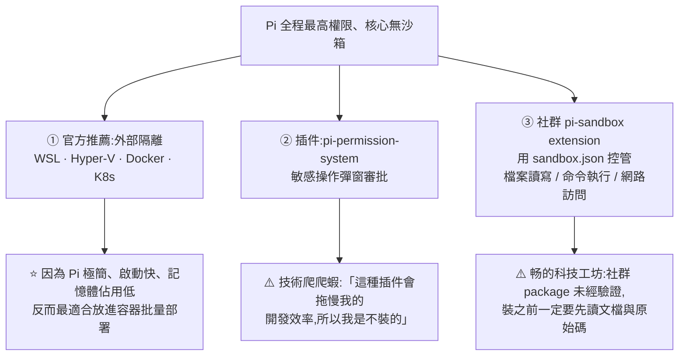

> ⭐ **這裡有個很有意思的反轉**:Pi 的極簡不只是效能優勢,**也讓它成為最適合跑在容器/虛擬機裡的 agent** —— 啟動快、佔用低,適合用 Docker 或 K8s 批量部署。**「不做沙箱」與「容易被沙箱」其實是同一件事的兩面。**

⚠️ 影片作者對 permission 插件的態度也很誠實(「會拖慢效率所以不裝」)—— **這是真實的取捨,不是推薦。**

---

## 九、Pi 給自己寫插件

**Pi 本身內置了插件開發的相關知識** —— 也就是說它不只能裝插件,**還能自己給自己寫插件**。

影片示範了三個,**全部用 GPT-5.6 一次就跑通**:

| 需求 | 結果 |
|---|---|
| 查 IP → 查當地天氣 → 顯示在對話視窗上方 | **完全客製了 Pi 的 UI** |
| 禁止 AI 讀取/編輯受保護的 `.env` 檔 | AI 嘗試操作時直接被阻止 |
| 執行 `rm` 刪除命令前先彈窗詢問 | 選 No 就刪不掉,選 Yes 才刪 |

插件本身就是一個 **TS 檔案**,放在 `.pi/extensions/`(專案級)或 Pi 全域設定目錄(全域)。改完用 `/reload` 重新載入。

> ⭐ 注意第 2、3 個例子:**使用者可以用插件自己補上他要的那部分安全機制** —— 這正是「核心不做,但開放介面」的設計兌現。

---

## 十、原始碼架構與 SDK

Pi 的 monorepo 有四個核心包,**每個都同時是 SDK**:

| 包 | 負責 |
|---|---|
| **`pi-ai`** | 模型呼叫 —— 把市面上數十家模型廠商做成**統一的呼叫規範** |
| **`pi-agent-core`** | **Agent Loop**(前面講的雙層循環)+ 工具呼叫與狀態管理 |
| **`pi-coding-agent`** | 編程功能的具體實現 —— 4 個基礎工具、系統提示詞、Skills 機制、插件機制 |
| **`pi-tui`** | 命令列介面(差分渲染) |

**當 SDK 用**:

- 需要「接入所有大模型」的功能 → `npm install` 後直接用 `createModel`
- 需要一個開箱即用的 coding agent → 安裝後先建 session,再直接給 agent 任務

> 影片的評價:**「Pi 的原始碼就是一個 Agent 設計規範的教科書」** —— 從事 agent 開發的人值得深入讀。

---

## 十一、⭐⭐⭐ 與 DeepSeek Harness 對照:同一個問題的兩種相反解法

這是本文最值得帶走的部分。兩者都是 agent harness,**但幾乎每個設計決策都相反**:

| 面向 | **Pi** | **DeepSeek Harness (dsh)** |
|---|---|---|
| **核心哲學** | **核心越小越好**,能力靠插件組裝 | **Everything is a Plugin**,連 loop 都是插件 |
| 內建工具 | **4 個** | 一整套 + 可註冊 |
| 系統提示詞 | **約 1,000 token** | 分段組裝,每 step 重新組裝 |
| Agent Loop | **796 行的雙層循環** | 插件化,可整個替換 |
| 歷史管理 | **對話樹**(可分支),⚠️ **不回退程式碼** | **append-only 事件日誌**,`Model-visible means logged` |
| 崩潰恢復 | 未特別處理 | ⭐ **區分「未啟動 / 完成 / 結果未知」三態** |
| 權限 | ⚠️ **無** —— 全程最高權限 | **多層**:pre-execute → monotonic guards → approval |
| 沙箱 | ⚠️ **刻意不做**,推給容器 | `ctx.sandbox` seam;**所有限制失敗就直接拒絕執行** |
| 理論基礎 | 無(工程直覺) | **Cordis 論文**(88 頁,含 Confluence 定理) |
| 成熟度 | 91.3K stars,可日常使用 | ⚠️ **developer preview**,會有破壞性變更 |

### 兩者的共同誠實之處

**它們對「沙箱」的判斷其實一致:**

- **Pi**:「一個半吊子的行程內沙箱很容易被誤認為安全邊界」→ **所以乾脆不做**
- **論文(dsh 的理論基礎)**:「語言層存取控制擋不住不可信程式碼……沙箱需要語言手段之外的執行邊界」→ **所以做成一個 seam,把真正的隔離委派出去**

> ⭐ **同樣的認知,兩種落地:一個選擇「不假裝」,一個選擇「留介面」。**

### 該選哪個

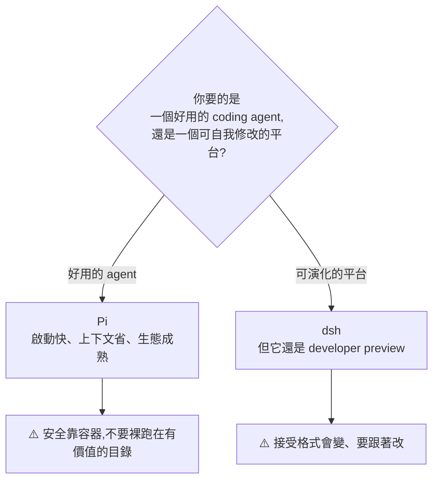

---

## 十二、⭐⭐⭐ 數據面:Harness 到底讓你多付了多少錢(2026-09-05 增補,來源:Kelly Tsai)

前十一節講的是 **Pi 怎麼做、能不能用**。這一節換一個問題:
**「Harness 越厚越強」這個直覺,拿數據驗證的話站不站得住?**

> 影片開頭那個提問很到位:
> **「你可以先打開自己的 Agent 看一眼:掛了幾個 MCP、寫了幾份 Skill、設定檔有多長?
> 應該很少會有人回頭算過,那些東西一個一個加上去之後,
> 它們每天到底是在幫你,還是在跟你多收錢?」**

### 12.1 先把「砍掉的第四樣東西」講清楚:系統提示詞

§一講了 Pi 砍掉 **MCP、Subagent、Plan Mode** 三樣。但還有一樣**你看不到的**:

| | 每次對話開頭附帶的固定系統提示詞 |
|---|---|
| **Claude Code** | 約 **14,000 token** |
| **Pi** | **不到 1,000 token** |
| | **差十幾倍** |

⭐ **Pi 的論證是:那 14,000 token 裡很大一部分是在說明它自己的功能怎麼用,而這件事本身是多餘的。**

> **「現在的前沿模型本來就被訓練過要怎麼用工具、怎麼在終端機裡做事。
> 你再手寫一大段說明,根本是在浪費 context,也是在干擾它。」**

⭐⭐ 影片給的比喻很好用:

> **像你請了一個做過十年的資深工程師進來,結果每天早上還是塞給他一份三十頁的作業流程,
> 從螺絲起子怎麼拿開始講。他當然聽得懂也會照做 ——
> 但你等於先把他一半的注意力拿去聽你講怎麼拿螺絲起子。**

⚠️ 這也解釋了一個常見症狀:**你明明只要 AI 改一個檔案,它卻在那邊繞很久** ——
有可能就是塞太多東西給它,**它自己迷路了**。

📌 官方定位一句話:**「把 Pi 調整成你的工作流,而不是反過來讓你去配合它。」**

### 12.2 ⭐⭐⭐ Databricks 基準的四道條件(這一段比結論更值錢)

2026-07-08 Databricks 在官方部落格發了一份 coding agent 測試報告,
題目取自**自家數百萬行的程式碼倉庫**。**方法論的四道條件才是最該抄的部分:**

| # | 條件 | 為什麼要這樣做 |
|---|---|---|
| **①** | **題目用自己的** —— 從公司內部**做過而且已上線**的修改裡挑,橫跨十幾種程式語言 | ⚠️ 業界常用的公開考古題**早就被拿去訓練模型了**,等於考前就看過答案 |
| **②** | **把答案的線索拿掉** —— 原本每個修改都附一段「當初為什麼這樣改才有效」,**整段刪掉**,只留「要達成什麼、有什麼限制」 | 不讓 AI 抄現成的思路 |
| **③** | **不用 AI 當評審** —— Agent 說做完了,就**把改過的程式拿去跑**;跑得過**而且原本的測試全部通過**才算過關 | LLM-as-judge 會放水 |
| **④** | ⭐⭐ **把修改歷史封起來** —— **從測試的那一版起把 git 時間軸整個切斷** | ⚠️ **Agent 有能力自己去翻 git log,往後翻就會看到當初的正確答案** |

> ⭐⭐⭐ **第 ④ 條最容易被漏掉,而且是自己做內部評測時最常見的作弊漏洞。**
> 你以為在測 agent 的能力,實際上在測它會不會翻版本歷史。

### 12.3 ⭐⭐ 結果:同一個模型,換 harness 成本差兩倍以上

在這四道條件底下,**同一個模型、同樣的思考強度**:

| 指標 | 數字 |
|---|---|
| **Claude Code + Opus 4.8 每個任務的 context** | **742,000 token** |
| **Pi 每個任務的 context** | **236,999 token** |
| **倍數** | ⭐ **約 3.2 倍** |

⭐ 而且 **Pi 用更少的回合就把任務跑完**。Databricks 的結論很直接:

> **同一個模型、同樣的思考強度,只是換不同的 harness 去跑,
> 不同任務的成本在某些情況下會差到超過兩倍 —— 而品質是一樣的。**

### 12.4 ⭐⭐⭐ 同一份報告的另一半:便宜的模型跑完反而比較貴

這組數字非常反直覺,而且**已完整核實**:

| | Sonnet 5 | Opus 4.8 |
|---|---|---|
| **每 token 單價** | ⭐ **便宜約 1.7 倍** | 基準 |
| **每任務實際成本** | ⚠️ **$2.09** | **$1.94** |
| **通過率** | ⚠️ **81%** | **87%(高 6 個百分點)** |
| **吃掉的 token** | ⚠️ **多 1.9 倍** | 基準 |

> ⭐⭐⭐ **原因:它要多跑幾輪、多讀幾個檔案。**
>
> **決定你帳單的,是它來回跑了幾趟、讀了幾個檔案 ——
> 而「跑幾趟、讀幾個檔案」正好就是外面那一層 harness 在影響的。**

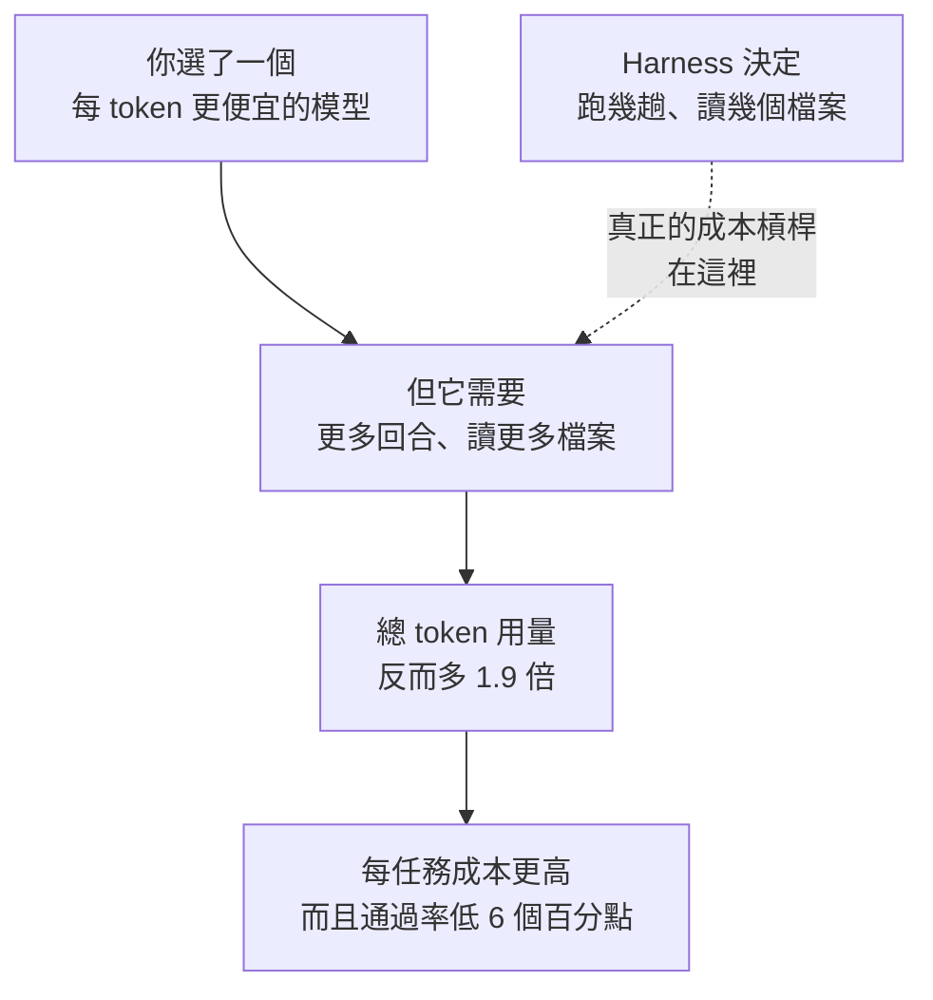

📌 **補充一個影片沒提、但方向一致的數據點:**
同一份報告裡 **GLM 5.2 在品質上與 Opus 4.8 統計上打平,每任務成本卻是 $1.28 對 $1.94。**
⭐ Databricks 自己的總結:**「模型的 token 單價,是端到端任務實際成本的一個很差的指標。」**

> ⭐⭐ **一句話帶走:你每個月付的錢裡,有一部分是在為你自己加上去的東西買單。**

### 12.5 ⚠️⚠️ 但反例也要看:Terminal-Bench 上 Pi 並不領先

⚠️ **這是影片最誠實的一段,不能只講對 Pi 有利的數據。**

Terminal-Bench 的題目是**在真實終端機環境裡完成多步驟工作**(從把程式編譯起來到訓練模型都有)。
在 **2.0** 版本上:

| Agent | 通過率 |
|---|---|
| **沒有做任何客製的 Pi** | ⚠️ **不到五成** |
| **Terminus 2(第一名)** | **將近六成 —— 差了整整 10 個百分點** |

⭐⭐ **但有趣的是:排第一的 Terminus 2 比 Pi 還要極簡。**

📌 核實:Terminus-2 是 Terminal-Bench 團隊自己做的
**「minimal, unopinionated agent scaffold」**,定位是**中立的測試台** ——
**只有單一個無頭終端(Docker 裡的 tmux session)當工具,只執行 Bash 命令、按鍵原樣送進去,輸出結構化 JSON。**
**連結構化的工具都不用。**

> ⭐ **所以「東西少反而比較好」這個方向,在這場測試裡其實是被支持的 ——
> 只是被支持的不是 Pi,是比 Pi 更薄的東西。**

### 12.6 ⚠️ 另一個反例:OMP —— 有人把工具全部加回去了

| | Pi | OMP |
|---|---|---|
| **內建工具數** | **4 個** | **31 個** |
| **核心規模** | 極簡 | 另外寫了約 **8 萬行**(Rust) |
| **加回去的東西** | — | 分身(subagent)、計畫模式、查程式定義(LSP)、抓執行錯誤(DAP)、記憶系統、即時協作 |

> ⚠️⚠️ **影片說「OMP 是從 Pi 分出去的官方版本、同一群社群裡的人做的」—— 這點需要更正。**
> 核實結果:**OMP 是資安研究者 Can Boluk 個人 fork 的專案**(2025-12-31 建立 repo),
> **不是 Pi 官方分出去的版本。**

⚠️ **星數對照也要小心**(星數是移動標靶,影片、本文與你查詢的當下都會不同):

| 專案 | 影片說法 | 本筆記先前核實 |
|---|---|---|
| **Pi** | 一年 86,000 顆星 | **91.3K**(見檔頭) |
| **OMP** | 八個月 23,000 顆星 | 6 月時逾 15K、7 月逾 19K |

> ⭐ 但**星數對照要說明的那件事仍然成立**:
> **砍掉 harness 那層的人,有一部分自己又想把它蓋回來了。**
> 這是這個路線之爭尚未有定論的最好證據。

### 12.7 那些事情變成誰要做?(三項)

§一、§八已經談過設計取捨,這裡補上**日常會咬到你**的三個具體缺口:

| # | 缺什麼 | 後果 |
|---|---|---|
| **①** | **沒有「這個符號在整個專案哪裡被用到」的索引** | ⚠️ 你叫它改一個到處都在用的東西,**它沒辦法先確認哪些地方會被影響,只能靠搜字串去猜** |
| **②** | **改檔案是靠比對文字** | ⚠️ 同一段程式在檔案裡出現兩次,**它就有機會改到不是你要的那一個** —— 而且**改壞了你不一定當下看得出來** |
| **③** | ⚠️⚠️ **安全性 —— 而且不是多寫幾個外掛就能補回來的** | 見 §12.8 |

> ⭐ 前兩項的共同點:**這兩件事以前有工具在幫你確認,現在變成你自己要確認。**
> 📎 ① 正是 OMP 用 LSP 補回來的東西(§12.6);② 則是 OMP 的 hash-anchored edits 要解的問題。

### 12.8 ⚠️⚠️ 安全:對「確認框」這件事的一個值得聽的反論

§八已經記錄 Pi 幾乎沒有安全機制、而且是刻意的。這支影片補了**維護者的論證**:

> **「每一次寫檔、每一次執行都跳確認,人會疲勞,最後就是看都不看直接按同意。
> 那個是假的安全感。」**
> 所以他們的建議是:**不要靠確認框,直接把 Agent 放進一個獨立的環境裡跑。**

⭐ 影片作者認同,並給了一個誠實的自白:
> **「因為我自己也會直接確認之後,才細讀它到底寫了什麼。」**

⚠️ **但也不是完全沒有防護,而那層防護有明確的邊界:**
- 遇到把整個資料夾刪光的那類指令,**它還是會停下來問你**。
- ⚠️ **但這層防護是靠比對文字做的 —— 遇到刻意包裝過的指令就擋不住。**
- ⚠️⚠️ **而且它跑在你自己的帳號權限底下:出事的時候,你的檔案、你存著的各種密碼、公司內網,都在它可以碰到的範圍裡。**

> 📎 §八的三條補救路線仍然適用。影片額外推的是 **VPS 隔離**(⚠️ 該段為 Hostinger 業配,
> **但「把 agent 跑在與本機隔離的環境、且不要把信用卡號 / API key / 重要檔案放上去」這個原則本身是對的**)。

### 12.9 實戰佐證:Shopify 的自主循環

Shopify 的工程師用 Pi 的一個擴充,**讓 Agent 自己跑一個沒有人看著的循環**:
改一版 → 跑一次測試 → **有進步就留下,退步就退回去再試下一個**。

成果:**光是把程式打包成可執行版本的時間就少了約六成。**
📌 核實:是 **Polaris component pipeline 的建置時間下降 65%**(2026-04 Shopify Engineering 部落格)。

⚠️ **但同一篇文章自己也說了兩個保留:**
1. **這些成績「大概有點 overfit」** —— 有一部分只是針對測試本身在調整,**不見得代表真實情況變好**。
2. ⚠️ **這個循環有時候會生出很醜的做法** —— 比如**直接刪掉一堆檔案,數字看起來就很漂亮**。

> 📎 這條線的完整脈絡見 [[karpathy-autoresearch]] —— 這正是那套 autoresearch 迴圈的產業應用。

### 12.10 ⭐⭐ 一個順帶記下的治理細節:Pi 怎麼擋 AI 灌來的 PR

Pi 對「多」的警戒不只在自己的功能上,**也在專案治理上**:

> **新來的人送上來的修改建議一律先自動關掉,由創辦人每天人工翻,
> 只把「確定是人寫的、而且有價值的」重新打開來處理。**

⭐ 理由:**現在很多人會讓 AI 自動生一堆修改建議灌進開源專案 ——
但模型再聰明,量產出來的東西還是不見得有用。**

📎 與「8 個 Agent 12 秒開 28 個 issue 被 GitHub 判定 spam」的教訓是同一件事的兩端:
**生產端與消費端都需要背壓。** 見 [[dhh-16-threads-bottleneck-migration]] §8。

### 12.11 ⭐⭐⭐ 應用案例:兩個可以立刻拿來用的判準

#### 判準一|「薄的當底,缺了再加」——但有前提

影片作者的立場與這個前提值得完整記下來:

| 你的狀態 | 建議 |
|---|---|
| **很清楚自己缺哪一塊** | ⭐ **先拿薄的當底,真的發現缺了什麼再往上加** |
| ⚠️ **還在摸索階段** | ⭐ **直接拿功能最齊全的那一套可能更省事** —— **因為你根本還不知道自己需要補什麼** |

> ⚠️ 但他補了一句很現實的話:
> **「如果你一開始就拿了全配,那你大概率也不會真的去把沒有用的東西砍掉。」**

#### 判準二|⭐⭐⭐ 兩個問題,套用在任何新冒出來的 Agent 工具上

> **① 它是真的幫你省掉了一段原本要自己做的事情,
> 還是在原本的流程之外,又多了一個需要維護的東西?**
>
> **② 你現在掛在 Agent 上的那些外掛與設定,如果明天全部消失,
> 有哪幾樣是你真的會想寫回來的?**

⭐ 第二問特別好用,因為它把「捨不得刪」轉成了「會不會重寫」——
**沉沒成本被移除之後,答案通常很不一樣。**

📎 這與 [[claude-md-cut-82-percent-and-maintain-it]] §9 的 **Ablation 測試**是同一套方法:
**拿掉它,看結果會不會變差。**

### 12.12 核實狀態

#### ✅ 已核實(數字幾乎全中)

| 影片說法 | 核實結果 |
|---|---|
| Databricks 2026-07-08 報告,取自自家數百萬行倉庫 | **屬實** |
| Pi 每輪送給模型的資料量約為 Claude Code 的三分之一 | **屬實** —— **742,000 vs 236,999 token,約 3.2 倍** |
| 換 harness 成本差超過兩倍、品質相同 | **屬實**,為 Databricks 原文結論 |
| Sonnet 5 單價便宜、每任務成本反而更高、通過率低 6 個百分點、token 多近一倍 | **全部屬實** —— **$2.09 vs $1.94、81% vs 87%、1.9 倍 token、單價便宜約 1.7 倍** |
| Terminus 2 比 Pi 更極簡,只把按鍵送進終端機視窗再讀回畫面 | **屬實** —— 官方描述為 minimal / unopinionated scaffold,單一 headless terminal、Bash 按鍵原樣送入 |
| OMP 有 31 個內建工具、約 8 萬行核心 | **屬實** |
| Shopify 用 Pi 擴充跑自主循環、建置時間降約六成、自承 overfit | **屬實** —— 為 **Polaris pipeline 建置時間 −65%** |
| Pi 由 **Mario Zechner** 所作,他先前寫過 **LibGDX** | **屬實** |

#### ⚠️ 需要更正 / 未能核實

1. ⚠️⚠️ **「OMP 是 Pi 分出去的官方版本」不正確** —— 是**資安研究者 Can Boluk 的個人 fork**(2025-12-31 建立)。
2. ⚠️ **星數**:影片的 Pi 86,000 / OMP 23,000 與本筆記檔頭的 91.3K 對不上 —— **星數是移動標靶,引用時請標日期。**
3. ⚠️ **「今年 4 月被一家新創收購」未能直接核實**。旁證是 repo 位於 `earendil-works/pi` 組織下,方向一致,**但收購一事本身未見公開報導**。
4. ⚠️ **Terminal-Bench 2.0 上「Pi 不到五成、Terminus 2 將近六成」的具體數值未能逐一比對榜單。**
   (榜單上 Claude Code 約 58%、Cursor Composer 2 為 61.7%,量級一致,**但 Pi 的那一格未找到**。)
5. ⚠️ **Claude Code 系統提示詞 14,000 token 對 Pi 不到 1,000 token** —— 量級與 §一的既有記載一致,**但 14K 這個數字未獨立驗證,且會隨版本變動。**

---

## 應用案例

### 案例 1|⭐ Steering vs Follow-up 的選擇時機

這組區分可以直接改變你跟任何 agent 的互動方式:

```
發現 AI 走錯方向了     → Steering(直接 Enter)
   例:它要用 Express,你想要 Next.js
   ⭐ 不要等它做完再說,也不要 Ctrl+C 打斷重來

想到下一件事,但不想干擾當前任務 → Follow-up(Alt+Enter)
   例:「等你做完,再加一個後台面板」
   ⭐ 它會安靜排隊,不污染當前這一輪的上下文
```

⚠️ **最常見的錯誤是用 Ctrl+C 打斷** —— 那會丟掉當前輪已經做的工作。**Steering 的整個價值就是「改方向但不丟進度」。**

### 案例 2|對話樹 + git 的雙層回滾流程

Pi 的樹只回退對話,這是個真實的陷阱。把它變成固定流程:

```bash
# ① 動手前先 commit(或至少確認工作區乾淨)
git add -A && git commit -m "before: <要嘗試的事>"

# ② 讓 Pi 做事

# ③ 想放棄這條路時,兩層都要回:
#    對話層
/tree            # 選回退點,並選擇「總結」保留經驗

#    程式碼層(在 Pi 裡用 ! 執行)
!git reset --hard <那次 commit>
```

⭐ **回退時選「總結」而不是「不總結」** —— 這樣 AI 會記得「這條路試過、為什麼不行」,不會再走一遍。⚠️ 但記得**它只總結當前分支**。

### 案例 3|插件的「專案級安裝」是被低估的優化

「每個插件都是一段系統提示詞」這句話值得認真對待。實務建議:

| 插件類型 | 建議範圍 |
|---|---|
| 聯網搜尋、btw 這類**每個專案都想要**的 | 全域 |
| MCP adapter + 特定 MCP server(如地圖 API) | **專案級 `-L`** |
| 特定語言/框架的工具 | **專案級 `-L`** |
| subagents、dynamic workflows 這類**重型**的 | **專案級**,只在真的需要編排時裝 |

> 這與 [[claude-md-cut-82-percent-and-maintain-it]] 的核心原則完全一致:**佔用注意力的東西,只在真的需要時才存在。**

### 案例 4|⚠️ 用 Pi 之前先決定你的隔離策略

因為 Pi **全程最高權限、不會停下來問**,裸跑在重要目錄是有風險的。三種可行姿態:

| 姿態 | 做法 | 適合 |
|---|---|---|
| **容器隔離(官方推薦)** | Docker / WSL / Hyper-V 裡跑 Pi | ⭐ 最推薦,而且 Pi 極簡所以最適合 |
| **插件審批** | 裝 `pi-permission-system` | 需要人工把關的高風險工作 ⚠️ 會拖慢效率 |
| **提示詞防呆** | 全域 `AGENTS.md` 禁止批次刪除等 | ⚠️ **最弱,只是請求不是強制** |

⚠️ 三者的強度差距很大。**第三種擋不住模型犯錯,只能降低機率** —— 這與 [[encrypted-reasoning-traces-portable-key-flaw]] 的分層原則一致:**把「模型會聽話」當成主要安全機制,永遠是最弱的一層。**

⭐ **而 Pi 自己的文件講得最好**:提示詞注入是**本地 agent 的預期風險,無法可靠防止** —— 所以真正的答案是「限制爆炸半徑」,不是「防止它發生」。

### 案例 5|把「4 個工具」當成自己設計 agent 的參照

如果你在設計自己的 agent,Pi 提供了一個很有價值的反面參照:**你真的需要那麼多工具嗎?**

```
每加一個工具 = 加一段 schema 進系統提示詞 = 每次請求都付費
   ↓
問:這個能力能不能用「執行命令」達成?
   能  → 不要加工具,寫進 skill 或讓模型自己想
   不能 → 才加
```

⚠️ **但也要看到極簡的代價**:bash 萬能的另一面是**模型得自己想出正確的命令**,而專用工具能提供結構化的輸入輸出與更好的錯誤訊息。**Pi 賭的是「現在的模型夠強,結構化的收益小於 token 的成本」** —— 這個賭注會隨模型能力變化而改變。

### 案例 6|對照本倉庫的工作流

本倉庫的 cron 用的是「一次性非互動」模式的思路,而 Pi 的 `pi -p "指令"` 正是同一件事。值得借鑑的兩點:

1. **`!!` 的概念可以推廣** —— 執行一些不需要進入 AI 上下文的雜務(檢查檔案、看 git status),避免污染上下文
2. **`/new` 優於 `/compact`** —— 本倉庫每篇筆記處理完就是一個天然的邊界,**不要讓上一篇的內容影響下一篇的判斷**

---

## 重點回顧(TL;DR)

1. **Pi 的賭注:核心越小越乾淨,模型反而發揮更好。** 4 個工具(讀/寫/改/執行命令)+ 約 1,000 token 系統提示詞。
2. **✅ 「4 個工具」核實屬實**(`createCodingTools()`)。⚠️ 但程式碼裡實際定義 7 個(多了 `grep`/`find`/`ls`,屬唯讀組)——**4 是預設編碼組,不是全部**。
3. **bash 是萬能出口** —— 讓工具數不必隨能力線性成長。⚠️ 代價是模型得自己想出正確命令,失去結構化輸入輸出。
4. **⚠️ 效能宣稱無法獨立驗證**:Composio 測速快 1.5–2 倍;Databricks 百萬行 repo 測試中 **Pi + Opus 4.8 是品質最高點**。這些是影片引用的第三方數據。
5. **⭐⭐ 雙層循環(原始碼精確證實,`agent-loop.ts` 僅 796 行)**:**內層**跑「模型 → 工具 → 結果」並在每輪**注入 steering**;**follow-up 住在外層**,等內層跑完才被讀取。**兩種語意用同一個循環表達,不需要中斷機制。**
6. **Steering(Enter,預設)= 改方向不丟進度;Follow-up(`Alt`+Enter)= 排隊。** ⚠️ Windows 要先解除 PowerShell 的 `Alt`+Enter 衝突。排隊中可用 `Alt`+↑ 取回重編輯。
7. **`!` 執行命令且 AI 看得到;`!!` 執行但 AI 看不到。** 後者用來避免污染上下文。
8. **狀態列**:↑↓ token、**R** = session 累計快取讀取、**CH ⚠️ 只算最近一次請求**、成本、上下文佔比、Auto 壓縮、模型與思考強度。
9. **⭐ 對話樹**:session 是樹狀,可回退任一節點並開分支。**⚠️⚠️ 但樹只回退對話,不回退程式碼 —— 必須搭配 `git reset --hard`。**
10. **回退三選項**:不總結 / 總結 / 指定怎麼總結。⚠️ **只總結當前分支,不碰其他分支。**
11. **「清空優於壓縮」** —— 過多歷史會干擾注意力,一輪任務做完就 `/new`。
12. **Pi 沒有 MCP、Subagent、Plan Mode、Todo、BTW** —— 全部靠插件補。官網哲學:**讓工具適應你的工作流,而不是你去適應工具。**
13. **⭐ 每個插件都是一段系統提示詞** ⇒ 用不到的插件是在給模型增添負擔 ⇒ **用 `-L` 做專案級安裝**。卸載把 `install` 改 `uninstall`。
14. **Skills 走標準 Agent Skills 協議**(`.agents/skills/`,專案或全域),而且**可以直接把安裝說明丟給 Pi 讓它自己裝**。
15. **記憶三層**:專案 `AGENTS.md`(通用格式,Codex/OpenCode 也吃)、全域 `AGENTS.md`、**`APPEND_SYSTEM.md`(直接進系統提示詞,優先級更高)**。可讓 Pi 自己通讀專案來寫。
16. **⚠️⚠️ 安全:Pi 全程最高權限、自動執行、不停下來問、沒有沙箱 —— 而且是刻意的。** 原始碼文件的理由:**「半吊子的行程內沙箱很容易被誤認為安全邊界,而它仍依賴宿主的 shell、檔案系統、套件管理器與憑證。真正的隔離必須來自 OS 或容器邊界。」**
17. **Project Trust 只是輸入載入的守衛,不是沙箱**;文件直言**提示詞注入是本地 agent 的預期風險,無法可靠防止**。
18. **⭐ 反轉:正因為極簡、啟動快、佔用低,Pi 反而最適合放進容器/K8s 批量部署** —— 「不做沙箱」與「容易被沙箱」是一體兩面。
19. **Pi 能給自己寫插件**(內置插件開發知識)。影片三個例子(客製 UI、保護 `.env`、`rm` 前彈窗)**都用 GPT-5.6 一次跑通** —— 使用者可以自己補上要的安全機制。
20. **四個包都是 SDK**:`pi-ai`(統一數十家模型)、`pi-agent-core`(雙層循環)、`pi-coding-agent`(工具/提示詞/Skills/插件)、`pi-tui`。
21. **⭐⭐⭐ 與 dsh 對照**:Pi 賭「小核心 + 插件」,dsh 賭「everything is a plugin + 事件日誌 + 形式化理論」。**兩者對沙箱的認知一致(半吊子沙箱有害),但一個選擇不假裝,一個選擇留 seam。**

---

## 來源

- [Pi 大道至簡,超越 Codex 和 Claude Code 的極簡 Agent,保姆級全攻略 — 技術爬爬蝦 TechShrimp](https://www.youtube.com/watch?v=HhZcnM9tR7s)(2026-08-16,約 44.6 分鐘)
- ⭐ [Pi Agent 完整上手指南:輕量 AI Coding Agent、Extension、Package、Session Tree 實戰 — 畅的科技工坊](https://www.youtube.com/watch?v=Wah1vdFE92k)(2026-08-20,約 32.5 分鐘,**官方 zh-CN 字幕**) —— 第六節的 Extension/Package 之分、第六之二節的配置檔與工作模式、第七節的 AGENTS.md 層級與 trust 澄清、第八節的社群 sandbox extension 更新皆來自此片
- ⭐ [pi agent 最佳实践 | Harness Agent 定制全流程实战 — 暮闲](https://www.youtube.com/watch?v=EmwW59QMadY)(2026-06-06,約 32 分鐘) —— 第六之三節的五種 Extension、Skills/Prompt Template/Theme 的放置方式、pi package 打包分發皆來自此片
- ⭐⭐ [把AI Agent的功能全砍掉,反而表現更強?其實你只需要留這 4 個工具就夠! — Kelly Tsai](https://www.youtube.com/watch?v=7DyjFEzgVZ4)(2026-09-05,約 11.9 分鐘) —— 第十二節來源。⚠️ 該片含 Hostinger VPS 業配
- §12 的核實來源:
  - [Benchmarking Coding Agents on Databricks’ Multi-Million Line Codebase — Databricks Blog](https://www.databricks.com/blog/benchmarking-coding-agents-databricks-multi-million-line-codebase)(2026-07-08,§12.2–12.4 的權威來源)
  - [The price is wrong: AI cost calculation has to consider task completion rates, not just token costs — The Register](https://www.theregister.com/ai-and-ml/2026/07/13/the-price-is-wrong-ai-cost-calculation-has-to-consider-task-completion-rates-not-just-token-costs/5270683)
  - [Terminal-Bench 2.0 — Epoch AI](https://epoch.ai/benchmarks/terminal-bench)、[Terminal-Bench 官方](https://www.tbench.ai/)(§12.5 Terminus-2 描述)
  - [can1357/oh-my-pi — GitHub](https://github.com/can1357/oh-my-pi)(§12.6 的更正來源:OMP 為個人 fork 而非官方版本)
  - [Autoresearch isn’t just for training models — Shopify Engineering](https://shopify.engineering/autoresearch)(§12.9)
- [earendil-works/pi](https://github.com/earendil-works/pi) —— 已 clone 核實:`README.md`、`packages/agent/src/agent-loop.ts`(雙層循環)、`packages/coding-agent/src/core/tools/index.ts`(工具組成)、`packages/coding-agent/docs/security.md`、`packages/coding-agent/docs/containerization.md`;**2026-08-30 追加核實** `docs/extensions.md`(`/reload` 熱重載、擴充目錄、API 清單)、`docs/packages.md`(安裝來源、`-l` 專案設定、全系統存取的安全警告)、`docs/prompt-templates.md`(檔名即命令、`argument-hint` 慣例)、`docs/themes.md`(**51 個必填色彩 token**)
- [pi.dev](https://pi.dev) —— 官網與文件
- 本倉庫相關筆記:[[agent-runtime-deepseek-harness-cordis]]、[[seven-agent-architectures-selection-guide]]、[[claude-md-cut-82-percent-and-maintain-it]]、[[encrypted-reasoning-traces-portable-key-flaw]]

> ⚠️ **技術爬爬蝦那一片**無字幕,逐字稿以 CPU 版 faster-whisper(small / int8 / zh)轉錄取得,**非官方字幕**(畅的科技工坊該片有官方 zh-CN 字幕,無此問題),可能有少量聽寫誤差。⚠️ **Kelly Tsai 那一片**同樣無字幕,逐字稿亦以 CPU 版 faster-whisper 轉錄,**非官方字幕**(轉錄中的「拍」為 **Pi**、「跨扣 / Clockhole / Claw Code」為 **Claude Code**、「歐米派 / 歐美派」為 **OMP**、「Sonic 5」為 **Sonnet 5**、「Open 4.8」為 **Opus 4.8**、「Termus II」為 **Terminus 2**、「中斷機」為**終端機**、「gethop」為 **GitHub**、「奧定力」為**奧地利**、「Mario Zegner」為 **Mario Zechner**、「賺號全線」為**帳號權限**)。文中專有名詞已對照原始碼校正(轉錄中的「派 / Pie」為 **Pi**、「大到致減」為**大道至簡**、「碳號」為**驚嘆號 `!`**、「克龍」為 **clone**、「Folk」為 **fork**、「斜線錘」為 **`/tree`**、「staring」為 **steering**、「杀箱」為**沙箱**、「全线」為**權限**、「Azence.md」為 **AGENTS.md**)。
>
> ⚠️ **§一的第三方基準轉述(Composio)未獨立驗證;Databricks 的數字已於 §12.12 逐項核實。** Pi 迭代快速,指令與插件生態可能已變動,以官方文件為準。
