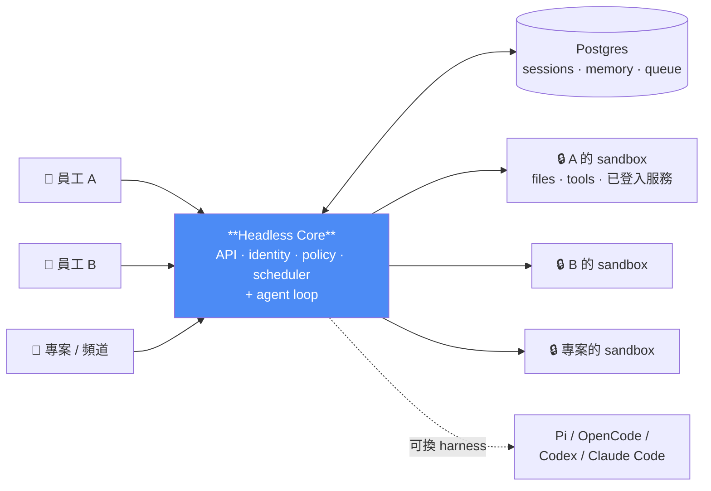
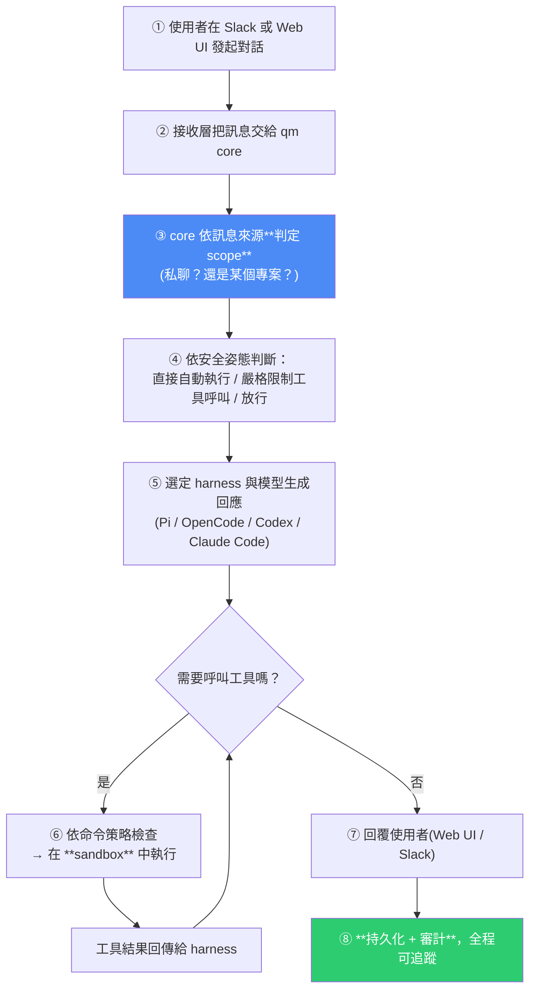
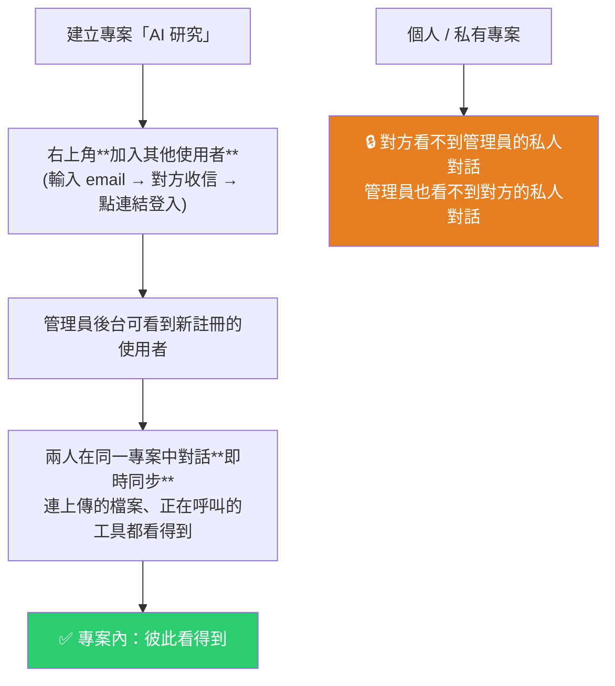

# qm(YC 開源):把個人 Agent 變成「多人可用」的 Agent Harness —— scope 隔離、權限審批與可換 harness

> 整理自 YouTube 頻道 **AI超元域**〈YC 開源內部自用下一代 Agent:qm 智能體〉(2026-08-03,約 15 分鐘);技術細節另**直接 clone [`yc-software/qm`](https://github.com/yc-software/qm) 讀原始碼與 `README.md` / `SECURITY.md`** 核實。
>
> 核心命題一句話:**多數 agent 是照「個人助理」設計的——你可以硬讓它服務整間公司,但很快就會變得極其複雜。qm 從第一天就是為「多人」設計的。**

---

## 一句話總結



**關鍵抽象是 scope(範圍)**:每個人、每個房間各自擁有獨立的 **memory、files、keychain 視圖、權限、cron、web app 與持久化 sandbox**。

---

## 一、它要解決的問題:個人 Agent 撐不起團隊

影片開場的脈絡整理得很清楚——OpenClaw 爆紅後大家開始讓 agent 接管瀏覽器、信箱、本機電腦,接著 Hermes Agent 也走紅。**但問題跟著來了:**

| 問題 | 具體情況 |
|---|---|
| **安全性** | 這些開源個人 agent 安全性不佳,容易被入侵甚至導致資料外洩;**很多企業因此禁止員工部署** |
| **想分享給別人用** | 個人部署後想讓朋友或家人也能用,**但一旦讓別人存取,就容易洩漏隱私**;甚至因他人操作不當導致自己的機器中毒 |
| **二次開發的坑** | 想改成團隊/公司可用,得**自己開發使用者系統、權限系統、資料庫、管理後台**,還要長期維護一份被大幅修改的程式碼——**上游一更新就陷入「無法升級」或「重新合併所有改動」的兩難** |

**qm 對第三點的回應**:把公司的模型配置、deals、sandbox、外掛與部署參數**與核心程式碼分離**,讓團隊保留客製能力、同時盡量不去改上游核心。

> 原始碼佐證:README 明講 **core 本身是通用的**,所有公司專屬的東西(org config、自訂工具與 skill、sandbox image、基礎設施)都住在一個由 `qm` CLI 驗證與部署的 **deployment directory**;每個 substrate(harness、session store、sandbox、memory)都在介面之後,**生產實作靠一個 wiring 檔就能換掉**。

### 影片轉述的 YC 背景

- YC 是全球最知名的創業加速器之一,累計投資/孵化超過 5000 家公司。
- **官方說法是他們曾用 Hermes 迴圈與內部工具跑超過 50 個 agent**,很快撞上設定漂移、憑證管理、任務失敗、共享資源與大規模維運等問題——**qm 就是這些經驗沉澱後的開源產物**。
- 開源不到一週獲得約 **8K star**。

> ⚠️ 影片作者自己也點出重點:**qm 真正值得關注的不是「YC 出品」或「幾天 8K star」,而是它瞄準了 OpenClaw 與 Hermes Agent 都沒有優先解決的問題。**

---

## 二、架構:它沒有自己的 agent 內核

這是最容易被誤解的一點,影片講得很明確:

> **qm 不像 OpenClaw 與 Hermes Agent 那樣具備自己的 agent 內核。它是透過呼叫 Pi Agent、OpenCode、Codex、Claude Code 這些成熟的 agent 工具來執行任務。**

原始碼佐證:README 寫著 **Pi、OpenCode、Codex、Claude Code 全都驅動同一個 core**,所以一個部署**不會被綁死在單一廠商**。

**執行流程**(影片整理 + 原始碼對照):



**原始碼細節補充**:agent 的**工具面很小且固定**,其中一個是 `execute`——它在該 scope 自己的隔離 sandbox 裡跑指令。那是這個 scope 的**「持久電腦」:裝過的工具會留著**。Web UI、admin panel、public portal 都只是 core HTTP API 之上的**可選 plugin**;Slack 是 core 啟動並監管的 in-process plugin。

技術棧:core 用 TypeScript 直接跑在 Node 上、HTTP 走 Fastify;Slack plugin 用 Bolt;Web UI 用 Vite 建置、Lit 渲染。

---

## 三、影片的實測:Web UI 有什麼

作者在本機部署,harness 選 **Pi Agent**、模型用 **GPT-5.6 Luna**(可換其他模型,也能接開源模型)。

**側邊欄功能**:新建對話、專案、對話紀錄、**檔案管理**、**定時任務**、**Keychain(鑰匙鏈)**、**部署應用**、**記憶**、**Skills(內建 19 個已啟用的 skill,可自建或安裝第三方)**。對話時還能設定**模型的推理層級**。

### 記憶系統測試

作者告訴 agent 一個使用習慣(「習慣用 Claude Code 寫程式碼、用 Codex 做 review」),觀察到:

1. agent **呼叫 skill、讀取記憶、然後改寫記憶**;
2. 點進「記憶」就能看到那條被記下的工作流;
3. **右上角有「歷史」可看記憶的更新紀錄**;
4. **記憶可以直接手動編輯、切換顯示視圖、逐條刪除**。

> 影片評語:**qm 自帶的記憶系統相當完整**——不只是能記,還能看歷史、能改、能刪。

### 多人協作與隱私隔離測試(本片最實在的一段)



- 專案內使用者數量**沒有限制**。
- 可在專案裡**上傳檔案讓 agent 分析**,另一位成員能即時看到那段對話、**看到它正在呼叫的工具與執行的命令**,側邊欄也看得到上傳的檔案。
- **設為私有的專案,其他成員看不到內容。**

> 這一段實測的價值在於:**它把「個人 ↔ 團隊」的邊界具體演示出來了**——共享專案給團隊、私人專案留給自己,兩邊的記憶與對話互不外洩。

---

## 四、安全設計(原始碼補充,影片未細講)

qm 的做法**跟本機 coding agent(OpenCode、Codex、Claude Code)同一路線**:**agent 以「它所服務的那個人」的身分行動,用那個人的憑證與權限,而且所做的一切都被稽核。**

**Org 選定一種安全姿態,較窄的 scope 只能收得更緊:**

| 姿態 | 行為 |
|---|---|
| **Strict** | **每一次 harness 工具呼叫都暫停等人核准**(只有兩個無副作用的 turn ender 例外) |
| **Auto**(預設) | 一個 classifier 在資料進到模型前,**篩選帶 provenance 標記的外部資料與工具結果**;部署方可指向自家的篩選 proxy |
| **Dangerous** | 不做內容篩選、工具呼叫之間不暫停 |

> ⚠️ **關鍵**:**預先宣告的命令政策**(對遞迴刪除、破壞性 SQL 這類操作的核准規則與硬性拒絕)**在每一種姿態都生效,包括 Dangerous。**

### ⚠️ 官方自己的免責很重要,值得跟影片語氣做平衡

`SECURITY.md` 寫得相當保守,這幾點應該跟「企業級安全全都有」的印象一起看:

- **「這是早期的實驗性軟體。按 scope 隔離是設計目標——這不等於承諾資料不會外洩,不是認證,也不能取代針對特定部署的安全審查。」**
- **qm 並不是一個強化過的公開或多租戶服務邊界**;它目前假設的是「單一組織、已認證的內部使用者」。
- 訪客與外部使用者在互動邊界之外(除了部署方明確、admin 控制的 Slack 外部參與者例外)。**已發布的 app 是刻意的例外**:持有能力連結只授權存取那個 app,**不會建立 qm principal、也不授權與 agent 或控制平面互動**。

---

## 五、部署與貢獻方式(原始碼)

**部署**:建立一個依賴 `@yc-software/qm` 的組織自有部署 repo:

```bash
npm exec --yes --package=@yc-software/qm@latest -- \
  qm init . --org <slug> --target <fly-or-aws>
npm install
```

初始化會**生成一個給 agent 用的部署 skill**,帶著你走過基礎設施、網頁登入、connector 憑證、選用的 Slack 存取、部署與線上驗證——**不需要 checkout 原始碼**。每個部署跑在**營運方自己的雲端帳號**裡。

> 影片作者的實務建議:**別手動裝**。直接讓 Codex / Claude Code 讀 README(或他寫的安裝筆記)自動幫你部署——「在 AI Agent 時代完全不需要手動配置」,手動容易浪費時間又配置錯誤。

**另一種客製路線**:有些組織想把整份程式碼放在一起,好讓工程師與 coding agent 同時讀 core 與客製內容,那就維持一個**私有 fork**(以 qm 的 clone 為歷史起點、core 與上游保持一致)。

**⭐ 貢獻方式很特別**:官方**只收「人寫的文字」,不收程式碼**——你在 `adrs/` 放一個 `.txt` 或 `.md` 非正式描述你想要的改動,對齊之後由他們實作。漏洞請私下回報,不要開公開 issue。

---

## 六、應用案例

### 案例 1|判斷「你到底需不需要 qm」的三個問題

qm 的複雜度不低(要跑 Postgres + core + Web UI + admin + auth + portal 等多個服務)。照它的定位,只有以下情況才值得:

1. **會有第二個人用嗎?** 只有你自己用 → 個人 agent(OpenClaw/Hermes/Claude Code)就夠,別上 qm。
2. **不同人的對話、記憶、憑證必須互不可見嗎?** 這正是 qm 的核心價值;如果大家共用一個帳號也無所謂,那不需要。
3. **你需要「誰在什麼時候做了什麼」的稽核紀錄嗎?** 這是企業導入的硬需求,也是個人 agent 最缺的一塊。

### 案例 2|「二次開發個人 agent」是條該避開的路

影片點出的那個兩難很真實:自己改個人 agent 加使用者系統與權限,**上游一更新就卡死**。

**通用原則:當你發現自己在為一個開源專案補「它架構上沒打算支援的東西」時,那通常不是二次開發問題,是選型問題。** 個人 agent 的單使用者假設寫在骨子裡,不是加個登入頁就能改的。

### 案例 3|把「安全姿態分級」抄進自己的 agent

即使不用 qm,**Strict / Auto / Dangerous 三檔 + 「命令政策在所有檔位都生效」**這個設計值得直接借用:

- 讓風險等級可**依組織統一設定、子範圍只能更嚴**(而不是每個人各自為政);
- **但把「遞迴刪除、破壞性 SQL」這類紅線做成無法被姿態關掉的硬性規則**。

📌 這跟本庫 [[google-agentic-engineering-day4-5]] 講的 zero-trust 三層(sandbox / 高風險動作人工簽核 / 套件來源控制)是同一套思路,也呼應 [[neuro-symbolic-ontology-guardrails-frank-coyle]] 的「純粹的智能體不該有直接改資料庫的特權」。

### 案例 4|記憶要「可看、可改、可刪、有歷史」

影片實測中最值得抄的產品細節:**記憶不是黑盒**——能看到它記了什麼、什麼時候改的、可以手動編輯與逐條刪除。

多數自建 agent 的記憶都是「寫進去就沒人看得到」,結果是**錯誤的記憶會一直污染後續對話而你不知道**。加一個記憶檢視/編輯介面(哪怕只是一個 Markdown 檔)成本很低、收益很大。

📌 本庫 [[project-cairn-experience-to-knowledge-skill]] 與 [[self-improving-knowledge-base-claude-cowork]] 走的也是同一條路:**把記憶落成人看得懂、改得動的檔案。**

### 案例 5|對照本倉庫的做法

我們目前的模式是**單人 + 檔案系統記憶**(`CLAUDE.md` + `SCHEDULES.md` + git 歷史),沒有多使用者需求,所以 **qm 對我們不適用**——照案例 1 的三問,三題答案都是「否」。

但有兩點可以借:**①安全姿態的概念**(我們的 cron 目前沒有 sandbox,只靠「精準 git add」「不空 commit」這類規則,屬於「Dangerous + 命令政策」);**②稽核**(我們的稽核實質上是 git 歷史,這其實不差,但沒有 token 花費與執行時間的紀錄)。

---

## 重點回顧(TL;DR)

- **定位**:qm 是 **multiplayer agent harness**——多數 agent 照個人助理設計,硬給公司用會爆炸;**qm 從第一天就為多人設計**。
- **核心抽象是 scope**:每個人、每個房間各有獨立的 **memory / files / keychain / 權限 / cron / web app / 持久化 sandbox**。
- **⭐ 它沒有自己的 agent 內核**:Pi、OpenCode、Codex、Claude Code **驅動同一個 core**,部署不綁單一廠商。
- **架構**:Postgres + headless core(API/identity/policy/scheduler + agent loop)+ per-scope sandbox;**工具面小而固定**,`execute` 在 sandbox 裡跑,那是該 scope 的「持久電腦」。Web UI/admin/portal 都是可選 plugin。
- **它解決的第三個痛點常被忽略**:二次開發個人 agent 會陷入「上游一更新就無法升級或要重新合併」——qm 把**公司客製與核心程式碼分離**(deployment directory + 介面化 substrate)。
- **實測亮點**:記憶系統**可看歷史、可手動編輯、可逐條刪除**;專案可邀請成員(人數無限)、對話與檔案即時同步;**私有專案彼此看不到**。
- **安全姿態三檔**:Strict(每次工具呼叫都等核准)/ Auto(classifier 篩選帶 provenance 的外部資料,預設)/ Dangerous;**但命令政策(遞迴刪除、破壞性 SQL 等)在所有檔位都生效**。
- **⚠️ 官方自己說得很保守**:早期實驗性軟體、**scope 隔離是設計目標不是承諾**、**不是強化過的公開或多租戶服務邊界**。
- **部署**:`qm init` 生成部署 skill 帶你走完流程,跑在你自己的雲帳號;**作者建議直接讓 Codex/Claude Code 讀 README 自動部署,別手動配置**。
- **貢獻方式特別**:只收**人寫的文字**(在 `adrs/` 放 `.md` 描述想法),不收程式碼。

---

## 來源

- AI超元域(YouTube),〈YC 開源內部自用下一代 Agent:qm 智能體〉(2026-08-03,約 15 分鐘):<https://youtu.be/TBVjqvueeCo>
  - ⚠️ 該片無官方字幕也無自動字幕,**逐字稿以 CPU 版 faster-whisper(small/int8,`vad_filter=True`)轉錄取得,非官方字幕**,可能有少量聽寫誤差(專有名詞如 qm、Pi Agent、OpenCode、Codex、Claude Code、Keychain、sandbox、GPT-5.6 Luna 等已依原始碼與上下文校正)。
  - 影片提供的安裝筆記:<https://github.com/win4r/mytest/blob/main/qm.md>
  - ⚠️ 影片轉述的「YC 曾跑 50+ 個 agent」「開源不到一週 8K star」等數字為影片說法,本文未另行查核。
- **專案原始碼**(本文的架構、安全姿態、部署與貢獻方式均據此核實):<https://github.com/yc-software/qm>
  - 特別參考:`README.md`(架構圖、harness 可換、deployment directory)、`SECURITY.md`(威脅模型與明確的限制聲明)。
- 延伸(本庫):[Codex Multi-agent V2 與 Graph Engineering(同作者)](./codex-multi-agent-v2-graph-engineering.md) · [Google 課程 Day 4+5:zero-trust 三層與驗收](../foundations/google-agentic-engineering-day4-5.md) · [本體論護欄與神經符號 AI](../foundations/neuro-symbolic-ontology-guardrails-frank-coyle.md) · [Project Cairn:經驗知識化](../memory-retrieval/project-cairn-experience-to-knowledge-skill.md) · [2026 Agent 工程師能力與面試題](../foundations/production-agent-engineer-skills-2026.md)
