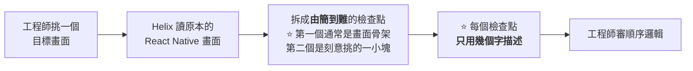
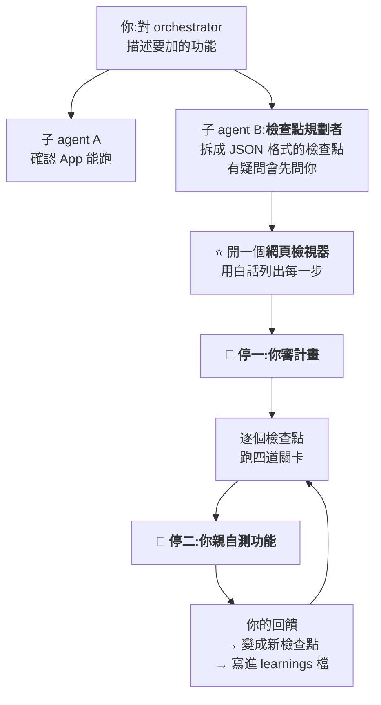

# Shopify Helix:用「檢查點 + 四道關卡」讓 AI 寫完的東西過得了關,以及怎麼在 Claude Code 裡自己搭一套

> 整理自 YouTube 頻道 **AI LABS**〈[Shopify Just Released The Greatest Claude Code Workflow Ever](https://www.youtube.com/watch?v=bBMp5tLxShQ)〉(2026-09-24,約 14.9 分鐘)。
> **該片自動字幕下載連續遇到 HTTP 429,逐字稿改以 CPU faster-whisper 轉錄英文原音取得,非官方字幕。**
>
> ⚠️⚠️ **立場揭露:該片有 Hedra 業配段落(附優惠碼),片中做好的 skill 需加入付費社群 AI Labs Pro 才能取得。** 本文只整理公開講述的方法,不轉述付費素材。
>
> ⭐⭐⭐ **本文已讀 Shopify 官方工程部落格兩篇原文核實**:[Helix 介紹](https://shopify.engineering/helix)與[回歸原生的決策](https://shopify.engineering/back-to-native)。
> ⚠️⚠️ **抓到一處會改變理解的錯誤:300 個畫面的 Shopify 主 App 還沒遷移完**(見 §一)。
>
> 📌 **本文分兩層:§一到 §三是 Shopify 官方怎麼做(已核實);§四之後是 AI LABS 在 Claude Code 裡的**自行重建版**,兩者有幾處刻意的差異(見 §五)。**

---

## 一句話總結

> ⭐⭐⭐ **Shopify 官方原文:「An attempt is allowed to be wrong. It is not allowed to ship until it isn't.」
> —— 嘗試可以是錯的;在它變對之前,不准交付。**
>
> ⭐⭐ **影片把核心差別講得很清楚:**
> **「規則(rule)只是建議,agent 做著做著就忘了;關卡(gate)不一樣 —— 沒過關,它就不能往下一步走。」**

---

## 一、⚠️⚠️ 先把背景講對:Shopify 在做什麼、做完了沒

**⭐ 已核實(Shopify 官方):**

| 項目 | 實際情況 |
|---|---|
| **遷移方向** | ⭐ **從 React Native 回到原生(Swift / Kotlin)** |
| **為什麼** | ⭐⭐ **「coding 模型大幅進步後,用 Swift 和 Kotlin 各做一次同樣的功能,已經不再有過去的成本」** —— agent 可以拿 iOS 版當參考寫 Android 版,反之亦然 |
| ✅ **已完成的** | **Shop App:從概念驗證到上架,12 週** |
| ⚠️⚠️ **300+ 畫面的 Shopify 主 App** | ⚠️⚠️ **「遷移進行中,今年稍晚上線」** |

> ⚠️⚠️⚠️ **影片開場說「Shopify 剛用 AI coding agent 重建了主要的行動 App,300 個畫面全部完成」—— 這不正確。**
> **完成的是較小的 Shop App;300 個畫面的主 App 截至官方發文時仍在進行中。**
>
> ⚠️ **影片說明欄還寫了「React Native Claude Code agentic workflow」,容易讓人以為 Helix 是在寫 React Native ——
> ⭐ 實際方向相反:React Native 是**被遷移走的來源**,目標是原生。**

### ⭐⭐ 這件事本身就很值得記下來

> ⭐⭐⭐ **「agent 降低了共用程式碼的好處,而各平台原生開發的好處仍然在。」**
>
> **過去選跨平台框架,主要是因為「同一個功能寫兩次太貴」;
> 當 agent 讓「寫兩次」變便宜,權衡就翻過來了。**

📎 **這和本庫 [[system-one-models-jev-calibrated-decisions]] §十一的傑文斯悖論是同一類現象:**某件事的成本降一個數量級,原本的架構取捨就會跟著改**。**

---

## 二、⭐⭐⭐ Helix 是什麼(✅ 官方原文)

> **「Helix 是一組工具與 skill,幫助 LLM 在遵循一套**高度主觀的架構規範**下,把 React Native App 的功能與畫面遷移過去。」**
>
> ⭐⭐ **它不期待第一次就做對,而是「把工作拆小、邊做邊向工程師學習、每一步都自動化更多一點」。**

### ⭐⭐⭐ 核心:檢查點(checkpoint),由簡到難

**⭐ 為什麼要由簡到難(影片的說明很好懂):**

> **「每個檢查點都建在前一個之上 —— **如果早期的決定錯了,你會在它還小、還便宜的時候就抓到**。」**

**⭐⭐ 為什麼要小(✅ 官方原因):**

> **「小檢查點也放得進小的 context window,讓 agent 可以**直接讀參考程式碼的相關部分**,而不是依賴一份巨大的規格文件。」**

📎 **子 agent 每次拿到乾淨的 context,避免長任務後期品質下滑 —— 這與本庫 [[cloudflare-security-audit-skill-pipeline]] 的「每個獵人只負責帳本上的一格」是同一個思路。**

---

## 三、⭐⭐⭐ 四道關卡(✅ 官方原文)

**每個檢查點都要依序通過四關,才能開始下一個:**

| 關卡 | ⭐ **Shopify 官方做法** |
|---|---|
| **① 行為關** | **agent 分析參考 App 怎麼運作、照著重做,再用**命令列行為測試**驗證功能 —— ⭐ 用 CLI 而非模擬器,迭代快** |
| **② UI 關** | ⭐⭐ **用 Gemini 做審查**:官方說 Gemini「空間感很好」,能抓出間距與大小的細微差異。**它必須列出每一個差異,附上嚴重度與螢幕位置**;⭐ **能用程式修的差異,預設一律視為阻擋項** |
| **③ 對抗式審查關** | ⭐⭐⭐ **兩個獨立、context 互相隔離的審查 agent**,依據 Shopify 寫好的標準檢查新程式碼。**每一個發現都必須修掉;迴圈重複直到兩個審查者都核准** |
| **④ 工程師核准** | **工程師看程式碼和執行中的 App,判斷是否符合預期** |

### ⭐⭐ 兩個值得注意的細節

**① UI 關比對的對象是「正在跑的原版 App」**

> ✅ **官方:比對「實作與參考畫面在**相同狀態下**的截圖」—— 對照的是正在執行的 React Native 原版,不是設計稿。**

**② 工程師的回饋會進 Helix 的記憶**

> ✅ **官方:工程師的回饋同時送給 agent(重跑關卡)與 Helix 的記憶系統,**用來改善之後的檢查點**。**
> ⭐ **這就是「每一步都自動化更多一點」的具體機制。**

> ⭐⭐⭐ **官方對整個方法的一句總結:**
> **「我們不再追求完美的第一次嘗試,而是開始追求**可靠的收斂**。」**

---

## 四、⭐⭐ AI LABS 在 Claude Code 裡自己搭的版本

> **Helix 是 Shopify 內部工具,沒有開源(官方文中未提及開源)。AI LABS 照著公開的方法,在 Claude Code 裡搭了一套,並在一個 HR 系統的示範專案上加功能測試。**

### 4.1 ⭐⭐ 整體結構:一個 orchestrator skill,只停兩次

**⭐ 一個實用的小設計:JSON 給 agent 讀,網頁給人看**

> **「JSON 結構清楚,agent 容易找到需要的東西;但對人來說,它是一大塊結構化文字,很難讀。」**
> ⭐ **所以另外做了一個簡單的網頁檢視器,**並要求規劃者用白話寫**,方便人審。**

> ⭐⭐ **影片特別強調:審計畫這一步要**仔細做** ——
> 「這樣你才知道計畫沒有漏掉功能,agent 花在實作上的時間才不會白費。」**

### 4.2 ⭐⭐⭐ 讓 agent 不能「提早收工」:Stop hook

> ⭐⭐⭐ **「一條規則是 agent 會忘掉的東西;一道關卡是它無法用話術說服你放行的東西。」**

**做法:在 agent 每次試圖停下來時跑一個 hook,回傳 exit code 2,告訴它「還沒做完,繼續」。**
**影片說這個概念借自 Ralph loop。**

**✅ 官方文件核實:Stop hook 回傳 exit code 2 會「阻止 Claude 停下來,讓對話繼續」。**

> ⚠️⚠️ **本文補充一個影片沒提、但很重要的風險:這種 hook 如果寫成「一律擋」,可能會**無限迴圈**。**
> ⭐ **官方的做法是在 hook 裡檢查輸入的 `stop_hook_active` 欄位,為 `true` 時就放行。**
> 📎 **本庫 [[claude-code-hooks-complete-guide]] §10.2 有完整寫法,並建議三道保險:`stop_hook_active`、關卡通過狀態記錄、次數上限。**

### 4.3 ⭐⭐ 四道關卡的 Claude Code 版

| 關卡 | **AI LABS 的做法** |
|---|---|
| **① 行為關** | **先由子 agent 依計畫寫測試(一開始全部失敗)→ 另一個子 agent 寫程式 → 再一個子 agent 跑測試,全過才放行**。⭐ **不需要瀏覽器能驗的,都在這關用程式碼測掉**(例:主管能不能核准某人的假) |
| **② UI 關** | ⚠️ **沒有原版 App 可以比,所以先做 HTML 原型**,再依 `design.md` 比對。**兩個 Claude 子 agent 並行:一個看外觀、一個看行為;⭐ 兩者都看不到專案指示,只拿原型與 `design.md` 判斷**。比對前會先確認原型與 App 處在**相同狀態**(例:表單送出前 vs 送出後)。**不是每個檢查點都需要這關** |
| **③ 對抗式審查關** | ⚠️ **改成「一個挑毛病、一個修」的來回迴圈**:對抗 agent 假設程式有錯去找問題,修復 agent 修,直到對抗 agent 核准 |
| **④ 人工審查** | **全部檢查點完成後,你實際操作測試;要改的地方變成新檢查點,重新跑所有關卡,並寫進每個 agent 開工前都會讀的 learnings 檔** |

---

## 五、⭐⭐⭐ 重建版和 Shopify 原版的三個差別(本文整理)

| 項目 | Shopify 官方 | AI LABS 重建版 | ⭐ **本文評估** |
|---|---|---|---|
| **UI 關的比對對象** | **正在跑的原版 App** | **HTML 原型 + `design.md`** | ⭐ **合理的調整** —— 新功能沒有原版可比。⚠️ **但這樣 UI 關的品質就取決於原型做得好不好** |
| **UI 審查模型** | **Gemini**(官方說空間感好) | **Claude 子 agent** | ⚠️ **影片說「不需要 Gemini 或 OpenAI 模型」,但沒有提供兩者準確度的比較**;Shopify 選 Gemini 是有理由的 |
| ⚠️⚠️ **對抗式審查** | ⭐ **兩個獨立、互相隔離的審查者,兩個都要核准** | **一個審、一個修** | ⚠️⚠️ **這個改動少了一個重要的性質**:原版有**兩個獨立判斷**互相補盲;重建版只剩**一個審查者**的判斷。修復者只是執行,不提供第二意見 |

> ⭐⭐ **第三點特別值得注意。**
> **Shopify 用兩個「獨立、context 隔離」的審查者,正是為了避免單一審查者的盲點 ——
> 這跟本庫 [[cloudflare-security-audit-skill-pipeline]] 的「驗證者不能是發現者」、
> [[astra-vs-fable-find-bugs-vs-fix-bugs]] 的「找 bug 與修 bug 是兩件事」是同一個原則。**
> ⚠️ **如果你要照著搭,建議保留兩個獨立審查者,修復者另外加。**

---

## 應用案例

### 案例 1|⭐⭐⭐ 不用整套搭,先把「規則」升級成「關卡」

**找出你在 CLAUDE.md 裡寫了、但 agent 常常忘記的規則,挑一條最重要的改成關卡:**

| 原本是規則 | 改成關卡 |
|---|---|
| **「寫完要跑測試」** | ⭐ **Stop hook:測試沒全過就擋下(記得檢查 `stop_hook_active`)** |
| **「不要改 migration 檔」** | **PreToolUse hook:寫入該路徑直接拒絕** |
| **「commit 前要 lint」** | **pre-commit hook** |

> ⭐⭐ **判斷標準:這條規則如果被忘了,後果嚴不嚴重?嚴重的就不要只寫在文件裡。**

### 案例 2|⭐⭐ 檢查點拆法:先骨架,再一小塊

**Shopify 的經驗是:**

| 順序 | 內容 |
|---|---|
| **第一個** | **畫面骨架** |
| **第二個** | ⭐ **刻意挑的一小塊** |
| **之後** | **逐步變複雜** |

> ⭐⭐ **每個檢查點只用幾個字描述** —— 你審的是「順序合不合理」,不是細節。

### 案例 3|⭐ 做一個讓人能審的計畫檢視器

> **agent 產生的計畫用 JSON 存,另外生一個白話的 HTML 頁面給你看。**
> ⭐ **這樣「審計畫」這個人工步驟才真的會被認真做,而不是掃一眼就按同意。**

---

## 重點回顧(TL;DR)

1. ⭐⭐⭐ **核心原則(Shopify 原文):「嘗試可以是錯的;在它變對之前,不准交付。」**
2. ⚠️⚠️ **補正:300 個畫面的 Shopify 主 App 還在遷移中,今年稍晚上線**;12 週完成的是較小的 Shop App。**遷移方向是從 React Native 回到原生 Swift / Kotlin。**
3. ⭐⭐ **為什麼回原生**:agent 讓「同一功能寫兩次」變便宜,跨平台共用程式碼的好處變小,原生的好處還在。
4. ⭐⭐⭐ **檢查點由簡到難**:第一個通常是畫面骨架,早期錯誤在還小的時候就抓到;**小檢查點放得進小 context,agent 能直接讀參考程式碼**。
5. ⭐⭐⭐ **Shopify 的四道關卡**:① CLI 行為測試 ② **Gemini** 比對截圖(列出每個差異與嚴重度)③ **兩個獨立、互相隔離的審查者,都核准才過** ④ 工程師核准;**回饋會進 Helix 記憶**。
6. ⭐⭐ **「規則是建議,關卡是強制」**:AI LABS 用 **Stop hook 回傳 exit code 2** 讓 agent 不能提早收工(✅ 官方文件核實)。⚠️ **本文補充:要檢查 `stop_hook_active` 以免無限迴圈。**
7. ⭐ **AI LABS 版本**:一個 orchestrator skill,只停兩次(審計畫、測功能);計畫用 JSON 給 agent、用網頁給人。
8. ⚠️⚠️ **重建版的一個弱化**:把「兩個獨立審查者都要核准」改成「一個審、一個修」,**少了第二個獨立判斷**。
9. ⭐ **UI 關改用 HTML 原型 + `design.md` 比對**,合理但品質取決於原型;**Claude 取代 Gemini 的效果沒有給出比較數據**。
10. ⚠️ **立場**:含 Hedra 業配;做好的 skill 需加入付費社群才能取得。

---

## 核實狀態

### ✅ 已核實(Shopify 官方工程部落格)

| 項目 | 結果 |
|---|---|
| **Helix 的定義、檢查點由簡到難、第一個通常是骨架** | ✅ |
| **四道關卡的內容、Gemini 用於 UI 審查及其理由** | ✅ |
| **兩個獨立審查者、都核准才通過** | ✅ |
| **「An attempt is allowed to be wrong…」** | ✅ |
| **回饋進入 Helix 記憶** | ✅ |
| **Shop App 12 週完成;主 App 300+ 畫面遷移中** | ✅(⚠️ 與影片說法不同) |
| **Stop hook exit code 2 會阻止停下** | ✅(Claude Code 官方文件) |

### ⚠️ 未能核實

- ⚠️ **AI LABS 重建版的實際效果** —— **只有影片示範,沒有公開 skill(需付費社群),無法重現。**
- ⚠️ **影片說「即使有 Shopify 的流程,agent 還是會搞砸,我們的一個改動完全解決了問題」** —— **影片沒有提出數據佐證「完全解決」。**
- ⚠️ **Helix 是否開源** —— 官方文中未提及,本文依此判斷為內部工具。

---

## 來源

- [Shopify Just Released The Greatest Claude Code Workflow Ever — AI LABS](https://www.youtube.com/watch?v=bBMp5tLxShQ)(2026-09-24,約 14.9 分鐘;**自動字幕連續 HTTP 429,逐字稿以 CPU faster-whisper 轉錄英文原音取得**)
- ⚠️ **立場**:該片含 Hedra 業配(附優惠碼);片中做好的 skill 在付費社群 AI Labs Pro。
- ⭐⭐⭐ **一手素材**:
  - [Helix: The internal tool powering our Shopify app's native migration — Shopify Engineering](https://shopify.engineering/helix)
  - [Native is now the future of mobile at Shopify — Shopify Engineering](https://shopify.engineering/back-to-native)(**§一補正的依據**)
  - [Hooks reference — Claude Code 官方文件](https://code.claude.com/docs/en/hooks)(Stop hook exit code 2)
- 延伸:本庫 [[claude-code-hooks-complete-guide]](⭐ `stop_hook_active` 防無限迴圈)、[[cloudflare-security-audit-skill-pipeline]](驗證者不能是發現者)、[[astra-vs-fable-find-bugs-vs-fix-bugs]](找 bug 與修 bug 是兩件事)、[[loop-engineering]]、[[harness-engineering-evolution]]。
