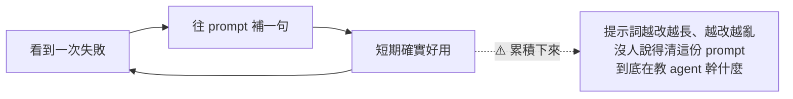
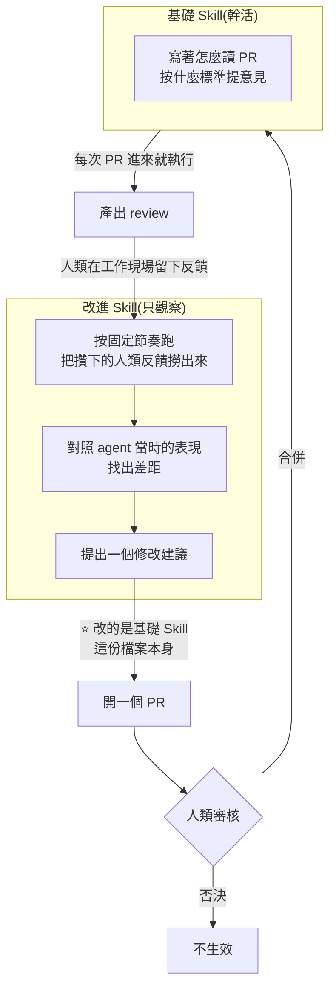
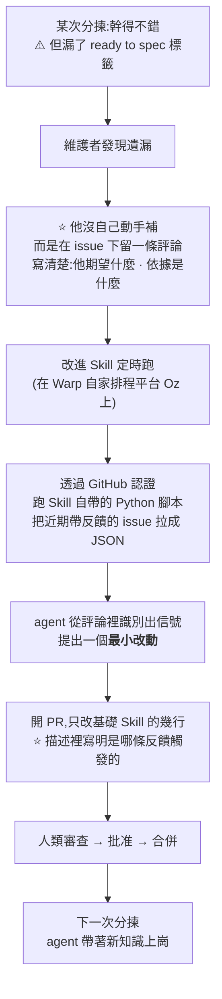
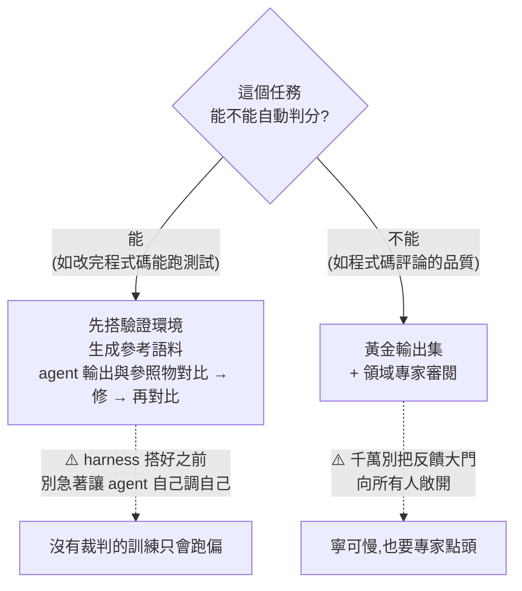

# Skill Doctor:讓 Agent 自己改自己的說明書 —— 但改動要走 PR、過 CI、有人審

**主題分類:** AI Agent / 應用 —— 自我改進閉環與 Agent 知識沉澱
**來源影片:** YouTube〈Skill Doctor:会自我改进的 Agent〉(Why QQ / 為什麼叫 QQ,2026-09-07,約 8.9 分鐘,**官方 zh-Hans 字幕**)
**一手素材:** Anthropic 的 Warp 案例(How Warp builds self-improving agents on Claude)、Warp 開源的 **skill-doctor** SKILL.md、Anthropic 的 Agent 評估指南

**整理日期:** 2026-09-08

> 📎 相關筆記:[[building-claude-skills]](Skill 的製作與維護)、
> [[agent-skill-three-layer-run-do-verify]](跑/做/驗三層)、
> [[claude-md-cut-82-percent-and-maintain-it]](§9 提示詞負債與 Ablation,**本文是它的另一種解法**)、
> [[ai-native-sdlc-landing-checklist]](把 Agent 產出納入工程流程的完整版)

---

## 0. 一句話總結

> **你花三個月調教 AI 助手,開個新會話一切歸零。
> 根本原因不是模型記性差,是「反饋的壽命」—— 你的每一句糾正只活在當前會話裡。**

Warp 的解法一句話講完:

> ⭐⭐⭐ **讓 Agent 自己修改自己的說明書檔案,但改動要走 PR、過 CI、人審核合併之後才生效。**

📌 **核實補充(這句最該記住,影片沒說):**
**這套做法不重新訓練任何東西 —— 它改的就是一個 markdown 檔、開一個 PR。
所以一個三人小團隊、沒有 GPU 預算也照抄得動。**

---

## 1. 問題:提示詞會蒸發,而補丁只會越補越亂

Warp 內部有個跑在 Claude 平台上的 **code review agent**,工程師用一陣子後開始抱怨:**評論沒用、輸出品質差。**

**他們一開始的做法很常規** —— 手動改提示詞,看到一次失敗案例就往 prompt 裡補一句。

⚠️ 他們也維護過 `AGENTS.md` 之類的上下文檔案 —— **有幫助,但治不了本。**

> ⭐⭐ **真正的病根在「反饋的壽命」:你對 agent 說的每一句糾正,只活在當前會話裡。
> 會話一結束,經驗清零,下次它照樣犯同樣的錯。**

📎 這與 [[claude-md-cut-82-percent-and-maintain-it]] §9 的「提示詞負債」是同一個病 ——
**那篇的解法是定期做 Ablation 把它砍掉;這篇的解法是給它一條可審核的成長通道。**

---

## 2. ⭐⭐ 機制:兩個 Skill,一個幹活、一個當觀察者

| | 基礎 Skill | 改進 Skill |
|---|---|---|
| **職責** | **幹活** | ⭐ **自己不幹活,只當觀察者** |
| **內容** | 流程、原則、注意事項(純文字) | 撈反饋 → 對照表現 → 提修改建議 |
| **它改什麼** | — | ⭐ **基礎 Skill 這份檔案本身** |

📌 **核實:Anthropic 官方案例的描述完全一致** ——
**「一個任務專屬的基礎 skill 產出工作;人類在該工作已經存在的地方留下反饋;
一個排程的 improver 收集反饋並提出一個小改動;而一個經人類審核的 PR 決定這個改動要不要進入基礎 skill。」**

### ⭐⭐⭐ 為什麼一定要落在「檔案」上

> **因為檔案能進 git。進了 git 就有 diff、有 review、有版本歷史,出問題還能回滾。**

| 存哪裡 | 問題 |
|---|---|
| **塞進提示詞** | ⚠️ **隨會話蒸發** |
| **存進資料庫** | ⚠️ **黑箱難查** |
| ⭐ **寫成檔案** | **它就是團隊資產,走和程式碼一樣的工程流程** |

### ⭐ Warp 創辦人 Zach Lloyd 的區分(很多團隊到今天都沒想清楚)

> **Skill 寫的是「流程」,相對穩定,改動要慎重。**
> **記憶是 agent 推理時隨手寫的,一直在變。**
> **這兩樣東西,別混在一起。**

---

## 3. 一個真實案例:漏了一個標籤

Warp 開源倉庫有個 **issue 分揀 agent**,有人提新 issue 就由 GitHub Action 觸發:分析複雜度、打標籤、給修復方向。

⭐ **兩個值得抄的工程細節:**

1. **腳本打包在 Skill 裡,常用操作做成工具** —— **別讓 agent 每次現場寫程式碼。**
2. **PR 描述裡寫明「是哪條反饋觸發了這次修改」** —— 這就是 §5 說的「改進要有證據」。

---

## 4. ⚠️⚠️ 最容易做錯的一步:不能照單全收反饋

**很多人會想:那把使用者反饋全收進來,agent 不就越來越強了嗎?**

> ⚠️ **Warp 在最佳實踐裡寫得很直白:假設反饋一定會出錯。**
> 有人會提錯誤的需求,有人帶著個人偏好亂指揮 ——
> **agent 要是照單全收,說明書很快就變成垃圾場。**

**他們的做法:**

| 措施 | 說明 |
|---|---|
| 給 agent 足夠的上下文做**合理性檢查** | 篩選誰的意見算數 |
| ⭐ **在過濾或最終審核環節,始終留一個人** | 人有一票否決權 |

> ⭐⭐ **「反饋的品質比數量重要。」**
> **一條資深工程師寫的具體反饋**(例如指出某類全域變數的命名約定)——
> **比一百個點讚點踩值錢得多,因為點讚不說原因。**

### ⭐ 而且採集反饋必須「零成本」

> **入口直接放在 PR 與 issue 的評論區,順手寫一句就行。**
> Zach 的判斷:**「摩擦一高,信號就斷。」**

---

## 5. ⭐⭐ 分層:改進能不能自動確認,取決於任務類型

> ⭐ **這個分層很實用:先問「任務能不能自動判分」,再決定反饋回路能自動到什麼程度。**

📌 **Anthropic 的 agent 評估指南把體系講得更完整 —— 三種評分器搭配著用:**

| 評分器 | 特性 |
|---|---|
| **程式碼檢查** | 快且客觀 |
| **模型評分** | 能抓模糊地帶 |
| **人評** | ⭐ **金標準,也最貴** |

配合:**自動化評測做回歸、人類評審做校準、線上監控兜底。**

---

## 6. ⭐⭐ Warp 開源的 skill-doctor 到底做什麼(已讀原始 SKILL.md 核實)

它做的正是上面那個「中間層」。

| 項目 | 實際做法(核實自 SKILL.md) |
|---|---|
| **輸入** | 你**本地真實的** agent 會話紀錄 |
| **評分** | 對兩份 rubric 評分:**efficiency** 與 **code-quality**;每份逐字稿得到 label、數值分數、**以及一段 1–3 句、引用逐字稿具體內容的理由** |
| ⭐ **只從失敗取證** | **`failed_conversations` 的定義是:至少有一項適用的效率或程式碼品質分數低於 `0.5`** |
| ⭐⭐ **證據原則** | **「建議與修改必須追溯到 `failed_conversations` 裡觀察到的浪費或缺陷,而不是泛泛的最佳實踐。」** |
| **輸出** | 現行與提議版本之間的 **unified diff**;**只改證據所能支持的部分**。新 skill 則整份內容當作新增 |
| ⭐ **隱私(影片完全沒提)** | **「一切都在本地執行。絕不要把逐字稿、session 檔或它們的任何片段上傳到任何地方。」** 唯一可分享的產出是渲染後的 HTML 報告 |

> ⚠️ 最後那條很重要:**你的 agent 會話裡有你的原始碼與內部脈絡。
> 任何「把 session 傳上雲端做分析」的工具,都要先問清楚這件事。**

⭐ 而改動還得過**受保護分支**的閘門:**必須通過狀態檢查、必須有人審、程式碼一變審批自動失效。**

> **這套機制管了人類工程師十幾年,現在原樣拿來管 agent。**

---

## 7. ⭐⭐⭐ 真正的論點:瓶頸在反饋回路,不在模型

> **很多人覺得 agent 表現不好是模型不夠強、提示詞寫得不夠好。**
>
> ⭐ **但真相是:大多數團隊的瓶頸在反饋回路上。**
> 你給 agent 的糾正散在聊天記錄、口頭抱怨、PR 評論裡,**沒有任何機制把它們沉澱下來。
> 模型再升級,這個漏洞還在。**

⭐⭐ **本質上這是組織的知識管理問題,AI 只是載體:**

> **你的團隊怎麼對待一個重複犯錯的實習生,就怎麼對待 agent ——
> 寫下來、流程化、有人審核。**

---

## 8. ⭐⭐⭐ 應用案例:四個動作 + 三步起跑

### 一句話帶走版

> **把 agent 的每一次改進,當成一次程式碼提交來管理。**

拆開是四個動作:

| # | 動作 | 具體含意 |
|---|---|---|
| **①** | **改進要 diff 化** | 任何變化都是檔案上看得見的幾行修改。⚠️ **反對整段重寫** |
| **②** | **改進要可審** | 走 PR、走 CI、走分支保護。**人有一票否決權** |
| **③** | **改進要可回滾** | 改壞了 `git revert`,下一分鐘就恢復 |
| **④** | **改進要有證據** | 每條修改背後掛著觸發它的失敗案例。⚠️ **不接受拍腦袋的最佳實踐** |

> ⭐ **這四個動作沒有一個需要新發明工具 —— git 和 CI 早就準備好了。**

### 落到你自己團隊的三步

| 步驟 | 做法 |
|---|---|
| **①** | **挑一個抱怨最多的重複性 agent 任務**,把流程寫成一份 Skill 檔案。⭐ **寫原則,別寫死規則** —— **「告訴它關注重複程式碼,比列兩百條命名規範有用」** |
| **②** | **把反饋入口放在工作現場** —— PR 評論、issue 評論,零額外操作。**摩擦一高,信號就斷** |
| **③** | **配一個定時跑的改進 agent** —— 每週看反饋,提**一個最小的 PR**。**先小步跑通,再談推廣** |

⭐ Warp 自己也是**從一個 code review agent 開始**,慢慢鋪到規格撰寫、審查、分揀 —— **每個 agent 帶自己的閉環。**

---

## 9. 影片的產業推論(標為推測)

> ⚠️ 以下是影片作者的預測,**尚未發生**。

1. **Skill 檔案會成為團隊的重要資產** —— 像今天的 CI 設定與架構文件一樣,**進新人的培訓材料**。
2. ⭐ **改進 Skill 會高度複用** —— Warp 發現 **code review agent 的改進器和別的 agent 的改進器結構幾乎一樣**,寫一次處處能用。
3. ⭐⭐ **團隊之間的差距,會從「誰買了更強的模型」轉向「誰的反饋回路轉得更快」** ——
   **模型大家都能買,攢了幾千條高品質反饋的 Skill 庫買不來。**

📌 Warp 已在把這套循環產品化:跨全團隊的 agent 會話自動跑改進,指標可自訂成測試覆蓋率、任務遵從度,
再配看板盯合併時長、每個 PR 的成本與品質分。

> ⭐ 收尾那句值得記:
> **「Agent 不會自己變好,除非你給它一條可沉澱、可審核、可回滾的改進通道。
> 提示詞會消失,檔案會沉澱。」**

---

## 10. 核實狀態

### ✅ 已核實(比對一手來源)

| 說法 | 核實結果 |
|---|---|
| Warp 與 Anthropic 的自我改進 agent 案例存在 | **屬實**,Anthropic 官方有專文與 webinar |
| **基礎 Skill + 改進 Skill 的雙 Skill 架構** | **屬實**,官方描述為 base domain skill + improver skill |
| **人類在工作現場留反饋 → 排程改進器提小改動 → 人審 PR 決定是否進入基礎 skill** | **屬實**,為官方原文的流程描述 |
| **skill-doctor 對 efficiency 與 code-quality 兩份 rubric 評分** | **屬實** |
| ⭐ **只從 `failed_conversations` 取證,且定義為「至少一項分數低於 0.5」** | **屬實** |
| ⭐⭐ **「建議必須追溯到觀察到的浪費或缺陷,而不是泛泛的最佳實踐」** | **屬實**,為 SKILL.md 原文 |
| 產出 unified diff、只改證據支持的部分 | **屬實** |
| Zach Lloyd 為 Warp 創辦人 | **屬實** |

### ⭐ 影片未提、值得補上的兩點

1. ⭐⭐ **這套做法不重新訓練任何東西** —— 它改的就是一個 markdown 檔、開一個 PR。
   **所以三人團隊、沒有 GPU 預算也照抄得動。** 這是這個方法最重要的可及性論點,影片沒強調。
2. ⭐⭐ **skill-doctor 的隱私原則:一切在本地執行,絕不上傳逐字稿或其任何片段**,
   唯一可分享的是渲染後的 HTML 報告。**agent 會話裡有你的原始碼,這條不能忽略。**

### ⚠️ 未能獨立查證

- Warp 內部排程平台 **Oz** 的細節、issue 分揀 agent 漏掉 `ready to spec` 標籤的**那個具體案例**。
- 「提示詞越改越長越改越亂」的內部演進過程 —— 為影片轉述的敘事。
- §9 的三項產業推論 —— **為影片作者預測,非官方說法。**

---

## 來源

- [Skill Doctor:会自我改进的 Agent — Why QQ](https://www.youtube.com/watch?v=7eMuxmijN6I)(2026-09-07,約 8.9 分鐘,官方 zh-Hans 字幕)
- 一手素材與核實來源:
  - ⭐⭐ [warpdotdev/common-skills — skill-doctor SKILL.md](https://github.com/warpdotdev/common-skills/blob/main/.agents/skills/skill-doctor/SKILL.md)(**§6 的一手來源,已逐項比對**)
  - ⭐ [How Warp builds self-improving agents on Claude — Anthropic](https://claude.com/blog/how-warp-builds-self-improving-agents-on-claude)
  - [How Warp builds self improving agents on Claude — Anthropic Webinars](https://www.anthropic.com/webinars/how-warp-builds-self-improving-agents-on-claude)
  - [Warp Events 頁面](https://www.warp.dev/events/how-warp-builds-self-improving-agents-on-claude)

> ⚠️ 本文為對一支公開影片的整理與查證。§10 已逐項標示核實狀態。
> **§6 的 skill-doctor 細節出自實際讀取的 SKILL.md,§9 的產業推論為影片作者預測。**
