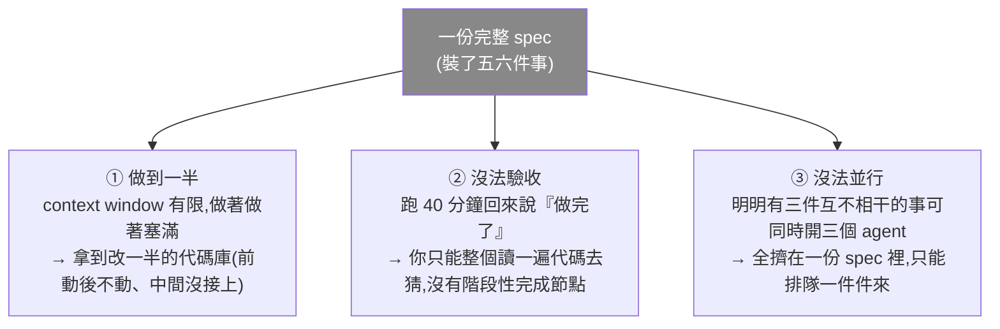
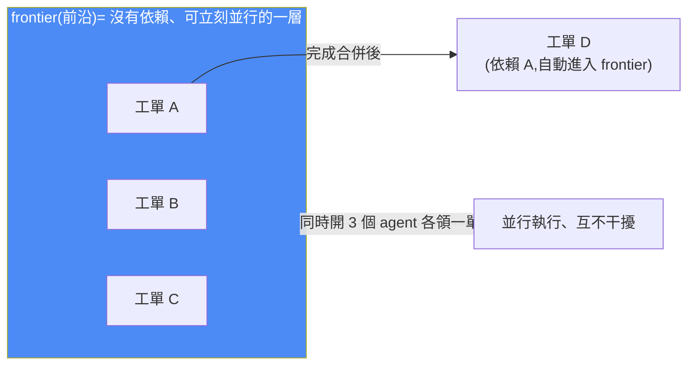

# to-tickets 深入實操:把 spec 拆成 agent「能穩定開工、單獨驗收、可並行」的工單

> 01Coder(小木頭)。Matt Pocock「18 萬星 skills」工程鏈三件套的第三支深入拆解——`to-tickets`。它讀取一份 spec,拆成**一張張能單獨開工、單獨驗收、標好依賴**的工單,發布到任務系統。本篇是 [[matt-pocock-skills-teardown]]「to-tickets」那一節的**實操細節版**(那篇講五個 skill 全貌,這篇專講「怎麼拆」與一個真實案例)。

---

## 一、問題:為什麼「把整份 spec 丟給 agent、說一句照著做」不行?

上一步 `to-spec` 已把「改造首頁」寫成七段結構齊整、還打上 `ready-for-agent` 標籤的 spec。看似萬事俱備,但整份交給 agent 會出三個問題:

> **關鍵洞察:一份 spec 是「一個想法的完整表達」,但它不是「一個工作單元」。** 中間缺的這一步,就是 `to-tickets` 要做的——把 spec 拆成能開工的狀態。

**三個 skill 一條工程鏈,各管一段:**
- `grill-me`:不斷提問,把你的意圖理解清楚;
- `to-spec`:把聊明白的內容清晰寫成 spec;
- `to-tickets`:**不再問需求**,只做一件事——把 spec 拆成能開工的工單。

---

## 二、最要緊的一件事:怎麼拆?——按功能「縱向切」,不按層「橫向切」

| | ❌ 大多數人的拆法(按層) | ✅ to-tickets(按功能縱向) |
|---|---|---|
| 做法 | 先把所有測試寫完 → 再把所有組件改完 → 最後統一改樣式 | 每張工單是一個**垂直切片**,穿透所有層 |
| 問題 | 聽起來有條理,但**中間任何時間點都沒有能拿出來看的東西**,你沒法在第三天說「這塊搞定了」 | 改一點邏輯 + 加一條測試 + 頁面上一個**肉眼可見的變化**;做完就能驗收 |
| 名稱 | — | **tracer bullet(曳光彈)**——打出去能看見整條飛行軌跡的子彈 |

> 🔎 **範例(首頁 spec 裡的一條):** 「首頁大圖老是被『每天一篇的早讀日報』頂掉,得改成鎖定最新一篇非早讀的長篇文章。」拆成**一張**工單,它**同時動三層**:內容選擇的邏輯 + 一條覆蓋邊界的測試 + 首頁那張肉眼可見的大圖。做完打開首頁就知道任務有沒有完成。
>
> **一張工單,不是「改完一層」,而是「做成了一件事」。**

---

## 三、第二件事:標出依賴關係 → 產出「並行調度信號」frontier

`to-tickets` 會在工單之間掛上**阻塞關係**(這張必須等那張完成)。聽起來像專案管理老一套,但**在 agent 時代用處變了**:

- **一旦依賴標清楚,那些沒有依賴的工單就是「可立刻並行開工的一層」——skill 裡叫 `frontier`(前沿)。**
- 你同時開三個 agent 各領一單、互不干擾;其中一張合併後,**依賴它的下一單自動進入 frontier**。
- 🔑 **所以這張依賴圖不是畫給人看的進度表,而是「給並行 agent 用的調度信號」。**

**標依賴有分寸**(這是拆解的手藝):
- **標少了會撞車**:兩個 agent 同時改同一塊代碼;
- **標多了影響效率**:本來能並行的三件事被排成一隊;
- **規矩:只標記「清晰、真實存在」的依賴。**

---

## 四、發布:兩種模式其實是同一份產物的兩種讀法

| | **GitHub 模式** | **本地文件模式** |
|---|---|---|
| 存法 | 一張工單一個 issue,依賴用 **GitHub 原生阻塞關係**掛上 | 項目裡開一個目錄,一張工單一個文件,按依賴順序編號 |
| 適合 | 多人 / 多 agent 協作的項目 | 自己一個人快速推進(不聯網、不污染任務列表) |

> **有意思的是:兩種是同一份產物的兩種讀法**——內容一樣,只是工單數據存哪的區別。所以你隨時可從本地那份改發到別的系統。

---

## 五、兩條很實用的規矩

### ① prefactor 先行(先讓改動變簡單,再做那個簡單的改動)

如果某個改動很難落實,就**先做一張「不改變任何行為」的工單**——把地方騰出來、把模塊抽取出來,讓後面每一步都變簡單。

> **範例:** 首頁 spec 的第一張工單,就是把「內容選擇的邏輯」抽取成一個函數。抽取完,頁面看上去**沒有任何變化**——但後面的改動都變簡單了。

### ② 大範圍重構是「垂直切片」的例外

垂直切片也有不適用的場景:比如給一個在 **40 個地方被用到的接口改簽名**——這種改動天生橫跨一層,硬拆成垂直切片只會更糟。這時用**另一種拆法(擴展-收縮)**:

**先加新的 → 讓新舊並存 → 把調用方一批一批遷過去 → 最後把舊的刪掉。** 三步三張工單,每步都能單獨合併,**代碼庫全程可用**。

---

## 六、最值得看的實操:為什麼 to-tickets 拆出 9 張而非 spec 數出的 6 張?

跑一遍後,`to-tickets` **拿到 spec 第一件事不是拆,是去讀代碼**(流程裡標「可選」,但這次執行了、很有效):

> **spec 裡有一條實現決策:「大圖選最新的、類型不是早讀的那篇」。聽上去沒問題。但它翻開代碼發現:這個過濾其實早就寫在那兒、首頁一直在用。那為什麼大圖還是被早讀頂掉?**
>
> **因為全站 57 篇早讀裡,只有 2 篇真的帶著那個類型標記,剩下 55 篇沒有 → 過濾形同虛設,早讀一路暢通進了首頁。** 照著 spec 把規則寫下去,會完全空轉。

> 🔑 **這就是為什麼它要先讀代碼:spec 寫的是「意圖」,代碼裡才有「真實的應用實現邏輯」,才是軟件的真實情況。** 所以它多拆出 3 張(讓早讀能被認出來、把標記補齊、列表改成混排)——全是 spec 沒寫、只有翻開代碼才看得見的。→ 共 **9 張**。

### 拆完不悶頭發布:反過來問你三件事

它會先把方案擺出來,問:**拆得對不對(太粗還是太細)?依賴關係對不對(有沒有要合併或再拆)?**

> **為什麼這步有必要:** 拆解機器能給一個很像樣的初稿,但「**哪兩件事在你腦子裡其實是一件、哪條依賴只是你怕衝突而不是真實的**」——這些只有你知道。

**作者的真實回答:** 粒度可以,但**第一張要再拆開**——因為那張裝了兩件性質完全不同的事:①改判定的邏輯(改一小段代碼立刻見效)②把 55 篇文章的標記補齊(一次批量的數據整理)。混在一張裡,做的人/agent 很難判斷什麼時候算完成。

> 🔑 **拆開還有個關鍵好處:後面那些工單只依賴「改邏輯」這張,不依賴「補數據」——因為補數據不改變任何行為,它不該阻塞任何任務。** 這正是「只標真實依賴」的實戰體現。

確認後才發布;打開 GitHub 能看到三條阻塞關係是**掛在原生字段上**(不是正文寫一句「依賴某某」的文字約定),GitHub 會真的把被擋住的工單標出來。

---

## 七、應用案例

1. **把「我想改改首頁」變成 9 張帶驗收標準的工單:** 這個案例本身就是範本——一句模糊想法 → grill-me 問明白 → to-spec 寫共識 → to-tickets 拆成可開工/可驗收/標好依賴的工單。過程比任何單一 skill 更值得留意。
2. **用 frontier 驅動多 agent 並行:** 拆完後,把 frontier 那層(無依賴工單)同時發給多個 agent;一張合併後下一張自動進入 frontier——這是 [[codex-multi-agent-v2-graph-engineering.md]] 講的「並行 subagent 調度」在**任務拆分層**的對應。
3. **prefactor 對付「難改的代碼」:** 遇到牽一髮動全身的改動,先做一張「純抽取、不改行為」的工單騰出空間——正是 [[ai-brownfield-codebase-five-steps]] 精神(先看懂再動手、小步進行)。
4. **大範圍改接口用擴展-收縮而非垂直切片:** 40 處引用的接口改簽名 → 加新的/新舊並存/逐批遷移/刪舊,三張可單獨合併、代碼庫全程可用。
5. **讓拆解 agent「先讀代碼再拆」:** 別讓它照 spec 字面數工單——spec 是意圖、代碼才是真實情況;先讀代碼常會發現 spec 沒寫的隱藏工單(本例的「早讀認不出來」)。

---

## 八、重點回顧(TL;DR)

- **問題**:整份 spec 丟給 agent 會做到一半、沒法驗收、沒法並行——spec 是「想法的完整表達」,不是「工作單元」。
- **怎麼拆**:按功能**縱向切(tracer bullet 垂直切片)**,一張工單穿透所有層、做完就能驗收;不按層橫向切。
- **標依賴 → frontier**:只標真實依賴;無依賴的工單就是可並行的 frontier,是「給並行 agent 的調度信號」。
- **兩種發布**:GitHub(協作)/ 本地文件(單人),同一份產物兩種讀法。
- **兩條規矩**:prefactor 先行(先讓改動變簡單);大範圍重構用擴展-收縮(加新→並存→遷移→刪舊)。
- **最有料**:to-tickets **先讀代碼**才拆(spec 是意圖、代碼是真實),本例因此從 6 張變 9 張;拆完反問你「粒度/依賴對不對」,只標不改行為的任務不該阻塞別人。

---

## 來源

- 影片:[18 万星 Skills 项目的工程链三件套之三 to-tickets - 把 spec 拆成 agent 能稳定开工的工单(01Coder,2026-07-23,官方 zh 字幕)](https://youtu.be/W973FsTECa8)
- 延伸(本庫):[Matt Pocock 的 AI 開發 skills 全拆解(五 skill 全貌)](./matt-pocock-skills-teardown.md)、[模型越強 Superpowers vs Matt Skills 該刪誰](./superpowers-vs-matt-skills-strong-model.md)、[Codex Multi-agent V2 與 Graph Engineering](./codex-multi-agent-v2-graph-engineering.md)、[AI 安全接手舊專案五步驟](../../ai-productivity/ai-brownfield-codebase-five-steps.md)、[Task Decomposition:把 SOP 拆成 agent 跑得動的工作流](../foundations/task-decomposition-agentic-workflow.md)
