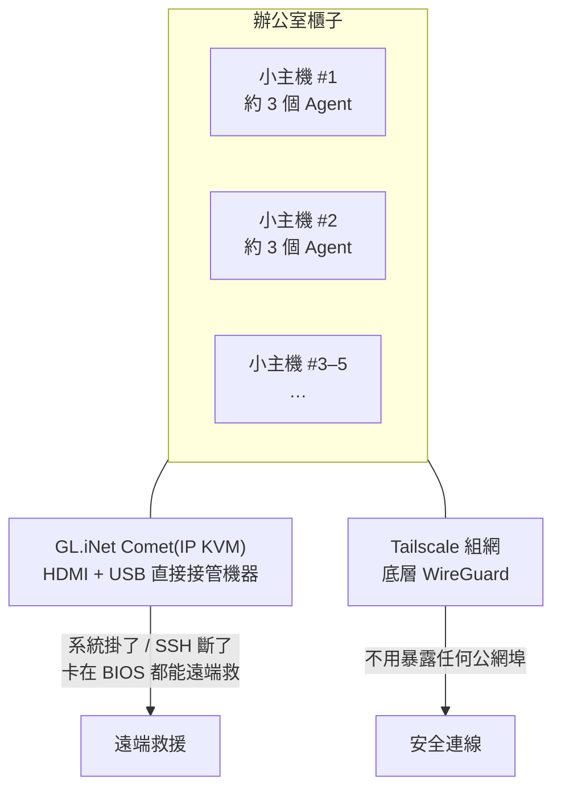
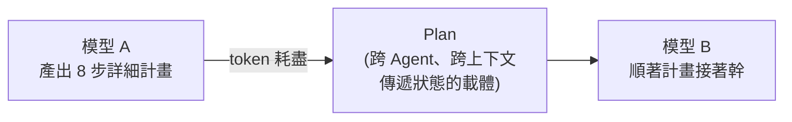
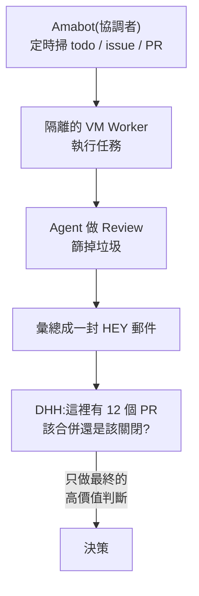
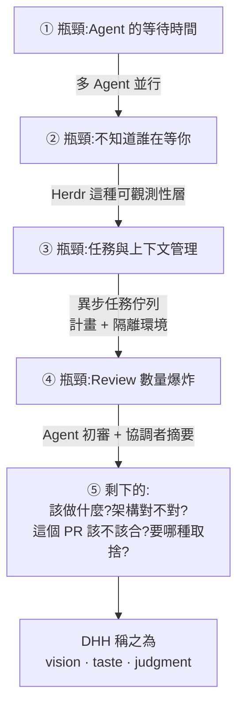
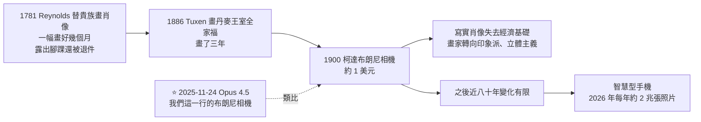

# DHH 的 16 條並行 Agent:當寫程式幾乎免費,瓶頸遷移到哪裡去了

**主題分類:** AI Agent / 自主性 —— 多 Agent 並行工作流與瓶頸遷移
**來源影片:** YouTube〈DHH:AI工作流的实践经验 | AI时代程序员必备 | 想法,视野,品味〉(Why QQ / 為什麼叫 QQ,2026-09-01,約 8.7 分鐘,**官方 zh-Hans 字幕**)
**來源影片 2(§13):** YouTube〈Rails World 2026 手写代码已死?最混乱的葬礼?解读 DHH 演讲〉(Why QQ,2026-09-28,約 10 分鐘,**官方 zh-Hans 字幕**;已對 DHH 官方演講英文字幕核實)
**原始素材:** Lex Fridman Podcast **#501**(2026-08-26,約 5 小時)、DHH 的三篇文章、REWORK podcast、The Pragmatic Engineer 專訪,以及 Herdr / Omarchy 的公開倉庫

**整理日期:** 2026-09-05

> 📎 相關筆記:[[omarchy-4-agent-as-os-citizen]](DHH 把這套經驗做成系統的成果)、
> [[herdr-terminal-runtime-agent-to-agent]](本文 §3 那一層的專門拆解)、
> [[long-running-agents-goal-evaluation]]、[[claude-code-team-how-they-work]](Anthropic 團隊的同一件事)

---

## 0. 一句話總結

> **「循環裡的那個人,才是極限 —— 機器還有餘量,人先跟不上了。」**

DHH 的辦公室櫃子裡擺著四五台小主機,每台跑三個左右的 Agent,合計**約 16 條並行工作流**。
但他講的不是算力,是相反的東西:

> **「瓶頸很少出在實現上,出在人的頻寬和溝通上。」**

⭐⭐ 這支影片最反常識的一條:
**Agent 跑得越快,DHH 能維持的 thread 反而越少** —— 因為極限從來不在機器那邊,
**在人消費輸出的速度上。**

---

## 1. 先看爬坡速度:八個月從「監督協作」到 16 條並行

| 時間 | 狀態 |
|---|---|
| **2026-01** | 寫文章說自己離「90% 程式碼由 Agent 寫」還很遠;當時認可的是**監督式協作** —— Agent 幹活,他看結果、必要時給指導 |
| **2026-04** | 接受 Gergely Orosz 採訪時,工作區是**兩個模型並行**(一快、一慢但更強),中間夾 Neovim + LazyGit 做 review。⭐ Gergely 形容這狀態**「更像穿上一套機甲」** |
| **2026-08** | **四五台機器、約 16 條 thread** |

> ⭐ 這個爬坡速度本身值得每個工程師看一眼 —— **八個月,從 1 到 16。**

### ⚠️ 兩處被網路傳錯的地方(影片特地更正)

1. **不是「16 個 Agent」** —— DHH 的原話是 **about 16 threads**(16 條線程),不是嚴格意義上的 16 個 Agent。
2. **Herdr 不是他自己開發的調度平台** —— 他的原話是**這是他換用的一個現成工具**。
   ⭐ 他自己給的定義非常樸素:**「帶 Agent 通知的 tmux。」**

> ⭐ 更正這兩點的意義:**這套工作流沒你想的那麼神祕,全是現成零件拼的。**

---

## 2. 物理架構:全是現成零件


```mermaid
flowchart TB
    subgraph Office["辦公室櫃子"]
        M1["小主機 #1<br/>約 3 個 Agent"]
        M2["小主機 #2<br/>約 3 個 Agent"]
        M3["小主機 #3–5<br/>…"]
    end
    K["GL.iNet Comet(IP KVM)<br/>HDMI + USB 直接接管機器"]
    T["Tailscale 組網<br/>底層 WireGuard"]
    Office --- K
    Office --- T
    K -->|"系統掛了 / SSH 斷了<br/>卡在 BIOS 都能遠端救"| Rescue["遠端救援"]
    T -->|"不用暴露任何公網埠"| Net["安全連線"]
```

- **每台小主機配一個 GL.iNet Comet(IP KVM)**:透過 HDMI 與 USB 直接接管機器 ——
  **系統掛了、SSH 斷了、機器卡在 BIOS 介面,都能遠端救回來。**
- **機器之間用 Tailscale 組網**(底層 WireGuard),**不用暴露任何公網埠**。
- ⭐⭐ **他用 `mise` 管理這些 Agent 的工具鏈** —— 因為 **Agent CLI 更新極快**,版本、環境、權限全都要管。

> ⭐ **這個細節很值得記:Agent 數量上去以後,「Agent 的執行環境本身」也變成了基礎設施。**
> 📎 Omarchy 4 的九個 Agent 也是用 mise 統一管理、懶載入 —— 見 [[omarchy-4-agent-as-os-citizen]] §2。

---

## 3. 第一層瓶頸:你怎麼知道 16 個 Agent 誰在等你?

以前用 tmux 就得逐個視窗切過去看:Claude 看一眼、Codex 看一眼、換台機器再看一遍。
**DHH 說這套很快就不行了。**

Herdr 解決的正是這件事:

- **終端由後台服務持有** ⇒ 你合上電腦,Agent 照樣跑。
- **每個視窗有狀態:`working` / `blocked` / `idle` / `done`。**
- ⭐ **你不用再巡視了 —— 它直接告訴你誰需要你。**

> ⭐⭐ **「多 Agent 時代的第一個工程問題,是可觀測性。」**

📎 Herdr 的完整拆解(五層物件模型、狀態偵測機制、CLI 紀律)見 [[herdr-terminal-runtime-agent-to-agent]]。

---

## 4. 第二層:調度 —— 而且他認為聊天視窗是錯的形狀

DHH 早在 **3 月**就把 Basecamp 改造成 **Agent 可以存取的系統**:做了新的 API 與 CLI,
**Agent 能看專案、建 todo、發訊息、傳檔案、排日程。**

到 8 月的訪談他講得更明白:

> **「chat 不是理想的 Agent 協作方式 —— 因為聊天會誘使人乾等。異步的任務工具才合理。」**

互動模型因此變了:

```text
發 prompt → 等回覆          ❌
派任務 → 異步執行 → 出結果 → 人來決策    ✅
```

> ⭐⭐ 影片作者的推論值得記:
> **多 Agent 的調度器最終會長得像 Jira 和 Basecamp、長得像 issue 佇列,
> 不會長成一排聊天視窗。**

📎 有趣的對照:Anthropic 團隊的做法**恰好相反** —— 他們 70–80% 的工作是在 **Slack** 裡丟給 Claude Tag。
⭐ 但兩者其實一致:**Claude Tag 是「在 Slack 裡的異步任務」,不是即時聊天** ——
它會在完成時 tag 你,而不是等你盯著看。見 [[claude-code-team-how-they-work]] §1。

---

## 5. 第三層:上下文變成真金白銀

> **「token 仍然稀缺。好的架構能讓 Agent 不用每次都重新學一遍整個程式碼庫。」**

⭐ 他有一個做法很有啟發性:

> **一個模型生成一份詳細的 8 步計畫;token 用完以後,另一個模型順著這份計畫接著幹。**


```mermaid
flowchart LR
    A["模型 A<br/>產出 8 步詳細計畫"] -->|"token 耗盡"| P["Plan<br/>(跨 Agent、跨上下文<br/>傳遞狀態的載體)"]
    P --> B["模型 B<br/>順著計畫接著幹"]
```

> ⭐⭐ **Plan 變成了跨 Agent、跨上下文傳遞狀態的載體。**
>
> 而這其實就是**分散式系統裡的狀態持久化**。
> **軟體工程沒有消失,它只是換了個地方出現。**

---

## 6. ⭐⭐⭐ 最值錢的失敗案例:Basecamp 5 的架構被 Agent 寫碎了

Basecamp 5 開發初期,他們讓**設計師直接用 Agent 實現需求**。結果發現 Agent 有個很危險的性質:

> **你讓它幹什麼,它就真幹什麼。**
> **它不會像資深工程師那樣提醒你:九成的效果其實只要一成的複雜度。**

於是:**單個 PR 看都合理,合起來架構碎了** —— 效能問題、安全問題、技術債一起湧進來。

📌 **核實:DHH 在 Lex Fridman #501 的原話是**
> 「we ended up with a lot of PRs that individually perhaps could have been justified for a hot moment,
> but taken all together, **destroyed the architecture of the system**.」

**37signals 後來立的規矩:**

| 允許 | 限制 |
|---|---|
| Agent 可以**先把東西做出來驗證設計** | ⚠️ **高風險的改動進主庫之前,必須過資深工程師** |

> ⭐ DHH 自己的總結:**「想寫出高品質的程式碼,還是得花不少功夫。」**

---

## 7. 第四層:Review 數量爆炸 ⇒ 判斷力成為稀缺資源

Omarchy 的 Quattro 階段,**三個月合併了 1,000 多個 PR**,訪談時還有**約 400 個在排隊**。

📌 **核實:DHH 原話「I have merged over 1,000 pull requests」與「about 400 unmerged pull requests on Omarchy」屬實。**

**DHH 早就不逐個看了** —— Agent 先做第一輪篩選,**他只做最終的 merge or no merge。**

> ⭐⭐⭐ **這個邏輯很反直覺,但站得住:**
> **Review 的數量爆炸了,人的時間沒有變多 ⇒ 判斷力就這樣成了稀缺資源。**
> **程式碼產得越多,能看懂程式碼、能拍板的人越值錢。**

---

## 8. ⭐⭐ 三個並行故障:全是分散式系統的老問題換了個片場

| # | 故障 | 分散式系統裡的名字 |
|---|---|---|
| **①** | 局部正確的 PR 合起來毀掉架構(§6) | **上下文一致性** |
| **②** | Amabot 多 Worker 協同時,**主協調 Agent 踩到另一個 Agent 的工作,把對方的成果破壞了** | **並行寫衝突** |
| **③** | ⭐ **8 個 Agent 做 QA,找出 28 個真實問題,然後約 12 秒內全部提交到 GitHub —— 平台直接把這個 bot 判定成 spam、封號了** | **限流與背壓** |

> ⭐⭐⭐ 第三個最有畫面,而且點出一個新的失敗模式:
> **生產速度超過了下游系統的消費速度。**
>
> 你的 Agent 可以在 12 秒內開 28 個 issue,**但 GitHub 沒有準備好接住這種速度。**

---

## 9. 人的頻寬怎麼辦:Amabot 與「大腦與手分離」

⚠️ **Amabot 目前尚未公開原始碼,資訊全部來自訪談。**


```mermaid
flowchart TB
    A["Amabot(協調者)<br/>定時掃 todo / issue / PR"] --> W["隔離的 VM Worker<br/>執行任務"]
    W --> R["Agent 做 Review<br/>篩掉垃圾"]
    R --> S["彙總成一封 HEY 郵件"]
    S --> H["DHH:這裡有 12 個 PR<br/>該合併還是該關閉?"]
    H -->|"只做最終的<br/>高價值判斷"| D["決策"]
```

DHH 管這個叫 **brains and hands(大腦和手分開)**。

> ⭐⭐ **效果用一句話說完:100 個 Agent 事件,被壓縮成 10 個人類決策。**

---

## 10. ⭐⭐⭐ 瓶頸遷移路線圖(本篇最該收藏的一張表)


```mermaid
flowchart TB
    S1["① 瓶頸:Agent 的等待時間"] -->|"多 Agent 並行"| S2["② 瓶頸:不知道誰在等你"]
    S2 -->|"Herdr 這種可觀測性層"| S3["③ 瓶頸:任務與上下文管理"]
    S3 -->|"異步任務佇列<br/>計畫 + 隔離環境"| S4["④ 瓶頸:Review 數量爆炸"]
    S4 -->|"Agent 初審 + 協調者摘要"| S5["⑤ 剩下的:<br/>該做什麼?架構對不對?<br/>這個 PR 該不該合?要哪種取捨?"]
    S5 --> V["DHH 稱之為<br/>vision · taste · judgment"]
```

> ⭐⭐ **每一層瓶頸被解決,壓力就被推到上一層。**
> **留在最頂上的,是那些沒法外包給機器的問題。**

### 兩條收束

1. **⭐ 資深 vs 初級的差距被放大了**(Gergely 在 4 月就點破):
   > **資深工程師從 Agent 身上拿到的增益,比初級工程師大得多** —— 因為資深的人**有能力判斷輸出能不能上生產**。
2. **⭐⭐⭐ DHH 的那句話:**
   > **「很多組織本來就不缺實現能力,卡住他們的是想法、視野和品味。」**
   > **Execution 廉價了,judgment 在漲價。**

---

## 11. 應用案例:你不用有五台主機也能照抄的四件事

### ① 先解決可觀測性,再談加 Agent

> **判準:如果你已經需要「逐個視窗切過去看誰跑完了」,那你的瓶頸已經不是 Agent 數量了。**

最小做法:給每個 Agent 的終端一個明確的完成通知(桌面通知 / Slack / 一行 `notify-send`),
**先讓「誰在等你」變成 push 而不是 pull。**

### ② 把 Plan 當成可傳遞的狀態,而不是一次性的提示詞

實作上很簡單:讓第一個 Agent 把計畫**寫成檔案**(`PLAN.md`、8 個編號步驟、每步有驗收條件),
**下一個 Agent 從檔案接手**。
> ⭐ 好處有兩個:**跨 context 續跑**,以及**你可以在中間插手改計畫**。

### ③ ⚠️ 立一條「高風險改動必須過人」的線

Basecamp 5 的教訓可以直接抄:

| 可以讓 Agent 直接做 | 必須過人 |
|---|---|
| 驗證設計的原型、拋棄式實作 | **架構層的改動、跨模組的介面、安全相關** |

> ⭐ 判準不是「這個 PR 對不對」,而是 **「這批 PR 合起來會不會把架構弄碎」** ——
> **後者單看一個 PR 是看不出來的。**

### ④ 給下游系統留背壓

那個 **12 秒 28 個 issue 被 GitHub 封號**的例子,可以直接翻譯成你的檢查清單:

- Agent 會不會在短時間內**大量呼叫外部 API**(GitHub、Jira、Slack、你的 CI)?
- 有沒有**速率限制**?超過會不會**封你的帳號**而不只是回 429?
- ⭐ **最省事的做法:讓 Agent 把產出先寫成本地檔案或佇列,再由一個受控的腳本慢慢送出去。**

---

## 12. 核實狀態

### ✅ 已核實

| 說法 | 核實結果 |
|---|---|
| Lex Fridman Podcast **#501**,2026 年,約 5 小時,主題含 agentic engineering | **屬實** |
| **Basecamp 5:單個 PR 看似合理、合起來毀掉架構** | **屬實**,已比對逐字稿原文(見 §6 引用) |
| **Omarchy Quattro 階段合併逾 1,000 個 PR、訪談時約 400 個未合併** | **屬實**,已比對逐字稿原文 |
| Omarchy / Herdr 為公開倉庫 | **屬實**,見 [[omarchy-4-agent-as-os-citizen]]、[[herdr-terminal-runtime-agent-to-agent]] |

### ⚠️ 未能從逐字稿佐證(以影片轉述看待)

擷取到的逐字稿段落中**未出現**下列內容,可能落在五小時訪談的其他段落或其他素材(DHH 的文章、REWORK、The Pragmatic Engineer)裡:

- 「約 16 條 thread」與「四五台小主機、每台約 3 個 Agent」的具體配置
- **Herdr 的「帶 Agent 通知的 tmux」這句自述**
- **Amabot** 的一切(brains and hands、HEY 郵件摘要、定時掃 todo/issue/PR)
- **GL.iNet Comet IP KVM、Tailscale、mise** 的工具選擇
- **8 個 Agent 12 秒開 28 個 issue 被 GitHub 判定 spam 封號**
- 「循環裡的那個人才是極限」與「瓶頸出在人的頻寬和溝通上」的原句
- 2026-01 / 04 / 08 三個時間點的爬坡敘述

> ⚠️ 引用上述內容前,建議自行回聽 Lex Fridman #501 或查 DHH 的原始文章。
> **本文的框架(瓶頸遷移路線圖)是影片作者的整理,不是 DHH 的原話。**

---

## 13. ⭐⭐⭐ 四週後:Rails World 2026 開幕演講——「我從職業程序員退休了」(2026-09-29 增補,來源:Why QQ)

> **Why QQ**〈[Rails World 2026 手写代码已死?最混乱的葬礼?解读 DHH 演讲](https://www.youtube.com/watch?v=zxxAl7Wc2g0)〉(2026-09-28,約 10 分鐘,官方 zh-Hans 字幕)
> ⭐⭐ **本節已抓取 [DHH 官方演講影片](https://www.youtube.com/watch?v=vDjW_dRyKXY) 的英文字幕逐句核實**——Why QQ 轉述的數字大多正確,但 **DHH 自己引用的 ATM 與銀行櫃員數字是錯的**(見 §13.7)。
>
> 📎 與 §6 的關係:§6 講的「Basecamp 5 被寫成瑞士起司」,DHH 在這場演講裡**親口重講了一次,而且把當時的結論推翻了**(見 §13.4)。

---

### 13.1 開場宣告

| 宣告 | ✅ 官方字幕核實 |
|---|---|
| **「我從職業程序員這個身份退休了」** | ✅ 屬實;他改稱自己是「maker」 |
| **37signals:手寫程式碼是「異常狀態」** | ✅ 屬實;就像 Sentry 跳出一個 bug——人要去看 agent 哪裡沒搞定、修好流程,讓機器下次能搞定 |
| **現場舉手:誰每週還手寫大量程式碼?** | ✅ 他看了一眼說:「**大概五個**」(一千多人的會場) |
| **「英文是我最喜歡的程式語言」** | ✅ 比 Ruby 更有表達力,雖然更模糊、不那麼確定 |

### 13.2 攝影史類比:相機沒有消滅畫家,消滅的是「寫實」這門生意


```mermaid
flowchart LR
    A["1781 Reynolds 替貴族畫肖像<br/>一幅畫好幾個月<br/>露出腳踝還被退件"] --> B["1886 Tuxen 畫丹麥王室全家福<br/>畫了三年"]
    B --> C["1900 柯達布朗尼相機<br/>約 1 美元"]
    C --> D["寫實肖像失去經濟基礎<br/>畫家轉向印象派、立體主義"]
    C --> E["之後近八十年變化有限"]
    E --> F["智慧型手機<br/>2026 年每年約 2 兆張照片"]
    G["⭐ 2025-11-24 Opus 4.5<br/>我們這一行的布朗尼相機"] -.->|"類比"| C
```

- ✅ 畫家 **Laurits Tuxen** 是 DHH 的高祖父;畫中穿粉紅裙子的是他的曾祖母。
- ⭐ DHH:「**2025 年 11 月 24 日,我們得到了這個時代的柯達布朗尼——Opus 4.5**。」一般人第一次負擔得起、能體驗跟一種新智能結對寫軟體。

### 13.3 模型時間線(DHH 的體感)

| 時間 | 事件 |
|---|---|
| 2025-11-24 | **Opus 4.5**:「這一行的布朗尼相機」 |
| 幾個月後 | 開源權重模型跟上;他用 **Kimi K2.5 快速模式**「每秒 200 個 token」用得很爽 |
| ⚠️ **2026 年 2–5 月** | **幻滅低谷**:新模型一個個發布,但「體感在退步」 |
| 6 月 | Fable 5 與 Mythos 發布(Why QQ 轉述) |
| 9 月 | GPT-6 Astra;一週後 DeepSeek V4.1-Flash(Why QQ 轉述) |

> ⭐ DHH:從那時起,他可以**丟給 agent 一個問題或想法,看它自己把實作做出來,不用指導任何細節**。

📎 這條時間線與本庫 [[claude-fable-72-hours-model-dependency]]、[[gpt-6-astra-token-efficiency-and-harness]] 記錄的是同一段時期。

### 13.4 ⭐⭐⭐ 最有價值的一段:瑞士起司的結論被推翻了

✅ 官方字幕原意:
> 「Basecamp 5 收尾時,讓設計師用 agent 寫功能。**單獨看,每個 PR 都合理;二三十個合在一起,架構看起來像瑞士起司。**我們的結論是『技術還沒準備好,回到人工逐一審查』——**那是錯的結論**。」

| 當時的結論 | DHH 現在的說法 | ⭐ Why QQ 的補充(本文同意) |
|---|---|---|
| 技術不夠好 → 退回人工審查 | 再等幾週,新模型就來了 | ⚠️ **真正的坑在所有權:二十個各自合格的局部決策,沒有人對整體負責。模型升級解決不了這件事,只會讓同樣的翻車在更大規模上重演。** |

> ⭐⭐ Why QQ:「**agent 可以寫程式碼,架構的帳得有人簽字。**」
> 📎 這正是本篇 §7「Review 數量爆炸 ⇒ 判斷力成為稀缺資源」的延伸。

### 13.5 HEY 重寫:六個原生 app + Rust 後端

| 項目 | ✅ 官方字幕 |
|---|---|
| **原生 app** | HEY「從來就不想當網頁應用」,網頁是**資源限制下的妥協**;現在由 agent 產出**六個平台的原生 app** |
| **Rust 後端** | 「**CPU 少 99%、記憶體少 95%**,需要 10 台主機只是為了備援」 |
| **樹莓派** | 「我們粗估,**HEY 的尖峰流量大概一台樹莓派就扛得住**」 |
| **同業** | Shopify 約 6 人的小團隊把 React Native 寫的 Shop app 換成原生 |

**DHH 怎麼看 Rust:**
> 「看 Rust 程式碼**像往眼睛裡倒醋**,對血肉之軀來說是不人道的。——**但如果我永遠不用看它**,只需要享受快 30 到 100 倍、編譯出很小的執行檔、毫秒內啟動……**那我愛死 Rust 了。**」
> ⇒ 他把 Rust 當**黑箱驗收**:「我出需求,你寫 Rust,我一眼不看。」

⚠️⚠️ **Why QQ 點出的關鍵(引 HN 留言):這組數字的大頭來自「架構改變」,不是「換語言」。**
- 算繪從伺服器移到客戶端(原生 app),**伺服器只剩資料請求與推播**。
- **同樣的架構用 Ruby 寫,也能省下大半**。
- 「語言和架構兩筆帳被打包進同一個宣布,外面的人分不開。」**Rust 比 Ruby 快多少倍,沒有人公布過。**

### 13.6 產出數字與「1000 倍」

| 說法 | ✅ 官方字幕 |
|---|---|
| 過去 21 年每年約寫 **3 萬行** Ruby 正式程式碼 | ✅ |
| **2026 年 8 月一個月寫了 15 萬行** | ✅「約是長期平均的 **60 倍**」;他自己承認其中很多是**冗長的 Rust** |
| 10 倍程式設計師的說法 | 來自 1968 年 ACM 研究(Sackman 等),最差與最好差 5–30 倍 |
| **「100 倍不誇張,1000 倍也說得通」** | ✅ 但原句的比較對象是「**沒有工具的最差程式設計師 vs 有工具的最好程式設計師**」 |

> ⚠️ Why QQ:「1000 倍、年底全面普及這類預測,**建議打折聽**——他自己都說他的預測 20 分鐘就過期。」

### 13.7 ⚠️⚠️ 杰文斯悖論與 ATM:DHH 引用的數字錯了

**DHH 的說法(✅ 官方字幕):**「ATM 在 **1950 年代**引進美國時,大家恐慌 **3 萬名**銀行櫃員會在 18 個月內失業;結果到 2010 年左右,櫃員變成 **4 萬名**。」(Why QQ 照原樣轉述)

**⚠️ 本文核實(經濟學家 James Bessen 的研究,IMF《Finance & Development》2015):**
| 項目 | 實際情況 |
|---|---|
| **ATM 普及時間** | 美國大規模部署是 **1970 年代之後**(不是 1950 年代) |
| **櫃員人數** | 1980 年代到 2010 年,美國裝了約 40 萬台 ATM,櫃員就業從**約 50 萬增加到近 60 萬**(不是 3 萬到 4 萬) |
| **機制** | 城市每家分行需要的櫃員從 **20 人降到 13 人**(1988–2004),銀行因此**多開了 43% 的分行**;櫃員工作轉向銷售與理財服務 |
| ⚠️ **後續** | 也有分析指出,**智慧型手機銀行普及後,櫃員人數反而下降**——ATM 沒殺死的工作,iPhone 殺死了 |

⇒ **結論方向(自動化不一定減少就業)有研究支持,但他給的數字與年代都不對**;而後續的下降也說明 Why QQ 的保留是對的:
> Why QQ:「效率提升把蛋糕做大的例子有,讓岗位消失的例子也有——農業和製造業都是。**櫃員的故事好聽,樣本是他自己挑的。**」

### 13.8 對開發者的具體要求

> ✅ DHH:「**如果你的 app 沒有 CLI,我要在下週五前看到。**沒有藉口,你有 token,我告訴過你這是可能的。」
> 「我不想用你塞在 app 裡的客服聊天機器人,**我有自己的管家**,能用 CLI 把 Basecamp 連到 HEY 和其他上百萬個 app。**省省你的 token 吧。**」

- ✅ Basecamp 內部在試一個叫 **Chef Marie** 的 agent:**非同步派工**——交代完去做別的,回頭驗收;「不要坐在聊天框前等 token 往外蹦」。
- ✅ Omarchy 安裝時間:去年 **3 分 33 秒** → AMD 工程師的筆電 **35 秒** → 實驗室 **9 秒**。

### 13.9 社群反應(自述性質,無樣本代表性)

| 聲音 | 內容 |
|---|---|
| YouTube 最高讚留言 | 「**這是我參加過最混亂的一場葬禮**」 |
| 失落 | 「Rails 一直是萃取框架;現在連程式碼都不手寫,以後沒東西可萃取」 |
| 自嘲 | 團隊全員變成「AI 輸出的蓋章員」 |
| ⚠️ 實際翻車 | 有人在正式環境抓到 **AI 寫的 API 完全沒做授權檢查**——授權被每個子 controller 各寫一遍,而這在 Rails 入門就該收進 `before_action` |
| 樂觀 | 月薪不高照樣每月花 200 美元用模型,開心得很 |

### 13.10 ⭐⭐ Why QQ 整理的三個可以直接拿走的動作

| # | 動作 | 說明 |
|---|---|---|
| **①** | **給你的應用補上 CLI 和 `AGENTS.md`** | agent 時代的可用性 = **機器的可操作性**;✅ Rails 官方 repo 的 `AGENTS.md` 開頭就是「**Ruby on Rails Codebase Guide for AI Coding Agents**」。「約定優於配置」在 agent 眼裡就是**省 token、少猜謎** |
| **②** | **把審查能力當核心肌肉練** | 產量上去後,稀缺的是**對整體負責的人**——能在 diff 裡一眼看出沒做授權的 API |
| **③** | **重新盤點因為太貴而放棄的東西** | 過去用成本說服自己放棄的需求,都值得重新估價(HEY 原生 app 就是例子) |

> ⭐ DHH 的收尾(Why QQ 同意):「**手寫程式碼這 25 年,回頭看應該帶著快樂,不帶遺憾。**我們趕上了親手鑿程式碼的最後時代,又正好站在切換的瞬間——兩邊都是特權。」

---

## 來源

- [DHH:AI工作流的实践经验 | AI时代程序员必备 | 想法,视野,品味 — Why QQ](https://www.youtube.com/watch?v=EhcRX53sUJk)(2026-09-01,約 8.7 分鐘,官方 zh-Hans 字幕)
- [Rails World 2026 手写代码已死?最混乱的葬礼?解读 DHH 演讲 — Why QQ](https://www.youtube.com/watch?v=zxxAl7Wc2g0)(2026-09-28,約 10 分鐘,官方 zh-Hans 字幕;§13)
- [DHH Rails World 2026 開幕演講(官方影片)](https://www.youtube.com/watch?v=vDjW_dRyKXY)(§13 核實來源,英文字幕)
- [Toil and Technology — James Bessen, IMF Finance & Development(2015-03)](https://www.imf.org/external/pubs/ft/fandd/2015/03/bessen.htm)、[Why ATMs didn't kill bank teller jobs, but the iPhone did](https://davidoks.blog/p/why-the-atm-didnt-kill-bank-teller)(§13.7 ATM 數字核實)
- [rails/rails AGENTS.md](https://github.com/rails/rails/blob/main/AGENTS.md)、[Global Nerdy 演講整理](https://www.globalnerdy.com/2026/09/27/dhhs-keynote-at-rails-world-2026-the-most-confusing-funeral-ive-ever-experienced/)
- 原始素材與核實來源:
  - [DHH: Future of Programming, AI, Agentic Engineering, Vibe Coding & Linux — Lex Fridman Podcast #501](https://www.youtube.com/watch?v=NYFGCESmikA)
  - [#501 逐字稿 — lexfridman.com](https://lexfridman.com/dhh-2-transcript/)(§6、§7 的核實來源)
  - [Promoting AI agents — DHH, world.hey.com](https://world.hey.com/dhh/promoting-ai-agents-3ee04945)
  - [omacom/omarchy — GitHub](https://github.com/omacom/omarchy)
  - [herdrdev/herdr — GitHub](https://github.com/herdrdev/herdr)

> ⚠️ 本文為對一支公開影片的整理與查證。§12 已逐項標示核實狀態 ——
> **其中相當一部分細節無法從公開逐字稿佐證,請以影片轉述看待。**
> Amabot 尚未開源,相關描述全部來自訪談轉述。
