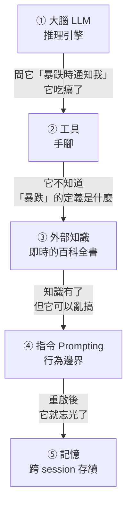
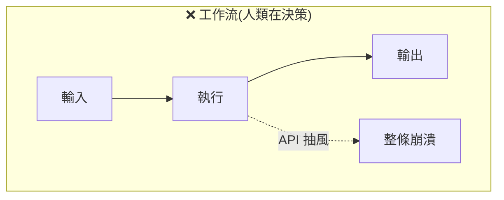
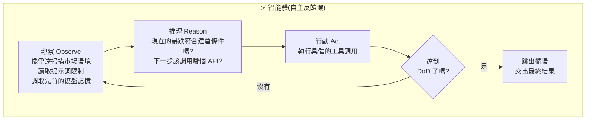

# 用需求逼出 Agent 的五臟六腑:工作流 vs 智能體的分界,與 LangGraph 只做的三件事

> 整理自 YouTube 頻道 **可樂 AI 實驗室**〈智能體原理解析:用 AI Agent 搭建自己的數字化交易員〉(2026-08-06,約 10.9 分鐘)。

> ⚠️ **非投資建議。** 該片自帶免責聲明:內容僅作為 AI 編程與量化系統架構的技術分享,不構成任何投資或理財建議。本筆記同樣**只整理 Agent 的架構設計**,交易策略部分僅作為案例載體,不代表任何操作建議。

> 📎 相關筆記:[[seven-agent-architectures-selection-guide]](7 種 Agent 架構選型)、[[loop-vs-graph-debate-engineering-view]](Loop 與 Graph 之爭)、[[harness-loop-graph-troubleshooting-map]](三層排障地圖)、[[five-agent-patterns]]

---

## 一句話總結

**把五個組件按順序串起來(輸入 → 執行 → 輸出)那不是智能體,是工作流——因為「本質依然是人類在做決策」,人類預設了一條死板路徑。智能體的分界點是:它是一條直線,還是一個會自我糾錯的反饋環。**

---

## 一、他為什麼要從「工作流」改成「Agent」

這個動機講得很具體,而且是**踩過三個月才得到的結論**:

原本的量化系統是純 SaaS 架構——後端自動跑均值回歸,在跳空或違反風險條件時自動終止,有長線機會時再切換形態。**聽起來非常完美。**

> **但三個多月測試下來,他發現:狀態的切換本身就帶有一定的感性,或者說「盤感」。**
> **如果只靠程式機械地切換狀態,很容易跟不上市場變化,造成結構性的虧損。**

**所以必須逼著系統自己觀察、自己決策、自己進化——而這就是 Agent。**

> ⭐ 這個動機比多數「Agent 教學」誠實:**他不是因為 Agent 潮才用 Agent,是因為「規則寫死的狀態機」在他的場景真的失效了。** 反過來說——**如果你的狀態切換不需要判斷力,你就不需要 Agent。**

---

## 二、⭐ 五大核心:用需求一步步逼出來,而不是背 PPT

影片的講法很好:每一個組件都是**因為上一步不夠用**才被加進來的。



| # | 組件 | 為什麼需要它(上一步的缺口) |
|---|---|---|
| **①** | **大腦(LLM)** | 系統的推理引擎。複雜推理、自然語言解碼都能搞定。**⚠️ 但不要被它騙了**——在聊天框問「暴跌的話能不能通知我抄底」,**它就吃癟了**,這就是純聊天模型的局限 |
| **②** | **工具** | 智能體的**手腳**。接外部 API ⇒ 能抓實盤盤面資料、能發郵件。接上之後**不只能看行情,還能主動發訊息** |
| **③** | **外部知識** | **大模型的知識庫是靜態的,實盤環境是動態的。** 必須把獨家交易策略、歷史交易紀錄餵給它——**給它配一本即時的百科全書**。⚠️ 沒有這一步,它可能**在只跌了 5% 的時候就自動滿倉抄底** |
| **④** | **指令(prompting)** | **對行為邊界的絕對定義。** 影片的原話很重:**「不同於單純寫後端程式碼,在智能體中指令決定了它的生死。」** |
| **⑤** | **記憶** | 短期靠對話歷史就夠,**但遠遠不夠**——系統崩潰重啟後、或過了三天,它還記得之前的操作邏輯嗎?可以存資料庫,也可以存在一份 `memory.md`;甚至**永久固化到 PostgreSQL 供大模型按需取用** |

### ④ 指令的具體長相(值得抄的寫法)

他示範的不是「請謹慎交易」這種話,而是**可判定的邊界**:

- 入場信號**必須**是一天內暴跌 20% 以上
- **必須**分批入場
- 每次入場**最多 20% 倉位**
- 嚴格分散建倉

而且配上**失敗判定**:

> **如果 Agent 把「暴跌入場」當成套利檢測去亂搞,那直接判定失敗就可以了。**

> ⭐ **「高品質的指令就是防爆雷的安全底座」**——注意這裡的重點不是把話寫長,而是**把每個模糊詞都換成可判定的數字與動作**(「暴跌」→「一天內 20% 以上」;「謹慎」→「單次最多 20% 倉位」)。

### ⑤ 記憶 ≠ 上下文

影片特別點出:**記憶和上下文是有區別的。** 上下文是這一輪對話帶著的東西;記憶是**跨越重啟與時間仍然存在**的東西。

> 這是「讓交易智能體在你睡覺時幫你盯盤、復盤、進化」的前提——**沒有記憶,它每天早上都是新員工。**

---

## 三、⭐⭐ 全片最有價值的一段:工作流 vs 智能體

把五大組件按順序連起來——**輸入 → 執行 → 輸出**——

> **這叫做工作流,它不是智能體。**
> **它的本質依然是人類在做決策**,因為**人類預設了一個非常死板的路徑,然後按順序去執行**。
> **只要中間任何一步(比如行情 API 抽風),整個流程就會直接崩潰。**

**而智能體的真正魅力在於它的自主性:它不是一條直線,而是一個內部的反饋環。**





**它會一直在這個環裡自我糾錯、瘋狂循環,直到觸發「完成定義」(Definition of Done, DoD)**——也就是滿足了所有訂下的技術指標。**只有當結果完全達標,智能體才會跳出循環。**

> ⭐ **DoD 是這個設計的煞車。** 沒有明確的 DoD,「自我糾錯的循環」就變成「無限燒 token 的循環」。這與 [[agent-skill-three-layer-run-do-verify]] 的「驗」層是同一件事——**你必須先定義「怎樣算做完」,自主性才是資產而不是負債。**

---

## 四、LangGraph 只做三件事

問題來了:**傳統程式框架(不管是 Go 還是 Python)資料都只能像流水線一樣單向流動。怎麼在程式碼裡表達「可以無限回退、循環迭代」的思考狀態?**

這就是 **LangGraph** 的位置。影片的定位很務實:

> **千萬不要被「狀態機」這個詞唬住,它其實也就簡單做三件事而已。**

| # | 元素 | 做什麼 |
|---|---|---|
| **①** | **節點(Node)** | 上半部的**推理**是一個 **LLM 節點**(負責動腦子);下半部的**行動**是**工具節點**(負責調 API 或發起請求) |
| **②** | **邊(Edge)** | **條件邏輯,也是 LangGraph 的靈魂**。大模型思考完決定調交易 API,很流暢沒問題;**但如果 API 出錯、或抓的資料不對呢?這條邊就會把結果再扔回給大模型,讓它重新思考或換個策略** ⇒ **原生支援回退的循環迭代** |
| **③** | **狀態(State)** | 底層有一本**狀態草稿本,叫做 Agent Scratchpad**。每一輪的思考、動作、結果都寫在上面,作為下一步的上下文傳遞 |

### Agent Scratchpad 的具體妙用

**這個循環之所以不會亂套,就是因為有這本草稿本。**

影片舉的例子很好懂:當大模型透過 API 已經檢測到某標的暴跌 20%,它就直接在 scratchpad 記一條「某年某月某日,某標的已經跌了 X%」。

> **這樣在下一步的思考中,Agent 就不必再次調用 API 去確認行情是否暴跌了。**

> ⭐ 這其實就是**把中間結論固化下來,避免重複的昂貴操作**——跟 [[trillion-record-realtime-search-kafka-dedup]] 的去重思路異曲同工:**不去做重複的工。**

---

## 五、Vibe coding 的做法:你不需要手敲路由邏輯

影片示範的提示詞結構是這樣的(重點在「說清楚圖的結構」):

```
使用 LangGraph 建構一個狀態圖:
- 包含一個 LLM 推理節點,和一個調用行情的 tool 節點
- 使用 conditional edge 進行路由
- 如果需要調用工具 → 走向 tool 節點
- 如果已經得出結論 → 走向 END
```

**只要你腦子裡有那張「從推理到行動」的邏輯圖,把需求餵給編程工具,它就會自動把整個圖結構編排出來。**

**而你唯一要做的,是把大模型的 API Key 和自己的業務函數封裝進去。**

> ⭐⭐ **全片最重要的一句話:**
> **「真正的壁壘從來都不是敲程式碼,而是你腦子裡的業務流程。」**
>
> 影片甚至說:照這個方式做,**你甚至不需要去學 LangGraph**。

---

## 六、條件路由當防線:把離譜的決定打回去

這是他實際的用法,也是條件邊最有價值的場景:

- 系統掃描到信號,先**用程式碼直接攔截**
- 如果是「暴跌抄底」信號,**大模型必須清楚:這指的是跌夠了多少、且已經明顯止跌**
- 在這種情況下,它才去分批建倉
- ⭐ **如果條件判斷發現它想全倉梭哈,路由就直接把這個離譜的決定打回,強制重新推理**

> **這是把「安全邊界」放在圖的結構裡,而不是放在提示詞裡的做法。** 提示詞是請求,條件邊是強制——兩者的可靠度差一個量級。

### 讓它越跑越聰明:把演化機制接進循環

他也把原有的遺傳演算法接進 Agent:

> **它不能每次都像無頭蒼蠅一樣隨機嘗試。** 在進入下一輪循環或重啟時,**系統的初代生成會直接提取目前實盤中驗證過的最強基因作為基底。**

**「這種能夠自我糾錯、自我進化的條件路由,就是 LangGraph 最性感的地方。」**

---

## 七、⚠️ 他自己畫的邊界

影片結尾很誠實,沒有把 demo 說成成品:

> **這樣做出來的 Agent 還只是一個「新員工」。**
> 在真實的量化戰場上,**怎麼搭建完整的工具鏈、怎麼把遺傳進化系統塞進去,這個就需要我們自己去開發了。**

最後的 demo 是用 Antigravity 跑一次開倉信號捕捉:**沒有人工干預、沒有情緒波動,AI 完成了觀察、推理、校驗,並打出一筆合約單。**

---

## 應用案例

### 案例 1|⭐ 用一個問題判斷你需要的是工作流還是 Agent

```
你的流程裡,有沒有哪一步「需要判斷力,而且判斷錯了會有實質代價」?

沒有  → 寫工作流就好(更便宜、更可預測、更好 debug)
有,但可以窮舉成規則 → 還是工作流(把規則寫成條件分支)
有,而且窮舉不完 → 才需要 Agent
```

⚠️ **影片作者是在「規則寫死的狀態切換跑了三個多月、產生結構性虧損」之後才換的**——這個順序值得學:**先用便宜的方案跑到它明確失敗,再升級。** 反過來(一開始就上 Agent)你會分不清問題出在架構還是別的地方。

> 對照 [[seven-agent-architectures-selection-guide]] 的警告:**盲目多加一個 agent、多套一層循環,帶來的往往不是更聰明的產品,而是翻倍的 token 帳單和難以追蹤的幻覺。**

### 案例 2|把「五大核心」當成 Agent 的健檢表

拿你手上跑不動的 Agent,逐項對照:

| 組件 | 檢查問題 | 缺了會怎樣 |
|---|---|---|
| **大腦** | 模型夠不夠聰明處理這類推理? | 通常不是瓶頸 |
| **工具** | 它有沒有真的能執行的手腳? | **只會講,不會做** |
| **外部知識** | 你的專屬規則/歷史資料餵進去了嗎? | **用通用常識做專業判斷**(跌 5% 就滿倉) |
| **指令** | 每個模糊詞都換成可判定的數字了嗎? | **邊界靠運氣** |
| **記憶** | 重啟後還記得嗎? | **每天都是新員工** |

⚠️ 多數人卡在**外部知識與指令**這兩層,卻一直在換模型(以為是大腦問題)。

### 案例 3|把模糊詞逐個換成可判定條件

這是本片最可直接套用的技巧。做一張對照表:

| ❌ 模糊指令 | ✅ 可判定指令 |
|---|---|
| 「謹慎一點」 | 「單次操作上限 X;超過要先問我」 |
| 「暴跌時處理」 | 「一天內跌幅 ≥ 20% 且已出現止跌訊號」 |
| 「分批進行」 | 「至少分 5 批,每批間隔 ≥ N 分鐘」 |
| 「確認沒問題再繼續」 | 「跑 `<具體指令>`,退出碼為 0 才繼續」 |

**判準:如果兩個人看同一條規則會做出不同判斷,那模型也會。**

### 案例 4|把安全邊界放進圖結構,不要只放在提示詞

影片「路由直接把離譜決定打回」的做法可以推廣到任何 Agent 系統:

```
提示詞說「不要刪除生產資料庫」  → 這是請求,可能被繞過
條件邊檢查「目標是否為 prod」    → 這是強制,結構上過不去
```

實作上:**在工具節點之前插一個檢查節點**,不符合就路由回推理節點並附上原因。

> 這與 [[encrypted-reasoning-traces-portable-key-flaw]] 的排序原則一致:**架構層 > 密碼學層 > 模型行為層。把「模型不會配合」當成主要安全機制,永遠是最弱的一層。**

### 案例 5|對照本倉庫的 cron 流程

用本片的分界來看本倉庫的每日排程:

| 面向 | 現況 |
|---|---|
| **它是工作流還是 Agent?** | **工作流** —— 路徑完全固定(抓取 → 去重 → 轉錄 → 寫筆記 → commit) |
| **這樣對嗎?** | ✅ **對** —— 沒有任何一步需要「窮舉不完的判斷力」;升級成 Agent 只會增加成本與失敗面 |
| **⚠️ 但工作流的弱點也真實命中過** | 「只要中間任何一步崩潰,整個流程就崩潰」—— 今天處理影片時 **yt-dlp 遇到 403**,而先前寫成 `yt-dlp … \| tail -1` 讓退出碼被 pipe 遮蔽,失敗被吞掉、下一步才炸 |
| **修法(照本片的邏輯)** | 在每一步之間加**顯式的成功檢查**與**重試**,而不是假設它會成功 —— 這正是「條件邊」在做的事,只是用 shell 實作 |

**這個對照的價值在於:工作流不是比較差的選擇,但它必須把「每一步都可能失敗」寫進結構裡**,否則就會出現今天這種「上一步默默失敗、下一步報一個看不懂的錯」。

---

## 重點回顧(TL;DR)

1. **他換架構的動機很誠實**:規則寫死的狀態切換跑了三個多月,發現**「狀態的切換本身就帶有盤感」**,機械切換跟不上變化、造成結構性虧損 ⇒ 才需要 Agent。**先用便宜方案跑到它明確失敗,再升級。**
2. **五大核心是被需求逼出來的**:大腦(LLM)→ 工具(手腳)→ 外部知識(靜態知識庫對不上動態環境)→ 指令(行為邊界)→ 記憶(跨重啟存續)。
3. **「在智能體中,指令決定了它的生死。」** 寫法的重點不是長,是**把每個模糊詞換成可判定的數字與動作**,並配上明確的失敗判定。
4. **記憶 ≠ 上下文**。沒有記憶,它每天早上都是新員工;可存 DB、`memory.md`,或永久固化到 PostgreSQL 按需取用。
5. **⭐⭐ 工作流 vs 智能體的分界**:五個組件按順序串起來(輸入→執行→輸出)**那是工作流,不是智能體**——**「本質依然是人類在做決策」**,而且**任何一步崩潰整條就崩潰**。智能體是**一個內部反饋環**。
6. **Observe → Reason → Act 閉環**,一直自我糾錯直到觸發 **DoD(Definition of Done)** 才跳出。⭐ **DoD 是煞車**——沒有它,「自我糾錯」就是「無限燒 token」。
7. **LangGraph 只做三件事**:**節點**(LLM 節點 + 工具節點)、**邊**(條件邏輯,**它的靈魂**——API 出錯就把結果扔回給模型重想)、**狀態**(**Agent Scratchpad** 草稿本)。
8. **Scratchpad 的妙用**:把已確認的中間結論寫下來,**下一步就不必再調 API 確認** —— 本質是「不做重複的工」。
9. **⭐⭐ 「真正的壁壘從來都不是敲程式碼,而是你腦子裡的業務流程。」** 只要能把圖的結構講清楚,編程工具會幫你編排出來,**你甚至不需要學 LangGraph**;你要做的是接上 API Key 與自己的業務函數。
10. **條件路由當安全防線**:想全倉梭哈就**直接打回、強制重新推理**。**把邊界放在圖結構裡(強制),而不是放在提示詞裡(請求)。**
11. **演化機制接進循環**:重啟或進入下一輪時,**直接提取實盤驗證過的最強基因當基底**,而不是每次像無頭蒼蠅隨機嘗試。
12. **⚠️ 他自己畫的邊界**:這樣做出來的還只是「新員工」;完整工具鏈與遺傳進化系統仍需自行開發。

---

## 來源

- [智能體原理解析:用 AI Agent 搭建自己的數字化交易員 — 可樂 AI 實驗室](https://www.youtube.com/watch?v=eiisw5N2U6w)(2026-08-06,約 10.9 分鐘)
- 本倉庫相關筆記:[[seven-agent-architectures-selection-guide]]、[[loop-vs-graph-debate-engineering-view]]、[[agent-skill-three-layer-run-do-verify]]、[[encrypted-reasoning-traces-portable-key-flaw]]

> 該片無字幕,逐字稿以 CPU 版 faster-whisper(small / int8 / zh)轉錄取得,**非官方字幕**,可能有少量聽寫誤差。文中專有名詞已依上下文校正(轉錄中的「Long Graph / Languerov」為 **LangGraph**、「Lanchin」為 **LangChain**、「課鎖 / 科索」為 **Cursor**、「軍制回歸」為**均值回歸**、「definition of down」為 **Definition of Done**、「GAA」為**遺傳演算法**)。

> ⚠️ **再次提醒:本文為架構知識整理,非投資建議。** 影片中的交易策略參數(暴跌 20%、單次 20% 倉位等)僅作為「如何把模糊指令寫成可判定條件」的示範,不代表任何操作建議。
