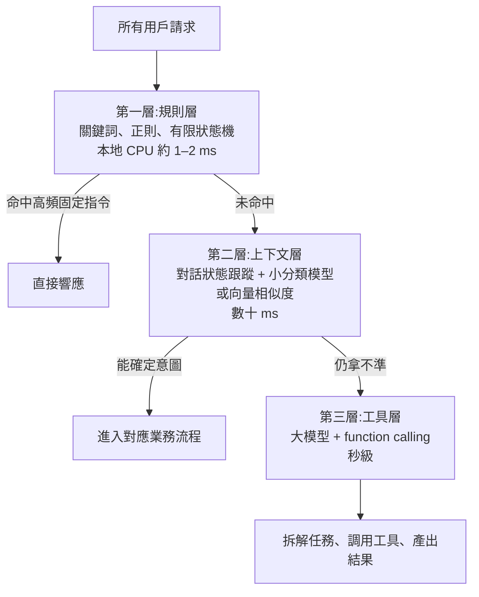
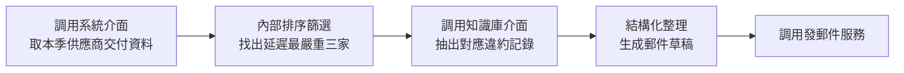
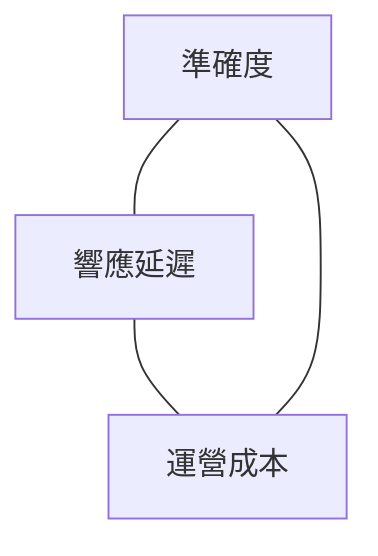

# 用最低成本做好 Agent 意圖識別:規則層、上下文層、工具層的三層漏斗

> 整理自 YouTube 頻道 **白白说大模型**〈[怎樣用最低的成本,做好Agent意圖識別?](https://www.youtube.com/watch?v=nXs-PMjU7KY)〉(2026-10-08,約 11.4 分鐘,無字幕、以 CPU faster-whisper 轉錄)。
> ⚠️ **本篇是工程方法論,不是對可查證事實的整理** —— 影片沒有引用論文、基準或官方文件;
> 「響應速度拉高幾十倍」「省下大幾萬」「95% / 5% 分流」等數字是**作者的經驗性說法與設計目標,不是量測結果**。
> ⚠️ 作者在說明欄推廣自家公眾號的配套教程,本文只整理公開影片內容。

---

## 一句話總結

> ⭐⭐⭐ **別把「退出登錄」「查餘額」也送進大模型。
> 用便宜的技術在前面擋大水,把貴的模型放在後面攻堅克難:
> 規則層毫秒級攔截高頻固定指令 → 上下文層用狀態機 + 小模型補齊省略 → 工具層才喚醒 LLM,而且讓它編排任務、不是吐分類標籤。**

---

## 一、⭐ 先記一句話:技術可行 ≠ 工程最優

> **「技術可行解決的往往只是從 0 到 1 的原型驗證;工程最優解決的才是從 1 到 n 的穩定生存。」**

本地測試時環境理想:只有你一個人用、發一條訊息調一次大模型、理解很準、返回也快。
但上線後成千上萬用戶湧入,**每一句話都發一次網路請求給大模型**,會同時出現三個問題:

| 視角 | 後果 |
|---|---|
| 用戶 | 原本幾毫秒該彈出的介面,要等三四秒甚至更久 ⇒ 直接關掉 |
| 帳單 | API 費用隨流量線性往上漲 |
| 可用性 | ⚠️⚠️ **大模型介面稍微抖動,整個業務服務跟著雪崩** —— 意圖識別在入口,入口掛了全掛 |

---

## 二、⚠️⚠️ 新手最常踩的兩個極端

| 極端 | 一開始 | 時間一長 |
|---|---|---|
| **瘋狂堆規則**(關鍵詞 + 正則) | 又快又省錢 | 用戶換個同義詞加一條、換個語序再加一條,幾百條規則堆在一起,**連最初寫規則的人都離職了,誰改誰報錯 ⇒「規則黑洞」** |
| **全量丟給大模型** | 省掉維護規則的麻煩 | 成本失控;⚠️ **偶發幻覺把「想退款」識別成「註銷帳號」,整個業務流程亂套 ⇒「算力雪崩」** |

> ⭐⭐⭐ **兩個方案表面相反,本質犯的是同一個錯:試圖用一種單一手段搞定所有業務情況。**

---

## 三、⭐⭐⭐ 關鍵觀察:業務流量天然是長尾分佈

**去看後台真實的用戶日誌**,會發現:

- **絕大部分需求非常簡單**:高頻、形態固定
- **真正需要深度推理的長尾訴求**,占總量比例很小

> 📌 **這跟打銀行或電信客服電話一模一樣:**
> 大部分人只想查話費、查帳單 ⇒ 語音提示「按 1 查帳單、按 2 查餘額」,自助幾秒搞定;
> 稍微麻煩的(辦業務變更)⇒ 排隊轉人工坐席;
> 極少數疑難糾紛 ⇒ 才轉專家組專項處理。

**架構不要去對抗業務規律,而是順著它分級。**

---

## 四、⭐⭐⭐ 三層漏斗架構總覽



| 層 | 處理什麼 | 技術 | 延遲 / 成本 |
|---|---|---|---|
| **規則層** | 形態最確定、最高頻、零歧義的指令 | 高效字串匹配(關鍵詞)、正則抽參數、簡單有限狀態機 | 本地 CPU 約 1–2 ms、幾乎零成本 |
| **上下文層** | 帶上下文、口語化、資訊殘缺的多輪請求 | 對話狀態跟蹤 + 業務資料微調的小分類模型,或本地向量相似度檢索 | 數十 ms、性價比極高 |
| **工具層** | 語義高度模糊、跨多個業務系統、需拉外部即時資料才能推斷 | 大模型推理 + function calling | 秒級、最貴 |

> ⭐ **越往下走理解能力越強,但時間與算力成本也越高。架構的核心目標:讓絕大部分請求在上面兩層就被消化掉。**

---

## 五、⭐⭐ 第一層:規則層 —— 做減法的克制

**適用請求**:「重發驗證碼」「匯出考勤表」「開啟勿擾模式」—— 表述幾乎零歧義、訴求單一。

> ⚠️ **對這種請求,還要打包幾百個字元問大模型「請判斷用戶的意圖是什麼」,在工程上就是純粹的算力浪費。**

### ⚠️⚠️ 最關鍵的坑:嘗到甜頭就上癮

> **多寫一條規則只要一分鐘,但規則庫每多一條匹配邏輯,系統就多一個潛在的衝突點 ——
> 最後誰都不知道某句話為什麼會被莫名其妙攔截。**

**治理原則不是做加法,是保持做減法的克制:**

1. ⭐⭐⭐ **嚴格的准入紅線**:只有真實日誌裡**前 5% 高頻**、且**表達極其固定、零歧義**的指令,才允許寫成規則
2. ⭐⭐ **定期淘汰機制**:不常用的規則及時清理
3. ⭐ **寧可放過去(交給下一層),也絕不讓規則層無限膨脹**

---

## 六、⭐⭐ 第二層:上下文層 —— 狀態跟蹤比模型更關鍵

**為什麼需要這層**:人在對話中天生習慣省略。

> 用戶:「幫我看看下週飛上海的航班」→ 系統列出航班
> 用戶:「改選早上 9 點前的吧」
>
> ⚠️ **脫離前文孤立去看「改選早上 9 點前的吧」,系統根本不知道要改什麼 —— 改航班?改酒店?改鬧鐘?**

**核心任務**:把當前輸入和對話歷史綁在一起理解,判斷用戶是在**承接剛才的任務補全資訊**,還是**打破話題開啟新事情**。

**兩套機制相互配合:**

| 機制 | 做什麼 |
|---|---|
| **對話狀態跟蹤** | 後台像一本小備忘錄:記錄**當前進行中的任務類型、已拿到哪些關鍵資訊、這個會話還在不在有效生命週期內** |
| **低成本語義匹配** | 不需要百億、千億參數 —— **業務資料微調的專用小分類模型**,或**本地向量相似度檢索**,就能聽懂大部分口語變體,延遲壓在數十毫秒內 |

### ⚠️⚠️ 避坑:會話過期邏輯一定要嚴密

> **用戶昨天查了機票,今天突然沒頭沒尾說一句「算了不要了」——
> 系統要是還記著昨天的機票狀態,就徹底理解歪了。**
>
> ⭐⭐⭐ **「狀態的及時重置,有時候比模型演算法本身更關鍵。」**

---

## 七、⭐⭐⭐ 第三層:工具層 —— 把大模型當特種兵,不是前台接待

能掉到這一層的請求通常很棘手:語義高度模糊、跨越好幾個業務系統,或必須從外部拉取即時資料才能推斷。

> ⚠️⚠️ **到了這一步,千萬不要再讓大模型乾巴巴輸出一個意圖分類標籤 —— 那太大材小用,
> 就像讓一位資深架構師去負責前台接待。**
>
> ⭐⭐⭐ **該用它的邏輯推理能力把複雜任務拆成具體執行步驟,並透過工具調用(function calling)
> 把意圖直接變成可執行的系統指令。**
>
> **「大模型是最後一道防線,但絕不能讓它站在大門口充當全量流量的第一入口。」**

### 影片的企業辦公例子

> 「幫我找出本季度交付延遲最嚴重的三家供應商,並匯總違約原因生成郵件草稿。」



> 📌 **大模型在這裡不是回一句「這是查詢意圖」,而是真正開始編排任務。
> 花的等待時間與 API 費用,換來的是高價值的業務成果 —— 這個錢才算花在刀刃上。**

---

## 八、⭐⭐ 成本與效能的工程平衡:不可能三角



| 做法 | 結果 |
|---|---|
| 所有輸入無腦調最強大模型 | 準確度高,但**成本與延遲爆表** |
| 為了省錢求快全堆規則 | 用戶說法稍微一變,**準確率就崩** |
| ⭐ 三層分流 | 依業務階段與流量特徵,在三者間找動態平衡點 |

**作者心中健康的工業級 Agent 系統終極形態:**

> ⭐⭐⭐ **約 95% 的日常確定性流量,在前面的低成本計算池(規則 + 輕量模型)被平穩、迅速地消化;
> 只有剩下約 5% 最棘手的長尾請求,才觸發大模型深度思考與調度工具。**
>
> **衡量系統做得好不好,不是看是否全鏈路都用了大模型、架構圖多炫酷,
> 而是看能否透過分流設計,讓大模型在最關鍵的節點以最小代價釋放最大價值。**

---

## 九、應用案例

### 案例 1|⭐⭐⭐ 電商客服 Agent 的三層路由(可直接改寫的骨架)

以下是**示意實作**(非影片提供的程式碼),展示三層漏斗與「會話過期重置」如何落在同一個入口函式裡:

```python
import re
import time
from dataclasses import dataclass, field

# ---- 第一層:規則層(只收前 5% 高頻、零歧義指令) ----
RULES: list[tuple[re.Pattern[str], str]] = [
    (re.compile(r"^(重發|再發一次)驗證碼$"), "resend_otp"),
    (re.compile(r"^(登出|退出登[錄录])$"), "logout"),
    (re.compile(r"^查(一下)?餘額$"), "query_balance"),
]

SESSION_TTL_SEC = 30 * 60  # 會話有效期:超過就重置,避免「昨天的機票」殘留


@dataclass
class Session:
    task: str | None = None              # 進行中的任務類型,如 "flight_search"
    slots: dict[str, str] = field(default_factory=dict)  # 已拿到的關鍵資訊
    last_active: float = field(default_factory=time.time)


def route(text: str, session: Session) -> dict:
    """三層漏斗入口:依序嘗試規則層、上下文層、工具層。"""
    # 第一層:毫秒級攔截
    for pattern, intent in RULES:
        if pattern.match(text.strip()):
            return {"layer": 1, "intent": intent}

    # 會話過期就重置 —— 狀態重置有時比模型本身更關鍵
    if time.time() - session.last_active > SESSION_TTL_SEC:
        session.task, session.slots = None, {}
    session.last_active = time.time()

    # 第二層:承接進行中的任務 + 小模型分類
    if session.task:
        label, conf = small_classifier(text, context=session.task)  # 例:微調 BERT 或向量相似度
        if label == "continue_task" and conf >= 0.85:
            return {"layer": 2, "intent": session.task, "update": text}
        if label == "cancel" and conf >= 0.85:
            session.task, session.slots = None, {}
            return {"layer": 2, "intent": "cancel"}
    else:
        label, conf = small_classifier(text, context=None)
        if conf >= 0.90:
            session.task = label
            return {"layer": 2, "intent": label}

    # 第三層:交給 LLM 編排任務(function calling),而不是只回一個標籤
    return {"layer": 3, "plan": llm_orchestrate(text, session, tools=TOOLS)}
```

⭐ **三個設計重點對應影片:**
1. `RULES` 刻意只有寥寥數條,而且是**全句錨定**(`^...$`)—— 「我不想退出登錄,只是想改密碼」不會被誤攔,這正是「寧可放過去」的實作意義。
2. `SESSION_TTL_SEC` 讓「算了不要了」不會被套到昨天的任務上。
3. 第三層回傳的是 `plan`(工具調用序列),不是 `intent` 標籤。

### 案例 2|⭐⭐ 用日誌決定規則准入:一次每季的「規則體檢」

情境:某 SaaS 後台的意圖規則庫累積到 300 條,誤攔投訴越來越多。

| 步驟 | 做法 |
|---|---|
| 1. 撈日誌 | 取近 30 天所有請求,依最終確認的意圖計數排序 |
| 2. 劃准入線 | 只保留**請求量排名前 5%** 且**近 30 天誤攔 0 次**的規則 |
| 3. 淘汰 | 30 天內命中 0 次的規則直接刪除;命中但曾誤攔的,降級交給第二層小模型 |
| 4. 量測 | 對照前後兩週:第一層命中率、誤攔率、第三層 LLM 調用量與帳單 |

> 📌 **第 4 步才是重點**:影片的 95/5 是作者的目標值,**你的系統實際分流比例要靠自己量**;
> 若第三層占比遠高於預期,通常是第二層的狀態跟蹤或小模型門檻設計有問題,而不是該多寫規則。

### 案例 3|⭐ 什麼時候不該用三層漏斗

- **流量很小的內部工具**(每天幾百次請求):直接全丟 LLM 的總成本可能比維護三層架構的人力便宜 —— 「工程最優」要把維護人力一起算進成本。
- **意圖空間開放、沒有高頻固定指令**(例如研究助理):第一層幾乎接不到流量,可直接從第二層或第三層開始。

---

## 十、與本庫其他筆記的關聯

- 📎 [[system-one-models-jev-calibrated-decisions]] 的判準「**返回枚舉欄位的調用是候選,可以下沉**」—— 正是第二層「小模型分類」的另一種實作選項:用只回答選擇題的決策模型取代自訓分類器。
- 📎 [[seven-agent-architectures-selection-guide]]:路由型架構的選型脈絡。
- 📎 [[function-calling-mcp-cli-tool-evolution]]:第三層「把意圖變成可執行指令」所依賴的工具調用機制。
- 📎 [[multi-agent-data-consistency-reliability]]:同作者;第三層一旦跨多個 agent 協作,資料一致性就成為下一個問題。

---

## 核實狀態

### ✅ 屬於可驗證的通用工程實務

- 關鍵詞 / 正則 / 有限狀態機在本地 CPU 執行的延遲為毫秒以下到毫秒級,遠低於遠端 LLM 的網路往返 —— **量級正確**。
- 小型分類模型(如微調 BERT 類)或向量相似度檢索在一般硬體上可達數十毫秒級延遲 —— **量級合理,實際取決於模型大小與硬體**。
- 對話狀態跟蹤(dialogue state tracking)與會話過期是任務型對話系統的既有標準做法。

### ⚠️ 作者的設計主張 / 經驗數字(未量測)

- **「響應速度拉高幾十倍」「算力成本省下大幾萬」** —— 沒有給出基準條件,視為宣傳性說法。
- **「前 5% 高頻才准寫規則」「95% 流量在前兩層消化、5% 才到 LLM」** —— 作者的經驗性目標值,實際比例依業務而異。
- **「大廠通用的這套三層漏斗」** —— 未舉出具體公司或公開架構文件。

> ⚠️ **本文整理一支工程方法論影片;數字與比例請當成設計起點,以自己系統的日誌量測為準。**

---

## 來源

- [怎樣用最低的成本,做好Agent意圖識別? — 白白说大模型](https://www.youtube.com/watch?v=nXs-PMjU7KY)(2026-10-08,約 11.4 分鐘。該片無字幕,逐字稿以 CPU 版 Whisper(faster-whisper)轉錄取得,非官方字幕,可能有少量聽寫誤差。⚠️ 說明欄推廣作者公眾號配套教程)
- 延伸:本庫 [[system-one-models-jev-calibrated-decisions]]、[[seven-agent-architectures-selection-guide]]、[[function-calling-mcp-cli-tool-evolution]]、[[multi-agent-data-consistency-reliability]]。
