# Agent 為什麼會長成 Runtime:DeepSeek Harness 的插件樹與事件日誌,以及底下那篇 Cordis 論文

> 本文整合三層材料:
> 1. **影片**:YouTube 頻道 **TGLTommy**〈Agent 为什么需要 Runtime?DeepSeek Harness 智能体架构深度解析〉(2026-08-16,約 12.5 分鐘)
> 2. **原始碼**:實地 clone **`deepseek-ai/deepseek-harness`**(128K stars),讀 `docs/` 下的架構、Cordis 入門、工具管線、能力接縫、測試等文件
> 3. **論文**:**《A Programming Paradigm for Spatiotemporal Composability》**(`cordiverse/paper`,88 頁)—— Cordis 的理論基礎
>
> 文中會標出**影片說法與原始碼/論文不一致或更精確之處**。

> 📎 相關筆記:[[seven-agent-architectures-selection-guide]](7 種架構選型)、[[agent-five-cores-langgraph-trading-agent]](工作流 vs 智能體)、[[loop-vs-graph-debate-engineering-view]]、[[herdr-terminal-runtime-agent-to-agent]](另一種 runtime 取徑)、[[agent-skill-three-layer-run-do-verify]]

---

## 一句話總結

**插件樹決定這個 agent「是誰、擁有什麼」;事件日誌決定它「經歷過什麼、接下來還能安全地做什麼」。** 而底下那篇論文回答了一個更根本的問題:**為什麼「能安全地卸載一個元件」需要形式化,而不是寫個 `deactivate` 就好。**

---

## 一、幾十行的 Agent Loop,為什麼會長成一整套 Runtime

影片開場的推導很好:寫一個最小 agent 不複雜 —— 收訊息、拼提示詞、請求模型、要調工具就執行、結果放回上下文,幾十行就能跑。

**但一旦你要它連續工作、允許它修改真實檔案、還要在中斷之後接著完成任務,問題就不再只是調模型:**

| 問題 | 為什麼 loop 解不了 |
|---|---|
| 模型調到一半,**行程崩了怎麼辦?** | 記憶體裡的狀態沒了 |
| 工具**已經改了檔案,結果卻沒來得及寫回**,系統還敢不敢重試? | 你無法區分「沒做」與「做了但不知道結果」 |
| 幾個工具可以同時執行,哪個必須排隊? | 併發語意要有地方定義 |
| **新增能力是不是每次都要改 agent 的 loop?** | 擴充點要先存在 |

> **dsh 要解決的正是這些 —— 它不是某一個 agent,而是承載 agent 的執行環境。** 模型、工具、上下文、權限、持久化與互動介面都由它組織,而**運行過程還要能替換、恢復與回放**。

支撐它的是兩項核心設計:**一棵可隨時組合卸載的插件樹**,與**一份不能被繞開的事件日誌**。

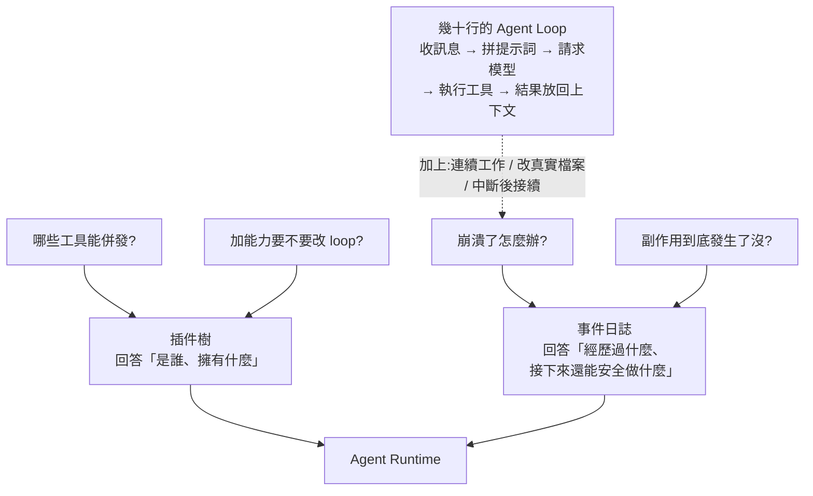
```mermaid
flowchart TB
    Q1["崩潰了怎麼辦?"] --> L2
    Q2["副作用到底發生了沒?"] --> L2
    Q3["哪些工具能併發?"] --> L1
    Q4["加能力要不要改 loop?"] --> L1
    L1["插件樹<br/>回答「是誰、擁有什麼」"] --> RT["Agent Runtime"]
    L2["事件日誌<br/>回答「經歷過什麼、<br/>接下來還能安全做什麼」"] --> RT
    MIN["幾十行的 Agent Loop<br/>收訊息 → 拼提示詞 → 請求模型<br/>→ 執行工具 → 結果放回上下文"] -.->|"加上:連續工作 / 改真實檔案<br/>/ 中斷後接續"| Q1
```

### 全景圖:一次請求會經過哪些層

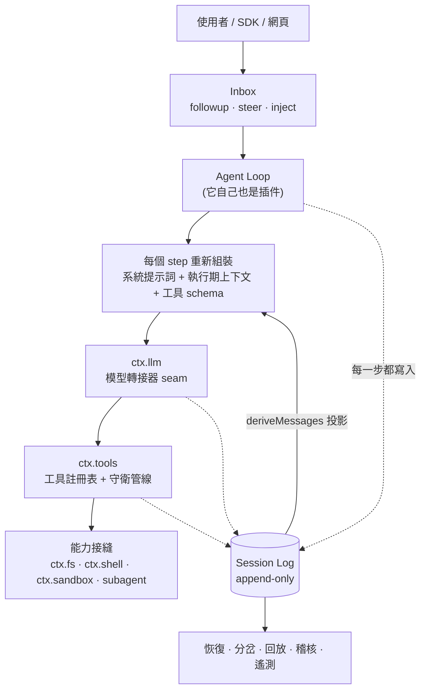
```mermaid
flowchart TB
    U["使用者 / SDK / 網頁"] --> IN["Inbox<br/>followup · steer · inject"]
    IN --> LOOP["Agent Loop<br/>(它自己也是插件)"]
    LOOP --> ASM["每個 step 重新組裝<br/>系統提示詞 + 執行期上下文 + 工具 schema"]
    ASM --> LLM["ctx.llm<br/>模型轉接器 seam"]
    LLM --> TOOLS["ctx.tools<br/>工具註冊表 + 守衛管線"]
    TOOLS --> CAP["能力接縫<br/>ctx.fs · ctx.shell · ctx.sandbox · subagent"]
    LOOP -.->|"每一步都寫入"| LOG[("Session Log<br/>append-only")]
    LLM -.-> LOG
    TOOLS -.-> LOG
    LOG -->|"deriveMessages 投影"| ASM
    LOG --> OUT["恢復 · 分岔 · 回放 · 稽核 · 遙測"]
```

> ⭐ 注意那條**回頭的虛線**:模型看到的歷史**是從日誌推導出來的**,不是另存一份記憶體陣列。這是後面第四節整套設計的地基。

---

## 二、Everything is a Plugin:字面意義

專案的口號是 **"Everything is a Plugin"**,而原始碼文件證實這是字面意思:

> 每一個部分都是插件,**包括模型轉接層、工具註冊表、session log,以及 agent loop 本身**,所以每一部分都能從設定替換。
> **沒有特權核心可以打補丁** —— 你是把插件掛在其他插件旁邊來擴充,而註冊本身是會在插件卸載時反捲的 effect。

### Cordis:底下那層

承托這些插件的是 **Cordis**(`cordiverse/cordis`)。官方入門文件把它濃縮成五個觀念:

| # | 觀念 | 重點 |
|---|---|---|
| 1 | **插件是實作 Service 的物件** | 可以是帶 `inject` / `apply(ctx)` 的函式,或 `Service` 子類 |
| 2 | **context 是服務的倉庫** | 服務認領穩定的 `ctx.<key>`(如 `ctx.tools`、`ctx.llm`);**其他插件用 key 找服務,而不是 import 具體實作** |
| 3 | **用 `inject` 宣告依賴** | ⭐ **載入順序由「服務需求」表達,而不是手動安排開機序列** |
| 4 | **型別化事件溝通** | 四種派送模式:`emit` / `waterfall` / `parallel` / `serial`。**派送模式是事件公開契約的一部分** |
| 5 | **註冊是可逆的 effect** | 提示詞區段、工具 schema、轉接器、provider、監聽器**全都透過 `ctx.effect()` 或 `ctx.on()` 安裝,好讓重載與拆卸能可預測地反捲** |

影片對 effect 的描述準確:**插件卸載時,effect 會依相反順序收回它留下的內容** —— 服務被撤銷、監聽器被移除、子插件與背景任務一起結束。

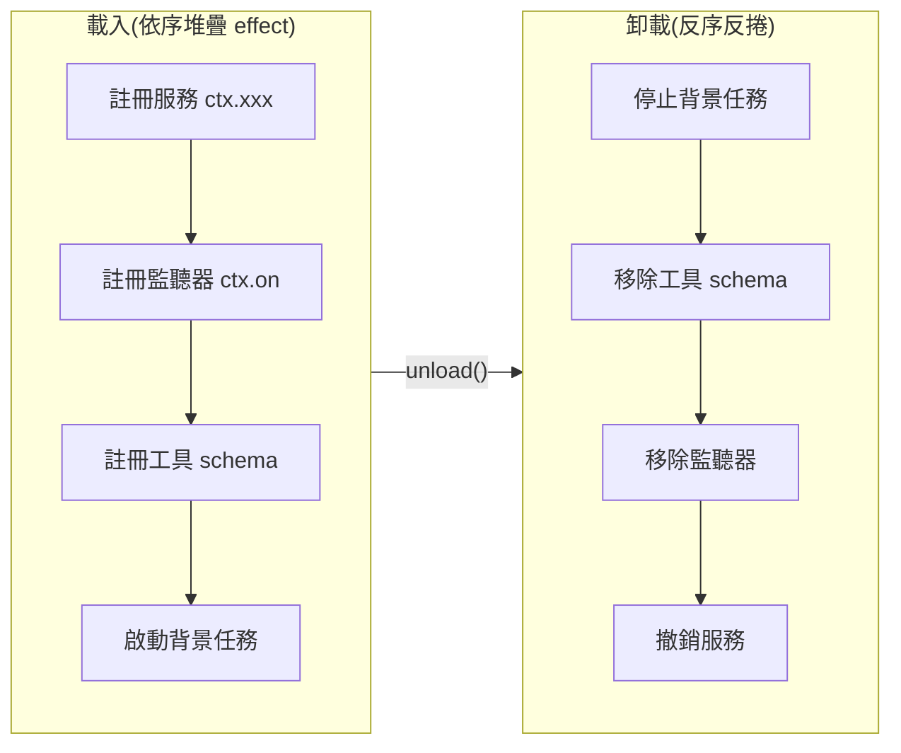
```mermaid
flowchart LR
    subgraph LOAD["載入(依序堆疊 effect)"]
        direction TB
        E1["註冊服務 ctx.xxx"] --> E2["註冊監聽器 ctx.on"]
        E2 --> E3["註冊工具 schema"]
        E3 --> E4["啟動背景任務"]
    end
    subgraph UNLOAD["卸載(反序反捲)"]
        direction TB
        D4["停止背景任務"] --> D3["移除工具 schema"]
        D3 --> D2["移除監聽器"]
        D2 --> D1["撤銷服務"]
    end
    LOAD -->|"unload()"| UNLOAD
```

> ⭐ **重點在方向**:每個 `ctx.effect()` 都回傳一個 disposer,runtime 把它們**堆疊**起來;卸載時**依相反順序**執行。這就是論文說的 **revertible effect** —— 作者不必自己寫 uninstall 路徑。

> **所以這裡的插件不是一個靜態開關,而是一個有完整生命週期的能力單元。**

### 啟動時的分層組裝

dsh 啟動時從一棵空的插件樹開始疊加:

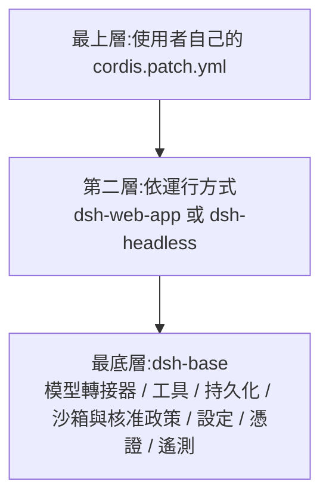
```mermaid
flowchart TB
    A["最上層:使用者自己的 cordis.patch.yml"] --> B["第二層:依運行方式<br/>dsh-web-app 或 dsh-headless"]
    B --> C["最底層:dsh-base<br/>模型轉接器 / 工具 / 持久化 / 沙箱與核准政策 / 設定 / 憑證 / 遙測"]
```

**✅ 補正影片:實際的層次比影片講的多一層,而且有明確的套用順序。** 原始碼文件寫的是:先套用 **profile 列出的每個 bundle(依序)**,再套 **profile 自己的 `cordis.patch.yml`**,再套 **home 層級的**,最後才是 `--patch` 覆蓋層。而 patch 是**依 row id 定位、替換整份 config,或插入新 row**。

想看你的機器實際開出什麼樹:

```sh
dsh --profile web --dump-config
```

**印出來的任何一 row,你都能用自己的 patch 換掉。**

> 影片的總結很到位:**這套設計不只是讓功能可以開關,整個產品本身就是插件組合出來的。** 想換模型就提供新轉接器;想把本地執行遷到遠端沙箱就替換能力提供方;想讓某類 session 少用幾個工具就換一份 agent 預設 —— **agent loop 不需要知道背後的具體實作。**

---

## 三、Turn 與 Step:執行模型

### 入口:Inbox 的三種動作

影片講的三種動作是對的,但**原始碼給了更精確的定位**:

| 動作 | 行為 | 用途 |
|---|---|---|
| **`followup`** | 把新工作放到下一輪,**並喚醒 agent** | 後續任務 |
| **`steer`** | 在當前工作過程中補充指令,讓 agent 在下一個 step 處理,**同樣喚醒** | 即時修正方向 |
| **`inject`** | 也給下一個 step 補上下文,**但不會主動喚醒 agent** | 讓工具或插件先留下資訊,等下一項真實任務來時一起處理 |

**✅ 補正:原始碼文件說明這三者其實是「統一 `send` 方法的固定預設別名」**,`send` 直接暴露 target 與 wakeup 路由。也就是說,**「喚不喚醒」是一個正交參數,不是三個不同的機制。**

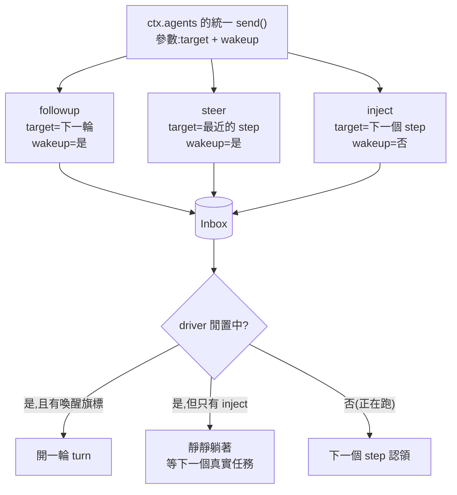
```mermaid
flowchart TB
    S["ctx.agents 的統一 send()<br/>參數:target + wakeup"] --> F["followup<br/>target=下一輪<br/>wakeup=是"]
    S --> ST["steer<br/>target=最近的 step<br/>wakeup=是"]
    S --> IJ["inject<br/>target=下一個 step<br/>wakeup=否"]
    F --> IB[("Inbox")]
    ST --> IB
    IJ --> IB
    IB --> W{"driver 閒置中?"}
    W -->|"是,且有喚醒旗標"| GO["開一輪 turn"]
    W -->|"是,但只有 inject"| WAIT["靜靜躺著<br/>等下一個真實任務"]
    W -->|"否(正在跑)"| NEXT["下一個 step 認領"]
```

⚠️ 一個容易漏掉的細節:**被拒絕的 step 會把 steering 留在 inbox 裡等下一次**,而不是丟掉。

另有一個細節值得記:**被拒絕的 step 會把 steering 留在 inbox 裡,等到下一次**,而不是丟掉。

### Turn / Step 的定義

> **一個 step = 一次模型請求 + 這次回答觸發的工具呼叫。**
> **一個 turn = 零或多個 step** —— 在第一個輸入被認領前開啟,在「沒有任何東西還欠著」時關閉。

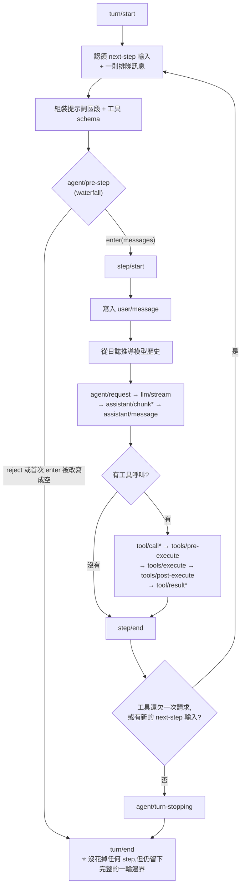
```mermaid
flowchart TB
    TS["turn/start"] --> CLAIM["認領 next-step 輸入<br/>+ 一則排隊訊息"]
    CLAIM --> ASM["組裝提示詞區段 + 工具 schema"]
    ASM --> PRE{"agent/pre-step<br/>(waterfall)"}
    PRE -->|"reject 或首次 enter 被改寫成空"| TE["turn/end<br/>⭐ 沒花掉任何 step,但仍留下完整的一輪邊界"]
    PRE -->|"enter(messages)"| SS["step/start"]
    SS --> UM["寫入 user/message"]
    UM --> DERIVE["從日誌推導模型歷史"]
    DERIVE --> REQ["agent/request → llm/stream<br/>→ assistant/chunk* → assistant/message"]
    REQ --> TOOLS{"有工具呼叫?"}
    TOOLS -->|"有"| TP["tool/call* → tools/pre-execute<br/>→ tools/execute → tools/post-execute<br/>→ tool/result*"]
    TOOLS -->|"沒有"| SE["step/end"]
    TP --> SE
    SE --> MORE{"工具還欠一次請求,<br/>或有新的 next-step 輸入?"}
    MORE -->|"是"| CLAIM
    MORE -->|"否"| STOP["agent/turn-stopping"]
    STOP --> TE
```

### ⭐ 最值得記的一條:每個 step 都重新組裝

影片點出的關鍵:**提示詞、執行期上下文與工具定義,是每個 step 都重新組裝,而不是 agent 建立時只做一次。**

**後果**:權限剛剛變化、工具剛剛卸載、預設配置剛剛換了人格、插件新加了一段工作區說明 —— **下次請求都會拿到當前的真實狀態**。

> 這正是「插件樹可隨時變動」與「agent 正在跑」能夠並存的原因。

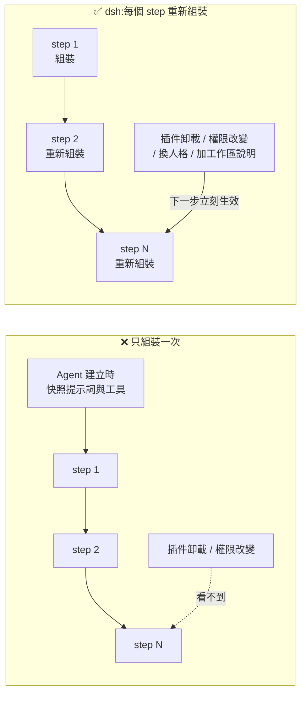
```mermaid
flowchart LR
    subgraph N["❌ 只組裝一次"]
        direction TB
        A1["Agent 建立時<br/>快照提示詞與工具"] --> A2["step 1"] --> A3["step 2"] --> A4["step N"]
        CH1["插件卸載 / 權限改變"] -.->|"看不到"| A4
    end
    subgraph Y["✅ dsh:每個 step 重新組裝"]
        direction TB
        B1["step 1<br/>組裝"] --> B2["step 2<br/>重新組裝"] --> B3["step N<br/>重新組裝"]
        CH2["插件卸載 / 權限改變<br/>/ 換人格 / 加工作區說明"] -->|"下一步立刻生效"| B3
    end
```

### 模型轉接器熱更新時發生什麼

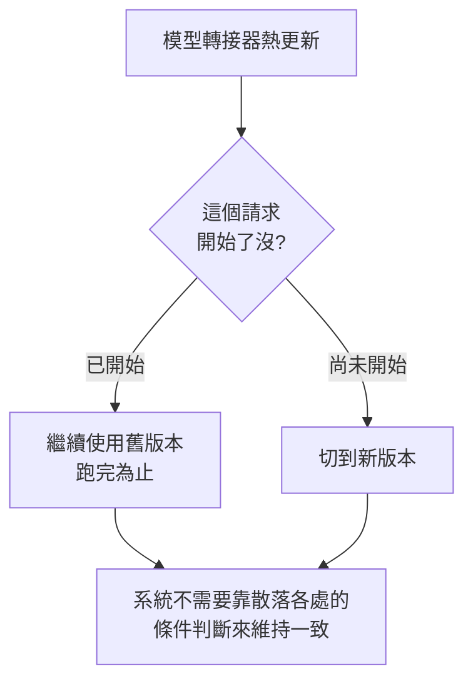
```mermaid
flowchart TB
    HOT["模型轉接器熱更新"] --> Q{"這個請求<br/>開始了沒?"}
    Q -->|"已開始"| OLD["繼續使用舊版本<br/>跑完為止"]
    Q -->|"尚未開始"| NEW["切到新版本"]
    OLD --> DONE["系統不需要靠散落各處的<br/>條件判斷來維持一致"]
    NEW --> DONE
```

### 被拒絕的嘗試也會留下痕跡

`agent/pre-step` 可以改寫或拒絕這批輸入。而即使輸入被拒、最終沒有發出模型請求:

> **這次嘗試也會留下完整的一輪邊界,不會從日誌裡憑空消失。**

⭐ 這是一個很好的稽核設計 —— **「被擋下來」本身也是事實,值得被記錄。**

### `agent/turn-stopping`:最後一次機會

真正結束前,系統會觸發 `agent/turn-stopping` 擴充點,**給插件最後一次要求繼續處理的機會**,之後才寫入 `turn/end`。

> **所以 agent loop 的主要職責是維護狀態變化與事件邊界。** 上下文壓縮、權限檢查、工具逾時**都盡量透過現有擴充點介入,不必不斷給 loop 增加新分支。**

---

## 四、⭐⭐ 事件日誌:回答「它經歷過什麼」

這是全片最有價值的一段,而原始碼把它拉到了「不變式」的高度。

### 問題:日誌與模型實際看見的東西會分岔

> 很多 agent 專案也會記錄日誌,**但真正請求模型時,讀取的卻是另一份記憶體訊息陣列** —— 日誌、網頁、磁碟記錄和模型實際看見的上下文,很容易逐漸分岔。

### dsh 的相反做法

> **⭐ Model-visible means logged.**
> 任何進到模型請求的東西,**都必須能從 session log 重建,而且有一個 runtime invariant 在斷言它。**

所以以下全部進入**同一條只追加、不修改**的事件流:使用者訊息、模型串流回傳的資料塊、組裝後的完整回答、工具呼叫、工具結果,以及 turn 與 step 的邊界。

**寫入時的三道關卡**(影片描述準確):

1. 先產生一份**無損的 JSON 快照** —— **無法可靠保存的資料會被拒絕**
2. 通過檢查後,事件獲得**連續編號**
3. 事件被**深度凍結**

> **事件一旦提交,後面的監聽器即使報錯,也不能撤銷已經發生的事實。**

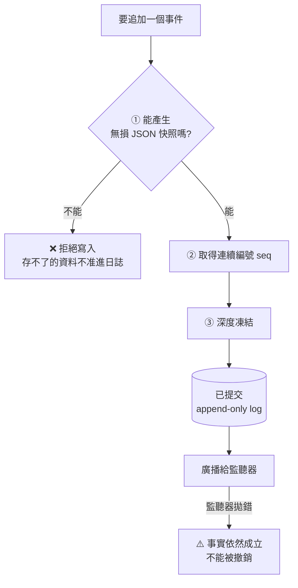
```mermaid
flowchart TB
    E["要追加一個事件"] --> G1{"① 能產生<br/>無損 JSON 快照嗎?"}
    G1 -->|"不能"| REJ["❌ 拒絕寫入<br/>存不了的資料不准進日誌"]
    G1 -->|"能"| G2["② 取得連續編號 seq"]
    G2 --> G3["③ 深度凍結"]
    G3 --> COMMIT[("已提交<br/>append-only log")]
    COMMIT --> LIS["廣播給監聽器"]
    LIS -->|"監聽器拋錯"| STILL["⚠️ 事實依然成立<br/>不能被撤銷"]
```

### 事件的三個域(選錯域是最常見的設計錯誤)

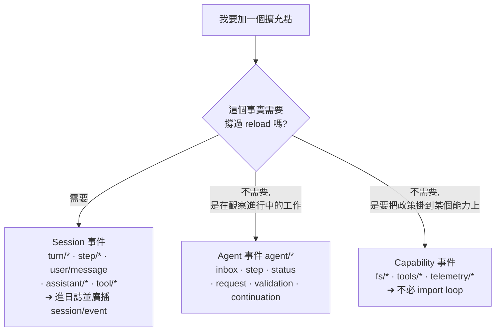
```mermaid
flowchart TB
    ROOT["我要加一個擴充點"] --> Q{"這個事實需要<br/>撐過 reload 嗎?"}
    Q -->|"需要"| SE["Session 事件<br/>turn/* · step/* · user/message<br/>· assistant/* · tool/*<br/>➜ 進日誌並廣播 session/event"]
    Q -->|"不需要,<br/>是在觀察進行中的工作"| AE["Agent 事件 agent/*<br/>inbox · step · status<br/>· request · validation · continuation"]
    Q -->|"不需要,<br/>是要把政策掛到某個能力上"| CE["Capability 事件<br/>fs/* · tools/* · telemetry/*<br/>➜ 不必 import loop"]
```

### Surface:壓縮不刪舊資料

模型歷史是從日誌推導的:系統選出「當前應該進入模型上下文」的那部分事件,這個有效視圖叫 **Surface**。

對話太長需要壓縮時:

> **系統不會回頭刪除或修改舊訊息,而是追加一條替換記錄**,用摘要取代有效視圖裡的一段舊內容。
> 此後模型看到的是摘要,**而原始資料塊與完整訊息仍然保留在日誌中** —— 回放、稽核與問題定位都不會失去依據。

⭐ 這是「append-only + 投影」的教科書用法:**改變模型看到的東西,不等於改變發生過的事實。**

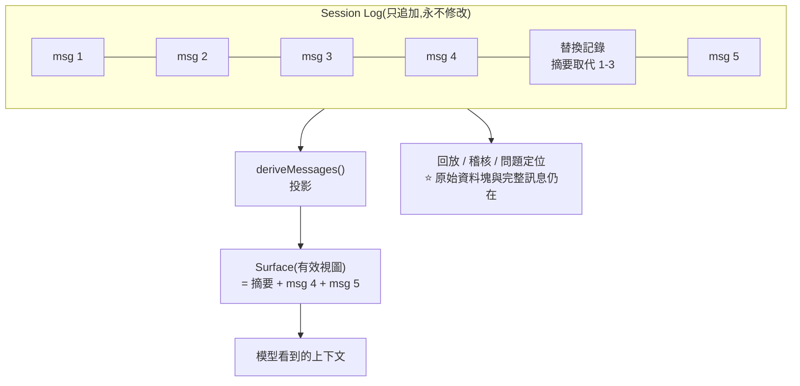
```mermaid
flowchart TB
    subgraph LOGV["Session Log(只追加,永不修改)"]
        direction LR
        L1["msg 1"] --- L2["msg 2"] --- L3["msg 3"] --- L4["msg 4"] --- LR2["替換記錄<br/>摘要取代 1-3"] --- L5["msg 5"]
    end
    LOGV --> PROJ["deriveMessages()<br/>投影"]
    PROJ --> SURF["Surface(有效視圖)<br/>= 摘要 + msg 4 + msg 5"]
    SURF --> MODEL["模型看到的上下文"]
    LOGV --> AUDIT["回放 / 稽核 / 問題定位<br/>⭐ 原始資料塊與完整訊息仍在"]
```

> ⚠️ **對比常見做法**:多數專案壓縮時直接把舊訊息從陣列裡刪掉 —— 於是**事後永遠無法還原「模型當時到底看到了什麼」**。

### ⭐⭐ 崩潰恢復:區分「沒做」與「不知道有沒有做」

這是本篇最實用的一段。假設模型要求執行一個工具:

| 情況 | 日誌狀態 | 系統怎麼處理 |
|---|---|---|
| **① 行程在工具真正啟動前崩潰** | 沒有工具呼叫紀錄 | 明確記下**「工具未啟動」**;模型知道這個操作沒發生,**必要時可以重新執行** |
| **② 已有工具呼叫,卻沒有保存下來的執行結果** | 工具**開始了**,但結果不明 | ⚠️ **系統不會假定它失敗,也不會直接重跑**,而是補上一條**「工具結果未知」** |

第②種的處置最值得學:

> 工具**可能已經改完檔案,甚至已經向外部系統發出請求**。
> **恢復提示會要求模型先檢查外部狀態。**
> **只有唯讀操作、或重複執行也不會產生額外影響的操作,才適合直接重試。**

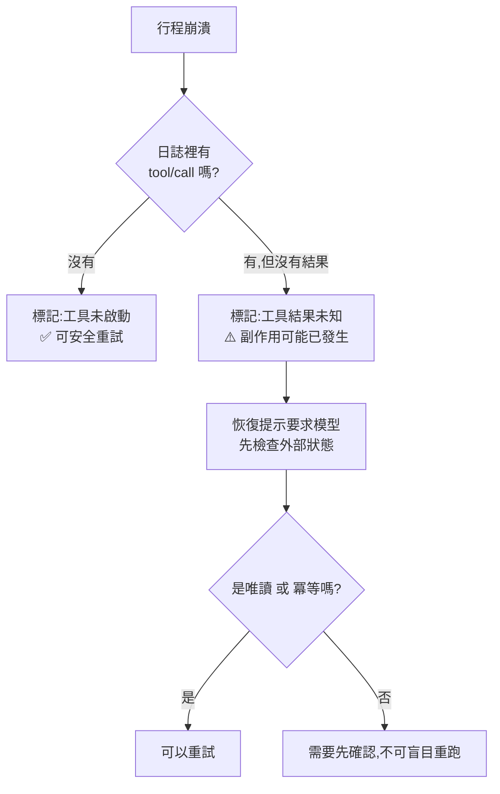
```mermaid
flowchart TB
    C["行程崩潰"] --> Q{"日誌裡有<br/>tool/call 嗎?"}
    Q -->|"沒有"| N["標記:工具未啟動<br/>✅ 可安全重試"]
    Q -->|"有,但沒有結果"| U["標記:工具結果未知<br/>⚠️ 副作用可能已發生"]
    U --> CHK["恢復提示要求模型<br/>先檢查外部狀態"]
    CHK --> D{"是唯讀 或 冪等嗎?"}
    D -->|"是"| R["可以重試"]
    D -->|"否"| M["需要先確認,不可盲目重跑"]
```

> **一般的執行日誌主要幫人追查問題;這裡的事件日誌,還會直接決定 agent 下一步怎麼行動,才不會重複製造副作用。**

**✅ 原始碼補充**:崩潰修復會**合成一個 `interrupted` 的 turn 結束原因**(這是唯一沒有任何 loop 會發出、只由崩潰修復產生的原因),而且**只會關閉真正處於開啟狀態的尾端 turn**。另外 `max-tokens` 會讓整個 turn 以 `max-tokens` 而非 `completed` 結束 —— **「被截斷」這個事實會壓過後續的續作**,讓消費端能分辨乾淨停止與截斷。

同一條事件流還支撐 **session 恢復、分岔(fork)與網頁回放** —— **每個入口不必各自維護一套歷史解釋方式。**

---

## 五、Capability Seam:能力接縫

插件變多之後依賴會纏在一起,dsh 用一條清晰的能力邊界來控制。

**一項完整能力分三個角色:**

| 角色 | 職責 |
|---|---|
| **Service Definition** | 宣告介面 |
| **Service Provider** | 實作介面 |
| **Consumer** | 依賴介面來調用能力(**面向模型的工具通常屬於這層**) |

⚠️ **原始碼的定義比影片嚴格**:術語表明說 **seam 指的是「完整的能力」,絕不是其中一個角色** —— 單一角色不構成 seam,而且 Service Definition **必須是擁有 `ctx.<key>` 的 Cordis `Service`(抽象類別或具體註冊表),而不是 TypeScript `interface`**。

`packages/shell` 是標準範例:`dsh-shell`(定義)、`dsh-bash-local` / `dsh-bash-sandbox`(兩個 provider)、`dsh-tool-bash`(consumer)。

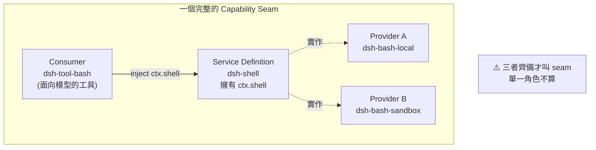
```mermaid
flowchart TB
    subgraph SEAM["一個完整的 Capability Seam"]
        DEF["Service Definition<br/>dsh-shell<br/>擁有 ctx.shell"]
        P1["Provider A<br/>dsh-bash-local"]
        P2["Provider B<br/>dsh-bash-sandbox"]
        CON["Consumer<br/>dsh-tool-bash<br/>(面向模型的工具)"]
        DEF -.->|"實作"| P1
        DEF -.->|"實作"| P2
        CON -->|"inject ctx.shell"| DEF
    end
    NOTE["⚠️ 三者齊備才叫 seam<br/>單一角色不算"]
```

### ⭐ 為什麼「換一個 provider」能搬動整個執行世界

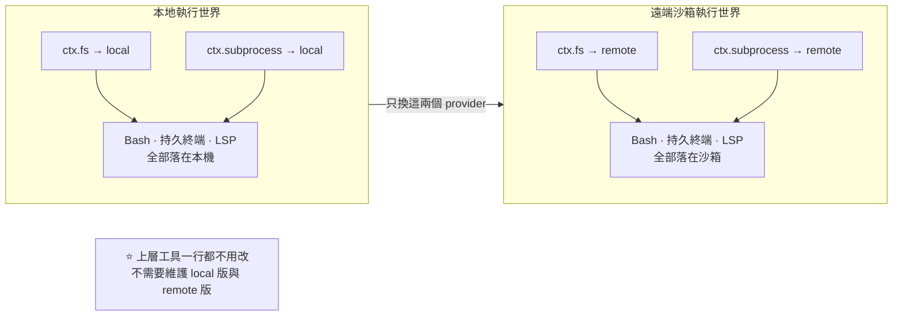
```mermaid
flowchart LR
    subgraph LOCAL["本地執行世界"]
        FS1["ctx.fs → local"]
        SP1["ctx.subprocess → local"]
        FS1 & SP1 --> T1["Bash · 持久終端 · LSP<br/>全部落在本機"]
    end
    subgraph REMOTE["遠端沙箱執行世界"]
        FS2["ctx.fs → remote"]
        SP2["ctx.subprocess → remote"]
        FS2 & SP2 --> T2["Bash · 持久終端 · LSP<br/>全部落在沙箱"]
    end
    LOCAL -->|"只換這兩個 provider"| REMOTE
    NOTE2["⭐ 上層工具一行都不用改<br/>不需要維護 local 版與 remote 版"]
```

### 為什麼這件事有威力

> 檔案系統與子行程 provider **共用同一個執行世界**,所以**只要同時替換這兩個 provider,就能把整個執行環境遷到遠端沙箱 —— Bash、持久終端與語言伺服器會一起遷移,不需要分別維護本地版與遠端版。**

⭐ **子 agent 也建立在同一條接縫上**:系統可以在當前行程裡新建 agent,也可以把任務交給外部 runtime。**多 agent 工作流因此不必把專用語法寫進 agent loop。**

> 對照 [[seven-agent-architectures-selection-guide]]:這是「Router + Skill」與「多 Agent 協作」在架構層的統一 —— **差別只是換一個 provider,而不是換一套流程。**

---

## 六、工具執行管線:權限不是一句提示詞

工具不是「找到函式就直接執行」,每次呼叫都要走一條固定流程。原始碼的管線圖比影片更完整:

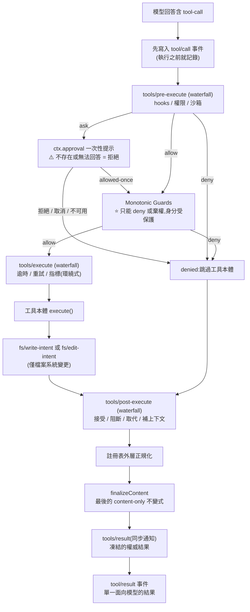
```mermaid
flowchart TB
    A["模型回答含 tool-call"] --> L["先寫入 tool/call 事件<br/>(執行之前就記錄)"]
    L --> PRE["tools/pre-execute (waterfall)<br/>hooks / 權限 / 沙箱"]
    PRE -->|"ask"| AP["ctx.approval 一次性提示<br/>⚠️ 不存在或無法回答 = 拒絕"]
    AP -->|"allowed-once"| G
    AP -->|"拒絕 / 取消 / 不可用"| DEN["denied:跳過工具本體"]
    PRE -->|"deny"| DEN
    PRE -->|"allow"| G["Monotonic Guards<br/>⭐ 只能 deny 或棄權,身分受保護"]
    G -->|"deny"| DEN
    G -->|"allow"| EX["tools/execute (waterfall)<br/>逾時 / 重試 / 指標(環繞式)"]
    EX --> BODY["工具本體 execute()"]
    BODY --> FSG["fs/write-intent 或 fs/edit-intent<br/>(僅檔案系統變更)"]
    FSG --> POST
    DEN --> POST["tools/post-execute (waterfall)<br/>接受 / 阻斷 / 取代 / 補上下文"]
    POST --> NORM["註冊表外層正規化"]
    NORM --> FIN["finalizeContent<br/>最後的 content-only 不變式"]
    FIN --> RES["tools/result(同步通知)<br/>凍結的權威結果"]
    RES --> TR["tool/result 事件<br/>單一面向模型的結果"]
```

**⭐ 最值得記的一條:Monotonic Guard 只能收緊。**

> 「單向保護規則**只能進一步收緊權限,前面的策略不能繞過它**。」

這與 [[dbx-rust-database-client-mcp]] 的「MCP 權限只能收緊」是同一個設計原則 —— **政策層可以疊加,但方向是單向的。**

### 結果的處理

成功結果必須先通過**輸出格式校驗**成為結構明確的 JSON,然後**工具自己的渲染器**把同一份結果轉成模型需要的內容塊,並生成網頁需要的展示資訊。

> **模型看到的文字與網頁卡片來自同一份標準結果,不需要各自猜測工具輸出的結構。**

### 併發與取消

- **可併發的工具**進入一個**限制併發數量的執行池**;**必須獨占的工具形成屏障**
- ⭐ **但策略判斷與最終寫入日誌的順序,仍然與模型給出的呼叫順序一致**
- **取消時**:已啟動的呼叫要先結束或停止;**尚未啟動的呼叫也會得到一條系統生成的結果** —— **保證日誌裡不會留下「只有呼叫、沒有結果」的懸空紀錄**

> 最後這條又回到同一個原則:**日誌的完整性優先於省事。**

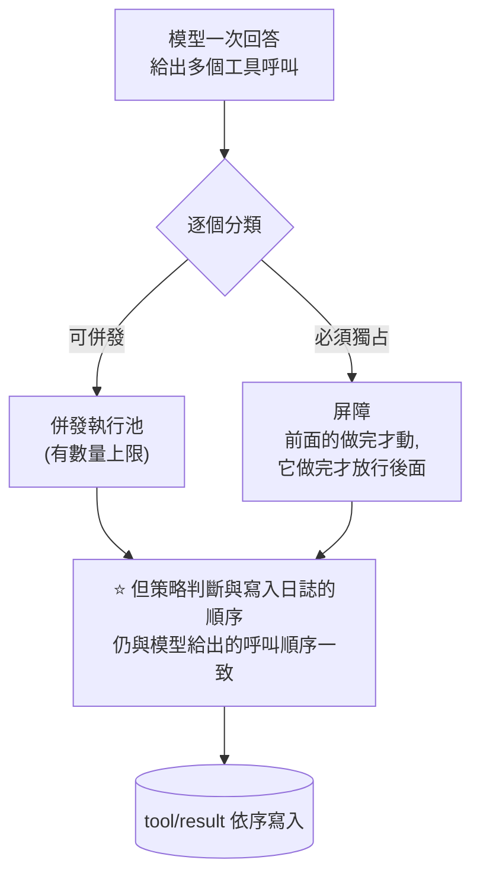
```mermaid
flowchart TB
    M["模型一次回答<br/>給出多個工具呼叫"] --> CLS{"逐個分類"}
    CLS -->|"可併發"| POOL["併發執行池<br/>(有數量上限)"]
    CLS -->|"必須獨占"| BAR["屏障<br/>前面的做完才動,<br/>它做完才放行後面"]
    POOL --> ORD["⭐ 但策略判斷與寫入日誌的順序<br/>仍與模型給出的呼叫順序一致"]
    BAR --> ORD
    ORD --> LOGW[("tool/result 依序寫入")]
```

### 取消時怎麼保證日誌不留空洞

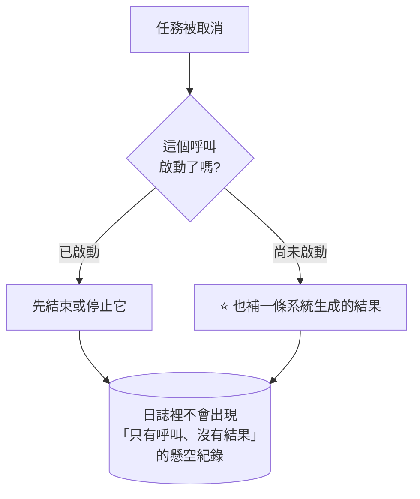
```mermaid
flowchart TB
    C["任務被取消"] --> S{"這個呼叫<br/>啟動了嗎?"}
    S -->|"已啟動"| E1["先結束或停止它"]
    S -->|"尚未啟動"| E2["⭐ 也補一條系統生成的結果"]
    E1 --> OK[("日誌裡不會出現<br/>「只有呼叫、沒有結果」<br/>的懸空紀錄")]
    E2 --> OK
```

---

## 七、⚠️ 安全邊界:影片講得比多數介紹誠實

- 發行配置**預設只允許寫工作區**,超出範圍就會來問你
- ⭐ **如果所有可用的限制方式都失敗,系統會直接拒絕執行,不會悄悄改成不受限制的運行方式**
- ⚠️ **但這套沙箱目前只管檔案,不等於網路隔離**;任意網址抓取預設也沒有打開
- ⚠️ **能編寫執行期插件的工具,以及使用者自己建立的預設配置,都可以獲得很高的系統能力 —— 應該按照「命令列 Shell 的權限」來對待**

> 最後那句是很好的心智模型:**「安裝一個能寫執行期插件的東西」≈「給它一個 shell」。** 這與 [[agent-skill-three-layer-run-do-verify]] 的結論一致 —— **這類擴充就是供應鏈輸入。**

### 工程檢查

影片說「核心 runtime 每個原始檔都要跑到 100% 行覆蓋」,**原始碼證實了,而且文件自己加了一句更重要的話**:

> **覆蓋率門檻**(`pnpm run test:coverage`):對 `packages/*/*/src` **逐檔 100%**。
> **未覆蓋的行,往往是門檻正確標示出來、應該刪掉的死程式碼,而不是要補上去的測試。**
> ⭐ **「行覆蓋是必要條件,永遠不是充分條件 —— 它證明那些行跑過了,不證明功能如出貨般運作。」**

測試範圍還包括真實模型、協議快照、瀏覽器與跨平台沙箱。

### ⚠️ 但它仍是 developer preview

README 開宗明義:**「THERE WILL BE COMPATIBILITY-BREAKING CHANGES.」** 影片的定位很準:

> **適合用來研究與搭建本地 agent 平台,還不能當成已經穩定的生產基礎設施。**

---

## 八、⭐⭐⭐ 底下那篇論文:為什麼「卸載一個元件」需要形式化

dsh 的 README 指向 Cordis,而 Cordis 指向這篇 88 頁的論文。**它把上面所有工程設計的「為什麼」講清楚了。**

**《A Programming Paradigm for Spatiotemporal Composability》**
作者:Yifan Shi(北大 + DeepSeek-AI)、Wei Zhang(北大)、Tianyi Cui(DeepSeek-AI)
⚠️ **2026-08-13 preprint,repo 明說「under active revision,內容可能大幅變動」。**

### 兩個正交維度

| 維度 | 要求 | 靜態情況下退化成 |
|---|---|---|
| **時間可組合性** | 元件移除時,它對共享環境的修改**必須完整且安全地回復** | 語彙作用域(RAII、bracket) |
| **空間可組合性** | 元件必須能**宣告、發現、解析**彼此的依賴 | 模組 import 解析 |

**動態情境下兩者都變難**:時間維度要處理**作用域不受語彙界定的長生命週期有狀態 effect**;空間維度要處理**執行期會出現、消失、變更身分的依賴**。

### 動機一:VSCode 的量化證據

論文用實際數據說明現有插件系統的極限(資料取自 2026-06-09 的 Marketplace):

- **時間限制**:安裝數前 100 的擴充中,**87 個含可執行程式碼**,移除必須重啟整個 extension host。`deactivate` 只是行程終止時的優雅收尾,**不支援活體移除**;而且它**把 effect 的釋放與建立(`activate`)拆開,違反關注點局部性,讓完整清理難以驗證**。
- **空間限制**:前 100 名中**只有 7 個**對非內建擴充宣告 `extensionDependencies`。而且跨擴充互動回傳的值**預設是 `any`,沒有可檢查的介面契約**。

### 動機二:自我演化的 agent harness(這正是 dsh)

> 未來的 harness 可能**一邊持續服務請求,一邊生成並部署對自身元件的修改**。
> 沒有時間可組合性 → 每次自我修改都要全重啟、丟掉所有行程內累積狀態;**更糟的是,一次有問題的自我修改,可能癱瘓掉用來復原的那個行程。**
> 沒有空間可組合性 → 每個模組得自己偵測依賴的出現、消失與身分變更,**而且只能用臨時手段**。

### 為什麼「重啟就好」不夠

作業系統提供**行程粒度**的時間可組合性,容器編排提供**服務粒度**的空間可組合性。但:

- **時間上**:每次重啟丟掉所有行程內狀態(快取、連線、部分計算),重建要**數秒到數分鐘**;要維持可用性就得養冗餘副本
- **空間上**:容器層**無法表達共用位址空間的元件之間的依賴**,還替本可是本地函式呼叫的互動加上網路開銷

> **兩種機制都運作在行程與容器的邊界上,而現代系統的組合粒度越來越細 —— 這個粒度錯配,要求一個能在「與元件同一層級」管理 effect 與依賴的抽象。**

### 技術路線:把靜態的 effect / coeffect 提升為執行期機制

effect 系統形式化「計算**如何修改**環境」,coeffect 系統形式化「計算**如何依賴**環境」—— 恰好對應那兩個維度。但兩者都是**靜態工具**。論文的做法不是加更多標註:

> **與其用更多標註去擴充靜態型別系統,我們把 effect 與 coeffect 的概念結構「具現化」,讓 runtime 能直接操作它們,把這些系統靜態提供的保證,動態地建立起來。**

三項核心貢獻:

1. **Revertible effects** —— 每個 context 變換都攜帶一個 runtime 追蹤的**明確逆變換**,而且追蹤與復原都保持組合性 ⇒ **本地時間可組合性**
2. **Reactive coeffects** —— 元件把所需 coeffect 宣告為 spec,**每次 context 變動都對照 spec 通知該元件**(activating / deactivating / neutral)⇒ **本地空間可組合性**
3. **統一 context 型別** —— 把 effect context 與 coeffect context 合而為一,**coeffect 上的一個觀察等價關係,供給了 effect 所需的獨立性**

### ⭐⭐ 最漂亮的結果:Confluence(匯流性)

> **系統的動態歷史不留下任何痕跡。**
> 不論一個運行中的系統經歷過什麼樣的啟用/停用序列,**它靜止時的狀態,等同於「把最終處於 active 的那些元件,依相依順序一次載入、且從未卸載」所得到的狀態。**
> 生命週期關係是 **confluent** 的,而它收斂到的正規形式**就是靜態組裝的結果**。

論文自己給的類比:這是增量計算中「與從頭重算一致」在動態組合上的對應物。

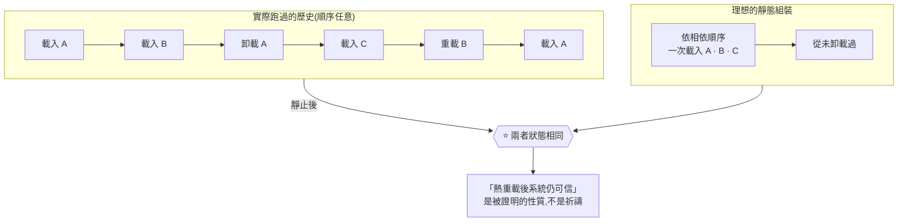
```mermaid
flowchart TB
    subgraph HIST["實際跑過的歷史(順序任意)"]
        direction LR
        H1["載入 A"] --> H2["載入 B"] --> H3["卸載 A"] --> H4["載入 C"] --> H5["重載 B"] --> H6["載入 A"]
    end
    subgraph IDEAL["理想的靜態組裝"]
        direction LR
        I1["依相依順序<br/>一次載入 A · B · C"] --> I2["從未卸載過"]
    end
    HIST -->|"靜止後"| EQ{{"⭐ 兩者狀態相同"}}
    IDEAL --> EQ
    EQ --> R["「熱重載後系統仍可信」<br/>是被證明的性質,不是祈禱"]
```

### Reactive Coeffect:依賴變動時元件的狀態機

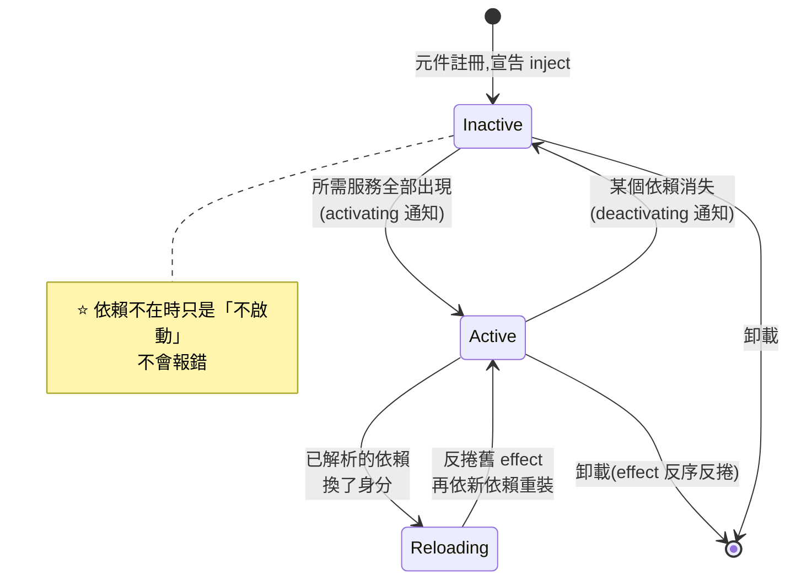
```mermaid
stateDiagram-v2
    [*] --> Inactive: 元件註冊,宣告 inject
    Inactive --> Active: 所需服務全部出現<br/>(activating 通知)
    Active --> Inactive: 某個依賴消失<br/>(deactivating 通知)
    Active --> Reloading: 已解析的依賴<br/>換了身分
    Reloading --> Active: 反捲舊 effect<br/>再依新依賴重裝
    Active --> [*]: 卸載(effect 反序反捲)
    Inactive --> [*]: 卸載
    note right of Inactive
        ⭐ 依賴不在時只是「不啟動」
        不會報錯
    end note
```

> ⭐ **這條定理直接支撐了 dsh 的「熱重載後系統仍然可信」** —— 你不需要相信「重載沒有留下殘渣」,那是被證明的。

### 案例研究是 Koishi,不是 dsh

論文的實證是 **Koishi**(聊天機器人框架),**四年累積 4000+ 社群插件**。驗證了兩件事:

- **表達力**:每個功能都是插件,**宿主框架只提供領域詞彙**
- **通用性**:同一模型也用在**瀏覽器端的 web console** 這個完全不同的 runtime 上

⚠️ **三個誠實標註**(論文自己寫的):

1. **Koishi 用的是 Cordis v3,論文講的是 v4**(v4 精煉了 effect/coeffect 語意並重新設計 loader,核心組合模型共用)
2. 證據來自**單一生態、單一宿主語言**,**無法區分典範本身與其 TypeScript 實作的功勞**
3. **這是觀察性而非對照實驗** —— 所建立的是「存在與採用」的結果,**不是量化結果**;測量抽象的開銷與對開發者生產力的影響**仍是未來工作**

### 論文裡直接對應 dsh 安全設計的一節

**能力式存取控制**:`inject` 宣告等同**能力請求**,context proxy 等同**能力仲介** —— **未宣告的存取直接報錯**。而因為請求是靜態宣告的:

> **一個元件需要的完整能力集合,在它跑起來之前就已知,讓 orchestrator 能在載入時審核並核准,而不是等存取發生才發現。**

更細的政策靠攔截機制,而關鍵在於位置:

> **因為攔截住在 context 上,而不在任一方的程式碼裡**,orchestrator 可以在**不修改 provider** 的情況下限制任何元件的存取(例如只給社群元件唯讀資料庫,核心元件保有完整權限);而且**因為攔截只影響依賴「如何被調用」、不影響它「是否被滿足」,可以在執行期安裝、重設或移除,不觸發任何 reload、不擾動依賴圖。**

⚠️ **但論文明說語言層擋不住不可信程式碼**:惡意元件只要能碰到宿主 runtime 就能直接摸到底層物件,**沙箱需要語言手段之外的執行邊界**(SFI、獨立語言 runtime、沙箱行程或虛擬化容器)。

> **這正好解釋了 dsh 為什麼要有 `ctx.sandbox` 這個 seam,以及為什麼它的沙箱「只管檔案、不等於網路隔離」是個誠實的限制而非疏忽。**

---

## 九、三層對照:同一件事的三種說法

| 概念 | 論文(理論) | Cordis(框架) | dsh(產品) |
|---|---|---|---|
| 卸載要能還原 | **Revertible effects** | `ctx.effect()` 回傳 disposer | 插件卸載時服務撤銷、監聽器移除、子插件與背景任務一起結束 |
| 依賴要能動態解析 | **Reactive coeffects** | `inject` 宣告 + 服務出現才啟動 | 換 provider 就換掉整個執行環境 |
| 重載後系統可信 | **Confluence 定理** | HMR | 模型轉接器熱更新時,**已開始的請求繼續用舊版,後續請求切新版** |
| 能力邊界 | 能力式存取控制 + 攔截 | context proxy 仲介 | **Capability Seam**(定義 / 提供方 / 使用方) |
| 不可信程式碼 | **語言層不夠,需要外部沙箱** | 論文列為 future work | `ctx.sandbox` seam ⚠️ 目前只管檔案 |

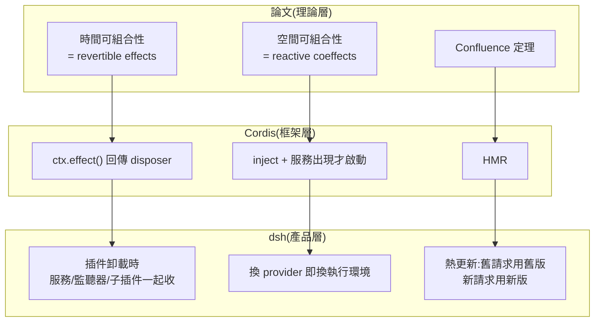
```mermaid
flowchart TB
    subgraph TH["論文(理論層)"]
        T1["時間可組合性<br/>= revertible effects"]
        T2["空間可組合性<br/>= reactive coeffects"]
        T3["Confluence 定理"]
    end
    subgraph FW["Cordis(框架層)"]
        F1["ctx.effect() 回傳 disposer"]
        F2["inject + 服務出現才啟動"]
        F3["HMR"]
    end
    subgraph PR["dsh(產品層)"]
        P1["插件卸載時<br/>服務/監聽器/子插件一起收"]
        P2["換 provider 即換執行環境"]
        P3["熱更新:舊請求用舊版<br/>新請求用新版"]
    end
    T1 --> F1 --> P1
    T2 --> F2 --> P2
    T3 --> F3 --> P3
```

---

## 應用案例

### 案例 1|⭐ 把「三個崩潰狀態」抄進任何有副作用的自動化

這是本文最可直接套用的東西,而且**跟 agent 無關也成立**。任何「呼叫外部系統 + 可能中斷」的流程都該區分三態,而不是兩態:

```
❌ 常見的兩態:成功 / 失敗
✅ 應有的三態:
   ① 確定沒開始   → 可以安全重試
   ② 確定完成了   → 不要重試
   ③ 開始了但結果不明 → ⚠️ 先查外部狀態,不要盲目重跑
```

實作要點(照 dsh 的做法):

- **在執行「之前」就寫下「我要執行了」** —— 這樣崩潰後才能區分 ① 與 ③
- 恢復時**明確標記 ③,而不是猜測它失敗**
- **只有唯讀或冪等的操作才可以直接重試**;其餘要先對帳

⚠️ 本倉庫的 cron 流程就缺這一層:**Whisper 轉錄到一半失敗是整批重來**,而如果哪天流程裡加入了「已經 commit 但還沒 push」這類中間狀態,就會需要這個區分。

### 案例 2|「Model-visible means logged」可以推廣成一條稽核原則

把它改寫成通用形式:

> **任何影響決策的輸入,都必須能從持久紀錄重建。**

檢查你的系統:

| 問題 | 不合格的徵兆 |
|---|---|
| 模型/規則引擎實際看到的輸入,能從日誌重建嗎? | 日誌記的是「摘要」,決策用的是另一份記憶體結構 |
| 壓縮/截斷是**追加一筆替換記錄**,還是**就地刪改**? | 舊資料被覆寫,事後無法回放 |
| 被拒絕的請求有留下紀錄嗎? | 只記成功路徑,擋掉的東西查不到 |

⭐ **dsh 的 Surface 概念值得單獨抄:改變「模型看到什麼」與改變「發生過什麼」,必須是兩件事。**

### 案例 3|用「三角色」檢查你的抽象是不是真的可替換

很多人以為抽了個 interface 就叫解耦。論文與 dsh 的定義更嚴格 —— **要同時有 Service Definition、Provider、Consumer 三者,少一個就不是 seam。**

自我檢查:

```
① 介面的擁有者是誰?(不能是「大家共用的一個 types.ts」)
② 現在有幾個 provider?只有一個的話,你其實還沒驗證過可替換性
③ consumer 是透過 key/註冊表拿到它,還是 import 了具體實作?
```

⚠️ **第 ② 點最常被忽略**:`dsh-shell` 之所以是好例子,正是因為它**同時有 local 與 sandbox 兩個 provider** —— 抽象只有在被用兩次之後才算被驗證過。

### 案例 4|「單向收緊」是可抄的權限原則

dsh 的 monotonic guard **只能 deny 或棄權,前面的策略不能繞過它**。這個模式可以套在任何多層政策系統:

```
政策層可以疊加,但每一層只能讓權限更小,不能更大。
最終權限 = 所有層的交集,而不是最後一層說了算。
```

好處是**加一層永遠是安全的** —— 你不必擔心新插件把既有限制放寬。這與 [[dbx-rust-database-client-mcp]] 的 MCP 權限設計、[[encrypted-reasoning-traces-portable-key-flaw]] 的防禦分層是同一套思路。

### 案例 5|把論文的兩個維度當成架構選型的提問

下次評估任何插件化 / 擴充化系統,問兩句:

| 問題 | 對應維度 | 不合格的答案 |
|---|---|---|
| **移除一個擴充,要不要重啟?** | 時間可組合性 | 「要重啟」= 沒有時間可組合性 |
| **擴充之間能不能安全地互相依賴?** | 空間可組合性 | 「可以,但回傳 `any`」= 沒有契約 |

⭐ 而論文提供的**判準門檻**很高也很清楚:**熱重載之後,系統狀態應該等同於「從頭靜態組裝一次」的結果。** 如果做不到這點,那所謂的「熱重載」只是「碰巧沒壞」。

### 案例 6|對照 herdr:兩種 runtime 取徑

本倉庫另一篇 [[herdr-terminal-runtime-agent-to-agent]] 講的也是「agent runtime」,但路線完全相反,值得並排看:

| | **herdr** | **dsh** |
|---|---|---|
| 定位 | **擁有既有 agent 的終端** | **agent 跑在裡面的執行環境** |
| 對 agent 的要求 | **零** —— 用 regex 讀終端畫面猜狀態 | agent loop 本身就是它的插件 |
| 適配成本 | 寫一份 regex manifest | 實作 seam 的三個角色 |
| 脆弱點 | **對方改 UI 就壞** | 自身仍是 developer preview,**session 格式隨時可能變** |
| 可稽核性 | ⚠️ `unknown` 明說不代表完成 | ⭐ **有 runtime invariant 斷言可重建性** |

**兩者不是競爭關係**:herdr 讓你把**別人的**現成 agent 編排起來;dsh 讓你**自己蓋**一個能自我修改的 agent 平台。**選哪個取決於你要不要擁有那個 loop。**

---

## 重點回顧(TL;DR)

1. **⭐ 一句話**:**插件樹決定 agent「是誰、擁有什麼」;事件日誌決定它「經歷過什麼、接下來還能安全地做什麼」。**
2. **幾十行的 loop 會長成 runtime**,是因為要回答四個問題:崩潰怎麼辦、副作用發生了沒、哪些工具能併發、**新增能力要不要改 loop**。
3. **"Everything is a Plugin" 是字面意思**:模型轉接器、工具註冊表、session log、**乃至 agent loop 本身**都是插件;**沒有特權核心可以打補丁**。
4. **Cordis 五觀念**:插件即 Service、context 是服務倉庫、**`inject` 讓載入順序由服務需求表達**、型別化事件(四種派送模式是公開契約)、**註冊是可逆 effect**。
5. **✅ 補正影片**:啟動分層有明確順序(bundle 依序 → profile patch → home patch → `--patch`),而且 `dsh --profile web --dump-config` 印出的**任何一 row 都能被自己的 patch 換掉**。
6. **Inbox 三動作**:`followup`(喚醒)/ `steer`(當前工作中補指令、喚醒)/ `inject`(補上下文、**不喚醒**)。✅ 原始碼補充:三者是**統一 `send` 的固定預設別名**,喚不喚醒是正交參數。
7. **step = 一次模型請求 + 它觸發的工具;turn = 零或多個 step。** ⭐ **每個 step 都重新組裝提示詞與工具定義**,所以插件樹的變動能即時反映。
8. **被拒絕的嘗試也留下完整的一輪邊界** —— 「被擋下來」本身也是事實。
9. **⭐⭐ Model-visible means logged**:進到模型請求的東西都必須能從日誌重建,**有 runtime invariant 在斷言**。寫入要過三關:無損 JSON 快照(**存不了就拒絕**)→ 連續編號 → 深度凍結。**事件一旦提交,後續監聽器報錯也不能撤銷事實。**
10. **Surface + 追加式壓縮**:壓縮**不刪改舊訊息,而是追加一條替換記錄**;原始資料仍在日誌中,**回放與稽核不失依據**。
11. **⭐⭐ 崩潰恢復區分三態**:未啟動(可重試)/ 完成 / **結果未知(⚠️ 先查外部狀態,只有唯讀或冪等才可直接重試)**。✅ 原始碼補充:崩潰修復合成 `interrupted`,且**只關閉真正開啟的尾端 turn**。
12. **Capability Seam 三角色**(定義 / 提供方 / 使用方)。⚠️ 原始碼定義更嚴:**seam 指完整能力,單一角色不算**;Definition 必須是擁有 `ctx.<key>` 的 Service,**不能只是 TS interface**。換掉 fs 與子行程 provider,**Bash / 終端 / LSP 一起遷到遠端沙箱**。
13. **工具管線**:`tool/call` **執行前就記錄** → `tools/pre-execute` → **monotonic guards(只能收緊,前面的策略繞不過)** → 執行 → `tools/post-execute` → 正規化 → 凍結結果。**併發有池、獨占成屏障,但日誌順序仍與模型的呼叫順序一致**;取消時**未啟動的呼叫也會補一條結果,不留懸空紀錄**。
14. **⚠️ 安全誠實話**:預設只准寫工作區;**所有限制手段都失敗就直接拒絕執行,不會悄悄降級**;**沙箱只管檔案,不等於網路隔離**;能寫執行期插件的東西**應按 shell 權限對待**。
15. **測試門檻**:核心 `src` **逐檔 100% 行覆蓋**,但文件自己說 **「行覆蓋是必要條件、永遠不是充分條件」**,且**未覆蓋的行往往是該刪的死碼**。⚠️ 仍是 **developer preview,會有破壞性變更**。
16. **⭐⭐⭐ 論文回答了「為什麼」**:動態組合有**時間**(移除要能完整回復)與**空間**(依賴要能動態解析)兩個正交維度。VSCode 的數據很有力 —— 前 100 擴充中 **87 個移除要重啟**、**只有 7 個宣告跨擴充依賴**且回傳 `any`。
17. **重啟不夠**:OS 給行程粒度、容器給服務粒度,**但現代系統的組合粒度更細**;重建狀態要數秒到數分鐘,而容器層**表達不了共用位址空間的依賴**。
18. **⭐⭐ Confluence 定理**:**動態歷史不留痕跡** —— 不論經過什麼載入/卸載序列,靜止狀態**等同於依序一次性靜態組裝的結果**。這讓「熱重載後仍可信」成為被證明的性質,而非祈禱。
19. **論文的誠實標註**:案例研究是 **Koishi 而非 dsh**、**Koishi 用 v3 而論文講 v4**、單一生態單一語言、**觀察性而非對照實驗**,是「存在與採用」結果**而非量化結果**。
20. **`inject` = 能力請求,context proxy = 能力仲介**,未宣告的存取直接報錯;**因為攔截住在 context 上而非任一方程式碼裡**,可在執行期調整而不觸發 reload。⚠️ **但語言層擋不住不可信程式碼,沙箱需要語言之外的執行邊界。**

---

## 來源

- [Agent 为什么需要 Runtime?DeepSeek Harness 智能体架构深度解析 — TGLTommy](https://www.youtube.com/watch?v=CGd5zDUrWnw)(2026-08-16,約 12.5 分鐘)
- [deepseek-ai/deepseek-harness](https://github.com/deepseek-ai/deepseek-harness) —— 已 clone 核實:`README.md`、`docs/architecture.md`、`docs/cordis-primer.md`、`docs/tool-execution-pipeline.md`、`docs/capability-seams.md`、`docs/agent-lifecycle.md`、`docs/glossary.md`、`docs/testing.md`、`docs/subsystems/{core,session}.md`
- [cordiverse/cordis](https://github.com/cordiverse/cordis) —— dsh 底下的插件框架
- [cordiverse/paper — 《A Programming Paradigm for Spatiotemporal Composability》](https://github.com/cordiverse/paper) —— 已下載 PDF(88 頁)閱讀:引言與兩個維度、VSCode 量化證據、revertible effects / reactive coeffects、metatheory(Confluence)、實作與 Koishi 案例、討論(存取控制與沙箱、有效性威脅)
- 本倉庫相關筆記:[[seven-agent-architectures-selection-guide]]、[[agent-five-cores-langgraph-trading-agent]]、[[herdr-terminal-runtime-agent-to-agent]]、[[agent-skill-three-layer-run-do-verify]]、[[dbx-rust-database-client-mcp]]

> 該片無字幕,逐字稿以 CPU 版 faster-whisper(small / int8 / zh)轉錄取得,**非官方字幕**,可能有少量聽寫誤差。文中專有名詞已對照原始碼校正(轉錄中的「deep-seq harness / Deepstick Harness」為 **DeepSeek Harness**、「Cordis / Tor-Colis」為 **Cordis**、「XGENT / Z-Agent」為 **Agent / Subagent**、「繪畫」為 **session(會話)**、「日制 / 日字」為**日誌**、「紫進城」為**子行程**、「杀箱 / 杀枪」為**沙箱**、「全线」為**權限**、「摧藥 / 摘药」為**摘要**、「單項保護規則」為 **monotonic guard**)。
>
> ⚠️ **時效性**:`deepseek-harness` 標示為 developer preview 且明說會有破壞性變更;Cordis 論文為 **2026-08-13 preprint、標明 under active revision**。本文所述以整理當時的 main 分支與該版 PDF 為準,細節可能已變動。
