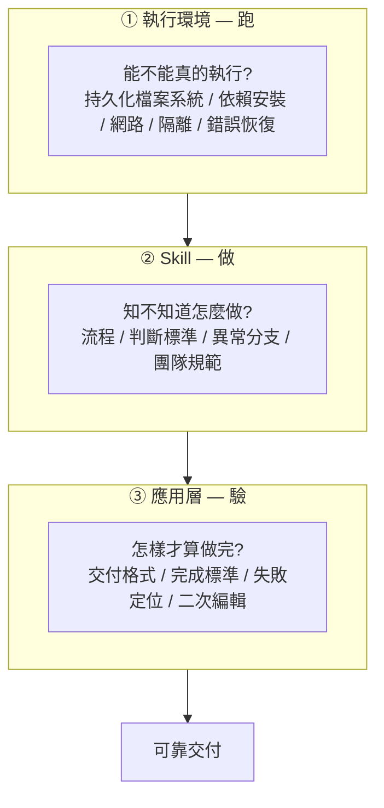
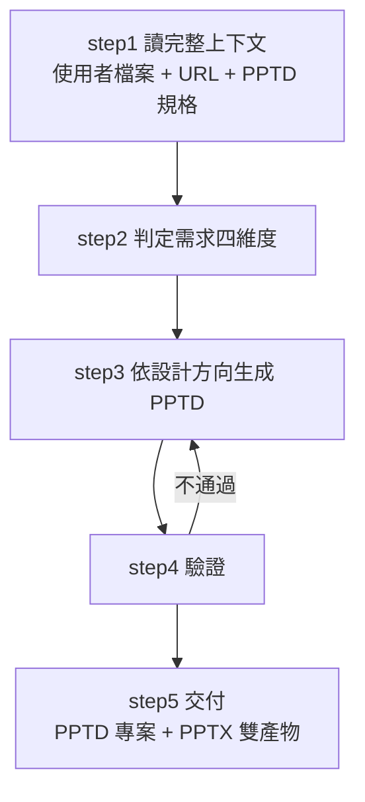

# Skill 不是能力,是能力的施工圖:Agent 交不出活的三層工程棧「跑 / 做 / 驗」

> 整理自 YouTube 頻道 **Why QQ(為什麼叫 QQ)**〈1390萬次下載的 Skill 為什麼在你電腦上跑不通?〉(2026-08-10,約 12.9 分鐘,官方簡中字幕)。
>
> 本文另**實地 clone 了影片提到的兩個 repo 逐項核實**(`cloudflare/computer`、`Binaryify/open-kimi-ppt-skill`),並在文中標出**兩處與影片說法不同的地方**。

> 📎 同頻道其他筆記:[[harness-loop-graph-troubleshooting-map]]、[[loop-vs-graph-debate-engineering-view]]、[[mcp-stateless-migration-guide]]、[[codebase-memory-vs-codegraph-two-routes]]、[[opus5-system-prompt-engineering-patterns]]

---

## 一句話總結

**Skill 解決的是「怎麼把知識交給模型」,不是「怎麼保證模型有全部執行條件」。裝好 Skill 只代表客戶端發現了那個目錄——依賴齊不齊、工具有沒有授權、產出合不合格,全都要另外檢查。**

---

## 一、問題長什麼樣

你替 Agent 準備好了環境,還裝了一個看起來很強的 Skill。它讀懂了說明、知道每一步怎麼做、能寫大綱、能列步驟、中間檔案編得有模有樣——

**然後真要它交付一個「打得開的 PPT」、跑通一輪測試、改完一個真實專案,它就卡住了。你等來的永遠是半成品。**

影片的診斷:**問題不在 Skill 沒用,而在我們經常把「一份 Skill」誤會成「完整的能力」。**

Agent 真正幹活靠的從來不是單薄的一層,而是**三層工程棧疊在一起**:



影片用三個專案分別對應這三層。

---

## 二、先把 Skill 講清楚:它是「作業手冊」,不是提示詞

依 Agent Skills 規範,**一個 Skill 的最小單位就是一個目錄**:

```
my-skill/
├── SKILL.md          ← 必須。寫名稱、用途、具體操作說明
├── scripts/          ← 選配。可執行腳本
├── references/       ← 選配。參考資料
└── assets/           ← 選配。素材
```

所以 Skill **不能簡單說成 Prompt**,它更像**一份可複用的作業手冊**:模型什麼時候該用它、該按什麼流程做、遇到邊界怎麼處理,都可以寫進去,甚至可以帶腳本讓 Agent 去執行。

### ⚠️ 但有個前提經常被忽略

| 手冊裡寫了… | 不代表… |
|---|---|
| 腳本 | 腳本一定能跑 |
| 素材目錄 | 宿主有權限讀取 |
| 「打開瀏覽器」 | 當前環境真的有瀏覽器 |

### 漸進披露(progressive disclosure)機制

規範用了一個很重要的機制:

1. 會話剛開始,模型通常**只看到 Skill 的名稱 + 一句用途描述**
2. 任務匹配上以後,才載入**完整的 `SKILL.md`**
3. 腳本、參考資料、素材,**等真正需要時再繼續讀取**

這很實用——讓你裝幾十個 Skill 時不用一次把所有說明塞進上下文。

**但它也提醒我們:Skill 解決的是「怎麼把知識交給模型」,不是「怎麼保證模型擁有全部執行條件」。**

---

## 三、第一層「跑」:Cloudflare Computer —— Agent 到底需要什麼樣的電腦

### ⚠️ 先講邊界

官方 README 開頭就寫得非常清楚:

> **PREVIEW ONLY** — This package is provided as a preview for feedback only. APIs are unstable and the design is subject to change.

**這不是成熟的生產承諾**,而是在嘗試回答一個更底層的問題。

### 設計思路

把 **Durable Object 裡的 SQLite 當作權威檔案狀態**,再透過 `workspace.runtime.exec()` 暴露**統一執行入口**:

```js
const handle = await workspace.runtime.exec("npm test", { /* … */ });
```

也就是說:**Agent 拿到的不只是一個 Shell,而是一個帶檔案狀態、執行後端與隔離策略的工作區。**

### 三種執行後端(已核實)

clone 下來看 `packages/computer/src/backends/` 目錄,確實是三個:

| 後端 | 目錄 | 特性 |
|---|---|---|
| **真 Linux 容器** | `backends/container/` | 檔案透過 FUSE 映射進去;**可跑真實二進位、有真實網路** |
| **Worker 裡跑 just-bash** | `backends/worker-shell/` | 啟動更輕,**但不是完整 Linux** |
| **隔離的 JavaScript 模組** | `backends/worker-javascript/` | 適合更輕的執行場景 |

⚠️ 影片有提醒:Cloudflare 8 月 3 日的發布說明只把執行環境概括為 **Isolate 與 Container 兩類**,所以「三種」是**當前 repo 口徑**,不是發布時就固定的分類。

### 真正複雜的地方,一個都跟「模型聰不聰明」無關

- 檔案由誰持久化?
- 哪個後端可以聯網?
- 命令怎麼取消?
- 執行失敗後檔案怎麼回收?
- 結果能否重放?

> **這些問題都不屬於「模型聰不聰明」,而屬於「模型有沒有一個地方把想法變成動作」。**

### 而且這些選擇都有代價(數字已核實)

官方 `docs/19_performance.md` 的基準:在 **standard-2 容器(1 vCPU / 6 GiB 記憶體 / 12 GB 磁碟)** 上,完整安裝一個含 **854 個 npm 套件、36,675 個檔案**的專案:

| 目標 | 耗時 |
|---|---:|
| tmpfs(`/tmp`) | **34.3 秒** |
| ext4 磁碟(`/var/tmp`) | **63.9 秒** |
| **computerd FUSE(`/workspace`)** | **124.7 秒** |

**持久化、同步與隔離不是免費的。** 當你讓 Agent 擁有一個「不會跑完就清空」的工作區,你也在為這個工作區的工程特性付成本。

### ✅ 補正一:影片沒提的另一半 —— 有八個場景 computerd 比磁碟更快

這點影片沒講,但官方文件有專門一節「Where computerd is faster than the disk baseline」。因為**inode store 在記憶體裡**,metadata 密集的操作反而勝過真實磁碟:

| 場景 | computerd / ext4 磁碟 比值(< 1.0 代表更快) |
|---|---:|
| `stat` 1000 個檔案 | **0.91×** |
| `rm` 1000 個檔案 | **0.66×** |
| 建目錄樹(10×10×10) | **0.74×** |
| `find` 目錄樹 | **0.72×** |
| `git init` + commit 100 檔 | **0.72×** |
| `git clone`(shallow) | **0.84×** |
| `npm init` + 小安裝 | **0.95×** |

官方的說法是:這八個場景**涵蓋了 `git status`、模組解析、增量建置這類日常操作的大部分成本**。

**慢的是大檔循序 I/O**——因為寫入路徑會把每個 512 KiB chunk 雜湊進內容定址的 blob store,好讓 Durable Object 只同步變更的 chunk 並去重。代價落在 `dd` 式的吞吐量數字上,**但很少落在真實開發工作負載上**。

> **所以「computerd 慢 2 倍」這個結論要加限定詞:慢在大檔吞吐,快在 metadata。** 只看那張 npm install 表會得到偏頗的印象。

### ✅ 補正二:官方文件**有**直接勸退大型 monorepo

影片說「公開文件沒有直接排除大型 monorepo」。實際 clone 後,`docs/README.md` 寫得很明確:

> ~10GB maximum (it shares storage with the DO).
> The container-side filesystem is held in memory, so very large trees aren't a fit. **Aim for agent-scale workspaces, not full monorepos.**

`docs/03_filesystem_schema.md` 也再講一次:所有位元組目前都放在 DO SQLite,**約 10 GB 上限且與宿主 DO 共用**。

**所以這一層的結論是:運行環境決定的不是 Agent 會不會說,而是它能不能真的執行、保存、恢復和隔離。**

---

## 四、第二層「做」:Matt Pocock 的 Skills —— 把高手的操作順序寫成程序性知識

### 數字先對齊(⚠️ 三組數字不能混用)

| 來源 | 數字 |
|---|---|
| Matt 在 2026-08-05 的 X 貼文 | skills.sh 安裝計數達 **1,350 萬**;並稱該 repo 曾進入 GitHub Star 前 20 |
| 截至 2026-08-06 的 skills.sh 頁面 | **51 個 Skill、約 1,390 萬安裝量**;repo 約 **20.6 萬 Star**,按 Star 降序約第 **23** 位 |
| 某個固定 commit 的 repo 內容 | Claude 外掛清單列出 **25 個**正式推廣的 Skill;直接數 `skills/` 目錄則有 **35 份 `SKILL.md`**(多出來的是仍在開發或未正式推廣的) |

**影片特別提醒:這組固定提交數據不能和 skills.sh 頁面顯示的 51 個混用。** 這種對數字來源的自覺,是這個頻道一貫的優點。

### Skill 像軟體包,又不像框架

| 像軟體包的地方 | 不像傳統框架的地方 |
|---|---|
| 有版本 | **不一定接管你的程式碼** |
| 有發布範圍 | **不一定提供完整運行能力** |
| 有不同客戶端的 metadata | |

Matt 在 README 裡強調:**這些流程應該小、可修改、可組合。**

### 兩個具體例子

**TDD Skill:**
- ❌ **不會**替你安裝測試框架
- ❌ **不會**自動保證測試能跑
- ✅ 它把實作迴圈定義為:**先寫失敗測試 → 再寫剛好能通過的最小實作**;而**重構被推到後續的程式碼審查階段**

**Debug Skill:**
- ❌ **不會**憑空製造日誌
- ❌ **不會**替你擁有生產環境權限
- ✅ 它要求的流程是:
  1. 先建立一個**能穩定變紅的回饋迴圈**
  2. 複現並最小化問題
  3. 提出 **3 到 5 個可證偽假設**
  4. 用定向觀測縮小範圍
  5. 修復後補回歸測試、清理除錯程式碼
  6. **總結這次問題為什麼漏過了**

> **Skill 的價值不是把模型變成某個神奇外掛,而是把高手腦子裡的操作順序、判斷標準與踩坑經驗,寫成模型可以調用的程序性知識。**

這對團隊特別有價值——**團隊規範、排障習慣、程式碼審查標準,本來就很難靠一次提示詞穩定傳遞。**

### ⚠️ 「一條命令獲得某種能力」只說對了一半

你確實獲得了一份**能力說明書**,也拿到了腳本和模板。**但能不能照著做,仍然要回到運行時那一層檢查。**

影片對「自帶腳本的 Skill 算不算擁有能力」的判斷:

> **它擁有能力的「實現材料」,但沒有「執行保證」。**
> 腳本要跑得動、依賴要裝得上、工具要拿到授權、輸出還要有驗收標準——**這些都不是 `SKILL.md` 單獨能解決的。**

---

## 五、第三層「驗」:open-kimi-ppt —— 什麼叫「做完」

### ⚠️⚠️ 先說一件事:上游 repo 已被清空

**原始的 `Binaryify/open-kimi-ppt-skill` 現在只剩一份 README:**

> 因版權原因,本倉庫內容已全部清空。
> This repository has been cleared due to copyright reasons.

影片(2026-08-10)描述它時還是個可用專案。**本節的分析改以一份先前的鏡像進行**(`shooter2062424/open-kimi-ppt-skill`),已完整讀過原始碼。

**這件事本身,恰恰是「Skill 也是供應鏈輸入」最強的實證**——一個你安裝過的 Skill,可能在幾天內因法律原因整個消失。詳見下一節。

⚠️ 以下僅描述**架構與設計決策**,不轉錄原始碼內容。

### 它的實際規模:遠比「一份 SKILL.md」大

| 檔案 | 行數 | 作用 |
|---|---:|---|
| `SKILL.md` | 155 | 五步工作流 + 交付規範 |
| `reference/pptd.md` | **1,886** | PPTD DSL 完整規格 |
| `reference/slides_categories/*.md` | 7 個檔 | 依場景分類的設計指南(學術研究 / 商業計畫 / 教育訓練 / 管理報告 / 品牌創意 / 分析決策 / 技術工程) |
| `reference/shapes.md` / `fonts.md` / `general-poster.md` | 47~258 | 形狀、字型、海報版型 |
| `scripts/export_pptx.py` | **662** | PPTX 匯出 + 驗證 |
| `scripts/export_images.py` | **427** | 匯出頁面圖片供視覺複檢 |
| `tests/` | 2 支 | 兩支腳本各有測試 + fixture |
| `editor/` `lib/` `bin/` | — | 本地編輯器與 CLI |

**這已經是一個完整的軟體專案,不是一份提示詞。** 光是 DSL 規格就 1,886 行,定義了座標系統、樣式優先序、主題、頁面、以及 Text / Shape / Line / Image / Icon 等元素型別。

### 五步工作流(從 `SKILL.md` 摘要)



**step2 的「四維度」很值得抄**——它不是問「你要什麼 PPT」,而是把需求拆成四個正交軸:

| 維度 | 選項 |
|---|---|
| **目的** | 新建 / 編輯既有 PPT / 從非 pptx 格式(圖片、PDF)複刻 |
| **設計方向** | 自主設計 / 依使用者的設計系統 / 套用模板 / 風格遷移 |
| **輸入型別** | 只給主題 / 完整文件 / 逐頁大綱或講稿 |
| **頁數** | 使用者指定優先;有大綱就對齊大綱;否則自行判斷 |

四個軸各自決定後續讀哪份 reference、走哪條分支。**這比「寫一段很長的 prompt」清楚得多,也是「程序性知識」的具體長相。**

### ⭐ 第四步「驗證」才是這個 Skill 的真正價值

驗證分兩層:

**第一層:格式驗證**——對照 `reference/pptd.md` 檢查必填欄位、型別、邊界、主題 token、資源路徑,**多輪修復**。

**第二層:視覺複檢**——`SKILL.md` 明訂**在模型支援圖片輸入時,這一步是 PPTX 匯出前的必要步驟**。流程是:跑 `export_images.py` 匯出每頁圖片並拼成一張總覽圖,然後**逐頁對照一份七項檢查清單**:

1. 圖片是否清晰、不變形(無拉伸、壓縮、模糊)
2. 文字是否壓在關鍵畫面(人臉、產品主體、Logo 等)上
3. 元素座標是否超出頁面邊界
4. 邊界與配色對比是否足夠(文字與背景、相鄰色塊之間)
5. 排版是否統一(對齊、間距、字號層級、頁邊距)
6. 文字是否可能溢出文字框(文字過長、行距過密、字號過大)
7. 內容是否被上層元素遮擋

發現可疑頁面 → 讀該頁全解析度圖確認 → 改對應 `.page` 檔 → **重跑並重新複檢,直到每一頁都通過**。**通過之前不准匯出 PPTX。**

> **這就是「驗」這一層的教科書範例:把「做完」寫成一份可逐項打勾的清單,而不是留給模型自己猜。**

### ⭐⭐ 三個「工程誠實度」細節,比工作流本身更值得學

讀原始碼時最讓人印象深刻的不是流程,是它對**自己驗證能力的邊界**有多誠實:

**① 承認「檢查通過」不等於「交付成功」**
`SKILL.md` 明寫:**不要僅因 ZIP 驗證通過,就聲稱 PowerPoint / WPS / Keynote 的播放相容性。**

**② 指出一個表淺檢查為什麼是錯的**
它特別說明:**單純用位元組搜尋找 `<p:fade>` 是不夠的,因為 Office 會忽略巢狀在 `cSld` 裡的 transition。** 正確做法是驗證每張投影片在合法的 `CT_Slide` 順序下(`cSld` → 選配 `clrMapOvr` → `transition` → 選配 `timing/extLst`)恰好有一個根層級的 fade。

> **這是「驗收要驗到對的層級」的絕佳案例。** 字串搜到了 ≠ 功能生效了。對應到 `export_pptx.py` 裡確實有 `has_direct_fade_transition()` 與 `validate_transition_order()` 兩個函式在做這件事,而不是一個 `if b"<p:fade>" in xml`。

**③ 降級要明說,不能靜默**
當模型無法讀圖時,退回結構化審查(邊界、易溢出的長文字、對比、層級、版面密度),**並且必須聲明「已跳過基於圖片的視覺 QA」**。

> **靜默降級是最危險的失敗模式**——使用者以為驗過了,其實沒有。

另外還有兩處誠實標註:**pptx → pptd 的轉換並非完全無損**;以及**資料夾上傳的退路是唯讀的**。

### Skill 自己處理「跑」這一層

有意思的是,這個 Skill 沒有假設環境就緒,而是**主動修復依賴**:匯出前先檢查 `agent-browser --version`,若缺少或低於 `0.33.2`,就用 npm 全域安裝最新版,**然後再驗證一次版本**才繼續(`ensure_agent_browser()`)。

> 這正好呼應影片的三層模型:**當「跑」這一層不可靠時,成熟的 Skill 會自己把它補起來**——但這也意味著它要求 npm 的全域寫入權限。

### ⭐ 本期最關鍵的反轉:格式可移植 ≠ 能力可移植

`SKILL.md` 第 7 節「Local export requirements and boundaries」把依賴列得很完整,**比影片講的還多**:

| 需求 | 影片有提到嗎 |
|---|---|
| `python3` + PyYAML | 部分(只說 Python) |
| `npm` | ✅ |
| **`agent-browser` ≥ 0.33.2** | ❌ **影片沒提** |
| Chrome / Chromium | ✅ |
| 網路可達 `www.kimi.com` + `statics.moonshot.cn` | ✅ |
| **Pillow**(視覺 QA 用,缺了會 `pip --user` 自動裝) | ❌ **影片沒提** |

**關於隱私邊界,原始碼講得比影片更精確:**

- PPTD 文件是**透過 localhost SDK 橋接送進公開編輯器的 iframe**,**不是**上傳到伺服器端的轉檔 endpoint。
- 但 deck 引用的**遠端圖片、圖示、字型仍會從各自的來源抓取**。
- 專案內的本地 PNG/JPEG/GIF/SVG 則以 **data URL** 餵進 iframe。

> **「本地編輯器只監聽 127.0.0.1」是真的,但這不等於全程離線。** 兩件事都成立,而區分它們才是準確的說法。

**交付規範也很硬:預設同時產出「完整的 PPTD 專案目錄」與「本地生成的 PPTX」**(含字型嵌入與 fade 轉場),而且**絕不交付一份沒有依賴檔案的孤立 manifest**。

### 「做完」的三個反例

> 運行環境回答「**能不能跑**」;Skill 回答「**知不知道怎麼做**」;應用層回答「**怎樣才算做完**」。

對 PPT 來說:

- ❌ 只生成文字大綱 → **不算做完**
- ❌ 匯出一個打不開的檔案 → **不算做完**
- ❌ 版式錯位但沒人檢查 → **更不算做完**

同一個 Skill 複製到另一台機器,Agent 可以正常讀懂它,**卻未必能跑出同樣結果**。

---

## 六、⚠️ 常被忽略的坑:Skill 本身也是供應鏈輸入

官方客戶端實作指南提醒過:**專案級 Skill 有機會來自不可信的倉庫,客戶端應該考慮做信任檢查後再載入。**

這條提醒不是形式主義,因為 **Skill 不只是介紹自己,它還能指導 Agent 讀取檔案、執行腳本、訪問網路。**

而規範裡的 **`allowed-tools` 目前仍是實驗欄位**,不同客戶端支援程度也不同——**所以不能把它當成完整的權限沙箱。**

> **裝 Skill 的動作,更像引入程式碼依賴:你要看來源、要鎖版本、要審腳本、也要限制權限。**
> **越是能自動執行的 Skill,越不能只看 README 裡寫得漂不漂亮。**

**而 `open-kimi-ppt-skill` 在影片發布後隨即被清空,就是這條原則的活教材:**你依賴的 Skill 可能因為版權、法律或維護者決定而在任何時候消失,而如果你的工作流硬綁在它上面,那就是一個沒有 SLA 的單點依賴。

---

## 七、⭐ 可帶走的框架:評估 Agent 就問三個字「跑 / 做 / 驗」

> **別只問模型夠不夠強。**

| | 看什麼 | 具體檢查項 |
|---|---|---|
| **跑** | **運行環境** | 可持久化的檔案系統、可安裝依賴的執行後端、必要時可用的網路與瀏覽器、出錯後的恢復能力、任務之間的隔離 |
| **做** | **Skill** | 流程要寫清、所需上下文要夠、異常分支要有處理辦法、團隊規範要能固定下來、多個 Skill 之間還要能組合 |
| **驗** | **具體應用** | 交付格式、完成標準、失敗定位、二次編輯,以及視覺 / 型別 / 測試 / 業務規則都要進入交付檢查 |

**三問少一個,Agent 都有翻車風險。**

> **模型越強,只是把「上限」推高;運行時、流程與驗收,才把上限變成真正能交付的工作。**

### 對「註冊表」與「平台」的推論

影片給了兩個很有價值的預測:

**真正有用的 Skill 註冊表,不能只展示安裝量。** 它還應該告訴你:

- 這個 Skill 需要什麼**運行時**
- 會調用**哪些工具**
- 需要**哪些網路網域**
- 產物**怎麼驗證**
- 在**哪些客戶端與版本**裡測過

**更成熟的 Agent 平台,也不會只比模型榜單。** 它們會比:**工作區、權限、日誌、回放、成本控制與驗收機制。**

> **真正的競爭,正在從「能不能生成」轉向「能不能可靠交付」。**

而這對程式設計師其實是好事——**當大家不再把 Agent 當聊天視窗,而是當一個可執行系統來設計,軟體工程裡那些老經驗又會重新變得值錢**:依賴管理、運行隔離、可觀測性、權限控制、測試回饋、產物驗收。

---

## 應用案例

### 案例 1|拿「跑 / 做 / 驗」去診斷你手上跑不通的那個 Agent

下次 Agent 交半成品時,不要先罵模型笨,按順序問:

```
① 跑不動嗎?
   → 進 Agent 的執行環境手動跑一次那個腳本。
   → 常見死因:依賴沒裝、沒有瀏覽器、沒有網路權限、路徑不存在、
     工作區跑完就被清空。

② 跑得動但做錯了嗎?
   → 去讀 SKILL.md。流程有沒有寫到異常分支?
   → 常見死因:手冊只寫了 happy path。

③ 做了但你不滿意嗎?
   → 你有定義「做完」嗎?
   → 常見死因:根本沒有驗收步驟,所以模型只能自己猜什麼叫完成。
```

**大多數人卡在 ① 卻花時間調 ②。** 這個順序本身就值錢——因為往下一層的排查成本遠低於往上一層。

### 案例 2|寫自己的 Skill 時,把「驗收」也寫進去

多數人寫 Skill 只寫「怎麼做」,漏掉「怎樣算做完」。照 open-kimi-ppt 的實際結構補上四塊:

```markdown
## 完成標準(必須全部滿足才算交付)
- [ ] 產出檔案能被 <具體工具> 打開,不報錯
- [ ] 跑過 <具體檢查命令>,退出碼為 0
- [ ] 產出是最終格式,不是中間檔案
- [ ] 若有視覺產物:匯出圖片後逐項複檢(遮擋 / 溢出 / 對比 / 對齊 / 變形)

## 驗證的層級(⚠️ 別驗在表面)
- 不要只做字串搜尋就宣告通過;要驗到「功能實際生效」的那一層
- 通過某項檢查 ≠ 在真實環境可用,不要過度宣稱

## 降級規則
- 若 <某項檢查> 因環境限制無法執行:退回 <替代檢查>,
  並在最終回覆中「明確聲明跳過了哪一項」

## 失敗時怎麼辦
- 若 <檢查> 失敗:回到第 N 步,修正後重跑,最多 3 次
- 3 次仍失敗:停止並回報「卡在哪一步、看到什麼錯誤」,不要交半成品
```

三條最容易被漏掉、而 open-kimi-ppt 都寫進去了的:

1. **「不要交半成品,要回報卡在哪」**——把失敗模式從「靜默給你垃圾」變成「明確告訴你哪裡斷了」,後者才可排查。
2. **「驗到對的層級」**——它特別點名「位元組搜尋 `<p:fade>` 不夠,因為 Office 會忽略巢狀在 `cSld` 裡的 transition」。**你的檢查很可能也在驗一個代理指標,而不是真正的結果。**
3. **「降級要明說」**——無法讀圖時退回結構化審查,但**必須聲明跳過了視覺 QA**。靜默降級最危險。

### 案例 3|把「Skill 當依賴」寫進團隊規範

比照 npm 套件的審查標準,建一份 Skill 引入檢查表:

| 檢查項 | 為什麼 |
|---|---|
| **來源可信嗎?** | 專案級 Skill 可能來自不可信倉庫 |
| **鎖版本了嗎?** | `open-kimi-ppt-skill` 被整個清空就是反例 |
| **`scripts/` 裡的腳本讀過了嗎?** | Skill 能指導 Agent 執行腳本 |
| **它需要哪些網路網域?** | 「本地編輯器」不代表全程離線 |
| **`allowed-tools` 有寫嗎?** | ⚠️ 仍是實驗欄位,**不能當沙箱**,只能當文件 |
| **有沒有離線備援?** | 上游消失時你的工作流會不會整個斷掉 |

**最後一項是這次事件教的:對關鍵路徑上的 Skill,自己 fork 一份。**

### 案例 4|選執行環境時,別只看一個 benchmark 數字

Cloudflare Computer 的效能表是很好的教材:**同一個系統,看不同場景可以得出完全相反的結論。**

- 只看「完整 npm install 慢 2 倍」→ 結論是「不能用」
- 只看「metadata 操作快 0.66~0.95 倍」→ 結論是「比磁碟還好」

**正確做法是先問「我的工作負載長什麼樣」:**

| 你的 Agent 主要在做… | 該看哪組數字 |
|---|---|
| 反覆 `git status`、模組解析、增量建置 | metadata 那組(computerd 有優勢) |
| 大量安裝依賴、處理大檔案 | 吞吐那組(computerd 明顯較慢) |

⚠️ 而且要記得整個專案標著 **PREVIEW ONLY、API 不穩定、不適合生產**。

### 案例 5|對照本倉庫自己的流程

本倉庫的每日 cron 任務其實正好踩在這三層上:

| 層 | 本倉庫對應 | 現況 |
|---|---|---|
| **跑** | yt-dlp / faster-whisper / git,本機真實環境 | ✅ 有,而且踩過的坑都寫進 `CLAUDE.md`(403 要加 `--remote-components`、幻覺迴圈要換引擎) |
| **做** | `CLAUDE.md` 的寫作規範 + cron prompt 的步驟 | ✅ 有,連 grep 參數順序這種細節都寫進去了 |
| **驗** | 「怎樣算一篇筆記做完」 | ⚠️ **最弱的一層**——目前沒有自動檢查 wiki 連結是否存在、README badge 數字是否正確、有沒有「來源」區塊 |

**這正好印證影片的結論:三層裡最容易被忽略的就是「驗」。** 大家都會把環境弄好、把流程寫清,然後假設「做完了就是做完了」。

---

## 重點回顧(TL;DR)

1. **Skill 不是能力本身,它是能力的施工圖。** 沒有運行環境,施工圖落不了地;沒有應用驗收,落地也不等於交付。
2. **Skill 的最小單位是一個目錄**(`SKILL.md` + 選配的 `scripts/`/`references/`/`assets/`),它是**可複用的作業手冊**,不是提示詞。
3. **漸進披露**讓你能裝幾十個 Skill 而不爆上下文——但它解決的是知識傳遞,不是執行條件。
4. **Cloudflare Computer(PREVIEW ONLY)** 把 DO SQLite 當權威檔案狀態,用 `workspace.runtime.exec()` 統一入口,底下三種後端:真 Linux 容器 / Worker 裡的 just-bash / 隔離 JS 模組。
5. **持久化不是免費的**:854 套件 npm install,tmpfs 34.3s、ext4 63.9s、**computerd FUSE 124.7s**。
6. **✅ 但補正一:有八個 metadata 密集場景 computerd 比磁碟更快**(0.66×~0.95×),涵蓋 `git status`、模組解析、增量建置的日常成本。慢的是大檔吞吐,因為每個 512 KiB chunk 都要雜湊進內容定址 blob store 以支援差異同步。
7. **✅ 補正二:官方文件明確勸退大型 monorepo**——「Aim for agent-scale workspaces, not full monorepos」,約 10 GB 且與宿主 DO 共用。
8. **Matt 的 Skills 把高手的操作順序寫成程序性知識**(TDD 先寫失敗測試、Debug 要求可穩定變紅的回饋迴圈 + 3~5 個可證偽假設)。⚠️ 但它**不會**替你裝測試框架,也**不會**給你生產環境權限。
9. **⭐ 格式可移植 ≠ 能力可移植;流程能複用 ≠ 交付能複現。** 讀原始碼後的完整依賴清單比影片講的更長:`python3` + PyYAML、`npm`、**`agent-browser` ≥ 0.33.2**、Chrome/Chromium、**Pillow**,加上兩個外部網域。而且 Skill 會**自己安裝缺失的依賴**(要求 npm 全域寫入權限)。
10. **⭐⭐ 那個 PPT Skill 真正的價值在「驗」**:七項逐頁視覺檢查清單、通過前不准匯出;而最值得學的是三個工程誠實度細節——**不因 ZIP 驗證通過就宣稱播放相容性**、**點名「位元組搜尋 `<p:fade>` 不夠」因為 Office 會忽略巢狀在 `cSld` 裡的 transition**、**無法讀圖時降級必須明說**。
11. **⚠️⚠️ `open-kimi-ppt-skill` 上游已因版權原因清空**——這正是「Skill 也是供應鏈輸入」最好的實證。裝 Skill 就像引入依賴:看來源、鎖版本、審腳本、限權限、**對關鍵路徑自己留鏡像**。`allowed-tools` 仍是實驗欄位,**不能當沙箱**。
12. **⭐ 評估 Agent 就問三個字:跑(運行環境)/ 做(Skill)/ 驗(應用層)。三問少一個都會翻車。**
13. **模型越強只是把上限推高**;運行時、流程與驗收才把上限變成能交付的工作。**競爭正在從「能不能生成」轉向「能不能可靠交付」。**

---

## 來源

- [1390萬次下載的 Skill 為什麼在你電腦上跑不通? — Why QQ(為什麼叫 QQ)](https://www.youtube.com/watch?v=HyHKizkVuVM)(2026-08-10,約 12.9 分鐘,官方簡中字幕)
- [cloudflare/computer](https://github.com/cloudflare/computer) —— 已 clone 核實:三種後端目錄結構、`PREVIEW ONLY` 聲明、`docs/19_performance.md` 效能數據、`docs/README.md` 與 `docs/03_filesystem_schema.md` 的 10 GB / monorepo 限制
- [mattpocock/skills](https://github.com/mattpocock/skills)
- [Binaryify/open-kimi-ppt-skill](https://github.com/Binaryify/open-kimi-ppt-skill) —— ⚠️ **已 clone 核實:上游內容已因版權原因全部清空,僅餘一份 README**。本文對其架構的分析改以先前的鏡像 [shooter2062424/open-kimi-ppt-skill](https://github.com/shooter2062424/open-kimi-ppt-skill) 進行,僅描述設計決策與檔案結構,未轉錄原始碼內容
- 本倉庫相關筆記:[[harness-loop-graph-troubleshooting-map]]、[[loop-vs-graph-debate-engineering-view]]

> 效能數據與文件引述均取自 `cloudflare/computer` repo 於本文整理時的 main 分支,該專案標示 API 不穩定,數字與設計可能隨版本變動。
