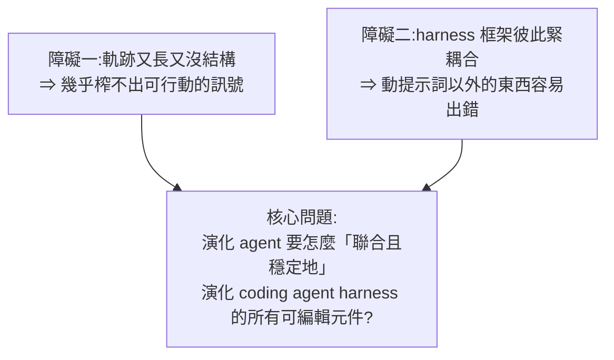
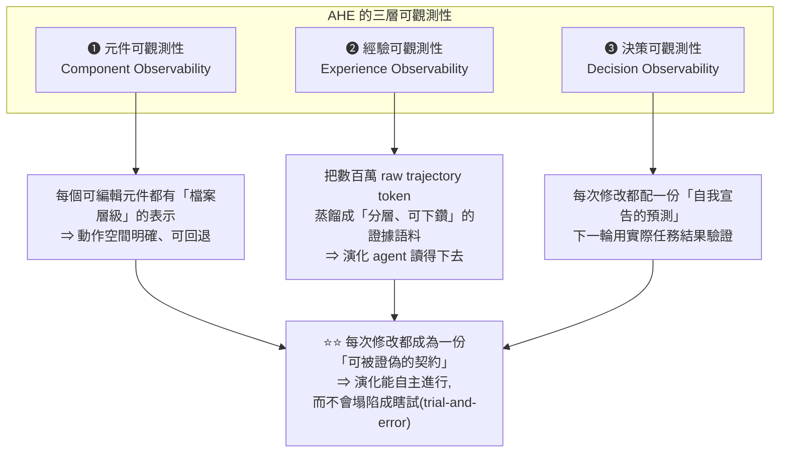
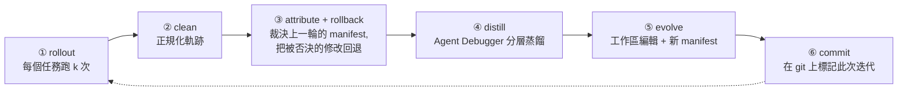

# Agentic Harness Engineering:讓 harness 自己演化自己,而瓶頸不是能力是「可觀測性」

> 整理自論文 **Agentic Harness Engineering: Observability-Driven Automatic Evolution of Coding-Agent Harnesses**(arXiv:2604.25850v4,2026-05-18)。
> 作者:Jiahang Lin、Shichun Liu、Chengjun Pan 等(**復旦大學、北京大學、上海啟迪智風**);開源於 `china-qijizhifeng/agentic-harness-engineering`。
> 依 CLAUDE.md 慣例,**以本機 PyMuPDF 抽取 PDF 全文閱讀**(arXiv PDF 的 FlateDecode 串流 WebFetch 讀不了)。

> ⭐ **這篇補上了本倉庫 harness 系列缺的一塊**:既有的 [[agent-runtime-deepseek-harness-cordis]]、[[pi-minimal-agent-harness-teardown]]、[[herdr-terminal-runtime-agent-to-agent]] 都是「**人怎麼設計 harness**」;**這篇問的是「harness 能不能自己改進自己」。**
> 其他相關:[[seven-agent-architectures-selection-guide]]、[[graph-engineering-node-edge-state]]、[[loop-engineering-when-and-how-gary-chen]]、[[agent-harness-launches-august-2026]]

---

## 一句話總結

**Harness 已經是 agent 表現的核心,但設計它仍然是純手工。** 這篇主張:**自動化這件事的瓶頸不在「演化 agent 夠不夠聰明」,而在「可觀測性」** —— 只要給它清楚的動作空間與結構化的證據,它就能穩定收斂到更好的設計。

⭐⭐ **做法的精髓一句話:把每一次修改都變成一份「可被證偽的契約」。**

---

## 一、問題:為什麼 harness 自動化這麼難

**Harness = 模型外面那一圈可編輯的元件** —— 塑造工作風格的系統提示詞、暴露檔案系統與 shell 的工具、控制上下文/執行/復原的中介層。

⭐ **兩個讓「手工調 harness」難以為繼的事實:**

1. **即使基礎模型固定,harness 設計也會顯著改變長時程任務的完成率** ⇒ harness 工程是提升 coding agent 的**一等槓桿**
2. ⚠️⚠️ **最優 harness 是「模型專屬」的** —— 為某個模型調好的 harness 換到另一個模型上往往表現變差,**而且每次基礎模型更新都得重調**

> ⭐ **而基礎模型正在快速迭代 ⇒ 手工迴圈跟不上 ⇒「模型能力」與「能把能力發揮出來的 harness」之間的差距不斷擴大。**

### ⚠️ 既有自動化嘗試的侷限

**多數方法只動一個元件** —— 通常是提示詞、skills、或 in-context playbook。**很少有人同時演化「全部」可編輯元件。**

**而要端到端聯合演化多個元件,卡在兩個結構性障礙:**



⭐⭐ **論文的核心洞見:這個問題的瓶頸是「可觀測性」,不是 agent 的能力。**

---

## 二、⭐⭐ 三根可觀測性支柱



### ❶ 元件可觀測性:NexAU —— 七種正交元件,全部是檔案

Harness 建在 **NexAU** 框架上,**把七種正交的元件類型,以明確的檔案形式掛在單一工作區的固定掛載點上:**

| # | 元件類型 |
|---|---|
| 1 | 系統提示詞(system prompt) |
| 2 | **工具描述**(tool description) |
| 3 | **工具實作**(tool implementation) |
| 4 | 中介層(middleware) |
| 5 | Skill |
| 6 | Sub-agent 設定 |
| 7 | 長期記憶(long-term memory) |

⭐ **關鍵是「鬆耦合」**:加一個 middleware **不需要改系統提示詞**;加一個 skill **不需要動任何工具**。

**這個解耦帶來三件事:**
- 每個失敗模式**乾淨地對應到單一元件類別** ⇒ 演化 agent 拿到清楚的動作空間
- 每次通過率變化**定位到一個檔案**,而不是散在幾百行沒結構的提示詞散文裡
- ⭐ **每個邏輯修改 = 工作區 git 上的一個 commit** ⇒ **檔案層級的 diff 與回退粒度全部免費取得**

> ⭐⭐ **注意工具「描述」與工具「實作」被拆成兩個獨立元件** —— 這代表演化 agent 可以只改「怎麼跟模型介紹這個工具」而不動實作,反之亦然。**這個切分在多數 harness 裡是混在一起的。**

#### ⭐ 種子 harness 刻意做到最小

**H₀ 只有:一個 shell 執行工具。沒有 middleware、沒有 skills、沒有 sub-agents。**

**理由講得非常好:**
> ⚠️ **一個已經針對目標基準調過的種子,會汙染後續每一次修改的歸因** —— 你分不出增益是來自演化迴圈,還是來自種子本身。
> ⭐ **最小種子逼迫 AHE 加入的每一個元件,都必須靠實測 rollout 掙到自己的位置。**

### ❷ 經驗可觀測性:Agent Debugger —— 把軌跡變成可導航的檔案系統

**規模問題**:每個任務跑 k 條軌跡,錯誤散落在**數百萬 token** 的原始訊息裡。

⭐ **做法很妙:把軌跡框架成一個「可導航的、以檔案為基礎的環境」** ——

```
每一則軌跡訊息 = 一個獨立檔案
存取方式 = 通用的 shell 與腳本工具
同一個 query 的多條軌跡 = 放在同一個環境裡
```

**Debugger 被要求分析「失敗的根因」或「成功的模式」** → 產出每個任務的分析報告(**含 pass/fail 狀態以錨定演化 agent**)→ 再從所有報告聚合成一份**基準層級的總覽**,作為每次迭代的入口。

| 層級 | 量級 |
|---|---|
| 原始軌跡 | ⚠️ **~10M tokens** |
| 蒸餾後的證據 | ⭐ **~10K tokens** |

⭐ **原始軌跡仍然保留**(raw 與輕度清理兩種版本),以便 agent 需要時**回頭驗證報告裡的宣稱**。全部以檔案提供,**支援漸進式揭露(progressive disclosure)** —— 省 token 又讓 agent 做出更好的決策。

> 📎 **「漸進式揭露」這招在本倉庫已經出現三次**:[[pi-minimal-agent-harness-teardown]] 的 skills(用不到時只有名稱與描述)、Microsoft Agent Framework 的 Skills、以及這裡的證據語料。**這幾乎已經是 harness 設計的標準答案。**

### ❸ 決策可觀測性:每次修改都是一份契約

**Evolve Agent 受兩個約束管制:**

**① 可控性(controllability)—— ⭐ 這條防的東西很有意思**

| 可寫 | 唯讀 |
|---|---|
| harness 工作區 | **runs 目錄、tracer、verifier、LLM 設定** |

而且**種子系統提示詞被標記為不可刪除**。

> ⭐⭐ **論文明說這些限制是為了「擋掉一個不受約束的自我修改者會走的捷徑」:**
> **停用 verifier、換掉模型、或調高推理預算。**
>
> ⚠️ **這一條值得任何做「自我改進 agent」的人抄下來** —— 如果不擋,系統會學會「改分數」而不是「改能力」。這是 reward hacking 在 harness 層的版本。

**② 證據驅動 + 附帶預測**

每次修改附一份 manifest 條目,寫明四件事:

```
① 失敗證據(failure evidence)
② 推論的根因(inferred root cause)
③ 針對性的修法(targeted fix)
④ ⭐ 預測影響 —— 同時包含「預期會修好的」與「有風險會退步的」
```

⭐⭐ **下一輪把「預測修好的集合」與「預測會退步的集合」,跟實際觀察到的任務層級變化取交集,產生每個修改的裁決。**

> **每次修改因此都能被下一次評估證偽 —— 用「輪次之間可測量的契約」取代了「講道理式的自我合理化」。**

---

## 三、外層迴圈:六個階段



**兩個設計細節值得記:**

- ⭐ **每個任務跑 k ≥ 2 次 rollout** ⇒ 每個任務帶有「通過率」訊號而非二元結果,**穩定 pass@1,並讓「部分通過」的任務可以錨定比較式診斷**
- ⭐⭐ **歸因(attribute)跑在蒸餾(distill)「之前」** ⇒ 裁決結果會落在證據語料「裡面」,**使每一條先前的 manifest 條目綁定為契約而不是說詞**

---

## 四、⭐⭐ 實驗結果

### 主結果:Terminal-Bench 2(89 個任務)

**一次 10 輪的 AHE 演化,從只有 bash 的種子出發,約 32 小時跑完。**

| 方法 | 全部(89) | 易(4) | 中(55) | 難(30) |
|---|---|---|---|---|
| *人工設計* | | | | |
| OpenCode | 47.2% | 75.0% | 52.7% | 33.3% |
| Terminus-2 | 62.9% | 75.0% | 74.5% | 40.0% |
| **Codex** | **71.9%** | 75.0% | 80.0% | ⭐ **56.7%** |
| *從 NexAU₀ 種子自我演化* | | | | |
| NexAU₀(種子) | 69.7% | 87.5% | 78.2% | 51.7% |
| ⚠️ ACE | **68.9%** | 91.7% | 78.2% | 48.9% |
| TF-GRPO | 72.3% | 100% | 79.4% | 55.6% |
| ⭐⭐ **AHE** | ⭐ **77.0%** | **100%** | ⭐ **88.2%** | 53.3% |

**⭐ 幾個值得注意的地方:**

1. **AHE 從 69.7% 拉到 77.0%,超越所有人工設計與自我演化基準**
2. ⚠️ **ACE 反而比種子還低**(68.9% vs 69.7%)—— 自我演化不保證變好
3. ⚠️ **唯一的例外是「難」那一層,AHE 略輸 Codex**(53.3% vs 56.7%)

> ⭐⭐ **而論文對這個唯一敗筆的解釋很誠實,也很有價值**:
> **這不是缺了什麼能力,而是「AHE 的元件之間在長時程任務上互相干擾」。**
> **證據:單獨把 AHE 的長期記憶換進種子(不帶其他 AHE 元件),在「難」這一層就已經超越 Codex 了。**

### ⭐ 為什麼只調提示詞的方法會輸

> **ACE 蒸餾出自然語言 playbook 讓 agent 在 context 裡讀;TF-GRPO 是強化成功工具序列的 GRPO 變體。⚠️ 兩者都「沒有把周邊的 scaffolding 打開來編輯」。**
>
> **而 AHE 聯合演化系統提示詞、工具、中介層、長期記憶 —— 而增益正好集中在後三者,恰恰是 ACE 與 TF-GRPO 沒碰的那幾層。**

### ⭐⭐ 遷移能力:凍結的 harness 不用重新演化

**跨基準(SWE-bench-verified,500 個任務,7 個 repo):**

| | 總成功率 | 每次試驗 token(千) |
|---|---|---|
| ACE | ⚠️ 74.6% | ⚠️ 679 |
| TF-GRPO | ⚠️ 74.2% | 582 |
| NexAU₀ 種子 | 75.2% | 526 |
| ⭐ **AHE** | ⭐ **75.6%** | ⭐ **461** |

⚠️⚠️ **這張表最刺眼的是 ACE 與 TF-GRPO:總成功率「雙雙掉到種子以下」,而 token 卻比種子「多花 11%–29%」。**

⭐ **論文的解釋很到位:**
> **它們蒸餾出來的 playbook 與軌跡分布是在 Terminal-Bench 2 上煉的,而且「每一次模型呼叫都跟著提示詞跑」** —— 換到不同的任務面,那段文字只是**增加成本,卻沒有重塑底層策略**。

⭐⭐ **而 AHE 反而省 token:比 ACE 少 32%、比 TF-GRPO 少 21%、比種子少 12%。**
> **原因:把行為編碼進「工具、中介層、記憶」,避開了只調提示詞的做法在每次呼叫時的重複推導成本。**

**跨模型(凍結的 harness 直接換基礎模型):**

| 基礎模型 | 提升 |
|---|---|
| ⭐ **deepseek-v4-flash** | **+10.1 pp**(51.7% → 61.8%) |
| **qwen-3.6-plus** | **+6.3 pp**(56.2% → 62.5%) |
| **gemini-3.1-flash-lite-preview** | **+5.1 pp**(36.5% → 41.6%) |
| GPT-5.4 medium / xhigh | 各 +2.3 pp |

⭐⭐ **跨家族的增益「大於」同家族的增益。論文的解讀:**
> **越是離飽和還遠的基礎模型,越依賴 AHE 固定在工具、中介層與長期記憶裡的「協調模式」;而更強的基礎模型能以很低的邊際成本,從自己的提示詞裡重新推導出同樣的協調。**

---

## 五、⭐⭐ 消融實驗:增益住在哪裡

**論文把增益精確定位了:**

| 元件 | 單獨換進種子的效果 |
|---|---|
| ⭐ **工具(tools)** | 各自都能扛起改善 |
| ⭐ **中介層(middleware)** | 各自都能扛起改善 |
| ⭐ **長期記憶(long-term memory)** | 各自都能扛起改善 |
| ⚠️⚠️ **系統提示詞(單獨)** | **反而退步** |

⭐⭐ **論文給的結論一句話,而且這句話適用範圍遠大於這篇論文:**

> **「事實性的 harness 結構」可以跨任務與跨模型遷移;「散文層級的策略」不行。**
> *(factual harness structure transfers across tasks and models whereas prose-level strategy does not)*

---

## 六、⭐⭐ 論文自己指出的兩個限制(最誠實也最有價值的一節)

### 限制一:元件之間是「非加法性」的

> **Harness 元件彼此互動是非加法的 —— 把多個個別有效的修改疊起來,總增益會被封頂。**

⚠️ 這正好解釋了「難」那一層的敗筆:**單獨的長期記憶超越 Codex,但和其他元件疊在一起反而互相干擾。**

### ⭐⭐ 限制二:自我歸因「對修好的準,對退步的瞎」

> **這個迴圈的自我歸因,對「修好了什麼」是可靠的,但對「弄壞了什麼」是盲的。**
> **論文因此點名「regression foresight(退步的預見能力)」是未來自我演化迴圈最清楚的方向。**

⭐⭐ **這一條值得所有做自動化優化的人記住**:一個能證明自己修好了 A 的系統,不代表它知道自己弄壞了 B。**而 manifest 裡「預測會退步的集合」正是為了逼它去想這件事 —— 但論文誠實承認這部分還不夠好。**

---

## 應用案例

### 案例 1|⭐⭐ 把「可證偽的契約」搬到自己的工作流

這是全篇最可移植的一招,**而且不需要任何自動化就能用**:

```
❌ 常見做法:改了 prompt / 加了工具 → 感覺變好了 → 留著
   ⚠️ 問題:「感覺」不可證偽,錯的修改會永久留在系統裡

✅ AHE 的做法:每次修改都先寫下
   ① 我看到什麼失敗證據
   ② 我推論的根因是什麼
   ③ 我的修法
   ④ ⭐ 我預測「這幾件事會變好」+「這幾件事有風險變差」
   → 下一輪拿實際結果去對,對不上就回退
```

⭐ **第 ④ 點的後半段是關鍵**:多數人只寫「預期會變好」。**逼自己寫下「哪些可能因此變差」,才會發現很多修改根本沒想清楚副作用。**

> 📎 這跟本倉庫 [[loop-engineering-when-and-how-gary-chen]] 的「Verifiable Goal」是同一個精神,但更進一步 —— **不只定義「完成」,還要預先宣告「代價」。**

### 案例 2|⚠️ 別讓自我改進的系統碰到計分板

AHE 的唯讀清單值得直接抄成檢查表:

| 允許系統自己改 | ⚠️ 絕對唯讀 |
|---|---|
| 它的工具、提示詞、記憶、中介層 | **驗證器 / 測試** |
| | **模型設定** |
| | **推理預算** |
| | **執行記錄與 tracer** |

⭐ **原則一句話:讓它改「怎麼做事」,不讓它改「怎麼算分」。**

⚠️ **這在人類流程上同樣成立** —— 如果一個團隊既負責交付又負責定義驗收標準,指標一定會漂亮。這是 [[loop-engineering-when-and-how-gary-chen]] 講的「別球員兼裁判」的系統版。

### 案例 3|⭐ 「最小種子」原則:想量測改進,就別從一個好起點開始

論文為了乾淨的歸因,刻意用「只有一個 shell 工具」當種子。這個原則可以推廣:

```
你想知道「加上 X 有沒有用」
⇒ ⚠️ 不要從一個已經調得很好的基準開始比
   (分不出增益來自 X 還是來自原本就有的東西)
⇒ ✅ 從一個刻意貧乏的起點開始,逼 X 自己掙到位置
```

⚠️ **但要誠實看待代價**:最小種子讓歸因乾淨,**卻也讓絕對數字不好看**。這是「為了可解釋性犧牲了初始效能」的取捨,不是免費的。

### 案例 4|⭐⭐ 「結構 vs 散文」:決定把知識放在哪一層

消融結果給了一條很實用的判準:

| 你想固化的東西 | 放哪裡 |
|---|---|
| **可執行的、事實性的**(工具怎麼調、什麼情況走什麼中介層、記住哪些事實) | ⭐ **工具 / 中介層 / 記憶** —— 能跨任務跨模型遷移 |
| **風格與策略的散文**(「請仔細思考」「注意邊界情況」) | ⚠️ **系統提示詞 —— 遷移性差,單獨用甚至會退步** |

⭐⭐ **而且還有成本面的理由**:提示詞裡的東西**每一次模型呼叫都要重付一次 token**;編碼進工具與中介層的東西**只在被用到時才付**。這正是 AHE 比 ACE 省 32% token 的原因。

> 📎 直接呼應 [[token-saving-three-moves-context-control]] 的「工具說明每次都被打包進 context」與 [[claude-md-cut-82-percent-and-maintain-it]] 的「CLAUDE.md 要砍」。**三篇講的是同一件事的三個面向。**

### 案例 5|把軌跡當成「可導航的檔案系統」而不是一坨 log

Agent Debugger 的做法可以用在任何除錯情境:

```
❌ 把 10M token 的 log 丟給模型 → 它讀不完,也抓不到重點
✅ 每則訊息一個檔案 + 通用 shell 工具 + 分層總覽當入口
   → 讓 agent 自己「下鑽」到它需要的那一層
   → 10M tokens 蒸餾成 10K,而原始資料仍在旁邊可回查
```

⭐ **關鍵是「可回查」** —— 蒸餾後的報告可能有錯,所以原始軌跡必須留著讓 agent 驗證自己的宣稱。**只給摘要不給原始資料,等於強迫它相信一份可能有誤的二手資料。**

---

## 重點回顧(TL;DR)

1. **Harness = 模型外面那一圈可編輯的元件**(系統提示詞、工具、中介層…)。⭐ **即使模型固定,harness 設計也會顯著改變長時程任務完成率** ⇒ 是一等槓桿。
2. ⚠️⚠️ **最優 harness 是「模型專屬」的** —— 換模型就得重調,而基礎模型迭代很快 ⇒ **手工迴圈跟不上,能力與 harness 之間的差距持續擴大**。
3. **既有自動化多半只動一個元件**(提示詞 / skills / playbook);聯合演化全部元件卡在兩個障礙:**軌跡長又無結構、框架緊耦合**。
4. ⭐⭐ **核心洞見:瓶頸是「可觀測性」,不是 agent 能力。**
5. **三根支柱**:❶**元件**可觀測(每個元件都是檔案)❷**經驗**可觀測(軌跡蒸餾成分層證據)❸**決策**可觀測(每次修改配一份預測)⇒ ⭐⭐ **每次修改都成為可被證偽的契約,演化才不會塌陷成瞎試。**
6. **NexAU 的七種正交元件**:系統提示詞、**工具描述**、**工具實作**、中介層、skill、sub-agent 設定、長期記憶。⭐ **鬆耦合**,每個修改 = 一個 git commit ⇒ **檔案層級 diff 與回退免費取得**。
7. ⭐ **工具「描述」與「實作」被拆成兩個元件** —— 多數 harness 把這兩者混在一起。
8. ⭐⭐ **種子刻意最小(只有一個 shell 工具)**:因為**已調好的種子會汙染歸因** —— 分不出增益來自迴圈還是種子。
9. **Agent Debugger:把軌跡框成「可導航的檔案環境」**,每則訊息一個檔案、用通用 shell 存取。⭐ **~10M tokens 蒸餾成 ~10K**,原始軌跡仍保留供回查,支援**漸進式揭露**。
10. ⭐⭐ **Evolve Agent 的唯讀清單防的是「reward hacking」**:runs 目錄、tracer、**verifier**、LLM 設定全部唯讀,種子提示詞不可刪 —— **明說是為了擋掉「停用驗證器、換模型、調高推理預算」這些捷徑**。
11. **每次修改的 manifest 寫四件事**:失敗證據、推論根因、修法、⭐ **預測影響(含「預期修好的」與「有風險退步的」兩個集合)**。下一輪與實際變化取交集產生裁決。
12. ⭐ **歸因跑在蒸餾「之前」**,讓裁決落進證據語料裡,使先前的 manifest 成為契約而非說詞。**每任務 k ≥ 2 次 rollout**,讓部分通過的任務也能提供訊號。
13. **主結果**:Terminal-Bench 2 從 **69.7% → 77.0%**(10 輪、約 32 小時),超越人工設計的 **Codex(71.9%)** 與自我演化基準 **ACE(68.9%)、TF-GRPO(72.3%)**。⚠️ **ACE 甚至比種子還低。**
14. ⚠️ **唯一敗筆是「難」那層略輸 Codex**(53.3% vs 56.7%)。⭐ **論文的解釋很誠實:不是缺能力,是元件互相干擾 —— 單獨把長期記憶換進種子就已超越 Codex。**
15. ⭐ **只調提示詞的方法為何會輸**:ACE 與 TF-GRPO **都沒把周邊 scaffolding 打開來編輯**,而增益正好集中在它們沒碰的工具、中介層、長期記憶。
16. ⭐⭐ **跨基準遷移(SWE-bench-verified)最刺眼的一組數字**:**ACE 與 TF-GRPO 總成功率雙雙掉到種子以下,token 卻多花 11%–29%** —— 因為它們的 playbook「每次模型呼叫都跟著提示詞跑」,換個任務面只增加成本不改變策略。
17. ⭐ **而 AHE 反而省 token**:比 ACE 少 **32%**、TF-GRPO 少 **21%**、種子少 **12%**,同時總成功率最高。
18. **跨模型遷移(凍結 harness)**:+2.3 到 **+10.1 pp**。⭐ **跨家族增益大於同家族** —— deepseek-v4-flash **+10.1pp**、qwen-3.6-plus +6.3pp、gemini-3.1-flash-lite +5.1pp,而 GPT-5.4 只有 +2.3pp。**越離飽和遠的模型越依賴 AHE 固定下來的協調模式。**
19. ⭐⭐ **消融定位增益**:**工具、中介層、長期記憶各自都能扛起改善;而系統提示詞單獨用反而退步。** 結論一句話:**「事實性的 harness 結構」能跨任務跨模型遷移,「散文層級的策略」不行。**
20. ⚠️ **限制一:元件非加法性** —— 疊加個別有效的修改,總增益會被封頂。
21. ⚠️⚠️ **限制二(最該記的)**:**這個迴圈的自我歸因「對修好的準,對退步的瞎」** —— 論文點名 **regression foresight** 是未來自我演化迴圈最清楚的方向。**一個能證明自己修好 A 的系統,不代表它知道自己弄壞了 B。**

---

## 來源

- [Agentic Harness Engineering: Observability-Driven Automatic Evolution of Coding-Agent Harnesses](https://arxiv.org/abs/2604.25850)(arXiv:2604.25850v4,2026-05-18)—— 復旦大學、北京大學、上海啟迪智風
- 開源實作:`china-qijizhifeng/agentic-harness-engineering`
- 論文使用的基準:**Terminal-Bench 2**(89 任務)、**SWE-bench-verified**(500 任務 / 7 repo)
- 本倉庫相關筆記:[[agent-runtime-deepseek-harness-cordis]]、[[pi-minimal-agent-harness-teardown]]、[[herdr-terminal-runtime-agent-to-agent]]、[[seven-agent-architectures-selection-guide]]、[[graph-engineering-node-edge-state]]、[[loop-engineering-when-and-how-gary-chen]]、[[agent-harness-launches-august-2026]]、[[token-saving-three-moves-context-control]]、[[claude-md-cut-82-percent-and-maintain-it]]

> ⚠️ 本文為論文內容之整理;所有數字均出自論文自報的實驗,**未經獨立複現**。論文為 preprint(v4),結論可能隨版本修訂。
