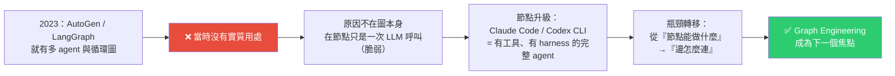
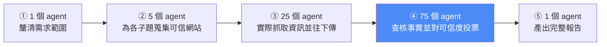
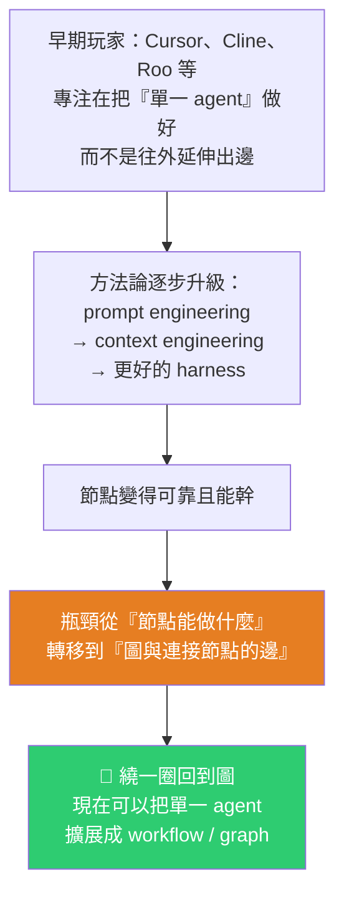

# Graph Engineering 八分鐘講清楚:從 1736 年的柯尼斯堡七橋,到 108 個 agent 的 DAG

> 整理自 YouTube 頻道 **Caleb Writes Code**〈Graph Engineering explained in 8min..〉(2026-07-30,約 8 分半)。
>
> 核心論點一句話:**圖(graph)這個概念不是新東西,2023 年就有人做過;真正改變的不是「圖」,而是「節點裡面裝的東西」。** 當年節點只是一次 LLM 呼叫,脆弱到讓整張圖沒什麼用;現在節點是 Claude Code、Codex CLI 這種帶完整工具與 harness 的 agent,**瓶頸才從「節點能做什麼」轉移到「連接節點的邊」上**——於是我們繞了一圈又回到圖。

---

## 一句話總結



---

## 一、先看一個真實例子:Claude Code 做 deep research 時發生了什麼

當你叫 Claude Code 對某個主題做深度研究,**背後不是一個 agent 從頭做到尾,而是動態產生一整套 workflow,再依此展開上百個 agent。**

影片作者實際觀察到的情況:

| 項目 | 內容 |
|---|---|
| workflow 產生方式 | Claude Code **當場寫出一份 JavaScript**(該次約 427 行) |
| 這份程式碼的角色 | 一個 **runtime 環境**,負責展開上百個 agent |
| 是否固定 | **每次新請求都重新生成一份全新 workflow**,展開的 agent 數量也不同 |
| 該次總 agent 數 | **108 個**,分成五個階段 |
| 每個 agent | **各自獨立的 context window 與 system prompt** |

**五個階段的分工:**



> 值得注意的是**第四階段佔了 75 個 agent**——**查核與投票的成本遠高於蒐集本身**。這其實就是「證據驅動」在架構上的體現。

**每個階段內部大致並行執行,而執行只由左往右流動、沒有任何節點往回連形成迴圈——這就是 DAG(有向無環圖)。**

---

## 二、圖論的起點:1736 年的柯尼斯堡七橋

**Leonhard Euler** 面對的問題很簡單:柯尼斯堡有兩塊陸地與兩座島,共七座橋相連——**能不能走一條路線,每座橋恰好經過一次?**

你可以用窮舉法試,很快會發現不可能。Euler 也同意不可能,**但真正重要的不是這個答案,而是他把問題簡化的方式**:

| 現實 | 抽象 |
|---|---|
| 陸地 / 島 | **節點(node)** |
| 橋 | **邊(edge)** |

**節點 + 邊 = 圖。** 有了這個表示法,Euler 才能給出「不可能」的證明。影片的重點不在證明本身,而在:**這套 1736 年的抽象,今天被直接套用到 agent 上。**

---

## 三、為什麼要用圖,而不是一個 agent 硬幹?

技術上你確實可以用單一 agent 做完那份 deep research,但那會很傻。兩個理由:

| 好處 | 說明 |
|---|---|
| **時間** | 把任務拆成各有小目標的 sub-agent 後**同時開工**,單純靠並行就省下大量時間 |
| **關注點分離** | 每個 agent 有自己的 context window,**可以整個聚焦在自己的目標上**;單一 agent 則得用同一個 context 同時裝「總目標」與「當前任務」,還要不斷來回摘要 |

> 第二點其實比第一點更關鍵:**不是「快」,而是「不必反覆摘要」**——反覆摘要正是單一長任務 agent 品質衰減的主因。

---

## 四、但圖是有代價的:token 成本

影片引用 Anthropic 談其多 agent 研究系統的說法:

| 形態 | 相對 token 用量 |
|---|---|
| 一般對話 | 1× |
| **單一 agent** | 約 **4×** |
| **多 agent 系統** | 約 **15×** |

**回到那個 108 agent 的例子實際算一筆帳:**

```
每個 agent 跑 Opus 5、各自的 system prompt
每個 agent 起手約 20,000 token
        ↓
外推到 108 個 agent
        ↓
光是 input 成本就接近 $10
        ↓
但因為有 prompt caching
實際上更接近 $1
```

> **prompt caching 是讓「單 agent → 並行 agent 圖」在經濟上可行的關鍵。** 沒有它,這種規模的展開對多數人來說貴到不切實際。
>
> 📌 這條也呼應本庫 [[gpt-5-6-sol-kernel-self-optimization-luna-pricing]] 與 [[six-ai-agent-trends-next-year]] 講的 Token Budget:**架構選擇本質上是成本選擇。**

---

## 五、本片最有價值的論點:改變的不是圖,是節點

「agent 跟 agent 溝通」完全不是新概念:

| 時間 | 事件 |
|---|---|
| 2023 | Microsoft 的 **AutoGen** 談 agent 之間互相溝通 |
| 2023 | LangChain 開始玩循環圖,後來發展成 **LangGraph** 這個 agent 編排框架 |
| 同期 | Anthropic 也發表過多種 agent 協作模式 |

Anthropic 當時整理的那幾種模式(至今仍是有用的分類):

| 模式 | 做法 |
|---|---|
| **Prompt chaining** | LLM 一個接一個串起來 |
| **Routing** | 類似 sub-agent,但從主 agent 的視角看 |
| **Parallelization** | 就像前面那個 deep research workflow |
| **Orchestrator** | 一個統籌者分派工作 |
| **Evaluator-optimizer** | 兩個 LLM **對抗式**地來回,直到滿足條件為止 |

**但這些在當時都沒有實質用處。** 影片引述 LangChain 部落格的說法:

> **改變的不是圖,而是「節點能做什麼」。**
>
> 當年節點只是**一次 LLM 呼叫**,遠遠不是我們今天每天在用的 Claude Code、Codex CLI 那種完整 agent。今天的節點因為擁有大量工具與 harness 環境,**強大太多了**。

### 演進路徑



> **正因為節點可靠了,我們才能把 agent 從「一個」擴展成「一張圖」,去解決像 deep research 這種單一 agent 很難處理的問題。**

---

## 六、收尾的對照

Euler 當年的挑戰是:**判斷「每座橋恰好走一次」是否可行**——這催生了圖論。

今天把圖論搬到 agent 上,我們要回答的則是:**一個任務該怎麼切分,才能讓這些已經很能幹的節點,在結構上被配置成足以解決更複雜問題的形狀。**

---

## 應用案例

### 案例 1|判斷「這個任務該不該上圖」的兩個問題

別因為 graph 是熱門詞就上。照本片的邏輯,只有兩個條件同時成立才划算:

1. **任務可以被切成彼此獨立、各有明確小目標的子任務嗎?**(否則並行不會省時間)
2. **子任務各自需要大量獨立上下文嗎?**(否則單一 agent 的 context 夠用,不必付 15× token)

deep research 兩者都成立(子題彼此獨立、每個都要讀大量網頁);而「修一個 bug」通常兩者都不成立。

⚠️ 這跟本庫 [[harness-loop-graph-troubleshooting-map]] 的警告完全一致:**Graph 的「過早儀式化」會凍結假設、讓系統變脆弱;需求還在三天兩頭改的階段,要往回退用最簡單的 Harness。**

### 案例 2|把「查核」當成一個獨立階段,而且捨得給它資源

那個 108 agent 的分配裡,**查核與投票佔了 75 個**,比實際抓資料的 25 個多三倍。這個比例本身就是一個設計主張:**在資訊類任務裡,驗證的成本天然高於生產。**

實務套用:如果你的 research/summarization 流程裡沒有獨立的查核階段(而是讓同一個 agent 邊寫邊查),那它的可信度上限就被鎖死了。這也對應 [[production-agent-engineer-skills-2026]] 的「**確定性檢查優先、LLM 評審必須做上下文分離**」——**75 個獨立投票者之所以有意義,正是因為它們彼此的上下文是分開的。**

### 案例 3|算清楚你的 token 帳,並確認 prompt cache 有生效

本片給了一個很好用的估算模板:

```
每 agent 起手 token × agent 數量 × 模型單價 = 展開成本下限
```

108 × 20,000 token 在 Opus 5 上約 $10,靠 prompt caching 降到約 $1 —— **十倍的差距完全來自快取是否命中**。

實務檢查:把**固定不變的內容(system prompt、工具定義、共用背景)放在 prompt 最前面**,變動的放後面,否則每個 sub-agent 都會 cache miss,成本直接回到十倍。這一點在 [[codebase-memory-vs-codegraph-two-routes]] 提到的「tools/list 回傳順序要固定以提高 prompt cache 命中率」是同一個道理。

### 案例 4|用「節點 vs 邊」重新定位你自己的工程重心

這是本片最有遷移價值的框架:**問自己「我現在的瓶頸是節點還是邊?」**

- **瓶頸在節點**(單一 agent 常做錯、找不到檔案、工具用不對)→ 該做的是 context engineering、工具描述、harness 改善。**這時候上圖只會把錯誤放大 100 倍。**
- **瓶頸在邊**(單一 agent 做得挺好,但任務太大、上下文塞不下、需要並行)→ 才輪到 graph engineering。

**多數人的瓶頸其實還在節點。**

### 案例 5|本倉庫的對照

我們的四個每日 cron 其實是一張極簡的 DAG:`列出影片 → 去重 → 取字幕/轉錄 → 寫筆記 → 更新 README → commit`,單向、無迴圈。

依本片的框架檢視:**我們的瓶頸在節點還是邊?** 答案是節點——真正會出錯的是「去重判定」(2026-07-11 的 grep 事故)與「轉錄品質」,而不是階段之間怎麼連。**所以不需要把它擴展成多 agent 圖,現在的形狀是對的。**

---

## 重點回顧(TL;DR)

- **Claude Code 做 deep research 時,會當場寫一份 JavaScript(該例 427 行)當 runtime,展開 108 個 agent 分五階段**;每次請求都重新生成,每個 agent 有獨立 context 與 system prompt。
- 五階段:**1 釐清 → 5 找來源 → 25 抓資料 → 75 查核投票 → 1 產報告**;只往前流、無迴圈 = **DAG**。
- **圖論起點:1736 年 Euler 的柯尼斯堡七橋**——把陸地抽象成節點、橋抽象成邊。今天原封不動套用到 agent。
- **用圖的兩個好處**:並行省時間、**每個 agent 的 context 可以完全聚焦**(不必反覆摘要)。
- **代價**:Anthropic 數據——單 agent 約 4× 一般對話 token,**多 agent 約 15×**;108 agent 的例子 input 成本約 $10,**靠 prompt caching 降到約 $1**。
- **⭐ 核心論點**:2023 年就有 AutoGen / LangGraph / Anthropic 的各種協作模式,但都沒實質用處——**問題不在圖,在節點。當年節點只是一次 LLM 呼叫;現在節點是有工具有 harness 的完整 agent。**
- **瓶頸轉移**:prompt engineering → context engineering → harness → **現在瓶頸落在圖與邊上**,於是繞一圈回到圖。
- **今天的問題**:不是「圖可不可行」,而是**任務該怎麼切分,才能讓這些能幹的節點被配置成解得開更難問題的結構**。

---

## 來源

- Caleb Writes Code(YouTube),〈Graph Engineering explained in 8min..〉(2026-07-30,約 8 分半):<https://youtu.be/mBePcvqLX88>
  - ⚠️ 該片無官方字幕,本文依 **YouTube 自動英文字幕**整理並轉寫為繁體中文,可能有少量聽寫誤差(工具名稱如 Cline、Roo、Windsurf 等已依上下文校正)。
  - 影片章節:00:00 Intro / 01:16 Graph Theory / 02:33 DAG / 03:14 Dynamic Workflow / 03:56 Cost of Graph / 05:58 Multi-Agent / 06:44 Coding Agent / 07:42 Bottleneck / 08:09 Conclusion。
  - 片中引用:Anthropic 關於多 agent 研究系統的 token 用量數據、LangChain 談 graph engineering 的部落格觀點(「改變的是節點,不是圖」)。
- 延伸(本庫):[Harness Engineering 的演進](./harness-engineering-evolution.md)、[Pi Agent 極簡 harness](./pi-agent-minimal-harness.md)(同一作者) · [Harness/Loop/Graph 三層排障地圖](./harness-loop-graph-troubleshooting-map.md) · [Codex Multi-agent V2 與 Graph Engineering](../applications/codex-multi-agent-v2-graph-engineering.md) · [2026 Agent 工程師能力與面試題](./production-agent-engineer-skills-2026.md)
