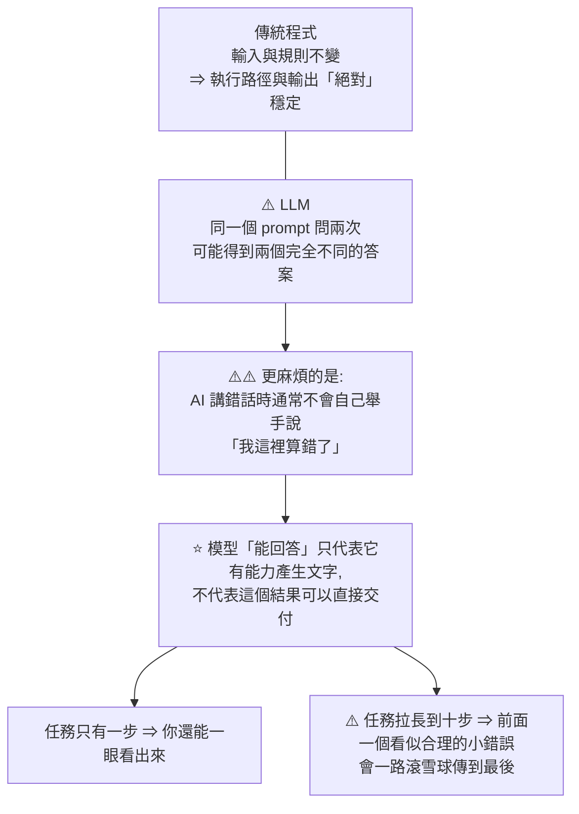
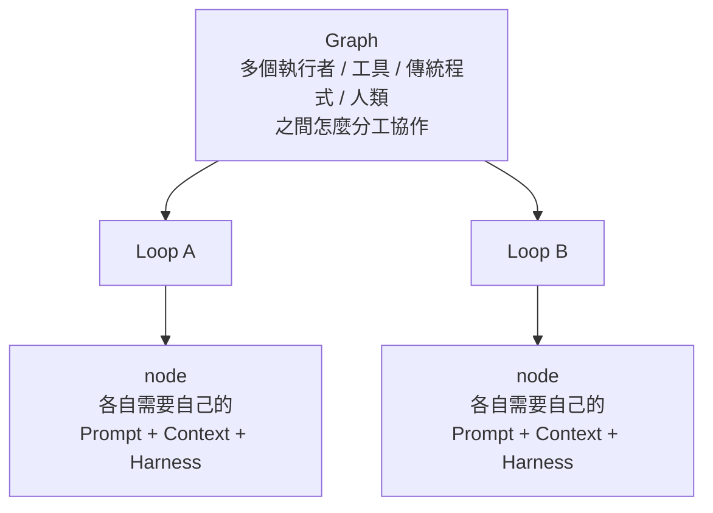
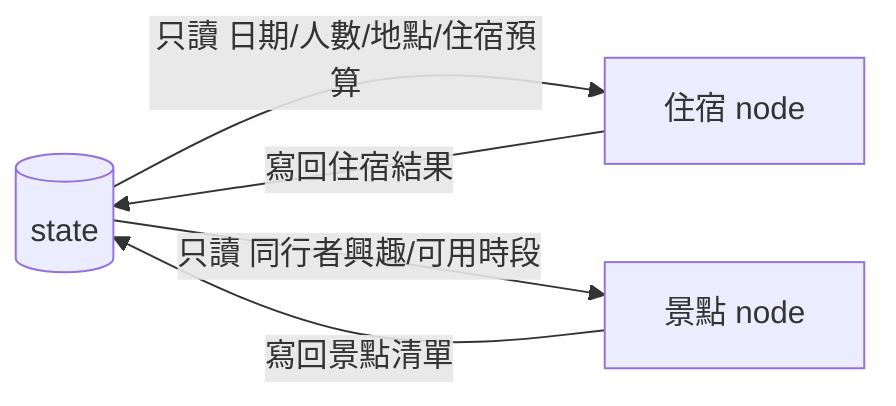
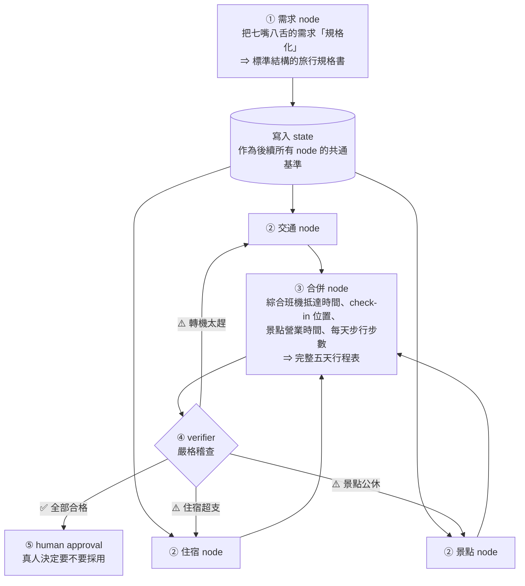
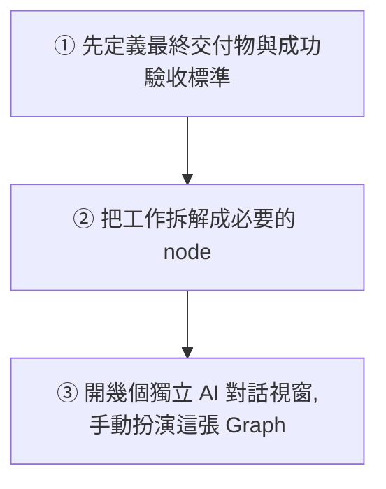

# Graph Engineering:把腦袋裡的分工、路由與驗收畫出來,別再當人肉 routing system

> 整理自 YouTube 頻道 **Gary Chen(@garytalksstuff)**〈Graph Engineering 解析,AI 圈新名詞到底在紅什麼?〉(2026-08-22,約 16.5 分鐘,官方 zh-TW 字幕)。

> ⭐ **這篇是 [[loop-engineering-when-and-how-gary-chen]] 的續集** —— 影片開頭就是接著上個月那支講的。
> 相關筆記:[[agent-five-cores-langgraph-trading-agent]]、[[agent-native-tooling-steinberger]]、[[seven-agent-architectures-selection-guide]]、[[task-decomposition-agentic-workflow]]、[[claude-dynamic-workflows]]、[[context-engineering-processing-vs-thinking]]、[[agent-runtime-deepseek-harness-cordis]]

---

## 一句話總結

**Graph Engineering 不是新東西,是把原本只存在你腦袋裡的「分工、路由、context 與驗收機制」畫出來、講清楚。**

⭐ 而它要治的病只有一個:

> **你原本是想把工作交出去給 AI,最後卻只是把自己變成了人肉 routing system。**

---

## 一、⭐ 先把「這是不是又一個 buzzword」講清楚

起因是 **Peter Steinberger** 在 X 上發的一句話:「我們還在討論 Loop 嗎?還是大家已經轉向 Graph 了?」

**講者的立場很平衡,值得完整記下:**

| 面向 | 他的判斷 |
|---|---|
| **不是全新的東西** | 很像 **agents orchestration**;用過 **n8n** 的人會覺得很眼熟。**任務拆解、條件分支、平行處理、狀態管理、人工審核** —— 這些在 workflow automation 與各種 agent framework 裡早就存在很久 |
| **但也不全然是 buzzword** | ⭐ 它更像**一種思考方式**:把原本存在腦袋裡的分工、路由、context 與驗收機制**畫出來、講清楚** |
| **真正的價值** | 幫我們想清楚**該怎麼使用 AI、或指揮一群 agent** |

> ⚠️ **這個定調很重要**:如果你已經用 n8n 或類似工具做過流程,那你**不需要重學任何東西** —— 你要拿的是那個「先想清楚工作怎麼流動」的習慣。

---

## 二、為什麼 AI 圈一直冒新名詞:同一個問題沒被解決

**核心問題:怎麼讓輸出不穩定的 AI,可靠地把一整份複雜工作做完?**



⭐ **所以 Prompt / Context / Harness / Loop / Graph 這些東西,本質上都是在替 AI 的不確定性加上「不同維度」的防護網。**

---

## 三、⭐⭐ 五個概念的分工(全片最有價值的結構)

| 層 | 重點在於 | 具體管什麼 |
|---|---|---|
| **Prompt Engineering** | **怎麼交代** | 你要做什麼、有哪些限制、成功標準是什麼、最後用什麼格式交回來 |
| **Context Engineering** | **在正確的時間給正確且「剛好足夠」的資訊** | ⭐ 不是資料越多越好,而是**這一步真正需要什麼** |
| **Harness Engineering** | **agent 的整個工作環境** | 能不能讀檔、能不能執行程式、有哪些權限、做完能不能跑測試看 log |
| **Loop Engineering** | **怎麼讓「一個」agent 反覆工作和停止** | 做完先檢查,不合格就修改,再跑一次,直到通過 |
| ⭐ **Graph Engineering** | **整體工作怎麼分工、交接、驗收** | 哪些一定要先做、哪些可以同時開始、這一步的 output 要送到哪裡 |

**Context Engineering 的例子很好懂**:叫 AI 寫一封客戶回信,它需要看到**客戶的問題、公司政策、語氣要求** —— **不需要順便讀整間公司三年來的會議紀錄。**

### ⭐⭐ 關鍵:這五個不是競爭關係,是層層嵌套



- **一張 Graph 裡面可以包含好幾個 Loop**
- **每一個 node 裡的 agent,也都需要自己的 Prompt、Context 和 Harness**
- ⭐ **Graph 的出現絕對不代表 Prompt 沒用了,更不代表 Loop 過時了 —— 每一層都在解決上一層管不到的盲點**

⭐⭐ **最精準的一句分界**:

> **前面四層主要是在優化「單一執行者要怎麼做好一件事」;Graph Engineering 則是站到制高點,解決「多個執行者、工具、傳統程式和人類之間要怎麼分工協作」。**

**所以現在開始討論 Graph,是因為任務變得越來越長越來越複雜 —— 問題已經不只是「某一個 agent 聰不聰明」,而是「整體流程該如何協同作戰」。**

### 📎 對照本倉庫:五層各自對應哪些筆記

| 層 | 本倉庫對應 |
|---|---|
| **Prompt** | [[matt-pocock-skills-teardown]](指引詞壓縮領域知識) |
| **Context** | [[context-engineering-processing-vs-thinking]]、[[token-saving-three-moves-context-control]] |
| **Harness** | [[agent-runtime-deepseek-harness-cordis]]、[[pi-minimal-agent-harness-teardown]] |
| **Loop** | ⭐ [[loop-engineering-when-and-how-gary-chen]](本篇的前傳) |
| **Graph** | **本篇** + [[agent-five-cores-langgraph-trading-agent]](LangGraph 的實作)+ [[seven-agent-architectures-selection-guide]](什麼時候該選哪種) |

---

## 四、⚠️ 畫流程圖 ≠ Graph Engineering

這個提醒很必要:

> **畫圖只是給人看的。Graph Engineering 真正要設計的,是這張圖背後一套「真正能自動跑起來」的系統結構。**

它必須明確告訴系統五件事:

```
① 每一步要做什麼
② 輸入什麼、輸出什麼
③ 下一步往哪走
④ 什麼條件才算完成
⑤ 萬一失敗了該退回哪裡
```

---

## 五、三個核心零件:node / edge / state

### ① Node —— ⭐⭐ Node ≠ Agent

**Node 就是一個獨立的工作單元**(流程圖裡的一個方框)。裡面執行的東西**非常靈活,不一定非得是 AI**:

- 一次簡單的 LLM 呼叫
- **一段 Python 腳本**
- 一個資料庫查詢
- 一個**自帶 Loop 的完整小 agent**(在裡面自動搜尋、檢查、重試)
- ⭐ **甚至「需要真人按確認的人工審核」本身也是一個 node**

⚠️⚠️ **這一段值得完整記住,因為它最反直覺:**

> **Graph Engineering 並不是要你把所有環節都換成 AI。** 很多確定性的工作 —— 像是加總預算、檢查日期格式、驗證網址有沒有缺漏 —— **用傳統程式寫三行 code 就搞定了:速度快、成本是零、而且百分之百精準。**
>
> ⭐ **硬要派一個大語言模型去幫你按計算機,除了浪費 token 跟增加出錯機率,沒有任何好處。**

**一個設計良好的 node,核心就三件事:**

| 要素 | 以「找住宿」的 node 為例 |
|---|---|
| **清楚的 input** | 日期、人數、地點、每晚預算 |
| **嚴格的 output** | 固定三個住宿方案,**每個都必須包含價格、地點、取消條款、原始訂房連結** |
| **明確的完成條件** | 少了任何一項就算不合格 |

### ② Edge —— 依賴關係與路由邏輯,不是拿線連方框

**Edge 決定資料怎麼傳遞、下一步該往哪裡走。**

| 類型 | 例子 |
|---|---|
| **依賴限制** | ⭐ 住宿跟交通方案還沒找齊之前,**行程合併 node 就絕對不能啟動** |
| **平行觸發** | 條件齊全時,交通 / 住宿 / 景點三個 node **可以同時觸發** |
| **固定路徑** | A 做完直接交給 B |
| ⭐ **條件式分支** | 檢查通過 → 送給真人確認;**檢查不通過 → 把錯誤訊息退回原本的 node 要求重做** |
| ⭐ **暫停去問人** | 執行到一半發現必要資訊不足,**把流程暫停、跳去向人類提問,拿到答案再繼續** |

### ③ State —— ⭐ 闖關卡,不是聊天紀錄

**比喻**:想像你在玩大地遊戲,手上那張**闖關卡**就是 state —— 記錄隊伍資訊、每一關收集到的結果、現在做到第幾關、關主的批改紀錄。**每過一關就更新一次。**

⭐⭐ **最重要的設計原則:每個 node 不需要、也「不應該」看到整個 state 的全部內容。**



**這樣做的兩個好處:**
1. 讓每個 node 的 **context 保持乾淨精準**
2. ⭐ **出問題時立刻知道是「哪筆資料被誰寫壞了」**

### ⭐⭐ state vs 聊天紀錄:全片最好的一個對比

| | 聊天紀錄 | 正式的 state |
|---|---|---|
| **像什麼** | ⚠️ 把所有文件、便利貼、草稿**一股腦全堆在同一張桌子上** | ⭐ **一張有標準欄位的 Google Sheet 或資料庫** |
| **內容** | 前面的需求、中間的**廢案**、最後的定案**全混在一起** ⇒ AI 越讀越眼花 | 日期就是日期、預算數字就是預算數字、審核狀態就是審核狀態 |
| **能力** | — | ⭐ **嚴格的讀寫規則,可隨時存檔、版本比對,出錯時直接倒帶恢復** |

> 📎 這正是 [[agent-five-cores-langgraph-trading-agent]] 講的 LangGraph scratchpad 在做的事 —— **本篇是概念,那篇是實作。**

### 三者的分工

| 零件 | 負責 |
|---|---|
| **Node** | 把具體的事**做好** |
| **Edge** | 決定資料與流程**下一步往哪走** |
| **State** | 隨時記錄**當前進度與最新資料** |

> ⭐ 三者結合,AI 系統才真正擁有**方向感** —— 清楚知道自己在哪一站、手上有什麼資料、接下來該往哪去。

---

## 六、東京旅行案例:完整走一遍

**題目**:四個朋友去東京玩五天,每人預算三萬。有人想逛街、有人想看美術館、**一個人吃素**、**一個人膝蓋不好每天不能走超過兩萬步**。



### ⭐ 第一步的重點:先規格化,不要急著排景點

需求 node **不急著排景點**,而是專心把零散需求整理成:日期、出發地、目的地、人數、總預算、每晚住宿預算、**每個人的飲食與行動限制**、**哪些是絕對不能接受的雷點**。

### ⭐ 第二步:fan-out(平行分流)

交通 / 住宿 / 景點三個 node 在第一輪蒐集時,**需要的 context 截然不同、彼此也沒有先後依賴,所以完全可以平行同時跑**。

> **從同一個需求節點分流成多條平行路徑,在架構上就叫 fan-out。**

### 第三步:fan-in(匯流)

**多條平行路徑重新匯合到一個節點,就叫 fan-in。**

⚠️ **但排完行程還不能結束** —— **合併只代表「資料排在一起了」,不代表「這份行程是可行的」。**

### ⭐⭐ 第四步:verifier —— 哪裡出錯,就退回哪裡修

**Verifier 依照嚴格的邏輯標準全面稽查**:交通與住宿的 check-in 日期有沒有對上、景點當天到底有沒有開門、轉乘與移動時間合不合理、**有沒有踩到吃素或走太多路的地雷**、機票住宿門票交通費精算加總後**有沒有超支**。

**不通過時的處理方式是本案例最精華的部分:**

| 發現的問題 | ⭐ 只退回哪裡 |
|---|---|
| 總預算超支五千,問題出在住宿太貴 | **只退回住宿 node**,要求在同一個區域找每晚便宜一千塊的替代方案 |
| 某個景點公休 | **只退回景點 node** |
| 轉機時間太趕 | **只退回交通 node** |

> ⭐⭐ **系統不需要把整份行程全盤推翻。哪裡出錯,就退回哪裡修。**

**而這條「verifier 發現問題 → 退回前面的 node 修改 → 重新驗收」的回溯路徑,本身就是一個局部 Loop。**

⭐⭐ **所以 Graph 和 Loop 不是二選一:**

```
Graph 負責「宏觀」的架構分工、資料流動與全局驗收
Loop  負責「微觀」的迭代修正
⇒ 一張大 Graph 裡面,隨時可以嵌入好幾個局部的 Loop
```

### 第五步:human approval —— 把「取捨」留給人

**AI 可以幫你窮舉選項、找出時程衝突、自動修正邏輯錯誤,但最終的取捨要留給自己:**

- 要不要為了省三千塊住遠一點?
- 要不要因為朋友膝蓋痛拿掉這個景點?
- 要不要冒險買不能退改的特價票?

⭐ **這三個例子的共同點:它們沒有客觀正確答案,是「價值判斷」而不是「邏輯判斷」** —— 而 verifier 只能處理後者。

---

## 七、⭐ Graph 解決的三個具體問題

### ① Context 污染與工具失焦

**症狀**:所有任務塞在同一個長對話裡 —— 前面是四個人的聊天需求、中間是航班搜尋記錄、後面貼了一堆飯店跟景點連結、中間再來回改五六輪。**模型的 context 變得又長又髒,它根本分不清哪些是過期廢案、哪些才是最新決定。**

⭐ **工具也是同樣道理**:訂房、地圖、搜尋、算數學、串 API **全塞給同一個 agent** ⇒ 它每走一步都要在十幾個工具裡猶豫不決 —— **看似全能,注意力卻完全渙散。**

**解法:context 隔離與工具專業化。** 住宿 node 專心找飯店,**不需要讀景點介紹,也不用知道大家在群組裡吵了什麼。**

### ② 缺乏可觀測性與無法局部重跑

**症狀**:單一 agent 一路蠻幹到底 —— 只要它一開始選錯了飯店位置,**後面排的景點順序跟移動時間就會全部連鎖崩盤**。最後你拿到一份爛行程,卻**根本不知道該從哪裡改起**:是要改 prompt、還是換飯店、還是乾脆整個重來?

**解法**:每個 node 的**輸入、輸出、路由選擇和驗收紀錄都清楚保留在 state 裡**。verifier 發現移動時間過長時,你可以**倒回去看住宿 node 當時依據什麼條件挑了這家飯店,然後只重跑住宿這個分支。**

### ③ ⭐⭐ 把「做完」當成「做對」

> **LLM 最大的盲點就是特別擅長「完成表面任務」。** 你叫它查最便宜的機票,它能劈哩啪啦生出一張**以假亂真的班表** —— 但實際上**根本買不到那張票**。

**解法**:在關鍵節點設立 verifier 與人工審核節點。

⭐ **講者對 verifier 的評價很誠實 —— 沒有誇大:**

> **雖然驗證器無法百分之百消滅所有幻覺,但它的價值在於:把原本藏在你腦袋裡的驗收標準,明確寫成規則,由系統嚴格執行。**

---

## 八、⭐ 不會寫程式也能做:三步驟手動版

**強烈建議新手先從純手動版本跑起。**



### ① 定義交付物與驗收標準

以旅行計畫為例,目標是產出一份**時程可行、符合預算、照顧到同行者需求、而且關鍵資訊都能追溯到原始來源**的行程表。

**「可行」的具體定義**:每天交通時間合理、住宿沒有超支、景點營業時間對得上。

### ② 拆解 node —— 每個寫清楚五件事

> **再次強調:node 不一定等於 agent,它只是一個獨立的工作單元。**

```
① 它負責什麼
② 需要什麼 input
③ 交出什麼 output
④ 完成後去哪裡
⑤ ⭐ 遇到什麼情況「絕對不能放行」
```

**例**:交通 node 必須交出航班選項、票價、時間與連結;**如果少了來源網址或票價超支,就判定為不合格、禁止放行。**

### ③ 開幾個對話視窗,自己當 routing system

- 一個對話專門查交通、一個查住宿、一個排景點
- 把整理好的需求規格分別丟給它們
- ⭐ **絕對不要讓任何一個 AI 去包辦整份行程**
- 三份結果產出後,**再打開第四個視窗負責合併與嚴格審核**
- 住宿超支就丟回住宿對話、景點排不下就丟回景點對話,修改後重新合併檢查
- 最後由你親自決定是否採用

> ⭐⭐ **在這個版本裡,你就是 routing system —— 但你已經在實踐 Graph Engineering。**
> **先手動跑,才能看見這份工作到底怎麼運作。流程跑順後,再考慮把它自動化。不要想著一步登天。**

---

## 九、⚠️ 結尾的克制:不是每件事都要套 Graph

**講者結尾這段的分寸很重要,不要跳過:**

- **不要對各種新名詞產生焦慮** —— Graph Engineering 其實就是一種**讓我們跟 AI 更好協作的架構思維**,很多人可能一年前就在用了,只是從未被 AI 圈大佬點名過
- ⚠️ **絕對不是每一項任務都需要硬套 Graph。AI 系統不是越複雜越好。**
- **一次性的簡單任務,一個 prompt 就能搞定的事,千萬別硬把它拆成七個 node 自找麻煩**
- ⭐⭐ **他甚至自承:剛剛舉的旅行案例,其實現在比較前沿的模型就能自己處理了,沒必要拆得這麼複雜** —— 舉這個例子只是為了讓人容易理解、拿來練手

> ⭐ **這種「示範完自己拆台」的誠實很少見,而且它其實是最重要的一課:架構的價值取決於任務複雜度,不是取決於架構本身有多漂亮。**

---

## 應用案例

### 案例 1|⭐⭐ 用「人肉 routing system」當診斷訊號

影片最尖銳的那句話可以直接變成自我檢查:

```
你在用 AI 做一件事時,如果一直在做這些動作 ——
  「下一步呢?」
  「這份資料要放哪裡?」
  「這個結果可以直接用嗎?」
  「錯了要全部重來嗎?」
⇒ ⚠️ 你已經是那個人肉 routing system 了
```

⭐ **關鍵判斷:你在「決策」還是在「搬運」?**

| 你在做的事 | 意義 |
|---|---|
| 做**價值判斷**(要不要為省錢住遠一點) | ✅ **這本來就該是你的工作** |
| **搬運資料、決定下一步、記住做到哪** | ⚠️ **這些是 routing,該被結構吸收掉** |

### 案例 2|⚠️ 先問「這個 node 需要是 AI 嗎?」

因為 **node ≠ agent**,設計時該對每個節點問一次:

| 這一步的性質 | 該用什麼 |
|---|---|
| **確定性運算**(加總、格式檢查、日期驗證、URL 驗證) | ⭐ **三行程式碼** —— 快、零成本、100% 精準 |
| 需要理解自然語言、做開放式判斷 | LLM 呼叫 |
| 需要反覆嘗試直到通過 | 自帶 Loop 的小 agent |
| **不可逆或有價值判斷成分** | ⭐ **人工審核 node** |

⚠️ **最常見的浪費就是「派 LLM 去按計算機」** —— 除了燒 token 和增加出錯機率,沒有任何好處。

### 案例 3|⭐ 把 state 從聊天紀錄升級成有欄位的表

這是最容易立刻動手、又最有效的一招。哪怕沒有任何自動化:

```
❌ 現況:所有需求、廢案、定案都混在同一個對話裡
✅ 改成:開一份表(Google Sheet / Markdown 也行),欄位固定

  | 欄位 | 值 | 誰寫的 | 何時更新 |
  |---|---|---|---|
  | 日期 | ... | 需求 node | ... |
  | 總預算 | ... | 需求 node | ... |
  | 住宿候選 | ... | 住宿 node | ... |
  | 查核問題清單 | ... | verifier | ... |
```

⭐ **好處立刻出現:**
- 每個對話視窗只餵它該看的欄位 ⇒ **context 乾淨**
- 出問題時知道**是哪一欄、被誰寫壞的**
- **可以存檔、比對版本、出錯直接倒帶**

> 📎 這跟 [[token-saving-three-moves-context-control]] 的「把結論整理成 Markdown 再開新對話」是同一招的結構化版本。

### 案例 4|⭐ 「哪裡出錯就退回哪裡」要靠 output 契約撐住

局部退回之所以能成立,前提是**每個 node 的 output 格式夠嚴格**。否則 verifier 根本說不出「問題在住宿」。

```
❌ 住宿 node 回一段散文:「我推薦幾間飯店,價格大概...」
   ⇒ verifier 無法精算總額,也無法定位問題

✅ 住宿 node 固定回三個方案,每個必含:
   價格 / 地點 / 取消條款 / 原始訂房連結
   ⇒ verifier 可以直接加總、可以驗證連結、可以指名是哪一項不合格
```

⭐ **推論:output 契約的嚴格程度,直接決定了你能不能做局部重跑。** 想省重跑成本,先把 output 規格寫死。

### 案例 5|對照本倉庫的既有筆記,決定要不要上 Graph

⚠️ 呼應影片結尾的克制 —— 判斷順序建議:

```
① 一個 prompt 能搞定嗎?           ⇒ 能就別拆
② 需要反覆修到通過,但只有一個執行者? ⇒ 那是 Loop,看 [[loop-engineering-when-and-how-gary-chen]]
③ 真的有「多個執行者要分工、交接、驗收」? ⇒ 才輪到 Graph
④ 要挑哪一種多 agent 架構?          ⇒ 看 [[seven-agent-architectures-selection-guide]]
⑤ 要實際寫出來?                    ⇒ 看 [[agent-five-cores-langgraph-trading-agent]](LangGraph 的 node/edge/state)
```

---

## 重點回顧(TL;DR)

1. **起因**:Peter Steinberger 在 X 上問「我們還在討論 Loop 嗎?還是大家已經轉向 Graph 了?」
2. ⭐ **講者的定調很平衡**:**不是全新的東西**(很像 agents orchestration,用過 n8n 會覺得眼熟;任務拆解/條件分支/平行處理/狀態管理/人工審核早就存在);**但也不全然是 buzzword** —— 它是**一種思考方式:把原本存在腦袋裡的分工、路由、context 與驗收機制畫出來、講清楚**。
3. ⭐⭐ **它要治的病**:**你原本是想把工作交出去給 AI,最後卻只是把自己變成了人肉 routing system。**
4. **為什麼新名詞一直冒**:同一個核心問題沒解決 —— **怎麼讓輸出不穩定的 AI 可靠地做完一整份複雜工作**。傳統程式輸入規則不變則輸出絕對穩定;LLM 同一個 prompt 問兩次可能得到兩個答案。
5. ⚠️⚠️ **更麻煩的是:AI 講錯話時通常不會自己舉手。** ⭐ **模型「能回答」只代表它有能力產生文字,不代表結果可以直接交付。** 一步你還看得出來,**十步就會滾雪球**。
6. ⭐⭐ **五個概念的分工**:**Prompt**=怎麼交代;**Context**=在對的時間給對且**剛好足夠**的資訊(寫客戶回信不需要讀三年會議紀錄);**Harness**=agent 的工作環境(讀檔/執行/權限/看 log);**Loop**=怎麼讓「一個」agent 反覆工作和停止;**Graph**=整體怎麼分工、交接、驗收。
7. ⭐⭐ **五者不是競爭關係,是層層嵌套**:一張 Graph 可含多個 Loop,每個 node 裡的 agent 都需要自己的 Prompt/Context/Harness。**前四層優化「單一執行者做好一件事」,Graph 站到制高點解決「多個執行者、工具、傳統程式和人類之間怎麼分工」。**
8. ⚠️ **畫流程圖 ≠ Graph Engineering** —— 畫圖只給人看;Graph 要設計的是**能自動跑起來的系統結構**:每步做什麼、輸入輸出、下一步往哪、什麼算完成、失敗退回哪。
9. ⭐⭐ **Node ≠ Agent**:可以是 LLM 呼叫、**Python 腳本**、資料庫查詢、自帶 Loop 的小 agent,**甚至人工審核本身也是一個 node**。
10. ⚠️⚠️ **很多確定性工作(加總預算、檢查日期格式、驗證網址)三行程式碼就搞定 —— 快、零成本、100% 精準。硬派 LLM 去按計算機,除了浪費 token 跟增加出錯機率,沒有任何好處。**
11. **好 node 的三件事**:清楚的 input、**嚴格的 output**、明確的完成條件。(住宿 node 固定回三個方案,每個必含價格/地點/取消條款/原始訂房連結)
12. **Edge 是依賴關係與路由邏輯,不是拿線連方框**:依賴限制、平行觸發、固定路徑、**條件式分支(通過→真人確認;不通過→退回原 node 重做)**、⭐ **甚至可以暫停流程跳去問人類**。
13. ⭐ **State = 闖關卡**。**每個 node 不需要也「不應該」看到整個 state** —— 住宿 node 只讀日期/人數/地點/預算,寫回住宿結果。好處:**context 乾淨** + **出問題時立刻知道是哪筆資料被誰寫壞的**。
14. ⭐⭐ **state vs 聊天紀錄的對比**:聊天紀錄像把所有文件便利貼草稿**堆在同一張桌上**(需求、廢案、定案全混在一起,AI 越讀越眼花);**正式 state 像有標準欄位的 Google Sheet** —— **嚴格讀寫規則,可存檔、版本比對、出錯直接倒帶恢復**。
15. **三者分工**:Node 把事做好、Edge 決定往哪走、State 記錄進度 ⇒ **AI 系統才真正有方向感**。
16. **東京案例的流程**:①需求 node 先**規格化**(不急著排景點)②**fan-out** 平行跑交通/住宿/景點 ③**fan-in** 合併 node ④**verifier** 稽查 ⑤**human approval**。
17. ⚠️ **合併只代表「資料排在一起」,不代表「行程可行」** —— 所以一定要有 verifier。
18. ⭐⭐ **哪裡出錯就退回哪裡修**:超支且問題在住宿 ⇒ 只退住宿 node 找每晚便宜一千的;景點公休 ⇒ 只退景點 node;轉機太趕 ⇒ 只退交通 node。**不需要全盤推翻。**
19. ⭐⭐ **這條回溯路徑本身就是一個局部 Loop** ⇒ **Graph 和 Loop 不是二選一:Graph 負責宏觀架構分工與全局驗收,Loop 負責微觀迭代修正,一張大 Graph 可嵌入多個局部 Loop。**
20. ⭐ **human approval 處理的是「價值判斷」不是「邏輯判斷」**:要不要為省三千住遠一點、要不要因朋友膝蓋痛拿掉景點、要不要買不能退改的特價票 —— **這些沒有客觀正確答案,verifier 處理不了。**
21. **Graph 解決的三個問題**:① **context 污染與工具失焦**(工具全塞給一個 agent ⇒ **看似全能,注意力完全渙散**)⇒ 解法是 context 隔離與工具專業化;② **缺乏可觀測性、無法局部重跑**(一開始選錯飯店 ⇒ 後面全部連鎖崩盤,卻不知道從哪改起);③ ⭐⭐ **把「做完」當成「做對」**。
22. ⭐⭐ **第三點最狠**:LLM 特別擅長完成**表面任務** —— 叫它查最便宜的機票,它能生出一張**以假亂真的班表,但實際上根本買不到那張票**。
23. ⭐ **verifier 的價值(講者沒有誇大)**:雖然**無法百分之百消滅幻覺**,但它**把原本藏在你腦袋裡的驗收標準明確寫成規則,由系統嚴格執行**。
24. **不寫程式的三步手動版**:①定義交付物與成功標準 ②拆 node,每個寫清楚五件事(負責什麼/input/output/完成後去哪/**什麼情況絕對不能放行**)③開幾個 AI 對話視窗手動扮演 —— ⭐ **絕對不要讓任何一個 AI 包辦整份工作**。
25. ⭐⭐ **「在這個版本裡,你就是 routing system,但你已經在實踐 Graph Engineering。先手動跑,才能看見這份工作到底怎麼運作;流程跑順後再自動化,不要想著一步登天。」**
26. ⚠️ **結尾的克制**:不要對新名詞焦慮;**不是每項任務都要套 Graph,AI 系統不是越複雜越好**;一個 prompt 搞定的事別拆成七個 node。⭐⭐ **他甚至自承旅行案例其實前沿模型已能自己處理,舉例只是為了練手** —— **架構的價值取決於任務複雜度,不是取決於架構本身多漂亮。**

---

## 來源

- [Graph Engineering 解析,AI 圈新名詞到底在紅什麼? — Gary Chen(@garytalksstuff)](https://www.youtube.com/watch?v=CKKJuFVMvXQ)(2026-08-22,約 16.5 分鐘,官方 zh-TW 字幕)
- 影片引用:**Peter Steinberger** 在 X 上關於 loops vs graphs 的貼文
- 本倉庫相關筆記:[[loop-engineering-when-and-how-gary-chen]](前傳)、[[agent-five-cores-langgraph-trading-agent]](LangGraph 實作)、[[seven-agent-architectures-selection-guide]](架構選型)、[[agent-native-tooling-steinberger]]、[[task-decomposition-agentic-workflow]]、[[claude-dynamic-workflows]]、[[context-engineering-processing-vs-thinking]]、[[token-saving-three-moves-context-control]]、[[agent-runtime-deepseek-harness-cordis]]、[[pi-minimal-agent-harness-teardown]]、[[matt-pocock-skills-teardown]]

> ⚠️ 本文為影片論點的整理與延伸;第三節末的「五層對應本倉庫筆記」對照表與「應用案例」各節為整理者所加,非影片內容。
