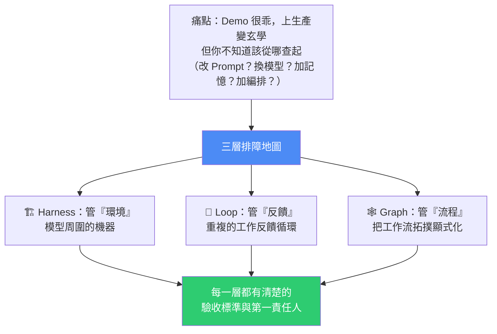
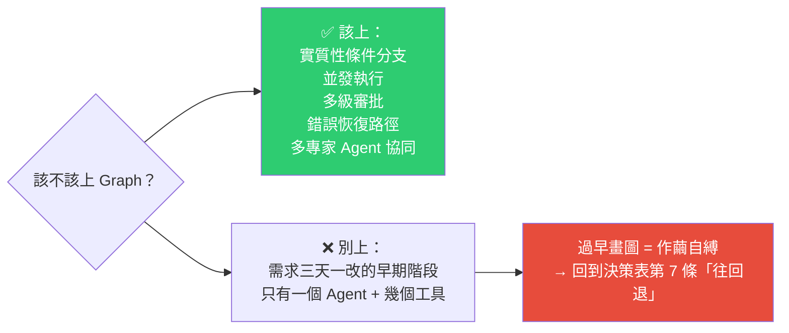

# Harness / Loop / Graph 三層排障地圖:把「Agent 又抽風了」翻譯成可執行的排查工單

> 整理自 YouTube 頻道 **Why QQ(為什麼叫 QQ)**〈58 萬瀏覽 6.5 萬人收藏的 Agent 排障表,我抄了〉(2026-07-31,約 12 分鐘,官方簡中字幕)。影片拆解 X 上作者 **beamnxw** 的長文〈Agent Harness Engineering vs Loop Engineering vs Graph Engineering〉(58 萬瀏覽、6.5 萬收藏),並從一線工程師視角評估**哪幾條能直接抄、哪幾條要繞坑走**。
>
> 核心價值一句話:**這篇文章沒有發明任何新東西,它給的是一張「症狀 → 分層」的排障地圖。**

---

## 一句話總結

**嵌套關係**:圖跑在 Harness 裡 → 循環活在圖裡 → 而 **Harness 為循環提供狀態、工具與評估器**。

---

## 一、先講痛點:為什麼需要這張地圖

上過生產的人都熟悉這些症狀:

- Agent 跑了一大圈說「我做完了」,結果**產出物全是壞的**;
- 重試二十次,**Token 帳單翻三倍**,bug 還在原地;
- 跨會話再打開,**昨天的進度忘得一乾二淨**;
- 多給它五個工具,它**反而開始亂調用**。

真正令人絕望的不是故障本身,而是**你不知道該從哪查起**——改 Prompt?換模型?加記憶?加流程編排?每個方向都有人推薦框架,每個框架都說自己是終極答案。

> 這篇文章的價值就精準卡在這裡:**它把「Agent 不可靠」這團說不清的技術焦慮,切成三塊能各自定責的工程切面。**

---

## 二、三層是什麼(以及一個粗暴但好用的判斷法)

| 層 | 管什麼 | 具體包含 |
|---|---|---|
| **Harness Engineering** | **環境** —— 造模型周圍的機器 | System Prompt、工具定義、記憶、沙箱、權限、日誌、上下文壓縮、路由 |
| **Loop Engineering** | **反饋** —— 設計重複的工作反饋循環 | 外部評分器、確定性測試、有界重試、停止規則 |
| **Graph Engineering** | **流程** —— 把工作流拓撲顯式化 | 節點、分支、匯合、路由邏輯 |

### 判斷法:把「基座模型」拿掉,剩下的基本全是 Harness

這是原文最好用的一個心法。影片作者深有同感的一個觀察:

> **兩個團隊用同一個基座模型,產出卻天差地別。** 一邊提供了乾淨的工具、穩定的工作區、嚴格受限的權限、完全可觀測的狀態;另一邊只有模糊的 Prompt 和極不可靠的 API 封裝。
>
> **智能水平差不多,但「打工條件」完全不同。硬換更強的大模型,救不了爛透的工程環境。**

---

## 三、最硬核的部分:症狀 → 分層決策表

這是整篇文章對一線工程師最實在的用法。**它把老闆或業務方那句模糊的「你們的 Agent 怎麼又抽風了」,直接翻譯成工程師可執行的排查工單。**

| # | 症狀 | 該查哪一層 | 具體排查方向 |
|---|---|---|---|
| 1 | Agent 沒法安全存取資料或工具 | **Harness** | 工具契約、權限控制、沙箱隔離、上下文注入 |
| 2 | 跨會話就忘進度 | **Harness** | 持久化狀態、檢查點、進度產物、壓縮策略 |
| 3 | 第一次跑得差不多,但結果極不穩定 | **Loop** | 立刻加外部評分器、確定性測試、有界重試 |
| 4 | 成功了也不停手,或毫無證據就宣布收工 | **Loop** | 基於證據的終止狀態設計、對 Token 預算有感知的停止規則 |
| 5 | 多個專家 Agent 需要按嚴格順序協同 | **Graph** | 顯式定義節點、邊、路由與匯合邏輯 |
| 6 | 多步流程出錯,死活定位不到壞在哪一步 | **Graph + Harness** | 上「跟圖節點對齊的、帶狀態的 Trace」 |
| 7 | 業務流還在快速迭代,需求三天兩頭變 | **往回退!** | 用最簡單的 Harness、保持純模型驅動、**推遲圖的形式化** |

> 第 7 條特別反直覺——**別急著畫圖,要往回退**。下面「坑一」會展開。

---

## 四、可以直接抄的七條實踐(按落地優先級排序)

### ① 證據驅動的停止規則(全篇金句)

> **Agent 拍著胸脯說「我做完了」,這話一文不值。**

只有**測試通過、URL 可解析、Schema 校驗通過、或有人工評審批准**——這些硬性指標才叫真正的停止條件。影片作者實測:落地之後「假裝完成」的事故肉眼可見地變少。

### ② 有界重試

「失敗了繼續試」絕對不能當成循環的規格。**每一個循環必須寫清楚四件事:**

1. 可測量的目標
2. 每輪必須拿到的**新證據**
3. 最大重試次數
4. **具名的兜底路徑**

> 無界重試最大的惡果只有一個:**成本黑洞。Token 帳單才是最誠實的警報器。**

### ③ 最小權限

在 Harness 層面,權限、網路隔離、白名單、API 金鑰處理、人工授權,**一樣都別省**。權限給太寬,被注入攻擊或搞崩系統只是時間問題。

### ④ 進度檔案 + Git 歷史做持久化

這條經驗主要來自 **Anthropic 在多會話程式碼生成上的踩坑紀錄**:**光靠上下文壓縮根本不夠。**

你還需要:初始化器 + 結構化的進度檔案 + Git 提交歷史 + 嚴格的增量工作紀律。目標是——**讓每一個新啟動的上下文,都能一眼讀懂之前到底發生了什麼。**

### ⑤ 確定性檢查永遠優先於模型自評

讓同一個模型**既當選手又當裁判、沒有任何外部防護**,是原文列出的「五個最昂貴錯誤」之一。

> **自審存在嚴重的共同盲區:它寫程式碼時在哪裡瞎了,評審時往往還在同一個地方瞎。**

能用自動化測試、Schema 校驗、程式碼 diff 解決的,就別用另一個 LLM 去評審。影片作者拿 TDD 類比:**必須按「紅燈報錯 → 綠燈通過 → 重構」的單向閉環推進,不能本末倒置。**

真的必須用大模型評審時,**一定要做上下文分離**;高危動作**必須上人工審批**。

### ⑥ 先跑 Trace,再去畫 Graph

**「業務都還沒跑通就急著搞複雜的圖編排」,高居原文「昂貴錯誤清單」的榜首。**

正確姿勢:先用**最簡單的 Harness** 跑跑看 → 收集**真實運行的 Trace** → 看清系統真正穩定的執行路徑長什麼樣 → **然後才用圖把這套流程固化下來。**

### ⑦ 工具寧窄勿寬

> 原文說得很狠:**別把 Harness 當垃圾場!**

塞進去的工具一多,選擇的錯誤率直線上升、上下文變得極其嘈雜,**模型反而更困惑**。

**更多的工具和記憶,絕不會自動等價於更好的結果。**

> 🔑 這七條的共同點:**沒有任何一條需要你去買新框架,全是扎扎實實的工程紀律。**

---

## 五、潑冷水時間:三個要警惕的坑

### 坑 ①|Graph 的「過早儀式化」

**原文作者自己都提醒了**:如果你的任務只是給一個 Agent 三個工具讓它幹活,**強行上圖只會過早凍結假設,讓整個系統變得無比脆弱。**

**AutoGen 的官方文件其實也說得很直白**:只有在需要精確控制執行順序、不同結果要走向不同分支、或帶複雜循環的時候,才需要用圖。

### 坑 ②|術語包裝的嚴重通膨

Prompt → Context → Harness → Loop → Graph,這些詞近兩年接連走紅。它們**確實指向不同的工程抽象層次**,談不上誰搶誰的風頭;但不可否認,**這個圈子造新詞的速度越來越快了**。

> 工程師要清醒:**盲目追逐新名詞,並不能讓你的系統變得更穩。**

### 坑 ③|當心「廠商敘事」

原文大量引用 LangChain、OpenAI Agents SDK、LangGraph、AutoGen 這些框架的說法。這些來源確實有乾貨,但**多出自框架或平台的維護方,難免夾帶推廣自己生態的私貨**。

> 影片作者的底線原則值得抄下來:
>
> **他們總結的「具體工程避坑指南」可以抄,但他們推銷的「複雜架構結論」必須經過自己的驗證——拿你生產環境真實的 Trace 去驗證,別拿他們發布會上的 PPT 去驗證。**

所以當你看到「你需要上更複雜的顯式圖編排」這種結論時,**一定要打個折扣聽**。

---

## 六、一個更隱蔽的收穫:老工程紀律換了身時髦衣服

仔細回味這幾個詞——**證據驅動停止、有界重試、最小權限、確定性檢查優先**——是不是特別眼熟?

**在傳統分散式系統裡、在 SRE 的維運手冊裡、在網路安全規範裡,它們無處不在。**

> Agent 工程發展到 2026 年,真正沉澱下來的好東西,**一大半其實都是過去的老工程紀律換了身時髦的衣服**。
>
> 這對開發者是天大的好消息:**你過去十年敲程式碼、排雷攢下的工程直覺一點都沒作廢,它正在轉化為你在 AI 時代最堅固的護城河。**

---

## 七、影片作者的三個趨勢判斷

| 層 | 判斷 |
|---|---|
| **Harness** | **標準化會繼續加速**。工具協定、權限模型、Trace 格式正在迅速變成公共基礎設施,**自己造輪子的差異化空間會越來越小** |
| **Loop** | **核心競爭點將集中在「證據系統」**:誰的自動化評分器做得更便宜、更準、更快,誰的循環就敢多跑幾輪。**測試工程的含金量會重新飆升** |
| **Graph** | **必將經歷一輪「去泡沫化」**。現在跟風一股腦全上圖架構的項目,有一部分注定會退回簡單的 Harness;最終留下的只有真正存在複雜分支、並行、審批、恢復剛需的重型系統 |

至於新名詞,大概率還會繼續換,包裝通膨一時半會停不下來——**但「症狀 → 分層」的排障邏輯,絕對比那些轉瞬即逝的術語更長壽。**

### 最後一句實在的提醒

> **循環(Loop)只應該加在「失敗成本遠高於驗證成本」的地方。在其餘任何位置,最簡單的架構就是最正確的架構。**

---

## 應用案例

### 案例 1|把決策表貼在團隊的 on-call 手冊裡

下次業務方回報「Agent 又出問題了」,不要直接開始改 Prompt。先問一句「**具體症狀是什麼**」,然後對照表格定位到層:

- 「它說做完了但東西是壞的」→ **Loop**(缺證據驅動停止規則)。
- 「昨天做到一半今天忘光」→ **Harness**(缺持久化與進度檔案)。
- 「多步流程壞了但不知道壞在哪」→ **Graph + Harness**(缺跟節點對齊的 Trace)。

**光是把模糊抱怨轉成「這是哪一層的問題」,排查時間就會明顯收斂。**

### 案例 2|審視自己的 Agent 有沒有「假裝完成」漏洞

打開你的 agent 定義,找出所有判定「任務結束」的地方,問:**這個結束條件是模型自己說的,還是外部可驗證的?**

把「模型說完成了」全部換成硬指標:測試綠燈 / Schema 通過 / 檔案存在且非空 / URL 回 200 / 人工按下批准。**這是七條實踐裡投報率最高的一條。**

### 案例 3|給每個 retry 迴圈補上「四件事」

翻出程式碼裡所有 `while` / `for` 重試迴圈,逐個補齊:可測量目標、每輪必須拿到的新證據、最大重試次數、具名兜底路徑。

**特別注意「每輪必須有新證據」這條**——沒有它,你的迴圈就只是在燒 token 重複同一個失敗。設一個 token 預算上限當作最後的保險絲。

### 案例 4|正在猶豫要不要導入 LangGraph 之類的圖編排?先跑 Trace

如果你的需求還在三天一改的階段,**這篇文章的建議是明確的:先別畫圖**。用最簡單的 Harness 跑起來、收集真實 Trace、看清楚穩定路徑之後再固化。

判準很清楚:**有沒有實質性的條件分支、並發、多級審批、錯誤恢復、多專家協同?** 五個都沒有,就不需要圖。

### 案例 5|做「工具瘦身」

如果你的 agent 掛了十幾二十個工具(包括 MCP server),依「寧窄勿寬」原則做一次盤點:哪些工具在最近的 trace 裡從來沒被正確調用過?哪些工具的說明含糊到模型分不清該用哪個?

**砍掉或合併它們,通常比再加一個新工具更能提升成功率。**

### 案例 6|本倉庫的實例對照

本專案的四個每日 cron 任務其實就是小型 agent loop,拿決策表檢視:

- **停止規則是證據驅動的**:去重用 `grep` exit code(0=SEEN、非 0=NEW)判定,不是讓模型自己說「應該處理過了」——符合實踐 ①。
- **持久化靠 git 歷史 + `SCHEDULES.md`**:排程 prompt 原文與踩坑紀錄都落成檔案,新 session 一讀就知道之前發生了什麼——正是實踐 ④。
- **曾經踩過的坑正好是 Harness 層**:2026-07-11 那次 `--include` 位置寫錯導致 grep 回 exit 2、每支影片都誤報 NEW,症狀是「工具契約壞了」,**對照決策表症狀 1,歸 Harness**——當時的修法(修正指令 + 寫進三個記憶檔)也確實是在 Harness 層動刀,而不是去改 prompt。

---

## 重點回顧(TL;DR)

- **三層**:Harness 管**環境**、Loop 管**反饋**、Graph 管**流程**;圖跑在 Harness 裡、循環活在圖裡。
- **判斷法**:把基座模型拿掉,剩下的基本全是 Harness。**同樣的模型,「打工條件」不同,產出天差地別。**
- **決策表**是最大價值:七種症狀直接映射到層,把模糊抱怨變成可執行工單。
- **七條可抄實踐**:證據驅動停止 / 有界重試(四要素)/ 最小權限 / 進度檔案+Git 持久化 / 確定性檢查優先於模型自評 / 先 Trace 後 Graph / 工具寧窄勿寬。**全是工程紀律,不需要買新框架。**
- **三個坑**:Graph 過早儀式化(需求還在改就別畫圖,**往回退**)、術語包裝通膨、廠商敘事(避坑指南可抄,架構結論要用自己的 Trace 驗證)。
- **隱藏收穫**:這些原則全來自分散式系統、SRE、資安的老紀律——**你的工程直覺沒作廢,它是你的護城河。**
- **底線**:**Loop 只加在「失敗成本遠高於驗證成本」的地方;其餘位置,最簡單的架構就是最正確的架構。**

---

## 來源

- Why QQ(為什麼叫 QQ,YouTube),〈58 萬瀏覽 6.5 萬人收藏的 Agent 排障表,我抄了〉(2026-07-31,約 12 分鐘):<https://www.youtube.com/watch?v=s3yiXTxueoI>
  - 本文依該片**官方簡體中文字幕**整理並轉寫為繁體中文(非 Whisper 轉錄)。
- 原始長文:X 上作者 **beamnxw**,〈Agent Harness Engineering vs Loop Engineering vs Graph Engineering〉(約 58 萬瀏覽、6.5 萬收藏)。影片中引用的框架文件包括 LangChain、LangGraph、OpenAI Agents SDK、AutoGen;持久化那條經驗源自 Anthropic 在多會話程式碼生成上的公開踩坑紀錄。
- 影片另提及的社群討論:Reddit 的「戴帽子的 cron job」之爭、dailydoseofds 的 context rot 分析、從業者用 pgvector 檢索砍掉 5 倍上下文的實操。
- 延伸(本庫):[Loop Engineering 實務:怎麼設計、什麼任務值得](./loop-engineering-when-and-how-gary-chen.md) · [Harness 演進史](./harness-engineering-evolution.md) · [Codex Multi-agent V2 與 Graph Engineering](../applications/codex-multi-agent-v2-graph-engineering.md) · [Bitter Lesson:模型變強後砍舊 prompt](./bitter-lesson-cut-old-patterns.md)
