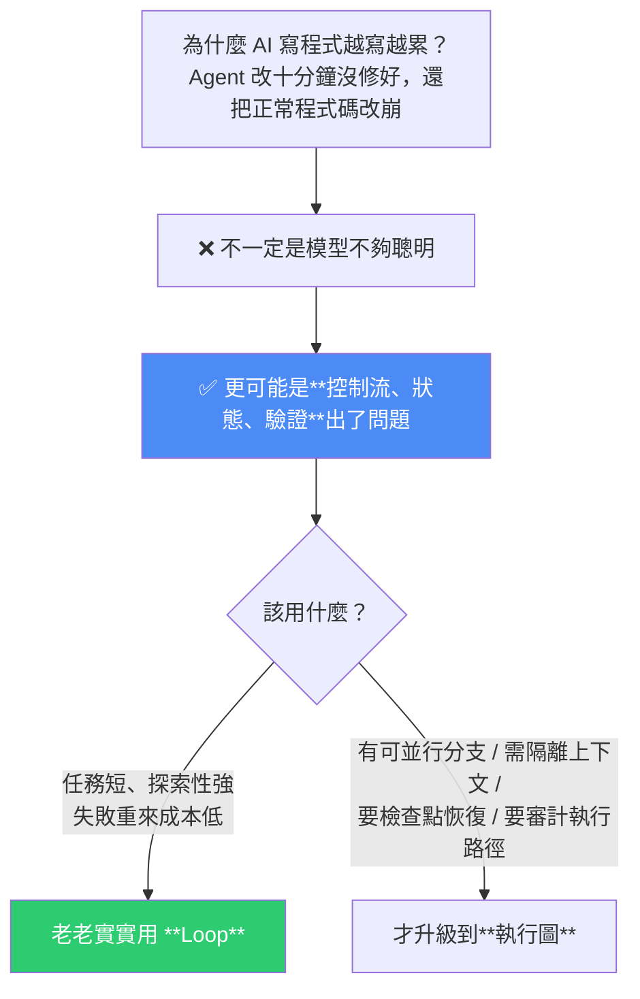
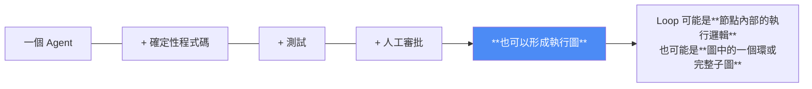
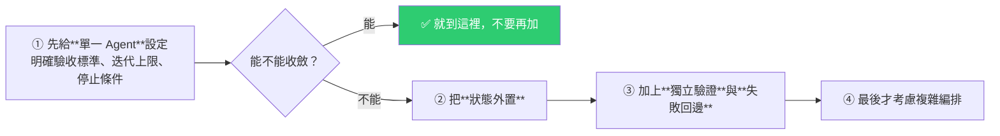
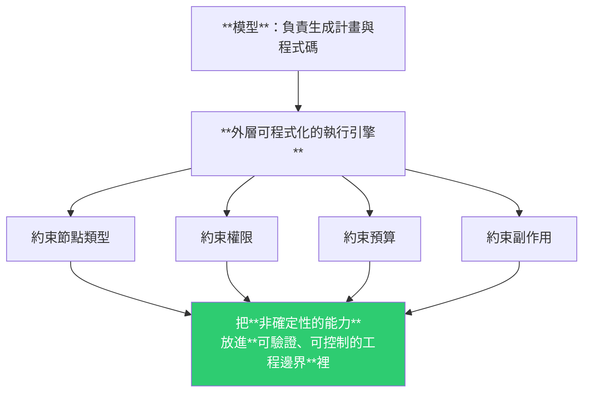

# 「Loop 已死,Graph 當立」?從工程視角看透這場名詞之爭

> 整理自 YouTube 頻道 **Why QQ(為什麼叫 QQ)**〈別再盲目追新詞!從工程視角看透 Loop 與 Graph 之爭〉(2026-08-01,約 7 分半,官方簡中字幕)。
>
> 核心結論一句話:**Loop 沒有死,它只是從「整個系統」變成「系統裡的一個局部結構」。**
>
> 而全片最該記住的一句警告是:**Graph 修不好錯誤的目標與評價標準——如果目標本身是偏的,Graph 只會讓你的系統更快、更有系統地做錯事。**

---

## 一句話總結



---

## 一、這場風波是怎麼引爆的(以及它的自嘲結局)

| 時間 | 事件 |
|---|---|
| 2026-07 | 開發者 **Peter Steinberger** 在 X 上問了一句:「我們還在談 Loop,還是已經轉向 Graph 了?」——**像把曼陀珠丟進可樂裡**,瞬間引爆技術圈焦慮 |
| 隨後 | **Hamel Husain** 發了一篇標題極具煽動性的文章〈Loop Engineering Is Dead, Enter Graph Engineering〉 |
| 點進去 | **內文只有一個句號**,外加一段「喬丹勸你停下來、找點幫助」的搞笑影片 |

> **這是對技術圈「名詞通膨」的一次無情嘲諷。** 每隔幾個月我們就發明一個新詞:Prompt Engineering → Context Engineering → Loop Engineering → 現在又來 Graph Engineering。

**但影片作者立刻做了兩個重要的澄清:**

1. **Peter 引爆了討論,但他不是概念首創者**——工作流圖、狀態機、DAG 早就存在。
2. ⚠️ **不能因為討厭新名詞就無視背後的工程挑戰**:多 Agent 編排、狀態持久化、並行與恢復,**這些確實是擺在面前的真問題**。

---

## 二、Loop 與 Graph 到底是什麼關係?

> **Graph Engineering 不是突然冒出來的新演算法,它是「系統複雜度上升後,對執行編排的一種新概括」。**

| | 關注什麼 |
|---|---|
| **Loop** | 怎麼讓**一個 Agent** 持續推進任務 |
| **Graph** | 當系統裡有**多個 Agent、確定性程式碼、驗證器,甚至人工審批**時,怎麼把它們組織成一個**可控制、可審計的執行網路** |

**它們不是誰取代誰的關係:**



影片並指出:Anthropic 在〈Building Effective Agents〉裡提到的**路由、並行、編排者–工作者**這幾種模式,**其實早就具備圖的結構了**。

---

## 三、為什麼很多簡陋的 Loop 會失控?

問題出在**「把聊天記錄當資料庫」**:所有歷史紀錄、工具呼叫結果、事實與錯誤,全都塞進一個越來越長的對話上下文裡。

> 影片的比喻很精準:**這就好比你把資料庫、日誌和業務邏輯全寫在同一個 TXT 檔裡。**

由此衍生的四個具體症狀:

| 症狀 | 說明 |
|---|---|
| **模型分不清事實與猜測** | 任務一長,它就搞不清楚哪些是驗證過的事實、哪些是自己編的 |
| **串行執行太慢** | 沒有並行的可能 |
| **一步失敗就整個重來** | 沒有檢查點 |
| **自我偏好與驗證盲區** | 讓同一個模型既生成又驗證,它在哪裡瞎了,驗證時往往還在同一個地方瞎 |

影片引用 **Dale Everett** 的評語:**很多 Agent 系統把一長串對話當成狀態資料庫,這簡直是一場災難。**

> 還有一句話很戳:**你除錯時是不是常常得翻幾百行對話記錄找哪一步出錯?——這根本不是在做工程,是在看小說。**

---

## 四、比較有共識的三個工程做法

### ① 把狀態外置(別再拿聊天記錄當資料庫)

任務的**計畫、驗證過的事實、執行的檢查點**,都要變成**結構化資料**存起來。

> ⭐ **關鍵細節:狀態欄位應該有明確的「所有者」——模型不能隨便覆寫事實。**

### ② 明確節點與邊的契約:誰有權決定下一步?

**答案不一定是模型。**

> **涉及權限、預算與不可逆操作時,必須交給確定性的程式碼規則或人工審批。**

影片給的具體落地方式:

| 工具 | 做法 |
|---|---|
| **Claude Code** | 模型負責寫程式碼,但你可以用 **`/goal` 設定硬性完成條件**、用 **`/loop` 定期重複工作流** |
| **Cursor** | 直接給 Agent 設定**驗收標準**,或建立自訂命令 |
| 動態工作流 | **寫一個「驗證器節點」專門跑單元測試** |

### ③ 小心使用並行與循環

- **並行**能加速,但帶來**結果衝突**與**部分失敗**的處理問題。
- **循環**:驗證失敗時,**不要只叫 Agent「再試一次」**。

> ⭐ **回邊(back edge)必須攜帶:具體的失敗原因、證據,以及建議的修改範圍。**
>
> 否則它就會像無頭蒼蠅一樣,**在同一個錯誤上撞得頭破血流**。

📌 這跟本庫多篇完全一致:[[harness-loop-graph-troubleshooting-map]] 的「有界重試四要素」中那條「**每輪必須拿到的新證據**」、[[memharness-memory-reconstructed-not-replayed]] 的「重試要帶原文 + 上次失敗輸出 + 具體校驗錯誤」、[[reliable-structured-json-output-tool-use]] 的「帶錯誤的重試」。**四篇不同來源指向同一條原則。**

---

## 五、⚠️ Graph 不是萬能藥:三個冷水

### 冷水一|Graph 修不好錯誤的目標與評價標準

> **如果你的系統目標本身就是偏的,或者驗證器依賴的是同一個有偏見的模型,那 Graph 只會讓你的系統「更快、更有系統地做錯事」。**

影片引用 **Carlos E. Perez** 的觀察:**局部循環可能高效地達成自己的指標,卻讓整體目標惡化。**

### 冷水二|「動態圖」的風險

有一種趨勢是讓模型自己生成工作流與拓撲結構。聽起來很酷,**但缺少足夠約束時**:

- 可能生成**無限分支**、瘋狂消耗 token;
- 甚至**繞過安全審批**。

> 比喻:**這就像讓一個新手司機去設計高速公路。**

### 冷水三|不要為了畫圖而畫圖

> **工程的本質是解決問題,不是堆砌複雜度。**

---

## 六、什麼時候該從 Loop 升級?(可直接照做的判準)

| 情況 | 該用什麼 |
|---|---|
| 任務**短**、**探索性強**、失敗重來成本不高 | **老老實實用 Loop** |
| 有**可並行的分支** / 需要**不同 Agent 隔離上下文** / 必須有**檢查點恢復** / 需要**準確審計執行路徑** | 這時候更好的執行編排,**收益才大於它增加的複雜度** |

### 一個務實的升級順序(這段最實用)



---

## 七、工業級 Agent 系統會長什麼樣:模型提議,執行時約束

> **絕對不會是模型在裡面隨意狂奔。**



影片認為 **Anthropic 的 Dynamic Workflows 已經展示了這個方向**:執行 JavaScript 工作流、協調子 Agent、支援恢復與並行。

> **我們需要的是「可控的智能」,不是「失控的黑盒」。**

---

## 八、應用案例

### 案例 1|下次 Agent 失控時,先查這三件事而不是換模型

影片開頭那個問題最有價值:**「Agent 改了十分鐘沒修好還把好的改崩」——這不一定是模型不夠聰明。**

排查順序:

1. **控制流** —— 是誰在決定下一步?如果全交給模型,涉及不可逆操作時就該收回。
2. **狀態** —— 你是不是把聊天記錄當資料庫了?驗證過的事實有沒有被結構化存起來、有沒有明確所有者?
3. **驗證** —— 是不是同一個模型既生成又驗證?

📌 這正好對應本庫 [[harness-loop-graph-troubleshooting-map]] 的三層排障(環境 / 反饋 / 流程),兩篇可以當成同一套診斷流程的粗細兩版。

### 案例 2|今天就把「狀態所有者」這條規則寫進你的 agent

**最小可行做法**:在專案裡開一個結構化的狀態檔(JSON / YAML / Markdown 表格皆可),明確區分:

```
verified_facts:   # 只有程式碼或人可以寫，模型只能讀
  - 資料庫 schema 是 X
  - API 回傳格式是 Y
model_hypotheses: # 模型可以寫
  - 猜測問題可能出在 Z
checkpoints:      # 每完成一個階段就寫一筆
```

**光是「模型不能覆寫已驗證事實」這一條,就能擋掉一大類「越修越錯」的情況。**

### 案例 3|把回邊(retry)升級成帶證據的回邊

翻出你所有的重試邏輯,檢查是否只是「再跑一次」。改成必須攜帶:**失敗原因 + 證據 + 建議修改範圍**。

這是本庫目前出現頻率最高的一條共識(四篇不同來源都提到),**投報率極高且不需要任何新框架**。

### 案例 4|用「先單 Agent 收斂,不行再升級」的順序,避免過早複雜化

實務上很多人是反過來的:一開始就上 LangGraph 之類的編排框架,結果**在單一 Agent 都還沒穩定的情況下,把錯誤放大到整張圖**。

照影片的順序:**先給單 Agent 明確驗收標準 + 迭代上限 + 停止條件** → 收斂就到此為止。

📌 這跟本庫 [[graph-engineering-explained-euler-to-agents]] 的判準完全互補:那篇問「**你的瓶頸是節點還是邊?**」——瓶頸在節點時上圖只會把錯誤放大 100 倍。**兩篇合起來就是完整的選型指南。**

### 案例 5|警惕「動態圖」的成本失控

如果你打算讓模型自己生成工作流(這正是本庫 [[graph-engineering-explained-euler-to-agents]] 描述的 Claude Code deep research 做法——當場寫 427 行 JS 展開 108 個 agent),**務必配上約束**:最大分支數、最大 agent 數、token 預算上限、以及「不可繞過的審批節點」。

**否則「無限分支 + 繞過審批」不是理論風險,是必然會發生的事。**

### 案例 6|本倉庫的自我檢視

用本片的三個判準看我們的四個 cron:

| 判準 | 現況 |
|---|---|
| **控制流** | ✅ 完全由確定性規則決定(grep exit code 判去重、無新內容就不 commit),**不是模型在決定下一步** |
| **狀態** | ⚠️ 部分——`SCHEDULES.md` 與 git 歷史算是外置狀態,**但單次執行內沒有結構化狀態檔** |
| **驗證** | ❌ 缺——寫完筆記沒有任何自動校驗(wiki-link 是否存在、badge 數字是否對) |
| **要不要上圖?** | ❌ **不要**。任務短、無並行分支、失敗重來成本低 → **Loop 就是對的形狀** |

---

## 重點回顧(TL;DR)

- **這場爭論的引爆點**:Peter Steinberger 在 X 的一句提問 + Hamel Husain 那篇**內文只有一個句號**的〈Loop Engineering Is Dead〉——**對名詞通膨的無情嘲諷**。
- **但別因為討厭新名詞就無視真問題**:多 Agent 編排、狀態持久化、並行、恢復都是實際挑戰。
- **Loop 與 Graph 不是取代關係**:Loop 關注「一個 Agent 怎麼推進」,Graph 關注「多個 Agent + 程式碼 + 驗證器 + 人工審批怎麼組成可控可審計的網路」;**Loop 可以是圖中節點的內部邏輯,也可以是一個環或子圖**。
- **⭐ 簡陋 Loop 失控的根因:把聊天記錄當資料庫**(等於把資料庫、日誌、業務邏輯全寫進一個 TXT)→ 分不清事實與猜測、串行太慢、一步失敗全部重來、自我驗證盲區。**「除錯要翻幾百行對話 → 這不是做工程,是看小說。」**
- **三個共識做法**:①**狀態外置**且**欄位要有所有者,模型不能覆寫事實** ②**明確誰有權決定下一步**——涉及權限/預算/不可逆操作必須交給確定性規則或人工 ③**並行小心衝突與部分失敗;回邊必須帶失敗原因、證據與建議修改範圍**。
- **⚠️ 三個冷水**:**Graph 修不好錯誤的目標與評價標準**(目標偏了只會更快更有系統地做錯事;局部循環達標卻讓整體惡化);**動態圖缺約束會無限分支、燒 token、繞過審批**(讓新手司機設計高速公路);**不要為了畫圖而畫圖**。
- **升級判準**:任務短、探索性強、重來便宜 → **用 Loop**;有並行分支 / 要隔離上下文 / 要檢查點恢復 / 要審計路徑 → 才值得。
- **務實順序**:單 Agent 明確驗收標準 + 迭代上限 + 停止條件 → 不收斂 → 狀態外置 → 獨立驗證 + 失敗回邊 → **最後才考慮複雜編排**。
- **方向**:**模型提議、執行時約束**——外層可程式化引擎約束節點類型/權限/預算/副作用,**把非確定性能力放進可驗證的工程邊界**。要的是**可控的智能,不是失控的黑盒**。
- **⭐ 結論:Loop 沒死,它只是從整個系統變成系統裡的一個局部結構。**

---

## 來源

- Why QQ(為什麼叫 QQ,YouTube),〈別再盲目追新詞!從工程視角看透 Loop 與 Graph 之爭〉(2026-08-01,約 7 分半):<https://youtu.be/dECosPI6SUc>
  - 本文依該片**官方簡體中文字幕**整理並轉寫為繁體中文(非 Whisper 轉錄)。
  - 片中引用:Peter Steinberger 的 X 貼文、Hamel Husain〈Loop Engineering Is Dead, Enter Graph Engineering〉、Dale Everett 對「把對話當狀態資料庫」的批評、Carlos E. Perez 對「局部循環最佳化傷害整體目標」的觀察、Anthropic 的〈Building Effective Agents〉與 Dynamic Workflows。**上述引述均為影片轉述,本文未逐一查核原文。**
- 延伸(本庫):[Graph Engineering 八分鐘:從柯尼斯堡七橋到 108 個 agent 的 DAG](./graph-engineering-explained-euler-to-agents.md)(**瓶頸在節點還是邊?**——與本篇互補的選型判準) · [Harness/Loop/Graph 三層排障地圖](./harness-loop-graph-troubleshooting-map.md)(同一作者) · [Loop Engineering 實務](./loop-engineering-when-and-how-gary-chen.md) · [Claude Dynamic Workflows](./claude-dynamic-workflows.md) · [MemHarness:記憶是重建不是重播](../memory-retrieval/memharness-memory-reconstructed-not-replayed.md) · [結構化 JSON 輸出的四道鎖](./reliable-structured-json-output-tool-use.md)
