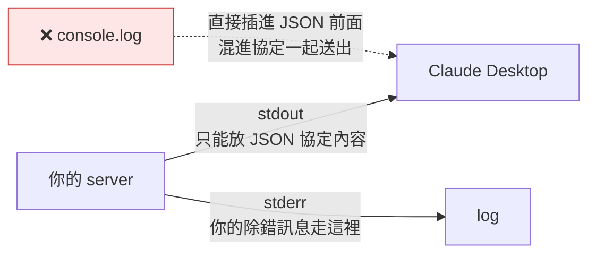

# 照新標準手寫第一個 MCP Server:四個坑,其中兩個不會報錯

**主題分類:** AI Agent / 基礎 —— MCP Server 實作
**來源影片:** YouTube〈官方新版 MCP Server 開發指南:我實測 5 分鐘從零接入 Claude,新手必看〉(YAHA学堂,2026-08-27,約 5.9 分鐘,**官方 zh-CN 字幕**)
**整理日期:** 2026-08-30

> 📎 這是本庫 MCP 系列的**第三塊**:
> - [[mcp-2026-07-28-stateless-rewrite]] —— 規格改了什麼、為什麼改
> - [[mcp-stateless-migration-guide]] —— 既有服務怎麼遷移、有哪些風險
> - **本篇** —— 從零寫一個新標準的 server,實作上會卡在哪裡
>
> ⭐ 影片最核心的主張(套件名選錯)**已直接查 npm registry 核實**,結論與影片說法不完全一致,見 §2。

---

## 0. 一句話總結

> **四個坑裡有兩個不會報錯 —— 那兩個才是真正花你時間的。**

會報錯的兩個(`import` 語法、`exports is not defined`)雖然錯誤訊息看起來莫名其妙,至少你知道出事了;
**不會報錯的兩個(套件名選錯、`console.log` 污染協定)會讓你以為一切正常,然後在 Claude 那端無聲失敗。**

---

## 1. 坑一:`import` 報錯 —— 改 `package.json` 一個值就好

現象:寫了一行 `import`,執行直接報錯。

> ⚠️ 影片特別提醒:**這個錯去搜,會搜到一堆叫你改 webpack、改 babel 的答案,全都不對。**

真正的原因是 Node 不知道你要用哪種模組語法:

| 值 | 意義 |
|---|---|
| `"type": "commonjs"` | 老寫法,用 `require` |
| `"type": "module"` | 告訴 Node:這個專案的 `.js` 都用 `import` |

改掉這一個值就解決了。報錯的本質是**兩邊語法對不上**,跟打包工具無關。

---

## 2. ⭐⭐ 坑二:套件名 —— 影片最重要的主張,但需要修正

影片的說法是:

> 正確的套件名是 `@modelcontextprotocol/server`。你現在去問 AI 或搜 MCP 教程,
> **十篇有九篇給你的是 `@modelcontextprotocol/sdk`,那是 v1 的包,即將淘汰。**

### 查 npm registry 的實際結果

| 套件 | 最新版 | 首次發布 | 最近發布 | npm 標記 deprecated? |
|---|---|---|---|---|
| `@modelcontextprotocol/sdk` | **1.30.0** | 2024-11-11 | **2026-07-27** | **否** |
| `@modelcontextprotocol/server` | **2.0.0** | 2026-04-01 | **2026-07-27** | 否 |

**核實結論分兩半:**

- ✅ **影片說對的部分:** `@modelcontextprotocol/server` 確實存在,是**版號來到 2.0 的 server 套件**
  (描述為「Model Context Protocol implementation for TypeScript - **Server package**」),
  且它 2026-04-01 才問世 —— 這確實解釋了為什麼舊教程與 AI 的訓練資料裡幾乎都是另一個。

- ⚠️ **需要修正的部分:「即將淘汰」是影片的判斷,不是 npm 上的事實。**
  `@modelcontextprotocol/sdk` **沒有被標記 deprecated**,而且**兩個套件的最新版是同一天(2026-07-27)發布的**。
  同日發版通常代表**並行維護**,而不是其中一個正在退場。

> ⭐ 順帶一個時間線上的觀察:`server` 2.0.0 與 `sdk` 1.30.0 都發布於 **2026-07-27**,
> 而 MCP 那次規格大改版是 **2026-07-28** —— 剛好是前一天。
> 也就是說,**影片講的「新標準」正是 [[mcp-2026-07-28-stateless-rewrite]] 那次無狀態化改版**,
> 兩篇筆記講的是同一件事的規格面與實作面。

**實務建議:** 選套件時**不要只信教程或 AI**(它們的知識截止日往往在 2026-04 之前),
自己去 npm 看一眼 `dist-tags` 與最近發布日期,30 秒就能確認。

---

## 3. 坑三:`console.log` 會直接污染協定

這是四個坑裡最隱蔽、後果最直接的一個。

MCP server 用 **stdio**(標準輸入輸出)跟客戶端溝通 —— **不開網路埠,靠命令列一進一出**。
這代表 **stdout 是協定專用通道**。



影片實測畫面很直觀:**那句 `console.log` 直接插到 JSON 前面,混進協定內容一起送出去了。**

> **規則:server 裡要印東西一律用 `console.error`(走 stderr),絕不能用 `console.log`。**
> 這個地方最容易順手打錯,而且**不會報錯**。

---

## 4. 坑四:`tsconfig` 兩行寫錯 → `exports is not defined`

只有兩個欄位要注意,**兩個都寫 `Node16`**:

```jsonc
{
  "compilerOptions": {
    "module": "Node16",
    "moduleResolution": "Node16"
  }
}
```

很多舊教程寫的是 `CommonJS`,實際跑起來會直接炸,而且報的是:

```
exports is not defined
```

> ⚠️ **這個錯誤訊息跟你改的那一行看起來八竿子打不著** —— 不知道這回事的人會卡很久。

編譯成功的訊號是**沒有輸出**(TypeScript 編譯過了不會誇你),看 `index.js` 有沒有生出來即可。

---

## 5. 實作要點:整個 server 只有十幾行

### 兩個容易漏的細節

1. **`serveStdio` 不是從主套件出來的,要多寫一層 `/stdio`。**
2. **`capabilities` 宣告這個 server 提供哪些能力** —— 只做工具就寫 `tools`。

### `registerTool` 收三樣東西

| 項目 | 說明 |
|---|---|
| 名稱 | 工具叫什麼 |
| **描述** | **這個工具是幹嘛的** —— 見下方,這是最關鍵的一行 |
| 邏輯 | 真正要跑的程式 |

參數宣告時,**宣告的名稱與接住的名稱必須一致**;參數說明那一句同樣是寫給模型看的。

### ⭐⭐ 描述那一行不是註解,是給模型讀的

> **Claude 要不要呼叫這個工具,就是讀這句話決定的。**

影片做了一個很有說服力的對照實驗:**只改描述那一行,其他都不動,重新編譯後問同一句話** ——
Claude **直接自己回答了,完全沒有呼叫工具,連授權確認框都沒出現**。

> ⚠️ 附帶一個容易忘的操作:**光改原始碼沒用,一定要重新編譯。**

---

## 6. 接進 Claude Desktop

編輯設定檔(Edit Config),填入:

- `command`:`node`
- `args`:**index.js 的絕對路徑**

> ⚠️ **一定要用絕對路徑,而且要接到 `index.js`,不是只到專案資料夾。** 寫相對路徑 Claude Desktop 找不到。

重啟後:加號圖示 → **Connectors** → **Manage connectors**,就會看到你的 server,
類型標示為 **Desktop**、旁邊掛著 **Local dev**(本地開發中)。點進去能看到底下掛的工具。

右邊那個「需要批准」的設定,意思是 **Claude 每次要用這個工具都得先問過你** —— 對話時會跳出授權框。

### 新規範的兩個欄位

影片開頭示範用命令列直接呼叫 server 時,特別點出回應裡的 **`resultType`** 與 **`_meta`** 兩個欄位
—— **只有新規範才有**,可以用來快速判斷你接的到底是新版還是舊版。

> 命令列驗證時可以在結尾接 `jq` 格式化 JSON;不加也能跑,只是輸出會擠成一坨。

---

## 7. 應用案例

### 案例 A|30 秒判斷一份 MCP 教程是不是過時的

打開任何一篇教程或 AI 給你的程式碼,只看三個地方:

| 檢查點 | 過時的樣子 | 現在的樣子 |
|---|---|---|
| 套件名 | `@modelcontextprotocol/sdk` | `@modelcontextprotocol/server`(2.x) |
| `tsconfig` | `"module": "CommonJS"` | `"module": "Node16"` + 同值的 `moduleResolution` |
| 回應欄位 | 沒有 `resultType` / `_meta` | 兩個都有 |

三個都中就別照抄了。

### 案例 B|server 明明啟動了,Claude 卻連不上

依序排除,由快到慢:

1. **路徑** —— `args` 是不是絕對路徑?有沒有接到 `index.js`?
2. **stdout 有沒有被污染** —— 全域搜尋 `console.log`,一律改成 `console.error`。
3. **有沒有重新編譯** —— 改了 `.ts` 沒 `tsc`,跑的還是舊的 `index.js`。

### 案例 C|工具接上了,但 Claude 就是不用它

先別懷疑程式碼 —— **去看 `registerTool` 的描述那一行**。

模型是靠那句話決定要不要呼叫的。寫得含糊(例如「處理資料」)它就不會用;
把使用時機講清楚(什麼情況下該呼叫、輸入是什麼)命中率才會上來。
用 §5 的方法自己做一次 A/B:只改描述、重新編譯、問同一句話。

---

## 8. 重點回顧

1. `package.json` 的 `"type"` 要是 `"module"` —— 報錯與 webpack/babel 無關。
2. ⭐ 套件名用 **`@modelcontextprotocol/server`**;但**「`sdk` 即將淘汰」是影片判斷,npm 上未標 deprecated,兩者同日發版**。
3. ⭐ server 裡**只能用 `console.error`**,`console.log` 會把訊息混進 stdio 協定。
4. `tsconfig` 的 `module` 與 `moduleResolution` **都寫 `Node16`**,否則報 `exports is not defined`。
5. `serveStdio` 要從 `/stdio` 子路徑匯入。
6. ⭐ **`registerTool` 的描述是寫給模型看的**,改一行就能讓 Claude 完全不呼叫工具。
7. Claude Desktop 的 `args` 必須是**絕對路徑且指到 `index.js`**。
8. 新規範的辨識特徵:回應含 **`resultType`** 與 **`_meta`**。

---

## 來源

- [官方新版 MCP Server 開發指南:我實測 5 分鐘從零接入 Claude,新手必看 — YAHA学堂](https://www.youtube.com/watch?v=-C6K3wtjjoI)(2026-08-27,約 5.9 分鐘,**官方 zh-CN 字幕**,無轉錄誤差問題)
- 核實用資料:
  - [npm registry — `@modelcontextprotocol/server`](https://www.npmjs.com/package/@modelcontextprotocol/server)(latest 2.0.0,2026-04-01 首發)
  - [npm registry — `@modelcontextprotocol/sdk`](https://www.npmjs.com/package/@modelcontextprotocol/sdk)(latest 1.30.0,**未標記 deprecated**,與 server 2.0.0 同於 2026-07-27 發布)
- 本倉庫相關筆記:[[mcp-2026-07-28-stateless-rewrite]]、[[mcp-stateless-migration-guide]]、[[mcp-stateless-deployment-ops-view]]

> ⚠️ 套件版本與生態變動快速。文中版號為 **2026-08-30 查詢 npm registry 的結果**,
> 動手前請自行以 `npm view <package> dist-tags` 再確認一次。
