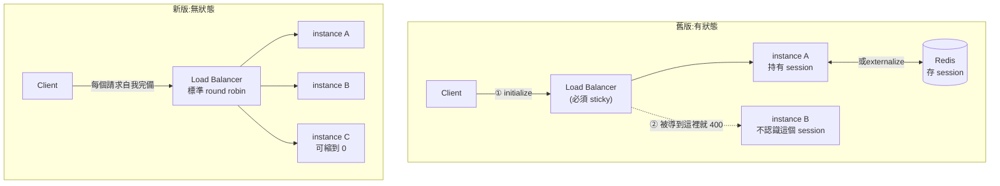
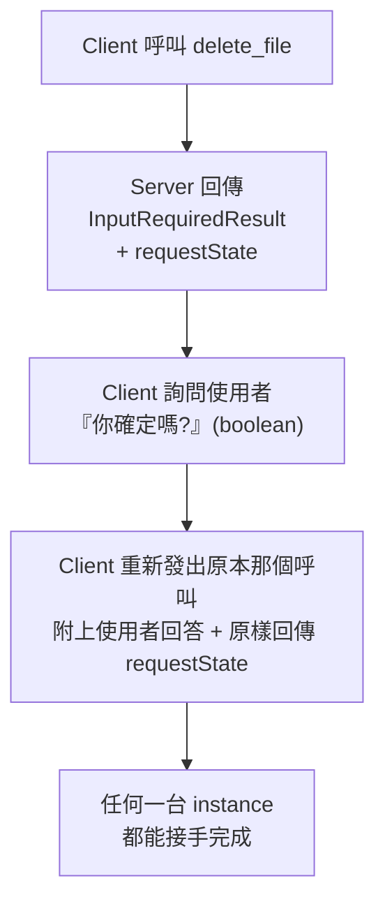

# MCP 無狀態化的維運視角:砍掉 Redis、恢復 round robin、伺服器能縮到零

> 來源:Better Stack《MCP Was Wrong From The Start (They Just Fixed It)》(2026-08-08,約 7 分鐘)。
> Better Stack 是做 observability 的公司,所以這支的切入點跟前兩篇都不同——**它談的不是協定條文,是這次改版在部署拓樸與雲端帳單上長什麼樣**。

> 📎 同主題另兩篇,建議搭配看:
> - [[mcp-2026-07-28-stateless-rewrite]] —— 官方 changelog 逐條核實、9 項 Major 改動、三個功能的退場公告(**協定條文視角**)
> - [[mcp-stateless-migration-guide]] —— 十分鐘自查、三個真正危險的點、「狀態在哪裡責任就在哪裡」(**遷移風險視角**)
> 本篇只補這兩篇沒有的東西:**SEP 編號對照、兩個新 HTTP header 對基礎建設的意義、scale-to-zero 的部署經濟學**。

---

## 一句話總結

**MCP 從「有狀態協定」變回「普通 HTTP API」,於是所有既有的 HTTP 基礎建設(負載平衡器、閘道、快取、防火牆)重新變得可用——而你原本為了撐住 session 而多養的那些東西,可以關掉了。**

---

## 一、舊版的痛,是一個**基礎建設**問題,不是協定美感問題

舊流程:

1. Client 打 `initialize` 到你的 MCP endpoint
2. Server 產生一個 session ID 回傳
3. **之後每一個請求都必須帶著這個 session ID**

第 3 步就是災難的根源:**session ID 把 client 釘死在「當初發出這個 ID 的那一台 instance」上**。

於是這兩個再普通不過的營運場景都會爆:

| 場景 | 結果 |
|---|---|
| 你把 MCP server 擴到 3 個 instance,前面掛負載平衡器 | 下一個請求被導到另一台,那台從沒聽過這個 session ⇒ **400 session not found** |
| 其中一個 pod 掛掉 / 被重啟 | session 狀態直接消失,**之後每一個請求都失敗** |

也就是說:**你根本沒辦法用最標準的水平擴展方式去跑一個 MCP server。**

### 兩種 workaround,兩種帳單

當然有解,但兩個都在付「協定有狀態」的稅:

**① Sticky session(黏著式路由)**
讓同一個 client 永遠打到同一台。
代價:負載會不均;那台掛了就全掛;而且 scale in 時你不敢隨便砍 pod,因為上面掛著活的 session。

**② 共用 Redis**
把 session 存到外部,任何 instance 都查得到。
代價:**多養一個 Redis**(錢)、每個請求多一趟網路往返(延遲)、多一個會壞掉的元件(可用性)。

> 講者的評語很直白:這兩個都是**不必要的複雜度**,而且同時付出延遲與成本。

---

## 二、新規格砍了什麼:兩個 SEP

MCP 的版本號就是日期,這次是 **2026-07-28**。核心是兩個提案:

| SEP | 做的事 |
|---|---|
| **SEP-2575** | 移除 `initialize` / `initialized` 握手 |
| **SEP-2567** | 移除 `Mcp-Session-Id` header,以及隨之而來的**協定層 session** |

合起來的效果:**握手消失,從協定層看,每一個請求都完全獨立。**

一次 tool call 的程式碼,從「先 initialize、拿 session、之後每次都帶 header」變成**一個自我完備的請求**。



### 直接兌現的三件事

1. **標準 round robin 回來了。** 任何容器都能處理任何請求,用最普通的負載平衡器就好。
2. **Redis 可以關掉。** 不需要一台機器專門坐在那裡替你保管 session。
3. **崩潰是無感的。** server 掛掉或重啟,負載平衡器把請求丟給下一台可用的,**client 完全不會察覺**。

---

## 三、講者認為最大的好處:**伺服器可以縮到零**

這點前兩篇都沒展開,但對成本影響最直接。

因為**沒有連線需要保持開啟**,MCP server 不再需要 24/7 活著。部署在 Cloudflare Workers、Google Cloud Run 這類平台上,**沒人用的時候可以縮到 0 個 instance**。

Cloudflare 自己在相關文章中的說法是:**MCP 不再需要 Durable Objects 才能講這個協定。**

> Durable Objects 是 Cloudflare 用來提供「有狀態、單一實例、可定址」能力的機制——正好就是為了滿足舊版 MCP 那種「必須回到同一個實例」的需求。現在需求消失了,這層依賴也跟著消失。

**新規格本質上就是「跑在普通 HTTP 基礎建設上的 MCP」**,而普通 HTTP 基礎建設是所有人都已經會操作的東西。

---

## 四、兩個新 HTTP header:讓閘道不用拆 JSON 就能做決策

這是本篇最值得單獨記住的一點,前兩篇完全沒提。

**舊版:所有 MCP 資訊都藏在請求的 JSON body 裡。**

這對 L7 基礎建設是個惡夢——你的 API Gateway、rate limiter、WAF 想知道「這個請求在做什麼」,**必須把整個 JSON body 解出來看**。而 body 解析在閘道層是昂貴且危險的操作。

**新版:多了兩個 HTTP header(由 SEP-2243 在 Streamable HTTP transport 中強制要求):**

| Header | 內容 |
|---|---|
| `Mcp-Method` | 這個請求在做什麼操作(用於路由,不必檢視 body) |
| `Mcp-Name` | 被存取的資源名稱 |

(另外還有 `MCP-Protocol-Version` 帶協定版本,例如 `2026-07-28`。)

於是:**閘道、rate limiter、防火牆都能只看 header 就做決策**,不必碰 body。少一次解析,少一份延遲,也少一個攻擊面。

### 以及快取提示:`ttlMs` 與 `cacheScope`

由 **SEP-2549** 加入,明擺著是照 HTTP 的 `Cache-Control` 抄的,套用在 tool / prompt / resource 的 list 呼叫上:

| 欄位 | 意思 |
|---|---|
| `ttlMs` | 這份清單新鮮多久 |
| `cacheScope` | 跨使用者共用這份快取安不安全 |

意義:**client 不再需要一條長連線來「保持同步」**。它知道清單能放多久,到期再問一次就好。

⚠️ 但 `cacheScope` 正是 [[mcp-stateless-migration-guide]] 裡點名的踩雷點之一——設錯等於跨使用者洩漏。**這個欄位是效能與資安的交界,不要隨手填。**

---

## 五、握手資訊搬去哪了?

握手裡的資訊本身不是垃圾——server 仍然需要知道你用哪個協定版本、你的 client 有什麼能力。它現在:

- **搭便車放在單一請求 JSON 裡的 `_meta` 欄位**。server 直接讀就知道 client 能做什麼。
- 反方向則新增了一個**可選的 `server/discover` 方法**,讓 client 查 server 的能力。

注意這個反轉:**能力交換從「連線開始時強制雙向握手」變成「需要時各自查詢」**。

---

## 六、那我如果真的需要狀態呢?

答案簡單到有點好笑:**跟 HTTP API 這幾十年來的做法一樣。**

讓某個 tool **鑄造一個明確的句柄(explicit handle)**——例如 `basketId`、`browserId`——之後模型把它當成**普通的參數**帶在後續的 tool call 裡。

於是狀態怎麼管**完全由你決定,不再由協定決定**,彈性大得多。

⚠️ 但這也正是責任的轉移點。[[mcp-stateless-migration-guide]] 裡那條鐵律要一起記:**持有句柄 ≠ 有權使用**。協定不再幫你綁定身分,授權檢查得你自己每次做。授權機制本身在這次改版中有大幅強化。

---

## 七、沒有長連線,server 怎麼反問「你確定嗎?」

舊做法需要一條**常開的串流**把訊息推給 client。這不只是技術負擔,還是個體驗與安全問題:**使用者可能在沒有發起任何操作的情況下,突然被彈出一個提示。**

新規格把這套流程重建成 **Multi Round-Trip Request**(SEP-2322),而且 SEP-2260 進一步限制:**server 發起的請求只能發生在「正在處理 client 請求」的期間內**。

流程(以「刪除雲端檔案」的 tool 為例):



關鍵在 **`requestState`**:它是**那次呼叫的完整上下文序列化後的結果**。因為所有續作所需的資訊都被 client 原樣帶回來了,**負載平衡器後面的任何一台 instance 都能接手重試,不必是當初發問的那一台**。

> **這才是 round robin 真正能成立的原因。** 光是刪掉 session ID 不夠——你必須讓「需要多輪往返的互動」也不依附特定 instance,無狀態才是真的無狀態。

⚠️ 代價見 [[mcp-stateless-migration-guide]]:`requestState` 從 server 手中的記憶體變成**經過 client 往返的、攻擊者可控的輸入**,必須簽章或加密後驗證,不能直接信任。

---

## 八、那很久才跑完的工作呢?Tasks 正式化

你不會希望一個跑很久的 tool call 一直佔著連線、把整段對話卡住。所以 **Tasks 從 experimental 升格為官方擴充**。

以「處理退款」這種慢任務為例:

1. 把任務狀態寫進資料庫,標記為 `working`
2. 觸發非同步工作
3. **立刻回傳**一個回應,告訴 agent 與使用者「正在跑」
4. Client 之後用 **`task/get` 輪詢**,或用**訂閱**追蹤進度,完成時把結果撈回來

注意這裡的模式跟前面完全一致:**狀態被明確地放進你自己的資料庫,並用一個 ID 在無狀態的請求之間傳遞。** 整份新規格反覆在做同一件事。

---

## 九、升級的現實

- **所有被廢棄的功能至少有 12 個月的緩衝期**才會正式移除。時間還夠。
- **所有 SDK 都已支援新規格**,大多數直接跳 **major 版本 v2**。
- **TypeScript SDK 把單體套件拆成模組化的兩包**:server 一包、client 一包。
- 官方提供 **codemod**,自動處理標準的 API 改名。

講者的結論很誠實:**「這不會是『更新套件然後就沒事了』的那種升級」**,但這些改動都值得做,因為它感覺像是 MCP 的一次重置——**用一開始就該用的方式重做一次**。

⚠️ 補一句 [[mcp-stateless-migration-guide]] 的提醒:**升級 SDK ≠ 啟用新協議**。這兩件事是分開的,別以為 `npm update` 完就遷移完了。

---

## 應用案例

### 案例 1|拿這張表去砍你的基礎建設帳單

如果你有在跑自架的 MCP server,對照著看現在還需不需要:

| 你現在有 | 舊版為什麼需要 | 新版還需要嗎 |
|---|---|---|
| Redis / Memcached 專門存 session | 讓任何 instance 都查得到 session | **不需要**(除非你另有業務用途) |
| 負載平衡器的 sticky session 設定 | 把 client 釘在同一台 | **不需要**,改回 round robin |
| Cloudflare Durable Objects | 提供「回到同一個實例」的能力 | **不需要**(Cloudflare 官方說法) |
| 最小 instance 數 ≥ 1 | 有連線要保持開啟 | **可以設 0**,縮到零 |
| 常開的 SSE / 串流連線 | server 要能主動推送 | **不需要**,改用 Multi Round-Trip |

**動手前先確認一件事:你的 server 是否已經真的切到新協定,而不只是升了 SDK。** 順序搞反會把線上打掛。

### 案例 2|成本結構怎麼變

一個中低流量的內部 MCP server,舊版最省的合法配置大概是:

```
2 個 instance(不能只有 1,掛了 session 全滅)
+ 1 個 Redis
+ 負載平衡器 sticky 設定
= 三樣東西 24 小時開著
```

新版:

```
0~N 個 instance(閒置時 0)
+ 負載平衡器(本來就有)
= 沒人用的時候幾乎不計費
```

對「白天有人用、晚上沒人用」的內部工具,這是**帳單結構的改變,不是百分比的優化**。

### 案例 3|把 `Mcp-Method` / `Mcp-Name` 寫進閘道規則

這兩個 header 讓你可以在**不碰 body** 的前提下做治理。幾個立刻可做的:

- **分級限流**:對 `Mcp-Method` 是寫入類操作的請求給嚴格額度,唯讀類放寬。
- **路由分流**:把重型 method 導到專屬的 instance pool,不要跟輕量請求搶資源。
- **稽核日誌**:直接在 access log 記下這兩個 header,**你不用解析 body 就有了一份完整的 MCP 呼叫稽核軌跡**——對 observability 來說這是白撿的。
- **WAF 規則**:對特定 `Mcp-Name` 的資源直接在邊緣擋掉,不必進到應用層。

⚠️ 但別把它們當安全邊界:header 是 client 提供的,可以偽造。**它們適合用來做路由與觀測,不適合單獨用來做授權。** 授權仍然要在 server 端根據認證身分判斷。

### 案例 4|什麼時候你**仍然**需要外部狀態儲存

無狀態化砍掉的是「協定強迫你維護的 session」,不是「你的業務狀態」。以下情況 Redis / 資料庫還是要留:

- **長任務**:Tasks 擴充本身就要求你把任務狀態寫進資料庫。
- **業務句柄**:`basketId` 背後那個購物車總得存在某處。
- **速率限制計數器**:跨 instance 的配額仍需共用儲存。

差別在於:**現在這些是你自己的設計決策,而不是協定塞給你的義務。** 你可以按需求選型,而不是為了讓協定能跑而被迫養一台 Redis。

### 案例 5|三篇怎麼分工看

| 你的角色 | 先看哪篇 |
|---|---|
| 決定要不要導入 MCP / 想知道改了什麼 | [[mcp-2026-07-28-stateless-rewrite]] |
| 手上有 server 要遷移、怕踩雷 | [[mcp-stateless-migration-guide]] |
| 你是 SRE / 平台工程,要調整部署與閘道 | **本篇** |

---

## 重點回顧(TL;DR)

1. **SEP-2575 砍握手,SEP-2567 砍 session ID。** 每個請求從此完全獨立。
2. **舊版的痛是基礎建設的痛**:session 把 client 釘在單一 instance 上,導致標準負載平衡直接失效,只能付出 sticky session 或 Redis 的代價。
3. **最大的營運紅利是 scale to zero。** 沒有連線要保持,Cloudflare 明說 MCP 不再需要 Durable Objects。
4. **`Mcp-Method` / `Mcp-Name` 兩個 header(SEP-2243)** 讓閘道不必解 JSON 就能路由、限流、稽核——這是白撿的可觀測性。
5. **`ttlMs` / `cacheScope`(SEP-2549)** 照 HTTP 快取抄,讓 client 不必靠長連線保持同步。⚠️ `cacheScope` 設錯會跨使用者洩漏。
6. **握手資訊搬進 `_meta`**,反向查詢改用可選的 `server/discover`。
7. **要狀態就自己鑄造明確句柄**,像 HTTP API 幾十年來那樣。⚠️ 持有 ≠ 授權。
8. **Multi Round-Trip Request(SEP-2322)+ `requestState`** 讓多輪互動也不依附特定 instance——**這才是 round robin 真正成立的關鍵**,不只是刪掉 session ID 而已。
9. **Tasks 升格為官方擴充**:狀態寫 DB、立刻回應、之後用 `task/get` 或訂閱追蹤。
10. **12 個月緩衝期、SDK 全面 v2、TS SDK 拆成兩包 + 官方 codemod。** 但這不是「更新套件就沒事」的升級。

---

## 來源

- [MCP Was Wrong From The Start (They Just Fixed It) — Better Stack](https://www.youtube.com/watch?v=f4mI3d-nTrI)(2026-08-08)
- [MCP 2026-07-28 Release Candidate — 官方部落格](https://blog.modelcontextprotocol.io/posts/2026-07-28-release-candidate/)(SEP 編號、header 與快取欄位皆已對照此文核實)
- 本倉庫同主題筆記:[[mcp-2026-07-28-stateless-rewrite]]、[[mcp-stateless-migration-guide]]

> 該片無官方字幕,逐字稿以 YouTube 自動字幕取得,可能有少量聽寫誤差(字幕中的 "SCP" 實為 **SEP**、"Reddit" 實為 **Redis**;SEP 編號已對照官方 release 文核實)。
