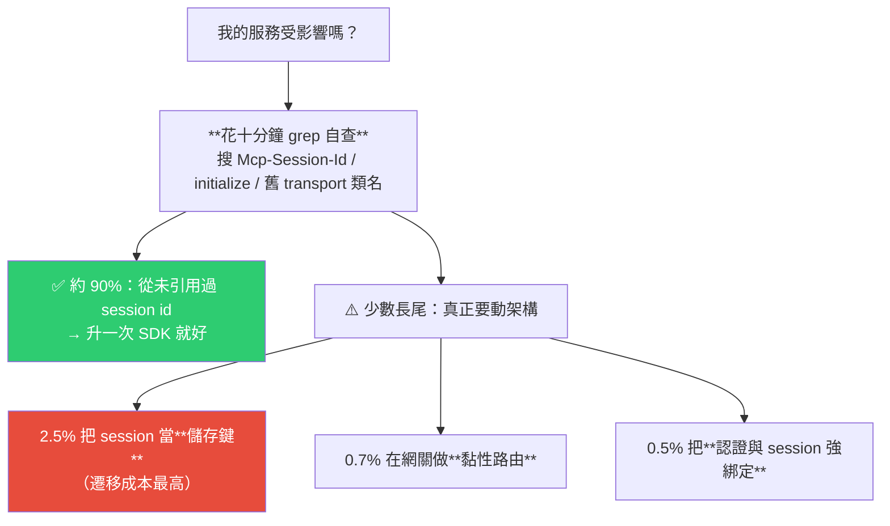
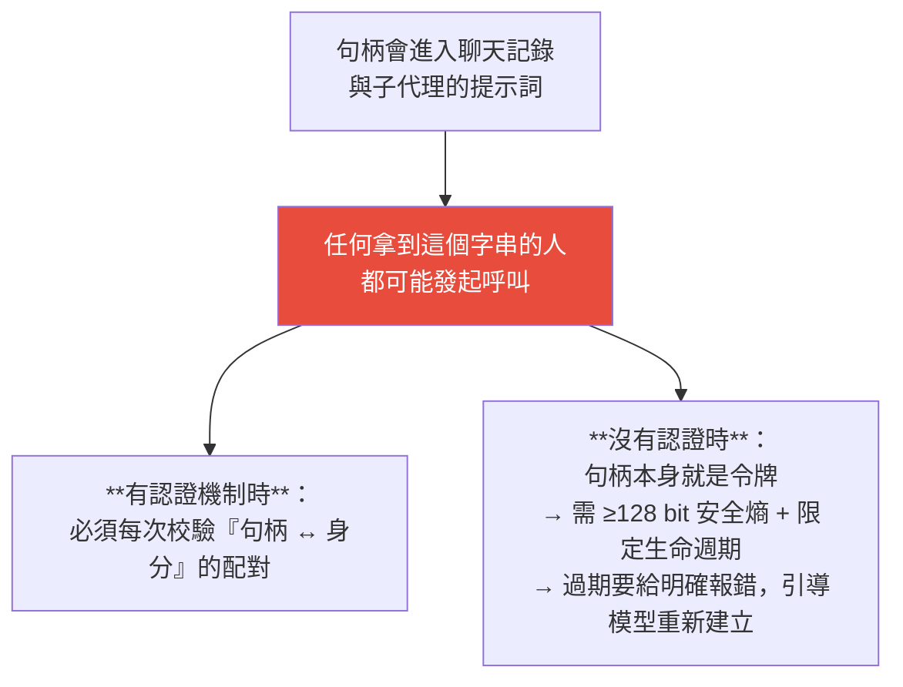
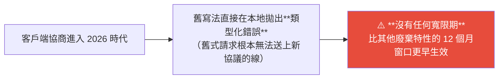
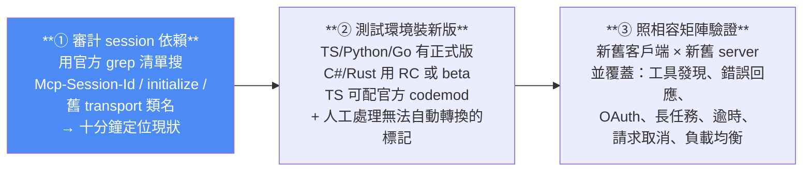
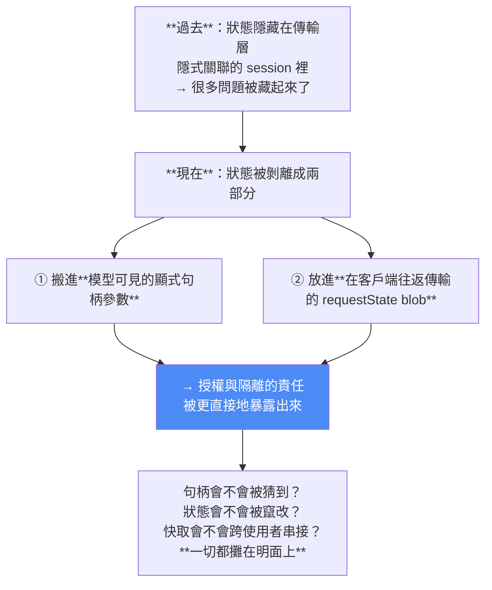

# MCP 無狀態化怎麼遷移:十分鐘自查、三個真正危險的點,與「狀態在哪裡,責任就在哪裡」

> 整理自 YouTube 頻道 **Why QQ(為什麼叫 QQ)**〈MCP 無狀態化背後的真正邏輯〉(2026-08-02,約 17 分鐘,官方簡中字幕)。
>
> 這是本庫 [[mcp-2026-07-28-stateless-rewrite]] 的**實務遷移篇**:那篇講「規格改了什麼、為什麼改」,**這篇回答工程師真正在意的三個問題——我的服務受不受影響、現在該做什麼、有哪些坑**。
>
> 若你是 SRE / 平台工程,要調的是部署拓樸與閘道規則,另見 [[mcp-stateless-deployment-ops-view]]。
>
> 最重要的結論先講:**「全員重寫」是誤讀。判斷標準只有一條——你的程式碼有沒有碰過 session。**

---

## 一句話總結

> **遷移代價呈「雙峰分布」:不是幾乎免費,就是要重構架構。中間地帶很少。**

---

## 一、影響面到底多大?官方對一千個開源 server 的調研

| 佔比 | 情況 | 要做什麼 |
|---|---|---|
| **90%** | **從未引用過 session id** | 升一次 SDK 即可 |
| 3.5% | 只有 SDK 路由樣板裡的 ID 映射表 | **新版傳輸層會自動消除** |
| 2.8% | 只設定了一個無效的產生器 | 刪掉一個建構參數 |
| **2.5%** | **把 session 當儲存鍵** | ⚠️ **遷移成本最高** |
| **0.7%** | 在網關層做黏性路由 | 需改架構 |
| **0.5%** | 認證與 session 強綁定 | 需改架構 |

> **把 session id 當儲存鍵在老專案裡屢見不鮮——當年圖省事的寫法,如今面臨最高昂的遷移成本。**

---

## 二、這次到底改了哪四項機制

| # | 改動 |
|---|---|
| 1 | **徹底移除握手**,版本與能力資訊直接嵌進每個請求(自描述) |
| 2 | **退役 `Mcp-Session-Id` header**,跨呼叫狀態改用**顯式句柄** |
| 3 | **取消 server 主動發起請求的能力**,反向請求改為 **MRTR(多輪往返)** |
| 4 | 取消 `ping`;能力發現改成一個叫 **`server/discover`** 的普通 RPC(server 必須支援) |

### 官方砍掉 session 的三個理由

1. **黏性會話阻礙水平擴展**,而且實例崩潰後得重新握手;
2. **各端自行管理狀態極易引發記憶體洩漏**;
3. **客戶端對 session 的語義理解從未統一**,斷線後也鮮少有恢復機制。

**新架構的實際好處:網關不必解析 body 就能路由、負載均衡可以直接輪詢。** 另外一個具體收益:以前工具清單會隨會話變化、每次連線都要重拉;**現在配合 `ttlMs` 與 `cacheScope`,多個代理可以複用快取,大幅減少重複的 `tools/list` 請求。**

### 版本協商的行為

不支援的版本會回 **`-32022`** 錯誤碼並附上支援版本清單,客戶端換個版本重試即可。

> 📌 這與官方 changelog 對得上(`UnsupportedProtocolVersion` 從 `-32004` 改號為 `-32022`),可交叉驗證。

### 改版的謹慎程度

光是 TypeScript 舊版 SDK 一週下載量就超過 **4,000 萬**,所以節奏拉得很長:**5/21 鎖定 RC、預留 10 週驗證期,7/28 才正式發布。**

**四個 Tier 1 SDK 的進度**(影片發布時):TS 與 Python 已升到 **v2**、Go 發布 **1.7 正式版**、C# 處於預發布、**Rust 還在 beta**。

---

## 三、狀態的新載體:顯式句柄(explicit handle)

官方用購物車舉例:建立購物車時回傳一個類似 `bsk_a1b2c3` 的 ID,後續所有加購、結帳都要帶著這個字串。

**它本質上就是一個普通的工具參數**——模型看得見,也能對它推理。協議本身並未強制規定句柄概念,**但這已是 GitHub PR 編號、Stripe 客戶 ID 這類主流遠端服務廣泛採用的設計模式。**

### ⚠️ 一條鐵律:持有 ≠ 授權

---

## 四、三個真正危險的點

### 危險點 ①|推送式互動「硬失敗」,而且沒有寬限期

過去 server 依賴 SSE 流反向發起請求來取得確認、sampling 或目錄。**新協議把這條通道物理性移除了。**

**替代方案就是 MRTR**:server 回一份問題清單 → 客戶端作答 → 帶著答案重新發起請求。

> **所有互動式工具都必須優先改用這種寫法,優先級高於所有其他廢棄遷移事項。來不及改就先把版本固定在舊時代。**

**MRTR 的細節**:`tools/call`、`prompts/get`、`resources/read` 這些方法名沒變,但**請求與結果結構新增了 `input_required`、`inputResponses`、`requestState` 欄位**;協議**沒有對輪數設上限**(TS SDK 預設提供十輪兜底)。

**另外要知道**:`roots` 與 `sampling` 已進入廢棄期,在 2026 時代的連線上 **MRTR 是唯一的通訊通道**——想繼續用也得先改寫法。**`sampling` 因安全原因被廢棄,但 `elicitation` 保留下來,並透過 MRTR 重獲新生。**

### 危險點 ②|`requestState` 是「攻擊者可控的敵意輸入」

`requestState` 讓 server 在 MRTR 中打包狀態,**客戶端必須在不查看、不修改的前提下逐位元組原樣回顯**。

> **但規範明確指出:由於這個 blob 要經過「可能被竄改或重放」的客戶端往返,它本質上是攻擊者可控的敵意輸入。**

**開發者必須做的事:**

| 措施 | 說明 |
|---|---|
| **完整性保護** | 用 HMAC 或 AEAD 加密封印,**驗簽失敗直接拒絕** |
| **嵌入認證主體資訊** | 確認這份狀態屬於誰 |
| **短 TTL** | ⚠️ **協議本身不提供逾時機制,逾時控制必須靠 TTL 自己實作** |

> ⚠️ **TS SDK 提供的封印工具「只是簽名而非加密」——絕對不要把機密資料放進去。**

### 危險點 ③|狀態安全的責任完全轉移到開發者身上

規範雖然要求 server 端驗證 `requestState`,**但各 SDK 的預設保護機制不一致**:

| SDK | 預設行為 |
|---|---|
| **Python** | **預設啟用封印** |
| **TypeScript** | 提供工具,**但需要顯式設定** |

而如果你自行設計業務句柄,**身分綁定、過期處理、防列舉全都要親力親為**。

> **實作品質的參差不齊,將直接決定業務安全邊界的穩固程度。**

**稽核清單要新增三項檢查:**
1. 句柄的安全熵是否足夠;
2. 防重放機制是否到位;
3. 句柄與身分的配對是否經過嚴格校驗。

---

## 五、社群的一手踩坑實錄(五個)

作者的篩選標準值得學:**只採納包含「報錯訊息 + 根因 + 解法」的 A 級實錄**,而不是情緒性評論。

| # | 坑 | 根因與解法 |
|---|---|---|
| 1 | **Lambda 第二次呼叫就崩** | 首次成功、熱呼叫報「manager 只能執行一次」。查 Mangum 原始碼後發現**它每次呼叫都會重新進入生命週期**。解法:**把 app 建構邏輯放進 handler 內部**,不要在模組層級建立全域實例 |
| 2 | **MRTR 破壞延遲統計** | `mcp snoop` 維護者發現一個實際耗時 6 秒的操作被記成兩次共 1 秒——**多輪重試導致 request ID 改變**,騙過了依賴 ID 關聯的工具,也丟失了人類作答所花的時間。**「錯誤的關聯比不關聯更具破壞性」** |
| 3 | **TS codemod 靜默失效** | 拿 `e.code === 401` 當鴨子型別判斷,**編譯得過但許多錯誤路徑抓不到**。官方建議改用類型化錯誤分支 |
| 4 | **Python httpx 2 的 TLS 問題** | TLS 校驗改用**系統信任庫**、不再依賴 certifi → **在缺乏系統 CA 的極簡容器裡突然握手失敗,而且沒有任何 import 錯誤提示** |
| 5 | **CIMD 精確匹配拒登** | metadata 裡的 `redirect_uris` **必須包含 port 且完全一致**。曾發生客戶端漏寫 port 被授權伺服器直接拒絕的互通性 bug,**這種靜默故障要到使用者嘗試登入才被察覺** |

**兩則有價值的遷移證詞:**
- Glama 的網關營運者指出:**大量 bug 的根源其實都在持久化狀態**。
- 提前數月完成遷移的開發者表示**可靠性提升、問題率下降**;另一個老專案移除黏性路由後**每個請求增加 15–30ms 延遲,但整體表現依然平穩**。

> 作者的提醒:這類**有明確報錯、版本號或原始碼行**的可驗證證詞,可以拿去團隊內部做決策說服;**但別輕信那些互相抄襲、虛構引語又夾帶廣告的 SEO 洗稿文。**

---

## 六、⚠️ 最容易誤會的一點:升級 SDK ≠ 啟用新協議

**這是兩個完全獨立的決策**,而且各 SDK 的預設行為不同:

| SDK | 預設行為 |
|---|---|
| **TypeScript** | **預設維持舊版協商**,需**顯式開啟**新協議 |
| **Go** | 新客戶端預設協商「最高共同版本」;**server 端需開啟無狀態** |
| **Python** | **預設自動探測** |

**其他讓人安心的事實:**
- TS 與 Python 的 **v1 版本仍會獲得至少半年的關鍵修復支援**;
- 舊 server 能否繼續無縫使用,**取決於客戶端與 SDK 有沒有保留版本協商的回退機制**——新客戶端遇到舊 server、探測失敗時會自動退回舊版握手流程;
- **7/28 當天不會有任何服務被強制關停,遷移節奏完全掌握在你手上。**
- Roots / Sampling / Logging 這類廢棄能力,官方**至少提供 12 個月過渡窗口**。

> ⚠️ **但要注意的例外**:前述「推送式互動硬失敗」**不在那 12 個月窗口內**,它現在就生效了。

---

## 七、現在該做的三件事

**⚠️ 一個關鍵風險:舊客戶端遇到「純新 server」會硬失敗。** 所以遷移期間,**新 server 最好提供一個能同時相容新舊協議時代的端點。**

**遷移策略上,影片推薦 Cloudflare 的做法**:並行跑新舊兩條車道——**傳統車道負責拒絕新會話,等舊會話自然排空後再拆除。**

> 作者的順序建議:**先 grep 自查、再排期;審計結果明確之前切勿盲目改程式碼——恐慌式衝刺往往造成最高昂的浪費。**

---

## 八、⭐ 全片最有遷移價值的框架:狀態在哪裡,責任就在哪裡

### 一個具體的踩雷示範:`cacheScope`

清單快取新增的 `cacheScope` 參數,**如果把「按使用者過濾的目錄」錯誤標記成 `public` 共享,共享網關就會把使用者 A 的目錄發給使用者 B。**

> **這說明責任邊界已經從協議層轉移到了配置層。** 另外,**`ttlMs` 只是新鮮度提示,絕不能當成安全承諾。**

### 這個框架也適用於未來任何協議變更

看到任何協議改版時,依序問三個問題:

1. **狀態搬去哪裡了?新的責任方是誰?**
2. **信任邊界變了嗎?**(例如這次:客戶端回顯的資料一律視為敵意輸入)
3. **原有的觀測假設還成立嗎?**(例如 MRTR 直接打破了「請求即操作」的假設,很可能影響你現有的監控系統)

> **理清這三個問題,再決定怎麼改程式碼。**

---

## 九、後續要盯的事

| 項目 | 狀態 |
|---|---|
| **2027-07-28** | 只是**最早的移除節點**,特性不會當天自動消失,實際時間取決於維護者決策——**但遷移規劃不能因此延後** |
| **廢棄警告** | 各 SDK 已在輸出,**現在就該納入 CI 門禁**,避免積壓到 2027 才集中處理 |
| **授權側收緊** | 目前回應中若帶 `iss` 就必須驗證;**官方計畫未來拒絕缺少 `iss` 的回應** → 建議現在就按最嚴格口徑實作 |
| **DCR** | 已進入廢棄名單,過渡窗口結束即具備移除資格。**新專案應直接採用 CIMD** |
| **Tasks 擴充** | 從實驗性轉為正式擴充,但**各 SDK 支援度不一**(C# 已實作、Python v2.0.0 尚未包含)→ 現階段必須依 SDK 個別驗證 |

**兩個尚未補齊的顯著缺口:**

1. **檔案與二進位傳輸仍停留在草案階段** —— 一線開發者抱怨客戶端目前只支援 base64,**嚴重污染上下文視窗**。
2. **token 膨脹** —— 官方最佳實踐的範例顯示:**全量載入約需 15 萬 token,採漸進式發現只需約 2,000**,但這還沒成為所有客戶端的標配。

> **未來的押注方向:擁抱無狀態部署、關注擴充生態、採用 CIMD。**

---

## 應用案例

### 案例 1|今天就跑那條 grep(十分鐘)

不管你覺得自己受不受影響,先搜三個東西:**`Mcp-Session-Id`、`initialize`、舊 transport 類名**。

- **搜不到** → 你在那 90% 裡,升 SDK 就好,可以安心排期。
- **搜到而且是拿來當儲存鍵** → 你在成本最高的 2.5%,現在就該排架構調整。

**這個「先量測再排期」的順序本身就是重點**——作者反覆強調「恐慌式衝刺往往造成最高昂的浪費」。

### 案例 2|把「持有 ≠ 授權」寫進你的 code review checklist

只要你的系統會回傳任何 ID 給模型(訂單號、任務號、工作階段號),就適用這條:**那個字串會進入聊天記錄與子代理提示詞**。

檢查兩件事:①有認證時,每次都校驗「句柄 ↔ 身分」;②沒認證時,句柄本身就是令牌 → **≥128 bit 熵 + 限定生命週期 + 過期給明確報錯**。

📌 這跟本庫 [[neuro-symbolic-ontology-guardrails-frank-coyle]] 的「純粹的智能體不該有直接改資料庫的特權」是同一種思路:**把授權檢查放在確定性的程式碼層,而不是指望模型自律。**

### 案例 3|如果你有任何 MCP 流量監控,現在就去重新稽核假設

踩坑 ②(MRTR 破壞延遲統計)影響面比想像中大:**多輪重試導致 request ID 改變**,所有依賴「一個 request ID = 一次操作」的工具都會算錯,而且**錯誤的關聯比沒有關聯更危險**——因為它看起來是對的。

具體檢查:你的 tracing、延遲統計、成本歸因是不是以 request ID 為主鍵?是的話,**MRTR 之後那個假設就破了**。

### 案例 4|把「三個問題」框架用在下一次任何協議升級

這是本片最能跨場景複用的東西:**狀態搬去哪了 / 信任邊界變了嗎 / 觀測假設還成立嗎**。

它不只適用 MCP —— 任何時候框架把某個東西「從隱式變顯式」,責任都會跟著搬家。**識別出責任搬到哪裡,比記住 API 怎麼改重要得多。**

### 案例 5|本倉庫的對照

我們 session 裡掛著 TradingView MCP 與其他 plugin MCP server。用本片的判準檢視:**我們是純使用者(client 側),不維護任何 server**,所以落在那 90% —— **不需要動任何東西,等各家 server 與 SDK 自己跟上即可。**

真正要留意的只有一點:**新舊版互不相容且沒有自動轉換**,所以如果哪天某個 MCP server 突然連不上,先想到的應該是「協議版本協商失敗」而不是網路問題。

---

## 重點回顧(TL;DR)

- **「全員重寫」是誤讀。判斷標準只有一條:你的程式碼有沒有碰過 session。** 官方調研 1,000 個開源 server:**90% 從沒引用過 session id,升 SDK 即可。**
- **真正要動架構的長尾**:2.5% 拿 session 當儲存鍵(**成本最高**)、0.7% 黏性路由、0.5% 認證與 session 強綁定。**遷移代價是雙峰分布:不是幾乎免費,就是要重構。**
- **四項改動**:移除握手(自描述請求)、退役 `Mcp-Session-Id`(改**顯式句柄**)、取消 server 反向請求(改 **MRTR**)、取消 `ping`(改 `server/discover`)。版本不合回 **`-32022`**。
- **句柄鐵律:持有 ≠ 授權。** 它會進聊天記錄與子代理提示詞;有認證要每次校驗配對,沒認證就要 ≥128 bit 熵 + 短生命週期。
- **三個危險點**:①**推送式互動硬失敗、沒有寬限期**(比 12 個月窗口更早生效,互動式工具要最優先改)②**`requestState` 是敵意輸入**,必須 HMAC/AEAD 封印 + 嵌認證主體 + 短 TTL(**協議不提供逾時**;TS 的封印**只簽名不加密,別放機密**)③**安全責任完全轉移給開發者**,各 SDK 預設不一(Python 預設封印、TS 要顯式設定)。
- **五個社群踩坑**:Lambda 熱呼叫崩(app 建構搬進 handler)、**MRTR 破壞延遲統計**(request ID 會變)、TS codemod 鴨子型別靜默失效、Python httpx 2 改用系統信任庫導致極簡容器握手失敗、**CIMD 的 `redirect_uris` 必須含 port 且精確一致**。
- **⚠️ 升級 SDK ≠ 啟用新協議**:TS 預設維持舊協商需顯式開啟、Go 預設協商最高共同版本、Python 預設自動探測。**v1 還有至少半年關鍵修復;7/28 當天不會強制關停。**
- **三件事**:①grep 自查 ②測試環境裝新版(TS 可用 codemod)③照相容矩陣驗證。**遷移期新 server 最好提供新舊雙相容端點**;策略上參考 Cloudflare 的「新舊雙車道 + 舊會話自然排空」。
- **⭐ 框架:狀態在哪裡,責任就在哪裡。** 過去藏在傳輸層的隱式 session,現在被剝成「模型可見的顯式句柄」+「客戶端往返的 requestState blob」——**授權與隔離的責任被攤在明面上**。`cacheScope` 標錯成 `public` 就會把 A 的目錄發給 B;**`ttlMs` 只是新鮮度提示,不是安全承諾**。
- **看任何協議變更的三問**:狀態搬去哪了?信任邊界變了嗎?觀測假設還成立嗎?

---

## 來源

- Why QQ(為什麼叫 QQ,YouTube),〈MCP 無狀態化背後的真正邏輯〉(2026-08-02,約 17 分鐘):<https://www.youtube.com/watch?v=rv9aZRdtxsU>
  - 本文依該片**官方簡體中文字幕**整理並轉寫為繁體中文(非 Whisper 轉錄)。
  - 影片自述內容依據:MCP 官方部落格、規範原文、SEP 提案、SDK 遷移指南,加上 HN 與 GitHub 的一手回饋;作者另在置頂留言提供 grep 清單與新舊相容矩陣等資源。
  - ⚠️ 影片中的調研比例(90% / 2.5% / 0.7% / 0.5% 等)、各 SDK 版本狀態與社群踩坑細節,**均為影片轉述,本文未另行查核原始出處**;各 SDK 進度變動快,採用前請以官方遷移指南為準。
- 前作(本庫):[MCP 史上最大改版(2026-07-28):從「打電話」變成「寄信」](./mcp-2026-07-28-stateless-rewrite.md) —— **規格層面的完整 changelog 拆解**(該篇已逐條核實於官方 changelog)。
- 延伸(本庫):[Harness/Loop/Graph 三層排障地圖](./harness-loop-graph-troubleshooting-map.md)(同一作者) · [本體論護欄與神經符號 AI](./neuro-symbolic-ontology-guardrails-frank-coyle.md) · [2026 Agent 工程師能力與面試題](./production-agent-engineer-skills-2026.md) · [Google 課程 Day 2+3:MCP/A2A/AP2 三協定](./google-agentic-engineering-day2-3.md)
