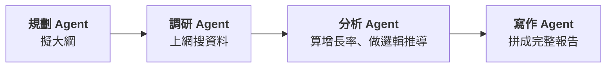
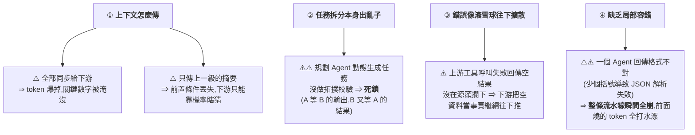
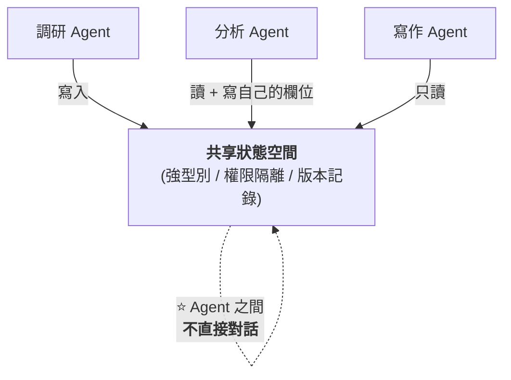
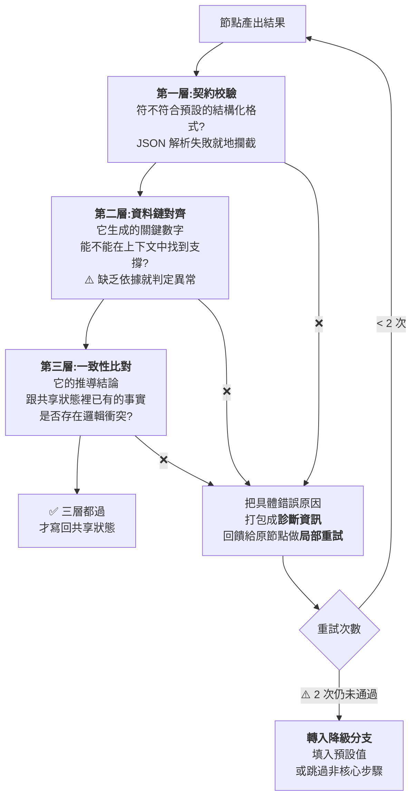

# 多 Agent 系統的資料一致性:為什麼數字越傳越亂,以及四層工程解法

> 整理自 YouTube 頻道 **白白说大模型**〈[多Agent系统数据一致性与高可靠协同架构设计](https://www.youtube.com/watch?v=MWNuu9m93dk)〉(2026-09-15,約 12.4 分鐘,無字幕、以 CPU faster-whisper 轉錄)。
> ⚠️ **本篇是工程方法論,不是對可查證事實的整理** —— 全文沒有引用論文或官方文件,
> 因此核實狀態一節只能標明「哪些是可驗證的通用工程實務、哪些是作者的設計主張」。
> ⚠️ 作者在說明欄推廣自家公眾號的配套教程,本文只整理公開影片內容。

---

## 一句話總結

> **多 Agent 系統跑不穩,通常不是模型不夠聰明,是「通訊架構」出了問題。**
>
> ⭐⭐⭐ **核心主張:在模型的機率性推理之上,用嚴謹的軟體工程與狀態治理,
> 撐出一個「確定可靠」的系統底座。**

---

## 一、⭐⭐ 先看那個所有人都遇過的 bug

**做一份行業研報,很自然地拆成四個 agent:**

⚠️⚠️ **線上跑起來卻是這樣:**

| 環節 | 數字 |
|---|---|
| **調研 Agent 查到的原始事實** | 基準市場規模 **500 億** |
| **分析 Agent 自己結合增長率算** | **800 億** |
| ⚠️⚠️ **寫作 Agent 的報告摘要** | **1,200 億** |

> ⚠️ **甚至全文不同章節的數字還能自己跟自己打架。**

### ⭐⭐⭐ 第一反應通常是錯的

| ⚠️ 常見的歸因 | ⭐ 作者的診斷 |
|---|---|
| 「是不是 prompt 沒寫清楚、角色沒定義好?」 | **不是** |
| 「是不是底層模型能力不行、算數不好?」 | **不是** |
| — | ⭐⭐⭐ **是系統的「通訊架構」出了問題** |

**具體來說:**
- **調研查到的原始事實,分析 Agent 可能壓根沒拿到 ⇒ 只能自己猜**
- **寫作 Agent 匯總時不知道該信誰的 ⇒ 自己腦補了一個數字**
- ⭐ **根因:沒有做狀態隔離,中間也沒有任何校驗關卡**

---

## 二、⭐⭐ 四個結構性問題(把鏈路拆開看)

> ⭐ **第 ④ 點最痛:既沒有局部重試,也沒有兜底降級。**

---

## 三、⭐⭐⭐ 解法一:別讓 Agent 直接對話,改用共享狀態

> ⚠️ **早期做法是讓幾個 Agent 在同一個上下文裡互相發訊息 ——
> 結果內容越積越多,模型自己也分不清哪條資料才是最新的事實。**

⭐ **更穩妥的做法:引入一個中心化的共享狀態空間。**

### 三個基礎規範

| # | 規範 | 做法 |
|---|---|---|
| **1** | ⭐ **強型別約束** | **不讓模型直接回傳大段非結構化文本**,用 **Pydantic** 這類方式把每個業務欄位的型別與格式先定義好 —— 該是數值就是數值,該是列表就是列表 |
| **2** | ⭐⭐ **權限隔離** | **調研 Agent 只擁有「原始事實」欄位的寫入權,其他節點只能讀**;分析 Agent 只能把推導結果寫到自己的分析欄位,**不能反過來改原有資料** ⇒ **避免原始既定事實被下游意外覆寫** |
| **3** | **版本與寫入者記錄** | 每次狀態讀寫都自動記錄**版本號與寫入節點** —— 哪一步改了什麼、是誰寫的,都有據可查 |

> ⭐⭐⭐ **規範 2 是解決開頭那個 bug 的關鍵:500 億這個原始事實一旦寫入就不可被下游覆寫,
> 分析 Agent 的 800 億只能放在自己的欄位裡,寫作 Agent 就知道該信哪一個。**

---

## 四、⭐⭐ 解法二:任務依賴圖要先過「程式化校驗器」

**多 Agent 的任務拆分,本質上就是在生成一張任務依賴圖(DAG)。**

> ⚠️⚠️ **但大模型生成的執行計畫不能直接拿去執行 —— 要先過一道程式化的圖校驗器。**

### 執行前的三道檢查

| # | 檢查 | 防什麼 |
|---|---|---|
| **1** | ⭐ **有向無環檢測** | **提前排除循環依賴與死鎖** |
| **2** | **連通性校驗** | 確保每個子任務都有明確的**輸入來源與輸出目標** |
| **3** | **語義重複任務合併** | 避免資源浪費 |

### 執行階段的節點邊界約束

| 約束 | 做法 |
|---|---|
| ⭐⭐ **輸入裁剪** | **只推送它「聲明依賴」的那幾個欄位**,不把前序所有歷史全塞給它 ⇒ 省 token,也讓模型注意力更集中 |
| ⭐ **工具白名單** | **調研節點只開放檢索類工具,不給程式碼執行權限** ⇒ 防止工具越權帶來的資料污染 |

📎 **這與本庫 [[agent-paid-api-cost-guardrails-mcp]] 的原則一致:
護欄要放在「Agent 改不動的那一層」——這裡是程式化校驗器與工具白名單,而不是提示詞。**

---

## 五、⭐⭐⭐ 解法三:每個節點寫回狀態前,先過三層校驗

> ⭐⭐⭐ **這個設計最重要的性質:異常被完全控制在當前節點內部。**
> **① 不會導致整條鏈路崩潰 ② 不會把未經驗證的資料寫入共享狀態去影響下游。**

⭐ **重試次數限制在兩次以內,是為了避免陷入無限死循環。**

---

## 六、⭐⭐ 解法四:交付前的全局事實對帳

> **光管住單點節點還不夠。在把最終結果交付給使用者之前,還需要一套系統級的兜底。**

### ⭐⭐⭐ 交付前對帳

> **報告寫完後,系統自動跑一遍對帳程序:**
> **把通稿裡出現的每一個核心數字、關鍵結論,反向去跟共享狀態裡的欄位做索引匹配。**
>
> ⚠️ **如果某個數字在狀態庫裡根本找不到依據 ⇒ 強制標記為「待核實」或直接過濾掉。**

> ⭐⭐ **目標:確保最終交出去的結果,每一句話都是有據可查的。**

### 熔斷與降級

| 情境 | 處理 |
|---|---|
| **非核心任務超時或反覆報錯** | ⭐ **直接觸發降級**(填預設值或跳過子模組),**優先保證主幹流程跑通** |
| ⚠️ **核心節點報錯、系統無法自癒** | ⭐⭐ **觸發人機協同**:不直接崩潰,而是**把當前所有狀態資料打一個快照保存**,通知人工介入 |

> ⭐⭐⭐ **人機協同這一點的價值:人在後台把有爭議的資料確認或修正後,
> 流水線可以接著往下跑 —— 完全不需要把整個流程從頭再跑一遍。**

📎 **這與 [[long-running-agents-goal-evaluation]] 的長任務續跑思路同源:
關鍵是「狀態可保存、可恢復」,而不是「不會出錯」。**

---

## 七、⭐⭐ 可觀測性:把微服務那套搬過來

> ⚠️ **多 Agent 系統跑起來之後,如果缺乏監控,出問題排查會非常痛苦。**

**做法是引入微服務架構裡的分散式呼叫鏈追蹤:**

| 機制 | 內容 |
|---|---|
| **Trace ID** | 每次任務觸發生成一個**全局唯一的 Trace ID** |
| **Span** | 下面每個 agent 的具體操作(呼叫工具、讀寫狀態)都記錄成對應的 **span** |
| ⭐ **效果** | 後台日誌裡,整個產出過程就像**一張清晰的時間線圖** —— 哪一步耗時多久、讀了什麼、寫了什麼,一清二楚 |

### ⭐⭐⭐ 三個核心量化指標

| 指標 | 用來回答什麼 |
|---|---|
| **資料一致性達成率** | ⭐ **校驗網關到底攔截了多少次異常** |
| **各節點的 token 消耗佔比** | ⭐⭐ **哪一個 agent 在無效消耗資源** |
| **鏈路執行時延分布** | **拖慢整體進度的效能瓶頸在哪** |

> ⭐⭐ **有了這些數據,後續調整狀態結構、修改提示詞、優化依賴關係,
> 都是「基於客觀數據的精準調優」,而不是靠感覺瞎猜。**

---

## 八、⭐⭐ 評測與發布流程:改一句提示詞怎麼確保不炸

> **系統上線後最現實的問題:要改某個 agent 的提示詞、或加一個新工具,
> 怎麼確保改動不會把原有的鏈路改壞?**

### 三個環節

| 環節 | 做法 |
|---|---|
| ⭐ **① 標準化評測資料集** | 不只要有**日常典型任務**,還要包含**長上下文多跳推理**,甚至**故意刁難的異常輸入** |
| **② 發版前自動回歸測試** | 盯三樣東西:**資料一致性有沒有達標、任務完成率有沒有下降、平均每個任務的呼叫成本有沒有失控** |
| ⭐⭐ **③ 任何提示詞 / 工具編排 / DAG 拓撲的修改都不能直接推上線** | 必須先在**靜態層面做拓撲編譯校驗**,再放到**基準資料集上跑一次回放**,確認沒有引起資料退化 |
| ⭐ **④ 灰度發布** | 先切一小部分真實流量給新版本,在監控看板觀察一段時間,確認**一致性指標與報錯率平穩**後再逐步全量 |

---

## 九、⭐⭐⭐ 整體對照:舊做法 vs 現在的做法

| 維度 | ⚠️ 早期做法 | ⭐ 現在的做法 |
|---|---|---|
| **通訊機制** | 讓 Agent 之間**自由發文本** | ⭐⭐ **建立結構化共享狀態**,用**強型別 + 權限隔離**管好資料 |
| **任務編排** | **全憑模型自主規劃、黑盒運行** | ⭐⭐ **必須經過靜態校驗的 DAG 拓撲**,並給每個節點嚴格劃定輸入與工具邊界 |
| **異常控制** | 上游出錯,錯誤一路往下擴散 | ⭐⭐ **每個關鍵節點三層校驗**,用**局部重試與降級**把問題鎖死在局部 |
| **交付品質** | 跑一次就直接把結果交出去 | ⭐⭐⭐ **交付前全局事實對帳 + 熔斷降級 + 自動化評測流水線** |

> ⭐⭐⭐ **作者的收尾判斷值得記:**
> **「用多 Agent 的核心價值,是通過任務解耦來處理更複雜的業務邏輯。
> 而多 Agent 系統能不能真正穩定落地,關鍵在於能不能通過嚴謹的軟體工程與狀態治理手段,
> **在模型具有機率性的推理之上,撐出一個確定可靠的系統底座**。」**

---

## 應用案例

### 案例 1|⭐⭐⭐ 用「權限隔離」治數字打架(最小可行改造)

**如果你手上就有開頭那種「數字越傳越亂」的系統,最小的改造是:**

| 步驟 | 做法 |
|---|---|
| **①** | 把共享狀態拆成**兩類欄位**:`facts`(原始事實)與 `derived`(推導結果) |
| ⭐⭐ **②** | **只有調研節點能寫 `facts`,且一旦寫入不可覆寫** |
| **③** | 分析節點只能寫 `derived`,且**必須註明它引用了哪個 `facts` 欄位** |
| ⭐ **④** | 寫作節點**只讀**,且交付前跑一次對帳:通稿裡的每個數字必須能對回 `facts` 或 `derived` |

> ⭐ **光做完 ②④ 兩步,開頭那個「500 → 800 → 1200」的問題就不會再發生 ——
> 因為 1,200 億在狀態庫裡找不到依據,對帳時會被標記出來。**

### 案例 2|⭐⭐ 三層校驗的優先順序(資源有限時先做哪一層)

| 順序 | 層 | 理由 |
|---|---|---|
| **先做** | ⭐ **第一層(契約校驗)** | **成本最低、收益最大** —— 用 Pydantic 之類的結構化輸出就能擋掉大部分格式崩潰 |
| **再做** | ⭐⭐ **第三層(一致性比對)** | 直接治「數字打架」這個最痛的症狀 |
| **最後** | **第二層(資料鏈對齊)** | 實作成本最高(要做檢索比對),但也是防幻覺數字的關鍵 |

### 案例 3|⚠️ 什麼時候不需要這一整套

> ⚠️ **這套架構有明顯的複雜度成本。** 如果你的系統是:
> - **單一 agent 加幾個工具**
> - **鏈路短(兩三步)、可以人工看完每一步輸出**
> - **產出不是「需要對外交付的事實性文件」**
>
> ⭐ **那先做第一層契約校驗就夠了,不必上共享狀態與 DAG 校驗器。**

📎 **這呼應 [[graph-engineering-node-edge-state]] §9 的克制:「不是每件事都要套 Graph。」
⭐ 判準很簡單:**你的產出裡有沒有「必須前後一致的事實」**。有,才需要這套;沒有,就是過度工程。**

---

## 重點回顧(TL;DR)

1. ⭐⭐⭐ **數字越傳越亂,通常不是模型笨,是通訊架構問題** —— 沒做狀態隔離、沒有校驗關卡。
2. **四個結構性問題**:上下文怎麼傳(全傳爆 token、只傳摘要丟前提)、任務拆分死鎖、錯誤滾雪球擴散、缺乏局部容錯(一個 JSON 解析失敗全鏈崩)。
3. ⭐⭐ **解法一:Agent 之間不直接對話,統一面向共享狀態讀寫**,三個規範是**強型別**、**權限隔離**、**版本與寫入者記錄**。
4. ⭐⭐⭐ **權限隔離是治數字打架的關鍵**:原始事實欄位只有調研節點能寫,下游不能覆寫。
5. ⭐⭐ **解法二:模型生成的 DAG 不能直接執行**,要先過程式化校驗器(有向無環檢測 / 連通性 / 重複任務合併);執行時再做**輸入裁剪**與**工具白名單**。
6. ⭐⭐⭐ **解法三:寫回狀態前三層校驗**(契約 → 資料鏈對齊 → 一致性比對),失敗就回饋診斷資訊做**局部重試**(上限兩次),再不過就**降級** —— 異常被鎖死在節點內部。
7. ⭐⭐⭐ **解法四:交付前全局事實對帳** —— 通稿每個數字反向匹配狀態庫,找不到依據就標記待核實或過濾。
8. ⭐⭐ **核心節點失敗時觸發人機協同:保存狀態快照、人工修正後接著跑**,不必整條重來。
9. **可觀測性照搬微服務**:Trace ID + span;三個核心指標是**一致性達成率**、**各節點 token 佔比**、**鏈路時延分布**。
10. **發布紀律**:標準化評測集(含異常輸入)、發版前回歸、**拓撲編譯校驗 + 基準集回放**、灰度發布。
11. ⭐⭐⭐ **總結:在模型的機率性推理之上,用軟體工程與狀態治理撐出一個確定可靠的底座。**

---

## 核實狀態

### ⚠️ 本篇的性質

> ⚠️⚠️ **這支影片全程沒有引用任何論文、官方文件或第三方數據,
> 也沒有給出可驗證的實測數字。它是一份**工程設計主張**,不是對事實的整理。**
> **因此本文無法進行「數字核實」,只能區分「業界通用實務」與「作者的設計主張」。**

### ✅ 屬於業界通用實務(非本影片獨創,可自行查證)

| 項目 | 說明 |
|---|---|
| **用 Pydantic 等做結構化輸出約束** | 主流做法,各大 agent 框架均支援 |
| **DAG 的有向無環檢測與拓撲排序** | 標準圖論演算法,工作流引擎(Airflow 等)長期使用 |
| **分散式呼叫鏈追蹤(Trace ID / span)** | 微服務可觀測性標準做法(OpenTelemetry 等) |
| **熔斷、降級、灰度發布** | 標準的服務可靠性工程實務 |
| **回歸測試 + 基準資料集** | 標準的軟體發布流程 |

⭐ **作者的貢獻在於把這些成熟實務系統性地套用到多 Agent 場景,而不是提出新機制。**

### ⚠️ 屬於作者的設計主張(未經第三方驗證)

- **「三層校驗」的具體分層方式**(契約 / 資料鏈對齊 / 一致性比對)—— **合理但非標準術語。**
- **「重試上限兩次」** —— ⚠️ **屬經驗值,未給出依據。**
- **「交付前全局事實對帳」的具體實作** —— **方向合理,但影片未給出如何處理「數字經過計算而非直接引用」的情況**(例:800 億是 500 億乘以增長率算出來的,反向索引匹配不到)。⭐ **這是實作時的真實難點,影片略過了。**
- **開頭那個「500 → 800 → 1200」的案例** —— **屬示範性舉例,非真實事故報告。**

### ⚠️ 本文補充的判斷(非影片內容)

- **§應用案例 2 的「三層校驗優先順序」** —— 本文依實作成本與收益推出的建議。
- **§應用案例 3 的「什麼時候不需要這套」** —— 影片全程沒有討論適用邊界,**這是本文補上的克制。**

---

## 來源

- [多Agent系统数据一致性与高可靠协同架构设计 — 白白说大模型](https://www.youtube.com/watch?v=MWNuu9m93dk)(2026-09-15,約 12.4 分鐘。⚠️ 作者於說明欄推廣自家公眾號配套教程)
- 延伸:本庫 [[graph-engineering-node-edge-state]](node / edge / state 的抽象與「不是每件事都要套 Graph」的克制)、[[agent-paid-api-cost-guardrails-mcp]](護欄要放在 Agent 改不動的那一層)、[[long-running-agents-goal-evaluation]](長任務的狀態保存與續跑)、[[five-agent-patterns]]、[[harness-loop-graph-troubleshooting-map]]、[[agent-harness-loop-llmops-eval-explained]]。

> 該片無字幕,逐字稿以 CPU 版 faster-whisper(small / int8 / zh)轉錄取得,**非官方字幕**,可能有少量聽寫誤差。
> 專有名詞已依上下文還原:轉錄中的「一整 / 一准 / A准 / A纸 / A整」為 **Agent**、「數損 / 數捷 / 數捐 / 數捕 / 數捅」為 **數據/資料**、
> 「教研 / 教驗 / 教砌 / 教骘 / 教院」為 **校驗**、「重視」為 **重試**、「Pedantic」為 **Pydantic**、「Jason」為 **JSON**、
> 「BAG / DAGTOP」為 **DAG / DAG 拓撲**、「斯坦」為 **span**、「全線隔離 / 權建隔離」為 **權限隔離**、
> 「死群環」為 **死循環**、「對質程序」為 **對帳程序**、「資予」為 **降級**、「暴徒率」為 **報錯率**、
> 「衔接一小部分真實流量」為 **切一小部分真實流量**、「布局一致性」為 **資料一致性**。
