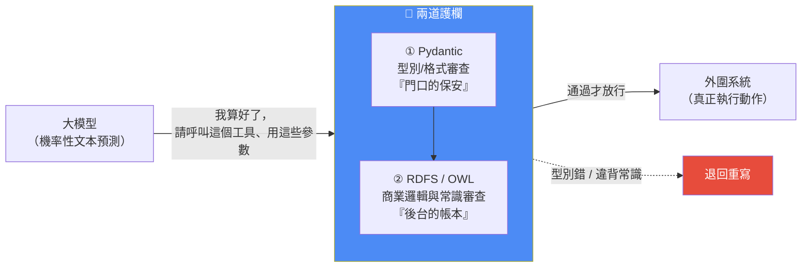
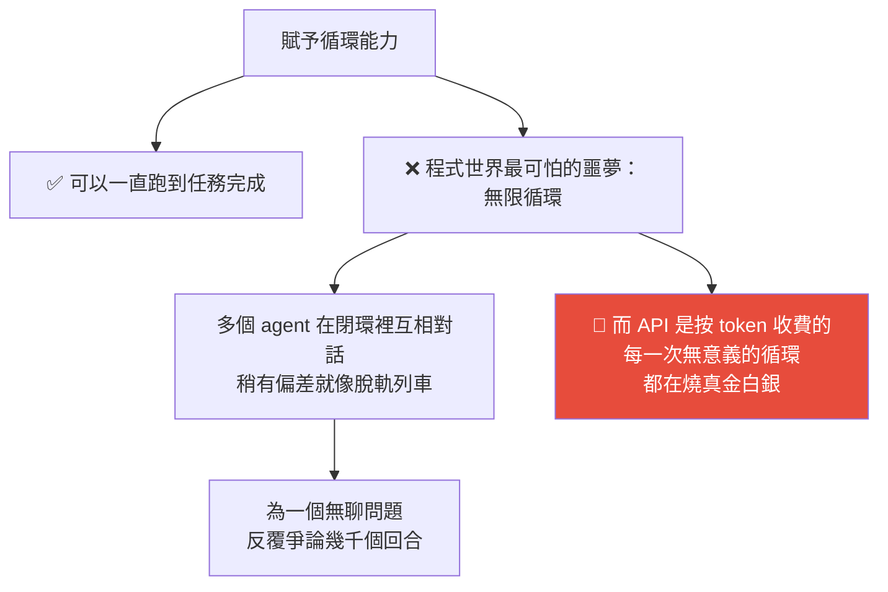

# AI Agent 最大的缺陷:它沒有「世界地圖」——用本體論給大模型套上邏輯護欄

> 整理自 YouTube 頻道 **wow**〈AI Agent 最大的缺陷:它沒有「世界地圖」|Frank Coyle〉(2026-07-31,約 19 分鐘),內容拆解資深計算機科學教育者 **Frank Coyle** 在 AIE 大會上的演講。
>
> 核心命題:**Agent 給了 AI 手腳,本體論(Ontology)給了它一張地圖。** 大模型的幻覺不完全是 bug——它更像沒有物理常識約束的想像力;一旦不受約束地接進財務系統或自動退款流程,就是災難。所以要在「模型的嘴」與「系統的手」之間,建一道嚴密的審查機制。
>
> 全片口訣:**Pydantic 在門口當保安,本體論在後台管帳本。**

---

## 一句話總結



---

## 一、兩條跨越半世紀的血脈,在今天會合

### Agent 的起點:1956 年

提出「人工智慧」一詞的 **John McCarthy**、寫出《心智社會》的 **Marvin Minsky** 等先驅,當年就把智能體的最終形態定義成一個閉環:

```
感知環境 → 做出決策 → 採取行動 →（回到感知）
```

> 影片的評語很到位:**這哪裡是在描述一台機器,這分明是在描述一個有生存本能的生物。**

### 本體論的起點:古希臘

亞里士多德對「存在」做哲學分類時做的就是這件事;歷經千年演變,到近代哲學家 **Quine**,再到 **1993 年 Gruber** 給了它一個計算機科學的定義——**「對共享概念化的形式化規範」**。

翻成白話:**本體論是我們人類親手遞給 AI 的一本《人類宇宙運行說明書》**,白紙黑字告訴它什麼東西屬於什麼類別、誰和誰是什麼關係。

### 神經符號 AI(Neuro-Symbolic AI)= 兩條血脈的會合

把**大模型機率性的文本預測能力**,和**本體論那套嚴密的邏輯規則**綁在一起。

---

## 二、為什麼非得套上這層「邏輯枷鎖」

**幻覺不完全是 bug。** 影片的類比:人類本身也在「幻覺」——我們想像出並不存在的東西,再想辦法把它變成現實。大模型也一樣,擁有**毫無邊界的創造力**。

**問題在於:這種創造力沒有物理世界常識的約束。** 純粹創作時很迷人,一旦接進財務系統、自動退款流程,就是異常災難。

---

## 三、歷史教訓:80 年代專家系統為什麼慘敗

這段是全片最有價值的背景,因為它解釋了**為什麼同一套邏輯今天又行了**。

| | 1980 年代 | 今天 |
|---|---|---|
| 建構方式 | **自上而下**:由人類專家把所有規則預先寫好 | **自下而上**:依真實反饋與每天產生的海量資料,**動態**把新概念與關係加進圖譜 |
| 結果 | 手工編寫的邏輯網路在充滿例外的現實世界**根本無法擴展**;系統越寫越龐大、越龐大越慢,一跑就崩 | 有現成的公開知識圖譜可站在肩膀上 |
| 硬體 | **算力根本撐不起**龐大而深度的關係網路推理 | GPU 提供了充足的並行算力 |

日本政府當年重金投入的**第五代電腦計畫**就是基於這套邏輯,全世界都以為日本掌握了未來的密碼——最後徹底慘敗,直接引發整個行業信心崩塌,拖出了一場漫長的 **AI 寒冬**。

> **關鍵洞察:當年失敗的罪魁禍首不是本體論的邏輯有問題——它的邏輯其實極美——而是硬體算力撐不起。**
>
> 影片的比喻:設計師在圖紙上完美畫出了能飛上太空的太空梭,回頭一看,手裡能用的引擎只有一台燒煤的蒸汽機。

還有一層黑色幽默:**神經網路後來能翻身,靠的是 NVIDIA 當年為了讓年輕人玩上畫面更炫的電子遊戲而拚命造 GPU**——這批原本為了打遊戲造出來的算力怪獸,誤打誤撞給人工智慧裝上了合適的引擎。

### 而且今天不必從零造輪子

過去 15–20 年,網際網路已經悄悄沉澱了大量現成的知識圖譜:

| 圖譜 | 用途 |
|---|---|
| **Schema.org** | 讓搜尋引擎更懂網頁 |
| **FOAF** | 描述社交關係 |
| **Dublin Core** | 描述圖書、論文的後設資料 |
| **DBpedia** | 維基百科底層掛載的巨大開放本體論圖資料庫 |

> 站在這些巨人的肩膀上,**今天的 AI 一出生就等於擁有一張異常詳盡、覆蓋全世界的現實地圖。**

### 順帶一提:為什麼是圖資料庫而不是關聯式資料庫

| | 關聯式資料庫 | 圖資料庫(本體論) |
|---|---|---|
| 形態 | 一張龐大死板的表格,**所有欄位得預先設計好** | 能無限延伸的**網狀結構** |
| 改結構 | 改一遍就是異常噩夢,甚至要停機重建 | **掛個新節點、牽條線就行**,不用動原有結構 |

---

## 四、循環(Loop):給了 AI 手腳,也給了它失控的能力

1966 年,**Böhm 與 Jacopini** 提出結構化程式定理平息了當年的語言之爭:任何程式語言只要具備**順序執行、條件判斷、循環**三個要素,就是**圖靈完備**的。

**過去大模型不具備自主循環能力**——你問一句它答一句。現在的 Agent 框架終於補齊了這最後一塊拼圖:它可以一直跑,直到完成任務為止。

**但代價是:**



> **邏輯在暴走,經費在燃燒。**
>
> 📌 這正好對應本庫 [[production-agent-engineer-skills-2026]] 講的**防死鎖 + 執行深度檢測 + 接口熔斷**,以及 [[harness-loop-graph-troubleshooting-map]] 的**有界重試四要素**。

---

## 五、核心比喻:被鎖在密室裡的軍師

Coyle 在講座上投影了一段控制 Claude agent 底層運行的程式碼,揭示一個反直覺的真相:**看似無所不能的大模型,其實什麼都做不了。** 它被關在一個黑盒子裡,唯一能做的就是以極高機率吐出下一個詞。


**致命問題在於:正因為這位軍師的本質只是一個在計算文字機率的模型,所以儘管絕大多數時候它非常聰明,依然存在一種機率——它在幻覺驅使下給出一套完全違背常識的瞎指揮**(例如叫弓箭手去水底埋伏、或要求把大砲對準自己的中軍大帳)。

> **所以我們必須在「軍師的嘴」和「將軍的劍」之間,建立一套嚴密到堅不可摧的審查機制。**

---

## 六、第一道防線:Pydantic —— 門口的保安

Python 是動態型別語言:一個變數上一秒還是數字 `100`,下一秒可能變成字串。這種隨意性平常很方便,**但放在動不動就產生幻覺的 AI 系統裡,就是隨時會爆炸的定時炸彈。**

**Pydantic 扮演的角色**:像高級俱樂部門口那個極其嚴厲、不通人情的保安。

| 情境 | 結果 |
|---|---|
| 系統規則要求傳入一個**整數金額** | — |
| 大模型卻遞過來一串文字寫的「一百塊錢」 | **型別錯誤 → 退回去,規範重寫** |

> 這在最外層強制保障了資料格式的正確性。**但保安只能守住第一道門**——如果格式完全正確、都是數字,**但裡面的商業邏輯是錯的**呢?

---

## 七、第二道防線:RDFS 與 OWL —— 後台的帳本

### RDFS:定義域(domain)與值域(range)

規則設定「教」這個動作:**發出者必須是老師,接受者必須是學生。**

假設大模型幻覺爆發,吐出一句匪夷所思的指令:**「Bob 教一輛滑板車」**——滑板車怎麼能被教呢?

| 系統 | 反應 |
|---|---|
| 一般系統 | 要嘛直接崩潰,要嘛**把髒資料寫進去** |
| 搭載 RDFS 的圖譜系統 | 不只能處理,還能**自動推理出隱藏資訊**:既然動作是「教」,依規則發出者必須是老師 → 雖然資料庫裡還沒有 Bob 的職業資訊,**立刻就能推出 Bob 必定是一名老師** |

> 這就是**邏輯的強制力**:從毫無頭緒、甚至無厘頭的文本裡,像榨汁機一樣強行榨取並規範出結構化資訊。
>
> (當然,同一套邏輯也會把「滑板車」在這個特定邏輯閉環裡強行歸類為學生——**這正說明了規則設計本身要謹慎:強制力是雙面刃。**)

### OWL:處理更複雜的商業邏輯與「潛規則」

| 能力 | 例子 | 實務價值 |
|---|---|---|
| **傳遞性(transitivity)** | 已知「蘇是瑪莉的祖先」「瑪莉是安妮的祖先」→ **自動推出「蘇也是安妮的祖先」**,不需要你教 | 從既有事實自動衍生新事實 |
| **唯一性約束(functional property)** | 規定「生物學父親有且只有一個」。大模型讀了一堆混亂文本後同時說「Bob 是 Jim 的父親」「Bill 也是 Jim 的父親」→ 傳統資料庫可能傻傻給 Jim 記了兩個爸爸;**OWL 會推理出:既然父親唯一而你給了兩個名字,那 Bob 和 Bill 其實是同一個人的兩個名字**,自動合併實體 | **防止對同一筆訂單重複退款** |
| **互斥屬性(disjoint)** | 規定「客服」與「買家」兩個身分互斥,一個人絕不能同時扮演兩者 | **防止把退款打進客服自己的帳戶** |
| **封閉值域** | 物流狀態只能是預設好的「已支付 / 已發貨 / 已退款」之一。大模型為了顯得口語化生造出「大概已經發貨了」這種狀態 → **系統直接拒絕** | 擋住模型胡編亂造新詞彙 |

---

## 八、結論:純粹的智能體(Pure Agent)

> Coyle 的口訣:**Pydantic at the door, ontology on the ledger** —— **Pydantic 在門口當保安,本體論在後台管帳本。**

**一個合格的商業智能體,從誕生那一刻起就不該擁有直接修改資料庫的特權。** 它的所有指令都得先經過這道由 **Pydantic → RDFS → OWL** 組成的嚴酷海關,被證明符合常識,才能落地執行。

### 那這樣會不會扼殺創造力?

影片自己提出了這個疑問並回答:

> **建這條護欄的目的從來不是為了殺死創造力,而是為了保持 AI 的誠實** —— 讓大模型在一條絕對安全的鐵軌上,盡情揮灑那種由機率模型帶來的、令人著迷的創造性。

### 收尾的哲學

Coyle 在講座開頭提過一個理念(源自修女兼藝術家 Corita Kent,後被前衛音樂家 John Cage 推崇):**在創造的過程裡,沒有對錯、沒有輸贏,只有創作本身。**

他給習慣敲鍵盤的程式設計師一個反常建議:**放下鍵盤,拿紙筆去手寫、去畫畫。** 因為敲鍵盤時大腦處於單一、機械的線性狀態,神經元只在找下一個字母在哪;而握筆寫字時,手腕力度、視覺追蹤、指尖觸感同時湧入,**神經元會以更豐富的網狀結構建立連接**——這恰好是「從單一指令到全感官網狀連接」的縮影,也正是今天 AI 演進的隱喻。

最後影片留下的開放問題很好:

> **Agent 給了 AI 手腳,本體論給了它一張地圖。但地圖畫得再精細,也畫不出人還沒走過的路。**
>
> **或許真正該問的不是「要不要給 AI 裝護欄」,而是「護欄該留多少餘地」**,讓它在安全軌道之外,偶爾也能帶我們看到一些新東西。

---

## 應用案例

### 案例 1|把「Schema 校驗」升級成「語意校驗」

多數人已經在用 Pydantic 或 JSON Schema 驗證 LLM 的工具呼叫參數——**這只是第一道門**。本片的核心提醒是:**格式對不代表邏輯對。**

實務做法(不必真的上 OWL 推理引擎,先做輕量版):

```
① 型別層（Pydantic / JSON Schema）
   金額必須是 int、狀態必須是 Enum、日期格式必須合法

② 語意層（自己寫的斷言，等價於 RDFS domain/range）
   - 退款金額 ≤ 原訂單金額
   - 收款帳戶 ∈ 該訂單的付款人帳戶（對應 OWL 的互斥屬性）
   - 狀態轉移必須合法：已發貨 → 已退款 ✅，已退款 → 已發貨 ❌

③ 唯一性層（等價於 OWL functional property）
   - 同一筆訂單的退款動作全域只能成功一次（冪等鍵）
```

**第③點就是影片說的「防止重複退款」**,同時也對應本庫 [[production-agent-engineer-skills-2026]] Q1 提到的**冪等性**——重試的前提是操作可以安全重複。

### 案例 2|盤點你的 agent 有哪些「不該有的特權」

照「純粹的智能體」原則檢查:**你的 agent 是不是能直接寫資料庫、直接發送對外訊息、直接動金流?**

如果是,把它改成:**agent 只能產出「意圖」(一個結構化的動作請求),由一層獨立的校驗器決定要不要執行。** 這個改動的好處是**校驗邏輯可以用普通程式碼寫、可以單元測試、不會幻覺**——比在 prompt 裡寫「請不要做 X」可靠一個數量級。

### 案例 3|從現成的公開本體論起步,別自己造

需要領域概念體系時,先看有沒有現成的:**Schema.org**(電商、活動、組織、產品等大量現成型別)、**Dublin Core**(文件後設資料)、**FOAF**(人與關係)、**DBpedia**(通用世界知識)。

影片的歷史教訓值得記住:**80 年代把專家關在屋裡自上而下寫規則的做法失敗了**。正確姿勢是**站在現成圖譜上,再依真實資料自下而上逐步擴充**。

### 案例 4|把「狀態機」寫死,是最便宜的護欄

影片舉的「大模型生造出『大概已經發貨了』這種狀態」是很典型的線上事故來源。**最便宜有效的解法就是把狀態定義成封閉的 Enum,並明確列出合法的狀態轉移。** 這不需要任何 AI 技術,但能擋掉一大類幻覺。

### 案例 5|本倉庫的對照

這篇跟同一作者(wow)先前那篇 [[graphify-code-knowledge-graph-real-world-test]] 是**同一個命題的兩面**:

| | Graphify 篇 | 本篇 |
|---|---|---|
| 結論 | AI Coding 的最後一道牆是**缺少軟體世界模型**——靜態 AST 只是高解析度的 X 光片,答不出「改這裡三天後下游會怎樣」 | **本體論就是在給 AI 補一張世界地圖**,但它管的是「什麼符合常識」,不是「執行時會發生什麼」 |
| 合起來 | **靜態結構(圖譜)+ 邏輯常識(本體論)仍然不等於動態因果。** 兩者都是必要但不充分的——這也是為什麼「軟體世界模型」仍是開放問題 | — |

而我們自己的四個 cron 其實也有一層極簡的「本體論」:**去重判定用 `grep` exit code 而不是讓模型自己說「應該處理過了」**——把判斷交給確定性規則而非機率模型,正是本片的核心精神。

---

## 重點回顧(TL;DR)

- **命題**:Agent 給了 AI 手腳,**本體論給了它一張世界地圖**。幻覺不是 bug 而是沒有常識約束的想像力,接進財務系統就是災難。
- **兩條血脈**:Agent(1956,McCarthy/Minsky 的「感知→決策→行動」閉環)+ 本體論(亞里士多德 → Quine → **Gruber 1993:對共享概念化的形式化規範**)= **神經符號 AI**。
- **歷史教訓**:80 年代專家系統慘敗、引發 AI 寒冬,**罪魁不是邏輯有問題,是算力撐不起**;今天 GPU 補上了引擎,而且可以**自下而上**動態擴充,還能站在 Schema.org / FOAF / Dublin Core / DBpedia 的肩膀上。
- **循環的雙面性**:補齊圖靈完備的最後一塊拼圖,但無限循環在 agent 系統被放大——**邏輯在暴走,經費在燃燒**。
- **核心比喻**:大模型是**被鎖在密室裡的軍師**,只能喊出作戰計畫(`stop_reason = 需要呼叫工具`);將軍若無腦執行,一次幻覺就能葬送全局。
- **兩道護欄**:**① Pydantic 守型別/格式**(門口保安);**② RDFS/OWL 守商業邏輯與常識**(後台帳本)——RDFS 的 domain/range 能反推隱藏屬性;OWL 的**傳遞性、唯一性(防重複退款)、互斥(防退款打進客服帳戶)、封閉值域(擋生造狀態)**。
- **原則:純粹的智能體** —— **agent 從誕生就不該有直接改資料庫的特權**,所有指令先過海關。
- **護欄不是為了殺死創造力,是為了保持 AI 的誠實。** 開放問題:**護欄該留多少餘地?**

---

## 來源

- wow(YouTube),〈AI Agent 最大的缺陷:它沒有「世界地圖」|Frank Coyle〉(2026-07-31,約 19 分鐘):<https://youtu.be/qnIlKvW00Sk>
  - ⚠️ 該片無官方字幕也無自動字幕,**逐字稿以 CPU 版 faster-whisper(small/int8,`vad_filter=True`)轉錄取得,非官方字幕**,可能有少量聽寫誤差(人名與技術名詞如 Frank Coyle、McCarthy、Minsky、Quine、Gruber、Böhm–Jacopini、Pydantic、RDFS、OWL、Schema.org、FOAF、Dublin Core、DBpedia 已依上下文與領域知識校正)。
  - 影片標題稱講者為「柏克萊教授」,但片中僅稱其為「有 30 多年經驗的資深計算機科學教育者」,**任職單位未在片中明確說明**,本文因此不採用該職稱。
  - 原始素材為 Frank Coyle 在 AIE 大會的演講;講者個人網站命名為 **Code Supreme**,靈感來自 John Coltrane 的專輯《A Love Supreme》。
- 延伸(本庫):[Graphify 實戰壓測:AI Coding 的最後一道牆是缺少軟體世界模型](../memory-retrieval/graphify-code-knowledge-graph-real-world-test.md)(同一作者的前一篇) · [2026 Agent 工程師能力與面試題](./production-agent-engineer-skills-2026.md) · [Harness/Loop/Graph 三層排障地圖](./harness-loop-graph-troubleshooting-map.md) · [Codebase-Memory-MCP vs CodeGraph](../memory-retrieval/codebase-memory-vs-codegraph-two-routes.md)
