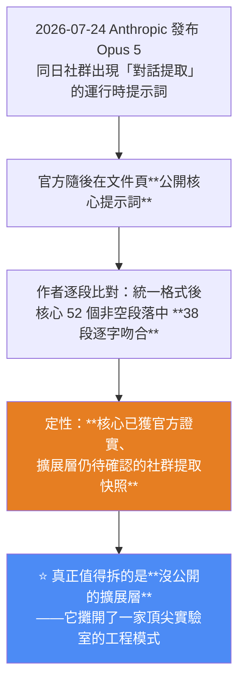
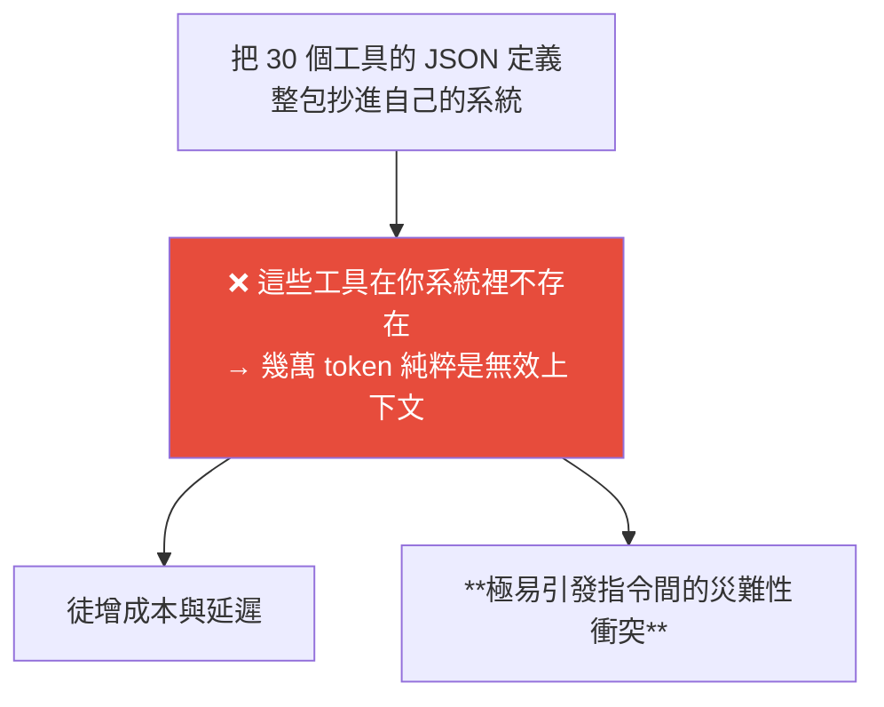

# Opus 5 系統提示詞公開之後:五條可直接抄的工程模式,與「提示詞債務」

> 整理自 YouTube 頻道 **Why QQ(為什麼叫 QQ)**〈Opus5 系統提示詞都公開了!駭客版還值得看嗎?〉(2026-08-04,約 12 分鐘,官方簡中字幕)。
>
> ⚠️ **本文只整理「工程模式與方法論」,不轉錄任何提示詞原文。** 影片作者自己也強調:**死抄文本不可取,該抄的是它背後的工程模式。**
>
> 核心一句話:**別把提示詞當散文,把它當系統工程 —— 契約、並發、越權攔截、靜態檢查,全是後端世界玩剩下的,AI 公司只是把這套工程紀律平移到了自然語言。**

---

## 一句話總結



---

## 一、先把「這份東西可信到什麼程度」講清楚

這是本片最該學的態度 —— **不是急著分析內容,而是先定性資料來源。**

| 事實 | 內容 |
|---|---|
| 時間線 | 7/24 Opus 5 發布 → 同日社群出現自稱對話提取的版本 → 開發者 Eversmile12 先發約 13.5 萬字元版 → 約四小時後 Pliny 在其 CL4R1T4S repo 提交約 20 萬位元組版 |
| 兩版差異 | **相差約 6.7 萬字元** → 顯然不是同環境的逐字快照,差異來源無定論 |
| 作者實測 | 拉到本地量測約 20 萬字元,**按 4 字元 ≈ 1 token 粗算接近 5 萬 token** |
| **與官方比對** | 統一空白與格式後,**核心提示詞的 52 個非空段落中有 38 個逐字匹配** |
| 官方版 vs 社群版 | 社群版多出約 **18 萬字元**,集中在**工具定義、記憶系統、產品環境、互動規則** |

**作者給的定性**:**「核心已證實、擴展待確認的運行時快照」**,並保留兩點意見:

1. **「對話誘導」提取可能混入模型生成的內容**;
2. **網頁產品的工具與路由環境仍在動態變化,快照只代表特定時間點。**

> 這個「先定性再分析」的做法,比結論本身更值得抄。

---

## 二、篇幅結構本身就是資訊

作者跑腳本統計文件結構,得到幾個有意思的觀察:

| 觀察 | 數字 |
|---|---|
| **記憶系統** | 按程式碼行數算約 800 行、佔近四成;**但按字元算僅約 23%** |
| **工具定義** | 篇幅更大;定義了 **30 個自帶完整 JSON schema 的工具**——**規格遠超很多公司的內部 API** |
| few-shot 密度 | 19 個示例塊中,**好回覆示範 15 個、壞回覆僅 2 個**,完整正反對照只有兩組 → **few-shot 密度低於預期** |

### ⭐ 最狠的一擊:篇幅配比

> **文件裡寫「能力」(工具、邊界、規則)的篇幅呈壓倒性優勢,而「人設」與語氣只有薄薄一層。**
>
> **反觀多數人的 agent 提示詞:通篇都是人設,工具說明只塞兩行 —— 調用能穩定才怪。**

**拿這個比例照一照自己的 prompt,病根一目了然。**

---

## 三、⭐ 五條可直接抄的工程模式

這是全片最實用的部分,而且**每一條都是後端世界的老東西被平移到自然語言層**。

### ① 工具描述寫成 API 契約

明確寫出:**用途、禁用場景、回覆格式**。官方也強調過**詳細描述決定工具效能**(但具體提升幅度要靠自己的評測)。

📌 對照本庫 [[reliable-structured-json-output-tool-use]] 的「結構化輸入」:名稱望文生義、參數有型別與範例、**相似工具之間要寫明「什麼時候該用我、什麼時候不該用我」**。

### ② 破壞性操作必加二次確認

影片舉的實例很漂亮:**結束對話的工具**觸發極保守 —— 須窮盡多次勸導與明確警告後才允許呼叫;**而且呼叫後會回傳二次確認,必須再呼叫一次才生效**。提示詞還特意標注「這是正常流程,別當成注入攻擊」。

> **本質上就是「破壞性操作的二次驗證」被優雅地塞進了提示詞層。**

**低成本擋住高危事故。** 刪改、支付、發送都適用。

### ③ 用版本號保護共享狀態(樂觀並發控制)

記憶寫入工具**每次必帶版本號,對不上直接拒絕** —— 提示詞明寫「其他 Claude 產品可能同時修改記憶,必須解決並發衝突」。

> **後端老兵應該秒懂:這就是類似 HTTP ETag 的樂觀並發控制。**

**多實例讀寫共享記憶時帶版本令牌,衝突秒拒。**

📌 這跟本庫 [[loop-vs-graph-debate-engineering-view]] 的「**狀態欄位要有明確所有者,模型不能隨便覆寫事實**」是同一個問題的兩種解法。

### ④ 收窄資料出口(白名單)

網頁抓取工具採**對話內 URL 白名單**:模型只能抓**你發過的、或搜尋結果中驗證過的連結**;**若自行拼湊相似網址,直接拒絕。**

> 推斷目的:**遏制 URL 幻覺 + 防範任意外聯。**
>
> ⚠️ 作者也誠實指出:**這防不住「已放行網頁裡的暗網注入」,但安全水位大幅提升。**

### ⑤ 輸出自檢 —— 但更工程化的解法是搬出提示詞

快照的做法是**把自檢清單寫進提示詞**(例如回覆前必須連答數個問題,錯一個就重寫)。

> ⭐ **但作者給了更好的解法:把紅線規則寫成 CI 裡的 lint 腳本接在管道後,模型生成完由機器再掃一遍 —— 絕對比指望大模型自覺靠譜一百倍。**

---

## 四、幾個值得注意的設計細節

| 設計 | 內容 |
|---|---|
| **記憶工具組** | 讀、寫、追加、替換、列表、刪除 **6 個工具 = 一套完整 CRUD** |
| **全量寫入是覆蓋式的** | **沒寫進去的行等同刪除** → 所以提示詞反覆警告「改寫前必須先讀」;刪除整個記憶檔僅限使用者明確指令 |
| ⭐ **forbidden memory phrases** | 讀取記憶後**嚴禁在回覆中出現「基於你的記憶」「根據記錄」等話術**,必須表現得像自然想起。**工程上這叫「徹底抹除基礎設施在使用者體驗中的痕跡」** |
| **提問要走工具層** | 需要使用者做選擇時,規則要求**優先呼叫工具彈出選項按鈕**;純文字提問雖允許,但**互動邏輯正被收編進工具層** |
| **深度研究只能「建議」** | 必須彈按鈕等使用者確認才啟動;針對普通人建檔或研究具體病情則明確不推薦 |
| **預設先思考再回答** | 看似簡單實則複雜的問題,必須調起擴展思考塊 |
| **搜尋規則** | 高頻變動資訊必搜、靜態常識不搜;**只要涉及當下事實,不管多有把握都要「先搜再答」**;反直覺的一條是——**預設相信搜尋結果**,但對陰謀論與 SEO 汙染重災區必須保持懷疑 |

> 作者評語:**搜尋那套標準「簡直是完美 RAG 系統的現成規範」。**

### 安全架構:雙層防禦

**安全路由**顯示:觸發安全分類器的請求**會被交給不同層級的模型接管**(官方口徑更細,不同風險類別轉給不同模型),官方部落格稱**平均觸發率不足 5%**。

> ⭐ **這個架構證明:最敏感的能力控制被剝離出文本層,交由請求路由層在系統端直接掐斷 —— 形成典型的雙層防禦。**

**提示詞不是唯一防線,也不該是。**

---

## 五、⚠️ 為什麼「照抄」是錯的:提示詞債務

### 照抄的三個代價



### 快照本身就展示了「提示詞債務」

作者觀察到的兩個症狀很有說服力:

1. **開局沒有任何鋪墊,第一行直接甩出一條禁令** —— 極像線上事故的熱修復或歷史遺留;原文既無說明也無廢棄標記。
2. **重複**:版權規則在「強制要求 / 硬限制 / 自檢清單 / 關鍵提醒」裡**循環出現至少四次**。

> **寫過程式的都知道:同一邏輯出現四次,要麼是刻意冗餘強化記憶,要麼是長期沒重構的屎山,抑或是多層規則縫合的產物。**
>
> (2025 年甚至已有同名論文,證明規則膨脹已是學術問題。)

**官方指南也提到一個反直覺的現象**:Opus 5 已具備主動驗證能力,**保留舊的強制指令反而導致過度驗證、浪費 token**。

> ⭐ **給模型立規矩,很快也需要程式碼評審、重構,甚至「刪規則的魄力」;規矩和程式碼一樣,不維護就會腐爛。**

📌 這正是本庫 [[claude-md-from-zero-to-mastery]] 講的「維護 = 新增 + 修剪」與 [[context-engineering-claude-5-unhobbling]] 講的「官方為新模型刪掉 80% 系統提示詞、能力沒退步」的同一件事。

---

## 六、快照映射的三個趨勢

| 趨勢 | 依據 |
|---|---|
| **① 提示詞快取是剛需** | 5 萬 token 的前置指令若全價重算會破產;**官方快取價只有十分之一,這個價差本身就是風向標** |
| **② 提示詞將走向分層管理** | 快照明顯是**產品、安全、工具、會話多層強行縫合**的產物;未來的多智能體系統**必將拆分這些模組獨立演進與快取** |
| **③ 提示詞債務急需治理** | 見上節 |

### 對「洩漏」這件事本身的觀察

> **提示詞洩漏正從事故變成常態**,各廠旗艦被「扒光」的戲碼頻頻上演。**與其被動挨打,不如像 Anthropic 這次順勢公開核心 —— 當被扒不可避免,寫得體面本身就是頂級的公關策略。**

作者最後修正自己的暴論:塑造模型行為的要素很多(訓練、後訓練、路由等),**但提示詞是極少數能讓外界逐字逐句 debug 的行為層 —— 讀透它,你就摸到了大廠最真實的工程取捨。**

---

## 七、應用案例

### 案例 1|拿「能力 vs 人設」的篇幅比例照自己的 prompt

**最快的自我診斷**:打開你的 agent system prompt,粗略算兩件事的字數 ——

```
「你是一位資深的○○專家，語氣要專業友善…」  ← 人設
「工具 A：用途…、禁用場景…、參數…、回覆格式…」  ← 能力
```

**如果人設佔了大半而工具說明只有兩行,那就是調用不穩的病根。** 頂尖實驗室的比例是壓倒性地偏向能力。

### 案例 2|把五條模式做成 checklist,逐條檢查你的 agent

```
□ ① 每個工具的描述有沒有寫清楚「什麼時候不該用我」？
□ ② 刪除／支付／發送這類操作，有沒有二次確認？
□ ③ 有多個實例會讀寫同一份狀態嗎？有沒有版本號保護？
□ ④ 有沒有讓模型自由存取任意 URL／資料源？能不能收成白名單？
□ ⑤ 紅線規則是寫在 prompt 裡靠模型自覺，還是有 CI lint 機器再掃一遍？
```

**第⑤條是投報率最高的**:把「絕對不能出現的東西」寫成後置的靜態檢查,比在 prompt 裡多寫十條規則有效得多。

### 案例 3|定期做「提示詞重構」,而且要敢刪

快照裡「版權規則重複四次」是很好的警訊範例。**定期問自己**:

- 這條規則是為了哪次事故加的?那個事故還會發生嗎?
- 這條規則跟另外哪幾條在講同一件事?
- **模型升級之後,這條規則是不是反而在拖累它?**(官方指南明講:保留舊的強制指令會導致過度驗證、浪費 token)

📌 具體做法見 [[claude-md-from-zero-to-mastery]] 的「對照官方 Prompting Guide + 查證專案現狀」健檢流程。

### 案例 4|安全不要只靠提示詞

雙層防禦的啟示:**最敏感的控制應該剝離出文本層,放到路由/程式碼層直接掐斷。**

實務對應:與其在 prompt 裡寫「不要執行 rm -rf」,不如在工具層直接拒絕該指令 —— 這正是本庫 [[google-agentic-engineering-day4-5]] 的「紅線放 Hook、提醒放 CLAUDE.md」與 [[neuro-symbolic-ontology-guardrails-frank-coyle]] 的「純粹的智能體不該有直接改資料庫的特權」。

### 案例 5|本倉庫的對照

用五條模式檢視我們的 cron 流程:

| 模式 | 現況 |
|---|---|
| ①工具契約 | ✅ prompt 裡明確寫了 grep 該怎麼下、為什麼(含 2026-07-11 那次事故的說明) |
| ②破壞性操作二次確認 | ⚠️ 部分 —— 有「精準 `git add` 不用 `-A`」「無新內容不空 commit」,**但 push 沒有二次確認** |
| ③版本號保護共享狀態 | N/A —— 單一 writer |
| ④資料出口白名單 | ✅ 固定四個來源網址 |
| ⑤輸出自檢 | ❌ **完全沒有** —— 寫完筆記沒有任何 lint(wiki-link 是否存在、badge 數字對不對、有無來源區塊) |

**第⑤條又一次被點名。** 這已經是連續多篇筆記指向同一個缺口了。

---

## 重點回顧(TL;DR)

- **先定性再分析**:官方公開核心後逐段比對,**52 個非空段落中 38 段逐字吻合** → 定性為「**核心已證實、擴展層待確認的社群提取快照**」;並保留「對話誘導可能混入模型生成」「環境動態變化、快照只代表某時點」兩點意見。
- **篇幅結構本身是資訊**:30 個工具**各帶完整 JSON schema**,規格超過很多公司的內部 API;**few-shot 密度低於預期**(19 個示例只有 2 個壞例)。
- **⭐ 最狠的一擊**:**能力(工具/邊界/規則)的篇幅壓倒性大於人設** —— 反觀多數人的 prompt 通篇人設、工具兩行,「調用能穩定才怪」。
- **⭐ 五條可抄模式**:①**工具描述寫成 API 契約**(含禁用場景)②**破壞性操作二次確認**(結束對話要呼叫兩次才生效)③**版本號保護共享狀態**(類 HTTP ETag 的樂觀並發控制)④**收窄資料出口**(URL 白名單,自造連結直接拒)⑤**輸出自檢 → 更好的做法是寫成 CI lint,別指望模型自覺**。
- **值得注意的細節**:記憶 6 工具 = 完整 CRUD、**全量寫入是覆蓋式的所以改前必讀**、**forbidden memory phrases**(抹除基礎設施痕跡)、互動被收編進工具層、**先搜再答但對陰謀論保持懷疑**。
- **雙層防禦**:安全路由把敏感請求交給不同層級模型接管(官方稱平均觸發率 <5%)——**最敏感的控制被剝離出文本層,由路由層直接掐斷**。
- **⚠️ 照抄會出事**:不存在的工具定義 = 幾萬 token 無效上下文 + **指令間災難性衝突**。
- **⭐ 提示詞債務**:開局第一行沒鋪墊的禁令(疑似熱修復遺留)、版權規則重複至少四次;**官方也承認保留舊強制指令會導致過度驗證浪費 token** → **規矩和程式碼一樣,不維護就會腐爛,要敢刪**。
- **三個趨勢**:提示詞快取是剛需(官方快取價僅十分之一)、提示詞走向分層管理、提示詞債務需要治理。
- **⭐ 心法:別把提示詞當散文,把它當系統工程 —— 契約、並發、越權攔截、靜態檢查,全是後端世界玩剩下的。**

---

## 來源

- Why QQ(為什麼叫 QQ,YouTube),〈Opus5 系統提示詞都公開了!駭客版還值得看嗎?〉(2026-08-04,約 12 分鐘):<https://youtu.be/18QEjrwaNVM>
  - 本文依該片**官方簡體中文字幕**整理並轉寫為繁體中文(非 Whisper 轉錄)。
  - ⚠️ **本文僅整理影片的分析結論與工程方法論,不轉錄任何提示詞原文。**
  - 影片自述資料來源:Anthropic 官方系統提示詞頁面(<https://platform.claude.com/docs/en/release-notes/system-prompts>)、社群 repo `elder-plinius/CL4R1T4S`、`Eversmile12/leaked-llm-prompts`,以及 7/30 的核查資料;Pliny 的背景取自 TIME 報導與其本人訪談。**上述數字與比對結果均為影片作者的統計,本文未獨立驗證。**
- 延伸(本庫):[15 分鐘學完 CLAUDE.md](../../claude-code/claude-md-from-zero-to-mastery.md)(維護 = 新增 + 修剪) · [Claude 5 時代的 Context Engineering 新規則](./context-engineering-claude-5-unhobbling.md)(官方刪 80% 系統提示詞) · [結構化 JSON 輸出的四道鎖](./reliable-structured-json-output-tool-use.md)(工具描述與 schema) · [Loop 與 Graph 之爭](./loop-vs-graph-debate-engineering-view.md)(狀態所有者) · [Google 課程 Day 4+5](./google-agentic-engineering-day4-5.md)(紅線放 Hook) · [本體論護欄與神經符號 AI](./neuro-symbolic-ontology-guardrails-frank-coyle.md)
