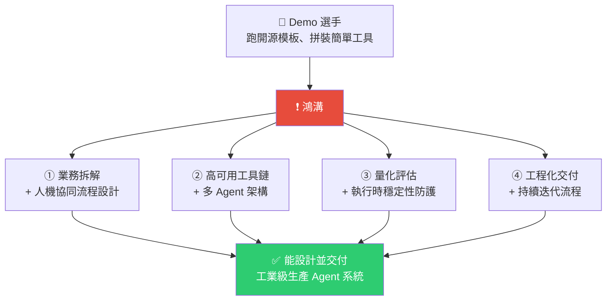
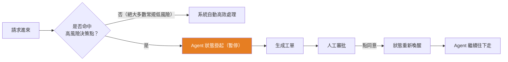
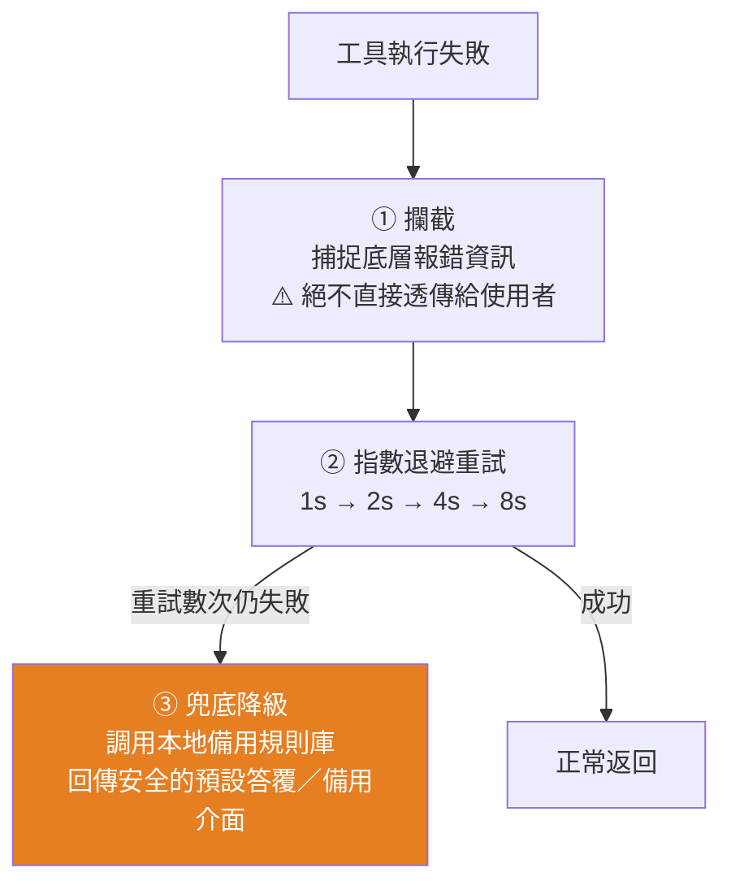
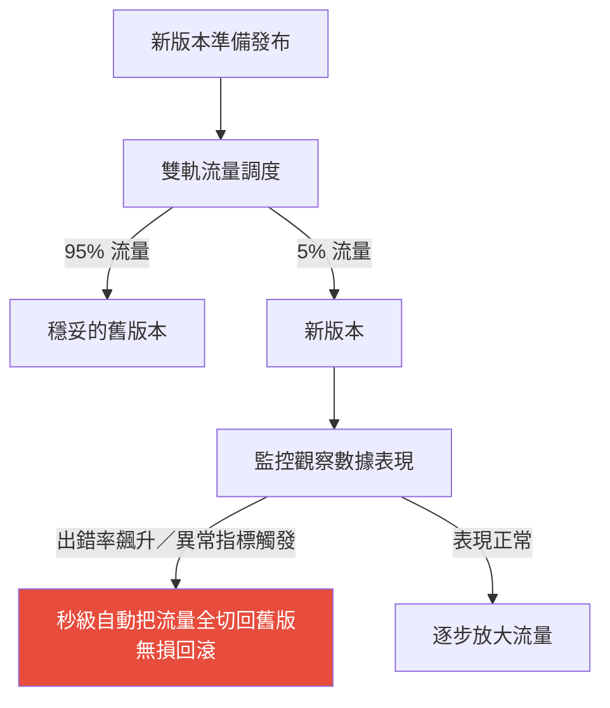

# 2026 年 Agent 開發工程師要什麼能力:從 Demo 到生產系統的四塊拼圖(附面試題與標準答案)

> 整理自 YouTube 頻道 **白白說大模型**〈26 年 Agent 開發工程師需要什麼能力?〉(2026-07-31,約 16 分鐘)。開場的觀察很扎心:大廠面試官吐槽,**十個來面試的,九個履歷寫得天花亂墜,一問到「三方接口斷了你的系統怎麼自動降級」「高並發下上下文怎麼壓縮」就啞火。** 企業拿著 30–40k 的月薪,卻找不到一個能解決線上崩潰問題的工程師。
>
> 核心落差一句話:**開發者還在比較「哪個框架的提示詞模板更好用」,企業已經在頭疼「供應鏈怎麼不出差錯、業務怎麼穩妥跑通」。**

---

## 一句話總結:四塊技能拼圖



> 影片的結論:該補齊的**絕對不是去死記硬背哪個開源框架的 API**,而是把這四個板塊拼成一幅完整的技能拼圖。

---

## 一、鴻溝在哪:Demo 環境 vs 生產環境

| 面向 | 自己跑的 Demo | 企業生產系統 |
|---|---|---|
| 網路與接口 | 預設**永遠通暢** | 網路會斷、接口會超時、三方服務隨時卡頓 |
| 模型輸出 | 手動測兩三個 case,感覺還行就過 | **模型隨時會產生幻覺**,必須有自我糾錯與異常重試 |
| 併發 | 一個人用 | **成千上萬使用者同時線上**,要扛高並發、壓低延遲 |
| 驗收 | 「我覺得效果挺好的」 | **要量化評估每一次任務的成敗** |
| 失敗處理 | 前端直接報一個錯誤代碼給使用者 | 絕對不可接受,必須有多級兜底 |

影片舉的具體場景:一家傳統製造企業要做**智慧供應鏈調度與異常自動處理系統**。企業真正面對的是——**某個供應商突然不發貨了、物流系統的 API 超時了**,這時候你的 agent 要怎麼自動識別異常、怎麼做高容錯的邏輯重試、怎麼保證多級兜底策略不讓業務中斷。

> **用可視化工具拖拉拽做工作流,只代表跨過了入門那道坎。** 真正拉開身價的是:設計出高並發、低延遲、且在遇到網路與接口風暴時具備自我糾錯與兜底能力的生產級系統。

---

## 二、第一塊拼圖:業務拆解與人機協同

### 老闆的需求永遠是模糊的

業務方不會把技術細節寫進需求文件,他只會丟給你一句「**幫我們把客服部門的營運成本降下來**」。

面對這種需求,**一上來就寫程式碼調大模型,多半會做成一個自嗨的 Demo**。正確的第一步是:

```
商業目標 → 工程邏輯 → 找出高風險決策點 → 變成可量化、能自動執行的技術指標
```

### 核心設計思想:人機協同(Human-in-the-Loop)

在真實業務裡,**不可能把所有決策都完整交給大模型去賭**。涉及大額資金退款、VIP 客戶的高風險合約,模型萬一判斷錯,損失無法挽回。



> 類比:去店裡買貴重商品,**小額刷卡直接過,大額消費必須經理簽字**。安全感立刻就上去了。

### ReAct 深度執行機制

引導模型像人一樣思考,設計 **思考 → 行動 → 觀察 → 策略調整** 的循環。

> 解一道複雜工程難題時,你絕不會閉著眼睛一口氣寫完所有答案;你會先想第一步該幹嘛、做完看反饋對不對、不對就趕緊換解法。**大模型也一樣,不能讓它盲目硬猜。**

面對執行週期很長的宏大任務,工程師必須在背後**把目標拆成一個個清晰的子任務節點**——因為路太長,模型半路容易迷失方向。**把台階一級級墊好**,它才能穩穩走到終點。

---

## 三、第二塊拼圖:高可用工具鏈與多 Agent 架構

### 讓工具調用「調得準」的兩個絕招

| 絕招 | 做法 | 類比 |
|---|---|---|
| **結構化輸入** | 給模型**極其清晰、完全沒有歧義**的工具描述(精簡的 API 描述) | 組裝家具的說明書寫到連螺絲型號、墊片正反面都一清二楚,你裝錯的機率自然極低 |
| **行為對齊** | 光給說明書不夠時,在提示詞裡直接放**幾個經典示範(few-shot)**,教它在複雜情況下怎麼精準填參數 | 帶實習生:除了發操作手冊,最好再帶他看幾個優秀的範例 |

### 高容錯執行鏈路:三階段



**重試絕不能像瘋狂刷新一樣在一秒內拚命重試**——那不只解決不了問題,還可能把對方伺服器沖垮。必須用**指數退避(exponential backoff)**:一次比一次多等幾秒。

> 降級的類比:超市買單時微信支付接口突然掛了,**收銀員不會把商品收走,而是讓你掃支付寶、付現金或刷卡**。這就是降級的智慧。

### 多 Agent 協作架構

一個 agent 的腦子不夠用時,升級成多智能體:**一個主控 Agent(調度員 / 部門主管)理解整體意圖並分發任務,底下一群各司其職的專業子 Agent**(管庫存的專心管庫存、管財務的專心管財務),各自擁有獨立的專有權限。

**但多 Agent 開會有個很頭疼的問題:你一言我一語,聊著聊著上下文視窗爆了,token 費用暴增、模型記憶也開始模糊。**

### 上下文壓縮的兩個辦法

| 方法 | 做法 |
|---|---|
| **動態提取** | 像畫重點一樣,只把歷史對話裡**最核心的語意**挑出來存入向量庫 |
| **滑動視窗** | 把很久以前、跟當前任務無關的廢話**直接清理掉** |

> 效果:既幫企業省下大筆 token 開銷,又保證模型幹活時不會出現「貴人多忘事」的尷尬。

---

## 四、第三塊拼圖:量化評估與執行時防護

### 三個黃金指標(告別「拍腦袋的玄學評估」)

| # | 指標 | 建議門檻 | 意義 |
|---|---|---|---|
| 1 | **任務完成率** | **> 95%** | 使用者提出的需求,系統端到端最終完成的比例 |
| 2 | **工具調用異常率** | **< 0.1%(千分之一)** | 接口調錯、超時、返回格式不對的比例 |
| 3 | **P99 響應延遲** | **< 500ms** | 最慢、併發最高的那 1% 情況下,系統回饋給使用者的延遲 |

> 「老闆我覺得我測了幾次效果挺好的」——大公司要的是硬指標、是數據。

### 執行時的兩道防護

**線上最怕什麼?最怕模型邏輯混亂、自己跟自己槓上,陷入死循環瘋狂轉圈,甚至在那瘋狂調接口。**

| 防護 | 機制 |
|---|---|
| **防死鎖 + 執行深度檢測** | 一旦發現它在錯誤路徑上不停推理、沒完沒了地循環,**必須強制打斷** |
| **接口調用熔斷** | 一旦偵測到極短時間內調用頻率異常,**立刻切斷、進入安全保護狀態,同時報警給開發人員** |

> 為什麼熔斷是必須的:模型邏輯一崩,**一秒鐘瘋狂調了幾百次付費 API,一個晚上的 token 帳單就能讓公司大出血。**
>
> **沒有可觀測性與異常兜底的 Agent 系統在線上跑,就如同懸掛在半空的定時炸彈。**

---

## 五、第四塊拼圖:工程化交付與持續迭代

### 自動化測試:LLM-as-a-Judge 回歸測試

傳統軟體測試很簡單——輸入 A,輸出一定是固定的 B,寫個單元測試比對字串就行。**但大模型是不確定的**,每次說話的語氣和用詞都可能不一樣,怎麼自動化?

**引入「用大模型評測大模型」的機制(LLM-as-a-Judge)**:

```
開發人員提交新程式碼
    ↓
後台自動觸發一輪回歸測試
    ↓
用一個理解力更強、邏輯更嚴密的頂級大模型當裁判
評估新版本 Agent 的回答品質與邏輯路徑
    ↓
裁判判定通過 → 放行到下一環節
裁判判定失敗 → 立刻攔截並報警
```

### 灰度發布:控制「爆炸半徑」



> 即便程式碼出問題,**受影響的也只有那一小部分測試流量,大盤業務完全不受影響。**

### 另外兩個長期問題

| 問題 | 解法 |
|---|---|
| **基礎模型升級換代太快**,新舊模型「脾氣」不同,原本寫好的提示詞換了新模型可能就失效 | 建立一套**快速測試 + 提示詞與鏈條工程化遷移**的流程,實現模型無縫平滑替換 |
| **多 Agent 調用鏈路太長**,線上出故障很難知道是哪一步卡了 | 引入**分散式追蹤**:每次請求打上唯一的 **Trace ID**,無論主控路由分給哪個子 agent、agent 調了哪個 API、哪一步耗時多久、報了什麼錯,都能**像查快遞單號一樣查得清清楚楚** |

---

## 六、面試題與標準答案

> 下表中標 **⭐** 的兩題是影片開頭**面試官明確點名**、最多人啞火的題目;其餘是依影片各章節內容整理出的高頻延伸題。每題附上「考官在測什麼 / 正確回答 / 加分點 / 踩雷回答」。

### ⭐ Q1|三方接口斷了,你的系統怎麼自動降級?

**考官在測什麼**:你有沒有真的扛過線上事故,還是只寫過 happy path。

**正確回答**——分三階段答,順序不能亂:

1. **攔截**:在工具調用層統一捕捉底層異常,**絕不把原始報錯透傳給使用者**(既是體驗問題也是資安問題,堆疊訊息會洩漏內部結構)。
2. **有界重試**:採用**指數退避**(1s → 2s → 4s → 8s),並且必須**有界**——寫明最大重試次數與總時間上限。強調「絕不能在一秒內瘋狂重試,那會把對方伺服器沖垮,也可能觸發對方限流把你整個 IP 封掉」。
3. **兜底降級**:重試耗盡後,切到**本地備用規則庫**,回傳一個安全、體驗可接受的預設答覆或備用介面,**保證業務不中斷**。

**加分點**:
- 主動補上**熔斷器(circuit breaker)**:接口連續失敗達閾值就直接開路,不再浪費時間重試,等半開狀態探測恢復——這比單純重試更成熟。
- 提**多級兜底**:一級降級用快取的舊資料、二級用本地規則、三級才是靜態預設值。
- 提**冪等性**:重試的前提是這個操作可以安全地重複執行,寫入類操作要帶冪等鍵,否則重試會造成重複下單/重複扣款。
- 用超市收銀的類比說明降級不是「壞掉」而是「換一條路走」。

**踩雷回答**:
- ❌「try-except 包起來,失敗就 retry」——沒有退避、沒有上界、沒有兜底,這正是面試官在篩掉的答案。
- ❌「讓大模型自己重新想一次」——模型不知道接口壞了,重想只會產生幻覺答案。

---

### ⭐ Q2|高並發下上下文怎麼壓縮?

**考官在測什麼**:你知不知道 token 成本與上下文腐化(context rot)是生產系統的真實瓶頸。

**正確回答**——先分類,再給方法:

1. **先講為什麼要壓**:多 Agent 協作時對話會快速膨脹,結果是**token 成本暴漲 + 模型記憶模糊(關鍵資訊被稀釋)**,兩個問題要一起講。
2. **動態提取(語意層)**:像畫重點一樣,把歷史對話中**最核心的語意**抽出來存進向量庫,需要時再檢索回來,而不是把全文一直帶著走。
3. **滑動視窗(時間層)**:把久遠、與當前任務無關的內容直接清掉,只保留最近 N 輪 + 一份結構化摘要。
4. **結構化狀態外置**:真正該長期保留的是**結構化的進度狀態**(進度檔案、任務清單、決策紀錄),不是原始對話——把記憶從「聊天記錄」搬到「狀態檔」。

**加分點**:
- 提**分層記憶**:短期(當前視窗)/ 中期(摘要)/ 長期(向量庫或資料庫),各有不同的淘汰策略。
- 提**壓縮的損失要可控**:壓縮本身會丟資訊,所以關鍵決策與約束條件應該進「不可壓縮區」。
- 提**prompt 前綴穩定性**:把固定內容放前面、變動內容放後面,才能吃到 **prompt cache**,這在高並發下省的錢比壓縮本身還多。
- 高並發情境下補一句:壓縮是 **CPU/額外 LLM 呼叫**,要注意壓縮本身別成為新瓶頸——可以非同步做、或只在超過門檻時才觸發。

**踩雷回答**:
- ❌「用更大的上下文視窗的模型就好了」——沒理解成本與 context rot,而且視窗越大越貴、注意力越稀釋。
- ❌「每次都全量摘要一次」——摘要本身要花錢花時間,而且反覆摘要會累積失真。

---

### Q3|老闆丟給你一句「把客服成本降下來」,你第一步做什麼?

**考官在測什麼**:你是工程師還是「接需求的人」。

**正確回答**:**先把商業目標翻譯成工程邏輯,再找出高風險決策點,最後變成可量化、能自動執行的技術指標。** 絕對不是一上來就寫程式碼調模型——那會做成自嗨 Demo。

具體展開:①拆出客服流程中哪些環節可自動化;②標出哪些環節是高風險(退款、VIP、合約);③為每個環節定義可量化的成功指標(自動解決率、轉人工率、CSAT);④才開始設計系統。

**加分點**:主動說出「我會先跟業務方確認**驗收標準**長什麼樣」——沒有驗收標準的專案必爛尾。

**踩雷回答**:❌ 直接開始講要用哪個框架、哪個模型。

---

### Q4|什麼情況該讓人介入?人機協同怎麼設計?

**考官在測什麼**:你懂不懂「不是所有決策都能交給模型賭」。

**正確回答**:設計一條高可靠的自動化執行路徑——**絕大多數常規、低風險的事讓系統自動處理;一旦命中預先定義的高風險決策點,系統自動把 Agent 狀態掛起、生成工單交人工審批,人工同意後狀態重新喚醒,Agent 再繼續往下走。**

高風險決策點的典型判準:**涉及金額大小、資料不可逆性(刪除/發送/支付)、對象重要性(VIP/合約)、以及模型自身信心度低於門檻**。

**加分點**:
- 強調**狀態要能持久化**——掛起後如果進程重啟,任務不能丟,所以狀態必須落到資料庫而不是記憶體。
- 提「大額消費要經理簽字」的類比,說明這是**風控設計**而非技術限制。

**踩雷回答**:❌「重要的事情就讓使用者自己確認一下」——沒有分級、沒有狀態掛起機制,實務上會變成每一步都彈確認框。

---

### Q5|怎麼保證大模型在高並發下工具調用調得準?

**考官在測什麼**:你有沒有處理過工具選錯、參數填錯這類最常見的線上問題。

**正確回答**——兩個抓手:

1. **結構化輸入**:提供極其清晰、**完全沒有歧義**的工具描述。名稱要能望文生義、參數要有型別與範例、必填選填要標清楚、相似工具之間要在描述裡寫明「什麼時候該用我、什麼時候不該用我」。
2. **行為對齊(few-shot)**:複雜業務邏輯光靠說明書不夠,在提示詞裡直接給幾個經典示範,教模型在各種複雜情況下怎麼精準填參數。

**加分點**:
- 補上**工具寧窄勿寬**:工具數量一多,選擇錯誤率直線上升、上下文變嘈雜,模型反而更困惑。**更多工具不會自動等於更好結果。**
- 提**輸出驗證**:用 JSON Schema 強制校驗參數,校驗失敗就帶著錯誤訊息讓模型重填,而不是直接送出去。
- 提**工具分組/漸進式披露**:依當前任務階段只暴露相關工具子集。

**踩雷回答**:❌「用更強的模型」——這是把工程問題推給模型。

---

### Q6|多 Agent 架構怎麼設計?什麼時候才需要?

**考官在測什麼**:會不會為了炫技過度設計。

**正確回答**:典型結構是**一個主控 Agent 負責理解整體意圖並分發任務,底下一群各司其職的專業子 Agent,各自持有獨立的專有權限**(管庫存的只有庫存權限,管財務的只有財務權限)——**權限隔離本身就是安全設計**。

但要主動說出**判準**:只有當任務存在**實質性的條件分支、並行執行、多級審批、錯誤恢復路徑,或確實需要多個領域專家協同**時才上多 Agent。**單 Agent 加幾個工具能解決的,就別上多 Agent**——複雜度與 token 成本都會翻倍。

**加分點**:提多 Agent 最大的實務痛點是**上下文膨脹**(接 Q2),以及**責任邊界模糊導致排障困難**(接 Q10 的 Trace ID)。

**踩雷回答**:❌「多 Agent 一定比單 Agent 強」。

---

### Q7|你怎麼向老闆證明這個 Agent 系統是靠譜的?

**考官在測什麼**:有沒有量化思維。

**正確回答**:給三個黃金指標,並且**每個都要說出門檻數字**:

| 指標 | 門檻 | 定義 |
|---|---|---|
| 任務完成率 | **> 95%** | 端到端最終完成的比例 |
| 工具調用異常率 | **< 0.1%** | 調錯、超時、格式不對的比例 |
| P99 響應延遲 | **< 500ms** | 最慢那 1% 情況下的延遲 |

**特別強調為什麼看 P99 而不是平均值**:平均值會被大量快速請求拉低,掩蓋掉那 1% 體驗極差的使用者;而在高併發下,正是那 1% 會引發客訴與雪崩。

**加分點**:
- 補上**成本指標**:每次任務的平均 token 成本、每日總花費——老闆真正在意的常常是這個。
- 補上**離線評測集**:維護一個 golden dataset,每次改動都跑一遍,而不是只看線上指標。

**踩雷回答**:❌「我測了幾次,效果挺好的」——這正是影片點名的「拍腦袋玄學評估」。

---

### Q8|Agent 在線上陷入死循環、瘋狂調接口,怎麼辦?

**考官在測什麼**:你知不知道 agent 會燒錢燒到失控。

**正確回答**——兩層防護:

1. **防死鎖 + 執行深度檢測**:設定最大步數/最大深度,一旦發現它在錯誤路徑上不停推理、沒完沒了循環,**強制打斷**。可再加「連續 N 輪沒有產生新證據就中止」的規則。
2. **接口調用熔斷**:偵測到極短時間內調用頻率異常就**立刻切斷、進入安全保護狀態,並報警給開發人員**。

**加分點**:
- 明確講出風險量級:**模型邏輯一崩,一秒鐘調幾百次付費 API,一個晚上的帳單就能讓公司大出血。**
- 補上**token 預算上限**當最後一道保險絲:每個任務設定硬性 token 上限,超過直接終止。
- 引用「沒有可觀測性與異常兜底的 Agent 系統,就是懸在半空的定時炸彈」。

**踩雷回答**:❌「加個 max_iterations 就好」——只答了一半,沒有熔斷、沒有報警、沒有成本護欄。

---

### Q9|大模型輸出不確定,自動化測試怎麼做?

**考官在測什麼**:知不知道傳統單元測試在 LLM 上失效。

**正確回答**:先點出問題——**傳統測試是「輸入 A 必得輸出 B」,可以比對字串;但大模型每次的語氣用詞都可能不同,無法直接比對。**

解法是引入 **LLM-as-a-Judge 回歸測試**:開發者一提交新程式碼,後台自動觸發一輪回歸;用一個理解力更強、邏輯更嚴密的頂級模型當裁判,評估新版本的**回答品質與邏輯路徑**;裁判通過才放行,失敗立刻攔截並報警。

**加分點**(這點很重要,能明顯拉開差距):
- **能用確定性檢查解決的,就絕對不要用 LLM 評審**——自動化測試、Schema 校驗、程式碼 diff、關鍵字必含/必不含,這些又快又便宜又穩定。**LLM-as-a-Judge 是最後手段,不是第一選擇。**
- 用 LLM 當裁判時**必須做上下文分離**:不能讓同一個模型既當選手又當裁判——**它寫的時候在哪裡瞎了,評審時往往還在同一個地方瞎**(共同盲區)。
- 除了看最終輸出,還要看 **trajectory(執行軌跡)**:路徑對不對,而不只是答案像不像。

**踩雷回答**:❌「用同一個模型自己評自己」——共同盲區,面試官會直接追問。

---

### Q10|新版本上線怎麼保證不把舊功能帶崩?線上出故障怎麼定位?

**考官在測什麼**:工程交付的成熟度。

**正確回答**——分兩塊:

**上線側:灰度發布,控制爆炸半徑**
採用雙軌流量調度:一開始絕大多數真實使用者仍走穩定舊版,只放 **5% 左右的流量**走新版;監控其數據表現,一旦出錯率飆升或異常指標觸發,**秒級自動把全部流量切回舊版,無損回滾**。這樣即便有 bug,受影響的也只有那一小部分流量。

**排障側:分散式追蹤**
每次請求進來就打上唯一的 **Trace ID**。無論主控路由把任務分給哪個子 Agent、Agent 調了哪個 API、哪一步耗時多久、報了什麼錯,都能**像查快遞單號一樣查得清清楚楚**。

**加分點**:
- 主動提**模型遷移**:基礎模型升級換代很快,新舊模型「脾氣」不同,舊提示詞換新模型可能直接失效——所以要建立**快速測試 + 提示詞與鏈條工程化遷移**的流程,實現平滑替換。
- 提回滾要**無損**:狀態與資料要相容,不能新版寫了舊版讀不懂的資料格式。
- 提 **OpenTelemetry** 這類標準,而不是自己造追蹤格式。

**踩雷回答**:❌「先在測試環境測好再全量上」——生產流量的分布永遠測不出來,面試官等的就是「灰度 + 回滾」。

---

### Q11(延伸)|Agent 排障時,你怎麼知道該修哪一層?

**正確回答**:用**環境 / 反饋 / 流程**三層定位——存取不安全、跨會話忘進度 → **Harness**(環境);結果不穩定、沒證據就宣布完成 → **Loop**(反饋);多專家嚴格順序協同、多步流程定位不到壞點 → **Graph**(流程)。詳見本庫 [[harness-loop-graph-troubleshooting-map]]。

**加分點**:補一句「需求還在三天兩頭改的階段,**不要急著上圖編排**,先用最簡單的架構跑出真實 trace 再固化」。

---

## 七、應用案例

### 案例 1|拿這四塊拼圖盤點自己的履歷缺口

把履歷上每一條 Agent 專案經驗,對照四塊拼圖標記:①業務拆解與人機協同 ②高可用工具鏈與多 Agent ③量化評估與執行時防護 ④工程化交付與迭代。

**如果你的經驗全部集中在②(接了哪些工具、用了哪個框架),那正是影片說的「履歷天花亂墜、一問就啞火」的典型。** ③和④才是面試官真正在篩的,而這兩塊恰恰最容易靠「補一套監控 + 一組評測集」在現有專案上補齊。

### 案例 2|為現有的 agent 補上三個黃金指標

不用一次做完整的可觀測性平台,先埋三個數:每次任務記錄 ①是否端到端完成 ②工具調用有沒有異常 ③耗時。跑一週後你會發現真實數字通常遠低於你的直覺——**這份數據本身就是最好的面試素材與說服老闆的籌碼**。

### 案例 3|把「重試」改成「有界重試 + 兜底」

翻出程式碼裡所有 retry,逐個補齊:指數退避、最大次數、總時間上限、具名的兜底路徑。同時檢查**這個操作是不是冪等的**——不冪等的寫入操作在重試時會造成重複執行,這是實務上比「沒有降級」更致命的坑。

### 案例 4|給高風險動作補上人機協同閘門

盤點你的 agent 能執行的所有動作,按「不可逆程度 × 影響範圍」排序,取前幾名(通常是刪除、發送對外訊息、金流、修改權限)接上審批閘門:狀態掛起 → 生成工單 → 人工確認 → 喚醒續跑。**關鍵是狀態要落到資料庫,不能只在記憶體裡。**

### 案例 5|本倉庫的對照

本專案四個每日 cron 就是小型生產 agent,對照本文檢視:
- **有量化的成功判準**:去重用 `grep` exit code(0=SEEN / 非 0=NEW),不是讓模型自己說「應該處理過了」——符合「證據驅動」。
- **有兜底降級**:`git push` 遇 LFS locksverify 錯誤時,fallback 到 `-c ...locksverify=false` 重試;下載音訊遇 403 則提高 `--retries` 重試(注意:實測**不要改 `player_client`**,反而會誤判成 DRM protected)。
- **有持久化**:排程 prompt 原文與踩坑紀錄落在 `SCHEDULES.md`,新 session 一讀就接得上——正是「跨會話別忘進度」那條。
- **仍缺的**:沒有量化指標(如每日成功率)、沒有 token 預算熔斷。這也正好說明:**大多數人的 agent 缺的都是第③塊拼圖。**

---

## 重點回顧(TL;DR)

- **落差的本質**:開發者在比框架與提示詞模板,企業在頭疼業務怎麼穩妥跑通。**拖拉拽做工作流只代表入門。**
- **四塊拼圖**:①業務拆解 + 人機協同 ②高可用工具鏈 + 多 Agent ③量化評估 + 執行時防護 ④工程化交付 + 持續迭代。
- **人機協同**:低風險自動跑,命中高風險決策點就**掛起 → 工單 → 人工審批 → 喚醒續跑**。
- **高容錯三階段**:攔截(別透傳報錯)→ 指數退避重試(別瘋狂重試沖垮對方)→ 兜底降級(本地備用規則庫)。
- **工具調得準的兩招**:結構化輸入(零歧義描述)+ 行為對齊(few-shot 示範)。
- **上下文壓縮兩招**:動態提取(核心語意入向量庫)+ 滑動視窗(清掉無關歷史)。
- **三個黃金指標**:任務完成率 >95%、工具異常率 <0.1%、P99 延遲 <500ms。
- **執行時防護**:防死鎖 + 執行深度檢測、接口熔斷 + 報警——**沒有可觀測性與兜底的 agent 就是懸在半空的定時炸彈**。
- **工程化交付**:LLM-as-a-Judge 回歸測試 + 灰度發布(5% 流量、秒級無損回滾)+ Trace ID 分散式追蹤 + 模型遷移流程。
- **心法**:該補的**不是死背某個框架的 API**,是把四塊拼圖拼完整。

---

## 來源

- 白白說大模型(YouTube),〈26 年 Agent 開發工程師需要什麼能力?〉(2026-07-31,約 16 分鐘):<https://www.youtube.com/watch?v=oBy94l_48CQ>
  - ⚠️ 該片無官方字幕也無自動字幕,**逐字稿以 CPU 版 faster-whisper(small/int8,`vad_filter=True`)轉錄取得,非官方字幕**,可能有少量聽寫誤差(專有名詞如 ReAct、few-shot、P99、指數退避、LLM-as-a-Judge 等已依上下文校正)。
  - 影片開頭明確點名的兩道面試題(「三方接口斷了怎麼自動降級」「高並發下上下文怎麼壓縮」)即本文 Q1、Q2;其餘題目為依影片各章節內容整理的延伸題,**答案中的「加分點」為本文補充的業界標準實務,非影片原文**。
- 延伸(本庫):[Harness/Loop/Graph 三層排障地圖](./harness-loop-graph-troubleshooting-map.md) · [Loop Engineering 實務](./loop-engineering-when-and-how-gary-chen.md) · [Agent 最該具備的 Skill(白白說大模型)](../applications/top-skills-for-agents.md) · [工具調用:FC→MCP→CLI(白白說大模型)](./function-calling-mcp-cli-tool-evolution.md)
