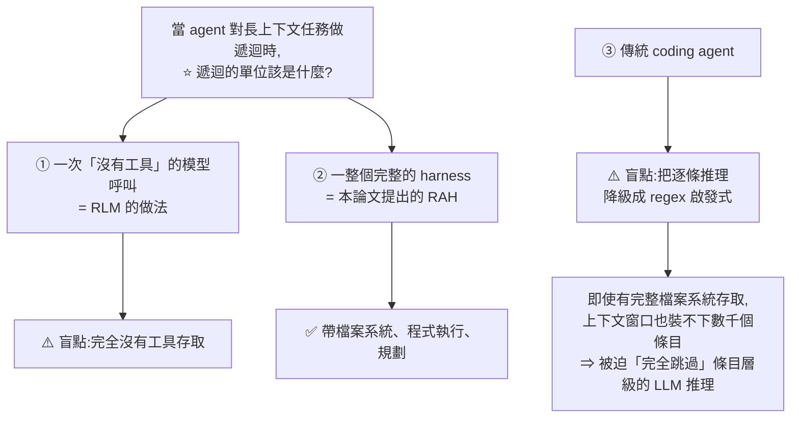

# Recursive Agent Harness:遞迴的單位該是「一次模型呼叫」還是「一整個 harness」?

> 整理自論文 **Recursive Agent Harnesses**(arXiv:2606.13643v1,2026-06-11)。
> 作者:Elias Lumer、Sahil Sen、Kevin Paul、Vamse Kumar Subbiah(**PricewaterhouseCoopers, U.S.**)。
> 依 CLAUDE.md 慣例,**以本機 PyMuPDF 抽取 PDF 全文閱讀**。

> ⭐ **這篇正好把本倉庫兩條線接起來**:[[claude-dynamic-workflows]](Anthropic 的 dynamic workflows,論文明白說那是同一個模式的生產版)與 [[graph-engineering-node-edge-state]](fan-out / fan-in)。
> 其他相關:[[agentic-harness-engineering-observability-evolution]]、[[agent-runtime-deepseek-harness-cordis]]、[[pi-minimal-agent-harness-teardown]]、[[kv-cache]]

---

## 一句話總結

**遞迴語言模型(RLM)證明了「對模型呼叫做遞迴」對長上下文推理有效。這篇問的是:如果把遞迴的單位從「一次沒有工具的模型呼叫」升級成「一整個帶檔案系統、程式執行與規劃能力的 harness」,會怎樣?**

⭐ 答案:在 Oolong-Synthetic 上,**同一個 GPT-5 骨幹下,把 Codex 的 71.75% 拉到 81.36%** —— 因為模型固定,**增益完全歸因於 harness**。

---

## 一、⭐⭐ 問題:兩條既有路線各有一個盲點

**現代 coding agent 都活在一個 harness 裡** —— 工具、檔案系統、上下文工程與編排,把 LLM 變成能工作的 agent。這些 harness 能瀏覽遠超單一上下文窗口的文件。

⚠️ **但當任務需要「對數千個獨立條目逐條做 LLM 推理」時,harness 不會遞迴 —— 它沒辦法生出「帶著自己工具」的子 agent。**



⭐ **論文用一個基準把這個對比講得很乾淨:**

> **在 Oolong 這種為長上下文推理設計的基準上——**
> **Coding agent 分數低,是因為「受 regex 侷限的逐條推理」;**
> **RLM 分數低,是因為「沒有工具存取」。**

---

## 二、RAH 的做法:用「程式碼」生 agent,而不是用「工具呼叫」

**RAH = Recursive Agent Harness。論文把它定位為「harness 遞迴」—— RLM 的「模型遞迴」的 code-first 延伸。**

### 具體機制

**父 agent 在兩種生成方式之間選擇:**

| 方式 | 用在 |
|---|---|
| ⭐ **程式執行式生成** —— 寫一支可執行腳本,**平行生出多個子 agent** | 細粒度的大量工作負載 |
| **JSON 工具呼叫式生成** | **1–5 個條目**的小型子任務 |

⭐ **而子 agent 帶著跟父 agent 一樣的生成能力** ⇒ **可遞迴分解,以一個可設定的深度上限收斂。**

### ⭐ 一個具體例子(論文用來對比三種做法)

**題目:一份 Oolong 文件,含 1,772 組標記過的鍵值對,散佈在 536K token 裡。**

| 做法 | 怎麼處理 |
|---|---|
| **Coding agent** | 寫一支腳本,在整份文件上跑 regex 比對迴圈 |
| **RLM** | 遞迴切分上下文,⚠️ **但沒有檔案存取** |
| ⭐⭐ **RAH** | **父 agent 寫一支腳本,對每個條目發一個 `Task()` 並行執行** —— **每次呼叫都解析成一個獨立的子 agent harness,各自有自己的上下文窗口、檔案系統與 LLM 呼叫** |

### ⭐⭐ 為什麼「用程式碼」比「用工具 schema」重要(全篇最關鍵的論證)

> **因為生成邏輯是「普通的程式碼」,而不是固定的遞迴呼叫慣例、也不是 schema 定義的工具,所以父 agent 可以:**
> - **用「它做其他推理時所用的同一種語言」,去參數化並行度、逐條指令與輸出路徑**
> - ⭐⭐ **並且擴展到「任何 function-call 預算都撐不住」的條目數量**

**這一段是 RAH 跟相關工作的分界線:**

| 相關工作 | 做法 | RAH 的差別 |
|---|---|---|
| **Lambda-RLM** | 確定性管線,**結構固定、無工具存取** | ⭐ **腳本由父 agent 在執行期生成,結構隨工作負載調整**,而非套用預定 schema |
| **AGENTHIVE** | 把 agent 生成當成 **schema 定義的一等工具原語** | ⭐ **直接把生成寫在可執行程式碼裡** ⇒ 並行度、輸出路徑、子 agent 指令都能用同一種語言參數化 |
| **平行函式呼叫** | 共同排程獨立的工具呼叫以降低延遲 | ⭐⭐ **RAH 把這個想法推廣到「整個 agent 呼叫」的層級** —— 生出的是數千個子 agent harness,而不是輕量的函式呼叫 |
| **AutoGen / AgentVerse** | 透過**共享訊息串**協調 agent | ⭐ **RAH 隔離每個子 agent 的上下文以防止干擾**,並透過**共享輸出檔案**做確定性彙整 |

> ⭐ **「隔離上下文 + 用檔案彙整」這一條,跟 [[graph-engineering-node-edge-state]] 的「state 要像有欄位的試算表、每個 node 只讀自己需要的」是完全同一個設計直覺。**

---

## 三、⭐ 實驗結果

**設定**:Oolong-Synthetic,**199 個隨機抽樣實例**,**橫跨全部 13 個上下文長度區間,從 1K 到 4M token**。

### 骨幹固定為 GPT-5(對齊已發表的 Codex 與 RLM 基準)

| 方法 | 分數 |
|---|---|
| **RLM** | 64.38% |
| **Codex(coding agent 基準)** | 71.75% |
| ⭐⭐ **RAH** | ⭐ **81.36%** |

⭐⭐ **因為模型被固定住,這 +9.6pp 的增益「歸因於 harness 而不是模型」** —— 這正是本倉庫 [[agentic-harness-engineering-observability-evolution]] 那篇用同一招做的控制實驗。

⭐ **而且增益「在所有上下文長度區間都一致,包含 4M token 那一格」。**

### 換更強的骨幹

| 骨幹 | 分數 |
|---|---|
| GPT-5 | 81.36% |
| ⭐ **Claude Sonnet 4.5** | ⭐ **89.77%** |

---

## 四、⭐ 論文對自己貢獻的誠實界定

這一段值得完整記下,因為它跟很多論文的寫法不同:

> **「這個機制 —— 程式執行加上子 agent 生成 —— 是由既有的原語組成的。**
> **我們的貢獻是「為這個模式命名並評估它」,不是發明這些原語。」**

⭐ **論文也直接點名 Anthropic 的 dynamic workflows**:讓 coding agent 寫一支腳本來大規模編排子 agent,**把編排當成程式碼執行而不是一輪一輪來**。

> **論文說這正是 RAH 研究的同一種 code-first 生成,而「它出現在一個生產系統裡」本身就佐證了:對 agent harness 做遞迴,正在成為「超出單一上下文窗口」這類任務的預設策略。**

⭐ **但論文也說明了自己跟產品功能的差別:**
> **它把這個模式放在「遞迴語言模型」的血緣裡來框定,而不是當成一個產品工作流;視之為模型無關、對任何 harness 開放;並提供「對照模型遞迴的受控評估」—— 那是產品功能不會提供的。**

---

## 應用案例

### 案例 1|⭐⭐ 判斷「該用工具呼叫還是該用程式碼」的分界線

RAH 自己就內建了這個判斷(程式執行式 vs JSON 工具呼叫式),而分界線很具體:

```
1–5 個子任務      ⇒ ✅ 結構化工具呼叫就好
數十到數千個      ⇒ ⭐ 寫一支腳本,在程式裡生成
```

⭐ **判準不只是「數量」,還有三個能力**:你需不需要**參數化並行度**、需不需要**逐個給不同指令**、需不需要**控制輸出路徑**。

> ⚠️ **只要有其中一項,schema 定義的工具就會開始綁手綁腳** —— 因為那些參數得先被設計進 schema 裡,而程式碼不用。

### 案例 2|⭐ 「模型固定」是評估 harness 改動的唯一乾淨方法

這篇跟 [[agentic-harness-engineering-observability-evolution]] 用了同一招,值得固化成習慣:

```
你想證明「我的 harness 改動有效」
⇒ ⚠️ 不要順便換模型、不要順便調推理等級
⇒ ✅ 骨幹完全固定,只動 harness
   → 任何差異就只能歸因於 harness
```

⭐ **而且要對齊「已發表的基準所用的骨幹」** —— RAH 特地用 GPT-5 就是為了能跟 Codex 與 RLM 的公開數字直接比較。**換了骨幹再宣稱贏過某個基準,那個比較是無效的。**

⚠️ 論文自己也示範了正確做法:換 Claude Sonnet 4.5 得到 89.77% 是**另外報告**的,沒有拿去跟 GPT-5 的基準混著比。

### 案例 3|⭐ 逐條推理 vs regex:先問「這個任務會不會被降級」

RAH 指出的 coding agent 盲點很實際:**上下文裝不下,就被迫退化成 regex。**

**自我檢查:**

| 症狀 | 意義 |
|---|---|
| 你叫 agent「逐一分析這 800 筆」,它卻寫了個 grep | ⚠️ **它不是偷懶,是上下文裝不下** |
| 結果看起來「格式對但內容淺」 | ⚠️ 同上 —— 拿到的是模式比對,不是推理 |
| ⭐ 對策 | **改成「每筆生一個子 agent」的結構**,而不是要求它更努力 |

### 案例 4|⚠️ 隔離上下文 vs 共享訊息串

RAH 選擇隔離而非共享,理由是**防止干擾 + 讓彙整可確定性地進行**。這個取捨可以推廣:

| 場景 | 該選 |
|---|---|
| **子任務彼此獨立、結果要彙總** | ⭐ **隔離上下文 + 用檔案彙整**(RAH / Graph Engineering 的做法) |
| 子任務需要互相協商、來回討論 | 共享訊息串(AutoGen 那一路) |

⚠️ **預設應該是隔離** —— 共享訊息串會讓每個 agent 的上下文被其他 agent 的內容污染,這正是 [[graph-engineering-node-edge-state]] 講的「context 污染」。

---

## 重點回顧(TL;DR)

1. ⭐⭐ **核心問題:當 agent 對長上下文任務做遞迴時,遞迴的單位該是「一次沒有工具的模型呼叫」還是「一整個完整的 harness」?**
2. **兩條既有路線各有盲點**:**coding agent** 把逐條推理降級成 **regex 啟發式**(⚠️ 因為上下文窗口裝不下數千個條目,**被迫完全跳過條目層級的 LLM 推理**);**RLM** 能遞迴切分且推理量隨切片數擴展,⚠️ **但完全沒有工具存取**。
3. ⭐ **在 Oolong 上這個對比很乾淨**:coding agent 低分是因為 regex 侷限,RLM 低分是因為沒工具。
4. **RAH = 遞迴的單位是「完整 harness」**(檔案系統工具 + 程式執行 + 規劃),論文稱之為 **harness 遞迴 —— RLM「模型遞迴」的 code-first 延伸**。
5. **兩種生成方式**:⭐ **寫可執行腳本平行生子 agent**(細粒度大量工作)、**JSON 工具呼叫**(1–5 個條目的小任務)。⭐ **子 agent 帶著跟父 agent 相同的生成能力,可遞迴分解,以可設定的深度上限收斂。**
6. **具體例子**:1,772 組鍵值對散在 536K token 裡 —— coding agent 跑 regex 迴圈;RLM 切分但無檔案存取;⭐ **RAH 的父 agent 寫腳本對每個條目發一個 `Task()` 並行跑,每個都解析成獨立的子 agent harness,各有自己的上下文窗口、檔案系統與 LLM 呼叫。**
7. ⭐⭐ **為什麼「用程式碼」而不是「用工具 schema」是關鍵**:因為生成邏輯是**普通程式碼**,父 agent 能**用它做其他推理的同一種語言去參數化並行度、逐條指令與輸出路徑**,並且**擴展到任何 function-call 預算都撐不住的條目數量**。
8. **與相關工作的分界**:**Lambda-RLM** 是固定結構的確定性管線且無工具 ⇒ RAH 的腳本**執行期生成、隨工作負載調整**;**AGENTHIVE** 把生成做成 schema 化的一等工具 ⇒ RAH **直接寫在程式碼裡**;**平行函式呼叫**是共同排程工具呼叫 ⇒ ⭐ **RAH 推廣到「整個 agent 呼叫」的層級,生的是數千個 harness 而非輕量函式呼叫**。
9. ⭐ **RAH 隔離每個子 agent 的上下文以防干擾,並透過共享輸出檔案做確定性彙整** —— 與 AutoGen / AgentVerse 的共享訊息串路線相反。
10. **實驗**:Oolong-Synthetic,**199 個隨機實例,橫跨 13 個上下文長度區間(1K 到 4M token)**。
11. ⭐⭐ **骨幹固定為 GPT-5**(對齊已發表的基準):**RLM 64.38% → Codex 71.75% → RAH 81.36%**。**因為模型固定,增益歸因於 harness 而非模型。**
12. ⭐ **增益在所有上下文長度區間都一致,包含 4M token 那一格。**
13. **換更強骨幹 Claude Sonnet 4.5:89.77%**(另外報告,沒跟 GPT-5 基準混比)。
14. ⭐ **論文對自己貢獻的界定很誠實**:「機制由既有原語組成,**我們的貢獻是為這個模式命名並評估它,不是發明這些原語**。」
15. ⭐⭐ **論文直接點名 Anthropic 的 dynamic workflows 是同一個 code-first 生成模式的生產版** —— 而「它出現在生產系統裡」本身就佐證了:**對 agent harness 做遞迴,正在成為「超出單一上下文窗口」這類任務的預設策略**。論文與產品功能的差別在於**它提供了對照模型遞迴的受控評估**。

---

## 來源

- [Recursive Agent Harnesses](https://arxiv.org/abs/2606.13643)(arXiv:2606.13643v1,2026-06-11)—— Elias Lumer 等,PricewaterhouseCoopers, U.S.
- 論文使用的基準:**Oolong-Synthetic**(199 個隨機抽樣實例,13 個上下文長度區間,1K–4M token)
- 論文明確對照的相關工作:**RLM(遞迴語言模型)**、**Lambda-RLM**、**AGENTHIVE**、**AutoGen / AgentVerse**、**Minions**、**CodeAct**、**Voyager**、**Anthropic dynamic workflows**
- 本倉庫相關筆記:[[claude-dynamic-workflows]]、[[graph-engineering-node-edge-state]]、[[agentic-harness-engineering-observability-evolution]]、[[agent-runtime-deepseek-harness-cordis]]、[[pi-minimal-agent-harness-teardown]]

> ⚠️ 本文為論文內容之整理;所有數字均出自論文自報的實驗,**未經獨立複現**。論文為 preprint(v1)。
