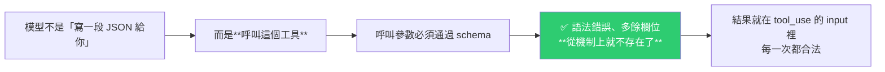

# 怎麼確保結構化 JSON 輸出真的可靠:提示詞 → Tool Use → 校驗器 → 帶錯誤的重試

> 整理自 YouTube 頻道 **Token101**〈第 13 期|如何確保結構化輸出 JSON 準確〉(2026-08-01,約 6 分半)。影片屬於一個考點導向的系列(本集講考點 4.3 與 4.4)。
>
> 場景很具體:**從合約、發票這類文件中抽取欄位,再送給下游系統**——下游要的是 JSON,欄位名與型別都已經定死。
>
> 核心一句話:**要保證輸出結構,靠的是「結構」,不是「提示詞」。**

---

## 一句話總結


---

## 一、為什麼「請輸出 JSON」不夠

同一個提示詞跑三次,會出現三種結果:

| 次數 | 結果 | 下游的下場 |
|---|---|---|
| 1 | 乾淨的 JSON | ✅ 解析成功 |
| 2 | 前面多了一句「好的,以下是提取結果」 | ❌ **開頭不是 JSON,解析直接爆掉** |
| 3 | 欄位名從 `delivery_date` 變成 `deliveryDate` | ⚠️ **最隱蔽的一種:欄位名漂移** |

把提示詞優化成「只輸出 JSON,別加別的」**可能會好一點,但它依然是一種機率,不是保證。**

> 第三種特別危險——**它不會報錯,只會安靜地讓下游拿不到欄位。**

---

## 二、第一道鎖:Tool Use + Schema(管「形狀」)

做法:定義一個工具(例如 `extract_contract`),**把你要的 JSON 結構寫成這個工具的 input schema**。



### ⚠️ 關鍵開關:`tool_choice` 的三個檔位

| 檔位 | 行為 | 用在抽取管線的問題 |
|---|---|---|
| **auto** | **模型自己決定要不要呼叫** | ❌ **它可能不呼叫、回你一段文字 → 抽取管線直接斷掉** |
| **any** | **必須呼叫某一個工具** | ✅ 有多個抽取 schema、文件類型不固定時,**用這個兜底** |
| **指定工具** | 強制呼叫指定的那一個 | ✅ 要**鎖死執行順序**時用(例如強制先跑 `extract_metadata`,再做後續複雜步驟) |

> **在合約抽取這類管線裡,`tool_choice` 起碼要選 `any`;要鎖死順序就用「指定工具」。**

---

## 三、第二道鎖:校驗器(管「對錯」)

Schema 過了,語法就沒問題了。**但 schema 擋不住另一種錯誤:語意錯誤。**

影片的例子很清楚:一份輸出的 schema 完全合法、型別也全對,**但把三行明細的金額加起來是 3,800,輸出的 total 卻寫 40,000。**

> **這不是格式問題,是數字本身錯了。Schema 管的是形狀,不管對錯。**

### 原則:能自己算的,就自己再算一遍

做法:讓模型**同時輸出 `calculated_total` 與 `stated_total`**,在程式碼裡比對;對不上就打一個標記(例如 `conflict_detected: true`)。

**不只是數字,同樣方式可以逐條校驗:**

| 可校驗的類型 | 例子 |
|---|---|
| 數值一致性 | 明細加總 vs 總額 |
| 日期範圍 | 起訖日是否合理、是否在合約期內 |
| 必填欄位 | 該有的有沒有 |
| 列舉值 | 是否落在允許的集合內 |

---

## 四、校驗失敗怎麼辦:重試「反饋環」

> ⚠️ **關鍵在「反饋」兩個字。**
>
> **不要只說「再試一次」**——模型不知道自己錯在哪,大概率會照原樣再錯一遍。

**正確的重試請求要帶三樣東西:**

```
① 原始文件
② 上一次失敗的輸出
③ 具體的校驗錯誤
```

影片示範的第二輪:模型回去讀了明細、把 total 改成 3,800,校驗器全綠。

### 但重試也有邊界

| 情況 | 重試能不能救 |
|---|---|
| 格式錯、結構錯、數字算錯 | ✅ **可以救回來** |
| **資訊壓根不在文件裡** | ❌ **重試 100 次也改不了** |

---

## 五、第三道鎖:Schema 設計兜底(處理「資訊不存在」)

既然重試救不了「資訊不存在」,就要在 schema 設計階段先留好出口:

| 情況 | 設計做法 |
|---|---|
| 這個欄位可能真的沒有 | 設成 **Optional**,**允許空值** |
| 分類分不進去 | 加一個 **`unclear`** 選項,再配一個 **`other` + `detail` 字串**,讓它有地方可以放 |
| 文件裡日期格式五花八門 | **在提示詞裡給一條規範**:先統一轉成某一種格式,再寫進 schema |

### 一個很值得抄的小設計:`detected_pattern`

**給每一條抽取結果帶一個 `detected_pattern` 欄位,記下它是根據什麼模式抽出來的。**

> 往後分析誤報時,這個欄位會是很好的判定依據——**你能知道錯的是「哪一類抽取模式」,而不是逐條看瞎猜。**

---

## 六、現況補充:原生結構化輸出

影片順帶提到:**官方 API 現在也有原生的結構化輸出**——可以在輸出設定裡直接給 JSON Schema;工具定義上也有 **strict(嚴格)開關**。

> 影片因為對應考綱而以 tool use 為主,但作者提醒:**在生產環境中,這幾個機制都要認識與了解。**

---

## 應用案例

### 案例 1|把「三道鎖」當成抽取類任務的標準架構

任何「從非結構化文件抽出結構化資料」的需求(合約、發票、履歷、財報、工單),都可以直接套這個分層:

```
第 1 層｜Tool Use + Schema  → 保證「形狀」正確（語法、欄位名、型別）
第 2 層｜校驗器（純程式碼） → 保證「內容」自洽（加總、日期、列舉、必填）
第 3 層｜帶錯誤的重試       → 救得回來的錯，讓模型自己修
第 4 層｜Schema 兜底設計    → 救不回來的錯（資訊不存在），給它合法的出口
```

**這四層的順序不能顛倒**:每一層只處理上一層擋不住的錯誤類型。

### 案例 2|`tool_choice` 是最容易被忽略的單點失效

很多人做完 tool use 就以為穩了,**但如果 `tool_choice` 留在 `auto`,模型仍然可能「決定不呼叫工具」而回一段文字** —— 這時管線就斷了,而且是間歇性的、很難重現的那種斷。

**上線前的檢查:抽取類管線一律設成 `any` 或指定工具。**

### 案例 3|「能自己算的就自己算」可以推廣成一條通則

這條原則的價值遠超 JSON 抽取:**任何模型輸出中「可以用確定性程式碼驗證」的部分,就不要相信模型。**

- 加總、百分比、日期差 → 自己算。
- URL 能不能解析、檔案存不存在 → 自己驗。
- 列舉值合不合法 → 用 Schema 或程式碼擋。

📌 這跟本庫多篇的結論完全一致:[[production-agent-engineer-skills-2026]] 的「**確定性檢查永遠優先於模型自評**」、[[google-agentic-engineering-day4-5]] 的「**證據驅動的停止規則**」、[[harness-loop-graph-troubleshooting-map]] 的「能用測試、Schema 校驗、diff 解決的,千萬別用另一個 LLM 去評審」。

### 案例 4|重試必須帶錯誤,這是 loop 設計的通則

「再試一次」是最沒有價值的重試。**有效的重試必須讓下一輪拿到上一輪沒有的資訊**——這正是 [[harness-loop-graph-troubleshooting-map]] 講的「有界重試四要素」裡那條「**每輪必須拿到的新證據**」。

**沒有新證據的重試,只是在燒 token 重複同一個失敗。**

### 案例 5|`unclear` / `other` 是防幻覺的結構性手段

當 schema 逼模型「一定要選一個分類」而它其實分不出來時,**模型只能瞎猜——這是結構逼出來的幻覺,不是模型不好。**

**給它一個合法的「我不知道」出口,幻覺率會明顯下降。** 這跟 [[neuro-symbolic-ontology-guardrails-frank-coyle]] 講的 context hallucination 是同一件事的兩面:**AI 缺資料時不會停下來說不知道,它會拿手上任何東西填空——除非你給它一個表達「不知道」的合法方式。**

### 案例 6|本倉庫可以借用的地方

我們的 cron 流程雖然不做 JSON 抽取,但**「校驗器」這一層的思路是通用的**:

- 目前去重靠 `grep` exit code,**這已經是確定性檢查**(符合案例 3)。
- 但**寫完筆記之後沒有任何自動校驗** —— 例如「`[[wiki-link]]` 指向的檔案是否存在」「README badge 數字是否與實際檔案數一致」「新筆記是否包含來源區塊」,這些全都可以用純程式碼驗證,現在卻只靠我人工注意。

**這正好是前幾天提到的 repo health check 該做的第一件事。**

---

## 重點回顧(TL;DR)

- **只靠提示詞「請輸出 JSON」是機率不是保證**:會出現前綴廢話(直接爆)、**欄位名漂移**(最隱蔽,不報錯但下游拿不到)。
- **第一道鎖:Tool Use + Schema** —— 把要的結構寫成工具的 input schema,模型改成「呼叫工具」而不是「寫 JSON」,**語法錯誤與多餘欄位從機制上就不存在**。
- **⚠️ `tool_choice` 三檔**:`auto`(可能不呼叫 → **管線會斷**)、**`any`(抽取管線至少要用這個)**、指定工具(鎖死執行順序)。
- **第二道鎖:校驗器** —— **Schema 管形狀,不管對錯**(明細加總 3,800 但 total 寫 40,000,schema 完全合法)。**能自己算的就自己再算一遍**,對不上打 `conflict_detected` 標記;數值、日期範圍、必填、列舉都適用。
- **第三道鎖:帶錯誤的重試** —— 重試要帶 **①原始文件 ②上次失敗的輸出 ③具體校驗錯誤**;**只說「再試一次」會照原樣再錯一遍**。
- **重試的邊界**:格式/結構/計算錯 → 救得回;**資訊根本不在文件裡 → 重試 100 次也沒用**。
- **第四道鎖:Schema 兜底** —— 可能缺的欄位設 **Optional 允許空值**;分類不進去給 **`unclear` + `other`/`detail`**;日期格式混亂就在提示詞裡先規範統一。
- **小設計**:每條結果帶 **`detected_pattern`**,記下是依什麼模式抽的,**日後分析誤報時是很好的判定依據**。
- 官方 API 也有**原生結構化輸出**(可直接給 JSON Schema)與工具定義的 **strict 開關**,生產環境都該了解。

---

## 來源

- Token101(YouTube),〈第 13 期|如何確保結構化輸出 JSON 準確〉(2026-08-01,約 6 分半):<https://youtu.be/hfgeEa-rg0A>
  - ⚠️ 該片無官方字幕也無自動字幕,**逐字稿以 CPU 版 faster-whisper(small/int8,`vad_filter=True`)轉錄取得,非官方字幕**,可能有少量聽寫誤差(技術名詞如 tool_choice / any、schema、Optional、strict、`detected_pattern` 等已依上下文校正)。
  - 影片為考點導向系列的一集(本集對應考點 4.3、4.4);作者預告下一集講考點 4.5、4.6:**處理一千份文件時該怎麼做、怎麼省錢、怎麼做品質檢查。**
- 延伸(本庫):[2026 Agent 工程師能力與面試題](./production-agent-engineer-skills-2026.md)(確定性檢查優先於模型自評) · [Google 課程 Day 4+5:講清楚/設邊界/做驗收](./google-agentic-engineering-day4-5.md)(證據驅動的完成定義) · [Harness/Loop/Graph 三層排障地圖](./harness-loop-graph-troubleshooting-map.md)(有界重試四要素) · [本體論護欄與神經符號 AI](./neuro-symbolic-ontology-guardrails-frank-coyle.md)(用結構擋住違反常識的輸出)
