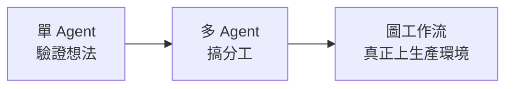
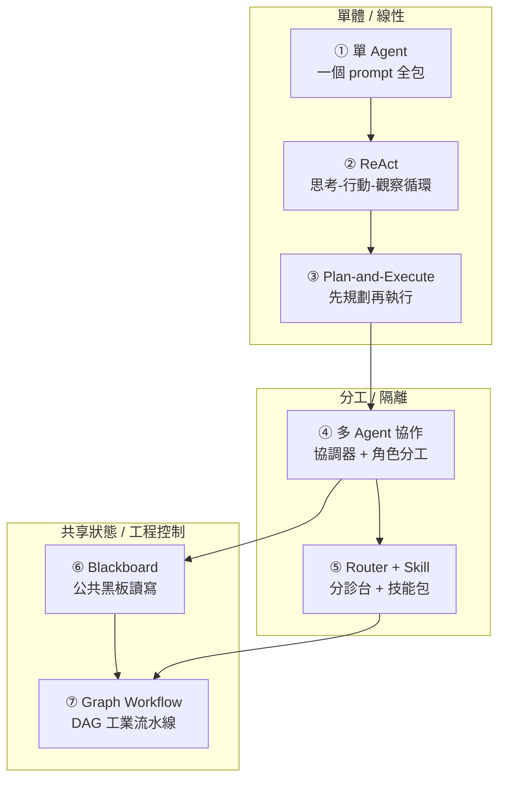
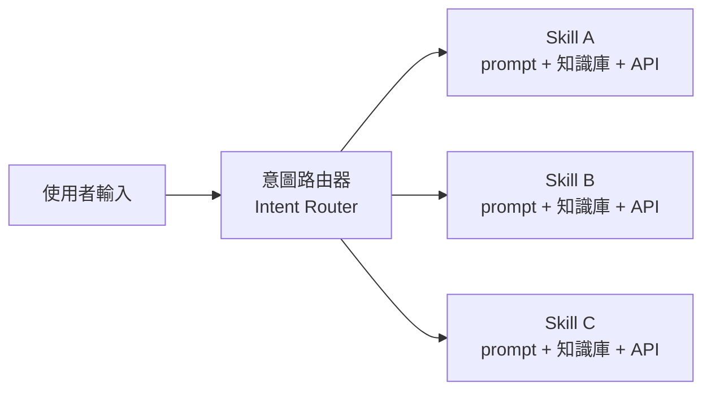

# 7 種主流 Agent 架構選型:從單槍匹馬到工業流水線,以及「多加一層」的真實代價

> 整理自 YouTube 頻道 **白白說大模型**〈7种主流AI Agent架构深度解析〉(2026-08-11,約 9.7 分鐘)。

> 📎 相關筆記:[[loop-vs-graph-debate-engineering-view]](Loop 與 Graph 之爭)、[[harness-loop-graph-troubleshooting-map]](三層排障地圖)、[[five-agent-patterns]](五種 Agent 模式)、[[agent-skill-three-layer-run-do-verify]](Skill 三層工程棧)、[[top-skills-for-agents]]、[[agent-project-resume-enterprise-grade]]

---

## 一句話總結

**很多人的 Agent demo 做得漂亮,一要商業落地就跑不通——問題通常不在模型不夠聰明,而是第一步就選錯了架構。而選型的判準不是「哪個先進」,是「你的場景有多複雜」與「你的工程系統需要多強的控場能力」。**

---

## 先記住三條前提

影片在拆解前先給了三條結論,這三條比後面的細節更重要:

### ① 架構沒有高下之分,只有匹不匹配

> 選什麼**完全看你的場景有多複雜,以及你的工程系統到底需要多強的控場能力**。
> **千萬別一上來就盲目選複雜的架構。**

### ② 技術演進路線非常清晰



這是一個**自然的遞進過程**——不是三選一,是三個階段。

### ③ AI 編程或特定功能的技能工具,首選 Router + Skill

> 如果你手上的專案是 AI 編程,或是特定功能的技能工具店,**Router + Skill 架構是目前落地最穩的方案**。

---

## 七種架構逐一拆解



---

### ① 單 Agent(L1):單槍匹馬

**結構**:使用者提一個需求 → 大模型自己思考、自己調工具 → 一步到位吐出結果。平常打開網頁跟 ChatGPT 聊天,用的就是這種最直接的模式。

| | |
|---|---|
| ✅ **優點** | **省時省錢**。只想寫個腳本調一下 API、或快速搭個 demo 驗證想法,用它最快 |
| ❌ **硬傷** | **所有業務規則、上下文與工具定義全都塞在同一個 prompt 裡**。任務步驟稍微一多,模型就容易「大腦過載」 |

> **影片的比喻很到位:這就像讓一個前台接待員,同時去幹客服、倉儲和財務。** 一開始事情少還能勉強維持,一旦業務複雜起來,立刻開始遺忘指令,甚至出現嚴重幻覺。

**定位:注定只能停留在基礎驗證階段。**

---

### ② ReAct:思考 → 行動 → 觀察

**核心機制**是一個三步循環:**思考、行動、然後觀察結果**。

> **比喻:像在迷宮裡找出口。** 你邁出一步、看一眼周圍的環境、想一想接下來該怎麼走,然後再走下一步。

| | |
|---|---|
| ✅ **優點** | **透明度高**——模型每一次是怎麼想的、調了什麼 API,看得清清楚楚。**特別適合沒有固定路線、需要一步一步探索的複雜任務** |
| ❌ **缺點 1:太燒錢** | **每一次循環都要把前面所有的思考過程和工具返回結果,一股腦全帶上,重新發給大模型。** token 消耗量非常誇張 |
| ❌ **缺點 2:容易跑偏或死循環** | 例如某個 API 報錯了,它可能就卡在原地,**反反覆覆調用同一個工具,一直到把你的額度扣光為止** |

> ⚠️ **「看起來很酷,但直接拿來做企業級系統,穩定性很讓人頭疼。」**

---

### ③ Plan-and-Execute:規劃與執行分離

既然 ReAct「走一步看一步」不夠穩,那就換個思路:**能不能先讓模型把全局計畫列出來,再按部就班執行?**

> **比喻:出遠門旅遊。** 不再是到了地方才臨時滑手機找景點,而是出發前先把攻略做好——第一步幹嘛、第二步幹嘛、第三步幹嘛——寫清楚之後,再拿著這份清單逐項落實。

**工作流程**:規劃者模型生成全局步驟 → 清洗格式 → 輸出 → 交給執行者逐步落地。

| | |
|---|---|
| ✅ **優點** | **把複雜度拆開了**,自動化任務裡的**穩定性直接拉滿**。特別適合程式碼生成、批次處理、流程固定的自動化 |
| ❌ **軟肋** | **如果最初那個計畫本身就寫錯了,後面的執行階段就會一條道走到黑。應變能力比 ReAct 差一點** |

> **這組取捨是本片最清楚的一對:ReAct 用「每步重新判斷」換靈活,Plan-and-Execute 用「一次定好」換穩定。錯誤代價的形狀不同——前者是繞圈,後者是全錯。**

---

### ④ 多 Agent 協作

前面三種本質上還是單打獨鬥或線性流水線。但真實業務裡任務太龐大:**讓同一個模型既要理解複雜的業務規則、又要寫程式碼、還要負責品質審核,它根本兼顧不過來。**

> **比喻:一個成熟的軟體開發團隊。** 最上面有一個任務協調器扮演專案經理,下面有專門做規劃的 Planner、專門寫程式碼的 Coder、以及做品質把關的 Reviewer,各司其職,由協調器統一調度。

| | |
|---|---|
| ✅ **最大好處** | **上下文污染極低**——寫程式碼的 agent 只需要看技術文件,做審查的 agent 只需要看格式規範,**各自的 prompt 是徹底隔離的** |
| ❌ **代價 1** | **token 消耗成倍增加** |
| ❌ **代價 2** | **如果 agent 之間的通信機制沒設計好,很容易出現「開無效會」或「傳話走樣」** |

> ⚠️ 「傳話走樣」這一點呼應 [[herdr-terminal-runtime-agent-to-agent]] 的實測:Claude Code 與 Codex 為了一份計畫**來回協商了 7 輪**才通過。**多 agent 省下的模型費用,有一部分會被協商回合數吃掉。**

---

### ⑤ ⭐ Router + Skill:「不讓模型想,讓模型選」

多 Agent 解決了分工,但**如果你要做的是具體的垂直產品**(AI 編程助手、企業級自動化系統),你最想要的其實是**極致的穩定與快速響應**。

**核心理念八個字:不讓模型想,讓模型選。**



> **比喻:醫院大廳的分診台。** 它不負責治病,**只負責判斷你到底是發燒了還是牙疼**,然後迅速把你送到對應的科室——也就是特定的技能包(Skill)。
> 每一個 Skill 都是**提前封裝好的獨立能力**,裡面配置好了該場景的 prompt、知識庫和 API。

| | |
|---|---|
| ✅ **極致可控** | 大模型**不需要從零開始漫天漫地推演步驟,只需要做一次精準的單選題** ⇒ **幻覺率大幅下降** |
| ✅ **響應極快** | 而且**非常利於工程上做快取** |
| ❌ **唯一代價** | **前期開發成本高**——需要像雕刻一樣,花大量精力把業務細化拆分,一個一個沉澱成 Skill |

> **影片明確推薦:這是很多大廠目前最主流的實踐,也是 AI Coding 與技能系統的首選。**

⚠️ 但要對照 [[agent-skill-three-layer-run-do-verify]] 的提醒:**Skill 是能力的施工圖,不是能力本身。** 分診台把病人送對科室之後,那個科室有沒有設備、有沒有醫生,是另一層問題。

---

### ⑥ Blackboard(黑板系統)

> **比喻:公司大廳裡掛的那塊公共白板。** 幾個不同的 agent(財務、法務、業務)**彼此之間不需要直接互相打電話發訊息,而是統一去讀寫這一塊公共黑板**。
>
> 例如:法務 agent 審完合約,在黑板的狀態欄更新一個「通過」;財務 agent 一監聽到這個狀態變化,就自動接過來把款給結了。

| | |
|---|---|
| ✅ **優點** | 適合**極複雜的動態非同步協作場景**。影片指出 **LangGraph 底層的全局狀態管理,其實就借鑑了這種思想** |
| ❌ **致命弱點** | **狀態管理開銷大**。由於大家都在並發讀寫這塊黑板,**一旦最終資料出錯,很難定位到底是誰在哪個時間點寫錯了什麼**——debug 非常頭疼 |

> ⚠️ **這正是 [[loop-vs-graph-debate-engineering-view]] 那條原則的反面教材:「狀態要外置,且要有所有者。」** 黑板做到了外置,但**沒有所有者**——所以出錯時無從追責。

---

### ⑦ Graph Workflow:基於圖的工作流

如果你要做的是**企業級硬核的生產環境系統,容不下一絲一毫的脫軌**,就必須上這個終極形態。

> **如果說前面的架構多少還給大模型留了自由發揮的空間,Graph Workflow 就是直接給它套上一條工業級的流水線。**

它用**有向無環圖(DAG)** 把整個業務流程死死框住:

- 什麼時候走條件分支
- 什麼時候多任務並行
- 萬一報錯了怎麼回溯重試

**全都由工程程式碼說了算。**

| | |
|---|---|
| ❌ **代價** | 犧牲輕量性,**開發起來比較繁重** |
| ✅ **換來** | **絕對的可靠** |

**為什麼長流程自動化非它不可?** 因為長流程最怕的就是**走到一半卡死**。而圖工作流天然支援:

- **斷點續傳**
- **人工插手審批**
- **出問題能一步一步回溯排查**

> 影片指出:**LangGraph、n8n、Prefect 等主流工具,本質上都是這個邏輯。這是目前企業級生產環境裡最重、但也最穩的一套底座。**

---

## ⭐ 一頁選型對照表

| # | 架構 | 一句話 | 何時選它 | 主要代價 |
|---|---|---|---|---|
| ① | **單 Agent** | 一個 prompt 全包 | 快速驗證 demo、寫個腳本調 API | 步驟一多就過載、遺忘、幻覺 |
| ② | **ReAct** | 思考-行動-觀察循環 | **沒有固定路線、需要自由探索**的任務 | **極燒 token;可能死循環直到額度扣光** |
| ③ | **Plan-and-Execute** | 先規劃再執行 | 流程固定的自動化、程式碼生成、批次處理 | **計畫錯了就一條道走到黑** |
| ④ | **多 Agent 協作** | 協調器 + 角色分工 | 複雜的角色分工需求 | token 成倍;**通信沒設計好會傳話走樣** |
| ⑤ | **Router + Skill** | 不讓模型想,讓模型選 | **AI Coding、技能系統、垂直產品** | 前期要把業務拆分沉澱成 Skill,成本高 |
| ⑥ | **Blackboard** | 共讀共寫一塊黑板 | 需要處理**複雜共享資料**的非同步協作 | **並發讀寫,出錯難定位** |
| ⑦ | **Graph Workflow** | DAG 工業流水線 | **企業級生產環境,容不下脫軌** | 開發繁重、犧牲輕量性 |

---

## ⭐⭐ 全片最重要的一句話

影片結尾的警告,比七種架構本身更值得記住:

> **在真實的工程落地裡,盲目多加一個 agent、多套一層循環,帶來的往往不是更聰明的產品,而是翻倍的 token 帳單和難以追蹤的幻覺。**

以及:

> **工程的本質,永遠是用最匹配的控制力,去解決最具體的問題。**
> **沒有最好的架構,只有最適合的架構。**

---

## 應用案例

### 案例 1|⭐ 用兩個問題就能定位到大致的層級

不必背七種架構。選型時只問兩件事:

```
Q1:這個任務的「路徑」是固定的,還是每次都不一樣?
    固定  → ③ Plan-and-Execute 或 ⑦ Graph Workflow
    不固定 → ② ReAct
    可以「分類到有限幾種固定路徑」→ ⑤ Router + Skill  ⭐ 多數垂直產品的答案

Q2:出錯的代價有多大?
    重跑一次就好         → ① 或 ②
    會浪費不少錢/時間     → ③ 或 ⑤
    會動到錢、正式環境、法遵 → ⑦(要斷點續傳 + 人工審批 + 可回溯)
```

⚠️ **Q1 的第三個選項是最容易被跳過、卻最常是正解的**:很多人以為自己的任務「路徑不固定」,實際上只是**沒有花時間去把它分類**。而 Router + Skill 的前期成本,買的就是這件事。

### 案例 2|辨識「你其實不需要多 Agent」的訊號

多 Agent 的真正價值是**上下文隔離**。如果你的情況不符合下面任一條,加 agent 只是加成本:

| 該用多 Agent 的訊號 | 不該用的訊號 |
|---|---|
| 不同階段需要**完全不同的知識/規範**(技術文件 vs 格式規範) | 只是「步驟比較多」——那是 ③ 的活 |
| 需要**獨立意見**(審查、對抗式檢查) | 只是想「平行跑快一點」——先確認瓶頸真的在模型 |
| 單一 prompt 已經塞爆、開始遺忘指令 | 你還沒試過先把 prompt 拆乾淨 |

> **「上下文污染」才是加 agent 的理由,「任務很大」不是。**

### 案例 3|Blackboard 要補上「所有者」

如果你確實需要共享狀態的非同步協作,直接照抄黑板會踩到它的致命弱點(出錯難定位)。補救方式:

```
每一次寫入黑板都必須帶:
  - who    :哪個 agent 寫的
  - when   :時間戳
  - why    :依據哪個輸入做出這個判斷
  - prev   :它覆蓋掉的前一個值

並且:狀態欄位要有「唯一的寫入者」——
      法務狀態只有法務 agent 能寫,財務 agent 只能讀。
```

> **這就是把 [[loop-vs-graph-debate-engineering-view]] 的「狀態外置且有所有者」補回去。** 黑板的優點(解耦)可以留,缺點(無主)必須治。

### 案例 4|對照本倉庫自己的 cron 流程

本倉庫的四個每日排程,用這張表檢視就很清楚:

| 面向 | 現況 |
|---|---|
| **實際架構** | **③ Plan-and-Execute** —— cron prompt 就是那份「事先寫好的攻略」(抓取 → 去重 → 轉錄 → 寫筆記 → commit) |
| **為什麼不用 ②** | 路徑完全固定,不需要探索;用 ReAct 只會多燒 token |
| **為什麼不用 ④** | 沒有需要獨立意見的環節;而且真正的瓶頸是 **Whisper 的 CPU 時間**,多開 agent 只會搶 CPU(所以 cron prompt 裡明寫「多支影片用單一背景進程串跑」) |
| **⚠️ 但缺 ⑦ 的一個特性** | **斷點續傳**。目前若某支影片轉錄到一半失敗,是整個任務重來,沒有中間狀態 |

而影片講的「計畫寫錯就一條道走到黑」也真實發生過——**2026-07-11 那次 grep 參數順序寫錯,導致 10 支影片全部誤判為 NEW、白跑整輪 Whisper。** 這正是 Plan-and-Execute 的典型故障模式,後來的修法(把踩坑寫進 prompt)也正是這種架構該有的迭代方式。

### 案例 5|把「多加一層的代價」量化成三個數字

影片說「多加一層帶來的是翻倍的 token 帳單和難以追蹤的幻覺」。要讓這句話可操作,加一層之前先估:

| 指標 | 怎麼估 |
|---|---|
| **Token 倍數** | 新增的 agent 要吃多少上下文?ReAct 每輪重發全歷史,成本是**二次成長**不是線性 |
| **協商回合數** | 兩個 agent 要來回幾次才收斂?**設上限**(例如「最多 3 輪,之後列出共識與分歧交人工裁決」) |
| **可觀測性缺口** | 出錯時你能不能指出是哪一層、哪一步?**答不出來就先別加** |

> 第三項最常被忽略:**加一層 agent 就是加一個你看不見的失敗點。** 這也是本倉庫流程的已知弱項——目前沒有執行時間、token 用量、成功率的紀錄。

---

## 重點回顧(TL;DR)

1. **架構沒有高下,只有匹不匹配。** 判準是「場景多複雜」+「工程系統需要多強的控場能力」。**別一上來就盲目選複雜的。**
2. **演進路線是自然遞進**:單 Agent 驗證想法 → 多 Agent 分工 → 生產環境上圖工作流。
3. **① 單 Agent** 省時省錢,但所有規則塞同一 prompt ⇒ **像讓前台同時做客服、倉儲、財務**。只適合驗證階段。
4. **② ReAct** 透明度高、適合需要探索的任務,但**每輪都重發全部歷史 ⇒ 極燒 token**,且 API 一報錯可能**卡在原地反覆調同一工具直到額度扣光**。
5. **③ Plan-and-Execute** 先出攻略再逐項落實,穩定性拉滿;**軟肋是計畫寫錯就一條道走到黑**,應變不如 ReAct。
6. **④ 多 Agent** 的真正價值是**上下文污染極低**(各自 prompt 徹底隔離);代價是 token 成倍 + **通信沒設計好會開無效會、傳話走樣**。
7. **⑤ ⭐ Router + Skill:「不讓模型想,讓模型選」。** 意圖路由器像**醫院分診台**——不治病,只判斷該去哪科。模型只做一次精準的單選題 ⇒ **幻覺率大幅下降、響應快、好做快取**。代價是前期要把業務拆分沉澱成 Skill。**AI Coding 與技能系統首選,也是大廠主流實踐。**
8. **⑥ Blackboard** 像公共白板,agent 不互發訊息而是共讀共寫;**LangGraph 底層的全局狀態管理借鑑了這個思想**。⚠️ 致命弱點:並發讀寫**出錯難定位是誰在何時寫錯什麼**。
9. **⑦ Graph Workflow** 用 DAG 把流程死死框住,分支/並行/重試**全由工程程式碼說了算**;換來**斷點續傳、人工審批、逐步回溯**。LangGraph / n8n / Prefect 本質都是這個邏輯。**最重但最穩。**
10. **⭐⭐ 最重要的一句**:盲目多加一個 agent、多套一層循環,**帶來的往往不是更聰明的產品,而是翻倍的 token 帳單和難以追蹤的幻覺**。
11. **工程的本質是用最匹配的控制力解決最具體的問題。沒有最好的架構,只有最適合的架構。**

---

## 來源

- [7种主流AI Agent架构深度解析 — 白白說大模型](https://www.youtube.com/watch?v=U9jFYSaalIc)(2026-08-11,約 9.7 分鐘)
- 本倉庫相關筆記:[[loop-vs-graph-debate-engineering-view]]、[[harness-loop-graph-troubleshooting-map]]、[[five-agent-patterns]]、[[agent-skill-three-layer-run-do-verify]]、[[herdr-terminal-runtime-agent-to-agent]]

> 該片無字幕,逐字稿以 CPU 版 faster-whisper(small / int8 / zh)轉錄取得,**非官方字幕**,可能有少量聽寫誤差。文中專有名詞已依上下文校正(轉錄中的「Rot Jaskiel / Route加Scale」為 **Router + Skill**、「Grawf or Flow / Graph or Cloth」為 **Graph Workflow**、「Land and execute / Brand Xcode」為 **Plan-and-Execute**、「Long Graph」為 **LangGraph**、「Prefix」為 **Prefect**、「偷肯」為 **token**)。
