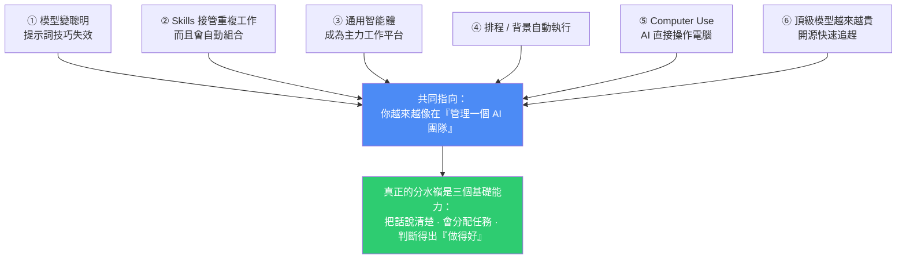
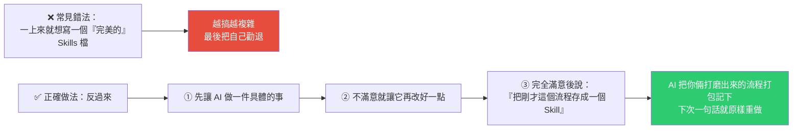
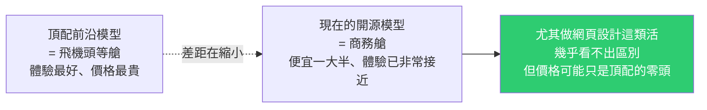
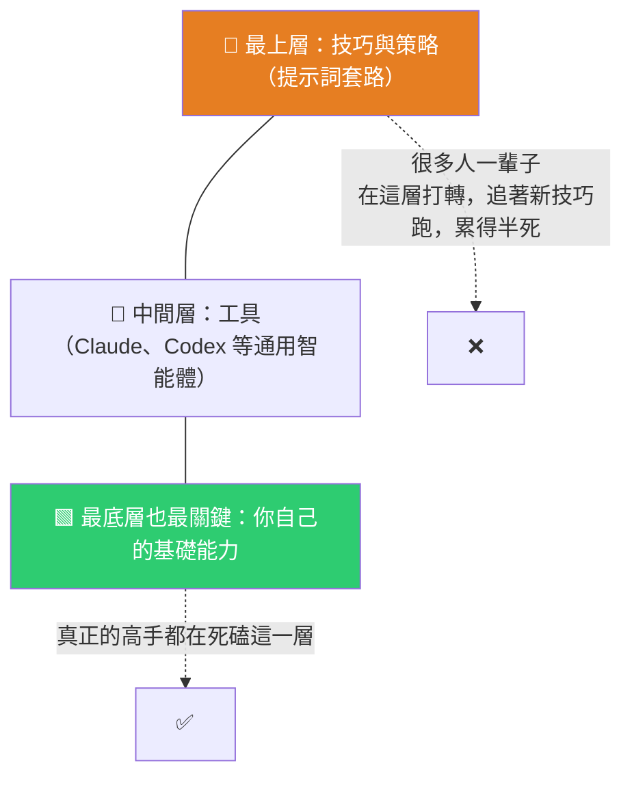

# 未來一年的 6 個 AI Agent 趨勢:從「背提示詞」到「當 AI 管理者」

> 整理自 YouTube 頻道 **李廠長來了**〈未來一年,這 6 個 AI Agent 趨勢會徹底改變你的工作方式!〉(2026-08-01,約 13 分鐘,官方繁中字幕)。
>
> 影片開場的問題很扎心:**你收藏的那堆「我希望你扮演一位資深○○專家」提示詞模板,今年再拿出來是不是沒那麼靈了?** 作者刻意不講很快會過時的技巧,而是挑六個「未來一年基本不會變」的趨勢。
>
> 全片最重要的一句留在最後:**能不能把 AI 用好,差別往往不在工具,而在人本身。**

---

## 一句話總結

---

## 趨勢一|模型夠聰明了,不必再學奇怪的提示詞

把時間倒回 2023 年初 ChatGPT 剛紅那陣子,幾乎每個人都在教提示詞技巧,最紅的開頭就是「我希望你扮演一個某某角色」。**今天基本沒人這樣說話了**——因為 AI 已經聰明到你**直接用大白話講清楚要什麼就行**,而且你把需求說得越清楚越具體,產出就越接近你腦子裡想的樣子。

同樣的邏輯也發生在圖片生成上:

| | 以前 | 現在 |
|---|---|---|
| 做圖 | 描述區要塞一堆參數(比例、風格代碼…) | **直接說**「把主標題改成紅色、背景換成淺藍、左下角 logo 放大一點」 |

> **結論:誰能最清楚地描述自己想要什麼,誰就贏了。**
>
> 唯一長期有效的「技巧」就是**把需求說清楚**。與其收藏一百個模板,不如練「把一件事講清楚」的能力。

---

## 趨勢二|Skills 正在接管一切,而且會自己組合

**Skills 就是你事先寫好、教給 AI 的一套操作說明書。** 設定好之後 AI 照標準流程做,而且**一直記著不會忘**。Claude、Claude Code、Cowork、Codex、Cursor 等主流工具現在全都支援。

### ⚠️ 多數人建立 Skills 的方法是錯的

**而且可以隨時升級**:用著用著發現哪一步不夠好,直接跟它說「這一步以後改成這樣」——它不只當場改正,還會**把改動更新回 Skill 裡**,下次叫出來就是更新過的版本。

### 更神奇的是:Skills 會自動組合

當你手上的 Skills 越來越多,AI 會開始把它們串起來用。例如你有一個「查資料」的 Skill、一個「寫週報」的 Skill,你只要說「幫我做這週的週報」,它就會**先呼叫查資料、再呼叫寫週報,一條龍做完,中間不用你提醒**。

> **原則:越是重複性高的工作,越值得做成 Skill。** 那些每週、每月固定要做的動作,一旦變成 Skill,一年下來省的時間相當可觀。**你的 Skills 庫存越豐富,AI 就越像一個懂你的老員工。**

---

## 趨勢三|通用智能體成為主力工作平台(可能是最重要的一個)

目前市場上兩大通用智能體:**Anthropic 的 Claude Cowork** 與 **OpenAI 的 Codex**。

**特點是把知識工作可能涉及的所有功能都裝進同一個平台**:聊天、寫文件、做簡報、寫程式,甚至把做好的網頁直接託管上線。**以前這件事你得開五六個不同軟體來回切換。**

### 上班族最有共鳴的場景

一個簡單的要求就能讓它:整理信箱並告訴你哪些信要回 → 把明天的會議排進行事曆 → 查一份下午會議要準備的資料。**這些可以同時在背景跑。**

> 你就像一個指揮官,指揮好幾個助理同時幹活。**關鍵是這幾個助理不會互相甩鍋、不會說「這不歸我管」。**

另外兩個值得注意的內建能力:

- **內建瀏覽器** —— AI 助手能自己上網、自己搜資訊、自己點開連結,是一個裝在 AI 裡的完整瀏覽器。
- **一鍵託管** —— 做好的網站直接發布分享,以前要另外找建站工具。

> **結論:別再糾結「我到底該學哪個 AI 工具」。挑一個你用得最順手的通用智能體當主力工作平台,就足夠你用很久。**

---

## 趨勢四|不用盯著 AI 幹活,它在背景自動完成

你在這些平台做的事,之後會逐步變成**自動執行的排程任務**。

例如跟它說「每天早上 8:30 幫我把昨天的 AI 行業新聞整理成五條摘要發給我」——它就會每天準時做好,你上班路上打開手機摘要已經躺在那裡。設定很靈活:每天循環、每週一次,甚至「下週四早晚各跑一次」這種具體要求它都聽得懂。

### 跟以前的自動化差在哪?

| | 以前 | 現在 |
|---|---|---|
| 工具 | Zapier、Make.com 這類專門工具 | **通用智能體本身** |
| 門檻 | 要學設觸發器、連流程,**光設定介面就能勸退普通人** | **用大白話說,它自己把系統搭好** |

> 📌 **本倉庫就是這個趨勢的實例**:四個每日 cron(GitHub Weekly、Gary Chen、gooaye、美投君)都是用自然語言描述的排程任務。**但也踩到了這類方案的真實限制**——session-only 排程會靜默過期,所以我們把 prompt 原文備份在 `SCHEDULES.md` 以便重建。**自動化好搭,但「自動化本身的可靠性」仍要自己設計。**

---

## 趨勢五|Computer Use:AI 直接操作電腦

以前的 AI 只能「動嘴」——你問它問題,它給建議、給答案,**真正的操作還是你自己來**。現在的 Agent 已經逐步可以「動手」:直接幫你點滑鼠、敲鍵盤。

> 影片引述的預測:**大概再過一到一年半,AI 操作電腦的熟練度可能就會超過人類自己。** 聽起來誇張,但看它進步的速度還真不好說。

**三種控制方式:**

1. 直接操作你的電腦
2. 用它自帶的瀏覽器
3. 直接接管你的 Chrome 瀏覽器

> 💡 **實用提示(影片特別提到的):** 裝了 Computer Use 卻找不到功能時,**先別懷疑是自己操作錯了**——這功能還在分批開放,你的帳號可能還沒輪到。先確認是不是最新版本;另外 **CLI、VS Code 外掛與網頁版可能沒有這個入口**。都確認過還是沒有,就再等等。

---

## 趨勢六|一枚硬幣的兩面:頂級模型更貴 vs 開源快速追趕

### 壞消息:頂配模型依然非常貴

影片引述的實測:用最頂配模型做一個手機 App,**前後大概只用了九到十次對話,按專業計費方式一算就燒掉幾百美元。**

於是有了一個新詞:**Token Budget(代幣預算)**。要用頂配 AI,**真得像過日子一樣心裡有本帳**,不然月底帳單會比你想的嚇人。

### 好消息:開源模型的水平正在飛速追上

> 影片提到:目前世界上最好的一批開源模型來自中國。

**怎麼選?看菜下飯:**

| 任務類型 | 用什麼 |
|---|---|
| 特別重要、一次性的大活 | **值得上頂配** |
| 日常大量重複、品質要求沒那麼細緻 | **交給便宜的開源模型** |

> 同一件事能用幾塊錢搞定,何必花上百塊?

---

## 最重要的一段:金字塔與三個基礎能力

六個趨勢講的都是「AI 越來越強、工具越來越好用」。那問題來了:**為什麼同樣一個 AI 工具,有人用得神乎其神,有人用起來平平無奇?**

**未來的 AI Agent 會越來越像你身邊的一個 AI 團隊**,跟它們打交道會越來越像跟一群真人同事溝通、分配任務。所以真正決定成敗的是三個能力:

| 能力 | 說明 |
|---|---|
| **把話說清楚** | 呼應趨勢一——唯一長期有效的技巧 |
| **會分配任務** | 呼應趨勢三、四——你是指揮官,不是操作員 |
| **判斷得出「什麼叫做得好」** | ⭐ **最重要的一個** |

### 為什麼「判斷力」最重要

> 如果你讓 AI 幫你寫一段程式碼,但你自己完全不懂程式,**那 AI 寫出來是好是壞你根本看不出來,你連驗收都沒辦法。**
>
> 但如果是你特別擅長的領域,AI 一交活你一眼就能看出到不到位。
>
> **所以你越是所在行業的專家,就越能放心把活交給 AI;反過來,一個你自己都摸不透的領域,就算全丟給 AI,最後也只能兩眼一抹黑,出了問題都不知道錯在哪。**

由此得出一個有意思的結論:**如果你本來就是個優秀的管理者——很會帶團隊、分配任務、判斷好壞——那你幾乎一定會成為一個優秀的「AI 管理者」。** 因為跟 AI 打交道很快就會像跟真人打交道一樣,唯一的區別是這些 AI 員工全天候幹活、不用發薪水、不會請假、也不會跟你頂嘴。

---

## 應用案例

### 案例 1|今天就把一個重複工作變成 Skill(用「反過來」的方法)

別開新檔案硬寫 Skill。挑一件你這週已經做過的重複性工作,照趨勢二的流程走:

1. 讓 AI 做一次 → 2. 不滿意就要它改 → 3. 滿意後說「把剛才這個流程存成 Skill」。

**這個順序之所以重要,是因為它把「規格」變成了「已驗證的成品的副產品」**——你不是在憑空想像流程,而是在固化一個已經跑通的流程。這跟本庫 [[matt-pocock-skills-teardown]] 與 [[superpowers-vs-matt-skills-strong-model]] 的結論一致:**強模型時代要給目標與驗證條件,不要預先把步驟寫死。**

### 案例 2|盤點你的重複工作,排出 Skill 化的優先序

用「頻率 × 每次耗時」排序:每週都要做、每次半小時以上的,最值得先做成 Skill。典型候選:週報、會議紀要整理、固定格式的資料彙整、程式碼 review checklist、發版前檢查。

⚠️ **但要注意本庫 [[claude-md-from-zero-to-mastery]] 的分界**:**提醒**放 CLAUDE.md、**長流程**放 Skill、**絕對紅線**放 Hook。不是所有東西都該塞進 Skill。

### 案例 3|建立自己的 Token Budget 概念

趨勢六的「九到十次對話燒掉幾百美元」不是嚇人,是真實的。實務做法:

- **分級用模型**:重要的一次性大活用頂配,日常重複的批次工作用便宜模型或開源模型。
- **設硬性上限**:對長時間跑的 agent 任務設 token 預算上限當保險絲——這正好對應本庫 [[production-agent-engineer-skills-2026]] 講的「接口熔斷 + token 預算」。
- **先量測再優化**:大部分人根本不知道自己的 token 花在哪。先記錄一週,你可能會發現大頭是「AI 反覆讀檔找上下文」——那該解決的是索引問題,不是模型價格問題(見 [[codebase-memory-vs-codegraph-two-routes]])。

### 案例 4|把「判斷力」當成選擇 AI 應用領域的判準

這是本片最實用的一條決策原則:**只把工作大量外包給 AI 在「你能驗收」的領域**。

- ✅ 你是行銷專家 → 讓 AI 寫文案、做競品分析,你一眼看得出好壞。
- ⚠️ 你完全不懂法律 → 讓 AI 起草合約,你無法判斷風險條款是否合理,**風險遠大於效率收益**。
- 折衷做法:在不熟的領域,把 AI 當成「幫你快速學會判斷」的老師(讓它解釋為什麼這樣做),**而不是直接交付成品**。

### 案例 5|如果你是管理者,你的既有能力就是護城河

如果你已經會帶團隊——拆任務、給清楚的交辦、驗收品質、給回饋讓人改進——**這些能力可以幾乎原封不動地遷移到管理 AI Agent 上**。反過來,如果你是個「自己動手比較快」的人,在 AI 時代反而要刻意練習「交辦與驗收」。

具體練法:下次交給 AI 一個任務時,**先寫下你的驗收標準再開始**——就像你要交辦給一個新來的同事那樣。

---

## 重點回顧(TL;DR)

- **① 提示詞技巧失效**:模型夠聰明了,大白話講清楚就好。**誰能最清楚描述自己要什麼,誰就贏。**
- **② Skills 接管重複工作**:別硬寫完美 Skill 檔——**先做一次、改到滿意、再說「存成 Skill」**;可隨時升級;Skills 多了會**自動組合**。
- **③ 通用智能體成主力平台**(Claude Cowork / Codex):文件、簡報、程式、託管、內建瀏覽器全在一處,多任務背景並行。**別再糾結該學哪個工具,挑一個順手的當主力。**
- **④ 排程與背景執行**:不用懂 Zapier / Make,用大白話就能讓它每天定時跑。
- **⑤ Computer Use**:AI 能直接點滑鼠敲鍵盤;三種方式(接管電腦 / 自帶瀏覽器 / 接管 Chrome);**找不到功能通常是分批開放還沒輪到**。
- **⑥ 貴 vs 便宜的兩面**:頂配模型十次對話可燒掉幾百美元 → **Token Budget**;開源模型已是「商務艙」,做網頁設計等任務幾乎看不出差別。**看菜下飯。**
- **⭐ 金字塔**:技巧(上)→ 工具(中)→ **基礎能力(下,最關鍵)**。多數人在最上層追新技巧追到累死,高手死磕最底層。
- **⭐ 三個能力**:把話說清楚、會分配任務、**判斷得出什麼叫做得好**。**你越是所在行業的專家,越能放心把活交給 AI。**
- **⭐ 最後的結論**:**優秀的管理者幾乎一定會成為優秀的 AI 管理者。**

---

## 來源

- 李廠長來了(YouTube),〈未來一年,這 6 個 AI Agent 趨勢會徹底改變你的工作方式!〉(2026-08-01,約 13 分鐘):<https://youtu.be/0-Rr2iho6CI>
  - 本文依該片**官方繁體中文字幕**整理(非 Whisper 轉錄)。
  - 影片時間軸:00:00 六大趨勢 / 00:47 趨勢一 / 02:15 趨勢二 / 04:20 趨勢三 / 06:03 趨勢四 / 07:13 趨勢五 / 08:31 趨勢六 / 10:28 用好 AI 的核心能力 / 12:42 總結。
- 延伸(本庫):[15 分鐘學完 CLAUDE.md](../../claude-code/claude-md-from-zero-to-mastery.md) · [Matt Pocock skills 全拆解](../applications/matt-pocock-skills-teardown.md) · [模型越強該刪 Superpowers 還是 Matt Skills](../applications/superpowers-vs-matt-skills-strong-model.md) · [2026 Agent 工程師能力與面試題](./production-agent-engineer-skills-2026.md) · [Harness/Loop/Graph 三層排障地圖](./harness-loop-graph-troubleshooting-map.md) · [Codebase-Memory-MCP vs CodeGraph](../memory-retrieval/codebase-memory-vs-codegraph-two-routes.md)
